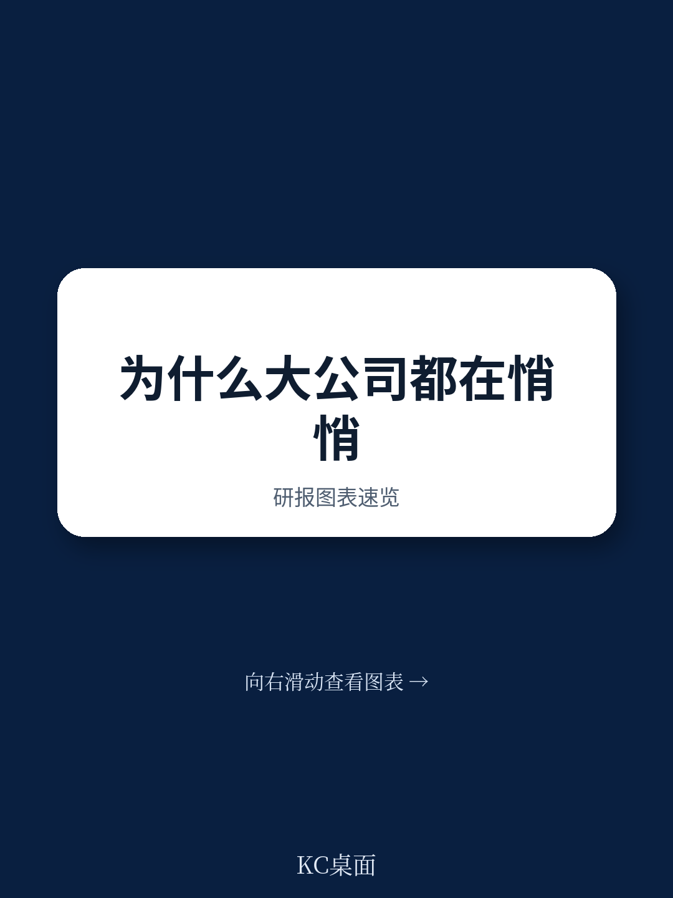
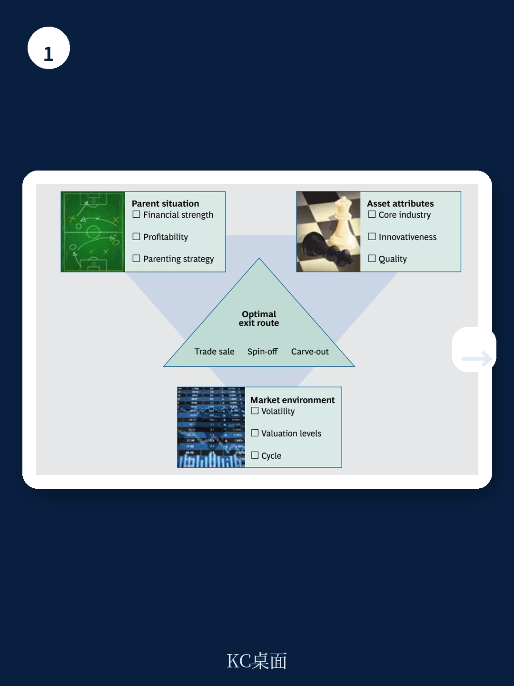
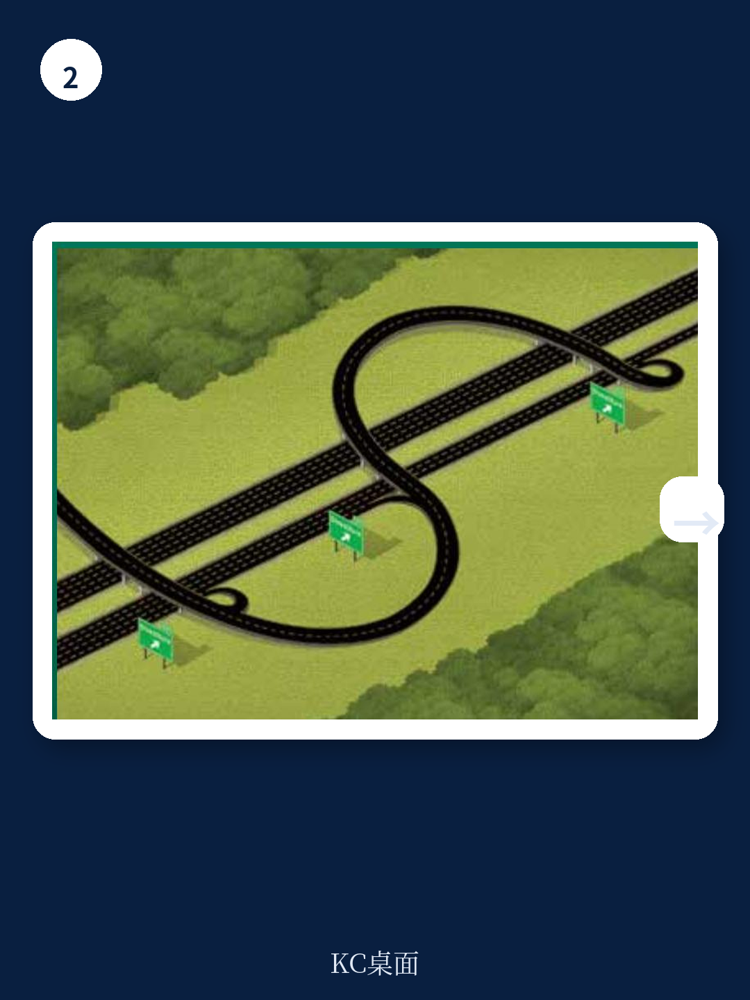

# 波士顿咨询：最大化价值-选择正确退出路径

2013年全球并购市场令多数参与者失望——交易量下降6%，交易额同比减少10%。但进入2014年，市场迅速反转：上半年交易额较2013年同期跃升62%，其中超过350亿美元的超大型交易就有5笔，占上半年总交易额的35%以上。波士顿咨询在最新年度并购报告中指出，一个被头条新闻掩盖的趋势正在成形：资产剥离正在成为并购市场中占比持续上升的板块，2013年已接近整个市场的一半。这不是简单的“卖资产”，而是越来越多CEO将其作为主动创造价值的战略工具。

报告基于BCG全球并购数据库（涵盖1990年以来近4万笔交易）和读者调查，核心判断是：资本市场明确奖励那些主动剥离非核心业务的公司，尤其是在剥离后能改善运营表现的企业。但“如何剥离”比“是否剥离”更关键——不同退出路径带来的市场回报差异显著。

## 1. 资产剥离占并购市场比重持续上升

2013年全球并购活动整体平淡，但资产剥离交易占比接近50%。这一比例延续了资金扰动后逐年上升的趋势。BCG认为，驱动因素包括：企业现金储备达到历史高位（是2000年的三倍），读者对并购态度明显转暖——2014年调查中60%的受访者支持公司更积极地开展并购，而2012年这一比例仅为23%。同时，低利率环境和充裕的债务融资为交易提供了资金基础。

报告特别指出，CEO们现在有条件从“机会视角”重新审视组合观察，核心问题是：某项资产在另一家公司手中是否可能创造更高价值？在当前环境下，答案常常是肯定的。

## 2. 剥离后运营利润率平均提升超过1个百分点

BCG的实证研究显示，从资产剥离公告到公司财年结束，EBITDA利润率平均提升超过1个百分点。资本市场在运营改善的基础上，进一步给予剥离公司更高的估值倍数。这意味着剥离带来的价值提升是双重的：运营端和估值端同时受益。

报告识别了三种主要剥离动机：聚焦核心业务、获取现金、改善运营表现。无论动机为何，剥离后公司因业务聚焦更清晰，往往能获得更高估值。资本和管理时间都是稀缺资源，管理多元业务组合的难度被市场低估，而市场确实奖励业务聚焦的公司。

> **KC评论：** 1个百分点的EBITDA利润率提升在成熟行业中并非小数字。报告隐含的逻辑是：剥离释放的管理精力和资本配置效率，可能比剥离本身获得的现金更具长期价值。读者在评估剥离决策时，应同时关注“剥离后剩余业务的运营指标变化”，而不仅仅是交易对价。

## 3. 三种退出路径的市场回报差异：分拆最受青睐

公司剥离资产有三种基本方式：直接出售给其他买家（贸易出售）、向现有股东分拆（spin-off）、以及部分公开上市（carve-out）。BCG的读者调查显示，分拆获得的资本市场回报最高。但报告强调，分拆并非自动最优选择——三个关键参数共同决定最优路径：母公司的财务状况和战略、资产自身的行业属性和质量、以及当时的市场环境（波动性、估值水平和周期位置）。

由于市场条件可能快速变化，报告建议公司同时推进多条路径，保持选择弹性。附录中列举的2013-2014年交易案例显示，从EQT出售中国餐饮业务到黑石收购fiberweb，不同交易采用了不同路径，交易规模从数百万欧元到数十亿美元不等。

## 4. 科技行业驱动北美并购领先，但估值逻辑引发市场困惑

北美在全球并购中的份额从2010年的45%上升至2014年上半年的52%，科技行业是主要驱动力。Facebook收购WhatsApp（190亿美元）、Verizon收购Vodafone持有的Verizon Wireless股份（1300亿美元）等交易均体现了公司对移动用户基础的争夺。

但资本市场对科技公司的高估值交易存在明显困惑。以Facebook收购WhatsApp为例：公告当日Facebook报价下跌5%，读者质疑190亿美元收购一家仅有55名员工、成立五年的公司的合理性。BCG的分析显示，市场最终接受了这笔交易——Facebook获得的累计异常回报（CAR）为1.1%。关键论据是：WhatsApp拥有超过4.5亿移动用户，Facebook相当于为每位移动用户支付42美元，远低于市场对Facebook自身每位移动用户141美元、Twitter 124美元的估值。

报告同时指出，尽管交易数量上升，资本市场仍难以解读创新科技公司的新商业模式和看似过高的收购估值——2000年互联网泡沫的记忆尚未完全消退。

波士顿咨询这份报告的核心贡献不在于指出“剥离是好事”，而在于提供了可操作的决策框架：什么情况下选择哪种退出路径、如何评估剥离对剩余业务的影响、以及如何在不同市场条件下保持灵活性。对于正在审视自身业务组合的企业决策者，这些判断比市场整体交易量数据更具参考价值。

For informational purposes only. Portions may be generated,translated,summarized,or edited with AI assistance based on source materials and may contain omissions or errors. Please verify independently. This is not investment,legal,tax,accounting,or other professional advice.

