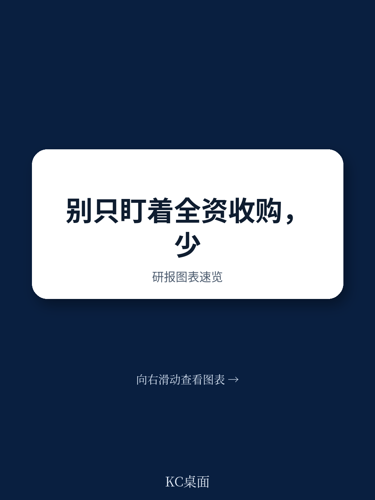
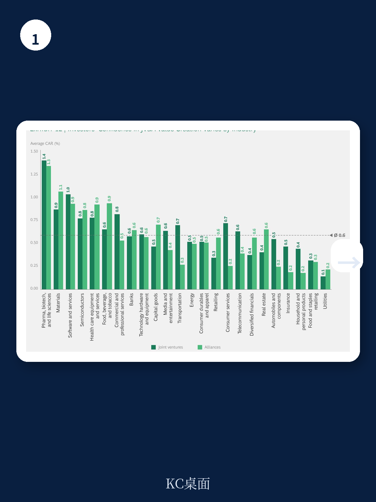
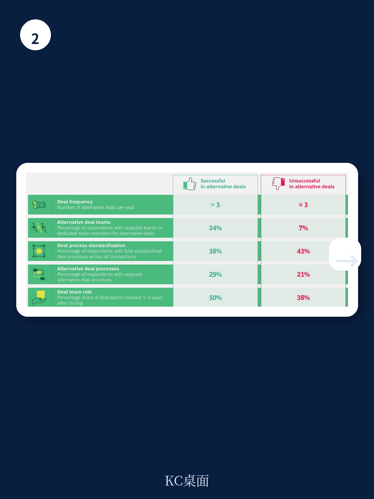

# 波士顿咨询：研究主题与行业变化观察

2020年4月，全球并购交易量较2019年12月骤降80%。但波士顿咨询这份覆盖约81万笔交易的研究发现，在传统并购急剧调整的同时，另一种交易结构正在逆势扩张——少数股权研究、合资企业与战略联盟等“替代性交易”的占比已从1990年的20%-25%升至约35%，并在2009年和2020年两次扰动中达到峰值。

这不是一个临时替代方案。报告基于约18万笔合资与联盟交易数据的分析表明，替代性交易正在成为企业获取技术能力、应对行业融合的常规工具，而非传统并购的次优选择。

## 1. 替代性交易在扰动期间占比加速攀升

波士顿咨询的数据库显示，2019年全球合资与联盟交易量达到1.1万笔的历史新高，其中软件与IT服务、商业与专业服务、医疗设备与服务领域的联盟增长最为显著。2020年上半年，尽管整体交易量大幅下滑，少数股权交易在所有交易中的占比反而进一步走高。

报告将这一趋势归因于两个驱动力：技术变革和商业模式迭代。在受访的全球交易者中，54%将技术列为替代性交易增长的首要原因，同样比例指向商业模式变化，45%提及不确定性分担与经验获取。

> **KC评论：** 替代性交易在扰动中占比上升，不是企业“退而求其次”，而是买方在不确定性中主动选择更低不确定性、更高灵活性的结构。对决策者而言，这意味着评估交易对手时，需要把少数股权研究和合资能力也纳入尽职调查范围。

## 2. 替代性交易的价值创造表现接近传统并购

波士顿咨询的长期跟踪数据显示，从1990年至2020年中，合资与联盟交易的公告回报率呈上升趋势，读者对这些结构的接受度在提高。但中长期表现并不乐观：不到一半的合资与联盟交易在一年或两年后能跑赢行业相对股东总回报。

调查结果进一步印证了这一判断。受访者表示，约40%的替代性交易未能实现既定的财务或战略目标。失败的主要原因包括：缺乏清晰的价值创造路线图、关键绩效指标和监控机制；治理结构定义不明确；以及战略逻辑不清晰。

值得注意的是，经验丰富的交易者（年均至少完成3笔替代性交易）报告的成功率为61%，而不活跃的交易者（年均2笔或以下）成功率为58%。这一差距虽然不大，但在大规模交易中足以影响数十亿资金的使用效率。

## 3. 成功交易者的组织特征：专职团队与差异化流程

报告识别出替代性交易成功企业的三个共同组织特征。首先，几乎所有成功交易者都设有专职并购团队，约25%的企业为替代性交易单独配置团队或人员。其次，29%的最成功交易者对替代性交易和传统并购采用不同的管理流程。第三，这些团队在交易执行阶段拥有完全控制权，并在交割后100天计划和整合阶段持续提供支持。

波士顿咨询据此提出一套操作框架：提前制定长期替代性交易计划并定期复盘；不因看似较低的财务不确定性而缩减尽职调查；在签约前明确并正式化交易后治理结构；使用具备替代性交易经验的人员进行谈判和管理；为关键决策者设计透明且可行的激励机制。

## 4. 扰动后的并购复苏路径：历史对比与当前信号

报告将2020年与2008-2009年资金扰动做了对比。2020年4月并购活动下降幅度超过2008年同期，但6月至8月间出现了明显回升，月度交易量恢复到正常区间的低端。截至2020年9月中旬，全年仅有15笔大型交易（价值100亿美元以上），而2019年同期为27笔。

波士顿咨询的调查显示，近三分之二的交易者预计交易量和价格要到2021年才能完全恢复。但约75%的受访者认为，宏观环境节奏变化期为并购创造的价值创造机会与正常时期相当或更优。报告援引2008-2009年的经验指出，大型转型交易的最佳时机出现在不确定性消退、融资渠道恢复、但目标公司仍处于折价状态的时间窗口。

> **KC评论：** 报告对复苏节奏的判断偏谨慎，但提供了一个可操作的观察框架——关注不确定性消退信号（市场波动率下降、融资成本稳定），而非等待交易量全面恢复。那些在窗口期完成交易的收购方，往往在复苏阶段获得结构性优势。

## 5. 长期趋势对替代性交易的结构性支撑

报告认为，疫情可能加速而非逆转几个长期趋势。低利率环境将持续支撑买方交易意愿；数字化、人工智能、自动化和大数据等技术的战略重要性在疫情后进一步提升；行业融合（如出行与科技）将继续推动交易活动。

这些趋势对企业和人才的需求，将同时促进传统并购和替代性交易的增长。波士顿咨询的判断是，替代性交易不是短期现象，而是企业交易工具箱中的常设组件。

For informational purposes only. Portions may be generated,translated,summarized,or edited with AI assistance based on source materials and may contain omissions or errors. Please verify independently. This is not investment,legal,tax,accounting,or other professional advice.

