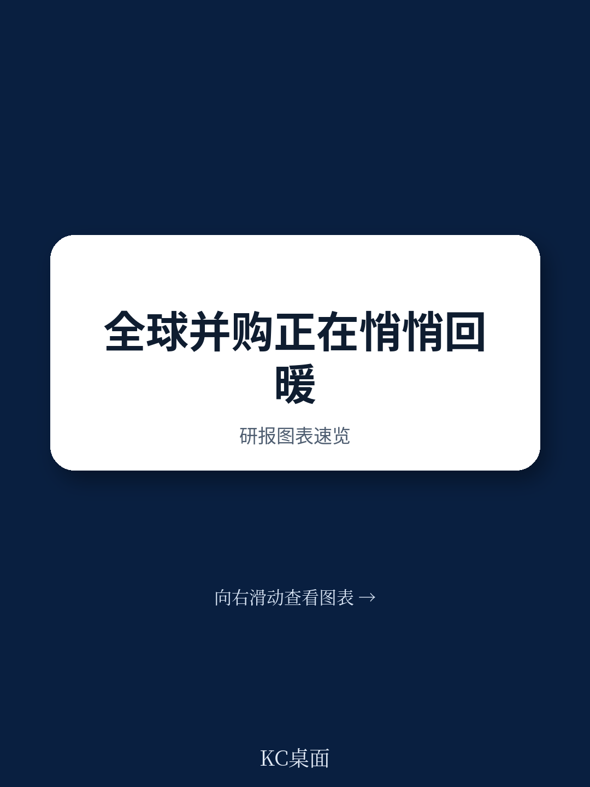

# 波士顿咨询：研究主题与行业变化观察

全球并购市场在2025年前九个月展现出温和复苏的态势。波士顿咨询最新发布的年度并购报告显示，全球交易总额同比增长10%，但这一数字掩盖了区域与行业层面的显著分化。北美市场以62%的全球交易占比继续主导，而亚太地区交易额则跌至十年低点。对于决策者而言，当前市场的核心特征并非全面回暖，而是结构性机会与系统性不确定性并存。

报告指出，交易总额的增长主要由少数大型交易驱动。前九个月中，价值超过100亿美元的超级交易达到27宗，高于2024年同期的21宗，但仍低于2021年40宗的峰值。这些大型交易高度集中于美国市场，包括联合太平洋铁路公司以715亿美元收购诺福克南方铁路，以及银湖资本联合沙特公共研究产品等以约550亿美元收购游戏公司艺电。与此同时，价值超过5亿美元的大型交易数量仍处于历史平均区间的低位，表明市场整体活跃度尚未全面恢复。

> **KC评论：** 交易总额增长与大型交易数量仍在调整并存，说明当前并购市场的复苏并非均匀分布。少数头部交易拉高了总额，但中大型交易的活跃度仍低于历史常态，这可能是买卖双方在估值和宏观预期上尚未达成一致的结果。

## 1. 北美与欧洲并购活动呈现不同走向

从区域维度看，北美市场表现强劲。涉及美洲目标公司的交易总额达1.26万亿美元，同比增长约26%，其中北美地区贡献了1.20万亿美元。加拿大市场交易额增长96%，南美和中美洲增长47%。欧洲市场则出现分化：英国交易额下降35%，法国下降29%，西班牙下降58%；但荷兰增长263%，瑞士增长109%，德国增长45%，意大利增长28%。整体而言，欧洲交易总额为3750亿美元，同比下降5%。

亚太地区交易额降至2840亿美元，为十年最低，同比下降19%。中国大陆市场交易额增长11%，新加坡增长38%，澳大利亚增长1%，但未能抵消韩国下降13%、印度下降20%、香港下降73%带来的影响。报告认为，地缘政治紧张和关税政策变化是导致部分交易暂停的主要原因，而区域聚焦型交易，尤其是中小市值交易，对这些外部冲击的抵御能力更强。

## 2. 行业并购热点集中于工业、科技与能源

行业层面，工业领域交易额同比增长77%，主要受交通运输和基础设施领域的大型交易推动。科技、媒体与电信行业增长10%，能源行业增长20%，医疗健康行业增长20%。科技行业仍是私募股权读者的重点关注领域，人工智能公司持续吸引大规模不确定性研究，尽管市场对高估值和增长路径的不确定性存在担忧。材料行业和消费行业交易额分别下降16%和17%，主要原因是大型交易减少。

私募股权领域，全球交易额同比增长38%，但交易数量与去年持平。截至2025年10月初，私募股权机构持有约2万亿美元的未部署资金，但全球募资速度自2021年峰值以来明显节奏变化，反映出资本募集环境更具挑战性。不确定性研究领域，全球融资水平同比增长约36%，但仍低于2021年和2022年的高点。

## 3. 经验丰富的交易者在不确定性中创造价值

报告的核心发现之一是，不确定性时期恰恰为具备能力的交易者提供了机会。波士顿咨询的分析显示，在宏观宏观环境仍在调整或市场波动性较高的时期，经验丰富的连续收购者（过去三年完成五笔及以上交易）在两年相对股东总回报上持续优于缺乏经验的交易者。这一规律在强宏观环境周期和弱宏观环境周期中均成立，但在不确定性环境下，经验带来的回报优势更为显著。

报告认为，成功应对不确定性的关键在于：通过针对性收购巩固核心市场地位，在熟悉范围内谨慎进行地理扩张，避免过于复杂或转型性的交易。这种纪律性策略不仅能够降低不确定性，还可能在不稳定的市场环境中释放长期价值。

## 4. 跨境交易占比下降但仍有价值创造空间

跨境并购交易占全球交易总额的比例已从2007年峰值时的50%下降至目前的约30%。报告分析认为，同一地理区域内的跨境交易通常优于同一国家内的交易或跨区域交易，因为企业在实现国际增长的同时，能够管理可控的整合复杂度。成功执行跨境交易需要应对监管障碍、地缘政治波动以及文化整合等更微妙的挑战。

报告同时指出，当前市场存在大量被压抑的供需。卖方方面，资产剥离活动较为温和，许多私募股权和企业卖家在等待更有利条件时战略性地推迟了资产出售。买方方面，许多大型和跨境交易暂时搁置，等待商业规划获得更清晰的确定性。首次公开募市场场也存在类似情况，大量公司已准备好上市，只待市场环境转好。

> **KC评论：** 跨境交易占比持续下降，但报告并未将其简单归因于保护主义。更值得关注的是，同区域跨境交易的表现优于跨区域交易，这提示决策者在制定国际化战略时，应优先考虑整合复杂度可控的邻近市场，而非盲目追求地理分散。

波士顿咨询的这份报告提供了一个观察框架：在不确定性成为常态的市场中，交易者的核心能力不是预测宏观走向，而是在波动中识别结构性机会、管理整合不确定性，并利用技术工具提升交易效率。对于企业决策者而言，当前阶段的关键问题或许不是“是否应该交易”，而是“在哪些领域、以何种方式、与谁交易”。

For informational purposes only. Portions may be generated,translated,summarized,or edited with AI assistance based on source materials and may contain omissions or errors. Please verify independently. This is not investment,legal,tax,accounting,or other professional advice.

