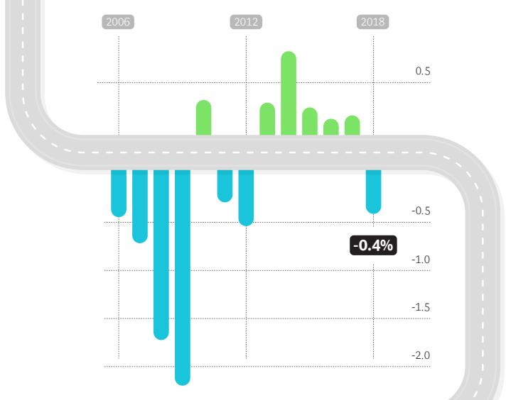
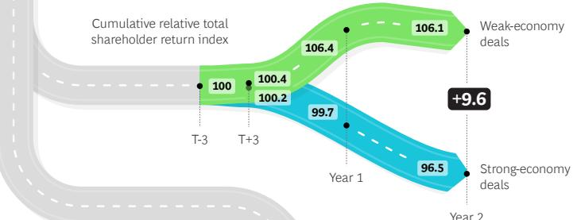
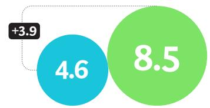
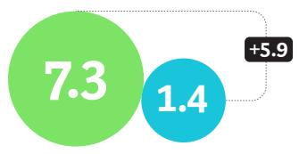

Cumulative relative total shareholder return index

## Delving Deeper into Downturn M&A

Acquirers generally see higher returns from deals made in a weak economy, a study by BCG finds

## DEALMAKERS ARE BRACING FOR A DOWNTURN AGAINST THE BACKDROP OF SOFTENING INVESTOR SUPPORT

Acquirers' cumulative abnormal returns (CARs) centered on the announcement date fell to an average of $-0.4\%$ in 2018. This is the first time since 2012 that CARs were negative for acquirers of public targets.

## EVEN IF A DOWNTURN OCCURS, DEALMAKERS SHOULD NOT BE DETERRED

In the medium term, weak-economy deals create more value for buyers than strong-economy deals. Two years after an acquisition, buyers' relative total shareholder return (RTSR) is more than 9 percentage points higher.

  
Year 2

## BOLDNESS PAYS OFF, AS DOWNTURN

In a weak economy, noncore deals (acquisitions outside the buyer's industry) create more value than core deals: 1-year RTSR is 3.9 percentage points higher

1-YEAR RTSR (%)

  
Core segment acquisition  
Noncore segment acquisition

## EXPERIENCE MATTERS, A

## LOT, WHEN IT COMES TO CREATING VALUE FROM WEAK-ECONOMY DEALS

In a downturn, experienced buyers create significantly more value from M&A than occasional buyers: 2-year RTSR of 7.3% for experienced versus 1.4% for occasional

2-YEAR RTSR (%)

  
Experienced Occasional

## TO MASTER M&A IN A DOWNTURN, BUYERS SHOULD FOLLOW A SET OF IMPERATIVES

## Be prepared

Put in place an ongoing target-screening process that covers strategic priorities — it’s a no-regrets move

## Be bold

Boldly pursue downturn M&A opportunities if they materialize — downturns are, on average, good times to make deals

## Be transformative

Use transformational deals to stay ahead of the curve and accelerate out of the recession when the upturn starts