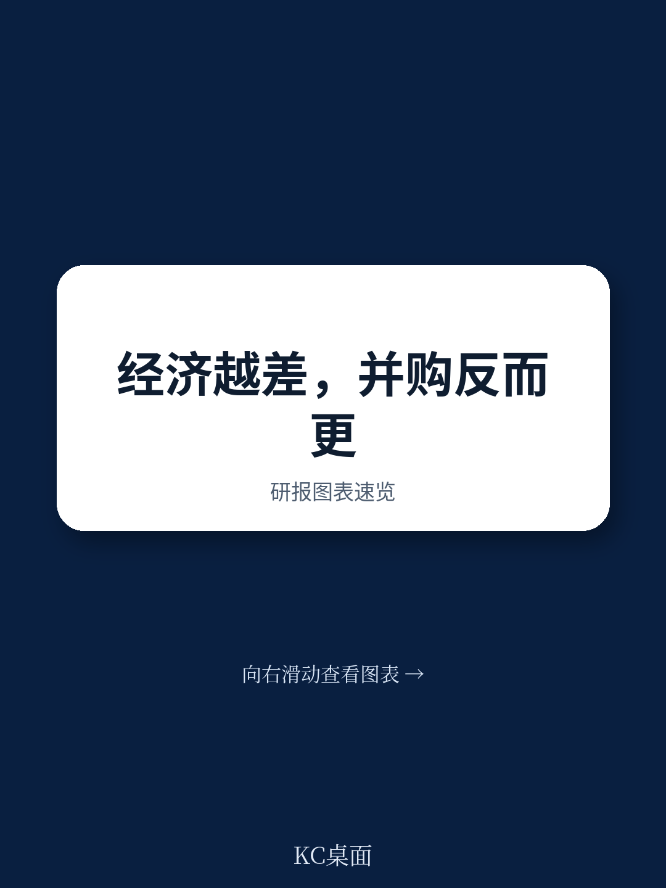
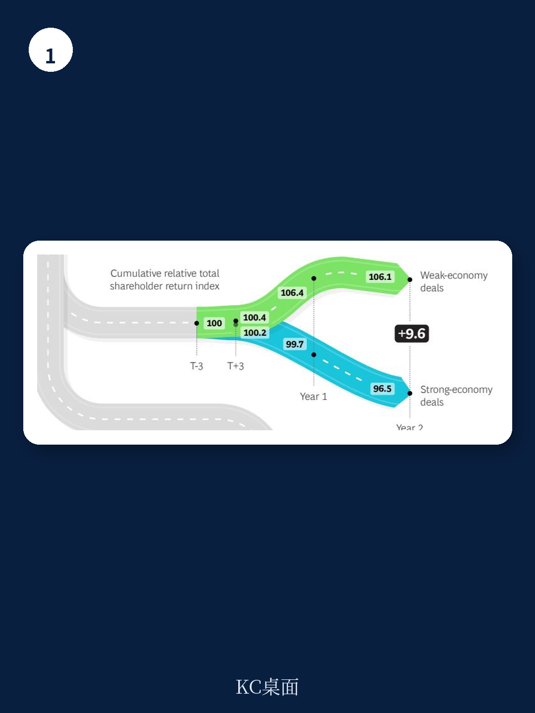

# 波士顿咨询：弱宏观环境周期并购的长期回报高于强周期

并购交易在弱宏观环境下是否值得推进，是过去两年企业决策层反复权衡的问题。波士顿咨询（BCG）近期发布的一份研究给出了一个相对明确的答案：从两年期相对股东总回报（RTSR）看，弱宏观环境周期完成的并购比强宏观环境周期高出超过9个百分点。这个差距不是边际意义上的，而是足以改变一笔交易是否值得做的判断。

报告同时指出，2018年收购方在公告日附近的累计异常回报（CAR）平均为-0.4%，这是2012年以来首次出现负值。读者对并购交易的即时反应趋于谨慎，但这与中期回报并不矛盾——市场对公告的短期定价，和交易实际创造的价值之间，存在系统性偏差。

## 1. 弱宏观环境周期交易的两年期回报优势超过9个百分点

BCG的研究以相对股东总回报为衡量口径，比较了不同宏观环境下完成的并购交易在交割后的表现。结果显示，在弱宏观环境周期完成的交易，两年后收购方的RTSR比强宏观环境周期交易高出9个百分点以上。这一差距在交易完成后的第一年就开始显现，并随时间扩大。

短期市场反应与中期回报之间的背离值得注意。2018年收购方CAR均值转负，说明读者在公告时点倾向于给出谨慎定价，但后续两年的相对回报表现却指向相反方向。报告认为，弱宏观环境周期中资产估值更低、竞争性买家更少，为收购方留出了更大的价值创造空间。

> **KC评论：** 这里的关键不是“弱周期该不该做交易”，而是市场公告日的定价和两年后的实际回报经常是两回事。看并购研究时，先分清用的是CAR还是RTSR，两者回答的问题完全不同。

## 2. 非核心收购在弱周期中的一年期回报高出3.9个百分点

报告进一步区分了核心业务收购与非核心业务收购。在弱宏观环境下，非核心收购（即买方所在行业之外的交易）的一年期RTSR比核心收购高出3.9个百分点。这个发现与常规认知存在一定出入——通常认为跨界交易不确定性更高，但BCG的数据显示，在弱周期中，非核心交易反而创造了更多价值。

可能的解释是：弱宏观环境周期中，非核心资产的卖方更急于出手，定价弹性更大；同时，买方在行业外的尽职调查往往更谨慎，对协同效应的验证也更严格。报告没有展开具体机制，但数据关系是清晰的。

## 3. 有经验的买家两年期回报为7.3%，偶发买家为1.4%

交易经验是另一个显著的分层因素。在弱宏观环境周期中，有经验的收购方（指持续进行并购交易的公司）两年期RTSR为7.3%，而偶发买家仅为1.4%。这个差距接近6个百分点，说明并购能力本身是一项可以积累的组织资产。

经验的作用在弱周期中尤其明显，因为此时尽调难度更大、定价更复杂、整合资源更紧张。报告认为，持续的目标筛选流程、对交易节奏的把控能力，以及整合执行的经验，是经验买家获得超额回报的主要来源。

## 4. 弱周期并购的三项行动原则：准备、果断、转型

BCG在报告最后给出了三项行动原则。第一是提前准备：建立持续的目标筛选流程，覆盖战略优先级，这属于“无悔动作”，无论周期如何都值得做。第二是果断：如果弱周期中的交易机会出现，应积极评估，因为从平均回报看，弱周期是适合交易的窗口。第三是转型导向：利用变革性交易在复苏启动时加速走出周期。

这三项原则的共同点是：弱周期并购的价值不在于“便宜”，而在于竞争格局的重置。当多数买家调整时，仍有交易能力和现金储备的公司，可以用同样的资本获得更好的资产、更有利的条款和更快的整合进度。

> **KC评论：** 报告最有用的部分其实是“有经验买家”和“偶发买家”的回报差距。它说明并购回报不是由单笔交易决定的，而是由一套可重复的流程决定的。对多数公司而言，与其纠结某笔交易是否划算，不如先建立持续的目标筛选机制。

波士顿咨询的这份研究基于历史交易样本，样本覆盖范围和周期定义仍有其边界，但核心结论——弱周期交易的长期回报优于强周期——在多个维度上保持一致。对于正在观望的企业决策者，报告提供的不是“该不该做”的答案，而是一个更具体的判断框架：做什么类型的交易、以什么样的组织能力去做、在什么时间窗口内完成。
