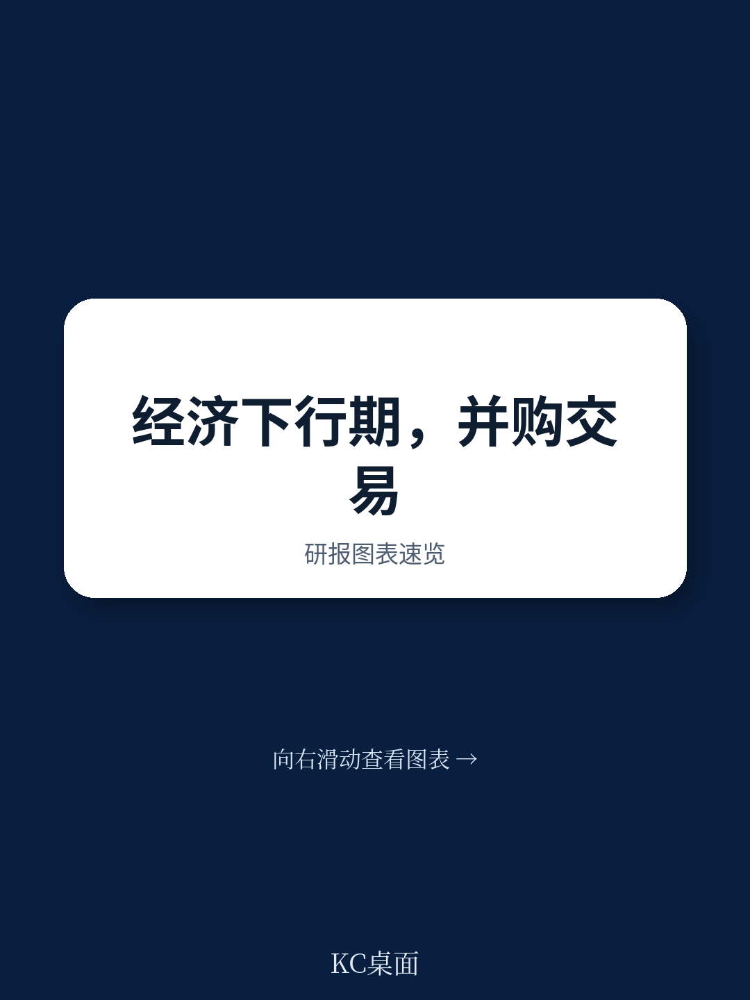

# 波士顿咨询：并购交易在调整期保持推进

73%的受访者表示，他们所在机构的并购交易估值正在被重新谈判。这是波士顿咨询在2020年疫情冲击下对全球并购从业者所做调查得出的数字。同一份调查还显示，多数交易方预期宏观环境扰动将让并购交易量和价格在较长时间内维持在低位。

但报告同时给出了另一组事实：到2020年夏末，并购活动回暖的速度已经快于预期。波士顿咨询此前的多次研究也表明，节奏变化周期恰恰是经验丰富的交易方获得优质标的的窗口期。两相对照，报告的核心判断变得清晰——决定并购成败的变量不是宏观环境气候，而是交易执行本身。

这份报告的价值在于，它没有停留在“要不要做交易”的层面，而是把买方和卖方分别拆成“早期阶段”和“已签约或进行中”两种状态，逐一给出可操作的执行清单。对正在犹豫是否暂停交易的管理层来说，这是一份可以直接对照使用的决策框架。

## 1. 买方早期阶段需要重做尽职调查并测试情景敏感度

报告建议，潜在买方首先要对疫情给自身和标的公司运营带来的影响做一次不留情面的评估。核心问题是：交易逻辑是否仍然成立，比如原本假设的协同效应还能否实现。

如果逻辑未变，买方需要准备重启尽职调查。波士顿咨询特别指出，这甚至意味着推翻此前已完成的尽调工作，把扰动影响纳入所有尽调维度重新来过。短期要看调整深度和价格与数量的变化，中期要看增长是否从新的更低基数上重新起步，长期则要关注疫情是否改变了原有趋势——比如向电动汽车的转型加速、远程办公比例上升。

在此基础上，买方应围绕几个关键价值驱动变量做情景规划。报告给出了三种情景：V型、U型和L型复苏。目标业务对这三种情景的敏感度如何？如果只在一种情景下交易才成立，这种情景发生的概率又有多大？

> **KC评论：** 情景规划的关键不是预测哪条复苏曲线会成真，而是检验交易在多大程度上依赖单一假设。如果目标公司只在V型复苏下才有研究价值，这笔交易的不确定性溢价就需要重新计算。

## 2. 已签约交易的买方应加快整合节奏并强化远程沟通

对已签约但尚未交割的买方，报告建议先快速评估疫情对双方运营的影响。如果基本假设已被根本性动摇，买方应考虑触发重大不利变化条款或合同中类似表述来退出交易。

如果决定继续推进，关键动作是快速调整。报告观察到，多数公司的整合工作聚焦三个领域：交割首日准备、交割后的业务连续性、整体价值捕获。在疫情环境下，公司需要把注意力放在未来三到四个月最重要的事情上，而不是长期规划。

一个反直觉的建议是：如果整合的长期计划原本就包含关闭部分设施和裁减人员，那么加速执行这些计划可能是合理的——比如永久关闭那些因疫情已经停产的工厂。报告同时提醒，远程办公环境下优秀人才更容易流失，管理层需要加大主动沟通的力度，包括精心设计虚拟交割首日体验、安排额外的整合团队触点、确保视频会议等工具稳定运行。

## 3. 卖方在买方市场下应重新评估出售时机并拓展买家范围

对考虑出售资产的卖方，报告给出的第一步建议是快速重新评估出售的原因和速度。当前环境总体上是买方市场，估值承压。如果条件允许，最好的选择可能是等待，利用这段时间做更多准备工作，让资产在日后更具吸引力——比如关闭已经闲置的边缘业务，或将临时性休假转为永久性裁员。

如果决定继续推进，卖方需要评估潜在买方的状态：他们还有能力做收购吗？报告建议扩大买家范围，不仅包括追求协同效应和新市场准入的战略买家——他们现在可能财务实力减弱——也包括关注现金流和运营优化的财务买家，后者在当前环境下可能更有能力完成交易。

同时，卖方应重启准备与潜在买家共享的卖方尽职调查报告。疫情带来的变化意味着几乎所有此前的数字和假设都需要更新。

## 4. 进行中或暂停的出售流程需要外部市场视角与内部运营准备双线并行

对已经接触过竞标者、或希望重启已暂停流程的卖方，波士顿咨询建议同时建立外部和内部两套视角。

外部视角包含两个部分：市场概览和需求影响分析。市场概览要评估疫情对市场基本面的影响，包括收入端表现、扰动形态、各行业和各地区的恢复时间，以及竞争环境。需求影响分析则要做详细的客户情绪分析，覆盖地区和支出类别等关键维度，并跟踪短期和中期的需求变化，包括终端市场的销售与盈利、恢复时间框架和客户需求变化。

内部视角同样有两个组成部分：运营准备度和业务计划审查。运营准备度要分析供应链连续性、短期和中期的运营韧性，以及资产在复苏中参与竞争并获取市场份额的潜力。业务计划审查则要覆盖订单积压、区域增长、利润率影响等短期和中期指标，并基于敏感性分析建立假设情景，更新预算和中层管理计划。

> **KC评论：** 外部视角回答“市场还认不认这个资产”，内部视角回答“公司还撑不撑得起这笔出售”。两个视角合在一起，才能判断暂停的流程是应该重启、调整还是彻底终止。

报告最后给出的结论是克制的：管理层不应条件反射式地终止并购计划。经过重新评估，部分交易确实应该放弃，但多数交易有充分理由在仍在调整期继续推进。这需要耐心——比如延长尽职调查周期——也需要创造力，比如在不确定性分担和交易结构上做出新的安排。对买方而言，当下的环境可能提供了以有吸引力的估值购入资产的罕见机会，前提是既大胆又谨慎。
