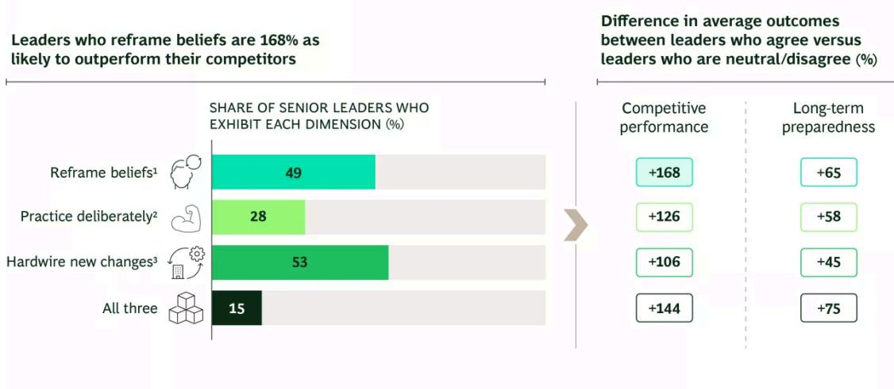
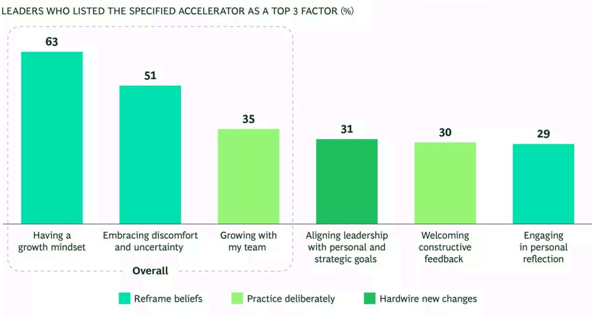
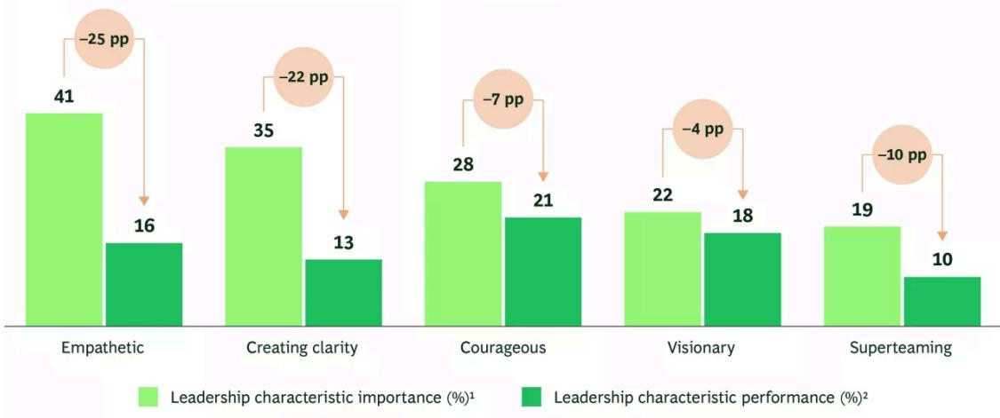

LEADERSHIP DEVELOPMENT

# Mind the Belief Gap

By Fanny Potier and Brittany Heflin

ARTICLE JULY 31, 2026 12 MIN READ

When a leadership team underperforms, the first explanations are often external. The market shifted. A competitor got aggressive. The technology moved faster than anyone expected and planned for.

Sometimes that's the whole story. More often, it's the comfortable version of a harder reality: the team acted on an assumption that it stopped examining.

That was Hubert Joly's diagnosis when he became CEO of Best Buy in 2012. The company had plenty of reasons to blame the market for its struggles. Consumers were moving online. Apple was opening its own stores. Devices were converging. Whatever the precise mix of factors might be, Best Buy was losing ground.

But Joly was not convinced that these headwinds were the fundamental source of the company's difficulties. If some of those same forces were helping Amazon and Apple, then, as he put it, “The wind is probably not the problem. We must be the problem.” That conclusion marked a shift in belief from “the market is doing this to us” to “we're still in charge of what we can change.”

Most leadership teams carry these kinds of unexamined assumptions, whether about the market, their own limits, or what good leadership demands of them.

In a recent BCG survey of 563 senior leaders across 11 markets, $63\%$ said that the senior leaders in their organization are not well prepared for what long-term success will require. The survey also found a sharp split between teams that treat leadership growth as real work and teams that don't. Those that reframe beliefs, practice deliberately, and hardwire new behaviors are $144\%$ as likely as their competitors to outperform and $75\%$ as likely to report strong long-term preparedness. (See Exhibit 1.)

## EXHIBIT 1

Leaders Who Reframe, Practice, and Hardwire Are More Likely to Outperform, but Only 15% Do All Three

  
Source: BCG Global leadership survey, March 2026 (N = 563).
Note: Spearman's rank correlations show statistically significant associations between reframe, practice, and hardwire behaviors and long-term preparedness and competitive performance ( $\rho = 0.15-0.35$ ). $^{1}$ “Senior leaders at my organization actively challenge assumptions about leadership and demonstrate a willingness to adapt their beliefs to meet evolving business and organizational needs.” $^{2}$ “Senior leaders in my organization regularly and intentionally experiment with evolving leadership behaviors in their day-to-day work, seek feedback, and adapt based on what they learn.” $^{3}$ “Senior leaders in my organization consistently work to ensure systems, structures, or routines within the organization reinforce and support leadership growth.”

Reframing beliefs is the hardest of the three changes to implement and the area that most often separates teams that pull ahead from the teams that stall. It’s also the endeavor that most teams get wrong. We call this struggle the belief gap—the distance between what a leadership team knows good leadership requires and what it can actually get itself to do. It closes only when a team, together, surfaces the assumptions that it has been running on, tests to determine which still fit, and changes the ones that don’t.

## Belief Comes First

A belief, in this context, is a shared assumption that a team acts on together: what it treats as possible, what it treats as risky, or what it expects will be rewarded. Although rarely stated outright, beliefs surface in such forms as how a team spends its time, what it does under pressure, and how it reacts to failure.

The stated value of something and the working assumption surrounding it are often very different things. A team may say that it values learning but then treat learning as time away from real work. It may say that collaboration matters but then reward people who look out for themselves. It may say that empathy is essential but then treat it as a soft skill that gets in the way when results are on the line. The working assumptions, not the stated values, are what a team runs on.

A leadership team grows, evolves, and adapts to what the market demands in three ways, and our survey measured all three:

\- Reframe the beliefs that leaders hold.

• Practice new behavior deliberately.

\- Hardwire the new behavior into how the team runs.

Only 15% of the leaders surveyed do all three of these things consistently. Of the three, one carries disproportionate weight: leaders who actively reframe beliefs are 168% more likely to outperform their competitors, a bigger effect than practicing or hardwiring on its own.

Why does belief so often determine whether practice and hardwiring stick? Ginni Rometty, who led IBM through its reinvention, puts it simply: “until you experience it, you don’t really believe it.” You can’t argue a team into a belief. People have to live it before it takes hold, which is why belief is usually where lasting change begins, not where it ends.

Consider the two things that leaders most often credit for their own growth. Having a growth mindset (63%) and embracing discomfort and uncertainty (51%) may sound like capabilities, but both reflect assumptions that leaders hold about themselves. (See Exhibit 2.) A growth mindset means believing that what worked before may no longer be enough. Embracing discomfort means accepting, as Rometty puts it, that “growth and comfort can never coexist”—that there’s no development without going through some discomfort.

## EXHIBIT 2

Leadership Teams Should Reframe, Practice, and Hardwire, but the Highest Return Lies in Reframing Beliefs

Leadership growth accelerators | Q: What factors have most accelerated your growth as a leader? LEADERS WHO LISTED THE SPECIFIED ACCELERATOR AS A TOP 3 FACTOR (%)

  
Source: BCG Global leadership survey, March 2026 (N = 563).

Some leaders won't step into discomfort on their own, and moving them takes more than a good argument. For Rometty, it meant helping them experience the belief rather than debate it, often by drawing on their own history. Most people have weathered something hard; and viewed next to that, a professional risk looks smaller than it might in isolation. When someone had less personal experience to draw on, Rometty would talk through the possible worst-case outcome until it lost its grip, and then help the leader take a small first step and see that it held.

Joly’s own instinct fit a similar pattern. He didn’t start with a strategy offsite. He spent a week working in Best Buy stores, wearing a “CEO in training” badge and asking employees three questions: what’s working, what’s not, and what do you need? The experience shifted his sense of where the truth was and what it would take to act on it: less talking from the top, more doing based on what the floor already knew.

## One Mind Isn't Enough

When one leader holds an unexamined belief, it’s a personal blind spot. When a whole leadership team shares one, it becomes a ceiling to what the organization thinks is possible. Reframing is likelier to succeed on teams drawn from different backgrounds and skills, where discussion and dissent are welcome. It stalls in situations where a team’s shared assumptions and unspoken

norms prevent new ideas from ever surfacing. A single leader can change what she believes, but if she walks back into a team whose shared assumptions haven't moved, the old behavior will pull her back.

Joly’s second shift at Best Buy was to deal with the latter issue. The company had been running as a set of departments each optimizing for itself, and the underlying belief was that value creation is a zero-sum contest, both inside the company and with suppliers. He moved the team to act in support of “one team, one dream, one Best Buy,” putting every officer on a single set of goals and a single bonus tied to the company’s overall performance. The belief had to move across the team, incentives and all. One leader changing his mind would not have been enough.

In many cases, shared assumptions that a team never examines show up later as obstacles that it complains about. When leaders name what gets in the way of their own growth, the most common answers—unclear expectations, lack of strategic clarity, inadequate attention to learning—look like process problems, but each tends to sit on an assumption that no one has questioned. The most frequent of these may be the idea that leadership development is separate from the real work. You can hardwire every system you want, but if the team’s shared belief hasn’t shifted, behavior reverts to its previous norms.

## Leaders Know What Good Looks Like

This is not a knowledge problem. Ask senior leaders which qualities matter, and they will answer without hesitation: empathy, clarity, courage, vision, and the ability to lead across functions and boundaries, which the survey calls superteaming. That list has remained strikingly stable, closely matching the qualities that leaders named in our previous leadership research.

The problem is performance. Teams fall shortest on some of the qualities they rank highest. Empathy is the clearest case: 41% of leaders identify it as a top-three quality, but only 16% say that senior leaders in their organization excel at it, a 25-percentage-point gap. Likewise, clarity shows a 22-percentage-point gap. Leaders fall short exactly where they say they care most. (See Exhibit 3.)

# Leaders Underperform on the Characteristics That Matter Most

Top 5 most important leadership characteristics and performance LEADERS WHO SELECTED THE QUALITY AS A TOP 3 CHARACTERISTIC

  
Source: BCG leadership survey, March 2026 (N = 563).  
Source: BCG leadership survey, March 2020 (N = 503).

Note: Gaps were calculated as the difference between the share of respondents selecting each characteristic as a top 3 priority and the share indicating strong performance; characteristics are ranked by largest positive gaps.  
2“What are the top 3 most important leadership qualities for senior leaders to drive long-term organizational success, employee engagement, and customer satisfaction?”
2“What are the top 3 leadership qualities senior leaders at your organization currently excel at?”

These gaps don't signal a lack of skill. They come from believing that using these qualities would cost them something. The empathy gap arises out of the assumption that real empathy would erode a team's accountability. The clarity gap rests on the assumption that admitting uncertainty would cost a leader authority.

This is where Joly and Rometty landed when we asked them what had been the most difficult thing to change. For Rometty the hardest shift was accepting that empathy takes vulnerability, and that vulnerability builds followership instead of undercutting it. For Joly the hardest thing he had to learn was to say, “I don’t know” and “I need help.” Both leaders approached the question from different directions but landed in the same place: admitting a limit makes a leader stronger.

## How to Start

In order to shift a shared belief, a team must surface the assumptions that it has been running on, examine them together, and be willing to find that some no longer fit. Here are a few ways in:

\- Name the belief underlying the decision. Before making a major call, have the team finish the sentence: “We’re doing this because we believe…” Run it backward on decisions that didn’t land: “We did that because we believed… Was that accurate?” Teams often find that they’ve been acting collectively on an assumption that stopped being true a while ago.

\- Challenge the false tradeoff. Leadership teams often make false choices, such as between individualism and collaboration or between strategic clarity and tolerance for ambiguity. A team needs both. Running a polarity workshop can help surface the belief that a team has defaulted to in situations that call for more of the other side. It treats two seemingly opposed sides as a tension to manage, not a choice to settle once and for all, since the right balance shifts with the business context. The team works from a real decision that it has faced. For example, a team that leans on consensus by default can learn to recognize situations where a call needs fewer voices and a faster owner.

\- Audit the two widest gaps. The empathy gap and the clarity gap arise from beliefs that are consistent across teams: that showing vulnerability will undermine authority, and that admitting uncertainty will create panic. Those beliefs won't shift until they are exposed to light, which is why the right question isn't “How do we get better at empathy?” but “What would have to be true for us to exhibit empathy when the pressure is on?”

\- Treat leadership development as a team sport, not a matter of individual enrichment. The belief that most often blocks leadership growth is that development belongs in a program, separate from actual work. At Best Buy, Joly restructured the way the team worked together, identifying one set of goals and establishing one bonus tied to company performance, so that every officer's incentives pointed the same direction. People who had been protecting their own departments began acting differently. The organization had created the conditions necessary to nurture a different belief.

\- Make the new belief experiential, then wire it in. When Rometty needed to shift the way nearly half a million IBM employees worked, she started with three beliefs, translated them into nine behaviors, and asked the workforce to define what each one looked like at its best. Every meeting opened with a story about one of the behaviors, and the company rewarded and celebrated those stories. Only after that did Rometty hardwire the behaviors into promotion criteria and pulse surveys. A system that is installed before people have lived the belief is easy to ignore. The story has to come first.

Naming beliefs is the easy part. The harder thing is getting a team to look at its own assumptions together, discuss them out loud, and recognize the fact that some of them no longer fit. Most leaders would rather do almost anything else. Joly's teams didn't turn Best Buy around by working harder at what they already believed. They started the comeback by admitting that the market was not the only thing that had to change.

That shift is what separates the teams that move from the ones that stall, and no single leader can make it happen alone.

## Authors

  
Fanny Potier  
Partner & Director, People Strategy & Leadership Paris

  
Brittany Heflin  
Associate Director, Leadership, Culture & Change
Houston

## ABOUT BOSTON CONSULTING GROUP

Boston Consulting Group bridges the gap between ambition and outcomes for the world's leading companies and organizations. We are built for this era of unprecedented change — bringing strategic clarity rooted in over 60 years of deep domain knowledge, combined with applied AI shaped by our practitioners. BCG works shoulder-to-shoulder with CEOs across industries and geographies to deliver transformative impact at scale: stronger returns, transferred capabilities, and change that sticks. For more information, visit bcg.com.