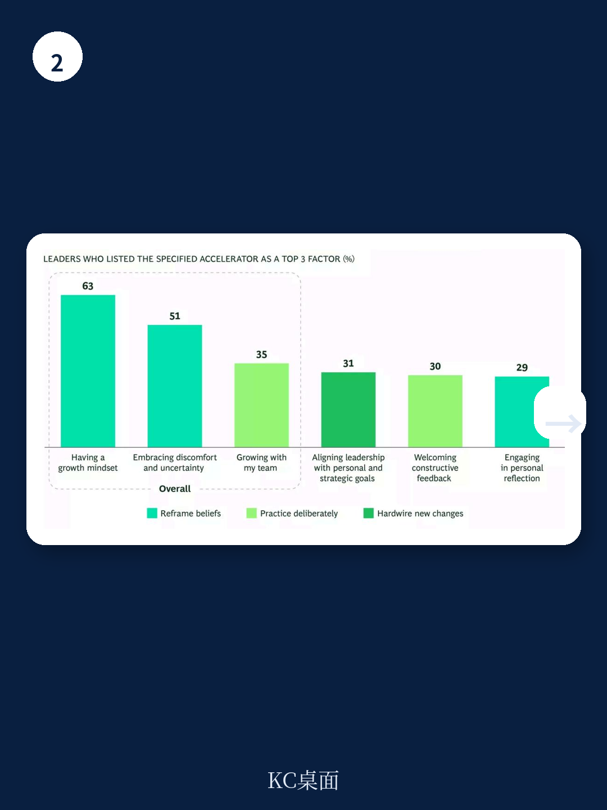

# 波士顿咨询：研究主题与行业变化观察

领导力团队业绩不佳时，最先被归因的往往是外部因素：市场变了、竞争对手更激进了、技术迭代快过预期。波士顿咨询（BCG）在2026年3月对11个市场563名高级领导者的调查中，给出了一个更接近核心的解释：团队长期依赖某些未经检验的假设，这些假设才是限制组织上限的隐性变量。

报告将这种状态称为“信念差距”——领导团队知道优秀领导力需要什么，却无法让自己真正去做。调查显示，63%的受访者认为所在组织的高级领导者并未为长期成功做好准备。而能够同时做到重构信念、刻意练习、固化行为这三件事的团队，业绩领先同行的可能性高出144%，报告长期准备充分的可能性高出75%。但全部做到这三点的领导者，只有15%。

## 1. 重构信念是三项能力中回报最高的一环

调查将领导力成长拆解为三个可测量维度：重构信念、刻意练习新行为、将新行为固化进团队运行机制。三者中，重构信念的权重明显更高：主动重构信念的领导者，业绩领先同行的可能性高出168%，单独作用大于另外两项。

报告引用IBM前CEO金尼·罗梅蒂的解释：“在你真正经历之前，你不会真正相信它。”信念无法靠论证说服，只能靠体验建立。这解释了为什么多数领导力项目效果有限——它们试图用逻辑替代体验，而体验恰恰是信念形成的唯一路径。

## 2. 团队共享的假设比个人盲点更难移动

当一位领导者持有未经检验的信念，那是个人的盲点；当整个领导团队共享同一假设，它就成为组织认为“可能”的天花板。报告强调，单一领导者改变自己的信念后，如果回到一个共享假设未动的团队，旧行为会把她拉回去。

百思买前CEO休伯特·乔利在2012年接手时的做法印证了这一点。他没有先开战略会，而是戴着“培训中的CEO”徽章在门店工作一周，问员工三个问题：什么有效、什么无效、你需要什么。随后他将高管团队从各自为政的部门优化，转向“一个团队、一个梦想、一个百思买”，所有高管共用一套目标和一个与公司整体业绩挂钩的奖金池。信念必须跨团队移动，激励也要跟着动，单靠一个人改变想法不够。

> **KC评论：** 这里容易被忽略的是“激励同步”这个动作。乔利不是先讲愿景再调考核，而是把信念转变直接做进奖金结构里。信念和制度必须同时移动，否则新信念会被旧激励拉回原形。

## 3. 领导者最重视的品质恰恰是表现最弱的环节

这不是知识问题。问高级领导者哪些品质重要，答案几乎一致：同理心、清晰、勇气、愿景、跨职能协作。但报告发现，表现缺口最大的正是领导者最看重的品质。同理心被41%的领导者列为前三重要品质，但只有16%认为所在组织的高级领导者在这方面表现出色，缺口达25个百分点；清晰度的缺口为22个百分点。

报告认为，这些缺口不来自技能不足，而来自一种假设：展现同理心会削弱问责，承认不确定性会损害权威。罗梅蒂最难改变的认知是接受“同理心需要脆弱，而脆弱建立追随而非削弱追随”；乔利最难学会的是说出“我不知道”和“我需要帮助”。两人路径不同，落点一致：承认局限让领导者更强。

## 4. 识别信念的四个可操作入口

报告给出了团队可以自行操作的起点。其一，在做重大决策前，让团队完成句子“我们这样做是因为我们相信……”，对未达预期的决策反向追问“我们当时那样做是因为相信……这个假设还成立吗”。其二，识别虚假取舍，例如个人主义与协作、战略清晰与容忍模糊之间并非二选一，而是需要管理的张力。其三，直接审计同理心和清晰度两个最大缺口，追问“什么必须为真，我们才能在不确定性下展现同理心”，而不是“如何提升同理心”。其四，把领导力发展当作团队运动而非个人进修——最常阻碍成长的信念是“发展属于培训项目，与真实工作分离”。

罗梅蒂在IBM推动近五十万人转变时，先确立三个信念，转化为九个行为，让员工定义每个行为的最佳表现，每次会议用行为故事开场，之后才将行为写入晋升标准和员工调研。报告指出，先装系统、后让团队体验信念，系统容易被忽视；故事必须先行。

信念差距的关闭，不靠更努力地做已经相信的事。乔利的团队没有靠加班扭转百思买，他们从承认“市场不是唯一需要改变的东西”开始。这个转变，是前进团队与停滞团队的分界线，而没有任何一位领导者能独自完成它。

For informational purposes only. Portions may be generated,translated,summarized,or edited with AI assistance based on source materials and may contain omissions or errors. Please verify independently. This is not investment,legal,tax,accounting,or other professional advice.

