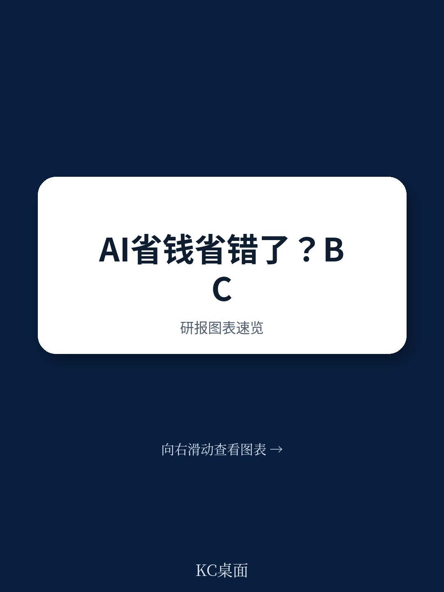
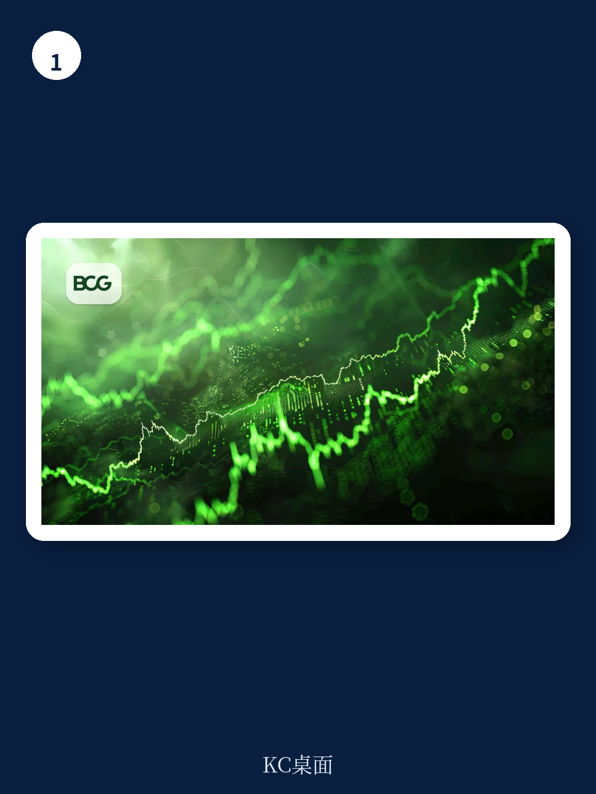

# 波士顿咨询：AI技术与行业应用观察

波士顿咨询在2026年7月发布的一份成本管理研究报告中给出一个明确判断：在AI研究上过度谨慎，正在从一种不确定性管理手段变成竞争劣势。报告对比了不同投入水平企业的经营结果，发现差距已经不止停留在技术采用层面，而是体现在成本结构、利润水平和资本回报上。

这份研究基于对全球企业的调研，将AI投入占营收比例作为分组依据。投入较高的企业将约1.7%的营收用于AI相关建设，投入较低的企业这一比例约为0.8%。报告认为，前者的优势并非来自单纯的技术采购，而是来自将AI嵌入核心业务流程后产生的系统性效率提升。

## 1. AI深度应用企业的成本降幅与资本回报高于同行

报告给出的数据值得细看。AI整合程度更深的企业，成本降幅达到同行的三倍，利润率高出60%，投入资本回报率则是同行的2.7倍。这些数字说明，AI投入的回报不是线性的，而是存在明显的门槛效应——只有跨过某个整合深度，效率改善才会在财务指标上显现。

波士顿咨询特别提醒，这些优势会随时间累积。AI驱动的流程优化和运营模式调整具有复利特征，早期投入带来的效率改善会释放更多资源用于后续创新，形成正向循环。这也解释了为什么投入差距不大的企业，几年后经营表现可能拉开明显距离。

> **KC评论：** 报告没有把AI投入当作单纯的技术开支，而是将其视为一种资本配置决策。1.7%和0.8%的营收占比差距看似不大，但乘以企业规模后，对应的绝对投入差异足以决定转型项目的深度和范围。

## 2. 价值创造中约七成来自组织与流程变革而非算法

报告对AI价值来源的拆解可能是最值得关注的部分。波士顿咨询认为，AI项目的价值构成大致是：10%来自算法，20%来自技术和数据，70%来自人员、流程和行为改变。这个比例意味着，多数企业投入不足的环节不是模型训练或算力采购，而是配套的组织变革。

具体来说，企业需要将AI与运营模式重构结合。报告列举了采购、客户运营、软件开发和支持职能等领域，认为这些环节最容易通过AI实现流程重塑。但前提是同步推进治理机制调整、流程简化、员工技能提升和组织架构优化。只购买工具和许可证而不改变作业方式，AI最终只会成为现有流程上的附加层。

## 3. 传统成本削减可在3至12个月内释放5%至25%的资金

波士顿咨询提出了一个值得注意的融资路径：用传统成本杠杆为AI转型提供资金。报告认为，通过优化采购、精简组织层级、压缩外部支出和简化运营，企业通常能在3至12个月内节省5%至25%的成本。这笔资金可以成为AI转型的启动资本。

这个逻辑形成闭环：传统节省支撑AI投入，AI投入带来结构性效率，结构性效率又创造新的研究能力。报告强调，成功的AI转型并非放弃成本纪律，而是将成本管理的目标从短期节省转向为长期能力建设提供资金。

## 4. 过度追求回报表现测算精度可能延误关键布局

报告对当前普遍存在的研究决策方式提出了不同看法。许多企业要求在扩大AI投入前提交详尽商业案例，波士顿咨询认为，在快速变化的技术环境中，过度追求测算精度反而可能成为战略约束。AI转型带来的二阶效应——流程重组后的跨部门协同、数据积累带来的模型优化、组织能力提升带来的新机会——很难在事前完整建模。

这并不意味着盲目投入。报告描述的做法是：做出更聪明的押注，观察哪些方案有效，快速将创新预算转向效果最明显的领域。先建立势头，在推进中学习，再扩大真正创造价值的用例规模。

> **KC评论：** 报告对“精确测算”的批评容易被误读为鼓励粗放投入。实际上它反对的是用静态商业案例评估动态能力建设，建议企业用更短周期的验证机制替代一次性的大规模论证。

波士顿咨询在报告结尾指出，那些继续聚焦于AI成本控制、只运行低成本试点、迟迟不愿全面承诺的企业，可能会在技术应用上逐渐落后。真正的优势来自认识到AI的完整潜力并据此重新设计业务，这需要领导层的判断力、组织层面的承诺和持续的资源投入。
