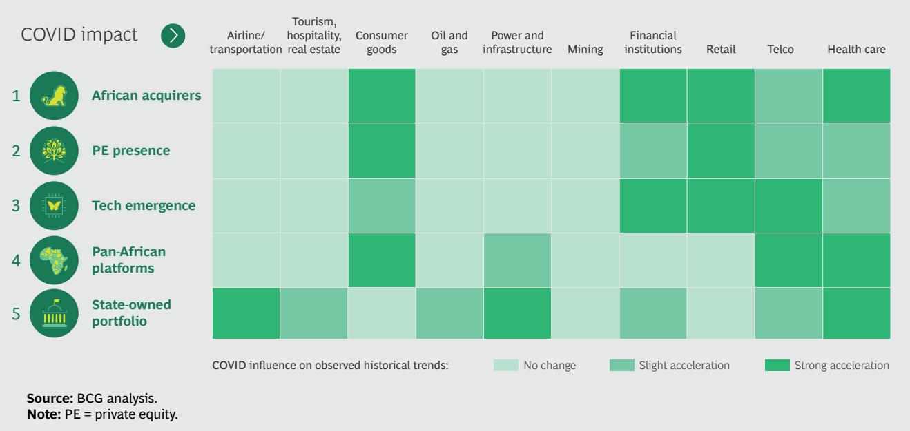
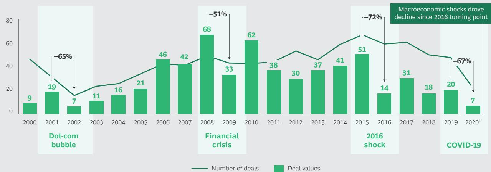

# WHAT'S NEW AND NEXT FOR M&A IN AFRICA

By Seddik El Fihri, Othman Omary, Jesper Nielsen, Patrick Dupoux, and Alexis Bour

A FRICA IS A CHALLENGING region in which to execute successful mergers and acquisitions (M&A) for many reasons, but it is also one of the fastest growing and evolving parts of the world. Although Africa's recent GDP growth has slowed because of falling oil and commodity prices, and the coronavirus pandemic, both of which have hit its largest economies hard, now is the time to consider the long view of the continent's M&A investment opportunities.

Our analysis of Africa's M&A market activity and performance over the past decade, across countries and industries, reveals five trends that we believe can serve as critical guides to future investment strategies. We expect that these trends will become even more pronounced, and some will accelerate:

\- African-led acquisitions on the continent are rising.

\- More Africa-focused private equity (PE) investors are emerging.

\- Technology startups are attracting multiple investors.

\- African integration makes regional platform plays a reality.

\- State-owned enterprises may soon be open for private capital again.

Powered by those trends and overall GDP growth, M&A deal value rose at a compound annual growth rate of 15% from 2000 to 2015. That 15-year M&A growth streak ended abruptly; the annual compound growth in the value of African M&A fell by 21% between 2015 and 2019.

Despite negative 2020 GDP forecasts for most African countries, we expect that dealmaking activity on the continent will pick up ahead of the recovery in GDP growth. Indeed, an earlier-than-expected M&A revival in Europe in the third quarter of 2020 suggests that, even with the uncertainty around COVID-19, an M&A recovery globally has begun. We anticipate similar resilience in Africa.

Five M&A Trends in Africa
Hard commodities, oil and gas, and telecoms (Africa's smartphone and mobile payments markets are among the world's fastest growing) accounted for more than 50% of M&A value from 2016 to 2019. Tech opportunities in financial, health, agriculture, and energy-related services are among the main engines accelerating this activity. For example, in African countries on BCG's Middle Billion list, urban business and financial centers are blossoming, and first-generation African tech entrepreneurs are launching startups in need of local and global capital. Moreover, financial hubs such as Casablanca Finance City in Morocco connect the ecosystem of M&A players (corporate, law firms, private equity firms, financial institutions, and consultancies).

Meanwhile, the five trends we've identified as significant markers of activity and opportunity in Africa's M&A market over the last decade remain strong.

1. Rise of African Acquirers. Historically, non-African multinationals have been the dominant players in Africa. Today, many more local African entrepreneurs with professional capabilities, ambition, and technical skills are launching fast-growing companies competing against multinational corporations. From 2012 to 2019, African acquirers' share of deal value grew about 5% per year, although the average value of foreign investors' deals was twice that of African investors (\$60 million for non-African versus \$30 million for African). The African Continental Free Trade Area (AfCFTA) has been a significant driver of this activity. As we noted in our 2018 report, Pioneering One Africa, the AfCFTA and the economic integration of Africa has been a long time coming. It is also critical to Africa's future development and standing in global markets.

2. Growth of Africa-Based PE Funds.
Development institutions pioneered private equity investment in Africa in the early 1990s. Private equity investors followed. In the early 1990s, there were a dozen Africa-based funds with a total of \$1 billion under management. PE deal vol-

ume in Africa has been growing at about 6% per year since 2012. By 2016, there were more than 200 funds with upward of \$30 billion under management. A surge of private capital to Africa in 2016, just as the drop in commodity prices slowed economic growth across the continent, raised questions about the risks. We argued then, and remain confident now, that Africa holds great promise for private equity investors. The region’s rapidly expanding companies can absorb immense foreign investment and generate high returns for investors. Africa also needs private capital to fund its continued growth. From 2014 to 2019, the Africa Venture Capital Association reported 613 deals totaling \$3.9 billion, with 2019 alone recording \$1.4 billion of those transactions. The majority of those deals happened in South Africa, Kenya, Nigeria, Ghana, and Egypt. Interestingly, the most successful PE firms happen to be African, while global firms have struggled to adapt their model to the African context.

3. Attraction of Technology Sector Startups. M&A tech trends in Africa is consistent with what is happening globally. Fundraising for tech players increased by 64% per year from 2015 to 2019, driven mainly by investments in fintech, with a focus on financial inclusion. Startups in three countries—Nigeria, Kenya, and South Africa—captured 80% percent of those funds.

4. Developing and Securing Pan-African Platforms. Regional markets and multi-country roll-ups are opening up more opportunities for African acquirers and foreign players. The purpose of the multi-country platform is to create scale, hedge country risk, and capture industry synergies and operational cost efficiencies.

5. Revival of State-Owned Portfolio Activity. At the end of the 1990s and early 2000s, privatization was the main driver of government M&A. But since 2006, no privatization over \$1 billion has launched. We expect a reversal of this decline in government M&A activity for several reasons, starting with COVID-19 economic recovery interventions.

## The Effect of COVID-19 on African M&A

In June 2020, BCG surveyed 50 CEOs about the state of the M&A market in Africa. A full 80% of respondents reported that COVID-19 has disrupted their M&A agendas, including deals that were frozen or delayed. But they also said their rationales for being players in this market have not changed, although the pandemic's impact on their outlook is evident. For example, 83% percent of respondents said they were seeking “growth opportunities” before COVID-19, versus 71% in a post-COVID environment. Rationalization strategies, including divesting noncore assets or exiting a weak sector or a low-performing geographic region, jumped from 11% to 22%.

Exhibit 1 shows how some historical trends are accelerating faster than others due to COVID-19 and depending on the industry. For instance, pan-African platforms capture value when profits are diminishing and the economy is weak. A platform's geographic diversification play is also an effective way to neutralize country risk exposure. COVID-19 is also amplifying the potential benefit of building and securing pan-African platforms to mitigate country risk, find synergistic opportunities, and achieve scale quickly.

Smartphone and digital financial services are examples of two tech services reinforcing the growth of the other and growth in M&A. COVID-19 has put a spotlight on cashless transactions as a way to reduce the virus transmission risk associated with bills and coins. MFS Africa, a South Africa-based pan-African mobile payments hub, recently acquired Beyonic, a Uganda-based mobile payment technology services provider. Beyonic, which calls itself a provider of “cashless” transactions services, was founded in 2006 by a young software engineer and today serves clients in multiple African countries.

The rapid rise in remote work and virtual schooling is another COVID-19 effect stimulating technology investment opportunities. In the education sector, government action to keep K-12 schooling happening at home is significantly accelerating edtech digital innovations.

The economic fallout from the pandemic is also pushing governments to, on the one hand, shore up state-owned enterprises in strategically essential industries. On the other, governments may decide to privatize state assets to generate funds.

Multinationals seeking to lessen the risk in their portfolios could temporarily slow their activity in Africa and refocus on other regions. This would create specific opportunities, and white spaces, for African investors. Some private equity firms will be especially well-positioned to benefit if this happens.

EXHIBIT 1 | COVID-19's Impact on Historical M&A Trends, by Industry  

So far, the drop off in deal activity in Africa due to COVID-19 seems to be following a similar decline and recovery pattern to what we have observed following several global economic disruptions since 2000. (See Exhibit 2.) We expect a sharp fall in volume and value, possibly 40% in 2020-2021, but followed by a gradual recovery of deal volume within 18 to 24 months, and a return to 2019 total value within three to five years.

## Where African M&A Is Headed Post-COVID

Half the respondents to our M&A survey said they want to restructure their portfolios within the next five years. The motives that drove activity before the downturn will be roughly the same (70% finding new growth, 22% consolidating, and 7% acquiring new capabilities). Our own analysis captures these trends in six strategic archetypes. (See Exhibit 3.) Certain archetypes will be more prominent in some industries than in others. For example, before the pandemic, we were seeing more pan-African “grow the core”

deals emphasizing scale, synergies, and efficiencies in financial services. South African insurer Sanlam, Ltd., acquired 100% of Morocco Saham Finances in three deals between 2016 and 2018. The acquisition of Saham Finances gave Sanlam a footprint in 33 African countries, making it the continent's largest insurer.

We expect to see more pan-African platform deals in financial services as well as mining and health care. For example, in 2020, Endeavour Mining announced acquisitions of two mining companies with operations in West Africa. These acquisitions boost Endeavour's scale, making the company the largest gold producer in West Africa, and the $15^{\text{th}}$ largest in the world.

An investor partnership announced in November 2020 involving the private equity firm Development Partners International (through its ADP III fund), the CDC Group (the UK's publicly-owned impact investment firm), and the European Bank for Reconstruction and Development will create the first of its kind \$750 million biopharmaceutical pan-African platform. The platform will leverage a manufacturing and R&D center of excellence in India to strengthen its African manufacturing operations while capturing synergies from centralized supply chain management and business development.

EXHIBIT 2 | Africa's M&A Market Responses to Global Economic Shocks 2000-2020  
  
Sources: Zephyr; Bureau Van Dijk; S&P Capital IQ. 1 January to September 2020 values.

Source: BCG analysis.

<table><tr><td>STRATEGIC ORIENTATION</td><td>ARCHETYPE</td><td>RATIONALE</td></tr><tr><td rowspan="2">SAVE THE CORE</td><td>1 Shrink to value</td><td>Divest noncore assets to preserve and refocus on the core</td></tr><tr><td>2 Protect the too-big-to-fail1</td><td>Save nonprofitable companies with positive externalities for the country through privatization or, potentially, nationalization</td></tr><tr><td rowspan="2">GROW THE CORE</td><td>3 Consolidate locally</td><td>Acquire direct competitors to grow scale and increase market share and/or boost cost efficiency</td></tr><tr><td>4 Set up a pan-African platform</td><td>Acquire direct competitors crossborders to mitigate country risk while enhancing regional capabilities and market access</td></tr><tr><td rowspan="2">EXTEND THE CORE</td><td>5 Integrate on value chain</td><td>Integrate upstream or downstream to capture synergies and secure supply chain</td></tr><tr><td>6 Enter adjacencies opportunistically</td><td>Invest selectively in (distressed) assets to take strategic options, integrate on value chain, and reposition portfolio</td></tr></table>

$^{1}$ Archetype 2 is specific to government assets and direct foreign investment.

BCG's 2020 research on M&A markets globally shows alternative deals (joint ventures and alliances) have seen a surge in popularity in recent years. Companies are using alternative deals to gain access to capabilities that have helped with pandemic-related issues while continuing to respond to ongoing trends such as technology-driven disruption and the convergence of industries.

## The Long Game of M&A in Africa

Africa's slice of the global M&A market is relatively small—about 2% of the \$3.1 trillion global M&A market in 2019—but it is a solid alternative to other regional markets where growth is slowing. Still, the continent remains one of the most difficult places in the world to do business. Almost 90% of buy-side M&A decision makers in our survey said that managing uncertainty—economic volatility and other country risks—is their primary challenge.

The pandemic simply adds another layer of complexity. Sixty percent of respondents anticipate approaching acquisitions more selectively. In our view, the winners will

adapt quickly to new realities (sectors and archetypes). Cash capabilities will of course be critical drivers to carry out corporate M&A agendas.

Ultimately, there are good reasons to be optimistic about Africa's future and the future of the region's M&A market. Africa's youthful demographics and fast-growing consumer class bode well for bold investors. Economic integration through the AfCFTA also creates a major opportunity to help African countries diversify their exports, accelerate growth, and attract foreign direct investment. Significant investment will be needed in Africa to meet rising consumer demand for goods and services, to continue building basic economic infrastructure, and to meet sustainable development goals on climate-change mitigation and poverty reduction.

To succeed in Africa's promising and challenging M&A environment, investors will need to be prudent, adaptable, and bold. Incorporating the five trends driving M&A in Africa into decision making going forward can provide guidance and guardrails for investing in the future of this complicated continent.

## About the Authors

Seddik El Fihri is a partner and director in the Casablanca office of Boston Consulting Group and the head of the BCG Transaction Center for Africa. You may contact him by email at elfihri.seddik@bcg.com.

Othman Omary is a managing director and partner in BCG's Casablanca office and a member of the firm's Financial Institutions practice. You may contact him by email at omary.othman@bcg.com.

Jesper Nielsen is a managing director and senior partner in BCG's London office and leads the firm's Social Impact practice as well as BCG's business in M&A and post-merger integration in Western Europe, South America, and Africa. You may contact him by email at nielsen.jesper@bcg.com.

Patrick Dupoux is a managing director and senior partner in the firm's Casablanca office and is head of the BCG Africa system. You may contact him by email at dupoux.patrick@bcg.com.

Alexis Bour is a managing director and partner in BCG's Johannesburg office and is a core member of the firm's Industrial Goods practice and the firm's TURN unit. You may contact him by email at bour.alexis@bcg.com.

## Acknowledgments

The authors wish to thank Josephine Parmentier, Amine Menouni, and Alexandre Clauzet for their research, analysis, and contributions to this publication.

Boston Consulting Group partners with leaders in business and society to tackle their most important challenges and capture their greatest opportunities. BCG was the pioneer in business strategy when it was founded in 1963. Today, we help clients with total transformation—inspiring complex change, enabling organizations to grow, building competitive advantage, and driving bottom-line impact.

To succeed, organizations must blend digital and human capabilities. Our diverse, global teams bring deep industry and functional expertise and a range of perspectives to spark change. BCG delivers solutions through leading-edge management consulting along with technology and design, corporate and digital ventures—and business purpose. We work in a uniquely collaborative model across the firm and throughout all levels of the client organization, generating results that allow our clients to thrive.

© Boston Consulting Group 2021. All rights reserved. 1/21

For information or permission to reprint, please contact BCG at permissions@bcg.com. To find the latest BCG content and register to receive e-alerts on this topic or others, please visit bcg.com. Follow Boston Consulting Group on Facebook and Twitter.