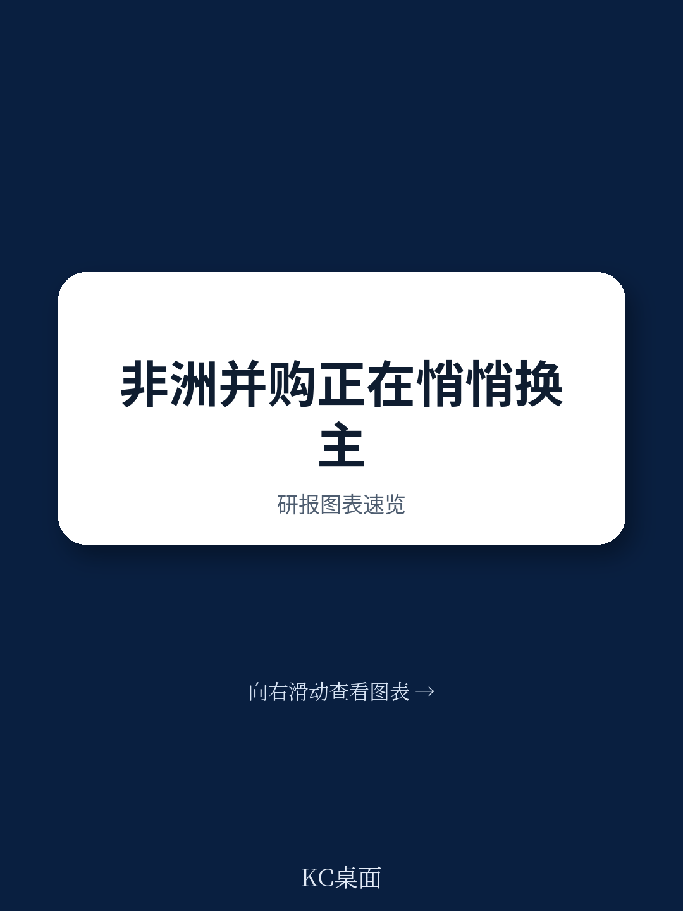
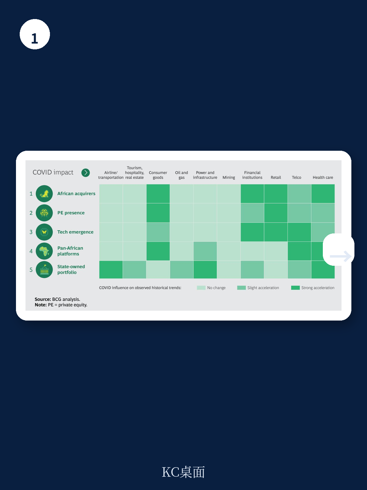
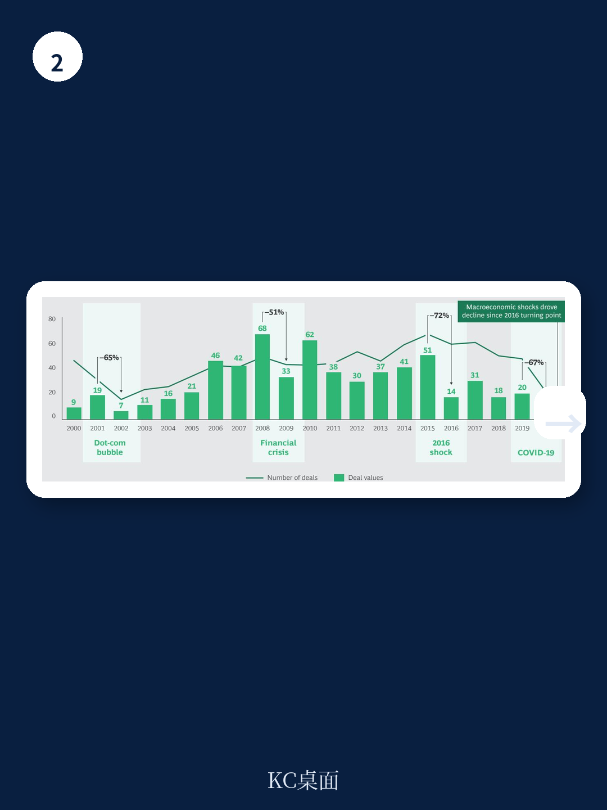

# 波士顿咨询：研究主题与行业变化观察

非洲并购市场在过去二十年经历了从高速扩张到骤然调整的完整周期。波士顿咨询（BCG）在2021年初发布的这份报告中，基于对2010至2019年非洲各国和各行业并购活动的分析，提出了一个核心判断：尽管新冠疫情对交易活动造成短期冲击，但推动非洲并购长期增长的五条结构性趋势并未改变，且部分趋势正在加速。报告预计，2020至2021年非洲并购交易量可能下降约40%，但交易量将在18至24个月内逐步恢复，交易总额有望在三到五年内回到2019年水平。

这份报告的价值不在于预测具体数字，而在于提供了一个观察非洲并购市场的长期框架。过去十年间，非洲并购交易额在2000至2015年实现了15%的年复合增长，但2015至2019年间，这一增速转为年复合下降21%。大宗商品价格下跌和疫情冲击了非洲主要地区，但报告认为，现在恰恰是考虑非洲并购长期机会的时点。

## 1. 非洲本土收购方份额持续上升，交易规模仍小于外资

报告最值得注意的发现之一，是非洲本土收购方的崛起。2012至2019年间，非洲收购方在交易总额中的份额以每年约5%的速度增长。但外资单笔交易的平均规模约为6000万美元，是非洲本土读者平均3000万美元的两倍。这一对比说明，非洲本土企业正在更多参与并购，但单笔体量仍有限。

非洲大陆自由贸易区（AfCFTA）的推进是这一趋势的重要驱动力。报告援引BCG在2018年发布的《Pioneering One Africa》报告指出，非洲宏观环境一体化经历了漫长过程，对非洲未来发展和全球市场地位至关重要。对观察者而言，本土收购方份额上升意味着非洲并购市场的参与者结构正在发生变化，外资企业不再独占主导地位。

## 2. 非洲私募股权产品规模扩大，本土机构表现优于全球同行

非洲私募股权市场在过去三十年间经历了从无到有的扩张。1990年代初，非洲仅有约12只本地产品，管理资产总额约10亿美元；到2016年，产品数量超过200只，管理资产超过300亿美元。2012年以来，非洲私募股权交易量以每年约6%的速度增长。

报告特别指出一个值得注意的现象：最成功的私募股权机构恰好是非洲本土机构，而全球性机构在适应非洲市场环境方面遇到困难。2014至2019年间，非洲不确定性研究协会记录了613笔交易，总额39亿美元，其中2019年单年交易额达14亿美元，大部分集中在南非、肯尼亚、尼日利亚、加纳和埃及。

> **KC评论：** 本土PE表现优于全球机构这一点，对有意进入非洲的读者是一个重要提醒。全球机构惯用的标准化尽调和投后管理流程，在非洲市场可能需要重新设计。报告没有展开说明具体差异，但这一结论暗示，单纯复制其他新兴市场的打法在非洲未必有效。

## 3. 科技初创企业融资快速增长，资金科技是主要引擎

非洲科技领域的并购趋势与全球一致。2015至2019年间，科技企业融资以每年64%的速度增长，主要由资金科技研究驱动，聚焦于资金普惠。尼日利亚、肯尼亚和南非三个国家的初创企业吸纳了这些资金的80%。

疫情进一步放大了科技领域的并购机会。远程办公和在线教育的普及刺激了教育科技等领域的创新，而移动支付在减少病毒传播不确定性方面的作用也受到更多关注。报告举例提到，南非泛非移动支付枢纽MFS Africa收购了乌干达移动支付技术服务商Beyonic，后者成立于2006年，为多个非洲国家提供无现金交易服务。智能手机和数字资金服务正在相互强化，并共同推动并购活动增长。

## 4. 泛非平台型交易成为应对国别不确定性的工具

报告提出的第四条趋势是泛非平台型交易的兴起。区域市场和多国整合为非洲本土及外国读者创造了更多机会。这类多国平台的核心逻辑是形成规模效应、对冲国别不确定性、捕捉行业协同效应和运营成本效率。

疫情正在强化这一趋势的价值。报告指出，当利润收窄、宏观环境走弱时，泛非平台通过地理多元化来中和国别不确定性的作用更加突出。南非保险公司Sanlam在2016至2018年间分三笔交易收购了摩洛哥Saham Finances的全部股权，借此进入33个非洲国家，成为非洲大陆最大的保险公司。2020年，Endeavour Mining宣布收购两家在西非运营的矿业公司，成为西非最大黄金生产商。

## 5. 国有企业资产可能重新向私人资本开放

报告提出的第五条趋势涉及国有企业资产的私有化。1990年代末至2000年代初，私有化曾是政府主导并购的主要驱动力，但2006年以来，非洲没有出现过超过10亿美元的私有化交易。报告认为，这一趋势可能因疫情后的宏观环境复苏干预而逆转。

疫情带来的财政不确定性可能促使政府采取两种方向不同的措施：一方面，对战略关键行业的国有企业进行纾困；另一方面，通过私有化国有资产来筹集资金。报告同时指出，跨国企业为降低组合观察不确定性可能暂时减少在非洲的活动，这将为非洲本土读者和部分私募股权机构创造特定的机会窗口。

## 6. 疫情后并购动机变化：增长仍是主因，合理化策略占比上升

BCG在2020年6月对50位CEO进行的调查显示，80%的受访者表示疫情打乱了他们的并购计划，包括交易被冻结或推迟。但受访者同时表示，他们参与非洲市场的根本理由没有改变。值得注意的是，疫情前后并购动机的结构发生了变化：疫情前83%的受访者寻求增长机会，疫情后这一比例降至71%；而合理化策略（包括剥离非核心资产、退出弱势行业或低绩效地区）的占比从11%上升至22%。

报告将非洲并购的战略取向归纳为六种原型：调整核心（剥离非核心资产、保护大而不倒的企业）、增长核心（本地整合、建立泛非平台）和延伸核心（价值链整合、机会性进入相邻领域）。不同行业对这些原型的侧重不同——资金服务、矿业和医疗健康领域预计将出现更多泛非平台型交易。

## 7. 非洲并购的长期逻辑：年轻人口、消费阶层与区域一体化

非洲在全球并购市场中的份额仍然较小——2019年全球并购市场规模约3.1万亿美元，非洲约占2%——但报告认为，非洲是其他增长节奏变化区域市场的可靠替代选择。非洲的年轻人口结构、快速增长的消费阶层以及通过AfCFTA推进的宏观环境一体化，为读者提供了长期支撑。

报告同时坦承，非洲仍是全球营商环境最复杂的地区之一。近90%的买方并购决策者表示，管理不确定性（宏观环境波动和其他国别不确定性）是他们的首要挑战。疫情只是增加了另一层复杂性：60%的受访者预计将更审慎地对待收购。

> **KC评论：** 报告给出的时间表值得留意——交易量在18至24个月内恢复，交易总额需要三到五年回到2019年水平。这意味着，如果报告判断成立，2021至2022年可能是非洲并购市场的相对低点，但恢复节奏会因行业和国别而异。报告没有给出具体国家的恢复排序，读者需要结合自身行业做进一步判断。

对非洲并购的长期判断，报告的态度是审慎乐观。非洲需要大量研究来满足日益增长的消费需求、建设基础设施、实现气候变化减缓和减贫相关的可持续发展目标。在这样一个充满机遇和复杂性的市场，读者需要同时具备谨慎、适应性和勇气。报告提出的五条趋势——本土收购方崛起、非洲PE产品扩张、科技初创吸引多轮研究、泛非平台成为现实、国有企业重新向私人资本开放——为未来研究决策提供了可参照的框架。

For informational purposes only. Portions may be generated,translated,summarized,or edited with AI assistance based on source materials and may contain omissions or errors. Please verify independently. This is not investment,legal,tax,accounting,or other professional advice.

