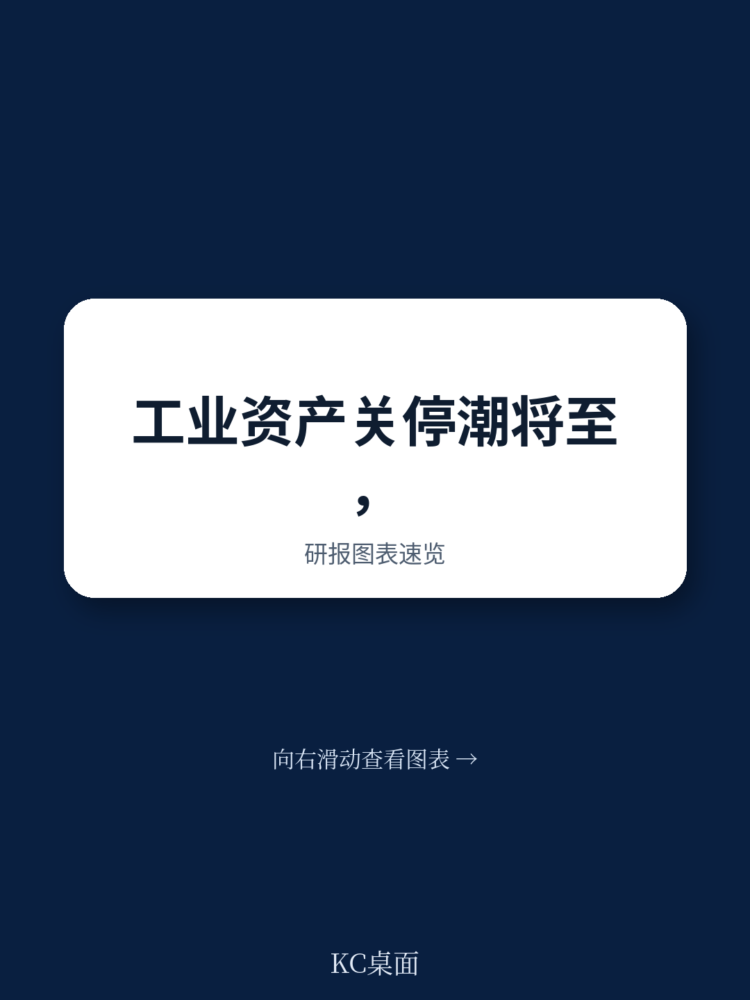
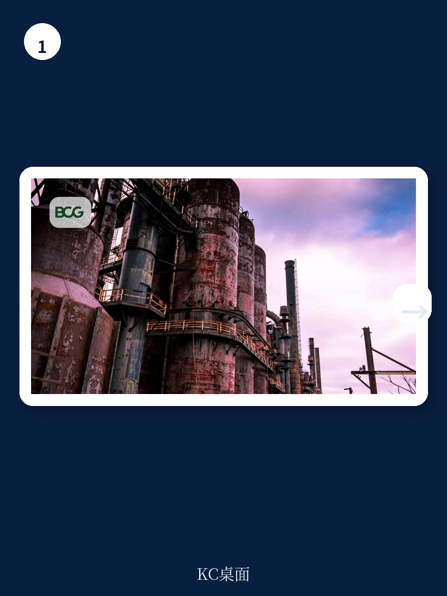
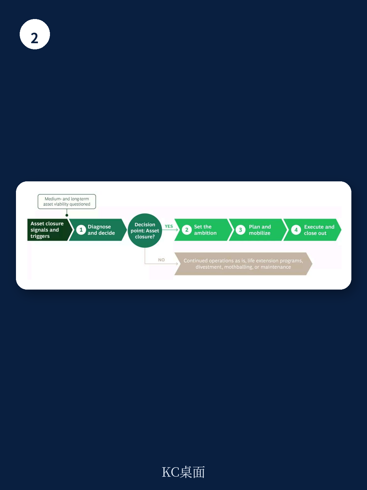

# 波士顿咨询：研究主题与行业变化观察

化工、钢铁和采矿行业的工业企业正在进入一个资产退出的密集周期。波士顿咨询（BCG）在2026年4月发布的一份报告中提出一个判断：未来十年，这些行业将有高达三分之一的工业资产面临关闭决策。老化基础设施、持续上升的维护成本、脱碳要求以及市场波动，把“关闭”从偶发的运营事件推向了常态化的组合管理议题。

报告的核心主张并不复杂：关闭资产是不可避免的，但价值流失不是。BCG认为，多数企业尚未准备好应对这一轮退出潮，导致资产关停在财务、运营和声誉三个维度持续侵蚀价值。而那些把关闭视为组合战略而非运营负担的公司，反而能借此释放被低效站点占用的资本，强化环境信用，并为下一阶段的业务布局腾出空间。

## 1. 关闭决策的评估框架从二元判断转向情景比较

报告指出，许多组织在关闭决策上的失败，源于把问题简化为“关或不关”的二元选择。BCG建议采用结构化评估：先建立完整的事实基础，包括资产健康状况、成本地位、维护积压、安全合规不确定性、技术过时程度和资本支出强度；再结合碳价轨迹、能源趋势和产品需求等外部条件；最后明确该资产在整个组合中的角色、依赖关系和替代方案。

在此基础上，企业需要量化多种情景的价值差异：继续运营、延迟关闭、转型改造或完全退役。情景分析会暴露现金流、碳暴露和长期负债之间的权衡关系。报告认为，这种分析能把关闭从情绪化争论转变为数据驱动的研究选择，并为决策时机提供客观触发点，例如维护节点、碳阈值或市场变化。

> **KC评论：** 这里容易被忽略的是“组合视角”。一个站点的关闭可能影响上游产能利用、供应商议价能力或客户服务水平，单点评估往往会低估连锁反应。

## 2. 关闭后的土地用途决定价值释放空间

BCG报告提出了一个值得注意的观点：关闭的终点不是资产归零，而是土地和资源的重新定价。领先企业越来越倾向于把关闭站点视为更新平台——物流枢纽、可再生能源设施、数据中心或先进制造基地都是可行的转型方向。在某些情况下，关闭还能解锁此前受限制的资源，例如厂区地下的矿藏。

这一判断改变了关闭的宏观环境学。如果企业在早期就明确站点的未来用途，就可以据此调整退役和修复的范围与成本，保留更大的灵活性。报告特别提到，提前与潜在的未来所有者、开发商或读者接触，测试不同选项的可行性，有助于确认站点能否吸引长期资本。土地用途的规划因此成为关闭决策中影响价值上限的关键变量。

## 3. 四阶段流程将关闭转化为可管理的项目组合

报告将完整的关闭旅程划分为四个阶段：诊断与决策、设定雄心、规划与动员、执行与收尾。每个阶段都有明确的价值创造或破坏点。

诊断阶段的核心是建立事实基础并量化不同情景的价值差异。设定雄心阶段则要求企业回答一个更长远的问题：我们希望这个站点、这些员工和这张资产负债表留下什么遗产？这包括土地修复或再利用计划、财务架构设计（一次性费用、准备金和现金节奏）、治理机制（由高级管理人员负责，设立项目管理办公室协调各职能条线），以及对外叙事的一致性。

规划与动员阶段强调从最终状态倒推计划。例如，以“2030年前完成监管批准的修复”或“2029年前完成土地移交”为终点，反推关键路径、依赖关系和长周期许可。报告还建议在技术规划中重视早期资产特征识别，如危险材料鉴定或地下状况评估，并在研究阶段就让专业退役承包商参与，以对齐范围、不确定性和执行策略。

执行阶段则考验纪律和透明度。报告建议将安全、环境合规、循环宏观环境绩效和挣值指标放在同一套体系中跟踪，而不是分散在不同部门。任何范围或进度偏差都需要量化影响并记录审批，以保护成本基线并减少后续索赔和返工。

## 4. 领导者的准备清单覆盖关闭全周期

报告为面临关闭决策的管理者提供了一份分阶段的准备清单。在决策前，需要量化价值、定义触发条件和情景、组建跨职能的关闭准备团队，并尽早与监管机构和社区沟通。报告特别强调，董事会和读者应把关闭视为组合优化而非退缩，这需要一套清晰的价值叙事来支撑。

在雄心设定阶段，企业需要明确最终状态、将关闭纳入公司议程、建立治理结构、争取早期胜利（如社区参与会议、安全里程碑、启动场地调查），并保持一致的对外沟通。规划阶段则要求从最终状态倒推计划、研究于数据和许可、谨慎选择合同模式（范围明确时用总价合同，不确定性高时用单价合同加绩效激励），并建立整合安全、成本、进度、ESG和利益相关者指标的统一仪表盘。

执行和收尾阶段的关键动作包括：高层领导现场可见、快速管理偏差、奖励安全与环境管理表现、持续与利益相关者沟通、验证完成标准、记录知识、监控关闭后表现，以及将释放的资本和人才快速重新配置到战略增长方向。

> **KC评论：** 报告反复强调一个容易被低估的环节——关闭后的长期监测义务。修复完成不等于责任结束，长期监测需要明确资金和所有权归属，这部分成本如果在规划阶段没有计入，往往会在后期成为财务黑洞。

BCG报告的核心贡献在于把资产关闭从“运营终点”重新定义为“组合管理工具”。对于化工、钢铁和采矿行业的企业决策者来说，未来十年的竞争不仅体现在新建和扩张上，也体现在如何退出、何时退出以及退出后留下什么。那些在关闭决策上展现出与增长议程同等严谨度的公司，将把负责任转型转化为治理能力的证明和未来增长的基石。

For informational purposes only. Portions may be generated,translated,summarized,or edited with AI assistance based on source materials and may contain omissions or errors. Please verify independently. This is not investment,legal,tax,accounting,or other professional advice.

