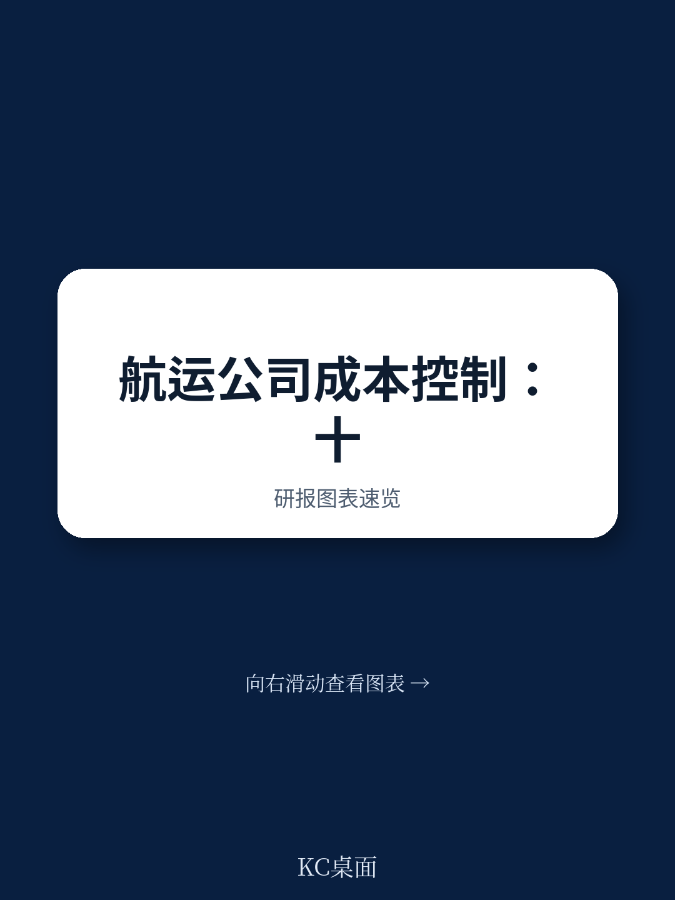
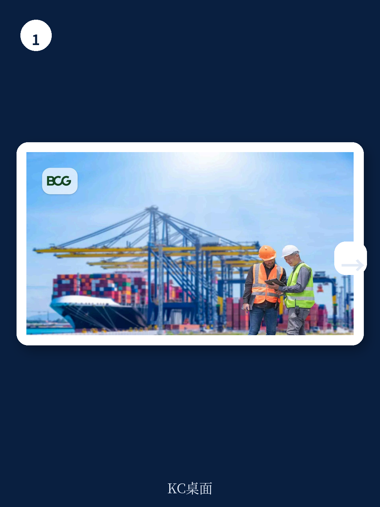
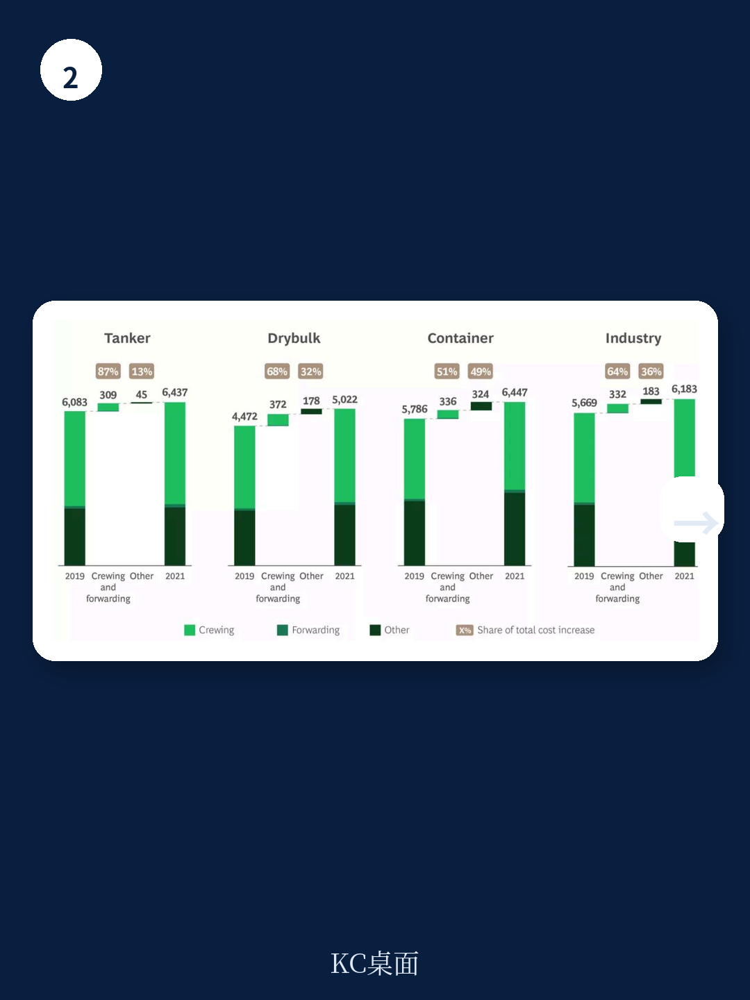

# 波士顿咨询：运输与供应链数据与主题变化观察

航运公司的运营成本（opex）在过去十年间经历了一个完整的紧缩、失控、再平衡周期。波士顿咨询（BCG）通过其航运基准倡议（Shipping Benchmark Initiative,SBI）对超过60家全球船东和管理公司的颗粒化成本数据进行分析，给出的核心判断是：行业已经重新回到成本纪律轨道，但下一阶段的成本优势不再只靠传统杠杆，而是取决于对“已知的未知”的预案能力、对老龄船队的维护策略，以及对技术变革的参与深度。

这份报告的价值在于，它没有停留在“要降本”的泛泛建议上，而是用十年数据拆解了成本波动的具体来源，并指出疫情时期成本失控的真正原因——不只是外部冲击，还有高运价带来的内部纪律松弛。

## 1. 疫情前五年行业实现累计13%的实际成本下降

从2014年到2019年，受低运费驱动，航运业进入系统性成本削减周期。经通胀调整后，行业日均运营成本年均下降2.7%，累计降幅达到13%。船员成本占船东总成本的50%至60%，这一期间年均下降2.5%，是成本削减的主要来源。

更关键的是成本与收入的关系变化。报告显示，经通胀调整后的运营成本占租船费率的比例，比假设成本仅随通胀增长的情形低了5个百分点。这意味着成本削减直接转化为利润空间的扩大，而非仅仅抵消通胀不确定性。

这一阶段的成本下降覆盖集装箱、干散货和油轮的所有船型，说明成本纪律是行业性的，而非个别公司的策略选择。

## 2. 疫情期间成本上升的主因是船员与货运代理费用

2019年至2021年，行业经通胀调整后的运营成本年均上升2.5%，其中集装箱和干散货板块分别以年均3.6%和4.0%的速度攀升。报告将成本上升拆解为两个来源：一是疫情直接相关的费用，二是高运价引发的成本纪律松弛。

船员成本因旅行限制、隔离和检测年均上升2.6%，货运代理成本年均上升11.6%。这两项合计仅占典型运营成本的60%，却解释了干散货船成本增量的68%和油轮成本增量的87%。集装箱船的比例较低，为51%，原因是该板块收入增长更快，成本管控的放松更为普遍。

报告还观察到一个容易被忽视的指标——船队内部成本差异（intrafleet variance）。疫情期间这一差异升至基准设立以来的最高水平，说明同一船东旗下相似船舶之间的成本表现明显分化。这暴露了两个问题：多数船队缺乏应对中断的应急预案，以及船队内部有效的成本实践共享不足。

> **KC评论：** 船队内部差异这个指标值得关注。它衡量的是同一家公司、相似船型之间的成本离散度，离散度越高，说明管理层的成本预测能力越差。疫情只是放大了原本就存在的管理短板，而不是创造了新问题。

## 3. 后疫情时期的成本回落与老龄船队带来的维护不确定性

2022年至2024年，行业重新回到经通胀调整后的成本下降轨道，年均降幅2.5%。船员成本维持在2021年的高位水平，但通过国籍切换等优化手段保持了总体持平。真正推动成本下降的是对非通胀敏感项目的控制。

但报告同时指出，维护与干船坞成本正在成为下一个不确定性点。2020年至2021年，经通胀调整后的干船坞成本年均上升10%至12%，原因包括中国的清零政策、能源与钢材价格上涨，以及中国以外地区的劳动力和基础设施瓶颈。报告认为，这一成本项未来几年可能继续以高于通胀的速度增长。

船队结构加剧了这一不确定性。过去十年，干散货和油轮运力增长约三分之一，集装箱运力增长近四分之三。联合国贸发会议数据显示，2024年全球平均船龄为13年，为有记录以来最高，比十年前高出两到三年。这批老龄船舶正在进入第三个干船坞周期，维护和修理（M&R）成本的重要性将显著上升。

## 4. 成本领先需要预案、维护策略与技术投入的组合

报告认为，传统成本杠杆如船员国籍切换和电子拍卖仍然有效，但不足以支撑下一阶段的成本领先。三个补充方向值得关注。

第一，为“已知的未知”建立应急预案。疫情的经验表明，船员和货运代理费用等特定项目可以解释绝大部分成本增量。预案需要同时覆盖韧性（如零部件和消耗品的双源采购）和灵活性（如与多国干船坞签订框架协议）。

第二，重新设计维护与干船坞流程。报告建议采用智能干船坞排期、捆绑维修计划、预测性维护和数据驱动的备件预测，以对冲老龄船队带来的成本上升。

第三，参与技术变革。报告援引BCG调查称，各行业计划在2026年增加AI投入，平均支出较2025年水平翻倍以上。在航运领域，应用方向包括基于大数据的预测性维护、半自主船舶降低船员成本，以及通过气象分析实现实时燃料优化。

> **KC评论：** 报告对技术变革的讨论没有停留在概念层面，而是指向了具体的成本科目：AI降低的是M&R成本和船员成本，这两项恰好是未来几年最可能失控的支出。技术投入不是锦上添花，而是对冲船龄老化和劳动力成本上升的手段。

波士顿咨询的这份分析基于SBI基准数据库，覆盖超过60家全球船东和管理公司，数据颗粒度到船级和成本科目。报告没有回避的一个事实是，行业在疫情中的成本失控部分源于高运价下的纪律松弛，这意味着当市场条件再次转好时，成本管控的优先级可能再次让位于收入增长。能否在顺周期中保持成本约束，将是下一轮行业分化的重要变量。

For informational purposes only. Portions may be generated,translated,summarized,or edited with AI assistance based on source materials and may contain omissions or errors. Please verify independently. This is not investment,legal,tax,accounting,or other professional advice.

