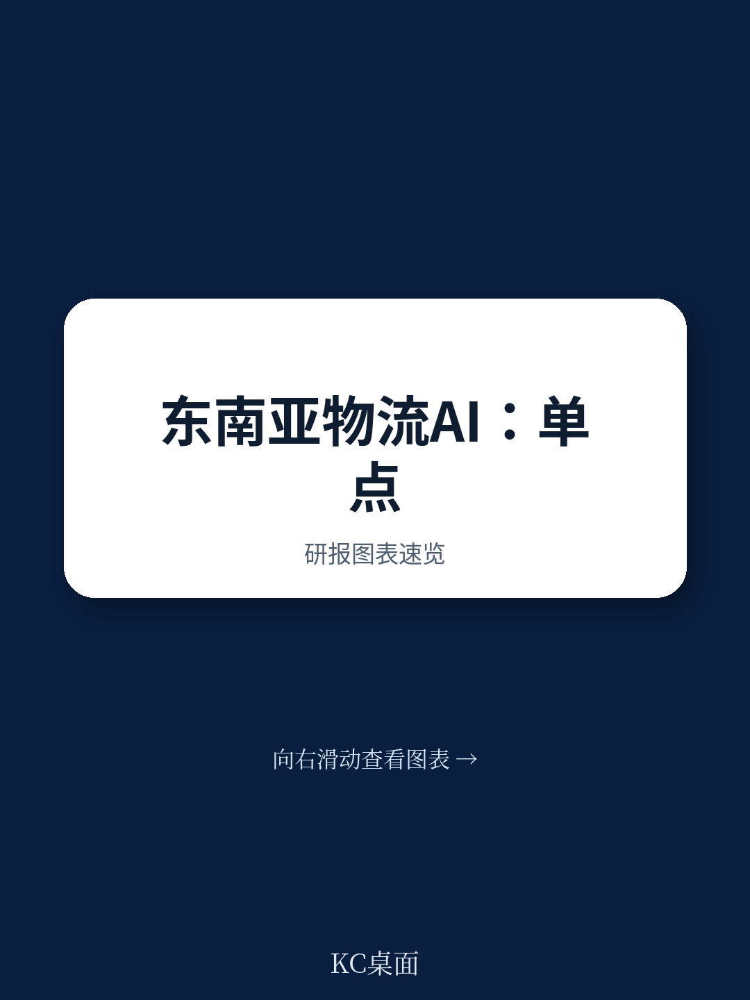

# 波士顿咨询：东南亚物流AI收益取决于链条互联-13%服务商报告财务影响

波士顿咨询在2026年7月发布的这份研报，基于对全球四个区域超过180家物流服务商和货主的调查，提出了一个与主流叙事不同的判断：物流AI的回报问题不是投入不足，而是部署架构存在结构性缺陷。报告数据显示，仅有13%的物流服务商报告了可衡量的AI财务影响，货主中这一比例更低至7%，而接近80%的受访者将成本降低列为主要研究动机。投入与回报之间的落差，在过去一段时间不仅没有收窄，反而随着采用速度加快而扩大。

报告认为，问题出在大多数AI应用被设计为单点解决方案。一家企业优化的输出，到了下一环节往往退化为人工处理的邮件或界面更新，精度在交接处逐级衰减。波士顿咨询提出的替代路径是“链条互联”：让每个环节的AI输出成为下一环节的机器可读输入，使精度沿运输链条累积而非重置。这一框架对东南亚市场的适用性，构成了报告后半部分的分析重点。

## 1. 亚太地区物流AI采用率领先其他区域

调查显示，亚太地区31%的物流服务商已将AI嵌入核心运营，北美为14%，欧洲仅为6%。东南亚作为亚太的一部分，其贸易结构放大了这一领先位置的潜在价值。区域贸易高度依赖少数转运枢纽，同一链路在大量航次中重复出现，意味着在枢纽处的一次改进可以作用于大批货物。印尼约17500个岛屿和菲律宾超过7600个岛屿的地理特征，使得多段运输成为常态，每一次交接既是精度流失点，也是链条互联可以回收价值的节点。

## 2. 港口运营商的公开数据策略形成不对称交换

报告以港口为例说明了链条互联的具体操作路径。在仅使用公开数据的保守假设下——包括AIS船舶位置、公共集装箱追踪门户、天气数据和公布的闸口时刻表——港口自建的到港预测模型可以显著优于依赖承运人报告的ETA。新加坡国际港务集团通过CALISTA和OPTIMAS平台已成为港口数字化的基准，印尼港口运营商Pelindo也完成了旗下码头的数字系统整合。报告指出，机会最明显的是二线和三线港口，这些地方承运人报告的ETA仍是主要规划输入。

一个关键机制是免费工具的引入。港口向支线运营商发布免费的泊位可见性仪表盘，运营商确认到港信息，港口获得比现有输入更准确的机器可读信号。使用方越多，数据质量越高。回报表现不依赖对手方的AI采用，而依赖工具本身对对手方足够有用。

> **KC评论：** 这里容易被忽略的是数据流向的逆向性。港口发布数据看似让渡信息优势，但换回的是对手方确认行为产生的回传数据，后者才是改善自身规划能力的核心资产。免费工具是获取数据的手段，不是目的。

## 3. 货运代理的跨环节视野构成结构性优势

货运代理接触的对手方数量超过链条中任何其他角色。报告指出，将所有客户、所有承运人的追踪信息聚合为单一视图，本身已是货主难以自行构建的能力。而累积数百批次、数十家承运人的追踪数据后形成的承运人绩效数据库，其价值可能更大：特定航线上的持续晚点模式，可以用于承运人选择和费率谈判。优势不在于数据本身——这些数据是公开的——而在于系统化聚合和分析的能力。

报告认为，货运代理看到的是承运人、港口、货主各自无法看到的全局。这种跨对手方视野是稀缺资产。当货运代理将碎片化的公开追踪转化为绩效基准时，竞争基础从数据获取转向综合能力，后者更难复制，也更具防御性。

## 4. 中小型运营商可在链条互联中获得先发优势

报告提出了一个与规模叙事不同的判断：链条互联开辟了一条不依赖规模的差异化路径。优势来自率先发布链条中其他参与者可以构建的数据，而非来自最深的资金储备或最完整的垂直整合。一个专注的中型港口、承运人或货运代理，如果在一个走廊中率先行动，可以设定其他参与者不得不适应的默认格式，并在大型竞争者投入之前积累数据优势。

报告同时列出了这一路径的约束条件。安全与数据质量是首要问题，发布数据意味着暴露运营表现，需要建立治理机制。维护API、版本化数据模式、支持外部消费者，是持续的投入而非一次性工程。组织层面的挑战同样存在：从依赖缓冲和非正式承诺转向可衡量、可问责的表现，需要领导层的支持。此外，如果某个参与者成为链条中的主导环节，可能获得定价权，也可能引发监管关注。

## 5. 输出架构决定AI研究是单点收益还是聚合回报

报告的核心结论落在构建时的设计决策上。当东南亚物流企业规划下一笔AI投入时，问题不仅是优化什么，还包括输出是否被构建为链条中下一环节可以读取的格式。为内部消费构建的模型捕获单一的孤立收益；同一模型以实时数据流形式发布，则进入一个将更好数据回传给自身规划系统的链条。开放与封闭、机器可读与人工可读，这一架构选择决定了单项研究停留在单点解决方案层面，还是聚合为结构性不同的回报。

报告承认，分享揭示运营表现的数据会带来竞争暴露。发布精确泊位可用性的港口同时暴露了自身利用率，发布准确ETA的承运人在延误时面临问责。早期行动者很可能是那些判断入站数据质量超过自身透明度让渡的参与者。随着采用扩散，这一计算会进一步偏向参与。

> **KC评论：** 报告反复强调“构建时”而非“规模化时”的决策，这一点容易被忽视。技术可以被资金快速复制，但先发者积累的数据和用户基础难以被复制。对于东南亚的中型物流企业，问题不是是否采用AI，而是今天构建的内部能力是否同时为与链条其他环节的互操作而设计。
