THE 2019 M&A REPORT
DOWNTURNS ARE A BETTER
TIME FOR DEAL HUNTING

BCG

Boston Consulting Group partners with leaders in business and society to tackle their most important challenges and capture their greatest opportunities. BCG was the pioneer in business strategy when it was founded in 1963. Today, we help clients with total transformation—inspiring complex change, enabling organizations to grow, building competitive advantage, and driving bottom-line impact.

To succeed, organizations must blend digital and human capabilities. Our diverse, global teams bring deep industry and functional expertise and a range of perspectives to spark change. BCG delivers solutions through leading-edge management consulting along with technology and design, corporate and digital ventures—and business purpose. We work in a uniquely collaborative model across the firm and throughout all levels of the client organization, generating results that allow our clients to thrive.

# THE 2019 M&A REPORT DOWNTURNS ARE A BETTER TIME FOR DEAL HUNTING

JENS KENGELBACH

GEORG KEIENBURG

MAXIMILIAN BADER

DOMINIK DEGEN

SÖNKE SIEVERS

JEFF GELL

JESPER NIELSEN

## CONTENTS

3 EXECUTIVE SUMMARY

8 GLOBAL M&A ACTIVITY TAKES A BREATHER
Alarming Trends Persisted in the First Half of 2019
Buyers of Public Targets Lose Investor Support
Four Major Trends

15 DEALMAKERS DO WELL IN DOWNTURNS
Why Do Buyers Outperform in a Weak Economy?
How Do Economic Conditions Affect Execution?
Experienced Buyers Excel in Downturns

21 HOW TO MASTER M&A IN A DOWNTURN
Apply the Lessons of Experience
Boldly Pursue Downturn M&A Opportunities
Use Transformational Deals to Stay Ahead of the Curve

26 APPENDIX I: METHODOLOGY

28 APPENDIX II: SELECTED BCG-SUPPORTED TRANSACTIONS, 2019, 2018, AND 2017

30 FOR FURTHER READING

31 NOTE TO THE READER

# EXECUTIVE SUMMARY

THE 2019 M&A REPORT examines how dealmakers should think about M&A activity in a downturn. Our recommendations are based on a study of the returns of dealmaking throughout the economic cycle. Simply put, our research shows that downturns can be excellent times for dealmaking. But success requires careful preparation, thorough execution, and, especially, bold decision making.

2018 might be remembered as the year that foreshadowed more challenging times ahead for dealmakers. The year got off to a strong start, but overall M&A activity fell sharply over the course of the year. Dealmakers coped with increased volatility in equity markets, decreasing valuations, and macroeconomic and political uncertainty. This turmoil carried over into the first half of 2019 and affected dealmaking around the world. Perhaps most alarming, for the first time since 2011, cumulative abnormal returns (CARs) were negative for acquirers of public targets—an indication that investor sentiment toward M&A is returning to the historical norm.

The net result for 2018, though, was a largely stable year in which global M&A value increased moderately despite declining volume. A 7% uptick left the global value near the five-year average. But after a strong first quarter, deal value declined steadily throughout the rest of the year. The fast start was attributable to a flood of megadeals (deals valued at \$10 billion or more)—17 in the first three months versus 14 thereafter. In the first half of 2019, M&A value stabilized near the long-term average while volume dropped significantly. The rebound in value was propelled by strong levels of North American dealmaking, supported by several megadeals, especially in the second quarter.

What will happen next? Several trends are likely to promote M&A activity. Corporations have ramped up sell-side activities, in some cases seeking to placate activist investors. Similarly, private equity firms are exiting investments to cash in on the returns achieved in the recent positive environment. At the same time, high levels of liquidity and low interest

rates are motivating buy-side activities. In many industries, digitization and the emergence of new business models are driving M&A-enabled transformations.

So far, so good. But the wild card here is the macroeconomic environment. Through several years of persistent political uncertainty and market volatility, the M&A market has remained resilient. Today, however, dealmakers must come to terms with the fact that the global economy is most likely in the later stages of the cycle. Trade wars, Brexit, weakness in China's economy, forecasts of slower growth, and ominous leading economic indicators are among the issues weighing down sentiment in capital markets. With storm clouds building, what can forward-looking dealmakers do to get ready for a recession?

We analyzed a unique data set totaling more than 51,600 deals made over the past 40 years that met our study criteria (out of our total M&A database of more than 750,000 deals). We found that, two years after a transaction, deals made in a weak economy created more value for buyers than those made in a strong economy. Boldness pays off—the outperformance is largely driven by acquisitions outside the buyer's core business segments. And, although occasional buyers create value through acquisitions in weak economies, experienced buyers outperform by a wide margin.

To prepare for dealmaking in a downturn, a company must carefully assess which types of acquisitions will set the foundation for strong growth in the recovery. To emulate experienced dealmakers, it must build the capabilities required to identify critical assets—both within and outside its core business segments—as well as those needed to execute transactions and integrate new businesses effectively.

## Deal value increased moderately, despite declining volume.

\- In 2018, global M&A value increased by about 7%, which is close to the five-year average. Deal volume declined slightly (by 3%), with about 35,800 deals announced during the year. But the annual figures mask a decline in deal value and volume in the second half of the year.

\- Europe and North America drove the global increase in deal value in 2018, with growth rates of 7% and 5%, respectively. Among other regions, only Latin America saw growth in deal value. Deal volume declined in all regions. Some industries posted increases in deal value, owing to outlier effects from a few large deals. However, nearly every industry saw a decline in overall M&A volume.

\- In the first half of 2019, M&A value stabilized near the long-term average. However, several alarming trends persisted. Europe and Asia-Pacific experienced sharp declines in deal value compared with the first half of 2018. Only North America saw an uptick in deal value, with US megadeals fueling the global rebound in M&A. In all regions, deal volume declined versus the first half of 2018. Most industries experienced a decline in deal value versus the first half of 2018—notable exceptions included energy and power and industrial companies, which saw double-digit increases. All

industries saw a decline in deal volume compared with the first half of 2018.

## Buyers of public targets lose investor support.

\- Deal multiples—enterprise value divided by EBITDA—declined slightly in 2018, to a median of about 13.7x. In the first half of 2019, multiples declined further to 13x. That is lower than the all-time high of 15x in 2017 but still above the long-term average of 12x. Acquisition premiums, on average, held steady in 2018 (24.1% in 2018 versus 24.6% in 2017.) In the first half of 2019, they rose to 31.2%—slightly above the long-term average of 30.6%.

\- Acquirers' CARs centered on the announcement date fell to an average of $-0.4\%$ in 2018. Although it is well above the historical average of $-1.1\%$ , this negative figure indicates a shift in sentiment compared with recent years. Targets saw their CARs dip slightly to $18.5\%$ in 2018, still above the average of $14.8\%$ .

## Various trends are shaping the M&A market.

\- Corporate divestitures and spinoffs, as well as private equity (PE) exits, are supporting supply. Although the volume of corporate divestitures fell slightly in 2018, total deal value rebounded to near the recent highs reached in 2014 and 2015. The volume and value of PE exits are also slightly off their peaks, but still at moderate to high levels.

\- High cash levels and dry powder are driving demand. Among the S&P Global 1200 (excluding financial institutions and insurance companies), cash holdings totaled \$2.4 trillion in 2018, down slightly from 2017 but still 21% above the level in 2013. Among PE firms, reserves of dry powder increased by 15%, continuing the streak of annual records.

\- Increasingly, the objective of deals is not to take control of a company but rather to gain access to specific capabilities, talent, or technology or to establish partnerships. The absolute number of venture capital (VC) investments by corporate investors and the relative share in all VC investments (by volume) have doubled since 2013. Two related developments are promoting the shift in emphasis: industry convergence and the emergence of complex corporate ecosystems throughout the business landscape and across industries.

\- In recent years, the M&A market has shown an unusually high level of resilience in the face of persistent political and economic uncertainty. Macroeconomic fundamentals have remained strong enough to support a healthy level of M&A activity. However, the cooldown in the second half of 2018 showed that resilience has its limits.

## Dealmakers can perform well in downturns.

\- Markets reward dealmakers who take the risk of pursuing acquisitions in a weak economy. One year after an acquisition, buyers'

relative total shareholder return (RTSR) is nearly 7 percentage points higher for deals done in a weak economy than those done in a strong economy. After two years, the differential increases to more than 9 percentage points.

\- In a weak economy, acquisitions of businesses outside the buyer's industry (that is, noncore deals) create more value than those within the buyer's industry (core deals): one-year RTSR is 3.9 percentage points higher. In a strong economy, noncore deals destroy value for the buyer (RTSR of $-1.0\%$ ), while core deals preserve value (RTSR of $0.0\%$ ). Investors apparently prefer that companies focus on their core businesses in good economic times, while they appreciate diversification in weak economic times.

\- As a group, weak-economy deals take longer to close than strong-economy deals. This suggests that buyers—despite facing less competition—conduct more thorough due diligence or need more time to get the deal financing in place. The finding holds true regardless of whether the target is in a core or noncore segment of the buyer or whether the buyer is public or private.

## Experienced buyers excel in a weak economy.

\- Experienced buyers can create value from M&A in any economic environment (two-year RTSR of 1.1% in a strong economy and 7.3% in a weak economy). Remarkably, they achieve this value creation even as the overall sample experiences, on average, a negative two-year RTSR.

\- Occasional buyers destroy value in good economic times (two-year RTSR of $-13.8\%$ ). In weak economic times, they are able to deliver some value creation from M&A (two-year RTSR of $1.4\%$ ), but clearly lag behind the experienced buyers' returns.

To master M&A in a downturn, companies must follow a set of imperatives.

\- Apply the lessons of experience so that you can prepare for downturn dealmaking, use M&A to further your strategic objectives, and realistically assess a deal's potential to create value. Experienced acquirers apply their knowledge and outperform occasional dealmakers, especially in core deals in a weak economy.

\- Boldly pursue downturn M&A opportunities to advance your strategic agenda and get ahead of the competition. Successful corporate leaders use dealmaking to shape, remodel, or even completely transform their corporate portfolio.

\- Use transformational deals to stay ahead of the curve. Forward-looking companies that anticipate changes to their industry can use acquisitions in a downturn to tap into emerging revenue streams and profit pools. They can also acquire the complementary skills and capabilities that they need to address changing customer needs or to catch up on technological advances.

\- Take advantage of downturn opportunities—such as lower valuation multiples and targets’ lower standalone profitability during crisis times—to position the company for profitable growth during the recovery. Be bold and stay the course, even in the face of negative investor sentiment. The bottom-line advice for succeeding with M&A in a downturn is clear: Get off the sidelines and into the game, but make sure you are prepared to win.

# GLOBAL M&A ACTIVITY TAKES A BREATHER

TAKEN AS A WHOLE, 2018 continued the streak of good years for M&A activity dating back to 2014. Global M&A value increased by about 7%, which is close to the five-year average. Deal volume declined slightly (by 3%), with about 35,800 deals announced during the year. (See Exhibit 1.)

But the annual figures mask a significant development: both deal value and volume declined sharply in the second half of the year. The first quarter of 2018 was especially strong. The number of megadeals (those valued at \$10 billion or higher) announced in the first three months soared to 17, compared with a quarterly average of six in each of the previous ten years. In contrast, only 14 mega-deals were announced in the remainder of 2018. The slowdown in the second half of the year can be blamed on a number of factors, including increased volatility in equity markets, decreasing valuations, and macroeconomic uncertainty.

Europe and North America drove the global increase in deal value in 2018 with growth

EXHIBIT 1 | Global M&A Value Increased Moderately in 2018 Despite Declining Volume

After a strong start in Q1, M&A activity cooled down significantly...

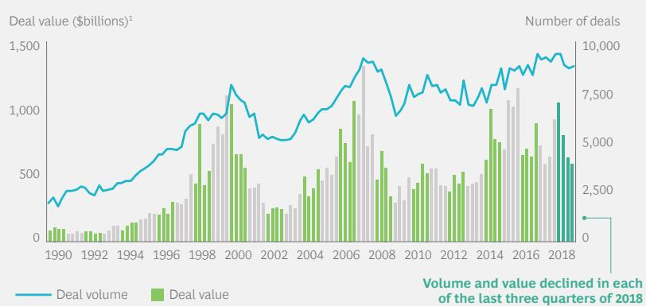  
Volume and value declined in each of the last three quarters of 2018  
...while total deal value remained stable near the five-year average

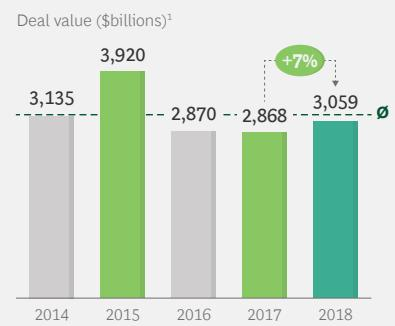  
Sources: Refinitiv; BCG analysis.  
Note: The total of 722,785 M&A transactions comprises pending, partly completed, completed, unconditional, and withdrawn deals announced between 1990 and 2018, with no transaction-size threshold. Self-tenders, recapitalizations, exchange offers, repurchases, acquisitions of remaining interest, minority-stake purchases, privatizations, and spinoffs were excluded. $^{1}$ Deal value includes assumed liabilities.

rates of 7% and 5%, respectively. Deal volume declined in all regions. Europe ( $-11\%$ ) and North America ( $-13\%$ ) were largely responsible for the overall global decline.

The value of global cross-border M&A grew by 45% in 2018, while volume followed the overall trend and declined by 6%. The same trend was seen, to varying degrees, on a regional level. Most notably, compared with the peak reached in 2016, outbound M&A from China experienced sharp reversals in both value (-78%) and volume (-31%).

In 2018, some industries posted increases in deal value, owing to outlier effects from a few large deals. However, nearly every industry saw a decline in overall M&A volume. The leader in deal value was the media and entertainment sector, with a 42% increase in 2018 (although volume was actually down by 4%) resulting from large-scale industry consolidation. Two noteworthy deals were US cable company Comcast's \$40 billion bid for Sky and Vodafone's \$22 billion acquisition of German cable operator Unitymedia. The health care industry posted the second-biggest increase, driven by large-scale deals such as the \$60 billion takeover of UK-based biopharmaceutical specialist Shire by Takeda, Asia's largest pharmaceutical company.

Alarming Trends Persisted in the First Half of 2019
In the first half of 2019, M&A value stabilized near the long-term average. However, some alarming trends persisted. M&A volume dropped to 15,400 deals, approximately 3,000 fewer than in the first half of 2018—possibly indicating an end to the current M&A cycle. (See Exhibit 2.)

The rebound in deal value was propelled largely by megadeal activity in North America, especially in the second quarter. Among the 21 megadeals announced in the first half of 2019, the following were the top five in value:

\- United Technologies' bid for Raytheon (\$87 billion)

\- Bristol-Myers Squibb's takeover of rival drug maker Celgene (\$79 billion)

\- Saudi Aramco's majority-stake acquisition of petrochemicals group Sabic (\$69 billion)

\- AbbVie’s bid for Allergan (\$62 billion)

\- Occidental Petroleum Corporation's outbidding of Chevron for Anadarko (\$38 billion)

EXHIBIT 2 | Volume Dropped Significantly in H1 2019 While Megadeals Pushed Value Above Average  
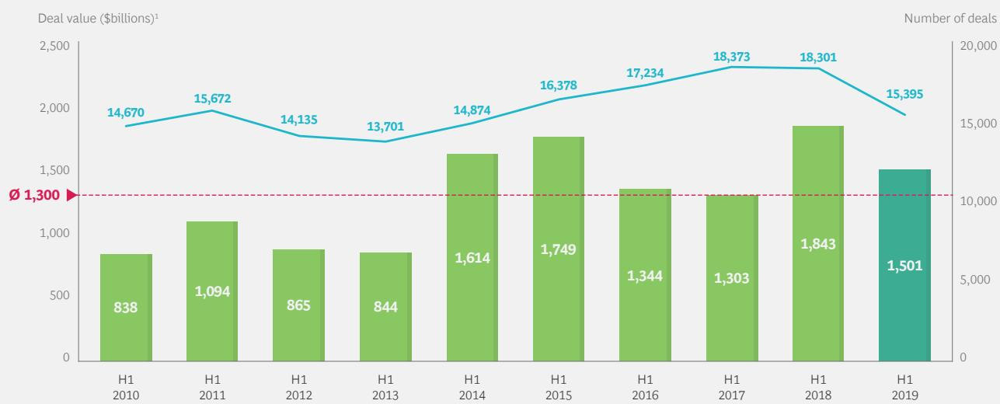  
Sources: Refinitiv; BCG analysis.  
Note: The total of 158,733 M&A transactions comprises pending, partly completed, completed, unconditional, and withdrawn deals announced between 2010 and June 30, 2019, with no transaction-size threshold. Self-tenders, recapitalizations, exchange offers, repurchases, acquisitions of remaining interest, minority-stake purchases, privatizations, and spinoffs were excluded. $^{1}$ Deal value includes assumed liabilities.

Comparing the first half of 2019 with the first half of 2018, deal value declined sharply in Europe ( $-60\%$ ) and Asia-Pacific ( $-45\%$ ). Only North America saw an uptick in deal value (16%), with US megadeals fueling the global rebound in M&A. Each of these regions saw relative declines in deal volume. The sharpest decline occurred in North America ( $-22\%$ ).

The first half of 2019 brought relatively few announced cross-border megadeals, possibly because of increased trade tensions and other geopolitical factors. Newmont Mining Corporation, a US company, acquired Goldcorp, a Canadian competitor, in a stock-for-stock transaction valued at \$10 billion. Barrick Gold Corp's hostile takeover offer for Newmont Mining, valued at about \$23 billion, was announced in the first half of 2019 as well, but later withdrawn.

Most industries experienced a decline in deal value compared with the first half of 2018. However, two industries stood out with double-digit increases (partly driven by larger deals on average): energy and power (11.2%) and industrial companies (22.6%). For example, among industrial companies, United Technologies' bid for Raytheon was responsible for a significant increase in the deal value of acquisitions of aerospace and defense companies. Deal value also increased in high tech (2.8%) and health care (6.1%). All industries saw a decline in deal volume compared with the first half of 2018.

Buyers of Public Targets
Lose Investor Support
In terms of valuation, deal multiples—enterprise value divided by EBITDA—declined slightly in 2018, to a median of 13.7x. In the first half of 2019, multiples declined further to 13x. That is lower than the all-time high of 15x set in 2017 but still above the long-term average of 12x. The continued decline in the first half of 2019 was driven, in part, by decreasing multiples in cyclical industries, such as industrial companies and consumer-related businesses. However, the average multiple paid for high-tech companies increased significantly. Acquisition premiums, on average, held steady (24.1% in 2018 versus 24.6% in 2017). In the first half of 2019, they rose to 31.2%—slightly above the long-term average of 30.6%. (See Exhibit 3.)

The past ten years have been relatively good times for dealmakers. Our analysis shows that, from 2009 through 2018, about half of all public-to-public M&A deals created value in terms of announcement returns and longer-term performance. For previous time periods, research and studies (including our own) have typically found that significantly less than half of deals achieve such success.

Traditionally, investors have reacted to the announcement of a public-to-public deal by pricing the target's shares somewhere near the bid price, while the acquirer's stock fell on concerns of earnings dilution, poor fit, exces-

## EXHIBIT 3 | Valuation Levels Fell from All-Time Highs

Valuation levels decreased in 2018...  
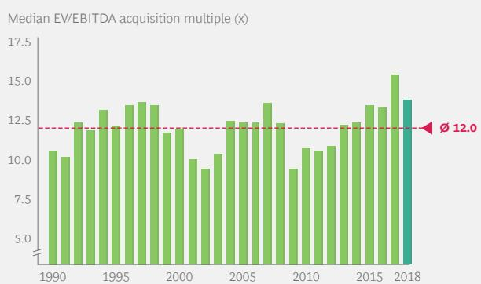  
...while premiums remained below average

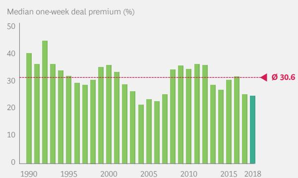  
Sources: Refinitiv; BCG analysis.

Note: The total of 12,110 M&A transactions comprises completed, unconditional, and pending deals announced between 1990 and June 30, 2019, with transactions of at least \$25 million and at least a 75% share transfer. Self-tenders, recapitalizations, exchange offers, repurchases, acquisitions of remaining interest, minority-stake purchases, privatizations, and spinoffs were excluded. Only deals with a disclosed value were considered.

sive diversification, or some other factor. From 2012 through 2017, however, cumulative abnormal returns (CARs) of both targets and acquirers were positive, indicating that investors were placing their bets on dealmakers.

In what may be a sign of more difficult times ahead for acquirers, 2018 saw a reversal of the recent trend. As shown in Exhibit 4, acquirers' CARs centered on the announcement date fell to an average of $-0.4\%$ . Although it is well above the historical (since 1990) average of $-1.1\%$ , this negative figure indicates that investors are growing skeptical about companies' ability to create value by acquiring public targets. Targets saw their CARs dip slightly to $18.5\%$ in 2018, still above the average of $14.8\%$ .

The shift in investor sentiment toward acquirers is attributable to several factors. With concerns mounting that a downturn may be near, shareholders are losing their appetite for risk and are scrutinizing more carefully an acquisition's potential to create value. This is consistent with our finding in the 2018 M&A Report that investors have become more skeptical about buyers' ability to deliver on the bold promises in their synergy announcements.

A review of several deals announced in the first half of 2019 demonstrates that investors are more carefully scrutinizing acquisitions' potential to create value. On the positive side for dealmakers, Danaher's stock jumped 8.5% after it agreed to buy General Electric's life sciences unit for \$21 billion. Shares in BB&T rose 4.5% after the company announced its \$28 billion merger with SunTrust. And investors welcomed logistics player DSV's acquisition of its competitor Panalpina, pushing shares higher by almost 6% on the day of the announcement.

But such positive reactions are no longer the norm. Bristol-Myers Squibb's shares plummeted 15% after the company announced a deal to acquire Celgene for \$90 billion. Although some shareholders (especially the activist investor Starboard Value) wanted to stop the deal, it ultimately received shareholder approval. Two large financial data and technology deals—FIS's takeover of Worldpay for \$43 billion and Fiserv's acquisition of First Data for \$39 billion—similarly resulted in sharp drops in the acquirer's stock after the announcement. In the tech sector, Salesforce's shares dropped by more than 5% in reaction to an announced deal to acquire Tableau Software for \$17 billion. European investors are increasingly skeptical about M&A moves. For example, Sunrise Communications Group's stock price declined by more than 8% after it announced the acquisition of UPC Switzerland, a Switzerland-based cable operator, from Liberty Global.

EXHIBIT 4 | Public-to-Public Deals Are Losing Investor Support  
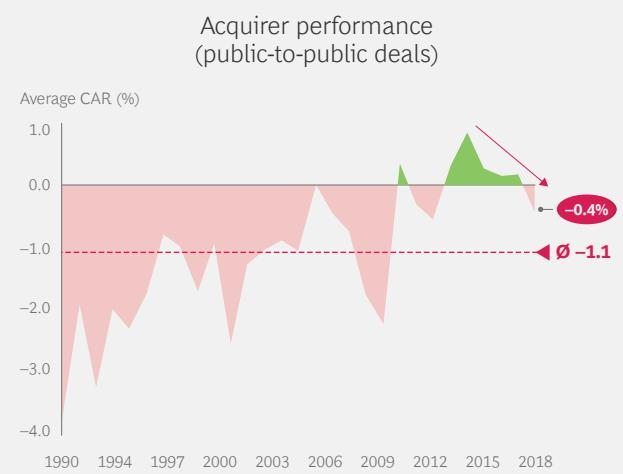

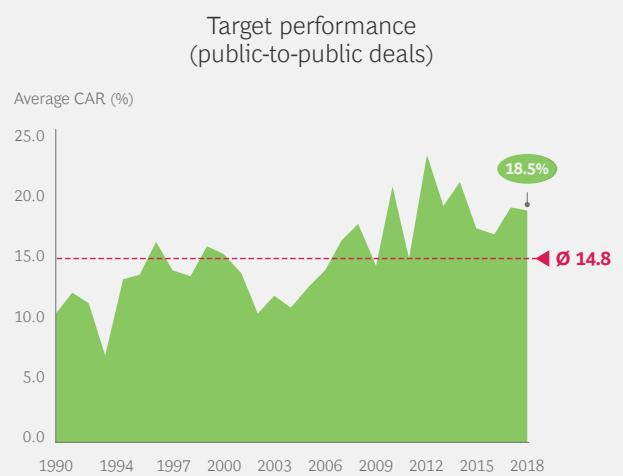  
Notes: The total of 4,509 M&A transactions comprises completed, unconditional, and pending public-to-public deals announced between 1990 and 2018 with transactions of at least \$250 million and at least a 50% share transfer. Self-tenders, recapitalizations, exchange offers, repurchases, acquisitions of remaining interest, minority-stake purchases, privatizations, and spinoffs were excluded. Only deals with a disclosed value were considered.

Sources: S&P Capital IQ; Preqin; BCG analysis.

## Four Major Trends

Where does the M&A market go from here? The market is being shaped by trends that influence both the sell side and the buy side, as well as by topics affecting the broader business environment.

Corporate divestitures and spinoffs, as well as private equity exits, support supply. Divestitures by corporations and private equity (PE) firms are on the rise, as these organizations seek to cash in on high valuations or sell assets that are at risk of underperforming before the next recession.

Although the volume of corporate divestitures fell slightly in 2018, total deal value rebounded to near the recent highs reached in 2014 and 2015. Some of the selling has been in response to, or in anticipation of, activists' demands. The need to address antitrust concerns in the merger-approval process, especially for megadeals, has also fueled sell-side activity. The volume and value of PE exits are also slightly off their peaks of 2017, though still at moderate to high levels.

High cash levels drive demand. Elevated levels of cash holdings, for both corporations and PE firms, will continue to support deal-making in the near term. Among the S&P Global 1200 (excluding financial institutions and insurance companies), cash holdings totaled \$2.4 trillion in 2018, down slightly from 2017 but still 21% above the level in

2013. Over the medium term, the fact that corporate cash holdings appear to have peaked may mean that some companies will choose to forgo M&A activity and instead hold onto their cash in anticipation of an economic downturn. Among PE firms, reserves of dry powder increased by 15%, up by a staggering 74% since 2013 and continuing the streak of annual records. (See Exhibit 5.)

Assets under management by activist investors reached \$384 billion in 2018, a 34% increase since 2013. Activists' interventions, whether actual or feared, serve as a catalyst for dealmaking and divestitures.

In addition, the interest rate environment is still favorable for dealmaking. Central banks plan on keeping rates low for an extended period and are even considering new rounds of rate reductions. There are nuances, however. While yields in Europe and Japan are still close to historic lows, yields for corporate bonds have recovered a bit in response to quantitative tightening in the US last year. However, it remains to be seen how the July interest rate cut by the US Federal Reserve will affect capital markets in the coming months.

Industry convergence and the rise of ecosystems encourage unconventional deals. The absolute number of venture capital (VC) investments by corporate investors and the relative share in all VC investments (by

EXHIBIT 5 | Elevated Cash Levels May Support M&A in the Near Term

S&P Global 1200 (excluding financial companies) have growing cash piles

Corporate cash holdings (\$trillions)

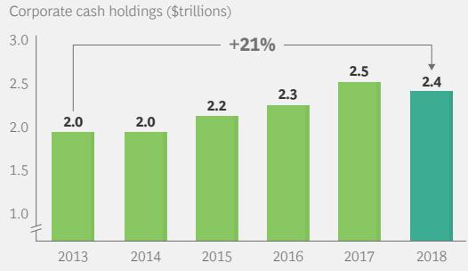

Dry powder continues to reach unprecedented heights  
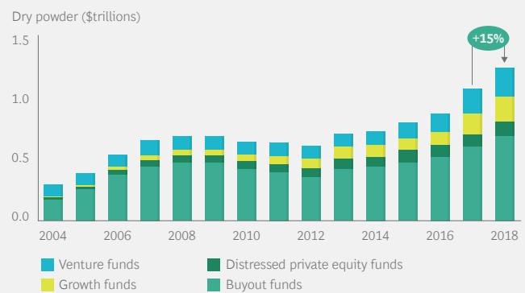  
Note: Corporate cash holdings are based on 1,006 constituents of the S&P Global 1200 index (excluding financial companies such as banks and insurance companies) for which cash holdings were reported for all years from 2013 through 2018.

Number of VC investments by corporates  
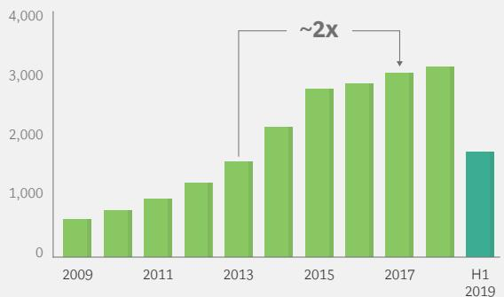  
Sources: Pitchbook; BCG analysis.  
Portion of total VC investments that are corporate VC investments (%)

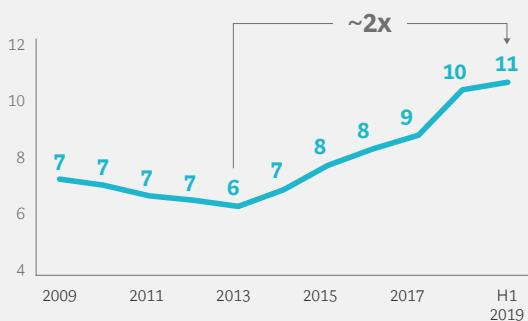  
Note: The total of 255,655 venture capital (VC) investments comprises investments made in VC funding rounds from 2009 through September 2019. The analysis considers all VC funding stages (accelerator/incubator, angel, seed, early, and later stage).

volume) has doubled since 2013. (See Exhibit 6.) Increasingly, the objective of deals is not to take control of a company but rather to gain access to specific capabilities, talent, or technology or to establish partnerships. Two related developments are promoting the shift in emphasis.

First, the increasing prevalence of tech-enabled business models is blurring the boundaries between industries and leading to the convergence of previously distinct business sectors. For example, the distinction between mobility companies and technology companies has blurred, as ride-hailing apps (such as Uber, Lyft, and Didi) and developers of self-driving vehicles (such as Waymo, a subsidiary of Alphabet) enter the sphere of automakers and other traditional mobility players. Similarly, traditional banks and insurers face increased competition from “fintechs” and “insurtechs” as well as digital payment providers. Industry convergence is also occurring between the telecommunications and media industries, as evidenced by AT&T’s acquisition of Time Warner.

Second, as companies increasingly integrate technology into their products and services, complex ecosystems are emerging throughout the business landscape and across industries. To bring together all the required elements of technology-enabled offerings, companies must work with a far wider range of partners than in the past. Traditional bilateral

partnerships within a single industry are giving way to multilateral cross-industry partnerships, potentially involving dozens of players. Because such ecosystems are fluid and dynamic, and not perfectly controllable, dealmakers will need to utilize a wider range of deal types and consider different depths of integration.

These two developments are giving rise to more cross-industry transactions. In this context, nontraditional deals—including joint ventures and alliances, corporate venture capital investments, and the purchase of minority stakes—are gaining importance. Several recent announcements illustrate the growing role of alliances:

\- In January 2018, Amazon, Berkshire Hathaway, and JPMorgan Chase announced that they would form an independent health care company to provide services to their employees in the US.

\- In September 2018, Netflix and numerous camera equipment, editing, color correction, and encoding companies created the Post Technology Alliance. The objective is to ensure that participating companies' products comply with Netflix's content specifications.

\- In May 2019, Toyota participated in a funding round for Uber's self-driving car unit, Uber Advanced Technologies. Other participants included Softbank's Vision Fund and automotive components manufacturer Denso.

\- Some companies are beginning to build their entire business around ecosystems. For example, Japan's Softbank Group is building a comprehensive system of subsidiaries and making other investments in sectors such as telecommunications and technology.

To succeed in nontraditional transactions, dealmakers need new skills related to scouting and negotiation. Post-deal collaboration, governance, and integration efforts are also getting more complex.

Resilience supports M&A activity. In recent years, dealmakers have generally shrugged off the political and economic uncertainty. This runs counter to the historical trend in which deal volume declined as uncertainty increased (as measured by the Economic Policy Uncertainty Index). However, the cooldown in the second half of 2018 showed that dealmakers will not maintain a “keep calm and carry on” mindset indefinitely. Even in recent years, deal volume has slumped in response to market volatility (as measured by the VIX Index).

The overall resilience of the M&A market reflects the fact that dealmakers focus more on the fundamentals of the macroeconomic environment (such as economic growth, forecasts, and megatrends) than on the latest headlines or market gyrations. Despite a multitude of risks—including Brexit, trade wars, the slowdown of China’s economy, and fraying international alliances—these fundamentals have remained strong enough to support a healthy level of M&A activity.

However, the arrival of the next recession is a matter of when, not if. A global economic downturn will eventually occur—whether triggered by a specific shock or the long-overdue end of the current recovery. Recent downward revisions in the GDP growth forecasts for many regions and countries, as well as generally declining growth rates, could be the first indicators of a looming downturn. When the recession arrives, should dealmakers pull back from their core pursuit? Our research indicates that the answer is no. In fact, as the next section of this report explains, pursuing M&A deals during an economic downturn can create value for buyers.

# DEALMAKERS DO WELL IN DOWNTURNS

DOWNTURNS ARE NOT A time for dealmakers to retreat to the sidelines. In fact, our research shows that markets reward dealmakers who take the risk of pursuing acquisitions in a weak economy. (See the sidebar “About Our Data Set and Analyses.”) Two years after an acquisition, buyers’ relative total shareholder return (RTSR) is significantly higher (and positive) for deals done in a weak economy than for deals done in a strong economy. (See Exhibit 7.)

For our analysis, we used an RTSR index to assess the performance of strong- and weak-economy deals. The index compares performance around the time of the deal announcement (in terms of CAR) and one year and two years after the announcement (in terms of RTSR). Around the deal announcement, the difference in the CAR is rather small (0.2 percentage points). But the difference widens to nearly 7 percentage points one year after the deal, as the RTSR index decreases slightly for strong-economy deals to 99.7 while jumping to 106.4 for weak-economy deals. The increase for weak-

## ABOUT OUR DATA SET AND ANALYSES

The data set used for the analyses in BCG's M&A research comprises approximately 759,000 deals, covering the period 1980 through 2018. We collected and collated data from a variety of financial databases, including Refinitiv (formerly Thomson Reuters Financial & Risk), Datastream, Worldscope, and S&P Capital IQ, as well as our own proprietary data and analytics. For the analyses in this report, we focused on roughly 51,600 deals that met our study criteria and involved transfers of majority shares, including spinoffs, with a transaction value of at least \$250 million. The data set covers all acquisitions—of both private and public targets—by public buyers.

To determine whether the economy was strong or weak in each year covered by our analysis, we looked at the growth rate of global GDP in real terms. We defined the top third of all growth rates in our observation period as an indicator of a strong economy and the bottom third as an indicator of a weak economy. We excluded years in the middle third of growth rates from the analysis.

EXHIBIT 7 | Weak-Economy Deals Outperform Strong-Economy Deals  
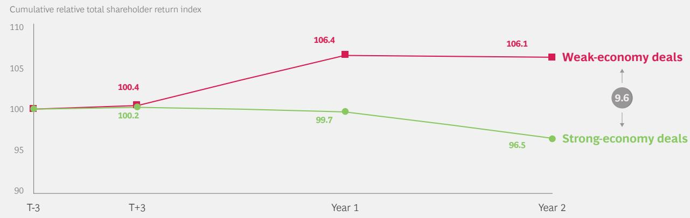  
Note: Strong-economy (weak-economy) years are those in which the respective global real GDP growth rate is in the top (bottom) third of all growth rates in our observation period. The total of 9,987 M&A transactions comprises pending, partly completed, completed, unconditional, and withdrawn majority deals announced between 1980 and 2018 with a deal value greater than \$250 million. Only deals with a public buyer were considered. The share price three days before the announcement date (T-3) equals 100. Share performance from T-3 to three days after the announcement (T+3) equals the announcement effect.

economy deals translates into an RTSR one year after the announcement of 6.4%. The gap between strong- and weak-economy performance grows to more than 9 percentage points two years after the deal.

In this analysis, we used realized GDP growth as the benchmark for comparing performance. We reached similar results in benchmarking performance against the forward-looking Economic Policy Uncertainty Index. The similarity in findings implies a stable relationship between post-deal RTSR performance and the state of the economy at deal announcement. The remaining analyses in this chapter use realized GDP growth as the benchmark.

## Why Do Buyers Outperform in a Weak Economy?

Which specific types of deals are responsible for buyers' outperformance in a weak economy? To find the answer, we considered the short-term capital market reaction (in terms of CAR) as well as buyers' mid-term value creation (in terms of one- and two-year RTSR).

We compared the business models of the buyer and the target to determine if the acquisition involved a target within the buyer's industry (that is, a “core” deal) or outside the buyer's industry (that is, a “noncore” deal).

We then analyzed the difference in performance of core versus noncore deals. In our overall sample, capital markets perceive core segment acquisitions more positively on announcement (CAR is 0.1 percentage point higher). (See Exhibit 8.) However, this effect is driven mostly by the subsample of weak-economy deals; core segment acquisitions have a CAR of 0.6%, compared with 0.2% for noncore deals. Among other factors, higher levels of risk aversion during a weak economy may be leading capital markets to favor acquisitions of businesses within the buyer's industry.

Looking at the medium term, we observed a reversal of market preferences: noncore deals create more value for buyers (one-year RTSR of 4.0% for noncore versus 3.0% for core). Again, the subset of weak-economy deals drives this result. In a downturn, noncore deals outperform by a large margin: one-year RTSR is 3.9 percentage points higher than for core deals. During good economic times, by contrast, noncore deals destroy value for the buyer (RTSR of -1.0%), while core deals preserve value (RTSR of 0.0%). Investors apparently prefer that companies focus on their core businesses in good economic times, while they appreciate diversification in weak economic times.

Our findings point to two imperatives for dealmakers:

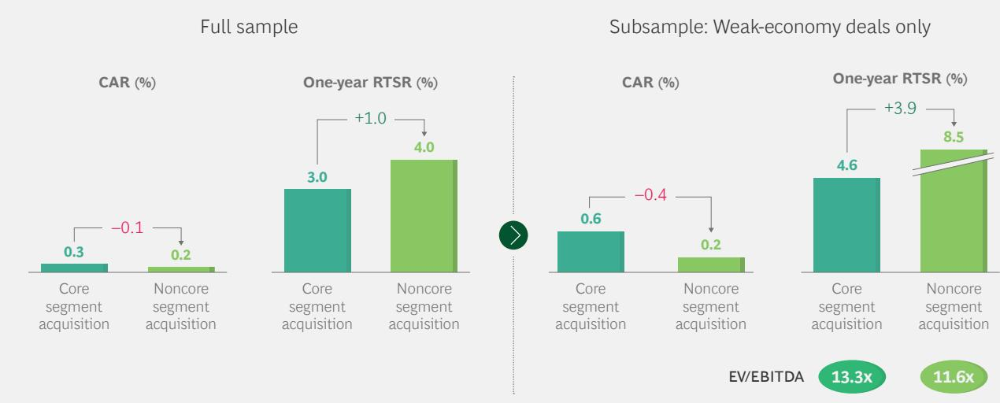  
Sources: Refinitiv; Datastream; BCG analysis.

Note: The total of 15,153 M&A transactions comprises pending, partly completed, completed, unconditional, and withdrawn majority deals announced between 1980 and 2018 with a deal value greater than \$250 million. Only deals with a public buyer were considered. A core segment acquisition is one in which the primary two-digit Standard Industrial Classification codes of the target and the acquirer are identical.

\- First, during downturns, have the courage to stay the course. A company that has a well-considered transformation strategy should not alter its plans when it faces the prospect of a negative short-term reaction by capital markets. Although core segment deals are greeted more favorably by markets around the announcement date, medium-term value creation is higher for companies that make bold moves to acquire attractive targets beyond their core industry. The higher returns might be partly attributable to the lower average deal multiple paid for noncore assets.

\- Second, in a strong economy, resist the temptation to go on a buying spree or to follow the crowd in acquiring the most sought-after assets. Our research makes clear that strong-economy deals deliver, at best, only modest returns. In fact, after a year, on average, noncore acquisitions destroy value. Corporate decision makers who simply follow the herd, without a clear strategic rationale for their acquisitions, will eventually destroy shareholder value. Academic research supports the view that an undisciplined, herd mentality is broadly responsible for the underperformance of strong-economy deals on average.

Economic conditions, as well as the target's industry, also affect value creation for the sellers of assets. (See the sidebar “Is It Wise to Divest in a Weak Economy?”)

## How Do Economic Conditions Affect Execution?

In addition to strategy and target selection, a well-executed M&A process, with the appropriate due diligence, is essential for creating value. How does the economic environment influence the effectiveness of the process? The time between deal announcement and closing is a proxy for the efficiency of the buyer, the complexity of reaching the closing conditions, and the length of the overall M&A process. We looked at how three variables—the economic environment, the industry of the target, and the type of target—affect the length of this time period.

Not surprisingly, as a group, weak-economy deals take longer to close than strong-economy deals—regardless of whether the target is public or private or in a core or noncore segment of the buyer. (See Exhibit 9.) Several factors may account for this finding. The decision-making process may take longer in a weak economy, because boards take longer to analyze and approve the deal and shareholder meetings take longer to prepare for. The due diligence process may be more thorough and thus take longer to complete. Acquirers also need more

# IS IT WISE TO DIVEST IN A WEAK ECONOMY?

Capital markets greet the announcement of divestitures, as a group, very positively. CAR around the announcement date is approximately 3%. Somewhat surprisingly, divestitures in weak economies have a slightly lower CAR than those in strong economies (2.9% versus 3.2%). Investors appear to place greater value on selling assets in good times (when prices are generally higher) than on unloading assets in downturns (perhaps at fire-sale prices).

In the medium term, the preference for sales in a strong economy is clearer. The one-year RTSR for sellers in strong-economy divestitures is 6 percentage points higher than that of weak-economy divestitures. (See the exhibit.) Interestingly, strong-economy divestures of core businesses are primarily responsible for this spread (one-year RTSR of 10.8%). Perhaps sellers are seeking to take advantage of high deal multiples (such as those observed in recent years) by divesting well-performing assets at high prices. Sellers can put the money to work again, such as by reinvesting it in M&A or organic growth, distributing it, or saving it.

Digging deeper, we find that noncore divestitures create value primarily during downturns (one-year RTSR of 3.0%). This suggests that companies are selling noncore assets in a downturn to generate funds to finance a turnaround and/or other strategic moves. This finding stands somewhat in contrast to our finding (discussed earlier) that buyers capture higher returns when acquiring noncore assets in a downturn. There are several takeaways from these conflicting messages:

\- A company that needs liquidity in a downturn should sell its noncore assets, not its “crown jewels.”

\- A company that is able to make acquisitions in a downturn should consider diversification or tapping into new business fields—in order to benefit from the lower acquisition prices and position itself for the recovery.

\- The economic cycle is among the factors that determine the optimal level of diversification for each company.

These aggregated findings do not mean that it is necessarily a bad move to divest noncore assets during an upturn. In fact, sales of noncore assets, sometimes made to appease activist investors, have become more common in recent years. Regardless of the state of the economy, creating value through divestitures requires the right portfolio logic and a crystal-clear understanding of where to invest the proceeds to generate higher returns than those generated by the divested asset.

Divesting Assets in Upturns Seems to Pay Off in the Medium Term

On announcement, investors react favorably to divestitures time to arrange for debt financing.
Additionally, a less competitive M&A market may reduce incentives to complete the process rapidly.

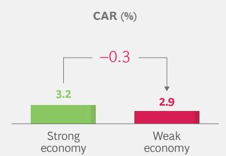  
Sources: Refinitiv; Datastream; BCG analysis.  
In the medium term, divesting in a strong economy creates value

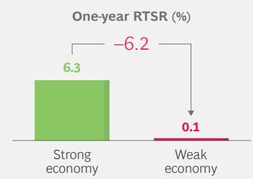  
Note: The total of 386 M&A transactions comprises pending, partly completed, completed, unconditional, and withdrawn majority deals announced between 1980 and 2018 with a deal value greater than \$250 million. Only deals with a public seller were considered.

EXHIBIT 9 | The Buy-Side M&A Process, Including Closing, Takes Longer in a Downturn  
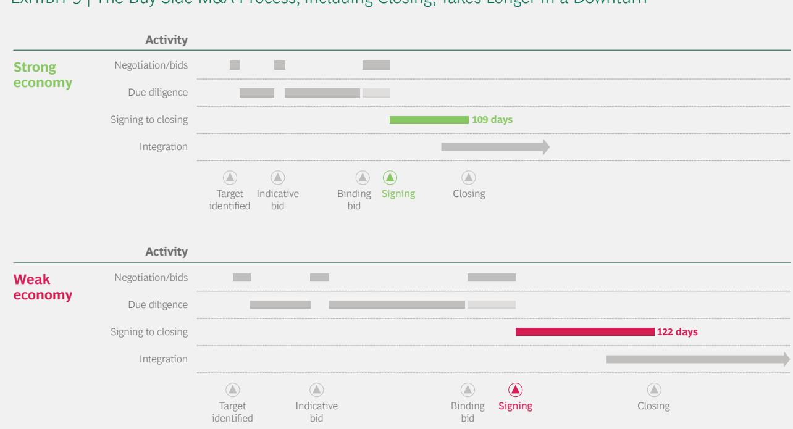  
Sources: Refinitiv; Datastream; BCG analysis.  
Note: Timelines are illustrative only. The total of 15,153 M&A transactions comprises pending, partly completed, completed, unconditional, and withdrawn majority deals announced between 1980 and 2018 with a deal value greater than \$250 million.

## Experienced Buyers Excel in Downturns

Does dealmaking experience make a difference with respect to value creation in a weak economy? To find the answer, we distinguished between two types of buyers: “occasional” buyers completed one to three transactions in our data sample; “experienced” buyers completed at least four transactions in the sample.

Confirming the results of research discussed in our 2016 M&A Report, we found that occasional buyers earn a higher CAR on announcement than experienced buyers (0.7% versus 0.2%). This is likely attributable to a positive surprise effect. Medium-term value creation is, however, negative for the occasional buyers (two-year RTSR of -6.6%). By contrast, experienced buyers apply the knowledge gained from their previous deals to generate significant value (two-year RTSR of 5.3%). (See Exhibit 10.)

This difference becomes even more apparent when you look at the subsamples of strong-and weak-economy deals. Experienced buyers can create value from M&A in any economic environment (two-year RTSR of 1.1% in a strong economy and 7.3% in a weak economy). Remarkably, they achieve this value creation even as the overall sample of strong-and weak-economy deals experiences, on average, a negative two-year RTSR.

Occasional buyers, in contrast, fail to create value from acquisitions in upturns—and are obviously responsible for the value destruction observed in the overall sample. In fact, they destroy value by a significant margin (two-year RTSR of -13.8%). In weak economic times, they are able to deliver some value creation from M&A (two-year RTSR of 1.4%), but clearly lag behind the experienced buyers' returns.

Overall, experienced buyers create more value than occasional buyers—and this is particularly true in a weak economy. These analyses also imply that, in general, occasional buyers should not shy away from doing M&A deals, especially in downturns. Indeed, they should regard a weak economy as an oppor-

Subsample: Weak-economy deals only

EXHIBIT 10 | Experienced Buyers Create Value from M&A in Any Economic Environment

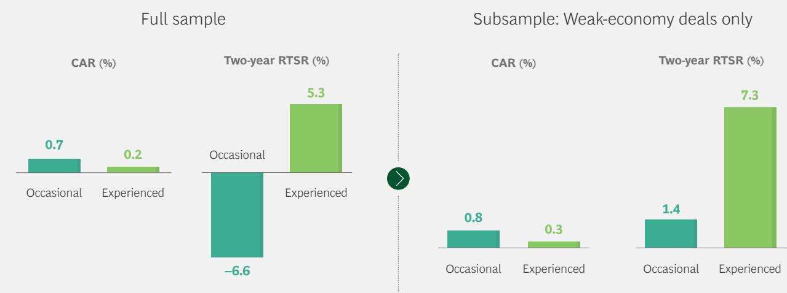  
Sources: Refinitiv; Datastream; BCG analysis.  
Note: The total of 51,644 M&A transactions comprises pending, partly completed, completed, unconditional, and withdrawn majority deals announced between 1980 and 2018 with a deal value greater than \$25 million. Only deals with a public buyer were considered. “Occasional” buyers completed one to three transactions in the data sample. “Experienced” buyers completed at least four transactions in the sample.

tunity to gain experience, because depressed asset prices (as reflected in the lower deal multiples observed during the Great Recession) increase the margin for error in deal-making. Of course, every acquisition should still be rooted in a clear-cut strategic rationale and sound financial considerations.

Our research and experience indicate that a number of characteristics set experienced buyers apart from occasional dealmakers. The next section explains how all companies can excel at M&A dealmaking during a downturn.

# HOW TO MASTER M&A IN A DOWNTURN

DRAWING ON OUR ANALYSES and experience, we have identified three imperatives for mastering M&A in a downturn:

• Apply the lessons of experience.

\- Aggressively pursue downturn M&A opportunities.

\- Use transformational deals to stay ahead of the curve.

Apply the Lessons of Experience
Experienced buyers are prepared to succeed, well-versed in how to use M&A to further their strategic objectives, and realistic about the potential to create value.

Preparation. It goes without saying that preparation is essential for success in downturn M&A. But many companies are not ready to take advantage of the opportunities.

Before the downturn actually occurs, be financially and strategically prepared for M&A. This means thinking about sources of funding and building up a “war chest” to tap into for acquisitions. It also means having an ongoing discussion about, and developing a list of, potential targets that suit your strategic requirements. Developing a target list before the downturn is a no-regrets move. If the economy remains strong, the company can act quickly if a buying opportunity (such as a PE exit) arises. And if the economy weakens, targets may be available at bargain prices.

As discussed earlier, dealmaking tends to take longer in a downturn, owing to factors internal and external to the company. To prevent unnecessary delays, it is crucial to have well-structured internal decision processes and strong M&A capabilities. Ensure that you can act fast and in a structured manner if and when a suitable target becomes available. Perform the necessary level of due diligence and be mindful of process hurdles, such as shareholder approval.

Proficiency. Experienced acquirers outperform occasional dealmakers, as noted above. This holds especially true for weak-economy deals within the same industry.

During an economic downturn, two commonly executed M&A strategies involve acquisitions within the buyer's industry: consolidation (acquiring one or a few comparably large direct competitors to reduce overcapacity and/or competitive pressure) and roll-ups (acquiring several relatively small direct competitors to gain scale and scope advantages in a fragmented market). The need to relieve cost pressure in a weak economy makes the benefits of such core deals especially attractive. Prominent examples include J.P. Morgan's takeover of Bear Stearns and Westpac's

acquisition of St. George Bank during the 2008 financial crisis. The consolidation of the steel industry during the years after the financial crisis also exemplifies this strategy.

Although the strategic concept is sound, occasional buyers often fail to create much value from such core deals. (See Exhibit 11.) In a weak economy, investors initially favor core deals. For occasional buyers, the CAR around the announcement date of core deals exceeds that of noncore deals by 0.5 percentage points, while for experienced buyers the CAR differential is 0.3 percentage points. In analyzing value creation after two years, however, it appears that occasional buyers fail to meet investors' expectations. For occasional buyers, the two-year RTSR of core deals is 1.2 percentage points lower than that of noncore deals. But for experienced buyers, the RTSR of core deals is 2.6 percentage points higher than that of noncore deals.

How do experienced buyers achieve superior value creation in core deals, including roll-ups and consolidations? Important skills include the ability to conduct a thorough and accurate assessment of the importance of additional scale and scope in the industry, the synergy potential, and the associated risk. For example, can large-scale mergers or acquisitions, which are usually complex, succeed in creating value through additional economies of scale? This benefit may not be realized if marginal production costs are already low or if the industry is better served through a collaborative, flexible ecosystem. Experienced buyers are able to anticipate the problems that could impede integration (such as significantly different corporate cultures), as well as the regulatory issues that could impact value creation or even lead to the deal's failure.

Realism. Experienced acquirers are realistic. They do not assume that buying an appealing asset at a low price guarantees value creation. Sustainable value creation requires advanced dealmaking capabilities—even more so in a downturn. Assess a deal’s value creation potential realistically, and don’t overstate the potential for synergies or a performance turnaround. To maximize value extraction, be sure to integrate the target rigorously and rapidly.

Companies that have superior operational capabilities are better equipped to withstand cost pressure in a downturn. Best-in-class companies have an advantage in M&A as well, because they can apply their capabilities to create tremendous value at poorly performing targets. But does M&A experience make a difference? To investigate, we used EBITDA margin as a proxy for a company's performance relative

EXHIBIT 11 | Experienced Buyers Extract More Value from Core Deals in a Downturn Subsample: Weak-economy deals only  
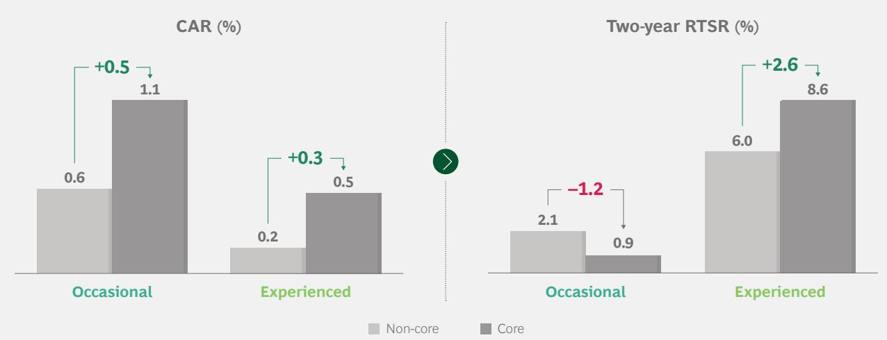  
Sources: Refinitiv; Datastream; BCG analysis.

Note: The total of 21,031 M&A transactions comprises pending, partly completed, completed, unconditional, and withdrawn majority deals announced between 1980 and 2018 with a deal value greater than \$25 million. Only deals with a public buyer were considered.

to its industry. (We excluded the financial, insurance, and real estate industries from the analysis.) We found that, during a downturn, occasional buyers create less value when they acquire an underperforming target than when they acquire well-performing targets. (See Exhibit 12.) For experienced acquirers, however, the difference between acquisitions of underperforming targets and acquisitions of well-performing targets is insignificant—they earn strong returns regardless of how well the target performed. These findings also hold true when we adjust the returns for associated risk, as measured by the standard deviation of the two-year RTSR. Clearly, experienced buyers possess capabilities that allow them to extract greater value from underperforming targets.

Our research also shows that experienced buyers perform significantly better, on average, than occasional dealmakers when acquiring an underperforming target. Even so, experienced buyers create value only in about half of their downturn acquisitions. The fact that a deal has, at best, a 50% likelihood of success reinforces the importance of assessing the potential for value creation. But for companies that get it right, the rewards are tremendous. For example, after Sanofi acquired Genzyme during the downturn in 2009, the drug maker quickly revamped manufacturing processes and operations while pursuing synergies in

the sales organization. In the automotive industry, after Groupe PSA acquired Opel, it applied its superior operational capabilities to transform the target company. Groupe PSA, the parent company of several automotive brands, had launched a highly successful turnaround program of its own in 2014. Applying its experience, Group PSA succeeded in reducing Opel's operating costs and streamlining its production processes, among other improvements.

## Boldly Pursue

Downturn M&A Opportunities
Some companies may be inclined to ride out a downturn without pursuing M&A. But our research shows that a difficult economic environment should not, by itself, send dealmakers to the sidelines—especially if they have a strong and well-considered acquisition strategy. Indeed, downturns are, on average, good times to make deals. Our research also shows that having a bold corporate leader is an important success factor in carrying out difficult acquisitions and turning around a target’s performance.

Successful corporate leaders use dealmaking to shape, remodel, or even completely transform their corporate portfolio. A downturn may not be a good time to divest business units that are sub-scale or both sub-scale and noncore. Instead, it could be a good time to acquire complementary businesses that would allow a company to increase the scale or, in some cases, the scope of such business units. Increasing scale could set the stage for a subsequent divestiture or spinoff. A company can take advantage of the downturn to become a master of the corporate portfolio, as discussed in our 2016 M&A Report.

EXHIBIT 12 | Experienced Buyers Earn Strong Returns No Matter How Well a Target Has Performed  
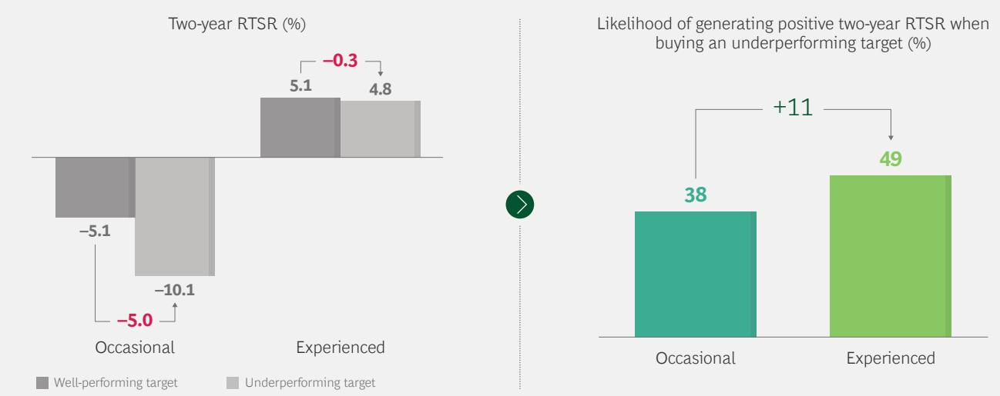  
Sources: Refinitiv; Datastream; BCG analysis.  
Note: The total of 3,204 M&A transactions comprises pending, partly completed, completed, unconditional, and withdrawn majority deals announced between 1980 and 2018 with a deal value greater than \$25 million. Only deals with a public buyer were considered.

Downturns often present good opportunities to increase the scale of business units, because suitable targets can be acquired at attractive valuations. The buyer's business unit benefits from increased scale and potential cost synergies. In some cases, when the economy recovers, the buyer may find that the expanded business unit can operate on a standalone basis. To reap further benefits from the newly gained clarity into the corporate portfolio, the company could split itself into two or more at-scale, pure-play businesses.

For example, in 2009, taking advantage of depressed prices in the aftermath of the financial crisis, Kraft acquired Cadbury following a hostile takeover bid. Kraft's goal in acquiring Cadbury was to increase the scale of its snacks business, especially in emerging markets. Cadbury rejected the initial offer, arguing that its absorption into a slow-growth conglomerate dominated by Kraft's North America-focused groceries business could limit the growth potential of Cadbury's snacks business. Kraft responded by increasing its offer price, and Cadbury's shareholders ultimately approved the deal. Kraft now had two sizable and distinct businesses—groceries and snacks. The acquisition gave Kraft's snacks business enough scale to thrive in the competitive environment on a standalone basis and clarified the business's value for investors. The company spun off the snacks business, renamed Mondelez, in 2012.

## Use Transformational Deals to Stay Ahead of the Curve

Consumer behaviors and demands are constantly changing and disrupting industries. If you anticipate such changes in your industry, consider using downturn acquisitions to transform your business and adapt to the new environment. But be aware that the

existing M&A toolbox might not be sufficient for transformative dealmaking. You need to think about deals in nontraditional ways, often from the perspective of creating a new ecosystem, building or participating in a collaborative network, or engaging in other non-traditional forms of cooperation. In this context, strategic partnerships, corporate venture capital, joint ventures, and minority M&A deals may be more effective than traditional acquisitions.

## Downturns present good opportunities to increase the scale of business units.

An example of forward-looking, transformative M&A in a downturn is BlackRock's acquisition of Barclays Global Investors (BGI) in 2009. Through the acquisition, BlackRock expanded from its core business of active management into passive-investment management. BGI included iShares, a leader in exchange-traded funds (ETF). The iShares ETF business had high recurring revenues and low capital requirements. BlackRock accurately predicted that ETF would have a major impact on the asset management industry. In the decade since it acquired BGI, BlackRock has grown to become the world's largest fund manager.

Instead of adding to an existing business or moving into adjacent ones, a company can use M&A to change its value proposition in the market, sometimes radically. A variety of external forces may compel such moves. These forces include rapidly changing customer behaviors (for example, the sharing economy), newly emerging business models (for example, robo-advisory in wealth management), and technological advancements and disruptions (for example, smartphones and 5G mobile networks). Such developments have the potential to drastically reduce or shift traditional profit pools.

Deals made in anticipation of, or in reaction to, these forces have a variety of rationales. A buyer can tap into emerging revenue streams and profit pools. It can also acquire skills and capabilities that complement those it possesses and are necessary to develop an offering that addresses changing customer needs. First movers can often capture the bulk of the benefits, especially if the new products or services are scalable or enabled by new technologies.

A few industries have already undergone or are in the midst of such transformational changes. Prominent examples are retail, media and entertainment, and automotive. Additionally, a number of other industries—including financial services and energy—face potential disruptions from nontraditional entrants attacking traditional profit pools. For example, oil and gas companies must find alternative sources of revenue in response to the increasing scarcity of natural resources and the shift to renewable energy.

Corporate decision makers in affected industries should view such radical changes, combined with the potential for a recession, as opportunities for transformative

dealmaking. The downturn might be the best time to acquire the targets needed for a transformation, possibly at a discount. Downturn M&A enables companies not only to react to a changing environment but also to accelerate out of the recession when the economy gains traction.

DOWNTURNS are challenging times to manage a business. As executives focus on short-term headwinds, they must not lose sight of their longer-term strategic objectives. Deal-makers play a critical role in ensuring that the pursuit of long-term value creation continues. They can help the company take advantage of downturn opportunities—such as lower valuation multiples and targets' lower standalone profitability during crisis times—to position itself for profitable growth during the recovery. To accomplish this, it is essential to be bold and stay the course, even in the face of negative investor sentiment. The bottom-line advice for succeeding with M&A in a downturn is clear: Get off the sidelines and into the game, but make sure you are prepared to win.

The research that underpins this report was conducted by the BCG Transaction Center during the first half of 2019. In assessing general market trends, we analyzed all reported M&A transactions from 1990 through the first half of 2019. For the analysis of deal values and volumes, we excluded transactions marked as repurchases, exchange offers, recapitalizations, or spinoffs.

## Short-Term Value Creation

Although distinct samples were required to analyze different issues, all return analyses employed the same econometric methodology. For any given company i and day t, the abnormal (that is, unexpected) returns $(\mathrm{AR}_{\mathrm{i},t})$ were calculated as the deviation from the expected returns $\mathrm{E}(\mathrm{R}_{\mathrm{i},t})$ . Abnormal returns are the difference between actual stock returns and those predicted by the market model. (See Equation 1.)

EQUATION 1

$$
A R _ {i, t} = R _ {i, t} - E (R _ {i, t})
$$

Following the most commonly used approach, we employed a market model estimation to calculate expected returns. $^{1}$ (See Equation 2.)

EQUATION 2

$$
E (R _ {i, t}) = \alpha_ {i} + \beta_ {i} R _ {m, t} + \varepsilon_ {i, t}
$$

The derived alpha ( $\alpha_{i}$ ) and beta ( $\beta_{i}$ ) factors were combined with the observed market returns ( $R_{m,t}$ ). (See Equation 3.)

EQUATION 3

$$
A R _ {i, t} = R _ {i, t} - (\alpha_ {i} + \beta_ {i} R _ {m, t})
$$

To determine the “announcement return”, we derived the cumulative abnormal return, or CAR, by aggregating the abnormal returns day by day, starting three days before the announcement date and ending three days after it. (See Equation 4.)

EQUATION 4

$$
C A R _ {i} = \sum_ {t = - 3} ^ {+ 3} (R _ {i, t} - E (R _ {i, t}))
$$

## Long-Term Value Creation

We track the stock market performance of the acquirers over periods of different length following the acquisition announcement. Note that we cannot track the targets because, in most cases, they are delisted from the public-equity markets.

First, we measure the total shareholder return (TSR) generated by the acquirer over a time period with length t. (See Equation 5.)

EQUATION 5

$$
T S R _ {i, t} = \left(P _ {i, t} / P _ {i, 0}\right) ^ {\left(\frac {1}{t}\right)} - 1
$$

Second, we subtract from the TSR the return made by a benchmark index over the same period in order to find the relative total shareholder return (RTSR) generated by the acquirer—in other words, the return in excess of the benchmark return. $^{2}$ (See Equation 6.)

## EQUATION 6

$$
\begin{array}{r l} & T S R _ {i n d e x, i, t} = \left(P _ {i n d e x, i, t} / P _ {i n d e x, i, 0}\right) ^ {\left(\frac {1}{t}\right)} - 1 \\ & R T S R _ {i, t} = \left(T S R _ {i, t} / T S R _ {i n d e x, i, t})\right) - 1 \end{array}
$$

Note that we could not include all deals in this analysis because the time elapsed since the announcement was too short to calculate the returns for some deals.

## Statistical Significance of Our Results

We applied common-practice statistical significance tests to all of the quantitative results in this report. We used two-sample t-tests to determine whether the difference between means is significantly different from zero—that is, whether the two groups do in fact have different means. All of our results turned out to be highly statistically significant (p<0.01).

## NOTES

1. See Eugene F. Fama, Lawrence Fisher, Michael C. Jensen, and Richard Roll, "The Adjustment of Stock Prices to New Information," International Economic Review 10, February 1969; and Stephen J. Brown and Jerold B. Warner, "Using Daily Stock Returns: The Case of Event Studies," Journal of Financial Economics 14, 1985.

2. The benchmark indexes we apply are the relevant worldwide Refinitiv (formerly Thomson Reuters Financial & Risk) indexes.

## APPENDIX II

SELECTED BCG-SUPPORTED TRANSACTIONS, 2019, 2018, AND 2017

## 2019

## BRIDGESTONE

TOMTOM TELEMATICS

Strategic advisor to the buyer €910M
BCG

## 2019

Strategic advisor to the seller
Value not disclosed

## 2018

## Consumer Healthcare

Strategic advisor to the acquirer in JV transaction
c. \$40B

## 2019

divesting its drinks and hospitality business

Strategic advisor to the seller
AUS\$10B

## 2019

## TOWERBROOK

Strategic advisor to the seller
Value not disclosed

## 2018

AtoS
worldline
in atoxcompany

Strategic advisor to the buyer \$2.9B

## 2019

KKR

## =exact

Strategic advisor
to the buyer
Value not disclosed

## 2018/19

## BNP PARIBAS

buying core banking operations of

## Raiffeisen POLBANK

Strategic advisor to the buyer \$956M

## 2018

THE CARLYLE GROUP

DiscoverOrg

Strategic advisor to the buyer
Value not disclosed

## 2019

strategic partnership and 5% investment in

## BMCE BANK

Strategic advisor to the buyer \$200M

## 2018/19

## MONSANTO

Clean team as an integral part of PMI preparation \$63B

## 2018

divesting their drinks business to

Strategic advisor to the seller €4.6B

## 2019

EQT

ANTAS

Strategic advisor to the buyer Value not disclosed

## 2018/19

Strategic advisor to the buyer \$484M

## 2018

sold a minority stake in its solar energy subsidiary

Strategic advisor to the seller \$74M

  
Unilever

## 2018

VISTRA ENERGY

DYNEGY

Strategic advisor to the buyer
Value not disclosed
BCG

## 2018

## PETROBRAS

Comprehensive support for carve-out / carve-in of energy businesses

Value not disclosed
BCG

2018

DJO COLFAX

Strategic advisor to the seller \$3.15B BCG

## 2017

BD

BARD

Strategic advisor to the buyer; strategic advisor on PMI \$24B BCG

## 2017

Strategic advisor to the buyer
Value not disclosed

## 2018

GENERAL ATLANTIC

Strategic advisor to the buyer
Value not disclosed

## 2018

Provide support on asset identification and design of tender program for the state-owned railway business
Value not disclosed

## 2018

divesting its heat pump business (Thermia) to

## STIEBEL ELTRON

Strategic advisor to the seller
Value not disclosed
BCG

## 2017

LAVAZZA
TORINO. ITALIA. 1895

Strategic advisor to the buyer \$160M

## 2017

Subsea cables
Strategic advisor to the buyer
\$0.9B

## 2018

buying US candy business of

## 2018

## MERCK

selling its consumer health (OTC) business to

Strategic advisor to the seller €3.4B BCG

## 2018

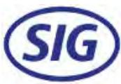

Strategic advisor in IPO

## 2017

Boehringer Ingelheim

Strategic advisor to the seller €21.8B BCG

## 2017

  
JOHN DEERE

## WIRTGEN GROUP

Strategic advisor to the buyer \$5.2B

## 2018

## Scandlines

Strategic advisor to the seller €1.7B BCG

## 2018

Wesfarmers

HOMEBASE Always low prices

Strategic advisor to the seller
Value not disclosed

## 2018

SANOFI
selling its European generics business Zentiva to
Advent International
GLOBAL PRIVATE EQUITY

Strategic advisor to the seller €1.9B BCG

## 2017

## MAERSK

divesting its oil & gas business

Strategic advisor to the seller \$7.5B BCG

## 2017

Strategic advisor to the seller €8.0B

BCG

## 2018

DAIMLER

combined their
mobility services in
an equally owned
joint venture

## 2018

Advent International GLOBAL PRIVATE EQUITY

Strategic advisor to the buyer Value not disclosed BCG

## 2017

I'm lovin' it
Sale of restaurants in the Nordics

Strategic advisor to the seller
Value not disclosed
BCG

## 2017 HALYARD

selling its S&IP business to

Strategic advisor to the seller \$710M BCG

# FOR FURTHER READING

Boston Consulting Group publishes many reports and articles on corporate development and finance, M&A, and PMI that may be of interest to senior executives. The following are some recent examples.

As Tech Transforms Auto, Deals Are Booming
An article by Boston Consulting Group,
August 2019

How Bold CEOs Succeed at M&A Turnarounds
An article by Boston Consulting Group, July 2019

As Global M&A Slows, Investor Activism Is on the Move
An article by Boston Consulting Group,
June 2019

After the Honeymoon Ends: Making Corporate-Startup Relationships Work
A report by Boston Consulting Group, June 2019

The 2019 Value Creators Rankings
An interactive guide by Boston Consulting Group, June 2019

Why Software PMIs Need to Get Agile
A report by Boston Consulting Group,
May 2019

The M&A Way into Distributed Energy  
A Focus by Boston Consulting Group, March 2019

Cracking the Code of Digital M&A
A Focus by Boston Consulting Group,
February 2019

The 2018 M&A Report: Synergies Take Center Stage
A report by Boston Consulting Group, September 2018

How the Best Corporate Venturers Keep Getting Better
A Focus by Boston Consulting Group,
August 2018

What Really Matters for a Premium IPO Valuation?
An article by Boston Consulting Group, July 2018

When Building International Joint Ventures, Set-up Matters
An article by Boston Consulting Group,
May 2018

As Prices Peak, Should Dealmakers Wait for the Next Downturn?
An article by Boston Consulting Group, March 2018

Anatomy of an Ideal IPO Candidate
An article by Boston Consulting Group,
February 2018

The Impact of US Tax Reform on Corporate Strategy and M&A
An article by Boston Consulting Group,
February 2018

The 2017 M&A Report: The Technology Takeover
A report by Boston Consulting Group,
September 2017

Cracking the Code in Private Equity Software Deals
A Focus by Boston Consulting Group,
May 2017

Six Essentials for Achieving Postmerger Synergies
A Focus by Boston Consulting Group,
March 2017

# NOTE TO THE READER

## About the Authors

Jens Kengelbach is a managing director and senior partner in the Munich office of Boston Consulting Group. He is also the firm's global head of M&A, the leader of the BCG Transaction Center, the head of the firm's Transaction & Integration Excellence practice in Germany, Austria, and Switzerland, and a member of the Industrial Goods practice. Georg Keienburg is managing director and partner in BCG's Cologne office and a core member of the Transaction & Integration Excellence practice and BCG's Transaction Center, focusing on deals in the industrial goods and health care sectors. Maximilian Bader is an expert project leader in the firm's Munich office. He is an expert on M&A and a core member of the Transaction & Integration Excellence practice and the BCG Transaction Center. Dominik Degen is a knowledge expert and team manager in BCG's Transaction & Integration Excellence practice in the firm's Munich office. Sönke Sievers holds the chair of international accounting at Paderborn University. Jeff Gell is a managing director and senior partner in BCG's Chicago office. He leads the firm's Transaction & Integration Excellence practice globally. Jesper Nielsen is a managing director and senior partner in BCG's London office. He is a core member of BCG's Transaction Center and its Transaction & Integration Excellence practice.

BCG Transaction Center
BCG's Transaction Center is the hub of the firm's global M&A expertise and provides businesses with end-to-end transaction support, including strategic decision making in mergers and acquisitions, preparing and executing divestitures, and supporting IPOs and spinoffs. The Transaction Center combines BCG's deep sector expertise with its comprehensive knowledge of, and experience in, all aspects of M&A across all sectors and industries. These services complement the process-focused offerings of investment banks. With more than 300 professionals worldwide, we concentrate on the commercial drivers of the business plan and equity story. We help both corporate and private equity clients execute deals efficiently and, more importantly, maximize value. For more information, please visit connect.bcg.com/transactioncenter.

Paderborn University
The authors are grateful for the support provided by Paderborn University, the University for the Information Society, which has a strong foundation in computer science and its applications. Paderborn's Chair of International Accounting, Sönke Sievers, focuses on research related to information processing in financial markets and valuation. Since 2019, he is a principal investigator in two projects of the TRR 266 Accounting for Transparency (https://accounting-for-transparency.de/), which is a transregional collaborative research center funded by the German Research Foundation (Deutsche Forschungsgemeinschaft – DFG). In addition to academic research, he intensively collaborates with business partners to advance knowledge in the fields of corporate finance, accounting, and mergers and acquisitions. For more information, please visit www.upb.de/accounting.

# NOTE TO THE READER

The authors thank Daniel Kim and Fabian Turcinov for their insights and support in the research and content development for this report. They also thank Monika Sturz, Boryana Hintermair, Lisa Chiecchi, and Gonca Yildrim for coordinating the publication, David Klein for his assistance in writing the report, and Katherine Andrews, Kim Friedman, Adam Giordano, Frank Müller-Pierstorff, Shannon Nardi, and Ron Welter for editorial, design, and production support.

For Further Contact
This report is a product of BCG's Transaction & Integration Excellence practice, which works with its clients to deliver solutions to the challenges identified in this report. If you would like to discuss the insights drawn from this report or learn more about the firm's capabilities in M&A, please contact one of the authors.

Jens Kengelbach
Managing Director and Senior Partner
BCG Munich
+49 89 231 740
kengelbach.jens@bcg.com

Georg Keienburg
Managing Director and Partner
BCG Cologne
+49 221 55 00 50
keienburg.georg@bcg.com

Maximilian Bader
Expert Project Leader
BCG Munich
+49 89 231 740
bader.maximilian@bcg.com

Dominik Degen
Knowledge Expert and Team Manager
BCG Munich
+49 89 231 740
degen.dominik@bcg.com

Jeff Gell
Managing Director and Senior Partner
BCG Chicago
+1 312 993 3300
gell.jeff@bcg.com

Jesper Nielsen
Managing Director and Senior Partner
BCG London
+44 207 753 5353
nielsen.jesper@bcg.com

© Boston Consulting Group 2019. All rights reserved.

For information or permission to reprint, please contact BCG at permissions@bcg.com.

To find the latest BCG content and register to receive e-alerts on this topic or others, please visit bcg.com.

Follow Boston Consulting Group on Facebook and Twitter. 9/19

## BCG