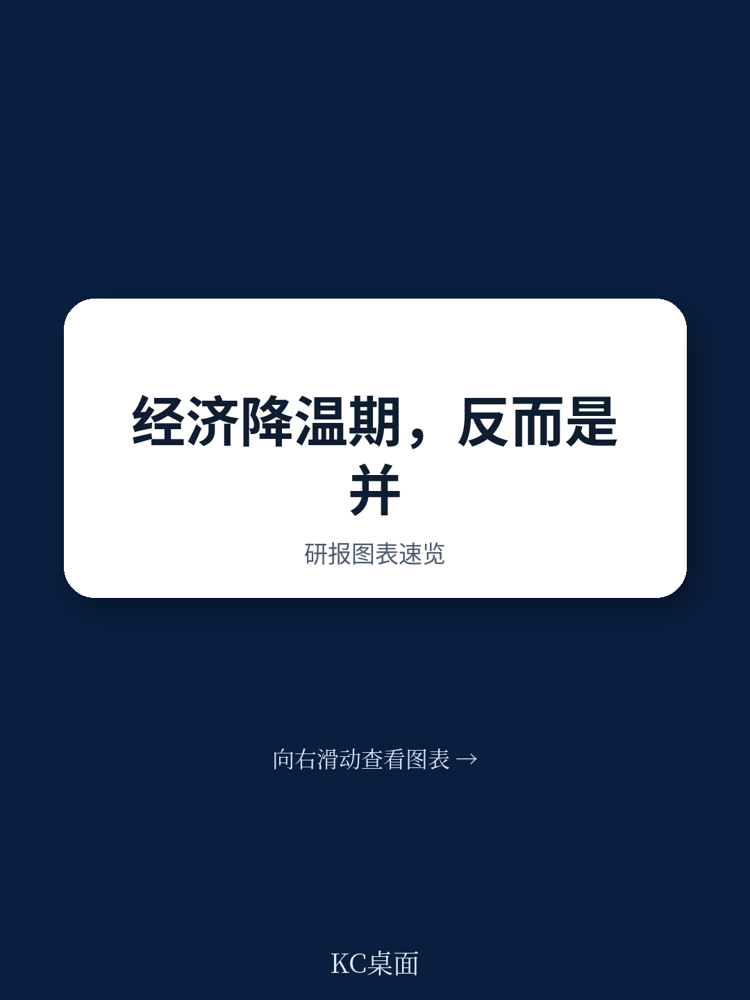
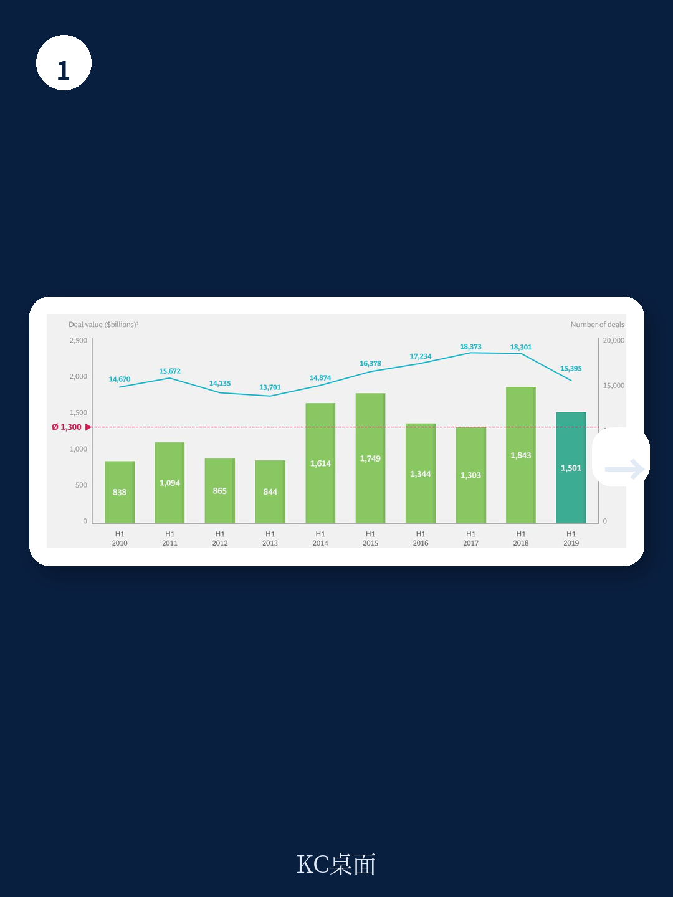
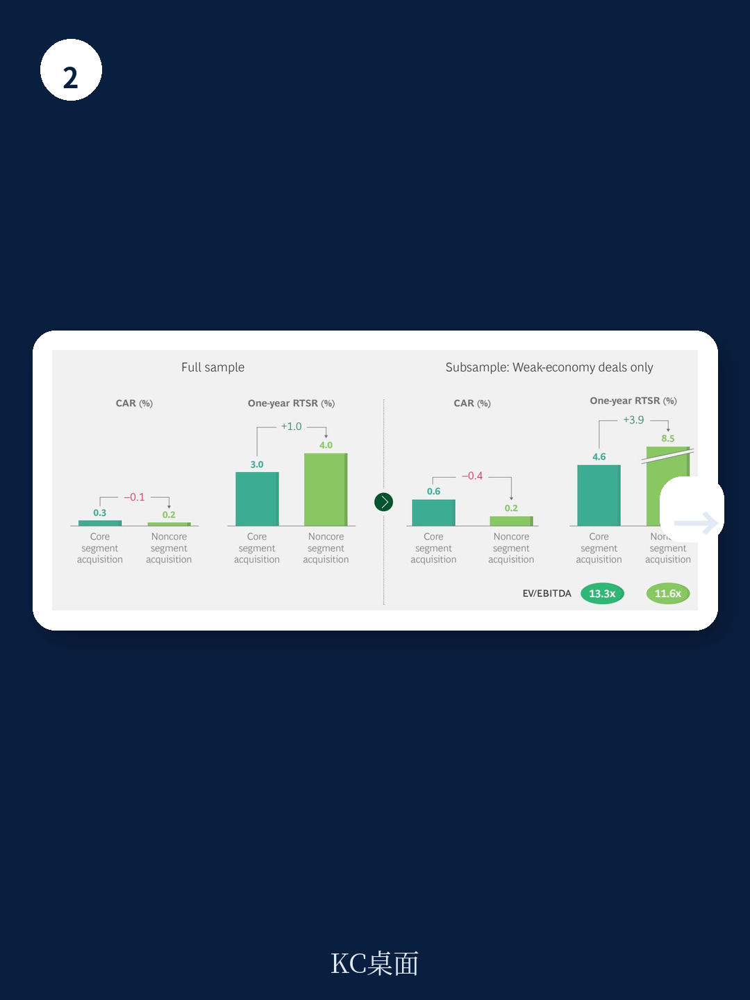

# 波士顿咨询：2019年并购报告-宏观环境调整期交易回报更高

波士顿咨询在《2019年并购报告》中提出一个与直觉相悖的判断：宏观环境仍在调整时期完成的交易，反而比繁荣期交易为买方创造更多价值。这项结论基于对过去40年间超过5.16万笔交易的分析，样本覆盖完整的宏观环境周期。报告认为，节奏变化期不是并购的禁区，而是需要更充分准备、更果断执行的窗口期。

2018年全球并购交易额同比增长约7%，接近五年均值，但交易量下降3%，全年约3.58万笔。更值得留意的是节奏变化：第一季度17笔百亿美元级大型交易推高了全年数字，此后三个季度交易额与交易量逐季回落。2019年上半年，交易额稳定在长期均值附近，但交易量降至1.54万笔，比2018年同期减少约3000笔。欧洲和亚太地区交易额同比分别下降60%和45%，北美靠多笔大型交易支撑了16%的增长。

报告同时记录了一个转折信号：2018年收购方在公告日附近的累计超额收益（CARs）降至-0.4%，这是2011年以来首次转负。虽然仍高于-1.1%的历史均值，但方向性变化值得关注。同期收购溢价中位数从2017年的24.6%微降至24.1%，2019年上半年升至31.2%，略高于30.6%的长期均值。

## 1. 弱宏观环境期交易两年后回报高出九个百分点

报告用相对股东总回报（RTSR）衡量交易完成后的价值创造。数据显示，弱宏观环境期完成的交易，一年后买方RTSR比强宏观环境期交易高出近7个百分点；两年后差距扩大到9个百分点以上。这一差距在统计上显著，且在不同行业和地区间保持稳定。

报告将交易分为核心业务收购（买方所在行业内的标的）和非核心收购（跨行业标的）。弱宏观环境期非核心收购的一年期RTSR比核心收购高3.9个百分点；强宏观环境期则相反，非核心收购的RTSR为-1.0%，核心收购为0.0%。读者在景气时偏好公司聚焦主业，在仍在调整时反而认可多元化布局。

> **KC评论：** 这里的关键不是“节奏变化期该不该做并购”，而是“节奏变化期该买什么”。报告的数据支持的是跨行业标的，而非简单抄底同行业资产。对决策者而言，这意味着节奏变化期的并购策略需要提前想清楚行业边界问题。

## 2. 经验丰富的买家在弱宏观环境期优势扩大

报告将买家分为经验丰富者和偶发买家。经验丰富者在强宏观环境期两年RTSR为1.1%，弱宏观环境期为7.3%；偶发买家在强宏观环境期为-13.8%，弱宏观环境期为1.4%。两组买家在弱宏观环境期都能创造价值，但差距明显。

弱宏观环境期交易从宣布到完成所需时间更长。报告认为，这可能是因为买家在竞争减少的情况下做了更充分的尽职调查，或需要更多时间落实融资安排。这一发现在核心与非核心交易、上市公司与非上市公司买家之间均成立。

## 3. 节奏变化期并购的观察框架

报告为准备节奏变化期并购的公司提供了一个可操作的框架。第一，评估自身是否具备识别关键资产的能力，包括核心业务之外的标的。第二，判断交易执行和整合能力是否到位，弱宏观环境期的交易周期更长，对资金安排和整合计划的要求更高。第三，明确交易的战略目的——是巩固现有业务，还是进入新的收入来源。

报告特别提到，2018年企业分拆和私募股权退出活动为并购市场提供了供给，S&P Global 1200成分公司（不含机构和保险公司）现金持有量达2.4万亿美元，私募股权机构可研究金（dry powder）连续创下年度纪录。这些资金基础意味着，一旦宏观环境明朗，买方具备启动交易的财务条件。

> **KC评论：** 报告的核心建议可以压缩成一句话：节奏变化期不是减少并购的理由，而是重新配置并购策略的理由。但前提是买方在景气期已经建立了交易能力，否则弱宏观环境期的窗口优势会被执行短板抵消。

## 4. 非核心收购在节奏变化期的价值创造机制

报告对非核心收购的发现值得单独说明。在弱宏观环境期，非核心收购的一年期RTSR为3.9%，显著高于核心收购；而在强宏观环境期，非核心收购的RTSR为-1.0%，核心收购为0.0%。这种反差说明，读者对多元化扩张的态度随宏观环境变化。

报告认为，节奏变化期非核心标的的估值更低，独立盈利能力也处于低谷，这为买方提供了以较低成本进入新业务领域的机会。但报告同时提醒，这类交易需要更长的整合周期，对管理层的跨行业管理能力要求更高。

波士顿咨询在报告结尾给出的建议是：不要站在场外等待，但要确保自己准备好再进场。这句话的完整含义是——节奏变化期的并购机会属于那些提前建立了交易能力、明确了战略边界、并能承受更长执行周期的公司。

For informational purposes only. Portions may be generated,translated,summarized,or edited with AI assistance based on source materials and may contain omissions or errors. Please verify independently. This is not investment,legal,tax,accounting,or other professional advice.

