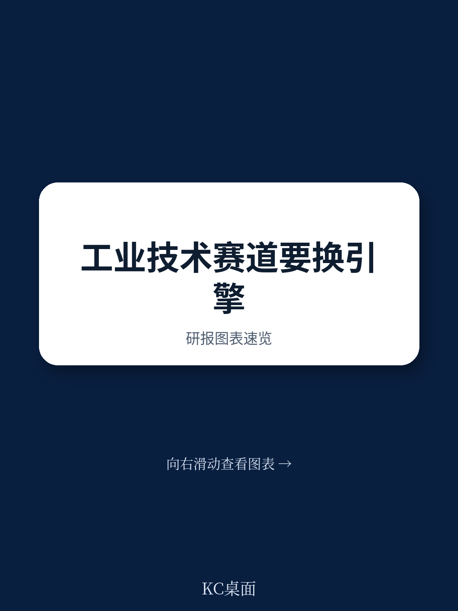
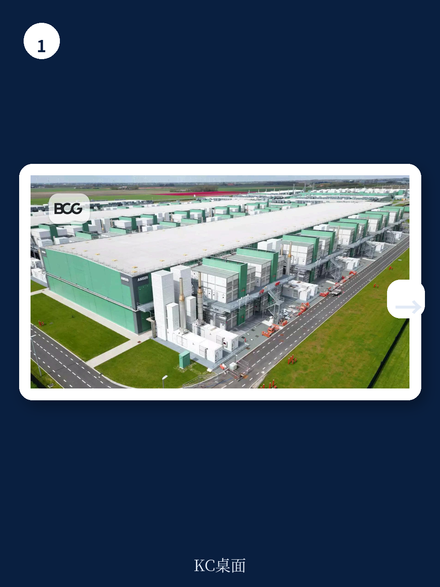
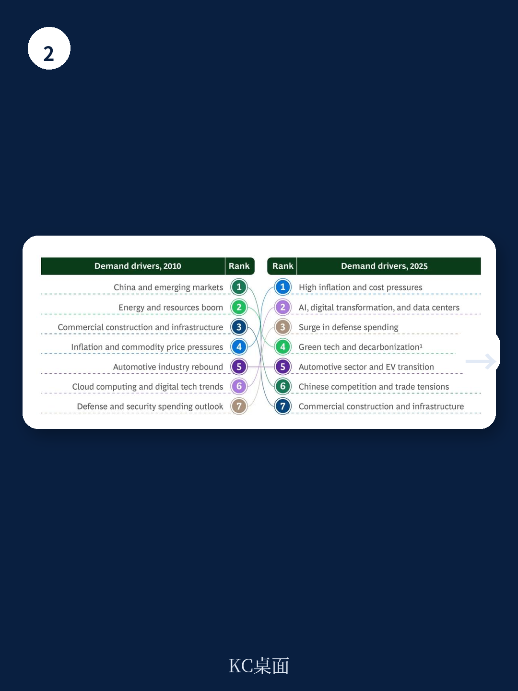

# 波士顿咨询：技术应用与行业运营观察

全球工业技术产业规模约5.8万亿美元，2025至2030年预计保持6%的年复合增长。表面数字平稳，但增长来源正在换轨。波士顿咨询（BCG）4月发布的这份研报，分析了280家工业技术企业的3000余场业绩电话会，并拆解了158个产品细分市场的需求变化，结论清晰：过去二十年驱动行业增长的三台引擎——中国工业化、汽车产业、绿色转型——正在减速，防务、数据中心与基础设施成为新的增长极。到2030年，这三个领域预计贡献约1.1万亿美元的增量需求，占行业增长的37%。

这份报告的价值不在于“行业仍在增长”这个结论，而在于它给出了增长换轨的具体路径和量级。对欧洲和美国的工业技术供应商来说，过去依赖中国市场和汽车行业的成功公式已经失效，新的客户结构、合同周期和竞争规则正在形成。

## 1. 中国市场需求结构变化，本土替代压缩外资空间

2015至2020年间，中国贡献了全球工业技术销售的四分之一。报告认为，这一比例难以维持。中国在光伏电池、电池、网络设备等领域已成为全球最大生产国，并在多数机械装备上实现自给。本土制造商在采购规则、产业政策和成本优势的支撑下，正在西方企业的本土市场展开正面竞争。

报告观察到，部分欧洲企业已调整策略：给予中国区运营更大自主权，引入私募股权资本增强竞争力，或选择退出无法长期竞争的市场。2025年5月，IFM与KKR合作应对中国市场变化；Viessmann则将热泵业务与Carrier合并，以获取规模优势。这些动作指向同一个判断：中国市场从“增长引擎”转变为“结构性战场”，外资供应商需要重新评估投入产出。

> **KC评论：** 报告没有说中国市场会消失，而是说它对外资供应商的“增量贡献”在下降。已经在中国站稳的企业仍有空间，但新进入者的窗口明显收窄。这个区分对制定区域策略很关键。

## 2. 汽车与绿色转型的机械需求增速回落

汽车行业对工业技术的需求占比，从2010至2015年的9%预计降至2030年前的4%。电动化减少了机械零部件需求，同时亚洲OEM自2023年以来保持10%以上的年增长，欧洲OEM市场份额自2017年下降超过13个百分点，利润率从7.4%降至5.1%。美国在电动车软件和高级驾驶辅助系统等关键技术领域领先，过去几年已承诺超过2780亿美元投向电动车和电池制造。

绿色转型领域同样出现分化。全球可再生能源研究仍在增长，但欧美供应商在脱碳技术市场的增长贡献预计从2020至2025年的5%降至未来五年的3%。氢能预期大幅下调——2030年氢气产量预测被削减约一半至550万吨，远低于行业和政府目标。Air Products在2025年暂停了纽约一座5亿美元绿氢工厂的建设，Ørsted在2023年底取消了新泽西州两个海上风电项目。

## 3. 防务、数据中心与基础设施构成新增长极

防务开支正在成为工业技术的新需求来源。欧洲2024至2029年军事建设预计新增超过9000亿美元支出，增幅83%；美国同期防务相关支出预计增长11%，并设定60%防务相关商品和服务本土采购的目标。报告认为，防务领域为供应商提供了长期、高利润、服务密集的合同机会，但也设置了高门槛：招标周期长、认证严格、关键设备供应链紧张——备用发电机的交付周期已从数月延长至数年。

数据中心是另一个快速膨胀的价值池。五年前数据中心仅占行业增长的5%，现在达到15%。工业技术产品占数据中心建设成本的10%以上，每50万平方英尺对应超过5亿美元的设备需求。发电设备制造商、楼宇技术供应商和工业自动化企业均受益。Rolls-Royce在2025年6月宣布将面向美国市场翻倍生产柴油备用发电机组，Schneider Electric与Nvidia合作开发下一代热管理系统，Honeywell与LS Electric联合开发AI驱动的电力与储能方案。

基础设施研究同样可观。2029年前全球基础设施研究预计达4.2万亿美元，年复合增长超过4%。欧洲交通项目2024至2027年计划支出超过3200亿美元，能源相关项目研究预计年增4.7%。全球工程机械销售预计2029年前每年增长5.6%，达到4000亿美元。

> **KC评论：** 报告对防务、数据中心和基础设施的测算，基于欧美上市公司的业绩电话会情绪和收入趋势交叉验证。三个领域的需求驱动逻辑不同——防务看地缘政治和本土采购政策，数据中心看AI算力扩张，基础设施看财政周期——但共同点是合同周期长、客户集中度高，对供应商的交付能力和合规要求与过去完全不同。

## 4. 客户结构与竞争规则正在改变

报告指出，工业技术供应商的客户群正从单一、稳定转向多元、动态。传统客户如建筑公司和车辆制造商的生产周期仍然较长，但数据中心客户可能要求在数月内完成大额订单交付。防务客户的要求更为复杂，供应商不仅要满足主承包商，还要应对不同国家的国防部门和采购机构。

全球市场的差异化也在加深。更多国家推行产业政策扶持战略产业，供应商需要应对不同的贸易和研究规则、本地采购要求和财政激励方案。报告认为，企业需要调整市场进入策略、拓宽客户基础，并在新的区域市场做出选择。过去“与OEM建立关系、保证机械品质、持续渐进创新”的成功公式，已经不足以应对新的竞争环境。

这份研报的观察框架可以简化为三个问题：现有客户群的增速还能维持多久？新增长领域的进入门槛和合同结构是否匹配自身能力？不同区域市场的规则差异是否已经纳入战略考量？对工业技术企业来说，增长换轨不是选择题，而是时间问题。
