Global Equity Strategy

# BARC Equity Factor Insights: May 2026

Risk-on is back in the US after a strong earnings season as war worries fade; we turn Positive on Growth & Momo, Neutral on Value & High-v-Low Vol, Negative on Quality. In EU, earnings benefited Value, which may gain from any broadening beyond Momo (now looking crowded). We maintain EU factor views.

The methodology behind US & EU factor basket construction can be viewed in Global Equity Strategy - Updating BARC Equity Factor Baskets for Liquidity Weighting, 2 Apr 2025.

In the US, we are Positive on Growth, supported by a clear return of risk-on sentiment, strong Tech and AI earnings surprises, and supportive discretionary and systematic flows into large-cap Tech. In Europe, we stay Neutral on Growth, as earnings momentum is improving but renewed rates volatility weighs on long duration support.

In the US, we have downgraded Value to Neutral, as its defensive, anti-AI profile is less attractive in a risk-on market, elevated long-end rates offer only partial support, and weak consumer sentiment weighs on its consumer-heavy exposure. In Europe, we are Positive on Value, viewing it as the cleanest beneficiary of any broadening beyond Momentum, with strong earnings delivery (EPS growth lifted to 7%, highest since 1Q23), improving earnings momentum, and a structurally negative correlation to Momentum.

In the US, we remain Positive on Large-over-Small, as large caps continue to deliver superior earnings revisions, operating leverage, and margin dynamics, while small caps face higher leverage and are more exposed to multiple-driven reversals, given multiples expansion in semis, software and construction. In Europe, we are Neutral on Small Caps, given cooling macro momentum and restrictive ECB policy may cap near term rotation upside, even as valuations look attractive.

In the US, we have upgraded Momentum to Positive as the rally has proven resilient, earnings growth is the strongest across factors, valuations remain supportive (fwd PE at 30th %-ile vs last 10y), and seasonality into May–June is favorable. In Europe, we stay Neutral on Momentum: performance has been strong and AI-led, but the trade is increasingly crowded, arguing for managing exposure rather than adding.

BARC Capital Inc. and/or one of its affiliates does and seeks to do business with companies covered in its research reports. As a result, investors should be aware that the firm may have a conflict of interest that could affect the objectivity of this report. Investors should consider this report as only a single factor in making their investment decision.

This research report has been prepared in whole or in part by equity research analysts based outside the US who are not registered/qualified as research analysts with FINRA.

Please see analyst certifications and important disclosures beginning on page 37.

Completed: 12-May-26, 01:14 GMT Released: 12-May-26, 04:10 GMT Restricted - External

SIGNATURE

# U.S. Equity Strategy

Venu Krishna, CFA

+1 212 526 7328

venu.krishna@BARC.com

BCI, US

# Riddhiman Dass

+1 212 526 0850

riddhiman.dass@BARC.com

BCI, US

# Rex Feng

+1 212 526 6114

rex.feng@BARC.com

BCI, US

Tianqi Feng

+1 212 526 9179

tianqi.feng@BARC.com

BCI, US

# European Equity Strategy

Emmanuel Cau, CFA

+44 (0)20 3134 0475

emmanuel.cau@BARC.com

BARC, UK

# Emmanuel Makonga

+44 (0)20 7773 2593

emmanuel.makonga@BARC.com

BARC, UK

# Magesh Kumar Chandrasekaran, CFA

+44 (0)20 3134 5983

magesh.kumarchandrasekaran@BARC.com

BARC, UK

In the US, we have downgraded Quality to Negative, as a risk-on rotation toward semiconductors, hardware, and speculative AI exposures has eroded its defensive appeal, while growth characteristics remain weak and valuations elevated. In Europe, we remain Neutral on Quality, reflecting a lack of near-term catalysts amid disruption from AI-led winners even as valuation support has improved risk-reward.

In the US, we have upgraded High-over-Low Volatility to Neutral following a sharp rebound supported by strong earnings and easing geopolitical concerns, although stretched valuations and mixed sector exposure cap upside. In Europe, we are Negative on Low Volatility, since relative valuations are still unattractive and the factor continues to screen poorly in a sticky inflation, higher rates environment.

In the US, we remain Neutral on Yield, as strong labor data and fewer expected Fed cuts weaken the bond proxy case, even as cheap valuations and light positioning limit downside risk. In Europe, Yield faces downside pressure, as the partial unwind of the conflict premium and further progress toward peace would mechanically weigh on energy-sensitive, high-yield exposures.

# CONTENTS

US factor analysis and views: May 2026....4

Europe factor analysis and views: May 2026....16

# US factor analysis and views: May 2026

# Equity market performance in April 2026:

- Risk assets posted an exceptional run in April, with the S&P 500 up more than 9% and Big Tech rallying by over 16%, as Growth outperformed Value across both large and small caps.   
- The rally was supported by easing U.S.-Iran tensions, allowing equity sentiment to decouple from oil-related concerns despite ongoing geopolitical uncertainty.   
- 1Q26 earnings have materially exceeded expectations, with strong Y/Y EPS growth driving elevated beat rates and outsized surprises across sectors. Within Big Tech, EPS surprises are tracking at +15.6% versus a long-term median of +7.2%, led primarily by Amazon; EPS growth of +35.8% Y/Y marks the fastest pace since 2Q24.   
- Valuations have begun to re-rate again, with Big Tech's NTM P/E rebounding from \~23x earlier this month to \~26x, alongside upward revisions to Street FY26 EPS estimates (consensus now \~\$334), driven mainly by Energy and, to a lesser extent, TMT.   
- Amid this constructive backdrop, BARC highlights that the resilience in US equities thus far can at least partly be explained by the energy shock being closer to five weeks old than eight weeks (see Living off the insurance, 4-May-26) due to sizeable inventories at the beginning of the conflict in Iran, but the expectation of only one Fed cut (penciled in for March 2027) combined with elevated energy prices for the rest of the year and a shrinking buffer in crude and refined product inventories, poses growing medium-term headwinds for risk assets.

FIGURE 1. Risk-on was back in full force in April, with Growth outpacing Value across cap sizes, and Momo surging   

bar

| Category | Monthly Sigma move over 20y | Ret (last month) |
| -------- | -------------------------- | ---------------- |
| BigTech  | 2.3                        | 16.5%            |
| R1Grw    | 2.2                        | 11.9%            |
| R1Val    | 1.8                        | 8.0%             |
| R2       | 2.0                        | 12.1%            |
| R2Grw    | 2.3                        | 14.7%            |
| R2Val    | 1.5                        | 9.6%             |
| SPX      | 2.3                        | 10.4%            |
| SPX494   | 1.8                        | 7.8%             |
| Momt     | 3.7                        | 18.6%            |

Data as of 04/30/2026   
Source: LSEG Data & Analytics, Bloomberg, BARC

FIGURE 2. Energy has declined by $9.9\%$ thus far in 2Q26 despite material earnings growth; TMT is leading all other sectors this quarter 

<table><tr><td></td><td>24Q2</td><td>24Q3</td><td>24Q4</td><td>25Q1</td><td>25Q2</td><td>25Q3</td><td>25Q4</td><td>26Q1</td><td>26Q2</td></tr><tr><td>SPX</td><td>3.9%</td><td>5.5%</td><td>2.1%</td><td>-4.6%</td><td>10.6%</td><td>7.8%</td><td>1.7%</td><td>-4.6%</td><td>13.3%</td></tr><tr><td>COMM</td><td>9.1%</td><td>1.4%</td><td>8.6%</td><td>-6.4%</td><td>18.2%</td><td>11.8%</td><td>6.4%</td><td>-7.1%</td><td>20.6%</td></tr><tr><td>COND</td><td>0.4%</td><td>7.6%</td><td>14.1%</td><td>-14.0%</td><td>11.3%</td><td>9.4%</td><td>-0.1%</td><td>-9.3%</td><td>14.3%</td></tr><tr><td>CONS</td><td>0.7%</td><td>8.3%</td><td>-3.8%</td><td>4.6%</td><td>0.5%</td><td>-2.9%</td><td>-0.3%</td><td>7.0%</td><td>2.6%</td></tr><tr><td>ENR</td><td>-3.2%</td><td>-3.1%</td><td>-3.1%</td><td>9.3%</td><td>-9.4%</td><td>5.1%</td><td>-0.4%</td><td>37.2%</td><td>-9.9%</td></tr><tr><td>FINL</td><td>-2.4%</td><td>10.2%</td><td>6.6%</td><td>3.1%</td><td>5.1%</td><td>2.9%</td><td>0.4%</td><td>-9.8%</td><td>3.6%</td></tr><tr><td>HLTH</td><td>-1.4%</td><td>5.7%</td><td>-10.7%</td><td>6.1%</td><td>-7.6%</td><td>3.3%</td><td>10.5%</td><td>-5.3%</td><td>-2.2%</td></tr><tr><td>INDU</td><td>-3.1%</td><td>11.1%</td><td>-2.7%</td><td>-0.5%</td><td>12.6%</td><td>4.5%</td><td>-0.6%</td><td>4.3%</td><td>7.1%</td></tr><tr><td>INFT</td><td>13.6%</td><td>1.4%</td><td>4.7%</td><td>-12.8%</td><td>23.5%</td><td>13.1%</td><td>0.9%</td><td>-9.3%</td><td>27.4%</td></tr><tr><td>MATR</td><td>-4.9%</td><td>9.1%</td><td>-12.8%</td><td>2.3%</td><td>2.6%</td><td>2.6%</td><td>-0.6%</td><td>9.3%</td><td>2.9%</td></tr><tr><td>RE</td><td>-2.8%</td><td>16.3%</td><td>-8.8%</td><td>2.7%</td><td>-1.0%</td><td>1.7%</td><td>-4.4%</td><td>1.9%</td><td>8.4%</td></tr><tr><td>UTIL</td><td>3.6%</td><td>18.5%</td><td>-6.2%</td><td>4.1%</td><td>3.5%</td><td>6.9%</td><td>-2.5%</td><td>7.5%</td><td>-2.7%</td></tr></table>

Data as of 05/07/2026   
Source: LSEG Data & Analytics, Bloomberg, BARC

FIGURE 3. Earnings growth is running ahead of sales growth, signaling improving operating leverage 

<table><tr><td>26Q1</td><td>SPX</td><td>Mid</td><td>SML</td><td>BigTech</td><td>TechX</td><td>SPX w/o Tech</td><td>SPX494</td><td>R1 Value</td><td>R1 Growth</td></tr><tr><td>% reported</td><td>88%</td><td>85%</td><td>84%</td><td>86%</td><td>73%</td><td>90%</td><td>88%</td><td>84%</td><td>78%</td></tr><tr><td>EPS Surprise</td><td>18.0%</td><td>7.9%</td><td>7.1%</td><td>40.7%</td><td>17.8%</td><td>10.0%</td><td>11.0%</td><td>11.0%</td><td>20.0%</td></tr><tr><td>LT Median</td><td>5.2%</td><td>5.9%</td><td>3.6%</td><td>7.2%</td><td>5.1%</td><td>4.9%</td><td>4.9%</td><td>5.7%</td><td>4.7%</td></tr><tr><td>EPS Beats</td><td>87%</td><td>76%</td><td>69%</td><td>100%</td><td>98%</td><td>85%</td><td>87%</td><td>80%</td><td>81%</td></tr><tr><td>LT Median</td><td>76%</td><td>69%</td><td>65%</td><td>86%</td><td>88%</td><td>75%</td><td>76%</td><td>71%</td><td>75%</td></tr><tr><td>y/y EPS Growth</td><td>18.1%</td><td>13.9%</td><td>18.1%</td><td>27.7%</td><td>48.9%</td><td>9.4%</td><td>14.7%</td><td>12.3%</td><td>18.5%</td></tr><tr><td>LT Median</td><td>6.3%</td><td>7.8%</td><td>8.3%</td><td>9.0%</td><td>8.7%</td><td>5.5%</td><td>5.8%</td><td>5.8%</td><td>5.0%</td></tr><tr><td>Sales Surprise</td><td>2.1%</td><td>2.0%</td><td>2.1%</td><td>2.1%</td><td>3.8%</td><td>2.0%</td><td>2.1%</td><td>2.1%</td><td>0.9%</td></tr><tr><td>Sales Beats</td><td>79%</td><td>71%</td><td>67%</td><td>100%</td><td>90%</td><td>77%</td><td>78%</td><td>75%</td><td>77%</td></tr><tr><td>y/y Sales Growth</td><td>8.6%</td><td>4.0%</td><td>13.2%</td><td>25.6%</td><td>24.0%</td><td>4.9%</td><td>5.8%</td><td>3.2%</td><td>16.8%</td></tr><tr><td>LT Median</td><td>4.1%</td><td>6.9%</td><td>11.9%</td><td>14.6%</td><td>2.6%</td><td>3.8%</td><td>3.8%</td><td>2.7%</td><td>5.4%</td></tr><tr><td>Net Margins</td><td>14.4%</td><td>8.0%</td><td>5.6%</td><td>28.1%</td><td>24.1%</td><td>11.0%</td><td>12.3%</td><td>11.0%</td><td>18.4%</td></tr><tr><td>y/y Margins</td><td>1.2%</td><td>0.7%</td><td>0.2%</td><td>0.5%</td><td>4.0%</td><td>0.5%</td><td>1.0%</td><td>0.9%</td><td>0.3%</td></tr></table>

Data as of 05/07/2026   
Source: LSEG Data & Analytics, Bloomberg, BARC

FIGURE 5. Earnings for all four quarters have been revised up since 1Q26 season began   
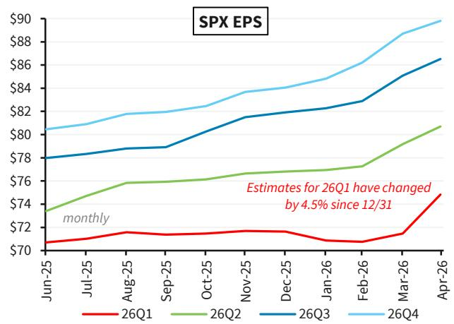

line

| Month    | 26Q1  | 26Q2  | 26Q3  | 26Q4  |
| -------- | ----- | ----- | ----- | ----- |
| Jun-25   | $70.5 | $73.5 | $78.0 | $80.5 |
| Jul-25   | $71.0 | $75.0 | $78.5 | $81.0 |
| Aug-25   | $71.5 | $76.0 | $79.0 | $81.5 |
| Sep-25   | $71.0 | $76.0 | $79.0 | $82.0 |
| Oct-25   | $71.5 | $76.5 | $80.0 | $82.5 |
| Nov-25   | $71.5 | $77.0 | $81.5 | $83.5 |
| Dec-25   | $71.5 | $77.0 | $82.0 | $84.0 |
| Jan-26   | $71.0 | $77.5 | $83.0 | $85.0 |
| Feb-26   | $71.0 | $78.0 | $84.0 | $86.5 |
| Mar-26   | $71.5 | $79.0 | $85.5 | $88.5 |
| Apr-26   | $75.0 | $81.0 | $86.5 | $90.0 |

Data as of 04/29/2026   
Source: LSEG Data & Analytics, Bloomberg, BARC

FIGURE 4. Energy, Materials and TMT have seen returns driven by earnings growth, with valuations compressing   

bar

| Category | NTM EPS Rev | Multiple expansion | Px Return |
| -------- | ----------- | ------------------- | --------- |
| SPX      | 15%         | -10%                | 5%        |
| ENR      | 60%         | -40%                | 25%       |
| INFT     | 25%         | -15%                | 15%       |
| INDU     | 5%          | 0%                  | 10%       |
| COMM     | 10%         | -15%                | 10%       |
| MATR     | 25%         | -10%                | 10%       |
| CONS     | 5%          | 0%                  | 5%        |
| UTIL     | 5%          | 0%                  | 5%        |
| COND     | 5%          | 0%                  | 0%        |
| FINL     | 5%          | -10%                | -5%       |
| HLTH     | 5%          | -10%                | -5%       |
| BigTech  | 10%         | 0%                  | 5%        |

Data as of 05/07/2026   
Source: LSEG Data & Analytics, Bloomberg, BARC

FIGURE 6. Among sectors, Energy by far has seen the most dramatic upward revision, following by Tech and Materials   
2Q26 EPS Revision Since 12/31   
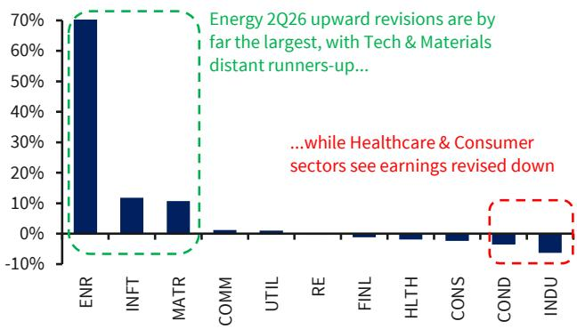

bar

| Sector | Change |
|--------|--------|
| ENR    | 70%    |
| INFT   | 12%    |
| MATR   | 10%    |
| COMM   | 1%     |
| UTIL   | 1%     |
| RE     | 0%     |
| FINL   | 0%     |
| HLTH   | 0%     |
| CONS   | 0%     |
| COND   | 0%     |
| INDU   | -5%    |

Data as of 04/29/2026   
Source: LSEG Data & Analytics, Bloomberg, BARC

# US Factor Basket Performance in the Past Month

Our all-cap liquidity-weighted US Factor baskets (see Global Equity Strategy - Updating BARC Equity Factor Baskets for Liquidity Weighting, 4/2/2025) attempt to capture factor premiums while controlling for stock and sector weights.

- High over Low Volatility: The standout performer over the past month, with the long/short pair up 18.9%, as risk-on sentiment returned following the easing of Iran-related energy concerns; performance was volatile during the height of the conflict but rebounded sharply as oil fears sUBSided.   
- Momentum: Also among the strongest factors, gaining 7.0%, driven by renewed leadership from AI- and Tech-exposed names; after pronounced choppiness during the peak of geopolitical uncertainty, investors re-engaged aggressively as sentiment stabilized.   
- Value: Sold off 6.7% in the past month, with weakness beginning in late March, coinciding with the recovery in Volatility and Momentum; consistent with its role as an “anti-AI” style, Value retraced following its strong run during the height of the Iran conflict.   
- Yield: Declined $12.0\%$ , mirroring Value's underperformance, as income-oriented and defensive exposures fell out of favor amid the resurgence in Tech optimism and growth-oriented positioning.   
- Growth: Rebounded by 5.1% in the past month, with the gain being fairly broad-based; that said, leadership came from communications/electrical equipment and semiconductor names as AI and hardware enthusiasm re-accelerated.   
- Size (Large over Small): Fell by 4.1%, reflecting a sharp recovery in small caps since late March, even as mega-cap stocks also continued to grind higher.   
- Quality: Stayed flat (down \~0.9%) in the past month, extending its lackluster performance following earlier gains during the Liberation Day crisis and offering little downside protection in the recent risk-on environment.

FIGURE 7. After a few lackluster months, High-over-Low Volatility has seen a dramatic recovery, gaining over $26\%$ since end of March; Quality continues its steady decline, and is now the worst performer YTD   
  
Total returns are used here for the Baskets. Past performance is not necessarily indicative of future results. Size measures returns of large caps over small caps, while Volatility captures returns of high volatility stocks vs. those with low volatility. Data as of 05/07/2026
Source: LSEG Data & Analytics, Bloomberg, BARC

FIGURE 8. Vol, Momo and Growth rallied in the past one month   
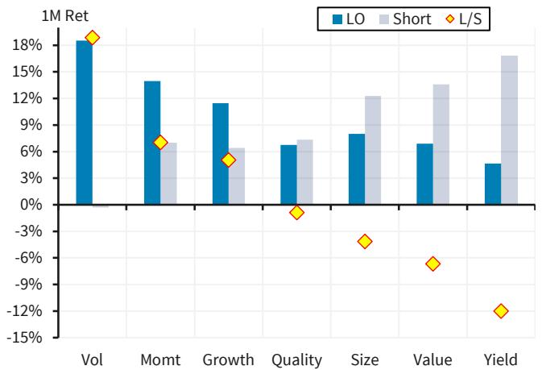

bar

| Category | LO    | Short | L/S   |
| -------- | ----- | ----- | ----- |
| Vol      | 18%   | -     | 18%   |
| Momt     | 14%   | 7%    | 7%    |
| Growth   | 12%   | 6%    | 6%    |
| Quality  | 7%    | 7%    | -2%   |
| Size     | 8%    | 12%   | -3%   |
| Value    | 7%    | 14%   | -6%   |
| Yield    | 5%    | 17%   | -12%  |

Total returns are used here for the Baskets. Past performance is not necessarily indicative of future results. Size measures returns of large caps over small caps, while Volatility captures returns of high volatility stocks vs. those with low volatility. Data as of 05/07/2026

Source: LSEG Data & Analytics, Bloomberg, BARC

FIGURE 9. Momo's high correl with Vol has recently moderated   

heatmap

2013 - 2019 LT corr.
| | GRW | MOM | QUAL | SIZE | VAL | VOL | YLD |
|---|---|---|---|---|---|---|---|
| 12 Month | GRW | 0.51 | 0.08 | 0.01 | -0.56 | 0.13 | -0.57 |
|                 | MOM |         | 0.39 | 0.35 | -0.70 | -0.36 | -0.40 |
|                 | QUAL | 0.40 | 0.40 | 0.57 | -0.37 | -0.55 | 0.23 |
|                 | SIZE | -0.05 | 0.32 | 0.33 | -0.29 | -0.79 | 0.33 |
|                 | VAL | -0.68 | -0.61 | -0.61 |         | 0.21 | 0.65 |
|                 | VOL | 0.80 | 0.36 | 0.22 | -0.31 |         | -0.33 |
|                 | YLD | -0.67 | -0.59 | -0.20 | 0.10 | 0.78 | -0.90 |

Total returns are used here for the Baskets. Past performance is not necessarily indicative of future results. Size measures returns of large caps over small caps, while Volatility captures returns of high volatility stocks vs. those with low volatility. Data as of 04/30/2026

Source: LSEG Data & Analytics, Bloomberg, BARC

# US Factor Discussion & Recommendations

We mainly use three criteria to formulate our factor views – relative fundamentals of our factor baskets vs. their own history, current macro events along with past event studies, and our market outlook ahead.

FIGURE 10. Current US Factor Recommendations - May 2026 

<table><tr><td>Factor</td><td>Description</td><td>View</td><td>Rationale</td></tr><tr><td>Growth</td><td>High - low</td><td>▲ Positive</td><td>Risk-on is back as Tech/AI sentiment improved. 1Q26 earnings beat, led by TMT; Energy revisions add tailwind. Inflation expectations easing. Rates less friendly but relative backdrop still better than Value. Flows are supportive: long-only adding Tech, CTAs buying large-cap Tech.</td></tr><tr><td>Size</td><td>Large over Small</td><td>Positive</td><td>Small-cap fundamentals are still weak versus large: softer revisions, limited operating leverage, high debt. Valuation cheapness masks multiples expansion-driven rallies in key small-cap industries like semis, software and construction. Rates stay higher for longer, making financing costs a drag. As a caveat, small caps may benefit from trickle down of AI capex. Conviction remains highest in mega caps with hyperscaler-led earnings and margin strength.</td></tr><tr><td>Momentum</td><td>Long / Short trend</td><td>▲ Positive</td><td>Rally appears to stay intact for the near term as risk-on is back. Earnings justify move: NTM EPS growth &gt;100% YTD, strongest across factors; forward vs trailing earnings at 93rd %-ile vs last 10 year history. Valuation supportive despite rally: forward PE at 30th %-ile vs 10 years. Earnings since end-2024 outpace price. Seasonality favorable in May–June.</td></tr><tr><td>Quality</td><td>High - low</td><td>▼ Negative</td><td>Downgrade to negative, since risk-on rotation back into semis, hardware, speculative AI plays has adverse implication for Quality as its defensive appeal fades. Sales and earnings growth historically weak versus other styles. Valuation still elevated despite price declines; PE ratio relative to US equities at large is at 65th %-ile vs past two years.</td></tr><tr><td>Value</td><td>Cheap - expensive</td><td>▼ neutral</td><td>Risk-on undercuts Value&#x27;s defensive, anti-AI appeal, and easing inflation makes Value less attractive vs Growth. In recent history, Value has worked mainly in AI rotations and risk-off, neither present. High long-end rates offer limited support. Consumer sentiment remains stubbornly weak, which makes Value&#x27;s consumer tilt a drag.</td></tr><tr><td>Volatility</td><td>High vol - low vol</td><td>▲ neutral</td><td>Sharp rebound (~31% from YTD trough) as risk-on returns, Iran energy fears fade, earnings strong. Valuation stretched: forward PE at 71st percentile. But fundamentals improved: ~90% NTM EPS growth YTD; earnings now catching up to price. Sector mix mixed—Tech/Industrials help, Healthcare headwind; Low Vol benefits from Utilities/Financials.</td></tr><tr><td>Yield</td><td>High - low</td><td>neutral</td><td>Growth and Momentum favored as risk-on dominates, making income generating strategies less attractive. Strong April payrolls (115k vs 65k), unemployment 4.3%; Fed cuts pushed out, with only one through 2027. This makes Yield&#x27;s bond proxy appeal weaker. This is offset by valuation and positioning: forward PE at 15th percentile; least crowded style. Hence, no upside catalyst, but downside also limited.</td></tr></table>

View as of 05/11/2026. Note: Positive: We recommend increasing exposure to the factor. Neutral: We recommend maintaining exposure to the factor. Negative: We recommend decreasing exposure to the factor.
Source: BARC

Turn Positive on Growth and Neutral on Value – Our factor stance stays tilted in favor of Value and Neutral on Growth for the following reasons:

- We upgrade Growth from Neutral to Positive as the market backdrop has turned more constructive, with risk appetite improving alongside a renewed sense of optimism around Tech and AI. Concerns around a broader Iran-related escalation have eased, allowing investors to refocus on corporate earnings, where Growth-oriented sectors have delivered encouraging signals.   
- Early 1Q26 earnings results have come in meaningfully ahead of expectations, led by TMT, reinforcing confidence in secular growth narratives. In parallel, Energy has seen dramatic upward earnings revisions driven by elevated oil prices, as highlighted by our oil analyst, and Growth's structural tilt toward these sectors positions it well to benefit from this earnings momentum.   
- From a macro perspective, inflation expectations have continued to ease, making the environment incrementally more benign for Growth relative to Value, even if the rates outlook remains less supportive than previously assumed. Fed cut expectations have been pared back, with BARC economists now expecting only one cut through 2027YE, but easing inflation expectations still improve the relative backdrop for longer-duration Growth assets.   
- Positioning dynamics also argue for a more favorable near-term setup for Growth. Long-only investors have been selectively adding exposure to Tech, while CTA signals continue to point

toward incremental systematic buying of large-cap Tech stocks, creating a potential self-reinforcing tailwind for Growth-oriented styles.

\- By contrast, we downgrade Value from Positive to Neutral. As we have noted previously, Value—along with Yield—has tended to behave as an “anti-AI” style, benefiting primarily during episodic rotations out of AI-linked exposures in risk-off environments. With markets firmly in risk-on mode, this defensive appeal has faded, and while elevated long-end rates—partly driven by US fiscal concerns—still offer some relative support to Value, this is no longer sufficient to sustain a positive stance. Moreover, consumer sentiment staying at subdued levels in recent months provide further headwind to Value, which is tilted toward consumer sectors. Taken together, we find sufficient reasons to justify a downgrade of our stance on this style to neutral.

FIGURE 11. Growth basket has a large tilt toward Tech & Energy and away from Staples & Real Estate   
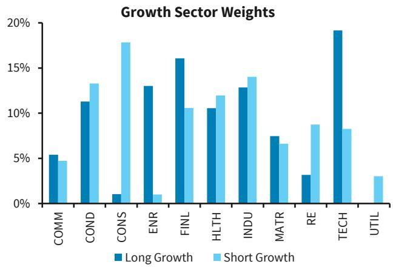

bar

Growth Sector Weights
| Company | Long Growth (%) | Short Growth (%) |
| :--- | :--- | :--- |
| COMM | 5.3 | 4.7 |
| COND | 11.2 | 13.2 |
| CONS | 0.9 | 17.8 |
| ENR | 13.0 | 1.0 |
| FINL | 16.0 | 10.5 |
| HLTH | 10.5 | 12.0 |
| INDU | 12.8 | 14.0 |
| MATR | 7.4 | 6.5 |
| RE | 3.2 | 8.7 |
| TECH | 19.2 | 8.2 |
| UTIL | 0.0 | 3.0 |

Data as of 04/30/2026   
Source: LSEG Data & Analytics, BARC

FIGURE 13. Rate cut expectations till 2026YE and 2027YE have been pared back   
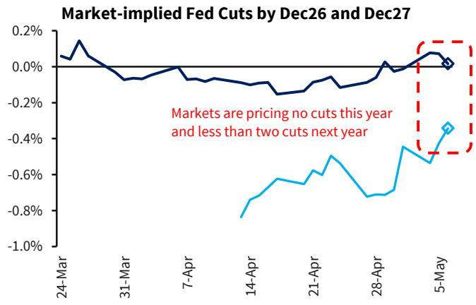

line

| Date     | Market-implied Fed Cuts |
| -------- | ------------------------ |
| 24-Mar   | ~0.1%                    |
| 31-Mar   | ~-0.1%                   |
| 7-Apr    | ~-0.1%                   |
| 14-Apr   | ~-0.2%                   |
| 21-Apr   | ~-0.3%                   |
| 28-Apr   | ~-0.4%                   |
| 5-May    | ~-0.3%                   |

Data as of 05/06/2026   
Source: LSEG Data & Analytics, Bloomberg, BARC

FIGURE 12. Value basket is tilted towards Financials & Materials and away from TMT   

bar

Value Sector Weights
| Company | Long Value (%) | Short Value (%) |
| :--- | :--- | :--- |
| COMM | 4.5 | 10.0 |
| COND | 15.8 | 12.0 |
| CONS | 9.7 | 3.3 |
| ENR | 10.4 | 3.2 |
| FINL | 19.6 | 5.4 |
| HLTH | 12.5 | 19.0 |
| INDU | 6.8 | 19.4 |
| MATR | 8.5 | 2.7 |
| RE | 3.5 | 5.1 |
| TECH | 6.9 | 19.1 |
| UTIL | 1.2 | - |
The chart displays a vertical bar chart comparing the weight percentages of 'Long Value' and 'Short Value' across multiple categories labeled with abbreviations such as 'COMM', 'COND', 'ENR', 'FINL', 'HLTH', 'INDU', 'MATR', 'RE', and 'TECH'. The values for each category are explicitly labeled on the bars.

Data as of 04/30/2026   
Source: LSEG Data & Analytics, BARC

FIGURE 14. Over the past two weeks, Growth's crowding level has been higher than Value but lower than Momo and Vol   

bar

| Metric   | 22-Apr | 23-Apr | 24-Apr | 27-Apr | 28-Apr | 29-Apr | 30-Apr | 1-May | 4-May | 5-May |
| -------- | ------ | ------ | ------ | ------ | ------ | ------ | ------ | ----- | ----- | ----- |
| Growth   | 0.3    | 0.3    | 0.3    | 0.3    | 0.3    | 0.3    | 0.3    | 0.3   | 0.3   | 0.3   |
| Value    | -1.2   | -1.1   | -1.1   | -1.1   | -1.1   | -1.1   | -1.1   | -1.1  | -1.1  | -1.1  |
| Size     | 0.0    | 0.0    | 0.0    | 0.0    | 0.0    | 0.0    | 0.0    | 0.0   | 0.0   | 0.0   |
| Momo     | 1.8    | 1.8    | 1.8    | 1.8    | 1.8    | 1.8    | 1.8    | 1.8   | 1.8   | 1.8   |
| Quality  | -0.3   | -0.4   | -0.4   | -0.4   | -0.4   | -0.4   | -0.4   | -0.4  | -0.4  | -0.4  |
| Vol      | 0.9    | 0.9    | 0.9    | 0.9    | 0.9    | 0.9    | 0.9    | 0.9   | 0.9   | 0.9   |
| Yield    | -0.8   | -0.8   | -0.8   | -0.8   | -0.8   | -0.8   | -0.8   | -0.8  | -0.8  | -0.8  |

Source: LSEG Data & Analytics, Bloomberg, BARC

FIGURE 15. Consumer sentiment remains at subdued levels   
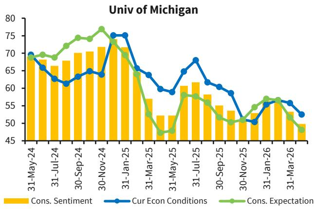

line

| Date       | Cons. Sentiment | Cur Econ Conditions | Cons. Expectation |
| ---------- | --------------- | ------------------- | ----------------- |
| 31-May-24  | 69              | 70                  | 69                |
| 31-Jul-24  | 67              | 65                  | 68                |
| 30-Sep-24  | 68              | 63                  | 70                |
| 30-Nov-24  | 70              | 65                  | 75                |
| 31-Jan-25  | 72              | 75                  | 77                |
| 31-Mar-25  | 57              | 64                  | 52                |
| 31-May-25  | 52              | 59                  | 47                |
| 31-Jul-25  | 61              | 68                  | 58                |
| 30-Sep-25  | 55              | 60                  | 51                |
| 30-Nov-25  | 53              | 51                  | 50                |
| 31-Jan-26  | 54              | 56                  | 57                |
| 31-Mar-26  | 49              | 52                  | 49                |

Data as of 04/30/2026   
Source: Bloomberg

FIGURE 16. Short term Inflation expectations have have sharply pared back from the height of the conflict   

line

| Date   | US Breakeven 2Yr | US Breakeven 5Yr | US 10Yr Real Yield |
|--------|------------------|------------------|--------------------|
| 12/23  | ~2.1%            | ~2.0%            | ~1.7%              |
| 2/24   | ~2.9%            | ~2.5%            | ~2.0%              |
| 4/24   | ~2.8%            | ~2.4%            | ~2.1%              |
| 6/24   | ~1.5%            | ~2.0%            | ~1.8%              |
| 8/24   | ~1.4%            | ~1.8%            | ~1.7%              |
| 10/24  | ~2.6%            | ~2.3%            | ~2.0%              |
| 12/24  | ~3.0%            | ~2.6%            | ~2.3%              |
| 2/25   | ~3.3%            | ~2.7%            | ~2.4%              |
| 4/25   | ~3.4%            | ~2.6%            | ~2.3%              |
| 6/25   | ~2.8%            | ~2.4%            | ~2.0%              |
| 8/25   | ~2.7%            | ~2.3%            | ~1.9%              |
| 10/25  | ~2.6%            | ~2.3%            | ~1.8%              |
| 12/25  | ~2.3%            | ~2.1%            | ~1.7%              |
| 2/26   | ~3.3%            | ~2.6%            | ~2.1%              |
| 4/26   | ~3.0%            | ~2.7%            | ~1.9%              |

Data includes previous revisions, if any. Data as of 05/04/2026   
Source: Bloomberg

FIGURE 17. 10-year rate is currently at 4.44%   

line

| Date     | Value  |
| -------- | ------ |
| 9/18     | -50bp  |
| 11/7     | -25bp  |
| 12/18    | -25bp  |
| 9/17     | -25bp  |
| Current  | 4.44   |

Data as of 05/01/2026   
Source: LSEG Data & Analytics, Bloomberg, BARC

FIGURE 18. The market has narrows again as Tech leads the way   

line

| Year | Daily Change |
|------|--------------|
| 2026 | 33%          |

Data as of 05/04/2026   
Source: Bloomberg, BARC

# We stay Positive on Large-over-Small for the following reasons:

- Small cap fundamentals continue to look unremarkable relative to large caps: Earnings revisions over the next four quarters remain more modest than across most large-cap segments, and in 1Q26 earnings growth has only narrowly exceeded sales growth (14.2% vs. 12.0%), in contrast to large caps where earnings growth is materially outpacing revenue growth (17.6% vs. 7.6%), signaling stronger operating leverage and margin dynamics at the top end of the market.   
- Valuations in small caps still appear cheaper in aggregate, but this masks growing internal dispersion, as several of the largest small-cap industries have seen year-to-date price appreciation driven more by multiple expansion than by underlying earnings growth, particularly in software, semiconductors, construction and chemicals, leaving these segments more exposed to a potential shift in investor sentiment.   
- The macro backdrop remains a headwind for the factor as we expect only a single policy rate cut through the end of 2027, and with small cap balance sheets still carrying historically high

debt levels relative to EBITDA, financing costs and leverage dynamics are likely to remain a constraint on profitability.

- That said, the AI capex supercycle should gradually begin to filter down to parts of the small cap universe, much as it has already benefited large-cap utilities, energy and industrials, as supply struggles to keep pace with surging compute demand, offering incremental support to select industries such as semiconductors, electronic and communications equipment manufacturers, and utility operators.   
- Overall, the combination of selective secular tailwinds and underwhelming near-term fundamentals leaves us lukewarm on small caps, while our conviction remains strongest in mega caps where hyperscalers continue to invest aggressively in infrastructure to meet massive compute demand, reinforcing our positive stance on the Large-over-Small Size factor.

FIGURE 19. Several of the largest industries within small caps have seen most of their price surges driven more by multiples expansion than earnings growth, especially Software, Semis, Construction and Chemicals   
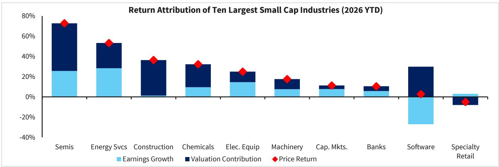

bar

| Industry         | Earnings Growth | Valuation Contribution | Price Return |
| ---------------- | --------------- | ---------------------- | ------------ |
| Semis            | ~25%            | ~45%                   | ~75%         |
| Energy Svcs      | ~28%            | ~22%                   | ~55%         |
| Construction     | ~1%             | ~35%                   | ~38%         |
| Chemicals        | ~10%            | ~20%                   | ~33%         |
| Elec. Equip      | ~15%            | ~10%                   | ~25%         |
| Machinery        | ~8%             | ~10%                   | ~18%         |
| Cap. Mkts.       | ~8%             | ~5%                    | ~10%         |
| Banks            | ~6%             | ~5%                    | ~10%         |
| Software         | ~-30%           | ~30%                   | ~5%          |
| Specialty Retail | ~2%             | ~-5%                   | ~-10%        |

Data as of 05/07/2026   
Source: Bloomberg, BARC

FIGURE 20. Small cap earnings revisions are worse than large caps for the next few quarters   
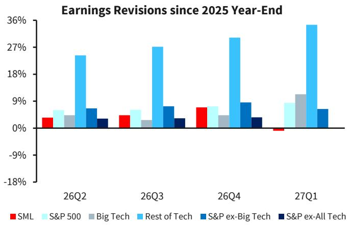

bar

| Quarter | SML   | S&P 500 | Big Tech | Rest of Tech | S&P ex-Big Tech | S&P ex-All Tech |
|---------|-------|---------|----------|--------------|-----------------|-----------------|
| 26Q2    | 4%    | 6%      | 4%       | 27%          | 7%              | 3%              |
| 26Q3    | 5%    | 7%      | 3%       | 27%          | 8%              | 4%              |
| 26Q4    | 8%    | 8%      | 5%       | 27%          | 9%              | 4%              |
| 27Q1    | -1%   | 9%      | 9%       | 36%          | 7%              | -               |

Data as of 05/05/2026   
Source: LSEG Data & Analytics, Bloomberg, BARC

FIGURE 21. Earnings growth for small caps is expected to stay muted vs Big Tech in 1H26, but pick up in 2H26   

bar

| Quarter | SML  | SPX w/o Big Tech | BigTech |
|---------|------|------------------|---------|
| 25Q4    | -    | 5%               | 28%     |
| 26Q1    | 13%  | 14%              | 36%     |
| 26Q2    | 10%  | 17%              | 27%     |
| 26Q3    | 18%  | 18%              | 15%     |
| 26Q4    | 35%  | 24%              | 19%     |

Data as of 04/07/2026   
Source: LSEG Data & Analytics, Bloomberg, BARC

FIGURE 22. Small caps remain more levered than Large caps ...   
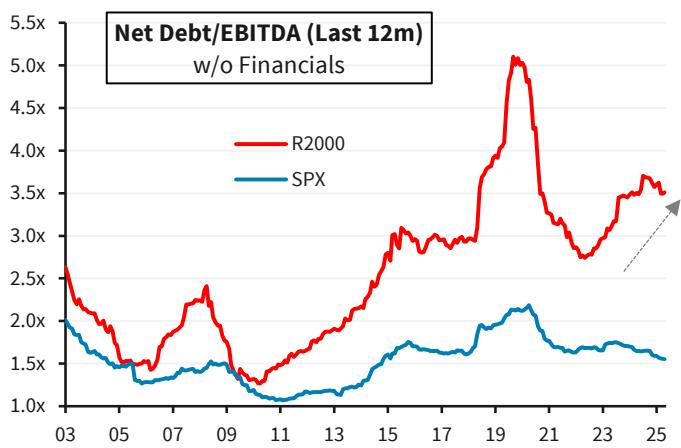

line

| Year | R2000 | SPX  |
|------|-------|------|
| 03   | 2.5x  | 2.0x |
| 05   | 1.5x  | 1.5x |
| 07   | 2.5x  | 1.5x |
| 09   | 1.5x  | 1.5x |
| 11   | 1.5x  | 1.2x |
| 13   | 2.0x  | 1.5x |
| 15   | 3.0x  | 1.8x |
| 17   | 3.5x  | 2.0x |
| 19   | 5.0x  | 2.2x |
| 21   | 3.5x  | 1.8x |
| 23   | 3.5x  | 1.7x |
| 25   | 3.5x  | 1.6x |

Data as of 03/27/2026   
Source: LSEG Data & Analytics, Bloomberg, BARC

FIGURE 24. Small cap valuation is relatively cheap 

<table><tr><td rowspan="2">NTM P/E</td><td colspan="3">US Equities</td></tr><tr><td>Current</td><td>10y Pctle</td><td>vs. SPX</td></tr><tr><td>Small</td><td>16.7x</td><td>0.35</td><td>0.38</td></tr><tr><td>Mid</td><td>17.3x</td><td>0.50</td><td>0.44</td></tr><tr><td>Large</td><td>21.2x</td><td>0.66</td><td>0.00</td></tr><tr><td>Communications Services</td><td>21.8x</td><td>0.88</td><td>0.97</td></tr><tr><td>Consumer Discretionary</td><td>29.7x</td><td>0.76</td><td>0.75</td></tr><tr><td>Consumer Staples</td><td>22.5x</td><td>0.98</td><td>0.56</td></tr><tr><td>Financials</td><td>14.7x</td><td>0.58</td><td>0.21</td></tr><tr><td>Health Care</td><td>16.7x</td><td>0.45</td><td>0.21</td></tr><tr><td>Industrials</td><td>25.4x</td><td>0.87</td><td>0.96</td></tr><tr><td>Information Technology</td><td>24.6x</td><td>0.53</td><td>0.41</td></tr><tr><td>Materials</td><td>18.3x</td><td>0.49</td><td>0.16</td></tr><tr><td>Utilities</td><td>18.8x</td><td>0.60</td><td>0.38</td></tr></table>

Data as of 04/06/2026   
Source: LSEG Data & Analytics, Bloomberg, BARC

FIGURE 23. ... but the share of unprofitable names is declining from recent highs   
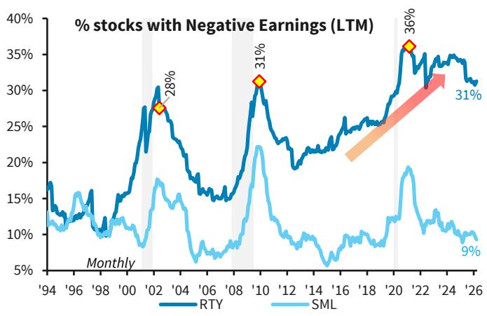

line

| Year | RTY  | SML  |
|------|------|------|
| '02  | 28%  |      |
| '10  | 31%  |      |
| '22  | 36%  |      |
| '26  | 31%  | 9%   |

Data as of 03/27/2026   
Source: LSEG Data & Analytics, Bloomberg, BARC

FIGURE 25. Valuations of small cap ex-Fin are modestly above the long-term median   
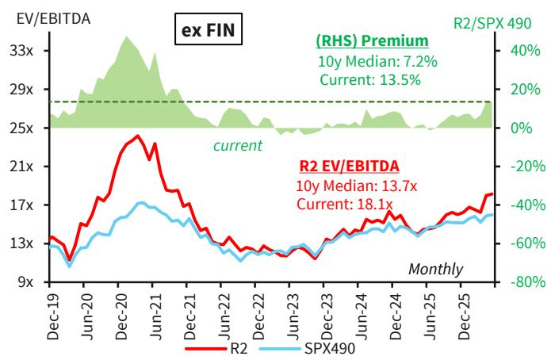

line

| Month    | R2 EV/EBITDA | SPX490 |
|----------|--------------|--------|
| Dec-19   | ~13x         | ~13x   |
| Jun-20   | ~17x         | ~13x   |
| Dec-20   | ~25x         | ~17x   |
| Jun-21   | ~21x         | ~17x   |
| Dec-21   | ~13x         | ~13x   |
| Jun-22   | ~13x         | ~13x   |
| Dec-22   | ~13x         | ~13x   |
| Jun-23   | ~13x         | ~13x   |
| Dec-23   | ~13x         | ~13x   |
| Jun-24   | ~13x         | ~13x   |
| Dec-24   | ~13x         | ~13x   |
| Jun-25   | ~13x         | ~13x   |
| Dec-25   | ~18.1x       | ~18.1x |

Data as of 04/06/2026   
Source: LSEG Data & Analytics, Bloomberg, BARC

# Upgrade Momentum from Neutral to Positive for the following reasons:

- Momentum has extended its rally for several months, with only brief interruptions, most notably during the early days of the war in Iran. As risk-on sentiment has reasserted itself, the style has continued to print new highs, naturally raising concerns around the risk of sharp unwinds after such a strong run.   
- Those concerns are mitigated by fundamentals. Momentum has delivered exceptionally strong earnings through the current reporting season, with NTM EPS growth now above 100% YTD, the highest across all factors. In addition, the ratio of next-12-months earnings to trailing-12-months earnings sits at the 93rd percentile versus the past 10 years, one of the strongest readings among styles.   
- Valuations have moved in the opposite direction. Despite the price rally, Momentum's forward PE has compressed to the 30th percentile relative to the last 10 years, making it one of the cheapest styles in our framework, second only to Yield.

\- Looking back further to 2024 year-end, earnings growth has since materially outpaced the already impressive price appreciation, reinforcing the robustness of the rally. Seasonality also helps: May and June have historically been reliable months for Momentum performance. Taken together, these factors support upgrading our stance from neutral to positive.

FIGURE 26. Momentum's earnings growth is now outpacing price action   
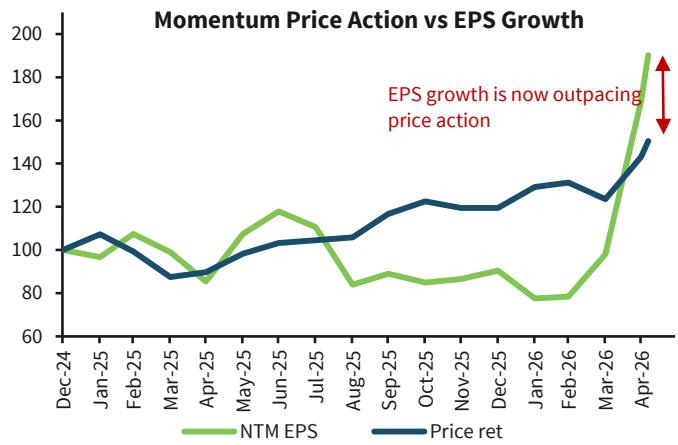

line

| Date   | NTM EPS | Price ret |
|--------|---------|-----------|
| Apr-26 | 190     | 150       |

Source: Bloomberg, BARC

FIGURE 27. Momentum's earnings growth is by far the highest across styles   
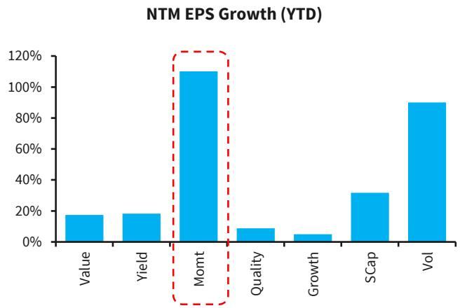

bar

NTM EPS Growth (YTD)
| Metric | NTM EPS Growth (%) |
| :--- | :--- |
| Value | 18 |
| Yield | 19 |
| Momt | 110 |
| Quality | 9 |
| Growth | 5 |
| SCap | 32 |
| Vol | 90 |

Source: Bloomberg, BARC

FIGURE 28. Momentum's earnings growth (relative to 10Y history) is among the best across styles, while valuation is among the cheaper ones   

scatter

| Category     | NTM/LTM EPS Ratio (10Y %-ile) | Fwd PE Ratio (10Y %-ile) |
| ------------ | ----------------------------- | ------------------------ |
| Vol          | 78%                           | 72%                      |
| Growth       | 70%                           | 40%                      |
| Small Cap    | 78%                           | 18%                      |
| Value        | 88%                           | 30%                      |
| Yield        | 85%                           | 15%                      |
| Large Cap    | 95%                           | 65%                      |
| Quality      | 90%                           | 60%                      |
| Momt         | 92%                           | 30%                      |

Source: Bloomberg, BARC

FIGURE 29. May and June have been reliably positive months for Momentum   
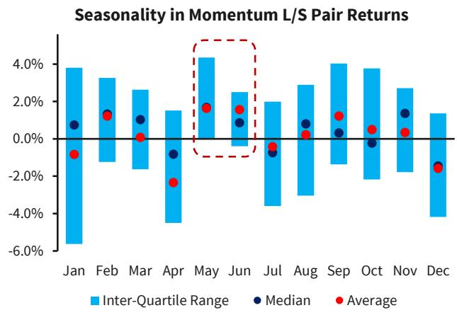

bar

| Month | Inter-Quartile Range | Median | Average |
|-------|----------------------|--------|---------|
| Jan   | 3.8%                 | 0.8%   | -1.0%   |
| Feb   | 3.2%                 | 1.2%   | 1.4%    |
| Mar   | 2.6%                 | 1.0%   | 0.2%    |
| Apr   | 1.6%                 | -1.0%  | -2.4%   |
| May   | 4.2%                 | 0.8%   | 1.6%    |
| Jun   | 2.4%                 | 0.8%   | 1.6%    |
| Jul   | 2.0%                 | -1.0%  | -0.8%   |
| Aug   | 2.8%                 | 0.8%   | 0.2%    |
| Sep   | 4.0%                 | 0.4%   | 1.2%    |
| Oct   | 3.8%                 | -0.2%  | 0.4%    |
| Nov   | 2.6%                 | 1.4%   | 0.2%    |
| Dec   | 1.4%                 | -1.6%  | -1.8%   |

Source: LSEG Data & Analytics, Bloomberg, BARC

Turn Negative on Quality – We downgrade our view on Quality from Neutral to Negative for the following reasons:

\- Quality looks unattractive in the current risk-on environment, as investors appear to be putting Iran war fears largely behind them and rotating back toward semiconductors, hardware and more speculative corners of equities amid historic AI capex spending that shows no signs of slowing, leaving the style's traditional defensive appeal with limited demand. Indeed, Quality's sales and earnings growth attributes are at historically subdued levels, compared to all other styles.

- Despite several months of decline in its price, Quality's valuation versus US equities overall still remains fairly elevated, now sitting at the 65th percentile relative to the past two years. Moreover, as shown in Figure 28, Quality remains one of the more expensive styles.   
- As a result, we are turning Negative towards Quality, as we favor more growth-oriented and trend following styles.

FIGURE 30. Quality's valuation vs US equities at large recently moderated but still remains elevated   
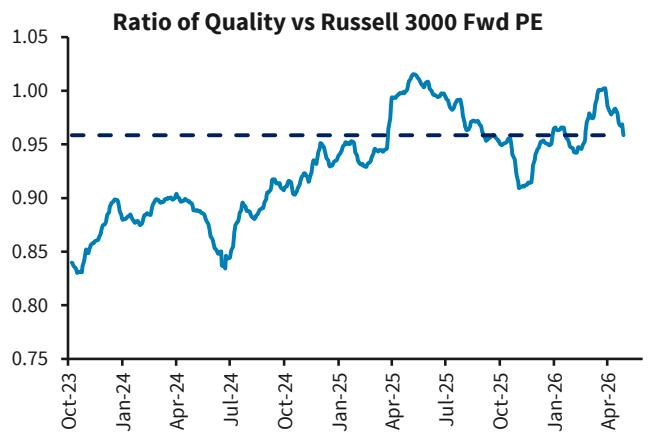

line

| Date   | Ratio of Quality vs Russell 3000 Fwd PE |
|--------|------------------------------------------|
| Oct-23 | 0.83                                     |
| Jan-24 | 0.90                                     |
| Apr-24 | 0.89                                     |
| Jul-24 | 0.84                                     |
| Oct-24 | 0.91                                     |
| Jan-25 | 0.95                                     |
| Apr-25 | 1.01                                     |
| Jul-25 | 0.98                                     |
| Oct-25 | 0.96                                     |
| Jan-26 | 0.97                                     |
| Apr-26 | 1.00                                     |

Source: Bloomberg, BARC

FIGURE 31. Quality's exposure to Growth is especially weak compared to other styles   
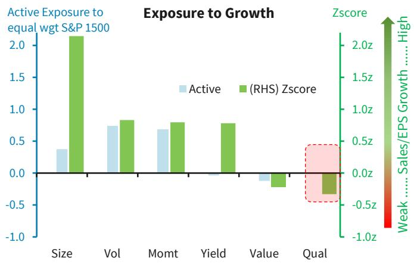

bar

| Category | Active | (RHS) Zscore |
| -------- | ------ | ------------ |
| Size     | 0.35   | 2.1          |
| Vol      | 0.75   | 0.8          |
| Momt     | 0.65   | 0.75         |
| Yield    | 0.0    | 0.75         |
| Value    | -0.1   | -0.2         |
| Qual     | -0.4   | -0.5         |

Source: LSEG Data & Analytics, BARC

# Upgrade to Neutral on High-over-Low Volatility – We upgrade our view on Volatility to Neutral for the following reasons:

- The factor has rallied sharply after weakness in February and March (rallying by \~31% from YTD trough), helped by fading concerns around the Iran war energy shock, a strong 1Q26 earnings season, and a renewed risk-on impulse as hyperscaler AI infrastructure spending continues to feel almost inexorable.   
- The valuation case is no longer comfortable: High-over-Low Volatility now trades with forward PE at the 71st percentile versus the last 10 years, making it the most stretched style on that basis. But the earnings backdrop has improved enough to temper the bearish view. NTM EPS growth is roughly 90% YTD, second only to Momentum, suggesting today's basket is less “junky” than the factor's historical reputation implies.   
- Looking back to the beginning of 2025, earnings growth has finally caught up with price action after lagging for much of the period. That matters because the rally is no longer simply a multiple story; fundamentals are now doing a lot of the work, leaving us less pessimistic about the factor's current composition.   
- Sector exposure leaves a more mixed picture. The High-vs-Low Volatility basket tilts toward Tech, Healthcare, and Industrials, and away from Utilities, Financials, and Real Estate. Tech and Industrials exposure should help the High Volatility leg, given our positive view, but Healthcare is a headwind; meanwhile, Low Volatility's Utilities and Financials exposure may also be a source of benefit given our positive outlook on those sectors.

FIGURE 32. Earnings growth for Volatility basket has closed the gap with price action   
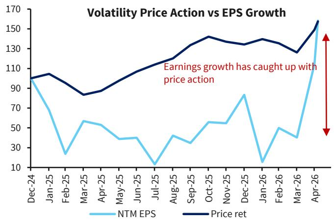

line

| Date   | NTM EPS | Price ret |
|--------|---------|-----------|
| Dec-24 | 95      | 95        |
| Jan-25 | 70      | 100       |
| Feb-25 | 25      | 85        |
| Mar-25 | 55      | 80        |
| Apr-25 | 50      | 90        |
| May-25 | 40      | 100       |
| Jun-25 | 35      | 110       |
| Jul-25 | 10      | 115       |
| Aug-25 | 40      | 120       |
| Sep-25 | 30      | 130       |
| Oct-25 | 50      | 140       |
| Nov-25 | 55      | 135       |
| Dec-25 | 80      | 130       |
| Jan-26 | 10      | 135       |
| Feb-26 | 50      | 130       |
| Mar-26 | 40      | 125       |
| Apr-26 | 160     | 150       |

Source: LSEG Data & Analytics, BARC

FIGURE 33. Vol basket has a tilt towards Tech, Healthcare & Discretionary, and away from Utilities, Real Estate & Financials   
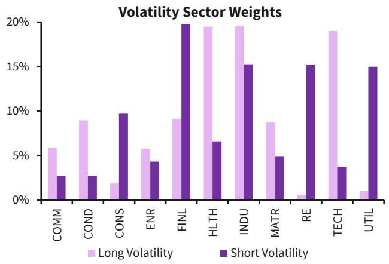

bar

| Sector | Long Volatility | Short Volatility |
| ------ | --------------- | ---------------- |
| COMM   | 6%              | 3%               |
| COND   | 9%              | 3%               |
| CONS   | 2%              | 10%              |
| ENR    | 6%              | 4%               |
| FINL   | 9%              | 20%              |
| HLTH   | 20%             | 7%               |
| INDU   | 20%             | 15%              |
| MATR   | 9%              | 5%               |
| RE     | 1%              | 15%              |
| TECH   | 20%             | 4%               |
| UTIL   | 1%              | 15%              |

Source: LSEG Data & Analytics, BARC

Stay Neutral on Yield (Dividends + Buybacks) – We remain Neutral on Yield, as the setup does not look materially more compelling than it did last month, when we upgraded the style to Neutral. Risk appetite is firmly back in the driver's seat, leaving styles such as Growth and Momentum better aligned with the current market tone and making Yield's defensive appeal less differentiated. The macro backdrop has also become less supportive: April payroll data on Friday, May 8 surprised sharply to the upside (115k actual vs 65k consensus) and the unemployment rate held steady at 4.3%, reducing the urgency for Fed easing, while BARC economists already expect only one cut through the end of 2027. In that context, the case for cash-generative strategies that often behave like bond proxies looks less attractive, particularly when investors are being rewarded for leaning into risk rather than hiding from it. That said, the downside case is also not especially compelling. Yield remains one of the cheapest styles we track, with its forward PE at the 15th percentile versus the last 10 years (Figure 28), and positioning is the least crowded across our style universe (Figure 14). Those two features should help limit the risk of a disorderly, convex move lower. Taken together, the factor lacks an obvious upside catalyst, but its valuation and positioning support argue against a more negative stance, leaving us comfortable maintaining a Neutral view.

# Europe factor analysis and views: May 2026

Please register here to join our conference call on the EU factors update on Wednesday, 13 May.

Please note: our updated basket constituents are available here – BARC Equity Factor Monitor, 5 May.

# Key insights

- If leadership broadens beyond Momentum, Value could benefit. Momentum factor is having one of the best starts of the year. It remains AI-led and supported by strong earnings, but increasingly crowded. This argues for managing exposure rather than chasing. Any broadening in the tape would favour Value, which offers the cleanest rotation channel given its strong earnings momentum and structurally negative correlation to Momentum.   
- Earnings season has been a tailwind for Value. Earnings delivery has been strong, lifting European EPS growth to around 7%, the highest since Q1'23, even as price action remains selective with little tolerance for misses. Value has consistently outperformed on earnings days. Stronger-than-expected delivery has rebuilt earnings momentum, now pointing to further upside.   
- Progress towards peace would add pressure on Yield. The conflict premium is unwinding unevenly. Yield tracks Brent closely which shows half of the conflict-driven gains retraced so peace is not fully priced. Further credible progress towards peace would mechanically add pressure on high yield given energy sensitive exposure.   
- Factor allocation. Positive Value; Neutral Momentum, Quality, Growth and Small Caps; Negative Low Vol.

# European Factor Themes

As we wrote in our recent publications, we see three key themes driving the market - 1) Who benefits if Momentum broadens (Broadening awaits peace, 8 May), 2) Q1 Earnings (Q1 Earnings – Strong delivery boosted by US/Tech, 7 May), and 3) Peace not fully priced (Crunch time - May Chart Pack, 6 May).

# 1) Who benefits if Momentum broadens?

EU Momentum remains the top-performing factor in 2026, marking one of its strongest years on record. While the rally has cooled at the margin, it continues to be underpinned by solid earnings momentum. Tactically, this argues for managing rather than adding exposure, with rotation risk rising as leadership shows early signs of fatigue.

FIGURE 34. BC EU Momentum is running hot in 2026 vs history   
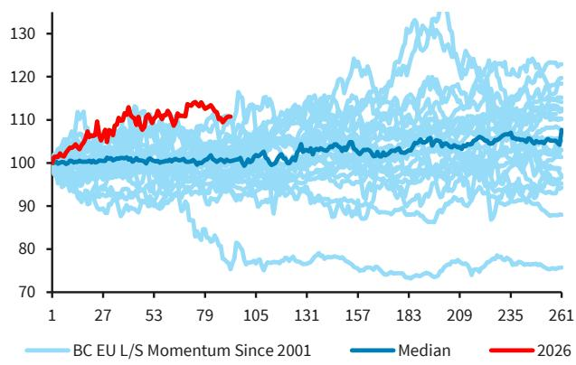

line

| Date | BC EU L/S Momentum Since 2001 | Median | 2026 |
|------|--------------------------------|--------|------|
| 1    | ~100                           | ~100   | ~100 |
| 27   | ~105                           | ~100   | ~108 |
| 53   | ~108                           | ~100   | ~112 |
| 79   | ~105                           | ~100   | ~114 |
| 105  | ~95                            | ~100   | ~112 |
| 131  | ~98                            | ~102   | ~110 |
| 157  | ~97                            | ~103   | ~108 |
| 183  | ~98                            | ~104   | ~106 |
| 209  | ~99                            | ~105   | ~104 |
| 235  | ~98                            | ~106   | ~102 |
| 261  | ~97                            | ~107   | ~100 |

Source: Bloomberg, BARC

FIGURE 35. Earnings have supported Momentum rally   
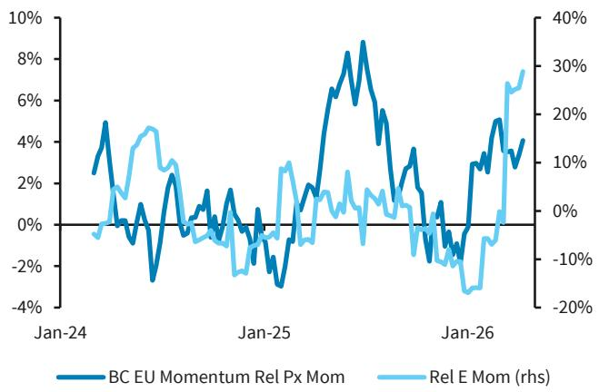

line

| Date   | BC EU Momentum Rel Px Mom | Rel E Mom (rhs) |
|--------|---------------------------|-----------------|
| Jan-24 | ~5%                       | ~0%             |
| Jan-25 | ~8%                       | ~3%             |
| Jan-26 | ~4%                       | ~30%            |

Source: Bloomberg, BARC

Momentum crowding is starting to look toppish indeed, although not yet extreme. For equities to extend higher, we believe that leadership needs to broaden beyond Momentum. In that scenario, Value looks the cleaner rotation beneficiary, while Yield is less attractive given its heavier oil sensitivity and residual war trade exposure.

FIGURE 36. Crowding is elevated but not yet extreme within EU Momentum   
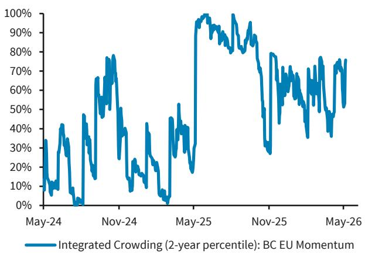

line

| Date   | Integrated Crowding (2-year percentile): BC EU Momentum |
|--------|----------------------------------------------------------|
| May-24 | ~35%                                                     |
| Nov-24 | ~75%                                                     |
| May-25 | ~95%                                                     |
| Nov-25 | ~80%                                                     |
| May-26 | ~70%                                                     |

Source: MSCI, BARC

FIGURE 37. European Value and Yield could benefit the most from Momentum unwind   
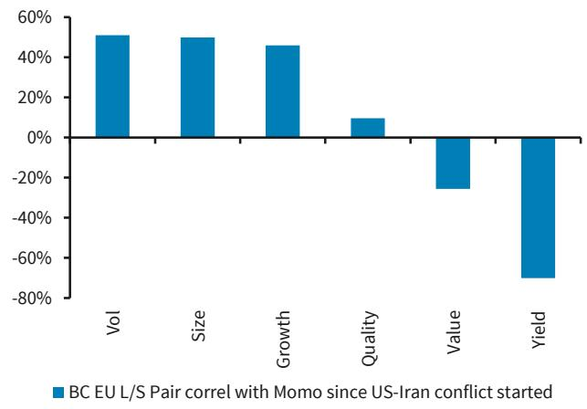

bar

| Category | BC EU L/S Pair correl with Momo since US-Iran conflict started (%) |
| :--- | :--- |
| Vol | 50 |
| Size | 48 |
| Growth | 45 |
| Quality | 10 |
| Value | -25 |
| Yield | -70 |

Source: Bloomberg, BARC

Momentum has largely been an AI winners trade. Over the past twelve months, European Momentum has tracked closely the performance of AI winners versus losers, explaining its resilience through the conflict. This reflects limited exposure to consumer and energy stocks, leaving Momentum relatively insulated from geopolitics.

FIGURE 38. BC EU Momentum pair has moved with AI winners vs Losers trade in Europe   
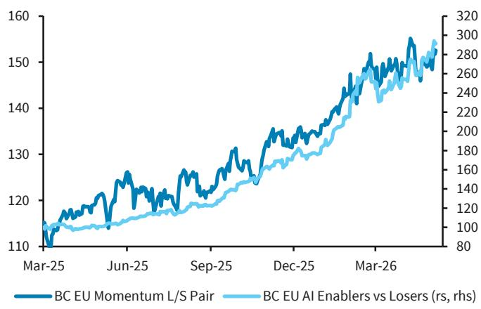

line

| Date   | BC EU Momentum L/S Pair | BC EU AI Enablers vs Losers (rs, rhs) |
|--------|--------------------------|----------------------------------------|
| Mar-25 | ~115                     | ~100                                   |
| Jun-25 | ~125                     | ~110                                   |
| Sep-25 | ~130                     | ~120                                   |
| Dec-25 | ~140                     | ~130                                   |
| Mar-26 | ~155                     | ~140                                   |

Source: Bloomberg, BARC

FIGURE 39. Momentum has remained resilient through the US-Iran conflict   
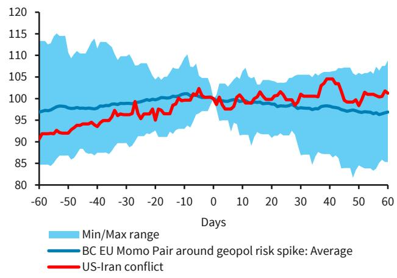

line

| Days | Min/Max range | BC EU Momo Pair around geopol risk spike: Average | US-Iran conflict |
|------|---------------|--------------------------------------------------|------------------|
| -60  | 115           | 98                                               | 92               |
| -50  | 114           | 98                                               | 93               |
| -40  | 113           | 98                                               | 94               |
| -30  | 112           | 98                                               | 95               |
| -20  | 111           | 98                                               | 96               |
| -10  | 110           | 98                                               | 97               |
| 0    | 109           | 98                                               | 98               |
| 10   | 108           | 98                                               | 99               |
| 20   | 107           | 98                                               | 100              |
| 30   | 106           | 98                                               | 101              |
| 40   | 105           | 98                                               | 102              |
| 50   | 104           | 98                                               | 103              |
| 60   | 103           | 98                                               | 104              |

Source: Bloomberg, BARC

# 2) Q1 Earnings through the factor lens

Q1 earnings delivery has been strong, with most of the season now behind us (Q1 Earnings – Strong delivery boosted by US/Tech, 7 May). Blended EPS growth in Europe has lifted to around 7%, the strongest since Q1'23, supported by a solid beat rate versus history. Price action has been highly discriminating, with clear rewards for beats and swift punishment for misses.

FIGURE 40. European earnings beats moved above the long-run average   
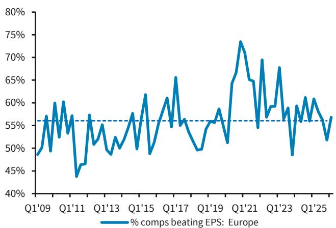

line

| Quarter | % comps beating EPS: Europe |
| ------- | -------------------------- |
| Q1'09   | ~50%                       |
| Q1'10   | ~55%                       |
| Q1'11   | ~45%                       |
| Q1'12   | ~55%                       |
| Q1'13   | ~50%                       |
| Q1'14   | ~55%                       |
| Q1'15   | ~60%                       |
| Q1'16   | ~50%                       |
| Q1'17   | ~65%                       |
| Q1'18   | ~55%                       |
| Q1'19   | ~50%                       |
| Q1'20   | ~60%                       |
| Q1'21   | ~75%                       |
| Q1'22   | ~65%                       |
| Q1'23   | ~70%                       |
| Q1'24   | ~60%                       |
| Q1'25   | ~55%                       |

Source: Bloomberg, BARC

FIGURE 41. Median price reaction to results has been tilted slightly negative in Europe   
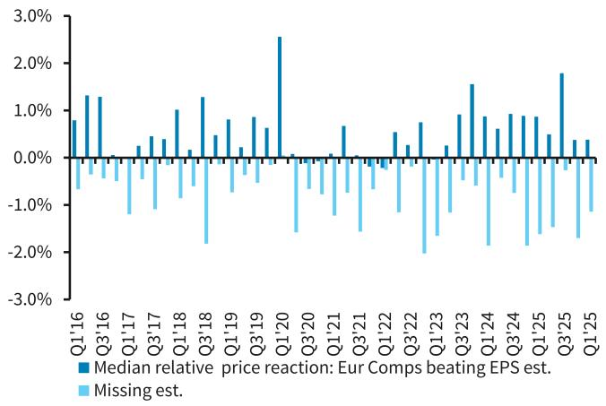

bar

| Quarter | Median relative price reaction: Eur Comps beating EPS est. (%) | Missing est. (%) |
|---|---|---|
| Q1'16 | 0.8 | -0.4 |
| Q3'16 | 1.3 | -0.3 |
| Q1'17 | 0.0 | -0.5 |
| Q3'17 | 0.4 | -0.9 |
| Q1'18 | 1.0 | -0.8 |
| Q3'18 | 1.3 | -1.9 |
| Q1'19 | 0.7 | -0.6 |
| Q3'19 | 0.8 | -0.5 |
| Q1'20 | 2.6 | -1.6 |
| Q3'20 | -0.1 | -0.7 |
| Q1'21 | 0.6 | -0.8 |
| Q3'21 | -0.1 | -1.4 |
| Q1'22 | 0.5 | -1.2 |
| Q3'22 | 0.7 | -2.0 |
| Q1'23 | 0.2 | -1.4 |
| Q3'23 | 0.9 | -0.6 |
| Q1'24 | 1.6 | -1.9 |
| Q3'24 | 0.8 | -0.5 |
| Q1'25 | 0.9 | -1.8 |
| Q3'25 | 1.8 | -0.3 |
| Q1'25 | 0.3 | -1.0 |

Source: Bloomberg, BARC

Within factors, Value has been the clear earnings season outperformer. European Value stocks averaged around +100bps on results days, reflecting strong rewards for positive delivery versus low expectations. This fits the historical pattern of Value outperforming around earnings, and with earnings momentum now turning higher, the setup continues to point to further upside for Value.

FIGURE 42. Value leads Barc EU factors performance on earnings days   
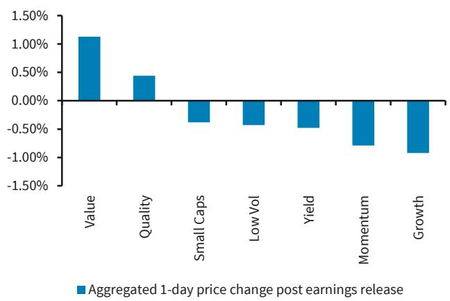

bar

| Category | Aggregated 1-day price change post earnings release |
|---|---|
| Value | 1.15% |
| Quality | 0.45% |
| Small Caps | -0.35% |
| Low Vol | -0.45% |
| Yield | -0.5% |
| Momentum | -0.85% |
| Growth | -1.0% |

Source: Bloomberg, BARC

FIGURE 43. Improving earnings momentum underpins Value outperformance   
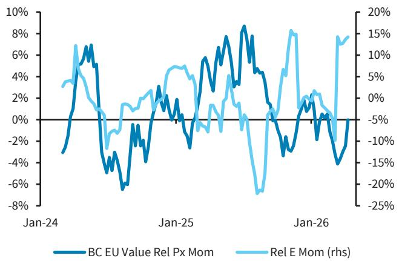

line

| Date   | BC EU Value Rel Px Mom | Rel E Mom (rhs) |
|--------|------------------------|-----------------|
| Jan-24 | -3%                    | 3%              |
| Jan-25 | 8%                     | 5%              |
| Jan-26 | -5%                    | 15%             |

Source: Bloomberg, BARC

# 3) Peace not fully priced

War has reshaped factor leadership, with markets quick to price de-escalation even as the political endgame remains unclear. In Europe, the war trade was concentrated in Yield, which has only retraced about half of its conflict-driven gains, broadly in line with Brent not pricing a full peace outcome. Further credible progress towards peace would mechanically add pressure on high yield given energy sensitive exposure.

FIGURE 44. Conflict premium unwinds unevenly across factors   
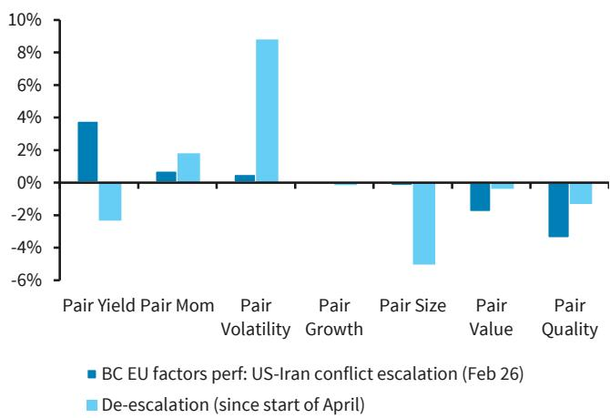

bar

| Metric | BC EU factors perf: US-Iran conflict escalation (Feb 26) (%) | De-escalation (since start of April) (%) |
| :--- | :--- | :--- |
| Pair Yield | 3.8 | -2.5 |
| Pair Mom | 0.6 | 1.7 |
| Pair Volatility | 0.4 | 8.8 |
| Pair Growth | -0.1 | -0.1 |
| Pair Size | -0.1 | -5.3 |
| Pair Value | -1.8 | -0.2 |
| Pair Quality | -3.5 | -1.2 |

Source: Bloomberg, BARC

FIGURE 45. War premium in Yield partially unwinding, in line with oil   
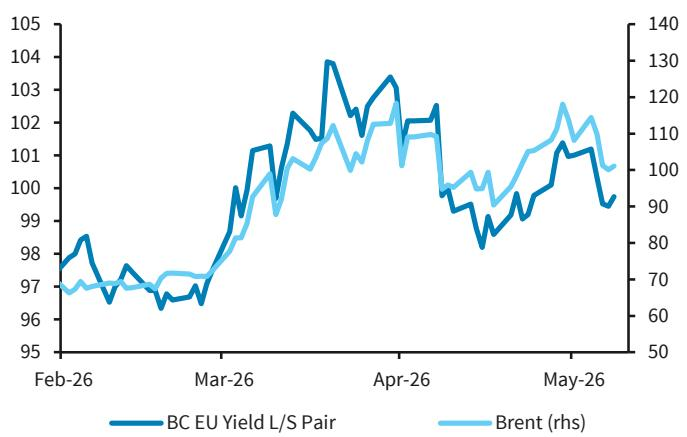

line

| Date   | BC EU Yield L/S Pair | Brent (rhs) |
|--------|----------------------|-------------|
| Feb-26 | 98                   | 70          |
| Mar-26 | 102                  | 90          |
| Apr-26 | 103                  | 110         |
| May-26 | 99                   | 100         |

Source: Bloomberg, BARC

# European Factor Performance Review

# Pro-risk factors dominate since April

MTD performance continues to favour pro-risk factors, led by Momentum, with Small Caps close behind and followed by Value. Growth pair underperformed even as the High Growth long-only leg delivered positive relative returns. Yield, Quality and Low Vol sit at the bottom of the stack. From a quadrant view, Value moves into the Leaders bucket on a strong five-day performance, alongside Momentum and Volatility, while Growth, Quality and Size remain firmly in the laggards quadrant. Finally, Yield shows some signs of stabilisation, moving into the recovering bucket.

FIGURE 46. Momentum, Small Caps and Value lead MTD as defensives and income lag   
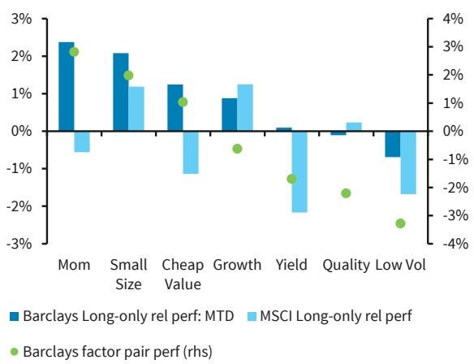

bar

| Category     | BARC Long-only rel perf: MTD | MSCI Long-only rel perf | BARC factor pair perf (rhs) |
| ------------ | -------------------------------- | ----------------------- | -------------------------------- |
| Mom          | 2.5%                             | -0.5%                   | 2.8%                             |
| Small Size   | 2.0%                             | 1.2%                    | 1.8%                             |
| Cheap Value  | 1.3%                             | -1.2%                   | 0.8%                             |
| Growth       | 0.8%                             | 1.3%                    | -0.5%                            |
| Yield        | 0.1%                             | -2.2%                   | -1.5%                            |
| Quality      | -0.2%                            | 0.2%                    | -2.0%                            |
| Low Vol      | -0.8%                            | -1.8%                   | -3.0%                            |

Note: Past performance is not necessarily indicative of future results. Source: LSEG Data & Analytics, Bloomberg, BARC

FIGURE 47. Momentum firmly in the leader quadrant; Size, Quality and Growth stuck in laggards   
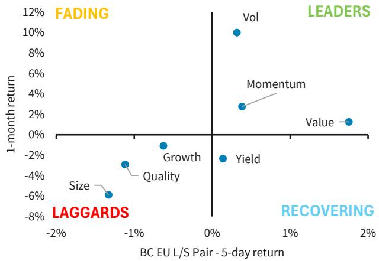

scatter

| Category   | 1-month return | BC EU L/S Pair - 5-day return |
| ---------- | -------------- | ---------------------------- |
| FADING     | -              | -                            |
| LEADERS    | -              | -                            |
| Value      | 0%             | 1.5%                         |
| Momentum   | 3%             | 0.5%                         |
| Value      | 1%             | 1.5%                         |
| Yield      | -2%            | 0.5%                         |
| Growth     | -1%            | -0.5%                        |
| Quality    | -3%            | -1.0%                        |
| Size       | -6%            | -1.5%                        |

Vol = Long High Vol/Short Low Vol; Size = Long Large Caps/Short Small Caps  
Source: LSEG Data & Analytics, Bloomberg, BARC

Over the past three months, Momentum has been the most consistent outperformer among BARC factors, pushing steadily higher from late March into May, while Yield also led early before rolling over late in the period. Low Vol shows the clearest reversal, outperforming into March and then fading persistently through April and May. Value and Growth stabilised after a late March trough, with only a modest April rebound, while Quality remained a structural laggard with limited recovery. Among MSCI factors, Value, Yield and Low Vol led into early April before reversing sharply mid month. Momentum underperformed in most of the March window but showed a mild late stabilisation without reclaiming leadership. Size traced a clearer V-shape, bottoming in late March and recovering into May, while Quality again lagged with only marginal improvement towards the end.

FIGURE 48. BARC Momentum trend intact, Small Caps catch-p   
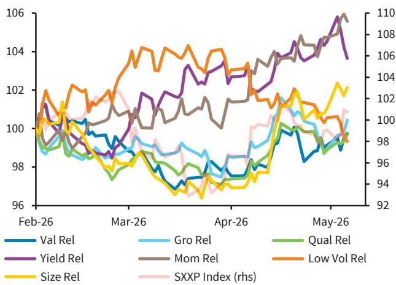

line

| Date   | Val Rel | Yield Rel | Size Rel | Gro Rel | Qual Rel | Mom Rel | Low Vol Rel | SXXP Index (rhs) |
|--------|---------|-----------|----------|---------|----------|---------|-------------|------------------|
| Feb-26 | 100     | 101       | 100      | 99      | 98       | 100     | 102         | 100              |
| Mar-26 | 98      | 102       | 97       | 98      | 96       | 101     | 104         | 101              |
| Apr-26 | 97      | 103       | 98       | 99      | 97       | 102     | 105         | 102              |
| May-26 | 99      | 106       | 102      | 100     | 100      | 108     | 107         | 101              |

BARC factors   
Source: Bloomberg, BARC

FIGURE 49. MSCI factors performance narrows, Yield and Low Vol rolling over since early April   
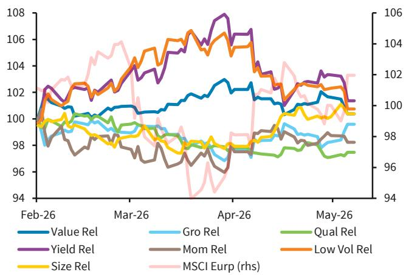

line

| Date   | Value Rel | Yield Rel | Low Vol Rel | Gro Rel | Qual Rel | Mom Rel | Size Rel | MSCI Eurp (rhs) |
|--------|-----------|-----------|-------------|---------|----------|---------|----------|-----------------|
| Feb-26 | 100       | 102       | 101         | 99      | 100      | 98      | 99       | 103             |
| Mar-26 | 101       | 103       | 104         | 99      | 99       | 97      | 98       | 105             |
| Apr-26 | 103       | 108       | 106         | 98      | 98       | 97      | 98       | 94              |
| May-26 | 102       | 103       | 102         | 99      | 97       | 98      | 100      | 103             |

MSCI factors   
Source: LSEG Data & Analytics, BARC

# European Factors Landscape

# Factors allocation

FIGURE 50. Current Europe factor recommendations and rationale 

<table><tr><td>Factor</td><td>Description</td><td>Recomm.</td><td>Rationale</td></tr><tr><td>Value</td><td>Cheap</td><td>Positive</td><td>Sticky inflation and a still-hawkish ECB keep the macro biased toward reflation. Positioning is cleaner, earnings momentum is rebuilding, and Value remains inexpensive after lagging the rates repricing, offering a cleaner and more robust entry point into the reflation trade.</td></tr><tr><td>Momentum</td><td>High Px Mom</td><td>Neutral</td><td>Near-term crowding concerns. Solid EPS momentum and continued AI winners exposure remain supportive, with valuations closer to historical norms.</td></tr><tr><td>Quality</td><td>High Quality</td><td>Neutral</td><td>Valuation support has improved risk-reward, but limited near-term catalysts and ongoing disruption from AI-led winners temper the case for adding aggressively at this stage.</td></tr><tr><td>Size</td><td>Small</td><td>Neutral</td><td>Cooling macro momentum and restrictive ECB policy cap near-term rotation upside. Valuations are attractive, but the macro backdrop lacks sufficient traction to justify a more constructive stance.</td></tr><tr><td>Growth</td><td>High Growth</td><td>Neutral</td><td>Earnings momentum is improving but renewed rates volatility weighs on long-duration exposure. Light positioning and stabilising sentiment help limit downside risks.</td></tr><tr><td>Volatility</td><td>Low Vol</td><td>Negative</td><td>Relative valuations are still unattractive and the factor continues to screen poorly in a sticky-inflation, higher-rates environment.</td></tr></table>

Note: Positive: We recommend increasing exposure to the factor. Neutral: We recommend maintaining exposure to the factor. Negative: We recommend decreasing exposure to the factor.   
Source: BARC

# Factor performance across macro/market regimes

CESI continues to roll over as global growth expectations soften post-conflict, while sticky inflation and a volatility floor keep risk appetites contained. This backdrop has historically supported positive but choppier equity returns. The playbook favours balanced factor exposure, with beta expressed through Momentum while staying underweight Low Vol. With peak escalation likely behind us, the model shifts defensive exposure from Low Vol into Quality, reflecting persistently high rates and a preference for earnings and balance sheet resilience over pure duration proxies.

FIGURE 51. Barc EU Factors - 4-week forward relative return by Global CESI regime 

<table><tr><td colspan="11">Barc EU Factors - 4w forward relative return by Global CESI regime</td></tr><tr><td>Level</td><td>Change</td><td>Speed</td><td>SXXP</td><td>Mom</td><td>Gro</td><td>Val</td><td>Qual</td><td>Yield</td><td>Size</td><td>Low Vol</td></tr><tr><td>High</td><td>Increase</td><td>Fast</td><td>1.1%</td><td>0.3%</td><td>0.2%</td><td>-0.1%</td><td>0.2%</td><td>0.1%</td><td>0.2%</td><td>-0.2%</td></tr><tr><td>High</td><td>Increase</td><td>Slow</td><td>0.6%</td><td>0.1%</td><td>0.3%</td><td>0.1%</td><td>0.3%</td><td>0.1%</td><td>0.5%</td><td>0.0%</td></tr><tr><td>High</td><td>Decrease</td><td>Fast</td><td>0.4%</td><td>0.4%</td><td>0.4%</td><td>0.1%</td><td>0.2%</td><td>0.4%</td><td>0.5%</td><td>0.1%</td></tr><tr><td>High</td><td>Decrease</td><td>Slow</td><td>0.2%</td><td>0.5%</td><td>0.7%</td><td>0.1%</td><td>0.4%</td><td>0.0%</td><td>0.4%</td><td>0.0%</td></tr><tr><td>Low</td><td>Increase</td><td>Fast</td><td>0.4%</td><td>-0.3%</td><td>0.2%</td><td>0.2%</td><td>0.0%</td><td>0.0%</td><td>-0.2%</td><td>0.1%</td></tr><tr><td>Low</td><td>Increase</td><td>Slow</td><td>0.8%</td><td>-0.1%</td><td>-0.4%</td><td>0.8%</td><td>-0.4%</td><td>0.5%</td><td>0.0%</td><td>0.6%</td></tr><tr><td>Low</td><td>Decrease</td><td>Fast</td><td>0.4%</td><td>-0.4%</td><td>0.2%</td><td>0.5%</td><td>0.1%</td><td>0.2%</td><td>0.1%</td><td>0.0%</td></tr><tr><td>Low</td><td>Decrease</td><td>Slow</td><td>-0.8%</td><td>0.5%</td><td>0.3%</td><td>-0.3%</td><td>0.4%</td><td>-0.1%</td><td>-0.1%</td><td>0.5%</td></tr></table>

52-week look back window percentile used, High, Increase and Fast are when current percentile is above 50%, change is 12-week and speed is 4-week change of 12-week change

Source: Bloomberg, BARC

FIGURE 53. Barc EU Factors - 4-week forward relative return by VIX regime 

<table><tr><td colspan="11">Barc EU Factors - 4w forward relative return by VIX regime</td></tr><tr><td>Level</td><td>Change</td><td>Speed</td><td>SXXP</td><td>Mom</td><td>Gro</td><td>Val</td><td>Qual</td><td>Yield</td><td>Size</td><td>Low Vol</td></tr><tr><td>High</td><td>Increase</td><td>Fast</td><td>0.6%</td><td>0.4%</td><td>0.5%</td><td>0.3%</td><td>0.3%</td><td>0.2%</td><td>0.4%</td><td>-0.1%</td></tr><tr><td>High</td><td>Increase</td><td>Slow</td><td>-0.8%</td><td>0.6%</td><td>0.5%</td><td>-0.7%</td><td>0.6%</td><td>-0.2%</td><td>-0.1%</td><td>0.5%</td></tr><tr><td>High</td><td>Decrease</td><td>Fast</td><td>1.7%</td><td>-0.6%</td><td>0.0%</td><td>0.3%</td><td>-0.3%</td><td>0.3%</td><td>0.5%</td><td>-0.6%</td></tr><tr><td>High</td><td>Decrease</td><td>Slow</td><td>0.0%</td><td>-0.1%</td><td>0.2%</td><td>0.4%</td><td>0.0%</td><td>0.3%</td><td>0.3%</td><td>-0.3%</td></tr><tr><td>Low</td><td>Increase</td><td>Fast</td><td>0.2%</td><td>0.2%</td><td>0.1%</td><td>0.0%</td><td>0.4%</td><td>0.0%</td><td>0.1%</td><td>0.4%</td></tr><tr><td>Low</td><td>Increase</td><td>Slow</td><td>0.4%</td><td>0.1%</td><td>0.2%</td><td>-0.1%</td><td>0.4%</td><td>-0.3%</td><td>0.0%</td><td>0.2%</td></tr><tr><td>Low</td><td>Decrease</td><td>Fast</td><td>0.4%</td><td>0.0%</td><td>0.2%</td><td>0.1%</td><td>0.2%</td><td>0.2%</td><td>0.1%</td><td>0.1%</td></tr><tr><td>Low</td><td>Decrease</td><td>Slow</td><td>0.1%</td><td>0.1%</td><td>0.2%</td><td>-0.1%</td><td>0.1%</td><td>0.0%</td><td>-0.1%</td><td>0.3%</td></tr></table>

52-week look back window percentile used, High, Increase and Fast are when current percentile is above 50%, change is 12-week and speed is 4-week change of 12-week change

Source: Bloomberg, BARC

FIGURE 52. Barc EU Factors - 4-week forward relative return by Global Inflation Surprise regime 

<table><tr><td colspan="10">Barc EU Factors - 4w forward relative return by Global Inflation Surprise regime</td><td></td></tr><tr><td>Level</td><td>Change</td><td>Speed</td><td>SXXP</td><td>Mom</td><td>Gro</td><td>Val</td><td>Qual</td><td>Yield</td><td>Size</td><td>Low Vol</td></tr><tr><td>High</td><td>Increase</td><td>Fast</td><td>-0.4%</td><td>0.6%</td><td>0.4%</td><td>-0.3%</td><td>0.5%</td><td>0.1%</td><td>0.4%</td><td>0.5%</td></tr><tr><td>High</td><td>Increase</td><td>Slow</td><td>0.9%</td><td>-0.1%</td><td>0.1%</td><td>0.0%</td><td>0.1%</td><td>0.1%</td><td>0.0%</td><td>-0.3%</td></tr><tr><td>High</td><td>Decrease</td><td>Fast</td><td>-0.4%</td><td>-0.6%</td><td>0.1%</td><td>0.2%</td><td>-0.3%</td><td>0.0%</td><td>-0.3%</td><td>1.1%</td></tr><tr><td>High</td><td>Decrease</td><td>Slow</td><td>0.5%</td><td>0.0%</td><td>0.7%</td><td>0.9%</td><td>0.4%</td><td>0.6%</td><td>0.4%</td><td>0.1%</td></tr><tr><td>Low</td><td>Increase</td><td>Fast</td><td>0.3%</td><td>0.0%</td><td>-0.1%</td><td>-0.2%</td><td>0.0%</td><td>0.0%</td><td>-0.2%</td><td>-0.1%</td></tr><tr><td>Low</td><td>Increase</td><td>Slow</td><td>0.6%</td><td>0.5%</td><td>0.8%</td><td>0.1%</td><td>0.3%</td><td>0.0%</td><td>0.5%</td><td>0.1%</td></tr><tr><td>Low</td><td>Decrease</td><td>Fast</td><td>1.1%</td><td>-0.1%</td><td>0.0%</td><td>-0.1%</td><td>0.0%</td><td>-0.1%</td><td>-0.2%</td><td>-0.2%</td></tr><tr><td>Low</td><td>Decrease</td><td>Slow</td><td>0.0%</td><td>0.3%</td><td>0.4%</td><td>0.3%</td><td>0.3%</td><td>0.0%</td><td>0.3%</td><td>0.2%</td></tr></table>

52-week look back window percentile used, High, Increase and Fast are when current percentile is above 50%, change is 12-week and speed is 4-week change of 12-week change

Source: Bloomberg, BARC

FIGURE 54. Barc EU Factors - 4-week forward relative return by MOVE regime 

<table><tr><td colspan="11">Barc EU Factors - 4w forward relative return by MOVE regime</td></tr><tr><td>Level</td><td>Change</td><td>Speed</td><td>SXXP</td><td>Mom</td><td>Gro</td><td>Val</td><td>Qual</td><td>Yield</td><td>Size</td><td>Low Vol</td></tr><tr><td>High</td><td>Increase</td><td>Fast</td><td>0.5%</td><td>0.1%</td><td>0.5%</td><td>0.2%</td><td>0.2%</td><td>0.1%</td><td>0.3%</td><td>-0.3%</td></tr><tr><td>High</td><td>Increase</td><td>Slow</td><td>0.8%</td><td>-0.1%</td><td>0.3%</td><td>-0.3%</td><td>0.2%</td><td>-0.1%</td><td>-0.2%</td><td>0.0%</td></tr><tr><td>High</td><td>Decrease</td><td>Fast</td><td>-1.3%</td><td>-0.1%</td><td>0.5%</td><td>0.1%</td><td>0.1%</td><td>0.0%</td><td>0.5%</td><td>0.5%</td></tr><tr><td>High</td><td>Decrease</td><td>Slow</td><td>0.2%</td><td>0.1%</td><td>0.4%</td><td>0.4%</td><td>0.0%</td><td>0.0%</td><td>-0.1%</td><td>-0.1%</td></tr><tr><td>Low</td><td>Increase</td><td>Fast</td><td>1.2%</td><td>0.2%</td><td>0.0%</td><td>0.7%</td><td>-0.2%</td><td>0.3%</td><td>0.2%</td><td>0.0%</td></tr><tr><td>Low</td><td>Increase</td><td>Slow</td><td>0.5%</td><td>0.6%</td><td>0.2%</td><td>0.4%</td><td>0.3%</td><td>0.3%</td><td>0.4%</td><td>-0.1%</td></tr><tr><td>Low</td><td>Decrease</td><td>Fast</td><td>-0.7%</td><td>0.2%</td><td>0.1%</td><td>-0.4%</td><td>0.6%</td><td>0.1%</td><td>0.0%</td><td>0.4%</td></tr><tr><td>Low</td><td>Decrease</td><td>Slow</td><td>0.1%</td><td>0.3%</td><td>0.2%</td><td>-0.4%</td><td>0.4%</td><td>0.0%</td><td>0.1%</td><td>0.5%</td></tr></table>

52-week look back window percentile used, High, Increase and Fast are when current percentile is above 50%, change is 12-week and speed is 4-week change of 12-week change

Source: Bloomberg, BARC

FIGURE 55. Our dynamic allocation model favours Momentum over the next four weeks   
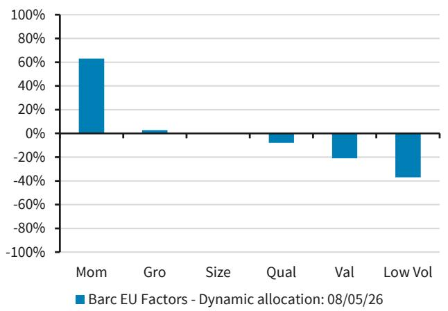

bar

Barc EU Factors - Dynamic allocation: 08/05/26
| Category | Barc EU Factors (%) |
| :--- | :--- |
| Mom | 62 |
| Gro | 3 |
| Size | 0 |
| Qual | -5 |
| Val | -18 |
| Low Vol | -40 |

Source: Bloomberg, BARC

FIGURE 56. The model rotates to Quality from Low Vol   
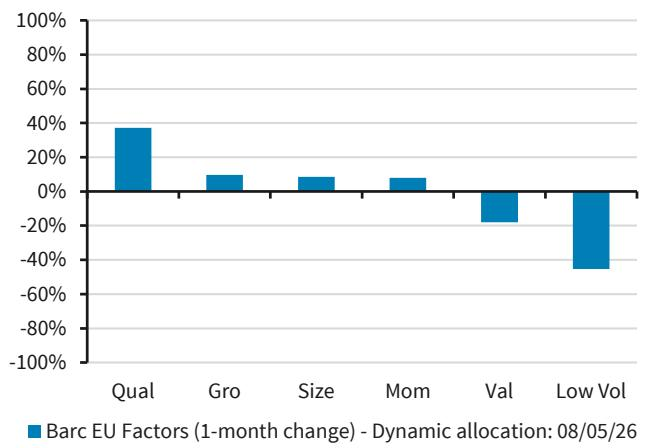

bar

| Category | Barc EU Factors (1-month change) - Dynamic allocation: 08/05/26 (%) |
| :--- | :--- |
| Qual | 38 |
| Gro | 10 |
| Size | 9 |
| Mom | 8 |
| Val | -15 |
| Low Vol | -45 |

Source: Bloomberg, BARC

# Price and earnings momentum

Momentum gains have been supported by strong earnings revisions, but returns implied by fundamentals now screen weakest within factors. Small Caps show a weak alignment too, with price action running ahead of earnings support. By contrast, Value combines the strongest earnings momentum with one of the most attractive returns implied by fundamentals, favouring rotation away from pure price led trades.

FIGURE 57. Momentum gains were backed by strong earnings momentum, Small Caps less so   
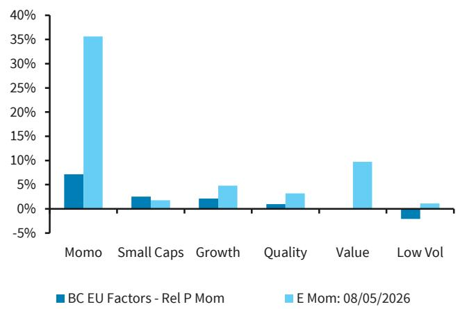

bar

| Category | BC EU Factors - Rel P Mom (%) | E Mom: 08/05/2026 (%) |
| :--- | :--- | :--- |
| Momo | 7 | 35.5 |
| Small Caps | 2.5 | 1.5 |
| Growth | 2 | 4.5 |
| Quality | 0.8 | 3.2 |
| Value | 0 | 9.5 |
| Low Vol | -1.5 | 0.8 |

Source: Bloomberg, BARC

FIGURE 58. Low Vol and Value are showing the best return implied by earnings momentum   
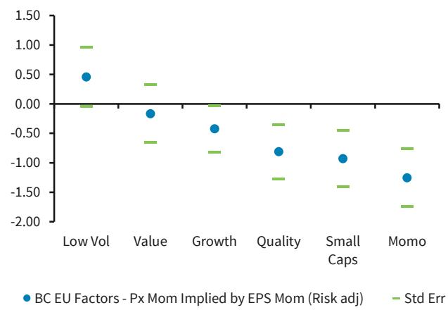

scatter

| Category   | BC EU Factors - Px Mom Implied by EPS Mom (Risk adj) | Std Err |
| ---------- | ---------------------------------------------------- | ------- |
| Low Vol    | 0.45                                                 | 0.00    |
| Value      | -0.25                                                | -0.60   |
| Growth     | -0.40                                                | -0.80   |
| Quality    | -0.85                                                | -1.20   |
| Small Caps | -0.95                                                | -1.40   |
| Momo       | -1.30                                                | -1.80   |

Source: Bloomberg, BARC

# Positioning

Momentum crowding has risen over the past four weeks and remains the most crowded trade. As positioning becomes more asymmetric, Momentum looks more vulnerable to any deceleration in fundamentals. Recent flows show Value positioning starting to temper, while Quality has attracted incremental inflows.

FIGURE 59. Momentum remains the most crowded among European factors   
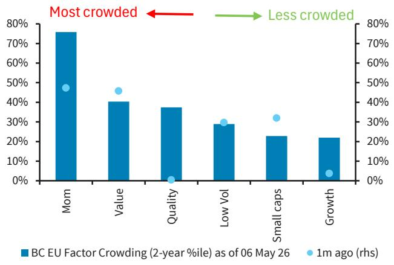

bar

| Category   | BC EU Factor Crowding (2-year %ile) as of 06 May 26 | 1m ago (rhs) |
| ---------- | --------------------------------------------------- | ------------ |
| Mom        | 75%                                                 | 48%          |
| Value      | 40%                                                 | 45%          |
| Quality    | 37%                                                 | 2%           |
| Low Vol    | 29%                                                 | 30%          |
| Small caps | 23%                                                 | 33%          |
| Growth     | 22%                                                 | 5%           |

Source: MSCI, BARC

FIGURE 60. Flows in Value tempers, while Quality saw incremental inflows   
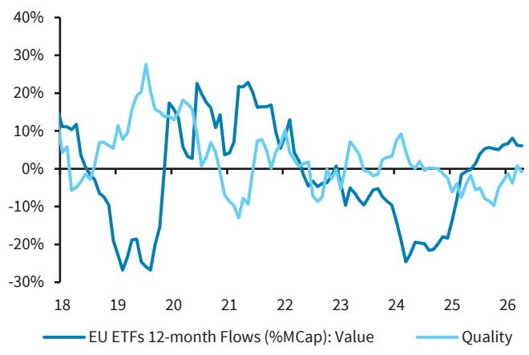

line

| Year | EU ETFs 12-month Flows (%MCap): Value | Quality |
|------|----------------------------------------|---------|
| 18   | ~10%                                   | ~5%     |
| 19   | ~-25%                                  | ~25%    |
| 20   | ~20%                                   | ~15%    |
| 21   | ~25%                                   | ~-10%   |
| 22   | ~15%                                   | ~5%     |
| 23   | ~-5%                                   | ~0%     |
| 24   | ~-25%                                  | ~10%    |
| 25   | ~-10%                                  | ~-5%    |
| 26   | ~5%                                    | ~0%     |

Source: Bloomberg, BARC

# Technicals

Seasonality points to a broadly flat global equity performance in May/June, with relative resilience in Quality and Momentum. With dispersion elevated, factor selection is key, and Value stands out as a cleaner Momentum neutral expression given low correlations and limited exposure to crowded AI winners. Quality also looks increasingly interesting from an oversold perspective, but its long short inflation bias makes it a harder trade to express cleanly at this stage.

FIGURE 61. BARC European Factors - 14D RSI   
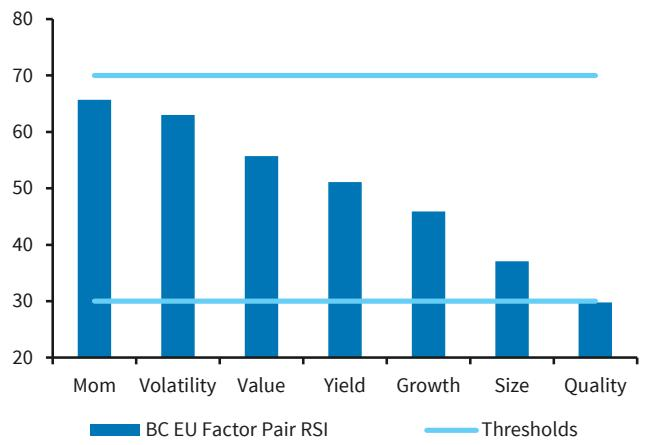

bar

| Category   | BC EU Factor Pair RSI |
| ---------- | --------------------- |
| Mom        | 65                    |
| Volatility | 62                    |
| Value      | 55                    |
| Yield      | 50                    |
| Growth     | 45                    |
| Size       | 37                    |
| Quality    | 30                    |

Source: Bloomberg, BARC

FIGURE 62. BARC European Factors - 14D forward returns by 14D RSI current level   
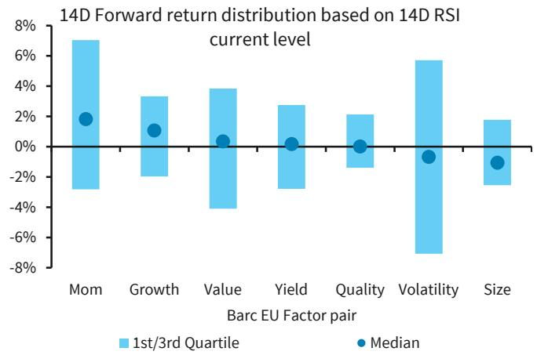

bar

| Barc EU Factor pair | 1st/3rd Quartile | Median |
| ------------------- | ---------------- | ------ |
| Mom                 | ~7%              | ~2%    |
| Growth              | ~3%              | ~1%    |
| Value               | ~4%              | ~0%    |
| Yield               | ~3%              | ~0%    |
| Quality             | ~2%              | ~0%    |
| Volatility          | ~6%              | ~-1%   |
| Size                | ~2%              | ~-1%   |

Source: Bloomberg, BARC

FIGURE 63. May tends to favour Quality, Growth and Momentum 

<table><tr><td colspan="13">Europe factor seasonality - Average rel. monthly return</td></tr><tr><td></td><td>Jan</td><td>Feb</td><td>Mar</td><td>Apr</td><td>May</td><td>Jun</td><td>Jul</td><td>Aug</td><td>Sep</td><td>Oct</td><td>Nov</td><td>Dec</td></tr><tr><td>Quality</td><td>-0.5%</td><td>0.7%</td><td>0.4%</td><td>-0.1%</td><td>0.7%</td><td>0.4%</td><td>-0.1%</td><td>0.9%</td><td>0.2%</td><td>-0.6%</td><td>0.2%</td><td>0.6%</td></tr><tr><td>Growth</td><td>0.5%</td><td>0.8%</td><td>0.4%</td><td>-0.3%</td><td>0.6%</td><td>-0.3%</td><td>0.3%</td><td>1.0%</td><td>-0.3%</td><td>-0.3%</td><td>0.4%</td><td>0.8%</td></tr><tr><td>Momentum</td><td>0.0%</td><td>1.1%</td><td>0.2%</td><td>-0.8%</td><td>0.6%</td><td>0.7%</td><td>0.0%</td><td>0.3%</td><td>0.5%</td><td>-0.3%</td><td>-0.1%</td><td>0.5%</td></tr><tr><td>Low Vol</td><td>-0.4%</td><td>0.7%</td><td>0.9%</td><td>-0.8%</td><td>0.5%</td><td>0.5%</td><td>-0.4%</td><td>0.8%</td><td>0.9%</td><td>-0.6%</td><td>-0.4%</td><td>0.2%</td></tr><tr><td>Small Caps</td><td>0.2%</td><td>0.9%</td><td>0.2%</td><td>0.5%</td><td>0.1%</td><td>-0.3%</td><td>0.2%</td><td>0.6%</td><td>-0.1%</td><td>-0.7%</td><td>0.5%</td><td>0.8%</td></tr><tr><td>Yield</td><td>0.1%</td><td>0.4%</td><td>0.5%</td><td>0.3%</td><td>-0.1%</td><td>-0.2%</td><td>-0.1%</td><td>0.8%</td><td>0.3%</td><td>-0.2%</td><td>0.3%</td><td>0.6%</td></tr><tr><td>Value</td><td>0.6%</td><td>1.2%</td><td>0.2%</td><td>0.8%</td><td>-0.3%</td><td>-0.5%</td><td>0.0%</td><td>0.6%</td><td>-0.2%</td><td>0.3%</td><td>0.4%</td><td>0.7%</td></tr></table>

Source: Bloomberg, BARC

FIGURE 65. BARC European factor dispersion has increased recently   
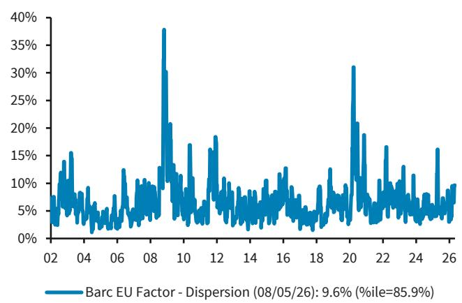

line

| Date       | Barc EU Factor - Dispersion |
| ---------- | ---------------------------- |
| 08/05/26   | 9.6%                         |

Source: Bloomberg, BARC

FIGURE 64. May-June seasonality is not supportive for global equities   
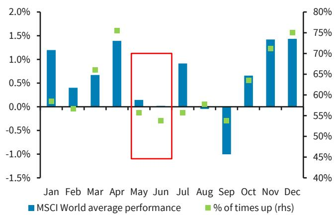

bar_line

| Month | MSCI World average performance (%) | % of times up (rhs) |
|---|---|---|
| Jan | 1.2 | 50 |
| Feb | 0.4 | -10 |
| Mar | 0.7 | 65 |
| Apr | 1.4 | 75 |
| May | 0.1 | -30 |
| Jun | -0.1 | -35 |
| Jul | 0.9 | -20 |
| Aug | -0.1 | 25 |
| Sep | -1.0 | -35 |
| Oct | 0.6 | 50 |
| Nov | 1.4 | 70 |
| Dec | 1.4 | 75 |

Source: Bloomberg, BARC

FIGURE 66. BARC European Factors - 3-month correlation 

<table><tr><td colspan="7">Barc EU Factors - 3-month correlation</td></tr><tr><td></td><td>Value</td><td>Growth</td><td>Quality</td><td>Mom</td><td>Low Vol</td><td>Size</td></tr><tr><td>Value</td><td></td><td>95%</td><td>96%</td><td>94%</td><td>88%</td><td>97%</td></tr><tr><td>Growth</td><td>95%</td><td></td><td>99%</td><td>96%</td><td>90%</td><td>95%</td></tr><tr><td>Quality</td><td>96%</td><td>99%</td><td></td><td>96%</td><td>90%</td><td>96%</td></tr><tr><td>Mom</td><td>94%</td><td>96%</td><td>96%</td><td></td><td>87%</td><td>93%</td></tr><tr><td>Low Vol</td><td>88%</td><td>90%</td><td>90%</td><td>87%</td><td></td><td>89%</td></tr><tr><td>Size</td><td>97%</td><td>95%</td><td>96%</td><td>93%</td><td>89%</td><td></td></tr></table>

Source: Bloomberg, BARC

FIGURE 67. BARC EU factors constituents overlap   
Barc EU Factors - Constituents overlap 

<table><tr><td></td><td>Value (Cheap)</td><td>High Growth</td><td>High Quality</td><td>High Yield</td><td>High Momentum</td><td>High Volatility</td><td>Large Size</td><td>Anti-Value (Expensive)</td><td>Low Growth</td><td>Low Quality</td><td>Low Yield</td><td>Low Momentum</td><td>Low Volatility</td></tr><tr><td>Value (Cheap)</td><td></td><td>5%</td><td>5%</td><td>19%</td><td>7%</td><td>14%</td><td>4%</td><td></td><td>20%</td><td>31%</td><td>10%</td><td>26%</td><td>2%</td></tr><tr><td>High Growth</td><td>6%</td><td></td><td>23%</td><td>8%</td><td>22%</td><td>28%</td><td>9%</td><td>29%</td><td></td><td>8%</td><td>24%</td><td>15%</td><td>1%</td></tr><tr><td>High Quality</td><td>6%</td><td>22%</td><td></td><td>12%</td><td>11%</td><td>12%</td><td>10%</td><td>31%</td><td>11%</td><td></td><td>11%</td><td>19%</td><td>12%</td></tr><tr><td>High Yield</td><td>21%</td><td>8%</td><td>13%</td><td></td><td>9%</td><td>13%</td><td>5%</td><td>6%</td><td>18%</td><td>22%</td><td></td><td>17%</td><td>8%</td></tr><tr><td>High Momentum</td><td>8%</td><td>21%</td><td>11%</td><td>9%</td><td></td><td>25%</td><td>11%</td><td>19%</td><td>3%</td><td>15%</td><td>18%</td><td></td><td>9%</td></tr><tr><td>High Volatility</td><td>13%</td><td>24%</td><td>11%</td><td>11%</td><td>22%</td><td></td><td>2%</td><td>25%</td><td>7%</td><td>28%</td><td>43%</td><td>26%</td><td></td></tr><tr><td>Large Size</td><td>8%</td><td>16%</td><td>18%</td><td>8%</td><td>20%</td><td>4%</td><td></td><td>20%</td><td>14%</td><td>2%</td><td>6%</td><td>8%</td><td>16%</td></tr><tr><td>Anti-Value (Expensive)</td><td></td><td>31%</td><td>35%</td><td>6%</td><td>21%</td><td>31%</td><td>13%</td><td></td><td>5%</td><td>6%</td><td>24%</td><td>13%</td><td>19%</td></tr><tr><td>Low Growth</td><td>22%</td><td></td><td>11%</td><td>18%</td><td>3%</td><td>8%</td><td>8%</td><td>5%</td><td></td><td>15%</td><td>13%</td><td>20%</td><td>21%</td></tr><tr><td>Low Quality</td><td>31%</td><td>7%</td><td></td><td>19%</td><td>13%</td><td>30%</td><td>1%</td><td>5%</td><td>13%</td><td></td><td>22%</td><td>17%</td><td>4%</td></tr><tr><td>Low Yield</td><td>10%</td><td>21%</td><td>10%</td><td></td><td>16%</td><td>43%</td><td>3%</td><td>19%</td><td>11%</td><td>22%</td><td></td><td>17%</td><td>3%</td></tr><tr><td>Low Momentum</td><td>28%</td><td>14%</td><td>19%</td><td>17%</td><td></td><td>30%</td><td>4%</td><td>11%</td><td>19%</td><td>19%</td><td>19%</td><td></td><td>3%</td></tr><tr><td>Low Volatility</td><td>3%</td><td>1%</td><td>15%</td><td>10%</td><td>11%</td><td></td><td>11%</td><td>21%</td><td>25%</td><td>6%</td><td>4%</td><td>4%</td><td></td></tr><tr><td>Small Size</td><td>24%</td><td>15%</td><td>17%</td><td>17%</td><td>15%</td><td>28%</td><td></td><td>9%</td><td>14%</td><td>21%</td><td>22%</td><td>20%</td><td>3%</td></tr></table>

Source: Bloomberg, BARC

FIGURE 68. BARC EU factors and thematics baskets constituents overlap   
Barc EU Factors - Constituents overlap 

<table><tr><td></td><td>US tariff-exposed</td><td>EU exporters</td><td>EU Domestics</td><td>Ukraine Ceasefire</td><td>Germany revival</td><td>EU Defence</td><td>EU AI Enablers</td><td>EU AI Losers</td><td>Short cycle</td><td>SXXP consumer</td><td>EU Inflation Long</td><td>EU Inflation Short</td><td>EU Duration Long</td><td>EU Duration Short</td></tr><tr><td>Value (Cheap)</td><td>1%</td><td>4%</td><td>2%</td><td>2%</td><td>7%</td><td>0%</td><td>0%</td><td>3%</td><td>3%</td><td>5%</td><td>5%</td><td>3%</td><td>2%</td><td>4%</td></tr><tr><td>High Growth</td><td>1%</td><td>2%</td><td>2%</td><td>3%</td><td>5%</td><td>3%</td><td>2%</td><td>3%</td><td>0%</td><td>2%</td><td>3%</td><td>8%</td><td>7%</td><td>5%</td></tr><tr><td>High Quality</td><td>2%</td><td>4%</td><td>1%</td><td>1%</td><td>2%</td><td>2%</td><td>2%</td><td>4%</td><td>3%</td><td>3%</td><td>2%</td><td>8%</td><td>6%</td><td>1%</td></tr><tr><td>High Yield</td><td>1%</td><td>5%</td><td>2%</td><td>1%</td><td>0%</td><td>0%</td><td>1%</td><td>3%</td><td>3%</td><td>5%</td><td>6%</td><td>1%</td><td>1%</td><td>5%</td></tr><tr><td>High Momentum</td><td>4%</td><td>2%</td><td>2%</td><td>1%</td><td>2%</td><td>0%</td><td>6%</td><td>0%</td><td>4%</td><td>1%</td><td>4%</td><td>2%</td><td>1%</td><td>3%</td></tr><tr><td>High Volatility</td><td>2%</td><td>1%</td><td>2%</td><td>1%</td><td>3%</td><td>3%</td><td>3%</td><td>1%</td><td>5%</td><td>1%</td><td>2%</td><td>3%</td><td>6%</td><td>1%</td></tr><tr><td>Large Size</td><td>4%</td><td>12%</td><td>8%</td><td>4%</td><td>4%</td><td>6%</td><td>8%</td><td>2%</td><td>8%</td><td>2%</td><td>8%</td><td>2%</td><td>4%</td><td>4%</td></tr><tr><td>Anti-Value (Expensive)</td><td>3%</td><td>3%</td><td>3%</td><td>0%</td><td>4%</td><td>4%</td><td>6%</td><td>0%</td><td>8%</td><td>4%</td><td>10%</td><td>8%</td><td>9%</td><td>1%</td></tr><tr><td>Low Growth</td><td>0%</td><td>1%</td><td>7%</td><td>1%</td><td>7%</td><td>0%</td><td>0%</td><td>2%</td><td>5%</td><td>5%</td><td>1%</td><td>5%</td><td>1%</td><td>5%</td></tr><tr><td>Low Quality</td><td>2%</td><td>1%</td><td>2%</td><td>2%</td><td>1%</td><td>0%</td><td>1%</td><td>1%</td><td>3%</td><td>3%</td><td>9%</td><td>1%</td><td>2%</td><td>8%</td></tr><tr><td>Low Yield</td><td>2%</td><td>1%</td><td>4%</td><td>1%</td><td>7%</td><td>1%</td><td>2%</td><td>0%</td><td>4%</td><td>2%</td><td>9%</td><td>7%</td><td>7%</td><td>3%</td></tr><tr><td>Low Momentum</td><td>3%</td><td>8%</td><td>2%</td><td>2%</td><td>2%</td><td>0%</td><td>0%</td><td>8%</td><td>2%</td><td>1%</td><td>3%</td><td>8%</td><td>7%</td><td>2%</td></tr><tr><td>Low Volatility</td><td>3%</td><td>6%</td><td>1%</td><td>0%</td><td>3%</td><td>0%</td><td>1%</td><td>3%</td><td>3%</td><td>4%</td><td>3%</td><td>1%</td><td>3%</td><td>3%</td></tr><tr><td>Small Size</td><td>0%</td><td>0%</td><td>0%</td><td>0%</td><td>1%</td><td>1%</td><td>0%</td><td>2%</td><td>0%</td><td>1%</td><td>0%</td><td>1%</td><td>1%</td><td>0%</td></tr></table>

Source: Bloomberg, BARC

# European Factor Legs BARC EU Value

FIGURE 69. BARC EU Value - Dynamic allocation   
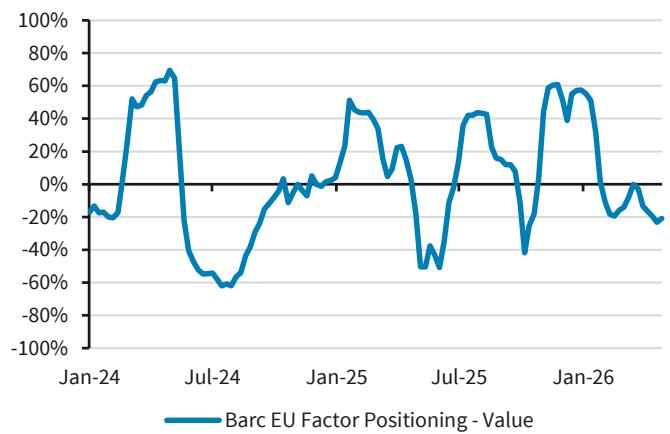

line

| Date   | Barc EU Factor Positioning - Value |
|--------|------------------------------------|
| Jan-24 | -20%                               |
| Jul-24 | 70%                                |
| Jan-25 | 50%                                |
| Jul-25 | -50%                               |
| Jan-26 | 60%                                |

Source: BARC

FIGURE 70. BARC EU Value - Crowding   
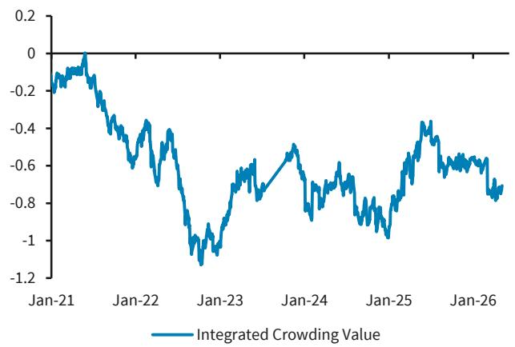

line

| Date   | Integrated Crowding Value |
|--------|----------------------------|
| Jan-21 | -0.2                       |
| Jan-22 | -0.4                       |
| Jan-23 | -1.0                       |
| Jan-24 | -0.6                       |
| Jan-25 | -0.9                       |
| Jan-26 | -0.8                       |

Source: MSCI, BARC

FIGURE 71. BARC EU Value - Performance vs past   
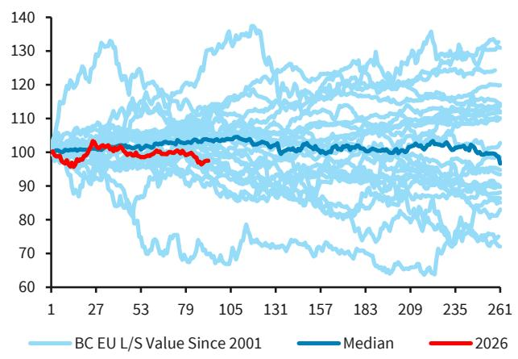

line

| Year | BC EU L/S Value Since 2001 | Median | 2026 |
|------|-----------------------------|--------|------|
| 1    | ~100                        | ~100   | ~100 |
| 27   | ~130                        | ~100   | ~100 |
| 53   | ~110                        | ~100   | ~100 |
| 79   | ~130                        | ~100   | ~100 |
| 105  | ~135                        | ~100   | ~100 |
| 131  | ~130                        | ~100   | ~100 |
| 157  | ~125                        | ~100   | ~100 |
| 183  | ~120                        | ~100   | ~100 |
| 209  | ~135                        | ~100   | ~100 |
| 235  | ~130                        | ~100   | ~100 |
| 261  | ~135                        | ~100   | ~100 |

Source: Bloomberg, BARC

FIGURE 72. BARC EU Value - Relative price momentum vs earnings momentum   
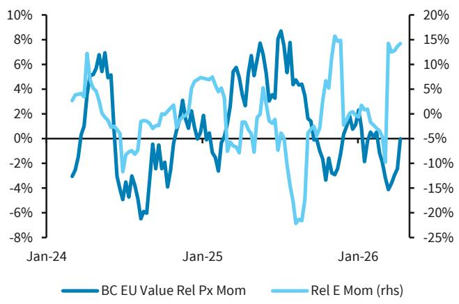

line

| Date   | BC EU Value Rel Px Mom | Rel E Mom (rhs) |
|--------|------------------------|-----------------|
| Jan-24 | -3%                    | 3%              |
| Jan-25 | 8%                     | 5%              |
| Jan-26 | -4%                    | 15%             |

Source: Bloomberg, BARC

FIGURE 73. BARC EU Value - Relative 12m F PE   
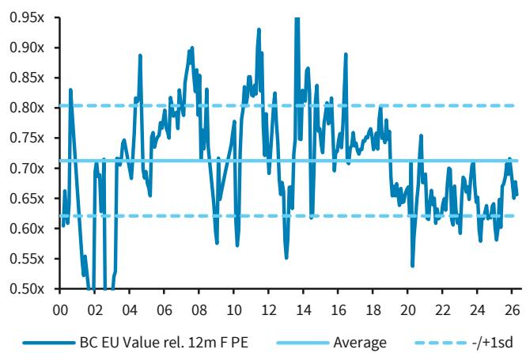

line

| Year | BC EU Value rel. 12m F PE |
|------|---------------------------|
| 00   | 0.65x                     |
| 01   | 0.83x                     |
| 02   | 0.50x                     |
| 03   | 0.72x                     |
| 04   | 0.75x                     |
| 05   | 0.89x                     |
| 06   | 0.78x                     |
| 07   | 0.82x                     |
| 08   | 0.85x                     |
| 09   | 0.72x                     |
| 10   | 0.78x                     |
| 11   | 0.84x                     |
| 12   | 0.92x                     |
| 13   | 0.55x                     |
| 14   | 0.95x                     |
| 15   | 0.85x                     |
| 16   | 0.82x                     |
| 17   | 0.75x                     |
| 18   | 0.78x                     |
| 19   | 0.65x                     |
| 20   | 0.55x                     |
| 21   | 0.75x                     |
| 22   | 0.68x                     |
| 23   | 0.70x                     |
| 24   | 0.65x                     |
| 25   | 0.68x                     |
| 26   | 0.72x                     |

Source: IBES, LSEG Data & Analytics, BARC

FIGURE 74. BARC EU Value - Relative P/Book vs RoE   
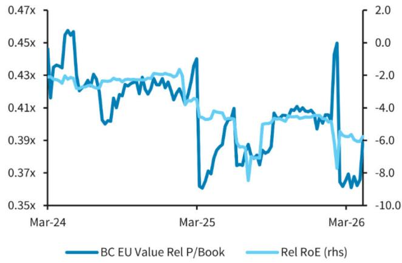

line

| Date   | BC EU Value Rel P/Book | Rel RoE (rhs) |
|--------|------------------------|---------------|
| Mar-24 | 0.45x                  | -2.0          |
| Mar-25 | 0.37x                  | -8.0          |
| Mar-26 | 0.45x                  | -6.0          |

Source: Bloomberg, BARC

FIGURE 75. BARC EU Value - Sector allocation vs STOXX 600   
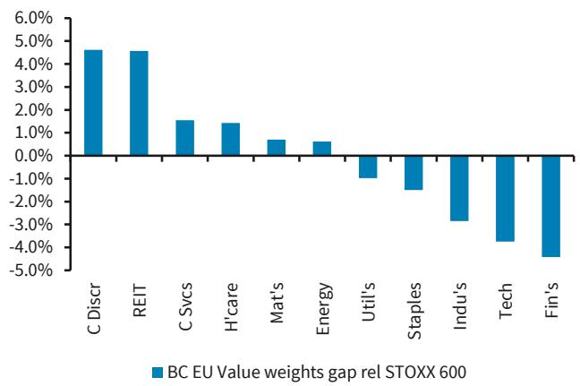

bar

BC EU Value weights gap rel STOXX 600
| Sector | BC EU Value weights gap rel STOXX 600 (%) |
| :--- | :--- |
| C Discr | 4.5 |
| REIT | 4.5 |
| C Svcs | 1.5 |
| H'care | 1.4 |
| Mat's | 0.6 |
| Energy | 0.5 |
| Util's | -1.2 |
| Staples | -1.5 |
| Indu's | -2.8 |
| Tech | -3.8 |
| Fin's | -4.5 |

Source: Bloomberg, BARC

FIGURE 76. BARC EU Value - Sector allocation   
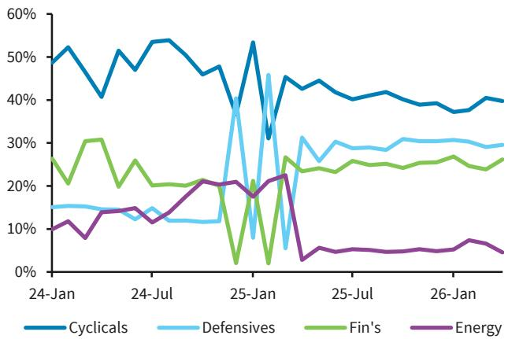

line

| Date    | Cyclicals | Defensives | Fin's | Energy |
|---------|-----------|------------|-------|--------|
| 24-Jan  | 50%       | 15%        | 25%   | 10%    |
| 24-Jul  | 55%       | 12%        | 20%   | 15%    |
| 25-Jan  | 50%       | 45%        | 20%   | 20%    |
| 25-Jul  | 40%       | 30%        | 25%   | 5%     |
| 26-Jan  | 40%       | 30%        | 25%   | 5%     |

Source: Bloomberg, BARC

# BARC EU Growth

FIGURE 77. BARC EU Growth - Dynamic allocation   
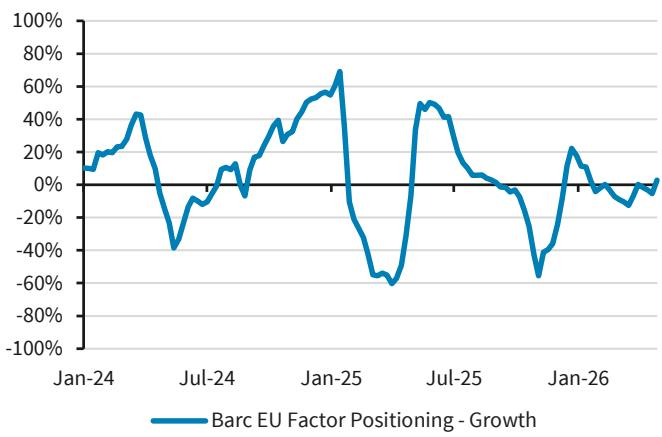

line

| Date   | Barc EU Factor Positioning - Growth |
|--------|-------------------------------------|
| Jan-24 | ~10%                                |
| Jul-24 | ~-40%                               |
| Jan-25 | ~70%                                |
| Jul-25 | ~-60%                               |
| Jan-26 | ~-60%                               |

Source: BARC

FIGURE 78. BARC EU Growth – Crowding   
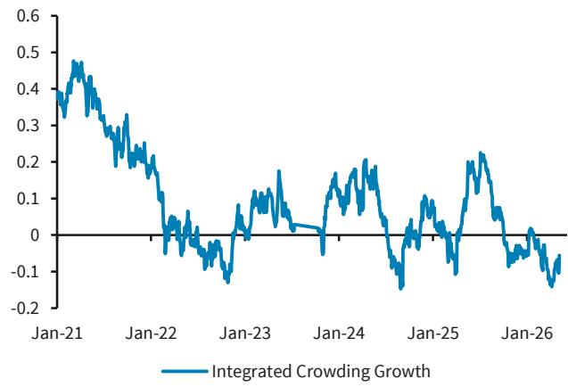

line

| Date   | Integrated Crowding Growth |
|--------|-----------------------------|
| Jan-21 | 0.45                        |
| Jan-22 | 0.15                        |
| Jan-23 | -0.05                       |
| Jan-24 | 0.18                        |
| Jan-25 | -0.15                       |
| Jan-26 | -0.10                       |

Source: MSCI, BARC

FIGURE 79. BARC EU Growth - Performance vs past   
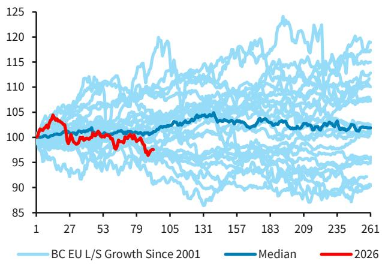

line

| X Value | BC EU L/S Growth Since 2001 | Median | 2026 |
|---------|-----------------------------|--------|------|
| 1       | ~100                        | ~100   | ~100 |
| 27      | ~105                        | ~101   | ~104 |
| 53      | ~108                        | ~102   | ~100 |
| 79      | ~110                        | ~103   | ~98  |
| 105     | ~112                        | ~104   | ~97  |
| 131     | ~115                        | ~105   | ~96  |
| 157     | ~118                        | ~104   | ~95  |
| 183     | ~120                        | ~103   | ~94  |
| 209     | ~122                        | ~102   | ~93  |
| 235     | ~120                        | ~102   | ~92  |
| 261     | ~118                        | ~102   | ~91  |

Source: Bloomberg, LSEG Data & Analytics, BARC

FIGURE 80. BARC EU Growth - Relative price momentum vs earnings momentum   
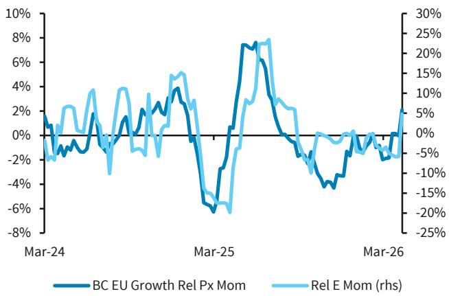

line

| Date   | BC EU Growth Rel Px Mom | Rel E Mom (rhs) |
|--------|--------------------------|-----------------|
| Mar-24 | ~1%                      | ~-2%            |
| Mar-25 | ~-7%                     | ~-20%           |
| Mar-26 | ~0%                      | ~5%             |

Source: Bloomberg, BARC

FIGURE 81. BARC EU Growth - Relative 12m F PE   
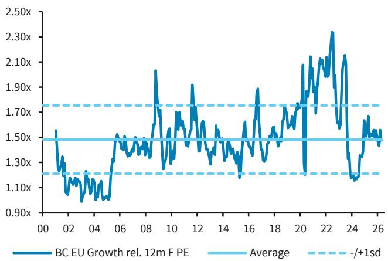

line

| Year | BC EU Growth rel. 12m F PE | Average | -/+1sd |
|------|-----------------------------|---------|--------|
| 00   | ~1.50x                      | 1.50x   | 1.70x  |
| 02   | ~1.10x                      | 1.50x   | 1.70x  |
| 04   | ~1.05x                      | 1.50x   | 1.70x  |
| 06   | ~1.30x                      | 1.50x   | 1.70x  |
| 08   | ~1.50x                      | 1.50x   | 1.70x  |
| 10   | ~1.70x                      | 1.50x   | 1.70x  |
| 12   | ~1.90x                      | 1.50x   | 1.70x  |
| 14   | ~1.50x                      | 1.50x   | 1.70x  |
| 16   | ~1.30x                      | 1.50x   | 1.70x  |
| 18   | ~1.60x                      | 1.50x   | 1.70x  |
| 20   | ~2.10x                      | 1.50x   | 1.70x  |
| 22   | ~2.30x                      | 1.50x   | 1.70x  |
| 24   | ~1.20x                      | 1.50x   | 1.70x  |
| 26   | ~1.50x                      | 1.50x   | 1.70x  |

Source: IBES, LSEG Data & Analytics, BARC

FIGURE 82. BARC EU Growth - Relative P/Book vs RoE   
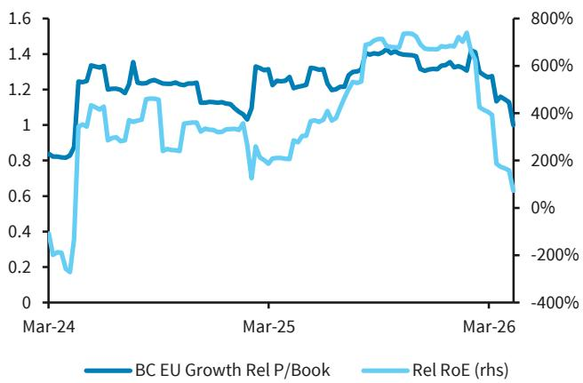

line

| Date   | BC EU Growth Rel P/Book | Rel RoE (rhs) |
|--------|--------------------------|---------------|
| Mar-24 | 0.8                      | 0%            |
| Mar-25 | 1.3                      | 600%          |
| Mar-26 | 1.0                      | 0%            |

Source: Bloomberg, BARC

FIGURE 83. BARC EU Growth - Sector allocation vs STOXX 600   
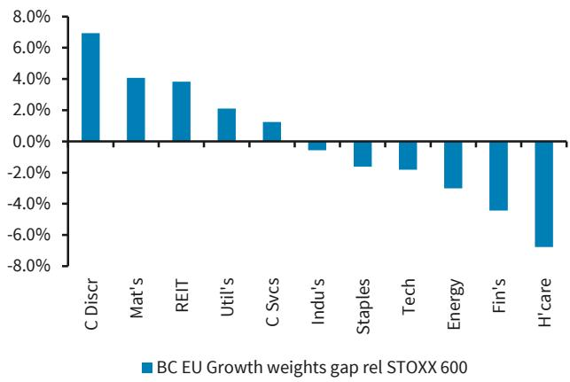

bar

BC EU Growth weights gap rel STOXX 600
| Sector | BC EU Growth weights gap rel STOXX 600 (%) |
| :--- | :--- |
| C Discr | 7.0 |
| Mat's | 4.0 |
| REIT | 3.8 |
| Util's | 2.0 |
| C Svcs | 1.2 |
| Indu's | -0.5 |
| Staples | -1.5 |
| Tech | -1.8 |
| Energy | -3.0 |
| Fin's | -4.5 |
| H'care | -7.0 |

Source: Bloomberg, BARC

FIGURE 84. BARC EU Growth - Sector allocation   
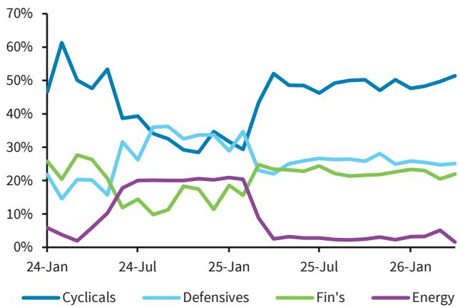

line

| Date     | Cyclicals | Defensives | Fin's | Energy |
| -------- | --------- | ---------- | ----- | ------ |
| 24-Jan   | 60%       | 15%        | 25%   | 5%     |
| 24-Jul   | 40%       | 35%        | 15%   | 20%    |
| 25-Jan   | 30%       | 30%        | 20%   | 20%    |
| 25-Jul   | 50%       | 25%        | 25%   | 5%     |
| 26-Jan   | 50%       | 25%        | 20%   | 5%     |

Source: Bloomberg, BARC

# BARC EU Quality

FIGURE 85. BARC EU Quality - Dynamic allocation   
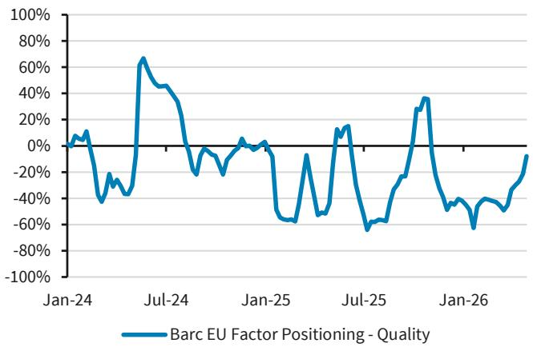

line

| Date   | Barc EU Factor Positioning - Quality |
|--------|--------------------------------------|
| Jan-24 | ~0%                                  |
| Jul-24 | ~70%                                 |
| Jan-25 | ~-60%                                |
| Jul-25 | ~-60%                                |
| Jan-26 | ~-40%                                |

Source: BARC

FIGURE 86. BARC EU Quality – Crowding   
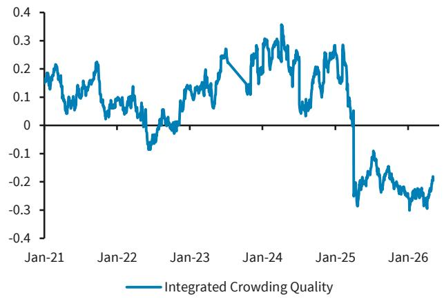

line

| Date   | Integrated Crowding Quality |
|--------|------------------------------|
| Jan-21 | 0.2                          |
| Jan-22 | 0.1                          |
| Jan-23 | 0.2                          |
| Jan-24 | 0.3                          |
| Jan-25 | -0.3                         |
| Jan-26 | -0.2                         |

Source: MSCI, BARC

FIGURE 87. BARC EU Quality - Performance vs past   
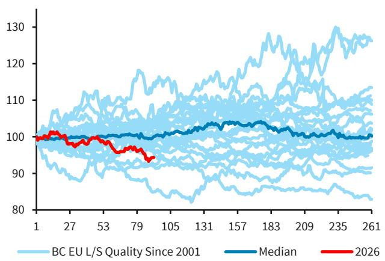

line

| X Value | BC EU L/S Quality Since 2001 | Median | 2026 |
|---------|-------------------------------|--------|------|
| 1       | ~100                          | ~100   | ~100 |
| 27      | ~105                          | ~100   | ~100 |
| 53      | ~110                          | ~100   | ~100 |
| 79      | ~115                          | ~100   | ~98  |
| 105     | ~118                          | ~100   | ~95  |
| 131     | ~120                          | ~100   | ~94  |
| 157     | ~122                          | ~100   | ~93  |
| 183     | ~125                          | ~100   | ~92  |
| 209     | ~128                          | ~100   | ~91  |
| 235     | ~130                          | ~100   | ~90  |
| 261     | ~132                          | ~100   | ~89  |

Source: Bloomberg, LSEG Data & Analytics, BARC

FIGURE 88. BARC EU Quality - Relative price momentum vs earnings momentum   
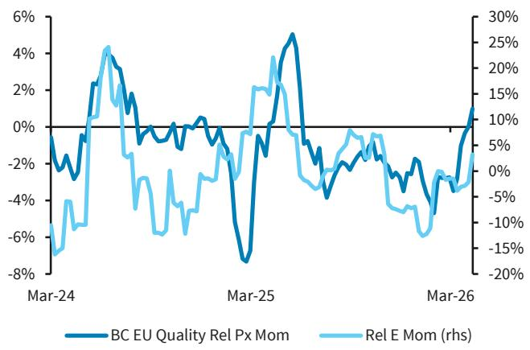

line

| Date   | BC EU Quality Rel Px Mom | Rel E Mom (rhs) |
|--------|--------------------------|-----------------|
| Mar-24 | -2%                      | -7%             |
| Mar-25 | 5%                       | 2%              |
| Mar-26 | 1%                       | -5%             |

Source: Bloomberg, BARC

FIGURE 89. BARC EU Quality - Relative 12m F PE   
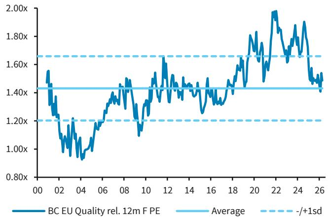

line

| Year | BC EU Quality rel. 12m F PE |
|------|-----------------------------|
| 00   | 1.50x                       |
| 02   | 1.30x                       |
| 04   | 0.90x                       |
| 06   | 1.20x                       |
| 08   | 1.40x                       |
| 10   | 1.10x                       |
| 12   | 1.60x                       |
| 14   | 1.40x                       |
| 16   | 1.30x                       |
| 18   | 1.50x                       |
| 20   | 1.70x                       |
| 22   | 2.00x                       |
| 24   | 1.80x                       |
| 26   | 1.50x                       |

Source: IBES, LSEG Data & Analytics, BARC

FIGURE 90. BARC EU Quality - Relative P/Book vs RoE   
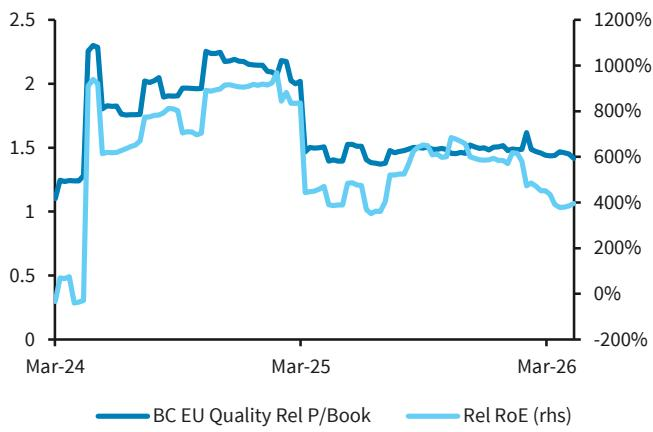

line

| Date   | BC EU Quality Rel P/Book | Rel RoE (rhs) |
|--------|--------------------------|---------------|
| Mar-24 | 1.3                      | 0.5           |
| Mar-25 | 2.2                      | 1.5           |
| Mar-26 | 1.5                      | 1.0           |

Source: Bloomberg, BARC

FIGURE 91. BARC EU Quality - Sector allocation vs STOXX 600   
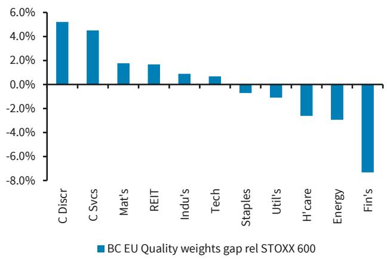

bar

BC EU Quality weights gap rel STOXX 600
| Company | BC EU Quality weights gap rel STOXX 600 (%) |
| :--- | :--- |
| C Discr | 5.2 |
| C Svcs | 4.5 |
| Mat's | 1.8 |
| REIT | 1.7 |
| Indu's | 1.0 |
| Tech | 0.7 |
| Staples | -0.5 |
| Util's | -1.2 |
| H'care | -2.8 |
| Energy | -3.2 |
| Fin's | -7.5 |

Source: Bloomberg, BARC

FIGURE 92. BARC EU Quality - Sector allocation   
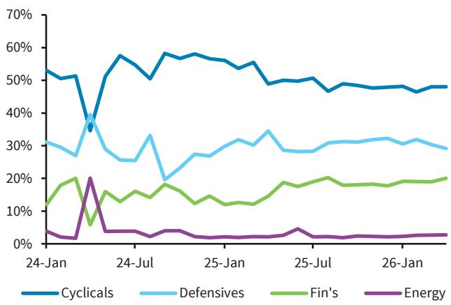

line

| Date     | Cyclicals | Defensives | Fin's | Energy |
| -------- | --------- | ---------- | ----- | ------ |
| 24-Jan   | 52%       | 30%        | 12%   | 4%     |
| 24-Jul   | 58%       | 25%        | 15%   | 20%    |
| 25-Jan   | 56%       | 28%        | 13%   | 3%     |
| 25-Jul   | 50%       | 30%        | 18%   | 4%     |
| 26-Jan   | 48%       | 30%        | 19%   | 3%     |

Source: Bloomberg, BARC

# BARC EU Size (Small Caps)

FIGURE 93. BARC EU Small Caps - Dynamic allocation   
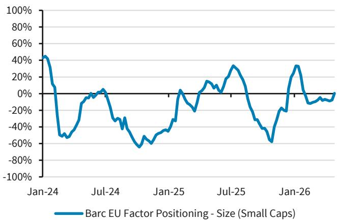

line

| Date   | Barc EU Factor Positioning - Size (Small Caps) |
|--------|--------------------------------------------------|
| Jan-24 | 40%                                              |
| Jul-24 | -20%                                             |
| Jan-25 | -60%                                             |
| Jul-25 | 30%                                              |
| Jan-26 | -20%                                             |

Source: BARC

FIGURE 94. BARC EU Small Caps – Crowding   
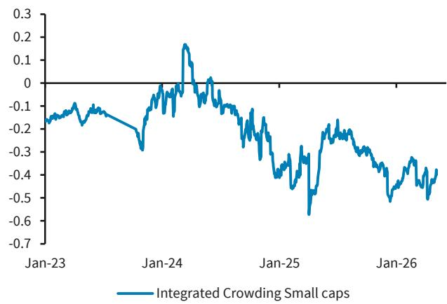

line

| Date   | Integrated Crowding Small caps |
|--------|--------------------------------|
| Jan-23 | -0.15                          |
| Jan-24 | 0.18                           |
| Jan-25 | -0.55                          |
| Jan-26 | -0.45                          |

Source: MSCI, BARC

FIGURE 95. BARC EU Size - Performance vs past   
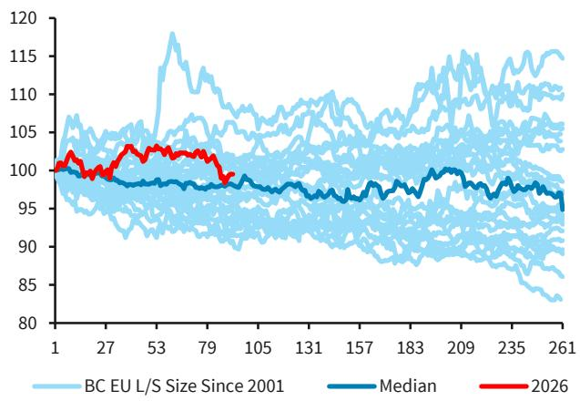

line

| Year | Median | BC EU L/S Size Since 2001 |
|------|--------|---------------------------|
| 1    | 100    | 100                       |
| 27   | 99     | 105                       |
| 53   | 98     | 118                       |
| 79   | 97     | 105                       |
| 105  | 96     | 108                       |
| 131  | 95     | 107                       |
| 157  | 94     | 109                       |
| 183  | 93     | 110                       |
| 209  | 92     | 115                       |
| 235  | 91     | 116                       |
| 261  | 90     | 115                       |

Size = Long Large Caps/Short Small Caps   
Source: Bloomberg, BARC

FIGURE 96. BARC EU Small Caps - Relative price momentum vs earnings momentum   
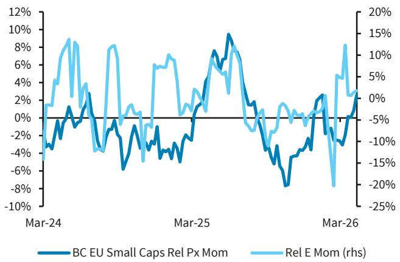

line

| Date   | BC EU Small Caps Rel Px Mom | Rel E Mom (rhs) |
|--------|-----------------------------|-----------------|
| Mar-24 | -4%                         | 8%              |
| Mar-25 | 9%                          | 15%             |
| Mar-26 | -8%                         | -20%            |

Source: Bloomberg, BARC

FIGURE 97. BARC EU Small Caps - Relative 12m F PE   
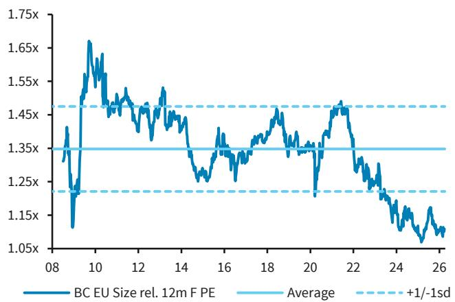

line

| Year | BC EU Size rel. 12m F PE |
|------|--------------------------|
| 08   | 1.35x                    |
| 10   | 1.65x                    |
| 12   | 1.45x                    |
| 14   | 1.45x                    |
| 16   | 1.35x                    |
| 18   | 1.45x                    |
| 20   | 1.35x                    |
| 22   | 1.45x                    |
| 24   | 1.25x                    |
| 26   | 1.15x                    |

Source: IBES, LSEG Data & Analytics, BARC

FIGURE 98. BARC EU Small Caps - Relative P/Book vs RoE   
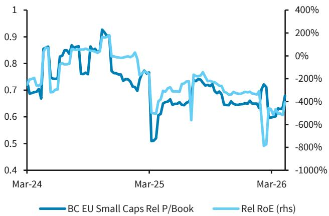

line

| Date   | BC EU Small Caps Rel P/Book | Rel RoE (rhs) |
|--------|-----------------------------|---------------|
| Mar-24 | 0.7                         | 0%            |
| Mar-25 | 0.5                         | -800%         |
| Mar-26 | 0.6                         | -400%         |

Source: Bloomberg, BARC

FIGURE 99. BARC EU Small Caps - Sector allocation vs STOXX 600   
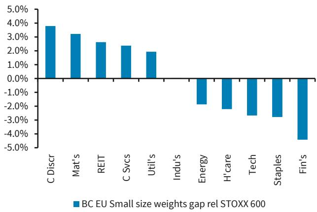

bar

BC EU Small size weights gap rel STOXX 600
| Company | BC EU Small size weights gap rel STOXX 600 (%) |
| :--- | :--- |
| C Discr | 3.8 |
| Mat's | 3.2 |
| REIT | 2.6 |
| C Svcs | 2.4 |
| Util's | 1.9 |
| Indu's | -0.1 |
| Energy | -1.8 |
| H'care | -2.1 |
| Tech | -2.7 |
| Staples | -2.9 |
| Fin's | -4.5 |

Source: Bloomberg, BARC

FIGURE 100. BARC EU Small Caps - Sector allocation   
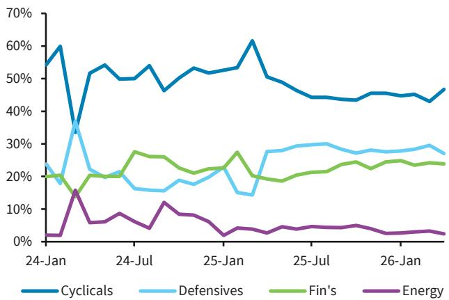

line

| Date    | Cyclicals | Defensives | Fin's | Energy |
|---------|-----------|------------|-------|--------|
| 24-Jan  | 60%       | 25%        | 20%   | 5%     |
| 24-Jul  | 50%       | 15%        | 25%   | 10%    |
| 25-Jan  | 60%       | 15%        | 20%   | 5%     |
| 25-Jul  | 45%       | 30%        | 20%   | 5%     |
| 26-Jan  | 45%       | 30%        | 25%   | 5%     |

Source: Bloomberg, BARC

# BARC EU Momentum

FIGURE 101. BARC EU Momentum - Dynamic allocation   
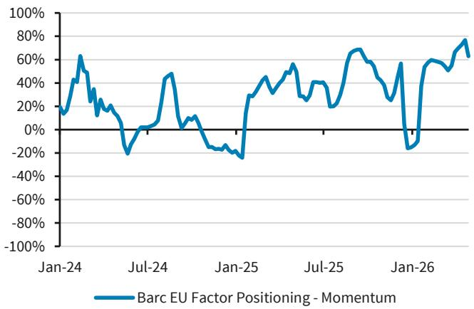

line

| Date   | Barc EU Factor Positioning - Momentum |
|--------|----------------------------------------|
| Jan-24 | ~15%                                   |
| Jul-24 | ~-20%                                  |
| Jan-25 | ~-30%                                  |
| Jul-25 | ~70%                                   |
| Jan-26 | ~-20%                                  |

Source: BARC

FIGURE 102. BARC EU Momentum – Crowding   
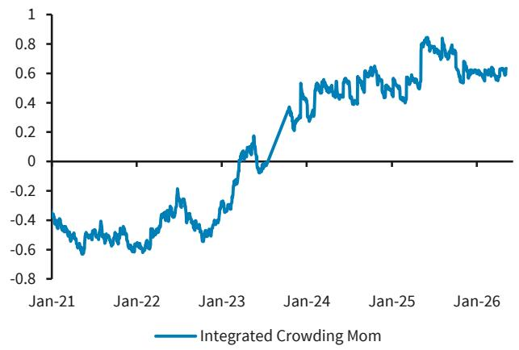

line

| Date   | Integrated Crowding Mom |
|--------|--------------------------|
| Jan-21 | -0.4                     |
| Jan-22 | -0.6                     |
| Jan-23 | -0.2                     |
| Jan-24 | 0.4                      |
| Jan-25 | 0.6                      |
| Jan-26 | 0.6                      |

Source: MSCI, BARC

FIGURE 103. BARC EU Momentum - Performance vs past   
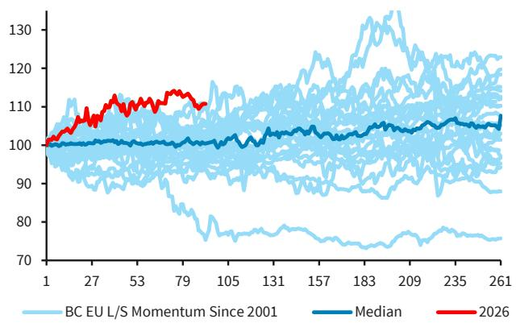

line

| X Value | BC EU L/S Momentum Since 2001 | Median | 2026 |
|---------|-------------------------------|--------|------|
| 1       | ~100                          | ~100   | ~100 |
| 27      | ~98                           | ~100   | ~108 |
| 53      | ~95                           | ~100   | ~112 |
| 79      | ~85                           | ~100   | ~114 |
| 105     | ~75                           | ~100   | ~112 |
| 131     | ~78                           | ~102   | ~110 |
| 157     | ~76                           | ~103   | ~108 |
| 183     | ~77                           | ~104   | ~108 |
| 209     | ~78                           | ~105   | ~108 |
| 235     | ~79                           | ~106   | ~108 |
| 261     | ~78                           | ~106   | ~108 |

Source: Bloomberg, LSEG Data & Analytics, BARC

FIGURE 104. BARC EU Momentum - Relative price momentum vs earnings momentum   

line

| Date   | BC EU Momentum Rel Px Mom | Rel E Mom (rhs) |
|--------|---------------------------|-----------------|
| Jan-24 | ~5%                       | ~0%             |
| Jan-25 | ~9%                       | ~3%             |
| Jan-26 | ~4%                       | ~30%            |

Source: IBES, LSEG Data & Analytics, BARC

FIGURE 105. BARC EU Momentum - Relative 12m F PE   
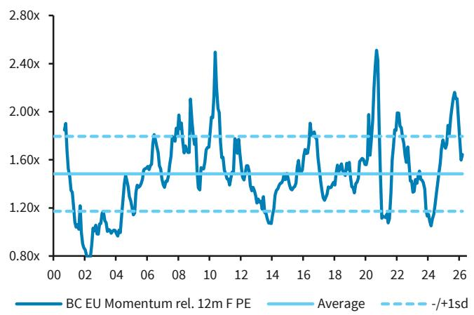

line

| Year | BC EU Momentum rel. 12m F PE |
|------|------------------------------|
| 00   | ~1.90x                       |
| 02   | ~0.80x                       |
| 04   | ~1.20x                       |
| 06   | ~1.50x                       |
| 08   | ~1.70x                       |
| 10   | ~2.40x                       |
| 12   | ~1.50x                       |
| 14   | ~1.30x                       |
| 16   | ~1.70x                       |
| 18   | ~1.50x                       |
| 20   | ~2.50x                       |
| 22   | ~1.20x                       |
| 24   | ~1.50x                       |
| 26   | ~2.10x                       |

Source: IBES, LSEG Data & Analytics, BARC

FIGURE 106. BARC EU Momentum - Relative P/Book vs RoE   
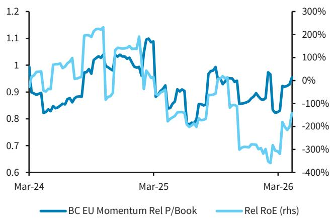

line

| Date   | BC EU Momentum Rel P/Book | Rel RoE (rhs) |
|--------|---------------------------|---------------|
| Mar-24 | ~0.9                      | ~0%           |
| Mar-25 | ~1.1                      | ~200%         |
| Mar-26 | ~0.9                      | ~-400%        |

Source: Bloomberg, BARC

FIGURE 107. BARC EU Momentum - Sector allocation vs STOXX 600   
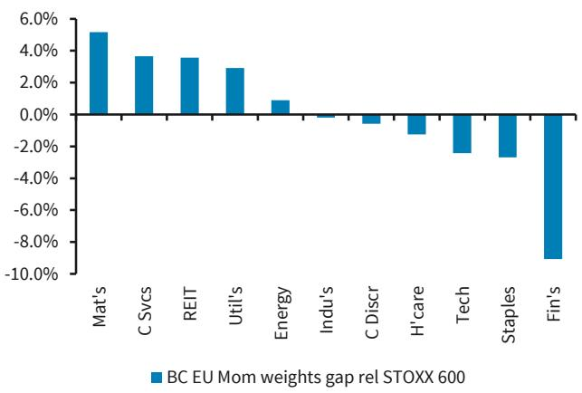

bar

| Category | BC EU Mom weights gap rel STOXX 600 |
| -------- | ------------------------------------ |
| Mat's    | 5.0%                                 |
| C Svcs   | 3.5%                                 |
| REIT     | 3.5%                                 |
| Util's   | 2.5%                                 |
| Energy   | 1.0%                                 |
| Indu's   | -0.5%                                |
| C Discr  | -1.0%                                |
| H'care   | -1.5%                                |
| Tech     | -2.0%                                |
| Staples  | -2.5%                                |
| Fin's    | -9.0%                                |

Source: Bloomberg, BARC

FIGURE 108. BARC EU Momentum - Sector allocation   
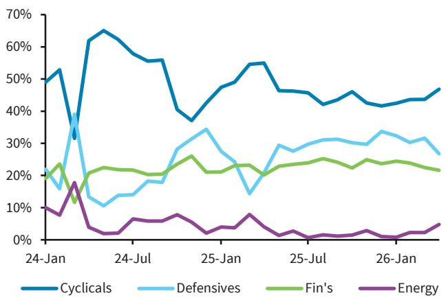

line

| Date     | Cyclicals | Defensives | Fin's | Energy |
| -------- | --------- | ---------- | ----- | ------ |
| 24-Jan   | 50%       | 15%        | 20%   | 10%    |
| 24-Jul   | 65%       | 10%        | 22%   | 5%     |
| 25-Jan   | 40%       | 35%        | 25%   | 5%     |
| 25-Jul   | 45%       | 30%        | 25%   | 0%     |
| 26-Jan   | 45%       | 30%        | 25%   | 5%     |

Source: Bloomberg, BARC

# BARC EU Low Volatility

FIGURE 109. BARC EU Low Vol - Dynamic allocation   
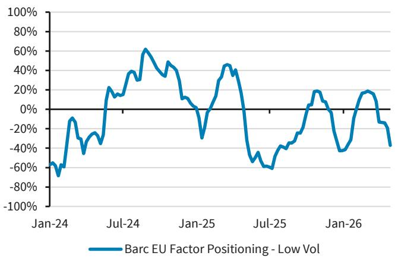

line

| Date   | Barc EU Factor Positioning - Low Vol |
|--------|--------------------------------------|
| Jan-24 | -60%                                 |
| Jul-24 | 60%                                  |
| Jan-25 | -30%                                 |
| Jul-25 | -60%                                 |
| Jan-26 | -40%                                 |

Source: BARC

FIGURE 110. BARC EU Low Vol – Crowding   
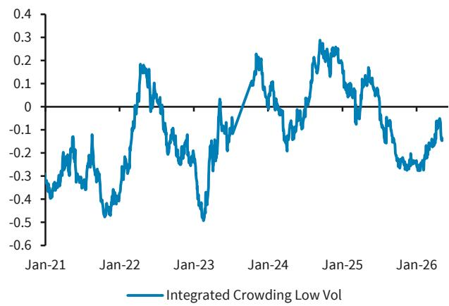

line

| Date   | Integrated Crowding Low Vol |
|--------|-----------------------------|
| Jan-21 | -0.3                        |
| Jan-22 | -0.5                        |
| Jan-23 | -0.5                        |
| Jan-24 | 0.2                         |
| Jan-25 | 0.3                         |
| Jan-26 | -0.1                        |

Source: MSCI, BARC

FIGURE 111. BARC EU Low Vol - Performance vs past   
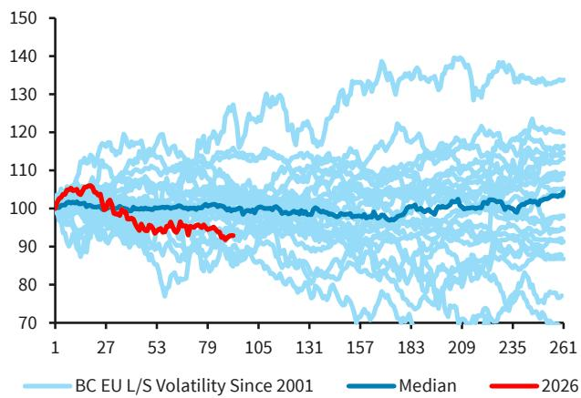

line

| Day | BC EU L/S Volatility Since 2001 | Median | 2026 |
|-----|----------------------------------|--------|------|
| 1   | ~100                             | ~100   | ~100 |
| 27  | ~105                             | ~100   | ~105 |
| 53  | ~108                             | ~100   | ~102 |
| 79  | ~110                             | ~100   | ~98  |
| 105 | ~115                             | ~100   | ~95  |
| 131 | ~120                             | ~100   | ~98  |
| 157 | ~125                             | ~100   | ~100 |
| 183 | ~130                             | ~100   | ~102 |
| 209 | ~135                             | ~100   | ~104 |
| 235 | ~138                             | ~100   | ~106 |
| 261 | ~140                             | ~105   | ~108 |

Source: Bloomberg, LSEG Data & Analytics, BARC

FIGURE 112. BARC EU Low Vol - Relative price momentum vs earnings momentum   
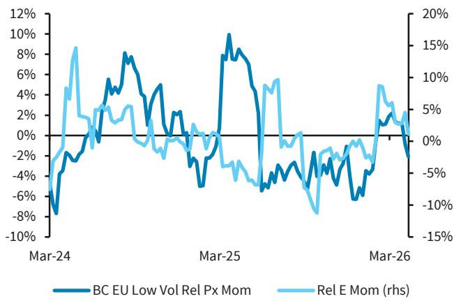

line

| Date   | BC EU Low Vol Rel Px Mom | Rel E Mom (rhs) |
|--------|--------------------------|-----------------|
| Mar-24 | -8%                      | -6%             |
| Mar-25 | 10%                      | 5%              |
| Mar-26 | -2%                      | -10%            |

Source: Bloomberg, BARC

FIGURE 113. BARC EU Low Vol - Relative 12m F PE   
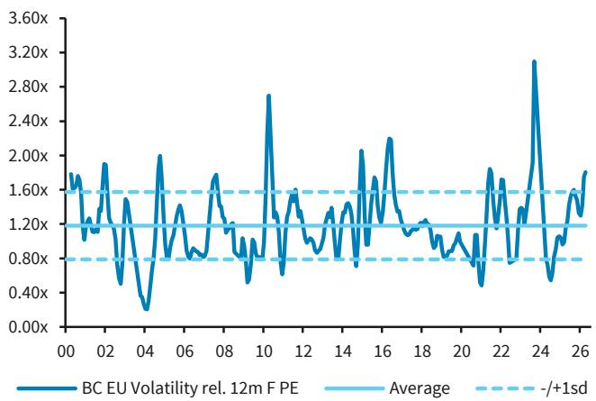

line

| Year | BC EU Volatility rel. 12m F PE |
|------|--------------------------------|
| 00   | ~1.60x                         |
| 02   | ~1.20x                         |
| 04   | ~0.30x                         |
| 06   | ~1.50x                         |
| 08   | ~1.70x                         |
| 10   | ~2.80x                         |
| 12   | ~1.60x                         |
| 14   | ~1.40x                         |
| 16   | ~2.30x                         |
| 18   | ~1.20x                         |
| 20   | ~1.00x                         |
| 22   | ~1.80x                         |
| 24   | ~3.20x                         |
| 26   | ~1.70x                         |

Source: IBES, LSEG Data & Analytics, BARC

FIGURE 114. BARC EU Low Vol - Relative P/Book vs RoE   
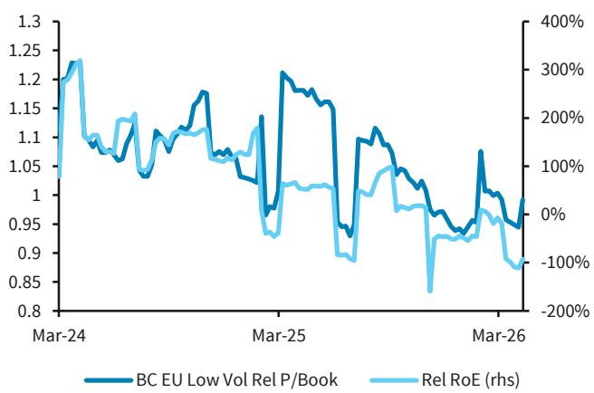

line

| Date   | BC EU Low Vol Rel P/Book | Rel RoE (rhs) |
|--------|--------------------------|---------------|
| Mar-24 | 1.25                     | 1.15          |
| Mar-25 | 1.20                     | 1.05          |
| Mar-26 | 0.95                     | -100%         |

Source: Bloomberg, BARC

FIGURE 115. BARC EU Low Vol - Sector allocation vs STOXX 600   

bar

BC EU Low Vol weights gap rel STOXX 600
| Sector | BC EU Low Vol weights gap rel STOXX 600 (%) |
| :--- | :--- |
| C Svcs | 4.2 |
| C Discr | 3.0 |
| Util's | 2.5 |
| REIT | 2.1 |
| Tech | 0.5 |
| Mat's | 0.2 |
| Indu's | -0.1 |
| H'care | -1.8 |
| Staples | -2.5 |
| Energy | -2.7 |
| Fin's | -6.5 |

FIGURE 116. BARC EU Low Vol - Sector allocation   
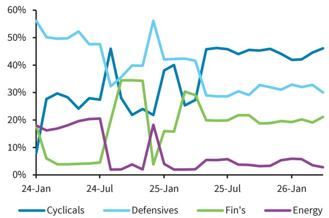

line

| Date    | Cyclicals | Defensives | Fin's | Energy |
|---------|-----------|------------|-------|--------|
| 24-Jan  | 18%       | 55%        | 15%   | 17%    |
| 24-Jul  | 28%       | 32%        | 35%   | 20%    |
| 25-Jan  | 40%       | 55%        | 15%   | 18%    |
| 25-Jul  | 45%       | 28%        | 20%   | 5%     |
| 26-Jan  | 45%       | 30%        | 20%   | 5%     |

FIGURE 117. BARC EU Low Vol - Sector allocation vs STOXX 600   
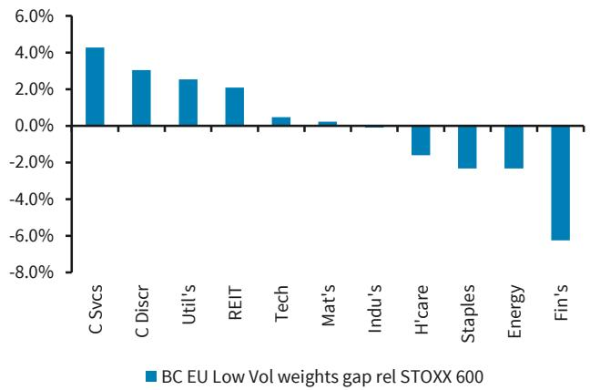

bar

BC EU Low Vol weights gap rel STOXX 600
| Sector | BC EU Low Vol weights gap rel STOXX 600 (%) |
| :--- | :--- |
| C Svcs | 4.2 |
| C Discr | 3.1 |
| Util's | 2.5 |
| REIT | 2.1 |
| Tech | 0.5 |
| Mat's | 0.2 |
| Indu's | -0.1 |
| H'care | -1.8 |
| Staples | -2.5 |
| Energy | -2.7 |
| Fin's | -6.5 |

FIGURE 118. BARC EU Low Vol - Sector allocation   
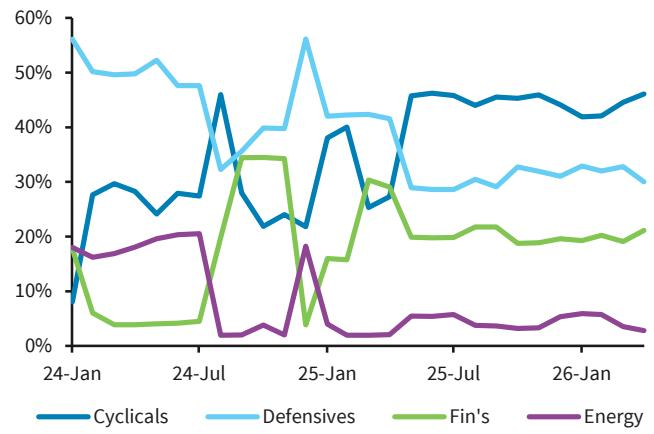

line

| Date    | Cyclicals | Defensives | Fin's | Energy |
|---------|-----------|------------|-------|--------|
| 24-Jan  | 10%       | 55%        | 15%   | 15%    |
| 24-Jul  | 45%       | 30%        | 35%   | 20%    |
| 25-Jan  | 40%       | 55%        | 15%   | 18%    |
| 25-Jul  | 45%       | 30%        | 20%   | 5%     |
| 26-Jan  | 45%       | 30%        | 20%   | 5%     |

Source: Bloomberg, BARC   
Source: Bloomberg, BARC

# Analyst(s) Certification(s):

We, Rex Feng, Magesh Kumar Chandrasekaran, CFA, Venu Krishna, CFA, Emmanuel Cau, CFA, Riddhiman Dass and Emmanuel Makonga, hereby certify (1) that the views expressed in this research report accurately reflect our personal views about any or all of the subject securities or issuers referred to in this research report and (2) no part of our compensation was, is or will be directly or indirectly related to the specific recommendations or views expressed in this research report.

# Important Disclosures:

BARC is produced by the Investment Bank of BARC Bank PLC and its affiliates (collectively and each individually, "BARC"). All authors contributing to this research report are Research Analysts unless otherwise indicated. The publication date at the top of the report reflects the local time where the report was produced and may differ from the release date provided in GMT.

# Availability of Disclosures:

Where any companies are the subject of this research report, for current important disclosures regarding those companies please refer to https://publicresearch.BARC.com or alternatively send a written request to: BARC Compliance, 745 Seventh Avenue, 13th Floor, New York, NY 10019 or call +1-212-526-1072.

The analysts responsible for preparing this research report have received compensation based upon various factors including the firm's total revenues, a portion of which is generated by investment banking activities, the profitability and revenues of the Markets business and the potential interest of the firm's investing clients in research with respect to the asset class covered by the analyst.

Research analysts employed outside the US by affiliates of BARC Capital Inc. are not registered/qualified as research analysts with FINRA. Such non-US research analysts may not be associated persons of BARC Capital Inc., which is a FINRA member, and therefore may not be subject to FINRA Rule 2241 restrictions on communications with a subject company, public appearances and trading securities held by a research analyst's account.

Analysts regularly conduct site visits to view the material operations of covered companies, but BARC policy prohibits them from accepting payment or reimbursement by any covered company of their travel expenses for such visits.

BARC Department produces various types of research including, but not limited to, fundamental analysis, equity-linked analysis, quantitative analysis, and trade ideas. Recommendations contained in one type of BARC may differ from those contained in other types of BARC, whether as a result of differing time horizons, methodologies, or otherwise.

In order to access BARC Statement regarding Research Dissemination Policies and Procedures, please refer to https://publicresearch.BARC.com/S/RD.htm. In order to access BARC Conflict Management Policy Statement, please refer to: https://publicresearch.BARC.com/S/CM.htm.

# Other Material Conflicts

One or more of the authoring research analysts (and/or a member of the analyst's household) has long positions in index funds and/or ETFs that are designed to passively track the performance of the S&P 500, Euro Stoxx, FTSE 100, and/or Stoxx 600 Indices.

Unless otherwise indicated, prices are sourced from Bloomberg and reflect the closing price in the relevant trading market, which may not be the last available closing price at the time of publication.

# Risk Disclosure(s)

Master limited partnerships (MLPs) are pass-through entities structured as publicly listed partnerships. For tax purposes, distributions to MLP unit holders may be treated as a return of principal. Investors should consult their own tax advisors before investing in MLP units.

# Disclosure(s) regarding Information Sources

The MSCI sourced information is the exclusive property of MSCI Inc. (MSCI). Without prior written permission of MSCI, this information and any other MSCI intellectual property may not be reproduced, redisseminated or used to create any financial products, including any indices. This information is provided on an “as is” basis. The user assumes the entire risk of any use made of this information. MSCI, its affiliates and any third party involved in, or related to, computing or compiling the information hereby expressly disclaim all warranties of originality, accuracy, completeness, merchantability or fitness for a particular purpose with respect to any of this information. Without limiting any of the foregoing, in no event shall MSCI, any of its affiliates or any third party involved in, or related to, computing or compiling the information have any liability for any damages of any kind. MSCI and the MSCI indexes are services marks of MSCI and its affiliates.

Bloomberg $^{\textregistered}$ is a trademark and service mark of Bloomberg Finance L.P. and its affiliates (collectively “Bloomberg”) and the Bloomberg Indices are trademarks of Bloomberg. Bloomberg or Bloomberg’s licensors own all proprietary rights in the Bloomberg Indices. Bloomberg does not approve or endorse this material, or guarantee the accuracy or completeness of any information herein, or make any warranty, express or implied, as to the results to be obtained therefrom and, to the maximum extent allowed by law, Bloomberg shall have no liability or responsibility for injury or damages arising in connection therewith.

# Explanation of the U.S. Equity Strategy sector rating system:

Positive Outlook: We recommend clients increase their level of portfolio exposure to the sector (as defined below)

Neutral Outlook: We recommend clients maintain their current level of portfolio exposure to the sector (as defined below)

Negative Outlook: We recommend clients decrease their level of portfolio exposure to the sector (as defined below)

# Sector Definitions:

Our custom sector definitions are derived from GICS sectors as follows:

No changes to GICS Level 1 for Energy, Consumer Staples, Industrials, Real Estate, Healthcare, Utilities, Materials, and Financials.

"Big Tech": Seven stocks - AAPL, AMZN, GOOG, GOOGL, META, MSFT, NVDA - have been removed from their corresponding GICS Level 1 sectors.

“Rest of Tech” is GICS Level 1 Information Technology with AAPL, MSFT, and NVDA excluded.

“Communication Services” is GICS Level 1 Communication Services with GOOG, GOOGL, and META excluded.

“Discretionary” is GICS Level 1 Consumer Discretionary with AMZN excluded.

# Explanation of the European Equity Strategy sector rating system:

Overweight (OW): The performance of the MSCI Europe sector is expected to outperform the MSCI Europe index in the next 3-6 months.

Marketweight (MW): The performance of the MSCI Europe sector is expected to perform in line with the MSCI Europe index in the next 3-6 months.

Underweight (UW): The performance of the MSCI Europe sector is expected to underperform the MSCI Europe index in the next 3-6 months.

# Guide to the BARC Fundamental Equity Research Rating System:

Our coverage analysts use a relative rating system in which they rate stocks as Overweight, Equal Weight or Underweight (see definitions below) relative to other companies covered by the analyst or a team of analysts that are deemed to be in the same industry (the "industry coverage universe").

In addition to the stock rating, we provide industry views which rate the outlook for the industry coverage universe as Positive, Neutral or Negative (see definitions below). A rating system using terms such as buy, hold and sell is not the equivalent of our rating system. Investors should carefully read the entire research report including the definitions of all ratings and not infer its contents from ratings alone.

# Stock Rating

Overweight - The stock is expected to outperform the unweighted expected total return of the industry coverage universe over a 12-month investment horizon.

Equal Weight - The stock is expected to perform in line with the unweighted expected total return of the industry coverage universe over a 12-month investment horizon.

Underweight - The stock is expected to underperform the unweighted expected total return of the industry coverage universe over a 12-month investment horizon.

Rating Suspended - The rating and target price have been suspended temporarily due to market events that made coverage impracticable or to comply with applicable regulations and/or firm policies in certain circumstances including where the Investment Bank of BARC Bank PLC is acting in an advisory capacity in a merger or strategic transaction involving the company.

# Industry View

Positive - industry coverage universe fundamentals/valuations are improving.

Neutral - industry coverage universe fundamentals/valuations are steady, neither improving nor deteriorating.

Negative - industry coverage universe fundamentals/valuations are deteriorating.

# Guide to the BARC Equity Factor View

Positive: We recommend increasing exposure to the factor.

Neutral: We recommend maintaining exposure to the factor.

Negative: We recommend decreasing exposure to the factor.

# Types of investment recommendations produced by BARC Equity Research:

In addition to any ratings assigned under BARC' formal rating systems, this publication may contain investment recommendations in the form of trade ideas, thematic screens, scorecards or portfolio recommendations that have been produced by analysts within Equity Research. Any such investment recommendations shall remain open until they are sUBSequently amended, rebalanced or closed in a future research report.

BARC may also re-distribute equity research reports produced by third-party research providers that contain recommendations that differ from and/or conflict with those published by BARC' Equity Research Department.

# Disclosure of other investment recommendations produced by BARC Equity Research:

BARC Equity Research may have published other investment recommendations in respect of the same securities/instruments recommended in this research report during the preceding 12 months. To view all investment recommendations published by BARC Equity Research in the preceding 12 months please refer to https://live.barcap.com/go/research/Recommendations.

# Legal entities involved in producing BARC:

BARC Bank PLC (BARC, UK)

BARC Capital Inc. (BCI, US)

BARC Bank Ireland PLC, Frankfurt Branch (BBI, Frankfurt)

BARC Bank Ireland PLC, Paris Branch (BBI, Paris)

BARC Bank Ireland PLC, Milan Branch (BBI, Milan)

BARC Securities Japan Limited (BSJL, Japan)

BARC Bank PLC, Hong Kong Branch (BARC Bank, Hong Kong)

BARC Bank Mexico, S.A. (BBMX, Mexico)

BARC Capital Casa de Bolsa, S.A. de C.V. (BCCB, Mexico)

BARC Securities (India) Private Limited (BSIPL, India)

BARC Bank PLC, Singapore Branch (BARC Bank, Singapore)

BARC Bank PLC, DIFC Branch (BARC Bank, DIFC)

# Disclaimer:

This publication has been produced by BARC Department in the Investment Bank of BARC Bank PLC and/or one or more of its affiliates (collectively and each individually, "BARC").

It has been prepared for institutional investors and not for retail investors. It has been distributed by one or more BARC affiliated legal entities listed below or by an independent and non-affiliated third-party entity (as may be communicated to you by such third-party entity in its communications with you). It is provided for information purposes only, and BARC makes no express or implied warranties, and expressly disclaims all warranties of merchantability or fitness for a particular purpose or use with respect to any data included in this publication. To the extent that this publication states on the front page that it is intended for institutional investors and is not subject to all of the independence and disclosure standards applicable to debt research reports prepared for retail investors under U.S. FINRA Rule 2242, it is an “institutional debt research report” and distribution to retail investors is strictly prohibited. BARC also distributes such institutional debt research reports to various issuers, media, regulatory and academic organisations for their own internal informational news gathering, regulatory or academic purposes and not for the purpose of making investment decisions regarding any debt securities. Media organisations are prohibited from re-publishing any opinion or recommendation concerning a debt issuer or debt security contained in any BARC institutional debt research report. Any such recipients that do not want to continue receiving BARC institutional debt research reports should contact debtresearch@BARC.com. Unless clients have agreed to receive “institutional debt research reports” as required by US FINRA Rule 2242, they will not receive any such reports that may be co-authored by non-debt research analysts. Eligible clients may get access to such cross asset reports by contacting debtresearch@BARC.com. BARC will not treat unauthorized recipients of this report as its clients and accepts no liability for use by them of the contents which may not be suitable for their personal use. Prices shown are indicative and BARC is not offering to buy or sell or soliCiting offers to buy or sell any financial instrument.

Without limiting any of the foregoing and to the extent permitted by law, in no event shall BARC, nor any affiliate, nor any of their respective officers, directors, partners, or employees have any liability for (a) any special, punitive, indirect, or consequential damages; or (b) any lost profits, lost revenue, loss of anticipated savings or loss of opportunity or other financial loss, even if notified of the possibility of such damages, arising from any use of this publication or its contents.

Other than disclosures relating to BARC, the information contained in this publication (including third-party data) has been obtained from sources that BARC believes to be reliable, but BARC does not represent or warrant that it is accurate or complete. Third-party data, including third-party forecasts and predictions, is provided for information purposes only, has not been adopted or endorsed by BARC, and does not represent the views or opinions of BARC. Presentations by Third-Party Speakers: Any views or opinions expressed by third-party speakers during a BARC-hosted event are solely those of the speaker and do not represent the views or opinions of BARC. BARC is not responsible for, and makes no warranties whatsoever as to, the information or opinions contained in any written, electronic, audio or video presentations by any third-party speakers, and such presentations have not been adopted or endorsed by BARC and do not represent the views or opinions of BARC. Content from third-party presentations is provided for information purposes only and has not been independently verified by BARC for its accuracy or completeness.

The views in this publication are solely and exclusively those of the authoring analyst(s) and are subject to change, and BARC has no obligation to update its opinions or the information in this publication. Unless otherwise disclosed herein, the analysts who authored this report have not received any compensation from the subject companies in the past 12 months. If this publication contains recommendations, they are general recommendations that were prepared independently of any other interests, including those of BARC and/or its affiliates, and/or the subject companies. This publication does not contain personal investment recommendations or investment advice or take into account the individual financial circumstances or investment objectives of the clients who receive it. BARC is not a fiduciary to any recipient of this publication. The securities and other investments discussed herein may not be suitable for all investors and may not be available for purchase in all jurisdictions. The United States imposed sanctions on certain Chinese companies (https://ofac.treasury.gov/sanctions-programs-and-country-information/chinese-military-companies-sanctions), which may restrict U.S. persons from purchasing securities issued by those companies. Investors must independently evaluate the merits and risks of the investments discussed herein, including any sanctions restrictions that may apply, consult any independent advisors they believe necessary, and exercise independent judgment with regard to any investment decision. The value of and income from any investment may fluctuate from day to day as a result of changes in relevant economic markets (including changes in market liquidity). The information herein is not intended to predict actual results, which may differ sUBStantially from those reflected. Past performance is not necessarily indicative of future results. The information provided does not constitute a financial benchmark and should not be used as a submission or contribution of input data for the purposes of determining a financial benchmark.

This publication is not investment company sales literature as defined by Section 270.24(b) of the US Investment Company Act of 1940, nor is it intended to constitute an offer, promotion or recommendation of, and should not be viewed as marketing (including, without limitation, for the purposes of the UK Alternative Investment Fund Managers Regulations 2013 (SI 2013/1773) or AIFMD (Directive 2011/61)) or pre-marketing (including, without limitation, for the purposes of Directive (EU) 2019/1160) of the securities, products or issuers that are the subject of this report.

Third Party Distribution: Any views expressed in this communication are solely those of BARC and have not been adopted or endorsed by any third party distributor.

United Kingdom: This document is being distributed (1) only by or with the approval of an authorised person (BARC Bank PLC) or (2) to, and is directed at (a) persons in the United Kingdom having professional experience in matters relating to investments and who fall within the definition of "investment professionals" in Article 19(5) of the Financial Services and Markets Act 2000 (Financial Promotion) Order 2005 (the "Order"); or (b) high net worth companies, unincorporated associations and partnerships and trustees of high value trusts as described in Article 49(2) of the Order; or (c) other persons to whom it may otherwise lawfully be communicated (all such persons being "Relevant Persons"). Any investment or investment activity to which this communication relates is only available to and will only be engaged in with Relevant Persons. Any other persons who receive this communication should not rely on or act upon it. BARC Bank PLC is authorised by the Prudential Regulation Authority and regulated by the Financial Conduct Authority and the Prudential Regulation Authority and is a member of the London Stock Exchange.

European Economic Area (“EEA”): This material is being distributed to any “Authorised User” located in a Restricted EEA Country by BARC Bank Ireland PLC. The Restricted EEA Countries are Austria, Bulgaria, Estonia, Finland, Hungary, Iceland, Liechtenstein, Lithuania, Luxembourg, Malta, Portugal, Romania, Slovakia and Slovenia. For any other “Authorised User” located in a country of the European Economic Area, this material is being distributed by BARC Bank PLC. BARC Bank Ireland PLC is a bank authorised by the Central Bank of Ireland whose registered office is at 1 Molesworth Street, Dublin 2, Ireland. BARC Bank PLC is not registered in France with the Autorité des marchés financiers or the Autorité de contrôle prudentiel. Authorised User means each individual associated with the Client who is notified by the Client to BARC and authorised to use the Research Services. The Restricted EEA Countries will be amended if required.

Finland: Notwithstanding Finland's status as a Restricted EEA Country, Research Services may also be provided by BARC Bank PLC where permitted by the terms of its cross-border license.

Americas: The Investment Bank of BARC Bank PLC undertakes U.S. securities business in the name of its wholly owned sUBSidiary BARC Capital Inc., a FINRA and SIPC member. BARC Capital Inc., a U.S. registered broker/dealer, is distributing this material in the United States and, in connection therewith accepts responsibility for its contents. Any U.S. person wishing to effect a transaction in any security discussed herein should do so only by contacting a representative of BARC Capital Inc. in the U.S. at 745 Seventh Avenue, New York, New York 10019.

Non-U.S. persons should contact and execute transactions through a BARC Bank PLC branch or affiliate in their home jurisdiction unless local regulations permit otherwise.

This material is distributed in Canada by BARC Capital Canada Inc., a registered investment dealer, a Dealer Member of Canadian Investment Regulatory Organization (www.ciro.ca), and a Member of the Canadian Investor Protection Fund (CIPF).

This material is distributed in Mexico by BARC Bank Mexico, S.A. and/or BARC Capital Casa de Bolsa, S.A. de C.V. This material is distributed in the Cayman Islands and in the Bahamas by BARC Capital Inc., which it is not licensed or registered to conduct and does not conduct business in, from or within those jurisdictions and has not filed this material with any regulatory body in those jurisdictions.

Japan: This material is being distributed to institutional investors in Japan by BARC Securities Japan Limited. BARC Securities Japan Limited is a joint-stock company incorporated in Japan with registered office of 6-10-1 Roppongi, Minato-ku, Tokyo 106-6131, Japan. It is a sUBSidiary of BARC Bank PLC and a registered financial instruments firm regulated by the Financial Services Agency of Japan. Registered Number: Kanto Zaimukyokucho (kinsho) No. 143.

Asia Pacific (excluding Japan): BARC Bank PLC, Hong Kong Branch is distributing this material in Hong Kong as an authorised institution regulated by the Hong Kong Monetary Authority. Registered Office: 41/F, Cheung Kong Center, 2 Queen's Road Central, Hong Kong.

All Indian securities-related research and other equity research produced by BARC' Investment Bank are distributed in India by BARC Securities (India) Private Limited (BSIPL). BSIPL is a company incorporated under the Companies Act, 1956 having CIN U67120MH2006PTC161063. BSIPL is registered and regulated by the Securities and Exchange Board of India (SEBI) as a Research Analyst: INH000001519; Portfolio Manager INP000002585; Stock Broker INZ000269539 (member of NSE and BSE); Depository Participant with the National Securities & Depositories Limited (NSDL): DP ID: IN-DP-NSDL-478-2020; Investment Adviser: INA000000391. BSIPL is also registered as a Mutual Fund Advisor having AMFI ARN No. 53308. The registered office of BSIPL is at Nirlon Knowledge Park, 9th floor, Block B-6, Off. Western Express Highway, Goregaon (East), Mumbai – 400063, India. Telephone No: +91 22 61754000 Fax number: +91 22 61754099. Any other reports produced by BARC' Investment Bank are distributed in India by BARC Bank PLC, India Branch, an associate of BSIPL in India that is registered with Reserve Bank of India (RBI) as a Banking Company under the provisions of The Banking Regulation Act, 1949 (Regn No BOM43) and registered with SEBI as Merchant Banker (Regn No INM000002129) and also as Banker to the Issue (Regn No INBI00000950). BARC Investments and Loans (India) Limited, registered with RBI as Non Banking Financial Company (Regn No RBI CoR-07-00258), and BARC Wealth Trustees (India) Private Limited, registered with Registrar of Companies (CIN U93000MH2008PTC188438), are associates of BSIPL in India that are not authorised to distribute any reports produced by BARC' Investment Bank.

This material is distributed in Singapore by the Singapore Branch of BARC Bank PLC, a bank licensed in Singapore by the Monetary Authority of Singapore. For matters in connection with this material, recipients in Singapore may contact the Singapore branch of BARC Bank PLC, whose registered address is 10 Marina Boulevard, #23-01 Marina Bay Financial Centre Tower 2, Singapore 018983.

This material, where distributed to persons in Australia, is produced or provided by BARC Bank PLC.

This communication is directed at persons who are a “Wholesale Client” as defined by the Australian Corporations Act 2001.

Please note that the Australian Securities and Investments Commission (ASIC) has provided certain exemptions to BARC Bank PLC (BBPLC) under paragraph 911A(2)(I) of the Corporations Act 2001 from the requirement to hold an Australian financial services licence (AFSL) in respect of financial services provided to Australian Wholesale Clients, on the basis that BBPLC is authorised by the Prudential Regulation Authority of the United Kingdom (PRA) and regulated by the Financial Conduct Authority (FCA) of the United Kingdom and the PRA under United Kingdom laws. The United Kingdom has laws which differ from Australian laws. To the extent that this communication involves the provision of financial services by BBPLC to Australian Wholesale Clients, BBPLC relies on the relevant exemption from the requirement to hold an AFSL. Accordingly, BBPLC does not hold an AFSL.

This communication may be distributed to you by either: (i) BARC Bank PLC directly, (ii) Barrenjoey Markets Pty Limited (ACN 636 976 059, "Barrenjoey"), the holder of Australian Financial Services Licence (AFSL) 521800, a non-affiliated third party distributor, where clearly identified to you by Barrenjoey. Barrenjoey is not an agent of BARC Bank PLC or (iii) such other non-affiliated third-party distributor(s) as may be clearly identified to you. Such non-affiliated third-party distributor(s) are not agents of BARC Bank PLC.

This material, where distributed in New Zealand, is produced or provided by BARC Bank PLC. BARC Bank PLC is not registered, filed with or approved by any New Zealand regulatory authority. This material is not provided under or in accordance with the Financial Markets Conduct Act of 2013 (“FMCA”), and is not a disclosure document or “financial advice” under the FMCA. This material is distributed to you by either: (i) BARC Bank PLC directly or (ii) Barrenjoey Markets Pty Limited (“Barrenjoey”), a non-affiliated third party distributor, where clearly identified to you by Barrenjoey. Barrenjoey is not an agent of BARC Bank PLC. This material may only be distributed to “wholesale investors” that meet the “investment business”, “investment activity”, “large”, or “government agency” criteria specified in Schedule 1 of the FMCA.

Middle East: Nothing herein should be considered investment advice as defined in the Israeli Regulation of Investment Advisory, Investment Marketing and Portfolio Management Law, 1995 (“Advisory Law”). This document is being made to eligible clients (as defined under the Advisory Law) only. BARC Israeli branch previously held an investment marketing license with the Israel Securities Authority but it cancelled such license on 30/11/2014 as it solely provides its services to eligible clients pursuant to available exemptions under the Advisory Law, therefore a license with the Israel Securities Authority is not required. Accordingly, BARC does not maintain an insurance coverage pursuant to the Advisory Law.

This material is distributed in the United Arab Emirates (including the Dubai International Financial Centre) and Qatar by BARC Bank PLC. BARC Bank PLC in the Dubai International Financial Centre (Registered No. 0060) is regulated by the Dubai Financial Services Authority (DFSA). Principal place of business in the Dubai International Financial Centre: The Gate Village, Building 4, Level 4, PO Box 506504, Dubai, United Arab Emirates.

BARC Bank PLC-DIFC Branch, may only undertake the financial services activities that fall within the scope of its existing DFSA licence. Related financial products or services are only available to Professional Clients, as defined by the Dubai Financial Services Authority. BARC Bank PLC in the UAE is regulated by the Central Bank of the UAE and is licensed to conduct business activities as a branch of a commercial bank incorporated outside the UAE in Dubai (Licence No.: 13/1844/2008, Registered Office: Building No. 6, Burj Dubai Business Hub, Sheikh Zayed Road, Dubai City) and Abu Dhabi (Licence No.: 13/952/2008, Registered Office: Al Jazira Towers, Hamdan Street, PO Box 2734, Abu Dhabi). This material does not constitute or form part of any offer to issue or sell, or any solicitation of any offer to sUBScribe for or purchase, any securities or investment products in the UAE (including the Dubai International Financial Centre) and accordingly should not be construed as such. Furthermore, this information is being made available on the basis that the recipient acknowledges and understands that the entities and securities to which it may relate have not been approved, licensed by or registered with the UAE Central Bank, the Dubai Financial Services Authority or any other relevant licensing authority or governmental agency in the UAE. The content of this report has not been approved by or filed with the UAE Central Bank or Dubai Financial Services Authority. BARC Bank PLC in the Qatar Financial Centre (Registered No. 00018) is authorised by the Qatar Financial Centre Regulatory Authority (QFCRA). BARC Bank PLC-QFC Branch may only undertake the regulated activities that fall within the scope of its existing QFCRA licence. Principal place of business in Qatar: Qatar Financial Centre, Office 1002, 10th Floor, QFC Tower, Diplomatic Area, West Bay, PO Box 15891, Doha, Qatar. Related financial products or services are only available to Business Customers as defined by the Qatar Financial Centre Regulatory Authority.

Russia: This material is not intended for investors who are not Qualified Investors according to the laws of the Russian Federation as it might contain information about or description of the features of financial instruments not admitted for public offering and/or circulation in the Russian Federation and thus not eligible for non-Qualified Investors. If you are not a Qualified Investor according to the laws of the Russian Federation, please dispose of any copy of this material in your possession.

Sustainable Investing Related Research: There is currently no globally accepted framework or definition (legal, regulatory or otherwise) of, nor market consensus as to what constitutes a ‘sustainable’, ‘ESG’, ‘green’, ‘climate-friendly’ or an equivalent company, investment, strategy or consideration or what precise attributes are required to be eligible to be categorised by such terms. This means there are different ways to evaluate a company or an investment and so different values may be placed on certain sustainability credentials as well as adverse ESG-related impacts of companies and ESG controversies. The evolving nature of sustainable investing considerations, models and methodologies means it can be challenging to definitively and universally classify a company or investment under a sustainable investing label and there may be areas where such companies and investments could improve or where adverse ESG-related impacts or ESG controversies exist. The evolving nature of sustainable finance related regulations and the development of jurisdiction-specific regulatory criteria also means that there is likely to be a degree of divergence as to the interpretation of such terms in the market. We expect industry guidance, market practice, and regulations in this field to continue to evolve.

Any information, data, image, or other content including from a third party source contained, referred to herein or used for whatsoever purpose by BARC or a third party (“Information”), in relation to any actual or potential ‘ESG’, ‘sustainable’ or equivalent objective, issue, factor or consideration is not intended to be relied upon for ESG or sustainability classification, regulatory regime or industry initiative purposes (“ESG Regimes”), unless otherwise stated. Nothing in these materials, including any images included therein, is intended to convey, suggest or indicate that BARC considers or represents any product, service, person or body mentioned in these materials as meeting or qualifying for any ESG or sustainability classification, label or similar standards that may exist under ESG Regimes. BARC has not conducted any assessment of compliance with ESG Regimes. Parties are reminded to make their own assessments for these purposes.

IRS Circular 230 Prepared Materials Disclaimer: BARC does not provide tax advice and nothing contained herein should be construed to be tax advice. Please be advised that any discussion of U.S. tax matters contained herein (including any attachments) (i) is not intended or written to be used, and cannot be used, by you for the purpose of avoiding U.S. tax-related penalties; and (ii) was written to support the promotion or marketing of the transactions or other matters addressed herein. Accordingly, you should seek advice based on your particular circumstances from an independent tax advisor.

© Copyright BARC Bank PLC (2026). All rights reserved. No part of this publication may be reproduced or redistributed in any manner without the prior written permission of BARC. BARC Bank PLC is registered in England No. 1026167. Registered office 1 Churchill Place, London, E14 5HP. Additional information regarding this publication will be furnished upon request.