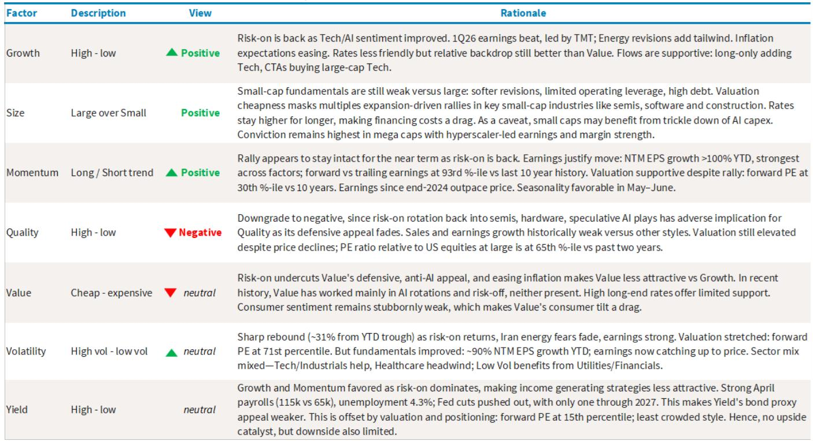
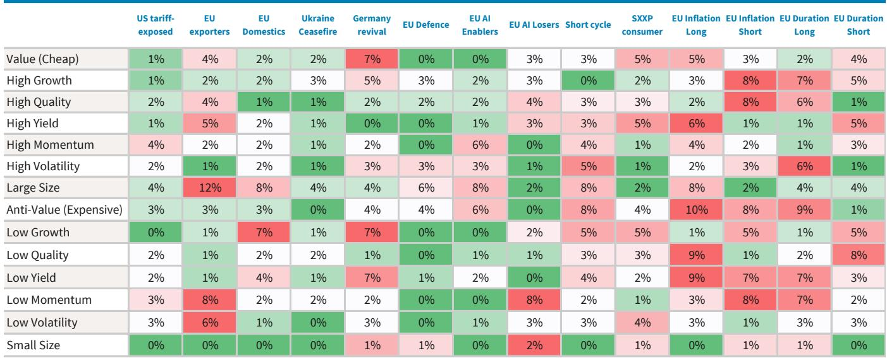

# 市场真正定价的不是盈利复苏，而是风格切换的不可逆性

五月，某外资投行发布了最新一期因子策略月报。这份报告的核心判断并非简单的“风险偏好回来了”，而是在美国市场明确转向了Growth与Momentum，同时下调了Value与Quality。在欧洲，则恰恰相反——Value成为最清晰的受益者。这种跨市场的因子立场分化，指向一个更深层的信号：投资者正在用因子配置投票，押注的不是单一方向的盈利复苏，而是两套不同的宏观叙事。

报告提供了一个值得反复咀嚼的时间窗口。美国市场在4月经历了一场接近完美的风险资产反弹——标普500单月涨幅超过9%，Big Tech涨幅超过16%，Momentum因子单月飙升18.6%。但真正重要的不是这些数字本身，而是这些数字背后所揭示的因子定价逻辑正在发生结构性偏移。

这份报告最值得关注的判断是：美国市场的风格切换已经不再是短期避险后的均值回归，而是一次由盈利质量、估值纪律与宏观叙事共同推动的因子再定价。它要求投资者重新思考，自己手中的组合到底是在押注“什么会涨”，还是在押注“什么叙事会主导下一阶段”。

## 1. 盈利超预期的质量比幅度更重要，而Big Tech正在改写基准

报告中最引人注目的数据之一是1Q26的EPS惊喜幅度。标普500整体EPS惊喜率达到18.0%，远超长期中位数的5.2%。但更值得拆解的不是平均值，而是结构。Big Tech的EPS惊喜率高达40.7%，是长期中位数7.2%的近六倍。这意味着什么？不是所有盈利超预期都拥有相同的定价权重。

当最大权重的板块以如此高的幅度持续超预期，它实际上在重新定义整个市场的盈利基准。其他板块即便表现不错，在相对框架下也会显得“不够好”。这正是报告所隐含的洞察：Big Tech的盈利质量正在从“超额收益”演变为“市场基准”，而这对Value和Quality等因子的相对吸引力构成了结构性压制。

报告还揭示了一个微妙但关键的信号：盈利增长正在跑赢营收增长。标普500整体EPS同比增长18.1%，而营收增长仅为8.6%。这意味着经营杠杆在改善，企业正在用更少的收入增长创造更多的利润。对于Growth因子而言，这是最有利的环境——市场愿意为这种效率提升支付溢价。但对于Quality因子而言，这反而构成了压力，因为Quality所依赖的防御性盈利特质，在效率驱动的增长环境中反而显得缺乏弹性。

## 2. Value在美国的困境不是周期性的，而是叙事性的

报告将美国Value下调至中性，给出的理由是“防御性、反AI的特征在风险偏好回归的市场中吸引力下降”。这一判断值得深入解读。Value的困境不是因为它便宜，而是因为它所代表的叙事——经济复苏、利率上行、传统周期回归——在当前市场环境中缺乏共鸣。

4月的数据印证了这一点。Value因子在过去一个月下跌了6.7%，而同期Momentum上涨了7.0%，Growth上涨了5.1%。这不是一次普通的轮动，而是市场在用资金投票，表达对“AI与科技主导”叙事的持续偏好。报告特别指出，Value的弱势始于3月底，恰好与Volatility和Momentum的反弹同步。这暗示了一个重要的因子交互关系：当市场从避险模式切换回风险偏好模式时，Value不仅不会受益，反而会成为资金流出的主要来源。

这里有一个报告没有完全展开的关键问题：如果美国Value的困境是叙事性的，那么什么样的宏观催化剂才能扭转这一局面？报告提到了“能源冲击”和“利率环境”作为潜在支撑，但也坦承，当前能源价格的回落和仅有一次降息的预期，并不足以构成Value反转的充分条件。这意味著，在可预见的未来，美国Value可能仍将处于一个“估值便宜但无人问津”的状态，直到市场找到一个足以挑战AI叙事的新故事。

## 3. Momentum的拥挤度正在成为欧洲市场的核心矛盾

与美国市场对Momentum的明确正面态度不同，报告对欧洲Momentum给出了中性评级。原因很直接：表现强劲，但越来越拥挤。报告原文的措辞是“the trade is increasingly crowded, arguing for managing exposure rather than adding”。这句话值得每一个因子投资者反复阅读。

拥挤度本身不是一个看空信号，但它意味着边际收益递减。当所有人都已经坐在船上的时候，任何新的买入力量都来自现有持仓者的重新配置，而不是增量资金的涌入。报告指出，欧洲Momentum的表现由AI驱动，但这一驱动力正在被充分定价。更关键的是，报告在欧洲市场上对Value给出了正面评级，理由是Value是“any broadening beyond Momentum”的最清晰受益者。这实际上是在暗示，欧洲市场的下一个阶段可能不是Momentum的延续，而是从Momentum向Value的扩散。

这一判断与美国市场形成了有趣的镜像。在美国，Growth和Momentum仍在主导；在欧洲，报告已经在为Value的回归做准备。这种跨市场的因子立场分化，反映了两个市场在宏观叙事、行业结构和资金流向上的根本差异。对于全球配置型投资者而言，这意味著不能简单地将美国市场的因子逻辑套用到欧洲。

## 4. 能源板块的盈利-价格背离隐藏着二阶效应

报告中最具洞察力但容易被忽略的图表，或许是展示各板块NTM EPS修正与估值扩张之间关系的图4。能源板块的NTM EPS增长了60%，但估值却压缩了40%，净回报仅为25%。换句话说，能源板块的盈利增长几乎完全被估值收缩所抵消。

这一背离至少包含两层含义。第一，市场对能源板块的盈利可持续性持怀疑态度。尽管地缘冲突推高了短期盈利，但投资者不愿为这种一次性收益支付更高的估值。第二，能源板块的估值压缩正在为其他板块提供相对的估值吸引力。当能源的盈利增长无法转化为股价上涨时，资金自然会流向那些盈利增长虽然较低、但估值扩张空间更大的板块，比如科技。

报告还提到，能源冲击的持续时间可能比市场预期的更短，因为初始库存充足。但报告同时警告，随着库存缓冲逐渐缩小，能源价格可能在今年晚些时候再次成为风险资产的头号威胁。这一时间差——短期能源冲击消退、中期能源风险累积——可能是理解当前因子配置窗口的关键。报告没有完全展开的是，如果能源价格在Q3或Q4再次飙升，当前对Growth和Momentum的正面立场是否需要重新评估。

## 5. 小盘股的困境揭示了多重驱动的脆弱性

报告在美国市场维持了对Large-over-Small的正面评级。理由很清晰：大盘股在盈利修正、经营杠杆和利润率动态上持续优于小盘股，而小盘股面临更高的杠杆率和更大的估值反转风险。

但真正值得关注的是报告在这一点上的论证逻辑。报告指出，小盘股的估值扩张主要集中在半导体、软件和建筑等板块。这意味着小盘股近期的反弹并非广泛的基本面改善，而是少数几个板块的估值驱动。一旦这些板块的估值扩张放缓或逆转，小盘股将面临不成比例的下跌风险。

报告在欧洲市场对小盘股的评级则更为谨慎，给出了中性。原因在于，尽管估值具有吸引力，但宏观动能放缓和欧洲央行的限制性政策可能限制近期的轮动空间。这种跨市场的立场差异再次说明，因子配置不能脱离宏观环境单独判断。小盘股在美国和欧洲面临不同的约束条件，简单套用“小盘股便宜所以应该买入”的逻辑是危险的。

## 6. 报告尚未完全回答的关键问题：Quality的防御溢价是否已被永久性侵蚀

报告将美国Quality下调至负面，理由是“风险偏好轮动侵蚀了其防御吸引力”。但这一判断背后隐藏着一个更根本的问题：Quality的防御溢价是否已经被结构性削弱。

从数据上看，Quality在过去一个月几乎持平，下跌约0.9%，延续了年初以来的疲弱表现。但更值得关注的是，在4月市场剧烈波动期间，Quality并未提供应有的下行保护。当市场在3月底因地缘冲突而大幅下跌时，Quality的防御属性没有像历史经验那样凸显；当市场在4月反弹时，Quality又未能参与上涨。这种“涨跌都不行”的表现，可能不仅仅是周期性的轮动，而是反映了Quality因子的内在构成正在被AI和科技主导的市场结构所挑战。

Quality因子通常偏好那些具有稳定盈利、低负债、高ROE的公司。但在当前市场环境下，这些特征恰恰是许多传统行业公司的特征，而它们正面临AI驱动的结构性颠覆。报告没有完全展开的是，如果AI的渗透继续加速，Quality因子的传统筛选标准是否需要重新定义。一个高ROE的传统制造企业，和一个高增长但仍在亏损的AI公司，哪个更符合“质量”的定义？这个问题没有标准答案，但它决定了Quality因子在未来的有效性。

## 欢迎来星球微信群里继续讨论

以上解读只是这份报告的冰山一角。报告还包含大量关于欧洲市场因子表现的详细分析、跨市场相关性矩阵、以及不同因子在不同宏观情景下的历史表现回测。这些内容因为篇幅限制未能一一展开，但恰恰是理解当前因子配置逻辑的关键拼图。

如果你对以下问题感兴趣——美国Growth的估值是否已经透支、欧洲Value的轮动何时才能启动、Quality因子是否需要重新定义、以及如何在当前市场环境下构建一个兼顾收益与风险的多因子组合——欢迎来星球微信群里继续讨论。我们会围绕这份报告的核心图表和数据集，做更深入的拆解和推演。

Personal reading notes and learning share only. Not investment advice.

