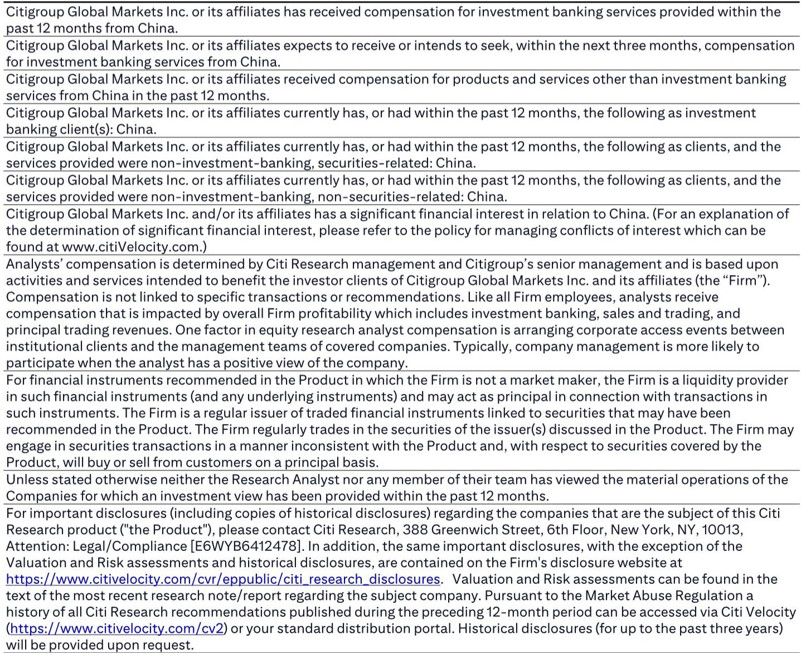

# 央行一季度报告真正值得关注的信号：政策重心已从“降息”转向“疏通”，但市场可能低估了汇率管理的新含义

某外资投行在最新研报中，就人民银行2026年第一季度货币政策执行报告给出了一个核心判断：这份报告在政治局会议后并无太多增量信息。但恰恰是这种“无增量”，本身就是一个重要信号。当市场仍在等待降息落地时，央行的注意力已经彻底转移到另一个维度——政策传导机制的有效性。更值得警惕的是，报告中重新出现的一句关于汇率环境的措辞，可能预示着人民币将进入一种“管理式升值”的新阶段。

这份报告并非没有看点。央行首次在专栏中讨论AI的宏观影响、对银行间市场流动性的措辞微调、以及对利率合规的监管姿态升级，每一项都指向一个共同的方向：政策工具正在从“总量宽松”转向“结构性疏通”。对于产业决策者和资产配置者而言，理解这一转向的节奏与边界，比猜测下一次降息何时到来更为关键。

## 1. 降息窗口正在收窄，但真正的约束不是通胀，而是政策优先级的变化

报告中最明确的信号是：短期内降息概率极低。央行重申了“保持融资成本低位”的承诺，但相比上一季度，措辞中缺少了“引导融资成本下行”的主动表述。这并非疏忽，而是政策重心的主动切换。

支撑这一判断的证据来自三个层面：

第一，央行对通胀的态度出现了微妙变化。报告既肯定了PPI在3月转正的趋势，也首次明确提示了中东局势带来的输入性通胀风险。这意味着，即便国内需求复苏依然温和，外部价格压力已经进入央行的约束函数。某外资投行在研报中判断，PPI加速回升将进一步推迟降息时点。

第二，央行对银行间市场的关注点从“流动性充裕”转向了“利率锚定”。报告明确要求“引导隔夜利率围绕政策利率运行”，这是一个比以往更具体的操作指引。过去几个季度银行间市场持续处于超宽松状态，DR001长期低于政策利率，央行现在发出的信号是：这种状态需要收敛。

第三，利率合规的监管姿态显著升级。报告承诺对金融机构利率政策执行情况进行“执法检查”和“现场评估”，并明确要打击阻碍货币政策传导的市场行为。这不是空话，而是央行对“宽货币、紧信贷”困境的正面回应——问题不在水龙头开得不够大，而在水流进了不该去的地方。

对于企业融资而言，这意味着：不要指望更低的基准利率，但可以关注结构性工具和定向支持政策是否会加码。对于资产定价而言，短端利率的下行空间已被封堵，收益率曲线可能会变得更平。

## 2. 汇率措辞的回归，暗示人民币可能进入“管理式升值”通道

报告中最容易被忽略但可能最具政策信号价值的变化，是汇率相关段落中一句措辞的回归：“为实体经济营造稳定的汇率环境”。这句话在2025年四季度的报告中曾被移除，现在重新出现。

某外资投行将其解读为央行可能倾向于“管理式升值”。这个判断的逻辑链条是：在外部压力不减、出口企业利润率承压的背景下，央行选择重新强调“稳定”，本身就意味着汇率不再是自由浮动的变量。而“为实体经济”这个定语，暗示了稳定并非单向的防贬值，而是双向的——当外部环境变化时，央行可能更主动地引导汇率向有利于实体经济的方向移动。

短期来看，即将到来的中美首脑峰会仍是汇率变动的潜在催化剂。但更值得关注的是中期趋势：如果“管理式升值”成为现实，意味着人民币资产的定价锚将发生变化。对于进口依赖型行业，这是利好；对于出口导向型企业，则需要重新审视汇率对冲策略。

报告在人民币国际化方面也增加了新表述，首次提出“优化外商直接投资和境外贷款的跨境资金管理”。某外资投行认为，央行可能正在推动人民币向融资货币的角色拓展——这是国际化进程中的自然一步，但也意味着人民币汇率的波动逻辑将更加复杂。

## 3. 央行首次讨论AI：增长贡献被充分肯定，但就业冲击尚未进入政策视野

报告在专栏中首次分析了AI的宏观影响，给出的数据令人瞩目：2025年核心AI产业规模预计突破1.2万亿元，科创板AI相关公司营收同比增长29%，利润同比增长108%。央行肯定了这一行业在出口和企业盈利方面的贡献，并指出金融体系通过降低融资成本、改善融资结构等方式提供了有力支持。

这些数据本身并不令人意外，但央行将其纳入货币政策报告的专栏，本身就是一种信号：AI已经被视为影响宏观经济运行的结构性变量，而非仅仅是产业政策议题。

然而，某外资投行提出了一个关键但尚未被充分讨论的问题：AI对就业的冲击。报告指出，新经济在规模上已与传统经济大致相当，但AI带来的结构性就业替代风险——尤其是在服务业领域——可能正在扩大宏观数据与微观感受之间的裂痕。3月失业率的意外上升，以及25-29岁年龄段就业状况的明显恶化，可能是早期预警信号。

央行在报告中对就业的描述仍停留在“总体稳定”的定性判断上，引用的也是季度平均失业率数据。但月度数据的恶化趋势值得持续跟踪。如果就业压力进一步显现，它可能成为触发降息或财政加码的关键变量。

对于投资者而言，AI产业链的景气度毋庸置疑，但需要警惕的是：当政策制定者开始关注AI对就业的冲击时，行业监管或税收政策的调整可能只是时间问题。

## 4. 报告尚未完全回答的关键问题：政策传导的堵点到底在哪里

央行将“改善政策传导”作为当前的首要任务，但报告并未深入剖析传导机制到底在哪个环节出了问题。从逻辑上推断，可能的堵点至少有三个：

其一，银行体系的风险偏好尚未修复。在净息差持续收窄、不良压力上升的背景下，银行缺乏主动扩张信贷的意愿。报告提到要“提升金融机构利率定价能力”，这本质上是在要求银行更精细化地识别风险并定价，而不是一刀切地惜贷。

其二，实体经济的有效融资需求不足。即便资金成本降到历史低位，如果企业缺乏投资回报率足够高的项目，信贷扩张也无从谈起。报告强调的“打击阻碍货币政策传导的市场行为”，可能指向的是资金在金融体系内空转而非流向实体的问题。

其三，财政与货币政策的协调仍有空间。货币政策传导不畅，有时并非货币问题，而是财政发力节奏、项目储备和地方政府债务约束共同作用的结果。报告对此着墨不多，但这是理解政策效果的关键维度。

这三个问题，每一个都值得单独展开，但受限于篇幅，报告只是点到了方向，没有给出答案。这恰恰是后续政策观察的核心线索。

## 5. 读者应该建立的观察框架：从“降息博弈”转向“传导效率验证”

基于以上分析，对于关注中国宏观政策走向的读者，建议建立以下三个观察维度：

第一，关注银行间利率与政策利率的偏离度。央行明确要求引导隔夜利率围绕政策利率运行，那么DR001与7天逆回购利率之间的利差就是最直接的传导效率指标。如果利差持续收窄，说明央行的意图正在落地；反之，则意味着市场仍在与政策博弈。

第二，关注信贷结构数据而非总量。在政策重心转向传导的背景下，企业中长期贷款占比、制造业贷款增速、普惠小微贷款增速等结构性指标，比社融总量更能反映政策效果。

第三，关注就业数据的月度波动。如果失业率持续恶化，尤其是25-29岁年龄段的就业压力加剧，可能会成为改变政策节奏的触发器。央行目前对就业的判断偏乐观，但数据本身可能正在积累变数。

这三个维度的信号，将共同决定某外资投行所预期的“象征性降息10个基点”是否会在2026年下半年兑现，以及兑现的紧迫程度。

---

报告中还有更多值得细读的细节——比如央行对银行间市场流动性“自二季度以来非常宽松”的刻意回避、对AI就业影响的点到为止、以及对人民币国际化路径的模糊表述——这些都不是偶然的省略，而是理解政策意图的重要线索。完整报告包含了原始图表、历史数据对比和更详尽的分析框架。

欢迎来星球微信群里继续讨论。这里不仅有这份报告的完整解读与原始图表，还可以与关注宏观经济与资产配置的同行交流，一起拆解政策信号背后的真实含义。

Personal reading notes and learning share only. Not investment advice.

