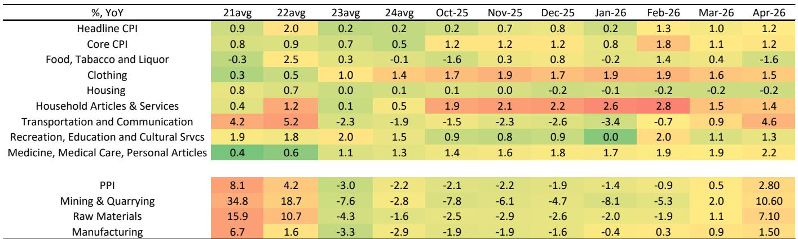
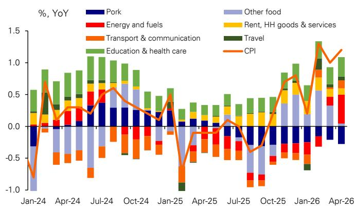

# 市场真正低估的不是PPI跳升，而是通胀传导正在重塑产业链利润分配

中国4月PPI同比跃升至2.8%，远超市场预期的1.5%左右。这个数字本身已经足够令人侧目，但真正值得产业决策者和投资者关注的，不是PPI有多高，而是它正在以历史规律重演的方式，系统性改变从上游到中游、再到下游消费品的价格传导路径。某外资投行最新发布的通胀监测报告指出，本轮PPI上行并非孤立的能源价格冲击，而是正在向化工、纺织、金属加工等中游行业扩散，同时工业消费品价格已经开始反映成本压力。这意味着，中国正在经历一轮“有传导能力的再通胀”——而这恰恰是过去两年市场一直在等待、却始终没有出现的关键变量。

报告将2026年PPI年度预测上调至3.2%，CPI上调至1.6%，并预计PPI将在下半年触及5%。这些数字背后隐含的判断是：通胀不再是供给侧的成本冲击，而正在成为企业利润修复的驱动力。但报告没有完全展开的问题是：这种传导的可持续性取决于哪些尚未验证的条件？不同行业在传导链条中的议价能力差异将如何改变竞争格局？

## 1. 四月PPI跳升不是意外，而是历史规律的又一次兑现

4月PPI环比上涨1.7%，几乎是3月环比涨幅0.9%的两倍。同比从0.5%跃升至2.8%，创下本轮周期的新高。如果只看单月数据，很容易将其归因于能源价格的短期飙升。但报告明确指出，这一走势与此前几轮PPI回升周期的形态高度一致——在PPI从负转正后的第二个月，往往会出现加速跳升。

这种规律性背后有清晰的产业逻辑：当上游原材料价格持续上涨超过一个季度，中游企业开始从“观望”转向“被动补库存”，采购行为的集中释放会进一步推高短期价格。4月的数据显示，石油开采和加工的价格环比增速继续扩大，但更值得关注的是，化学原料及制品、化学纤维、橡胶塑料等中游行业的价格增速也明显加快。这不再是单纯的上游涨价，而是价格压力正在向产业链的中间环节渗透。

对于投资者而言，这意味着PPI的后续走势可能比市场预期的更具韧性。如果历史规律继续成立，未来两个月PPI同比仍有可能进一步走高，而不是像部分市场观点认为的那样在二季度见顶回落。

## 2. 能源价格正在成为CPI的“隐形引擎”，而食品拖累正在减弱

4月CPI同比升至1.2%，核心CPI也录得1.2%的同比增长，均高于市场预期。推动CPI上行的主要力量来自能源价格——燃料价格同比飙升17.4%，对整体CPI的贡献达到0.45个百分点，而3月这一贡献仅为0.15个百分点。

与此同时，食品价格仍然偏弱。猪肉价格同比下降15%，蔬菜水果价格也低于季节性水平，导致食品通胀同比转负至-0.8%。但报告揭示了一个关键变化：食品的拖累正在被能源和工业消费品价格的上涨所抵消，而且这种抵消的力度在加大。

更值得关注的是工业消费品价格的传导信号。报告指出，汽油、汽车、手机等产品的价格同比上涨3.5%，这直接反映了PPI向CPI的传导正在发生。过去两年中，市场反复讨论“PPI能否向CPI传导”的问题，但始终缺乏实证支撑。4月的数据提供了第一个明确的证据：当上游涨价持续足够长、幅度足够大，中下游企业最终会通过提价来转嫁成本压力。

## 3. 服务业通胀正在成为CPI的稳定器，而非波动源

报告特别提到，4月服务通胀同比升至0.9%，高于一季度平均的0.83%和2025年四季度的0.7%。这一变化与五一假期的消费数据相互印证——服务消费正在成为支撑通胀的结构性力量。

服务通胀的韧性对宏观判断具有重要意义。过去几年，市场普遍担心中国面临“通缩风险”，而服务价格持续低迷是这一判断的核心论据之一。如果服务通胀能够稳定在0.8%-1.0%的区间，即使商品价格波动，CPI的整体下行风险也将被有效对冲。

但这里有一个尚未完全回答的问题：服务通胀的支撑力来自收入增长预期，还是来自短期消费场景的恢复？如果是后者，随着假期效应的消退，服务通胀能否维持当前水平仍存在不确定性。报告没有就此给出明确判断，这可能是未来几个月的关键观察点。

## 4. 上游涨价向中游传导已经确认，但下游能否承接仍是未知数

报告中的图2清晰地展示了PPI改善向中游行业传导的路径：石油开采和加工的价格增速在4月继续扩大，而化学材料、化学纤维、有色金属矿采选等行业的价格增速也出现明显提升。上游涨价正在沿着产业链逐级传导，这是一个已经被数据验证的事实。

但下游的承接能力仍然存疑。报告提到，工业消费品价格已经开始上涨，但涨幅是否足以覆盖上游成本的增加，取决于两个因素：一是终端需求的弹性，二是行业集中度带来的议价能力差异。对于竞争格局分散、产品同质化程度高的行业，成本转嫁能力可能较弱，利润空间反而会被压缩。

这正是报告尚未充分展开的关键问题：在通胀传导链条中，哪些行业能够成为“赢家”，哪些行业可能成为“输家”？这个问题需要结合各行业的产能利用率、库存水平和竞争格局进行更细致的拆解，而报告的分析框架主要停留在宏观层面。

## 5. 通胀预测上调的背后，是对企业利润修复路径的重新定价

报告将2026年PPI年度预测上调至3.2%，并预计下半年将达到5%。这一预测的上调幅度（1.4个百分点）远超CPI预测的上调幅度（0.1个百分点），反映出分析师对PPI走势的确定性更高，而对CPI传导的持续性仍持谨慎态度。

但真正值得思考的是，通胀预测的上调对资产定价意味着什么。如果PPI在下半年触及5%，这意味着工业企业的营收增速将得到名义上的提振，而成本压力能否顺利转嫁将决定利润率的走向。对于上游企业来说，涨价直接转化为利润增长，确定性最高。对于中游企业，利润修复取决于成本转嫁的速度和幅度。对于下游企业，则需要警惕成本上升侵蚀利润率的风险。

报告指出，“改善的通胀前景将进一步有利于工业利润的复苏”，但这句话的成立需要满足一个前提条件：下游需求不能出现超预期下滑。如果需求端走弱，企业将面临“量价双杀”的困境——成本上升、销售下滑，利润反而会恶化。

## 6. 报告尚未回答的关键问题：这轮通胀的可持续性取决于三个边界条件

尽管报告提供了清晰的数据分析和预测框架，但有几个关键问题仍然悬而未决，这些问题恰恰是投资者和产业决策者最需要关注的。

第一，能源价格能否维持在当前水平？如果全球原油价格出现回调，PPI的上涨动能将明显减弱，传导链条也会随之断裂。报告中的预测隐含了对能源价格维持高位的假设，但这一假设尚未被充分验证。

第二，食品价格的拖累何时会反转？猪肉价格目前处于深度负增长区间，但生猪存栏数据已经出现变化。如果猪肉价格在未来几个季度触底回升，食品通胀将从拖累转变为推手，CPI的上行空间将比当前预测更大。报告没有给出食品价格反转的时间表。

第三，服务通胀的韧性如何？如果服务消费的支撑来自短期因素而非收入增长，那么CPI的可持续性将受到质疑。这需要更长时间序列的数据来验证。

这些未解问题并不否定报告的判断，但它们提醒读者：通胀预测存在显著的不确定性，任何单一情景都不应被过度依赖。

---

4月的通胀数据确认了一个重要趋势：中国正在经历一轮有传导能力的再通胀，而非仅仅是上游成本的短期冲击。对于产业决策者而言，现在需要做的是重新审视自己所在行业的成本传导能力，并在定价策略和库存管理上做出前瞻性调整。对于投资者而言，通胀传导链条中的“赢家”和“输家”分化，可能带来比宏观本身更重要的结构性机会。

但这些判断的验证需要更细颗粒度的行业数据和企业层面的定价行为观察。如果你对这轮通胀传导的行业差异、企业议价能力的分化、以及资产定价的隐含假设感兴趣，欢迎来社群继续讨论。我们会在微信群中分享更完整的原始报告图表、行业层面的传导分析框架，以及我们基于这些数据推演出的投资观察框架。

Personal reading notes and learning share only. Not investment advice.

