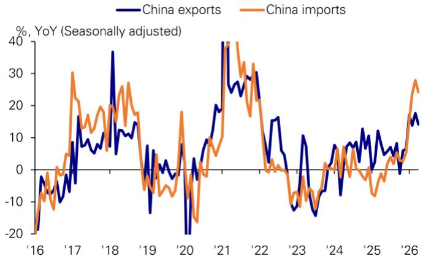

# 市场真正低估的不是出口韧性，而是进口激增背后的结构拐点

四月中国贸易数据再次超出预期。出口同比增长14.1%，高于市场预期的8%和我们此前估计的10%。进口更是以25.3%的同比增速大幅跑赢预期。表面上看，这是贸易数据的又一次“双超预期”，但真正值得关注的信号并不在出口端。

这份研报最核心的判断是：进口的结构性加速正在重塑中国贸易格局，而市场对此的定价远远不够。进口增速持续高于出口，且差距在扩大——前四个月进口平均增速超出出口8个百分点。这不是短期波动，而是由三个并行力量驱动的结构性变化：出口生产对原材料的刚性需求、全球大宗商品价格的重估、以及国内库存周期与“十五五”投资周期的共振。

如果市场继续用“出口导向”的旧框架理解中国贸易，就会错过进口侧正在发生的定价重估。而这恰恰是未来几个季度资产定价的关键变量。

## 1. 出口的超预期并非来自传统动能，而是“AHEAD”因素的持续强化

四月出口14.1%的增速确实亮眼，但分解结构后会发现，传统出口引擎正在让位于新动能。报告数据显示，半导体与计算机出口增速从一季度的49%跳升至四月的72%，汽车及零部件维持在28%的高位，而东盟和其他新兴市场出口增速则从20%和18%分别回落至15%。

这意味着什么？中国出口的增量正在从“市场覆盖”转向“产品升级”。半导体和计算机出口的加速并非周期性反弹，而是全球AI产业链对中国制造能力的再定价。报告将此归因于“AHEAD”因素的持续支撑——这是一个涵盖AI、高端制造、新兴市场需求的复合框架。

对投资者而言，出口结构的分化意味着：传统出口导向型企业的盈利弹性正在减弱，而深度嵌入全球科技产业链的公司将享有更长的增长窗口。这不是一个短期交易信号，而是产业定价权的转移。

## 2. 进口的超预期不是需求复苏那么简单，价格因素正在成为主导力量

四月进口增速25.3%远超预期，但市场容易犯的错误是将其简单归因为“内需回暖”。报告的数据揭示了更复杂的图景：进口价格增速在四月普遍超过一季度。最极端的例子是石油，进口价格同比飙升42%，较一季度大幅提高50个百分点。报告估算，价格对进口总额的贡献从一季度的-13个百分点骤升至四月的33个百分点。

这意味着，中国进口的“量价结构”正在发生根本性转变。过去几年，市场习惯用“量”来理解中国进口——内需强则进口量增，内需弱则进口量减。但现在，“价”的权重正在快速上升。全球大宗商品定价体系的重构，叠加人民币汇率的相对变化，正在改变中国进口的成本曲线。

这个判断的直接含义是：中国进口数据未来几个季度可能持续“虚高”，但其中相当一部分是价格重估而非真实需求扩张。市场如果按照历史经验用进口增速反推GDP增速，可能会高估经济复苏的力度。

## 3. 库存周期与“十五五”投资周期正在形成共振，这是报告尚未完全展开的关键变量

报告指出，一季度工业企业库存同比增长8.3%，增速较前一年翻倍。报告给出了三个可能原因：企业为应对商品价格上涨而提前备货、“十五五”开局之年投资可能显著回升、以及国内AI发展导致半导体和计算机进口在前四个月超过出口540亿美元。

这三个原因中，第一个和第三个相对容易理解，但第二个——“十五五”投资周期的启动——可能是最具长期影响、也最被市场低估的因素。报告没有展开的是：这一轮投资周期与以往有何不同？如果投资方向集中在AI基础设施、新能源和高端制造，其对进口结构的拉动将是持续而非脉冲式的。

这里需要提出一个报告尚未完全回答的问题：库存周期的可持续性。一季度库存增速翻倍，但同期工业企业的利润增速和产能利用率数据并未同步改善。这意味着部分库存可能是被动累积，而非主动补库。如果终端需求未能跟上，库存周期可能在下半年出现反复。

对资产定价而言，这个问题的答案决定了周期股的估值逻辑。如果是主动补库叠加投资周期，大宗商品和工业品将迎来持续性重估；如果是被动累积，则当前的进口和库存数据可能已在透支未来。

## 4. 进口结构揭示了中国经济“再工业化”的真实路径

将出口和进口数据放在一起看，最有趣的发现是：中国正在用进口支撑出口的升级。前四个月，半导体和计算机的进口超过出口540亿美元。这个数字本身并不令人意外——中国本就是全球最大的半导体进口国——但它的增速和结构变化值得关注。

报告指出，一季度进口增长的最大驱动因素是AI相关产品、初级产品、金属、机械和化学品。这些恰恰是出口生产所需的原材料和设备。换句话说，中国正在经历一轮以“进口中间品、出口制成品”为特征的再工业化，而这次的核心驱动力是AI和高端制造，而非传统的房地产和基建。

这个判断对资产配置的含义是：投资者应该关注那些同时受益于进口和出口双向扩张的行业，而非仅盯住出口端。例如，半导体设备和材料、高端化工、精密机械等领域，既受益于国内进口替代，又受益于全球科技产业链的扩张。

## 5. 报告尚未完全回答的问题：进口价格重估的可持续性

四月石油进口价格同比飙升42%，这个数字是否可持续？报告没有给出明确判断，但这恰恰是未来几个季度最重要的变量之一。石油价格的基数效应将在下半年逐步消退，但地缘政治风险和OPEC+的供给策略仍存在高度不确定性。

更重要的是，报告提到的“海外价格上涨”是否具有普遍性和持续性？从数据看，四月各品类进口价格增速普遍高于一季度，但差异很大：塑料从-3%跳升至18%，半导体从31%升至39%，金属从21%升至24%。这种分化本身就意味着，不同品类的价格驱动逻辑不同，不能一概而论。

对投资者来说，需要建立一套区分“结构性涨价”和“周期性涨价”的框架。结构性涨价通常源于供给约束或技术壁垒，例如半导体设备和关键材料；周期性涨价则更多受全球需求波动影响，例如石油和金属。前者更适合长期配置，后者则需要密切关注库存和产能变化。

## 6. 如何用这份数据更新你的观察框架

基于以上分析，我们可以建立一个三层观察框架：

第一层：区分“量”和“价”的贡献。不要被进口总额的高增速迷惑，要关注进口量的真实变化。如果扣除价格因素后的实际进口增速低于名义增速，说明内需的真实强度可能被高估。

第二层：关注“进口-出口”的联动关系。中国进口增速持续高于出口，意味着贸易顺差在收窄。这本身不是问题，但如果进口增长主要由价格驱动而非生产需求驱动，那么贸易条件的恶化可能对国民收入产生负面影响。

第三层：跟踪库存周期的拐点。一季度库存增速翻倍，但二季度数据才是关键。如果库存增速继续上行而工业品价格未能同步上涨，企业可能面临“被动补库-降价去库”的压力。这将是判断周期股和商品价格拐点的核心信号。

这三个框架并不复杂，但能帮助投资者避免被单一数据点误导。市场往往对出口数据反应过度，而对进口数据的结构性含义关注不足。这恰恰是超额收益的来源。

---

以上分析基于投行研报的公开数据和逻辑推导，但仍有几个关键问题需要进一步验证：库存周期是主动还是被动？进口价格重估能否持续？“十五五”投资周期的实际规模和方向如何？这些问题的答案，需要更完整的产业数据和公司层面的验证。

欢迎来星球微信群里继续讨论。我们将结合更多产业链数据和公司调研，逐步拆解这些未解问题，并与社群成员一起追踪关键假设的验证进度。

Personal reading notes and learning share only. Not investment advice.

