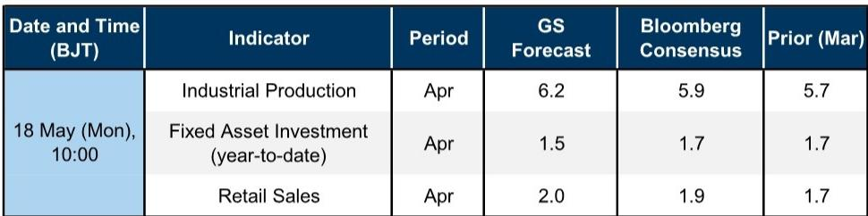

# China's Activity Data Will Show a Diverging Recovery: Industry Gains Momentum While Investment Loses Ground

The Chinese economy in April is not sending a single, unified signal. Instead, it is telling two different stories at the same time. Manufacturing is accelerating, driven by stronger exports and a modest rebound in sectors like automobiles and steel. Meanwhile, fixed asset investment is decelerating, held back by policy tightening, weather disruptions, and weakening demand for basic materials. This divergence matters because it challenges the prevailing narrative that China's recovery is broad-based and self-reinforcing.

According to a global investment bank's April activity data preview, industrial production is expected to rise to 6.2 percent year-on-year, up from 5.7 percent in March. Retail sales may tick up to 2.0 percent from 1.7 percent. But fixed asset investment on a single-month basis is forecast to slow further to 1.1 percent from 1.6 percent. The headline numbers appear moderately positive, but the composition reveals a more fragile and uneven recovery.

The timing of this data release is critical. Markets have been pricing in a steady improvement in Chinese economic conditions, supported by policy stimulus and a rebound in consumer confidence. The April data will either confirm or challenge that optimism. If investment continues to weaken while industry holds up, the implication is that the recovery is being driven by external demand and selective manufacturing strength, not by a broad-based domestic reflation. That distinction has direct consequences for asset allocation, sector positioning, and policy expectations.

This is not a story of a single number beating or missing consensus. It is a story of structural divergence within the economy. The question for investors is not whether April data will be good or bad, but which parts of the economy are genuinely recovering and which are still under pressure. The answer will determine where the risks and opportunities lie in the months ahead.

## Stronger Exports and a Steel Rebound Are Lifting Manufacturing, But the Global Energy Shock Has Not Disappeared

The expected improvement in industrial production is not accidental. It reflects three specific drivers that have aligned in April. First, export performance has been stronger than anticipated, providing a tailwind for manufacturing sectors that are exposed to global demand. Second, the year-on-year contraction in steel demand has narrowed, which is significant because steel is a bellwether for heavy industry and construction-related manufacturing. Third, automobile output growth has improved, indicating that supply chain disruptions and demand weakness in that sector may be easing.

These factors together suggest that the manufacturing sector has found a floor and is beginning to recover momentum. The forecast implies that industrial production may have gained 4.6 percent month-on-month on a seasonally adjusted annualized basis in April, which is consistent with what solid manufacturing PMI readings have been signaling. This is not a boom, but it is a meaningful step up from the levels seen in the first quarter.

However, it is important not to over-interpret this improvement. The global energy supply shock remains a real constraint, and its effects are not evenly distributed across industries. Energy-intensive sectors continue to face margin pressure and input cost volatility. The rebound in manufacturing is concentrated in segments that benefit from external demand or policy support, not in a broad-based industrial renaissance. The sustainability of this manufacturing momentum depends on whether export orders hold up and whether domestic demand for industrial goods begins to strengthen. If investment continues to slow, that will eventually feed back into weaker industrial orders.

## Fixed Asset Investment Is Slowing Because of Policy, Weather, and Weakening Demand at the Project Level

The deceleration in fixed asset investment is the most concerning signal in the April data preview. On a single-month basis, FAI growth is expected to slow to 1.1 percent year-on-year from 1.6 percent in March. This is not a marginal softening; it is a clear downward trend that points to structural headwinds in the investment cycle.

Three factors explain this weakness. First, the NBS construction PMI has dipped, indicating that construction activity is losing steam. Second, there has been a notable contraction in policy bank net financing through the PBOC's Pledged Supplementary Lending and policy bank bond issuance. This means that the policy support that was previously fueling infrastructure investment is being withdrawn or delayed. Third, heavy rainfalls in southern China have constrained outdoor construction activity, adding a temporary but meaningful weather-related drag.

The deeper concern is what the channel checks reveal. The report's commodities research team notes that end-user orderbooks for most basic materials softened as of mid-April. This suggests that the weakness is not just about weather or temporary policy timing. It reflects a genuine softening in demand at the project level. If orderbooks are weakening, that points to a lack of confidence among project developers and local governments, who are the ultimate drivers of fixed asset investment.

The implication is clear: the investment leg of the Chinese economy is not recovering on its own. It requires sustained policy support, and that support appears to be fading. The year-to-date FAI growth is forecast to fall to 1.5 percent from 1.7 percent in March. If this trend continues, it will become a drag on overall GDP growth and will force policymakers to consider whether additional stimulus is needed.

## Retail Sales Are Being Propped Up by Energy Prices and Calendar Effects, Not by Genuine Consumer Demand

Retail sales growth is expected to rise slightly to 2.0 percent year-on-year in April from 1.7 percent in March. On the surface, this looks like a modest improvement in consumer spending. But the drivers behind this increase are not encouraging for those hoping for a sustained consumption recovery.

Higher energy prices have boosted gasoline sales value growth. This is not a sign of stronger consumer demand; it is a mechanical effect of higher prices at the pump. Consumers are spending more on fuel not because they are driving more, but because fuel costs more. The volume of gasoline sold may not have increased at all.

Second, the nationwide promotion of spring breaks in late April this year has frontloaded some dining-out demand from May to April. This is a calendar effect, not a trend. It means that May retail sales data may look weaker as a result of this shift. The underlying pace of dining-out and services consumption has not fundamentally accelerated.

Meanwhile, automobile and home appliance sales growth remain subdued. The report explicitly notes that the ongoing consumer goods trade-in program is showing weakening effectiveness. This is a critical observation. If policy-driven consumption programs are losing their ability to stimulate spending, then the organic consumer recovery is weaker than many assume. The trade-in program was one of the key policy tools designed to support consumption in 2025. If it is running out of steam, there are few obvious replacements.

The retail sales data, therefore, present a misleading picture. The headline improvement is real, but it is not driven by a strengthening consumer. It is driven by price effects and timing shifts. The underlying trend in consumer spending remains tepid, and the risks are tilted to the downside for the coming months.

## The Report Leaves a Critical Question Unanswered: Is the Divergence Temporary or Structural?

The April activity data preview provides a clear and well-supported forecast, but it does not fully answer the most important strategic question. Is the divergence between manufacturing strength and investment weakness a temporary phenomenon that will correct itself in the coming months, or is it a structural shift that will define the Chinese economy for the rest of 2025?

There are arguments on both sides. A temporary interpretation would emphasize that the weather disruptions in southern China will pass, that policy bank financing could resume, and that the global energy shock may ease as supply chains adjust. Under this view, the investment weakness is a blip, and the manufacturing strength is the leading indicator of a broader recovery.

A structural interpretation would argue that the divergence reflects deeper forces. Manufacturing is benefiting from external demand and selective industrial policy, but investment is constrained by local government debt concerns, a slowing property sector, and a lack of confidence among private developers. These constraints are not going away quickly. If this view is correct, then the Chinese economy will continue to grow in an unbalanced way, with pockets of strength and persistent weakness. That would have different implications for which sectors to overweight and which to avoid.

The report does not resolve this tension, and it cannot, because the data only covers one month. Investors will need to watch the May and June data releases closely to determine which narrative is gaining traction. The answer will shape portfolio strategy for the second half of the year.

## A Decision Framework for Investors: How to Read the Next Three Months of Chinese Data

Given the divergence in the April data, investors need a clear framework for interpreting the coming months. The following approach can help distinguish between noise and signal.

First, focus on the trend in fixed asset investment. If FAI continues to decelerate in May, that confirms the structural weakness thesis. If it stabilizes or rebounds, the temporary disruption view gains credibility. The key leading indicators to watch are policy bank bond issuance, local government land sales, and the construction PMI.

Second, disaggregate retail sales. Do not look at the headline number alone. Track gasoline sales volume separately from value, and monitor automobile and home appliance sales trends. If the core consumption categories remain weak while energy-driven inflation boosts the headline, the consumer recovery is not real.

Third, watch the relationship between industrial production and exports. If IP continues to rise while exports slow, that would suggest domestic demand is finally picking up. If IP rises only when exports are strong, the manufacturing recovery remains dependent on external conditions. That dependency is a vulnerability.

Fourth, pay attention to policy signals. The report indicates that policy bank financing has contracted. If the government signals new stimulus measures for infrastructure or consumption, that would change the outlook. If policy remains on hold, the current trends are likely to persist.

Finally, do not assume that consensus is correct. The report's forecasts are slightly above consensus for IP, largely in line for retail sales, and slightly below for FAI. The biggest risk is that the consensus is too optimistic about investment and too pessimistic about industry. Investors who position for divergence rather than convergence may be better prepared for the actual data outcomes.

## The Full Report Contains the Original Charts and Granular Forecasts That Inform This Analysis

The analysis above is based on the April activity data preview, but the full report contains the detailed exhibits, channel check insights, and granular forecasts that support these conclusions. The original charts show the exact trajectory of each indicator and the relationship between the bank's forecasts and market consensus. For investors who want to make their own assessments, the full report provides the raw material.

Join the community to read the full report and review the original charts.

*This article is for learning and discussion only and does not constitute investment advice.*

Personal reading notes and learning share only. Not investment advice.

