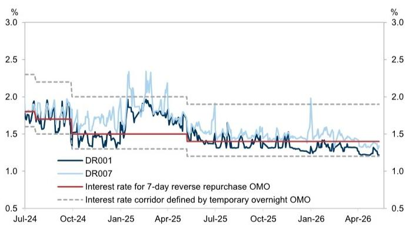
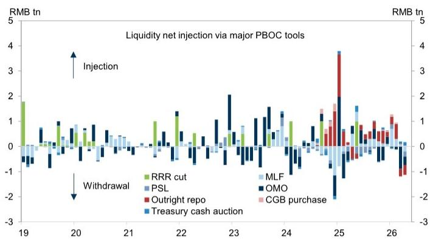
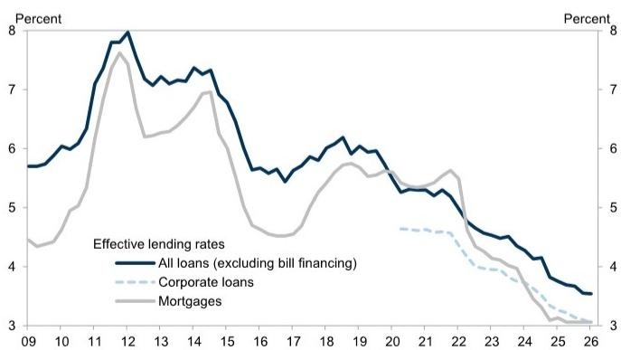

# The PBOC Has Shifted from Easing to Risk Management, and the Market Has Not Fully Priced This

The People's Bank of China's first-quarter monetary policy report, released on May 11, is not a routine update. It is a signal that the central bank's operating framework has undergone a meaningful shift. The report sounds more constructive on growth and inflation, explicitly notes that PPI turned positive in March, and removes the phrase "carry out counter-cyclical and cross-cyclical adjustments" that had been a staple of previous communications. These are not cosmetic changes. They reflect a central bank that believes the economy no longer needs broad-based stimulus and is now focused on the risks that accompany a recovery.

The market's initial read may be that nothing has changed. The policy stance remains "moderately loose." The PBOC continues to emphasize keeping financing costs low. But this surface-level continuity masks a deeper strategic pivot. The removal of counter-cyclical language, the new emphasis on "precise and effective" policy, and a dedicated column on macro prudential management all point in one direction: the PBOC is preparing to normalize its approach, and it will do so through liquidity management rather than rate hikes.

This matters now because the global context is shifting. Imported inflation is becoming a real concern. The Middle East conflict introduces uncertainty that could disrupt supply chains and energy prices. Domestic reflation pressures, while still contained, are building. If the PBOC is already signaling a more cautious stance at a time when inflation is only just turning positive, investors need to ask what happens when those pressures intensify. The answer may be a gradual but meaningful tightening of interbank conditions that many portfolio strategies have not yet accounted for.

---

## The PBOC's Removal of Counter-Cyclical Language Signals That the Growth-Inflation Trade-Off Has Shifted

The most important change in the Q1 report is what the PBOC chose to remove. The phrase "carry out counter-cyclical and cross-cyclical adjustments" has been dropped entirely. In its place, the PBOC now emphasizes "precise and effective" policy support. This is not a subtle distinction. Counter-cyclical adjustment is the language of active stimulus: it implies that the central bank will lean against economic weakness by injecting liquidity and cutting rates. Removing it signals that the PBOC no longer sees the economy as needing that kind of support.

The rationale is clear from the report's own assessment. The PBOC cites a strong start to 2026 and notes that PPI inflation turned positive in March. These are not merely data points; they are the justification for a policy pivot. When the central bank believes growth is on a solid footing and deflation risks have receded, the marginal benefit of further broad-based easing declines, while the marginal cost in terms of financial stability risks increases.

This shift has direct implications for asset allocation. If the PBOC is no longer in active easing mode, the tailwind that has supported bond markets and rate-sensitive equities is fading. The central bank is not yet tightening, but it has moved from an easing bias to a neutral bias. For investors who have positioned for continued monetary accommodation, the removal of counter-cyclical language should be a clear warning that the policy environment is changing.

---

## The PBOC's New Focus on Overnight Repo Rates Creates a More Precise but Less Forgiving Liquidity Framework

The Q1 report introduces an operational change that deserves careful attention. The PBOC now states it will "guide overnight market rates to move around the policy rate," replacing the previous language of guiding "short-term market rates." This shift from a vague reference to short-term rates to a specific focus on overnight rates is significant. It signals that the PBOC is moving toward a more precise operational target for interbank liquidity management.

This change was previewed in the January 15 press conference, where PBOC officials indicated a greater focus on DR001 as an operational reference. The data confirm this: overnight repo rates have been trading closer to the lower bound of the interest rate corridor defined by the temporary overnight OMO facilities. The PBOC is effectively using the overnight rate corridor as a tool to communicate its liquidity stance with greater granularity.

The strategic implication is that the PBOC now has a more calibrated tool for managing liquidity without resorting to policy rate changes. If the central bank wants to tighten conditions modestly, it can allow overnight rates to drift toward the upper end of the corridor without any formal rate hike. If it wants to ease, it can push them toward the lower bound. This framework gives the PBOC more flexibility, but it also means that small changes in overnight rates carry greater signaling power. Investors who ignore movements in DR001 risk missing early signs of a policy shift.

---

## The PBOC Is Using Liquidity Withdrawal as a Stealth Tightening Tool, and the Process Has Already Begun

The report reveals that the PBOC has already started to drain liquidity. It notes that liquidity demand from financial institutions declined after the Lunar New Year holiday and as fiscal spending increased toward quarter-end. In response, the central bank scaled back its liquidity injections. The data show that the PBOC drained liquidity in March and April through the maturity of reverse repos, outright repos, MLF loans, and PSL.

Importantly, the PBOC has not used RRR cuts or aggressive OMO injections to offset these outflows. This is a deliberate choice. Under a "moderately loose" stance, the central bank could have chosen to maintain elevated liquidity levels. Instead, it allowed the natural maturity of existing tools to reduce the system's liquidity buffer. This is a stealth tightening: it does not involve any rate hike or dramatic announcement, but it gradually reduces the availability of cheap funding in the interbank market.

The process is still measured and limited. The PBOC is not draining aggressively, and interbank rates remain low by historical standards. But the direction of travel is clear. The central bank is testing the market's reaction to lower liquidity. If imported inflation pressures build, the next step could be a more active tightening of conditions. The report explicitly warns about the need to remain vigilant about imported inflation and its impact on domestic price expectations. This is not boilerplate language; it is a forward guidance that the PBOC is watching this channel closely and will act if necessary.

---

## The Report Leaves a Critical Question Unanswered: How Will the PBOC React If Imported Inflation Accelerates?

The Q1 report identifies imported inflation as a key risk but does not specify the threshold at which the PBOC would shift from measured liquidity withdrawal to active tightening. The central bank states that it will "guide overnight market rates to move around the policy rate," but it does not say what happens if inflation expectations rise above target. This ambiguity is the report's most important analytical gap.

The likely answer is that the PBOC would first normalize liquidity conditions by allowing overnight repo rates to drift back toward the policy rate. This would be a gradual process, not a sudden shock. The central bank has signaled that it prefers reversible, low-profile tools over dramatic rate changes. But the question of timing remains open. If the Middle East conflict disrupts energy supplies and pushes up imported inflation faster than expected, the PBOC may need to accelerate its timeline.

This uncertainty has direct implications for bond markets. If the PBOC is forced to tighten more quickly, the current low level of CGB yields may not be sustainable. The report notes that government bond issuance has been slower this year, which has helped keep yields stable despite strong growth. But this is a temporary factor. As issuance normalizes and liquidity conditions tighten, yields could face upward pressure. Investors who rely on the current low-yield environment to justify their positioning should stress-test their assumptions against a scenario where the PBOC normalizes liquidity within the next two quarters.

---

## The Decision Framework for Investors: Three Scenarios for PBOC Policy and Their Portfolio Implications

The Q1 report allows investors to construct a clear decision framework based on three scenarios. Each scenario has distinct implications for rates, credit, and equities.

Scenario one is the baseline: the PBOC maintains its current measured stance. Interbank liquidity remains ample but is gradually withdrawn through natural maturity of existing tools. Overnight rates stay near the lower bound of the corridor. No policy rate or RRR cuts occur. In this scenario, bond yields remain range-bound, banks' net interest margins stabilize at low levels, and structural tools continue to support high-tech and private sectors. The portfolio implication is to maintain a neutral duration position and favor sectors that benefit from stable but not expansive liquidity.

Scenario two is a gradual normalization. Imported inflation leads to higher inflation expectations, but the process is slow. The PBOC responds by guiding overnight rates back toward the policy rate. This would be a modest tightening of financial conditions without a formal rate hike. In this scenario, short-end rates rise first, followed by a gradual steepening of the yield curve. Banks with large bond portfolios face mark-to-market losses. The portfolio implication is to reduce duration exposure and increase allocation to sectors with pricing power that can pass through higher funding costs.

Scenario three is an accelerated tightening. A sharp rise in imported inflation, possibly triggered by a geopolitical shock, forces the PBOC to act more decisively. The central bank may use a combination of liquidity withdrawal and guidance to push overnight rates above the policy rate. This would be a significant tightening of financial conditions. In this scenario, bond yields rise sharply, credit spreads widen, and rate-sensitive equities underperform. The portfolio implication is to shift toward defensive assets and reduce leverage.

Investors should identify which scenario they believe is most likely and adjust their positioning accordingly. The Q1 report provides the framework for this analysis, but the ultimate outcome depends on external factors that the PBOC cannot control. The central bank's own language suggests it is preparing for scenario two but cannot rule out scenario three.

---

## The Full Report Contains the Charts and Data That Make This Framework Actionable

The analysis above draws on the key insights from the Q1 monetary policy report, but the full document contains the detailed exhibits and data that allow investors to calibrate their positioning. The charts on overnight repo rates relative to the interest rate corridor, effective lending rates over time, and the PBOC's liquidity injection and withdrawal patterns are essential for tracking whether the central bank is following the path we have outlined.

Join the community to read the full report and review the original charts. The exhibits provide the empirical foundation for the scenarios described here and allow you to monitor the PBOC's actions in real time against its stated framework. Understanding the central bank's new operating model is not optional for anyone with exposure to Chinese rates, credit, or equities. The shift from easing to risk management is underway, and the market has not fully priced its implications.

*This article is for learning and discussion only and does not constitute investment advice.*

Personal reading notes and learning share only. Not investment advice.

