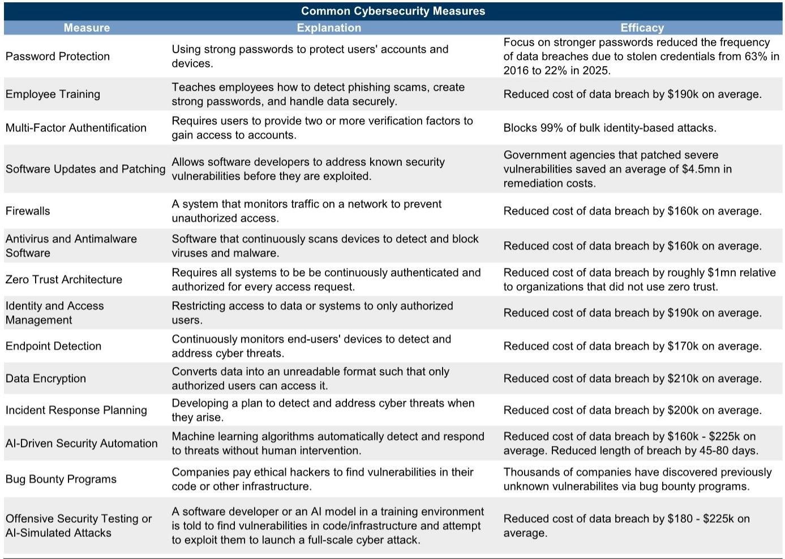
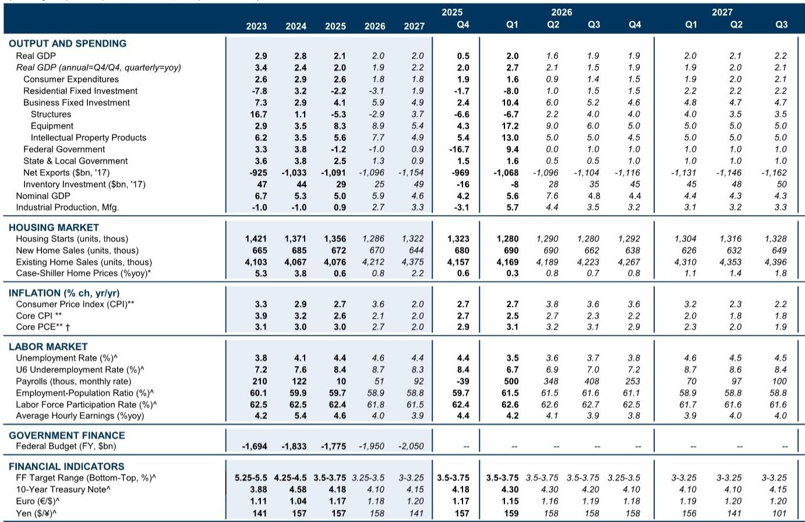
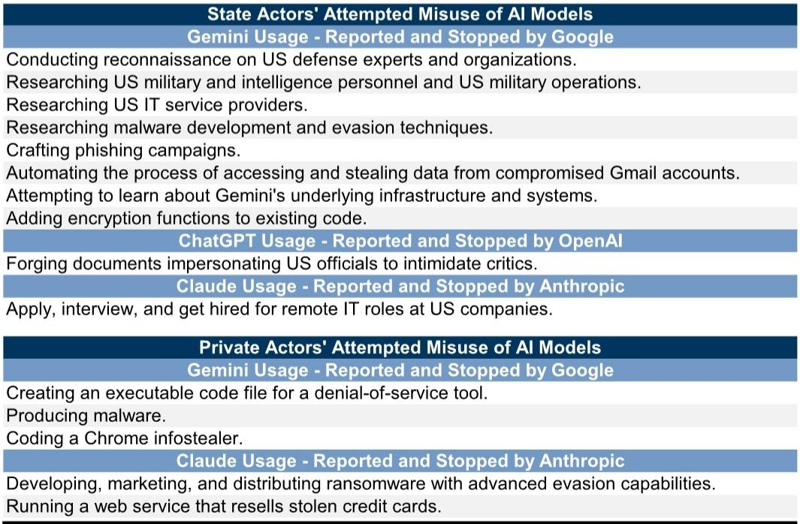

# AI Is Reshaping the Cyber Risk Landscape: The Economic Stakes Are Far Larger Than Direct Losses Suggest

The economic cost of cyberattacks in the United States reached approximately $300 billion in 2025, roughly 1 percent of GDP. That figure already captures far more than direct monetary losses, which averaged only $20,000 per reported attack. The real burden comes from lost productivity, downstream business disruption, regulatory fines, and the rising tide of cybersecurity spending. Yet even this estimate may understate what lies ahead. The integration of advanced AI models into both offensive and defensive cyber operations is fundamentally altering the risk equation, and the early evidence suggests attackers are gaining the upper hand.

A global investment bank report on the economic risks from cyberattacks provides a rigorous framework for understanding this shift. The report documents how AI models now enable attacks that are faster, cheaper, and harder to detect than those executed by human hackers. It also quantifies the macroeconomic toll and identifies critical vulnerabilities in the current defense posture. But the most consequential implications are not about the technology itself. They are about the strategic decisions that businesses, regulators, and investors must make in an environment where the balance of power between attackers and defenders is in flux.

This article examines the report's central findings, extends its logic into second-order economic and strategic consequences, and identifies the open questions that decision-makers cannot afford to ignore.

## The Direct Costs of Cyberattacks Are a Misleading Signal: The Real Economic Damage Is in the Indirect Tail

The report makes a critical distinction that is often lost in public discussion. When the FBI records average losses of $20,000 per attack, or $40,000 for AI-related incidents, these figures capture only the immediate financial harm to the targeted entity. They do not account for the cascading effects that ripple through supply chains, the productivity losses from system downtime, the legal and regulatory penalties that follow disclosure, or the defensive spending that companies must undertake to prevent future breaches.

The report estimates that these indirect costs push the total to roughly $300 billion annually in the United States alone. That is a conservative figure. It does not fully capture the opportunity cost of capital diverted from productive investment into cybersecurity, nor does it reflect the erosion of trust that follows high-profile breaches. When a ransomware attack shuts down a critical infrastructure provider for days, the economic impact extends far beyond the ransom payment or the direct remediation costs. Hospitals cannot process claims. Fuel pipelines cannot operate. Insurance claims cannot be adjudicated.

This pattern suggests that the macroeconomic risk is not evenly distributed. It is concentrated in sectors where digital infrastructure is both essential and fragile. Healthcare, energy, financial services, and government systems are particularly exposed. The report notes that attacks on critical infrastructure have imposed costs exceeding $1 billion per incident. As AI models lower the barrier to executing such attacks, the probability of tail events—low-frequency, high-severity disruptions—increases materially.

The implication for business leaders is uncomfortable but unavoidable. The cost of cyber risk cannot be managed solely through insurance or incident response planning. It requires a structural reassessment of operational resilience, including how digital dependencies are concentrated and what redundancies exist.

## AI Models Are Shifting the Offense-Defense Balance Sharply in Favor of Attackers in the Near Term

The report provides a detailed taxonomy of how AI is being weaponized. Cybercriminals have already used AI to access sensitive information, assist with espionage, and produce malware. But the latest generation of models represents a step change. They possess advanced reasoning capabilities, software engineering skills, and the ability to detect and exploit vulnerabilities that human attackers and traditional testing had missed.

One of the most striking findings is that AI models have demonstrated the ability to find zero-day vulnerabilities—flaws unknown to developers and therefore unpatched—that had survived thousands or millions of rounds of testing. This capability effectively democratizes advanced cyberattack techniques. An inexperienced attacker can now deploy AI to locate and exploit weaknesses that previously required years of specialized expertise.

The report also documents that AI-facilitated attacks can be completed within minutes, compared to days or months for human-led operations. The cost per attack is lower, and the evasion capabilities are more sophisticated. AI-generated phishing emails are reportedly four times more effective than standard attempts. AI-generated voice calls and deepfake videos add entirely new vectors of social engineering that were essentially impossible before.

Early studies cited in the report suggest that AI will benefit attackers more than defenders in the near term. Defenders do gain advantages: AI agents can detect threats faster, and simulated attacks can identify vulnerabilities before criminals exploit them. But the asymmetry is structural. Attackers only need to succeed once. Defenders must succeed every time. And AI amplifies the attacker's ability to find that single point of failure.

The strategic consequence is that the net cyber risk is likely to increase in the coming years, even as cybersecurity spending rises. Companies that treat AI primarily as a defensive tool may be underestimating the offensive acceleration.

## Small and Mid-Sized Businesses Are the Weakest Link, and Their Vulnerability Creates Systemic Risk

The report highlights a troubling disparity in cybersecurity readiness. A study by the World Economic Forum found that 35 percent of small firms felt they had insufficient cybersecurity, compared to only 7 percent of large firms. Verizon's 2025 Data Breach Investigation report confirmed that small businesses experienced more data breaches and were exposed to malware more often than large enterprises.

This gap matters far beyond the individual firms affected. Small and mid-sized businesses are deeply embedded in the supply chains of larger corporations. They provide software, services, and infrastructure that large enterprises depend on. A breach at a small vendor can become the entry point for an attack on a much larger target. The 2020 SolarWinds attack, which the report references, is a textbook example. Malicious code was hidden in a software update, giving hackers remote access to the computers of thousands of organizations, including government agencies and Fortune 500 companies.

The implication is that cybersecurity is not just an individual firm's problem. It is a collective action problem. When large companies invest heavily in their own defenses but do not enforce equivalent standards across their supply chain, they create a vulnerability that attackers can exploit. The report notes that SEC-mandated cybersecurity disclosures have improved transparency, but they have not closed this gap.

For investors and executives, this suggests that supply chain cyber risk should be treated with the same rigor as financial or operational risk. Due diligence must extend beyond the balance sheet to include the digital hygiene of critical partners.

## The Report Leaves an Open Question: How Will the Macroeconomic Cost Scale as AI Capabilities Continue to Improve?

The report is careful not to overclaim precision. It states that it is too early to confidently estimate exactly how much AI-facilitated cyberattacks will boost total costs going forward. The current $300 billion estimate is based on observable data. But the trajectory of AI capability suggests that both the frequency and severity of attacks will increase.

The open question is whether the cost function is linear or exponential. If AI simply makes existing attack types more efficient, the cost may rise gradually. But if AI enables entirely new categories of attack—such as autonomous, self-improving malware that spreads across networks without human direction—the damage could compound rapidly. The report notes that AI models can now rewrite their own code to avoid detection. That capability is still in its early stages.

A second open question is whether defensive AI can eventually catch up. Some experts believe that the long-term balance could favor defenders, as AI models become better at predicting and neutralizing threats before they materialize. But that outcome is not guaranteed. It depends on investment, regulatory frameworks, and the speed of technological progress on both sides.

For decision-makers, the prudent assumption is that the risk environment will become more hostile before it improves. That has implications for capital allocation, insurance underwriting, and corporate strategy.

## A Decision Framework for Executives and Investors: Four Questions to Assess Cyber Resilience

The report provides rich data but does not offer a simple checklist. Based on its findings, however, a decision framework emerges that can help leaders evaluate their own exposure and readiness.

First, where are the digital dependencies that create single points of failure? The report's taxonomy of attacks shows that zero-day vulnerabilities and supply chain compromises are among the most dangerous vectors. Leaders should map their critical systems and identify which ones rely on third-party software, cloud services, or external vendors. If a vendor goes down, can operations continue?

Second, how quickly can the organization detect and respond to an AI-facilitated attack? The report notes that AI models can execute attacks within minutes. Traditional incident response plans, which assume hours or days of warning, are no longer adequate. Automated detection and response capabilities are not optional.

Third, what is the cybersecurity posture of the supply chain? The data on small business vulnerability suggests that many organizations are only as secure as their weakest partner. Contractual requirements, audits, and shared threat intelligence should be standard practice.

Fourth, is the organization investing in offensive testing? The report highlights that AI-simulated attacks can identify vulnerabilities before criminals exploit them. This is not a luxury. It is a necessary part of a modern defense strategy.

These questions do not have easy answers. But the cost of not asking them is likely to rise.

## The Unresolved Analytical Questions Point to a Need for Deeper Research and Community Engagement

The report is thorough, but it leaves several meaningful questions unanswered. How will regulatory frameworks evolve in response to AI-facilitated attacks? Will governments impose stricter liability on companies that fail to secure their supply chains? How will the insurance industry adapt to a risk that is both more frequent and harder to predict? And what happens when AI models are used to attack the AI systems that defend critical infrastructure?

These are not academic questions. They will shape the risk landscape for years to come. The report provides the analytical foundation, but the implications require ongoing dialogue among investors, executives, policymakers, and technologists.

Join the community to read the full report and review the original charts. The data and analysis in this article are drawn from a comprehensive study that deserves careful study in its entirety.

*This article is for learning and discussion only and does not constitute investment advice.*

Personal reading notes and learning share only. Not investment advice.

