# US Equity Strategy Watch

S&P 500 above 8,000? It's possible: we outline how

Equity Strategy
North America

- We revise higher our year-end 2026 S&P 500 target to 7,650 on earnings strength...   
- ... but could see the S&P 500 breaching 8,000 on a sentiment rebound in tech, AI, geopolitics, macro, etc   
- Downside risks include tech earnings slowdown, energy supply shocks, a Fed pivot to hikes

The S&P 500 is back at record highs as tech stages a comeback, US Equity Wrap, 4 May. A solid Q1 earnings season is also providing support. We're taking the opportunity to revise our 2026 index EPS estimates up by $8\%$ , incorporating the latest quarterly results. We now expect 2026 EPS growth of $20\%$ or USD325, with tech/Mag7 still the main drivers. With higher earnings expectations, we revise our year-end S&P 500 target to 7,650 from 7,500 previously.

While earnings remain supportive, sentiment is on shakier ground. The recent rally has been relatively narrow in breadth. Most stocks are still trading below their 52-week highs, suggesting scope for further upside if participation broadens. For that to happen, we'd look for a rebound in sentiment across tech, continued AI adoption, and an easing of concerns around geopolitics, trade, and rates.

A sentiment rebound could drive the S&P 500 past the 8,000 mark, in our view. We outline several potential paths for the index to notch another leg higher, including:

◆ Tech re-rates as IPOs set a higher bar for valuations   
Laggards catch-up as geopolitical and trade uncertainties fade   
- AI efficiency gains broaden as margins expand   
A “Goldilocks” backdrop returns as long-term rates fall

We see each of these potential paths adding between 100–700 pts to the S&P 500. The clearest route to an additional leg up rests with tech: the sector (including hyperscalers) now represents over half of the S&P 500's market cap and more than 40% of index earnings. As a result, sentiment around tech is one of the biggest swing factors. We also see long-term rates as key. While the market has partially decoupled from long-term rate moves, the rate environment may become increasingly important as tech companies look to finance capex.

Downside risks: What could reverse the rally? Key concerns include sustained elevated oil prices feeding through to slower economic growth; a slowdown in tech earnings coinciding with elevated capex needs; and a hawkish Fed pivot if inflation re-accelerates.

# Nicole Inui\*, CFA

Head of Equity Strategy, Americas

Banco HSBC S.A.

nicole.inui@HSBC.com

+55 11 2802 3475

# Alastair Pinder, CFA

Head EM and Global Equity Strategist

HSBC Securities (USA) Inc.

alastair.pinder@us.HSBC.com

+1 212 525 5972

\* Employed by a non-US affiliate of HSBC Securities (USA) Inc, and is not registered/ qualified pursuant to FINRA regulations

HSBC Funding the Future Survey

Sentiment, AI and Private Credit

Click to view

# Disclosures & Disclaimer

This report must be read with the disclosures and the analyst certifications in the Disclosure appendix, and with the Disclaimer, which forms part of it.

Issuer of report: Banco HSBC S.A.

View HSBC Global Investment Research at:

https://www.research.HSBC.com

# Path to breaching 8,000 on the S&P 500

# Tech re-rates: potentially adding 300-700+ points

Tech companies (including hyperscalers) now represent over half of the S&P 500's market cap and more than $40\%$ of index earnings. As a result, sentiment around tech is one of the biggest swing factors for the S&P 500 performance. Valuations look reasonable, with the sector (IT and Mag 7) trading on a forward P/E of 25.8x and forward 12-month consensus earnings estimated to grow c31%. That said, valuations remain below prior highs: a return to those levels would add c360 points to the S&P 500. We could also see the sector trading at a premium to prior highs if IPOs of AI/tech stocks set a higher bar for valuations, potentially adding 700 points or more to the index. During the late-1990s internet boom, tech stocks traded at an average $50\%$ -plus premium to the overall market; today, that premium is $12\%$ (and below the average since the release of ChatGPT).

Tech premium off recent peak levels and well below dot com boom extremes   

line

| Year | Average premium % |
|------|-------------------|
| 1998 | 1998 - 2000       |
| 2024 | Average premium % since release of ChatGPT |

Source: IBES, LSEG Datastream, HSBC

IPOs are picking up at the start of the year...   
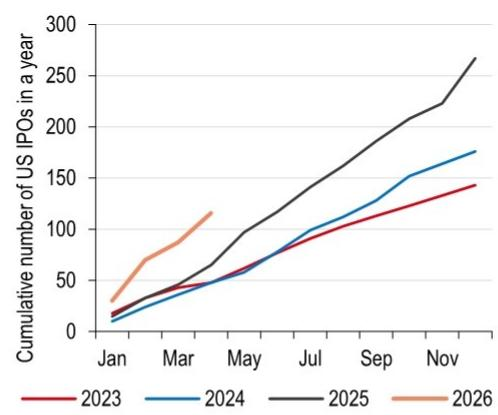

line

| Month | 2023 | 2024 | 2025 | 2026 |
|-------|------|------|------|------|
| Jan   | 15   | 10   | 20   | 30   |
| Mar   | 40   | 30   | 50   | 80   |
| May   | 60   | 50   | 100  | 110  |
| Jul   | 90   | 80   | 140  | -    |
| Sep   | 110  | 130  | 180  | -    |
| Nov   | 140  | 170  | 270  | -    |

Source: Bloomberg, HSBC Includes only priced IPOs

... but still lagging behind the IPO tech spree in the late 1990s   
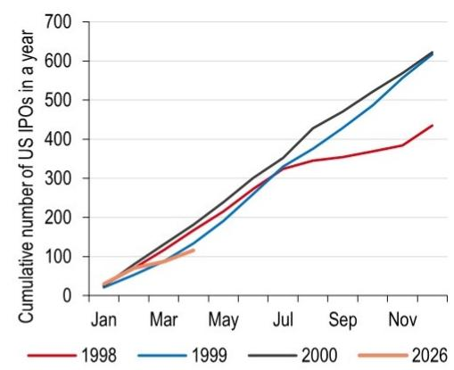

line

| Month | 1998 | 1999 | 2000 | 2026 |
|---|---|---|---|---|
| Jan | 30 | 35 | 35 | 35 |
| Mar | 100 | 120 | 140 | 100 |
| May | 200 | 180 | 220 | 120 |
| Jul | 320 | 340 | 360 | - |
| Sep | 350 | 420 | 440 | - |
| Nov | 380 | 580 | 620 | - |
| End | 430 | 620 | 630 | - |

Source: Bloomberg, HSBC Includes only priced IPOs

# Laggards catch up: potentially adding 100+ points

Geopolitical and trade policy uncertainty, while easing, remains elevated. Some sectors exposed to trade and geopolitical risks have underperformed. The consumer staples sector, for example, is feeling the hit to consumption from higher oil prices, alongside cost pressures linked to trade policy. Industrials is another area of vulnerability to trade, given the sector's reliance on imported inputs and exposure to supply-chain disruption, but overall, the sector is roughly flat since the Middle East conflict began as AI beneficiaries outperform. If uncertainty retreats to prior levels, these laggards (highlighted in chart below) could catch up, adding c130 points to the S&P 500.

US Geopolitical uncertainty remains at elevated levels...   
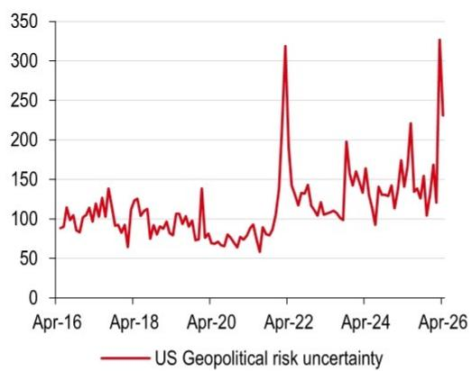

line

| Date   | US Geopolitical risk uncertainty |
|--------|----------------------------------|
| Apr-16 | ~100                             |
| Apr-18 | ~120                             |
| Apr-20 | ~80                              |
| Apr-22 | ~320                             |
| Apr-24 | ~180                             |
| Apr-26 | ~330                             |

Source: LSEG Datastream, HSBC

...while trade policy uncertainty is falling but still at higher than historical levels   
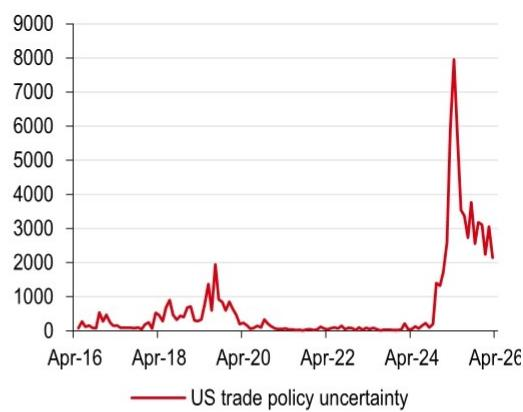

line

| Date    | US trade policy uncertainty |
|---------|-----------------------------|
| Apr-16  | ~0                          |
| Apr-18  | ~500                        |
| Apr-20  | ~2000                       |
| Apr-22  | ~0                          |
| Apr-24  | ~0                          |
| Apr-26  | ~8000                       |

Source: LSEG Datastream, HSBC

US industry groups performance since the start of the Iran conflict   
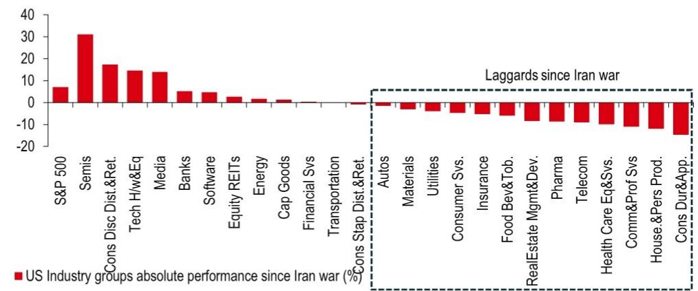

bar

| Sector | US Industry groups absolute performance since Iran war (%) |
|---|---|
| S&P 500 | 7 |
| Semis | 31 |
| Cons Disc Dist.&Ret. | 17 |
| Tech Hi/wEq | 14 |
| Media | 14 |
| Banks | 5 |
| Software | 4 |
| Equity REITs | 2 |
| Energy | 1 |
| Cap Goods | 1 |
| Financial Svs | -1 |
| Transportation | -1 |
| Cons Stap Dist.&Ret. | -1 |
Autos | -1 |
| Materials | -2 |
| Utilities | -3 |
| Consumer Svs. | -4 |
| Insurance | -5 |
| Food Bev&Tob. | -6 |
| RealEstate Mgmt&Dev. | -8 |
| Pharma | -9 |
| Telecom | -10 |
| Health Care Eq&Svs. | -11 |
| Comm&Prof Svs | -12 |
| House.&Pers Prod. | -13 |
| Cons Dur&App. | -15 |

Source: FactSet, HSBC

# AI efficiency gains broaden: potentially adding 200 points

Better sentiment around AI adoption and efficiency-driven margin improvement has been centered on tech so far, but as adoption widens, the market could start pricing in higher margins across other sectors—particularly those that are more labor-intensive. A rebound in sentiment around AI adoption and disruption would likely hinge on a re-rating, supported by clearer evidence of margin and profitability benefits. A major sentiment shift leading to a re-rating for AI adopters could add c200 points to the S&P 500 (assuming both software and financials re-rate).

AI adoption by US businesses is rising overall...   
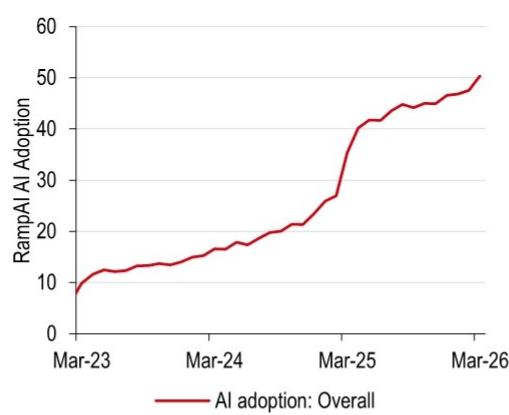

line

| Date   | RampAI Adoption |
| ------ | --------------- |
| Mar-23 | 8               |
| Mar-24 | 16              |
| Mar-25 | 40              |
| Mar-26 | 50              |

Source: Ramp AI, HSBC   
Note: Percentage of US businesses adopting AI

... with certain sectors increasingly reporting the use of AI   
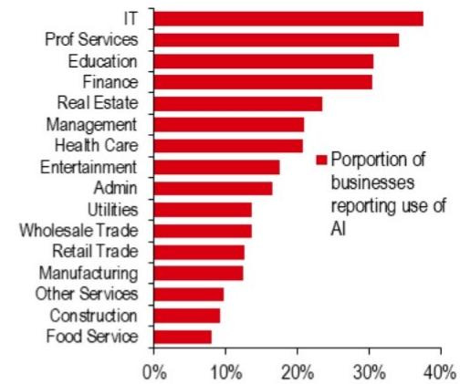

bar

| Sector | Proportion of businesses reporting use of AI (%) |
| :--- | :--- |
| IT | 38 |
| Prof Services | 34 |
| Education | 30 |
| Finance | 30 |
| Real Estate | 23 |
| Management | 21 |
| Health Care | 20 |
| Entertainment | 17 |
| Admin | 16 |
| Utilities | 13 |
| Wholesale Trade | 13 |
| Retail Trade | 12 |
| Manufacturing | 12 |
| Other Services | 10 |
| Construction | 9 |
| Food Service | 8 |

Source: US Consensus Bureau, HSBC

Net profit margins for the tech sector have risen exponentially...   
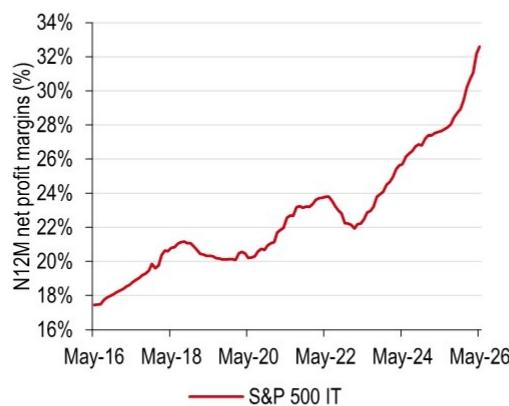

line

| Date   | N12M net profit margins (%) |
|--------|-----------------------------|
| May-16 | 17%                         |
| May-18 | 21%                         |
| May-20 | 20%                         |
| May-22 | 24%                         |
| May-24 | 28%                         |
| May-26 | 33%                         |

Source: FactSet, HSBC

...while the rest of the index is also seeing margin gains but at a slower pace   
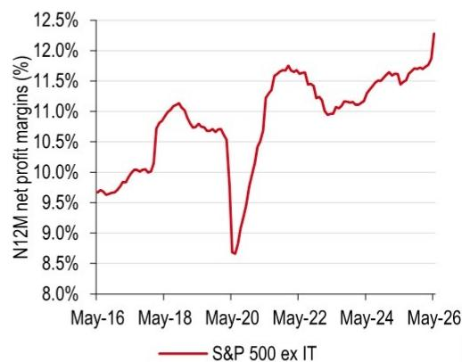

line

| Date   | N12M net profit margins (%) |
|--------|-----------------------------|
| May-16 | 9.5%                        |
| May-18 | 11.0%                       |
| May-20 | 8.5%                        |
| May-22 | 11.5%                       |
| May-24 | 11.0%                       |
| May-26 | 12.0%                       |

Source: FactSet, HSBC

# Goldilocks backdrop returns: potentially adding 300 points

Macro sentiment improves – US 10-year Treasury yields are once again rising, getting close to the “danger zone” cited by our multi-asset team as the level at which risk assets tend to falter. Hawkish messaging from certain Fed members, alongside solid jobs growth and higher headline inflation pushed yields higher, though they’ve since eased somewhat. US mortgage rates also remain stubbornly above 6%. If yields move lower in a Goldilocks scenario – disinflation continuing towards 2% alongside resilient growth – equity valuations and earnings would likely lift, potentially adding c300 points to the S&P 500.

Tech has outperformed in spite of rising treasury yields...   
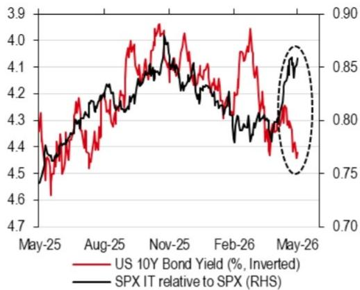

line

| Date   | US 10Y Bond Yield (%, Inverted) | SPX IT relative to SPX (RHS) |
|--------|----------------------------------|------------------------------|
| May-25 | 4.3                              | 0.70                         |
| Aug-25 | 4.2                              | 0.75                         |
| Nov-25 | 4.1                              | 0.80                         |
| Feb-26 | 4.0                              | 0.85                         |
| May-26 | 3.9                              | 0.90                         |

Source: LSEG Datastream, HSBC

...but rates could become more relevant for sector performance as capex rises   
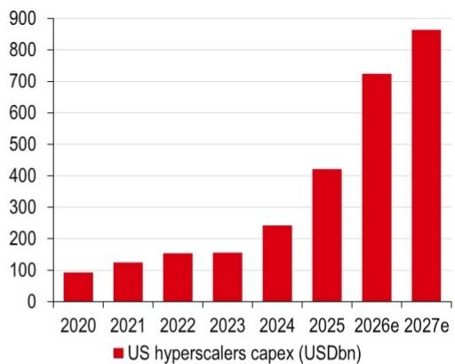

bar

| Year | US hyperscalers capex (USDbn) |
|---|---|
| 2020 | 95 |
| 2021 | 125 |
| 2022 | 155 |
| 2023 | 160 |
| 2024 | 240 |
| 2025 | 420 |
| 2026e | 720 |
| 2027e | 860 |

Source: FactSet, HSBC Hyperscalers include Amazon (AMZN US, Buy, CMP USD271.17); Alphabet (GOOGL US, Buy, CMP USD397.99), Meta Platforms (META US, Buy, CMP USD616.81); Microsoft (MSFT US, Buy, CMP USD420.77); and Oracle (ORCL US, Buy, CMP USD194.59). Prices as of close on 7 May 2026

S&P 500 sensitivity table to bond yields and earnings growth 

<table><tr><td rowspan="2" colspan="2"></td><td colspan="6">US 10Y bond yield (%)</td></tr><tr><td>3.0</td><td>3.5</td><td>4.0</td><td>4.3</td><td>4.5</td><td>5.0</td></tr><tr><td rowspan="6">2026 EPS</td><td>11%</td><td>7220</td><td>7150</td><td>7090</td><td>7050</td><td>7030</td><td>6970</td></tr><tr><td>15%</td><td>7460</td><td>7400</td><td>7330</td><td>7290</td><td>7260</td><td>7200</td></tr><tr><td>17%</td><td>7580</td><td>7510</td><td>7446</td><td>7410</td><td>7380</td><td>7310</td></tr><tr><td>20%</td><td>7820</td><td>7760</td><td>7690</td><td>7650</td><td>7620</td><td>7550</td></tr><tr><td>24%</td><td>8060</td><td>7990</td><td>7900</td><td>7880</td><td>7850</td><td>7780</td></tr><tr><td>26%</td><td>8180</td><td>8110</td><td>8040</td><td>7990</td><td>7970</td><td>7900</td></tr></table>

Source: LSEG Datastream, FactSet, HSBC Shaded cells represent S&P index target at 4% 10Y bond yields, Dark shaded cell represents current S&P target

# Tech and its relevance in the index

Mag 7 + IT market weight within S&P 500 close to all time high ...   
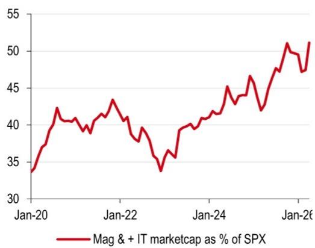

line

| Date   | Mag & + IT marketcap as % of SPX |
|--------|-----------------------------------|
| Jan-20 | 34                                |
| Jan-21 | 42                                |
| Jan-22 | 43                                |
| Jan-23 | 34                                |
| Jan-24 | 45                                |
| Jan-25 | 47                                |
| Jan-26 | 51                                |

Source: FactSet, HSBC

...and its forward 12-month earnings weight steadily moves higher   
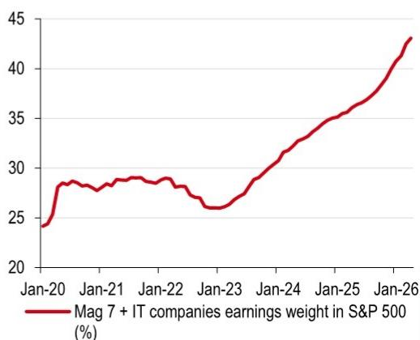

line

| Date   | Mag 7 + IT companies earnings weight in S&P 500 (%) |
|--------|--------------------------------------------------|
| Jan-20 | 24.0                                             |
| Jan-21 | 28.5                                             |
| Jan-22 | 29.0                                             |
| Jan-23 | 26.0                                             |
| Jan-24 | 31.0                                             |
| Jan-25 | 35.0                                             |
| Jan-26 | 43.0                                             |

Source: FactSet, HSBC

Earnings growth expectations for the S&P excluding tech in the low double digits   
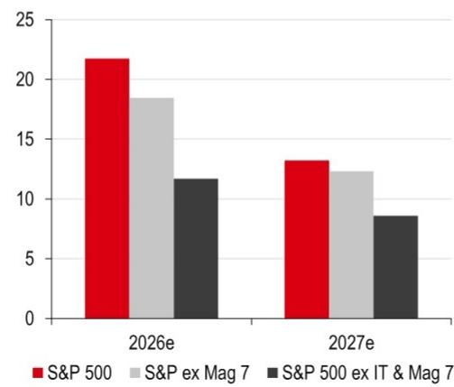

bar

| Year | S&P 500 | S&P ex Mag 7 | S&P 500 ex IT & Mag 7 |
|---|---|---|---|
| 2026e | 21.8 | 18.4 | 11.7 |
| 2027e | 13.3 | 12.3 | 8.7 |

Source: FactSet, HSBC

Capex growth still driven by the Mag7 and tech cohort   
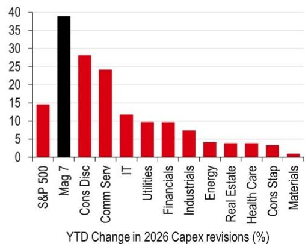

bar

YTD Change in 2026 Capex revisions (%)
| Sector | YTD Change (%) |
| :--- | :--- |
| S&P 500 | 14 |
| Mag 7 | 39 |
| Cons Disc | 28 |
| Comm Serv | 24 |
| IT | 12 |
| Utilities | 10 |
| Financials | 10 |
| Industrials | 7 |
| Energy | 4 |
| Real Estate | 4 |
| Health Care | 4 |
| Cons Stap | 3 |
| Materials | 1 |

Source: LSEG Datastream, HSBC

Semis and Tech hardware & equipment seeing strong earnings revisions...   
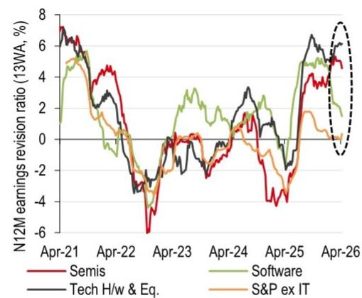

line

| Date   | Semis | Tech H/w & Eq. | Software | S&P ex IT |
|--------|-------|----------------|----------|-----------|
| Apr-21 | 7.0   | 7.0            | 5.0      | 5.0       |
| Apr-22 | 4.0   | 3.0            | 2.0      | 1.0       |
| Apr-23 | -6.0  | -3.0           | -2.0     | -1.0      |
| Apr-24 | 1.0   | 2.0            | 3.0      | 1.0       |
| Apr-25 | 4.0   | 6.0            | 5.0      | 2.0       |
| Apr-26 | 5.0   | 7.0            | 6.0      | 3.0       |

Source: IBES, LSEG Datastream, HSBC

...as IT and Mag 7 see one of the strongest earnings growth potential in 2026e   
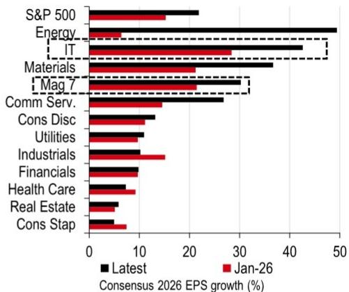

bar

| Sector | Latest (%) | Jan-26 (%) |
| :--- | :--- | :--- |
| S&P 500 | 22 | 15 |
| Energy | 49 | 5 |
| IT | 43 | 28 |
| Materials | 36 | 20 |
| Mag 7 | 30 | 20 |
| Comm Serv. | 27 | 15 |
| Cons Disc | 13 | 11 |
| Utilities | 11 | 9 |
| Industrials | 10 | 15 |
| Financials | 9 | 10 |
| Health Care | 8 | 8 |
| Real Estate | 6 | 6 |
| Cons Stap | 5 | 7 |

Source FactSet, HSBC

# Valuations

S&P 500 trades at $5\%$ premium to its five-year average   
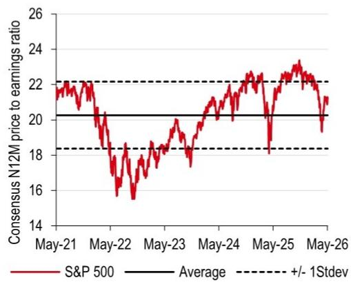

line

| Date   | S&P 500 | Average | +/- 1Stdev |
|--------|---------|---------|------------|
| May-21 | 22      | 20      | 18         |
| May-22 | 16      | 20      | 18         |
| May-23 | 18      | 20      | 18         |
| May-24 | 20      | 20      | 18         |
| May-25 | 23      | 20      | 18         |
| May-26 | 21      | 20      | 18         |

Source: FactSet, HSBC

Even when excluding tech, S&P 500 trades at a 5% premium to historical average   
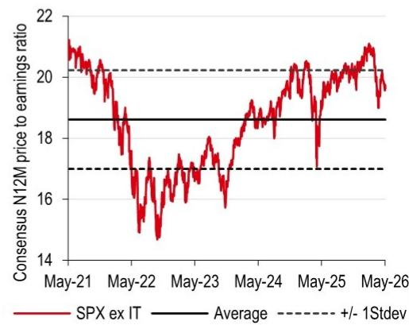

line

| Date   | SPX ex IT | Average | +/- 1Stdev |
|--------|-----------|---------|------------|
| May-21 | 21.0      | 18.5    | 20.0       |
| May-22 | 15.0      | 18.5    | 20.0       |
| May-23 | 17.0      | 18.5    | 20.0       |
| May-24 | 19.0      | 18.5    | 20.0       |
| May-25 | 20.0      | 18.5    | 20.0       |
| May-26 | 21.0      | 18.5    | 20.0       |

Source: FactSet, HSBC

Tech has de-rated, now trading at a 4% discount to historical average...   
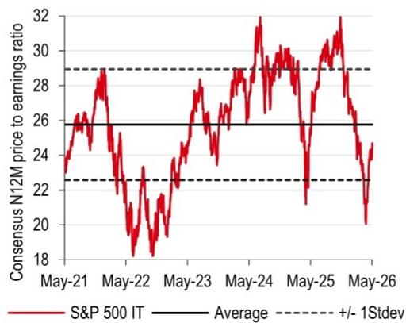

line

| Date   | S&P 500 IT | Average | +/- 1Stdev |
|--------|------------|---------|------------|
| May-21 | 26         | 26      | 28         |
| May-22 | 18         | 26      | 28         |
| May-23 | 24         | 26      | 28         |
| May-24 | 30         | 26      | 28         |
| May-25 | 22         | 26      | 28         |
| May-26 | 20         | 26      | 28         |

Source FactSet, HSBC

...and the Mag 6 cohort as well trades at an $8 \%$ discount to 5- year average   
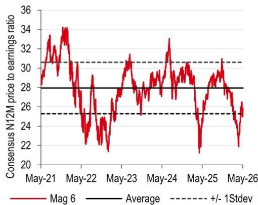

line

| Date   | Consensus N12M price to earnings ratio |
|--------|----------------------------------------|
| May-21 | 30                                     |
| May-22 | 28                                     |
| May-23 | 30                                     |
| May-24 | 30                                     |
| May-25 | 28                                     |
| May-26 | 26                                     |

Source: FactSet, HSBC  
Mag 6 denotes Microsoft (MSFT US, Buy, CMP USD420.77); NVIDIA (NVDA US, Buy, CMP USD211.50); Amazon (AMZN US, Buy, CMP USD271.17); Alphabet (GOOGL US, Buy, CMP USD397.99), Meta Platforms (META US, Buy, CMP USD616.81); and Apple (AAPL US, Buy, CMP USD287.44). Prices as of close on 7 May 2026

# Disclosure appendix

# Analyst Certification

The following analyst(s), economist(s), or strategist(s) who is(are) primarily responsible for this report, including any analyst(s) whose name(s) appear(s) as author of an individual section or sections of the report and any analyst(s) named as the covering analyst(s) of a sUBSidiary company in a sum-of-the-parts valuation certifies(y) that the opinion(s) on the subject security(ies) or issuer(s), any views or forecasts expressed in the section(s) of which such individual(s) is(are) named as author(s), and any other views or forecasts expressed herein, including any views expressed on the back page of the research report, accurately reflect their personal view(s) and that no part of their compensation was, is or will be directly or indirectly related to the specific recommendation(s) or views contained in this research report: Nicole Inui, CFA and Alastair Pinder, CFA

# Important disclosures

# Equities: Stock ratings and basis for financial analysis

HSBC and its affiliates, including the issuer of this report ("HSBC") believes an investor's decision to buy or sell a stock should depend on individual circumstances such as the investor's existing holdings, risk tolerance and other considerations and that investors utilise various disciplines and investment horizons when making investment decisions. Ratings should not be used or relied on in isolation as investment advice. Different securities firms use a variety of ratings terms as well as different rating systems to describe their recommendations and therefore investors should carefully read the definitions of the ratings used in each research report. Further, investors should carefully read the entire research report and not infer its contents from the rating because research reports contain more complete information concerning the analysts' views and the basis for the rating.

# From 23rd March 2015 HSBC has assigned ratings on the following basis:

The target price is based on the analyst's assessment of the stock's actual current value, although we expect it to take six to 12 months for the market price to reflect this. When the target price is more than $20\%$ above the current share price, the stock will be classified as a Buy; when it is between $5\%$ and $20\%$ above the current share price, the stock may be classified as a Buy or a Hold; when it is between $5\%$ below and $5\%$ above the current share price, the stock will be classified as a Hold; when it is between $5\%$ and $20\%$ below the current share price, the stock may be classified as a Hold or a Reduce; and when it is more than $20\%$ below the current share price, the stock will be classified as a Reduce.

Our ratings are re-calibrated against these bands at the time of any 'material change' (initiation or resumption of coverage, change in target price or estimates).

Upside/Downside is the percentage difference between the target price and the share price.

# Prior to this date, HSBC's rating structure was applied on the following basis:

For each stock we set a required rate of return calculated from the cost of equity for that stock's domestic or, as appropriate, regional market established by our strategy team. The target price for a stock represented the value the analyst expected the stock to reach over our performance horizon. The performance horizon was 12 months. For a stock to be classified as Overweight, the potential return, which equals the percentage difference between the current share price and the target price, including the forecast dividend yield when indicated, had to exceed the required return by at least 5 percentage points over the succeeding 12 months (or 10 percentage points for a stock classified as Volatile\*). For a stock to be classified as Underweight, the stock was expected to underperform its required return by at least 5 percentage points over the succeeding 12 months (or 10 percentage points for a stock classified as Volatile\*). Stocks between these bands were classified as Neutral.

\*A stock was classified as volatile if its historical volatility had exceeded $40\%$ , if the stock had been listed for less than 12 months (unless it was in an industry or sector where volatility is low) or if the analyst expected significant volatility. However, stocks which we did not consider volatile may in fact also have behaved in such a way. Historical volatility was defined as the past month's average of the daily 365-day moving average volatilities. In order to avoid misleadingly frequent changes in rating, however, volatility had to move 2.5 percentage points past the $40\%$ benchmark in either direction for a stock's status to change.

# Rating distribution for long-term investment opportunities

As of 31 March 2026, the distribution of all independent ratings published by HSBC is as follows: 

<table><tr><td>Buy</td><td>59%</td><td>(12% of these provided with Investment Banking Services in the past 12 months)</td></tr><tr><td>Hold</td><td>36%</td><td>(12% of these provided with Investment Banking Services in the past 12 months)</td></tr><tr><td>Sell</td><td>6%</td><td>(6% of these provided with Investment Banking Services in the past 12 months)</td></tr></table>

For the purposes of the distribution above the following mapping structure is used during the transition from the previous to current rating models: under our previous model, Overweight = Buy, Neutral = Hold and Underweight = Sell; under our current model Buy = Buy, Hold = Hold and Reduce = Sell. For rating definitions under both models, please see “Stock ratings and basis for financial analysis” above.

For the distribution of non-independent ratings published by HSBC, please see the disclosure page available at http://www.HSBCnet.com/gbm/financial-regulation/investment-recommendations-disclosures.

To view a list of all the independent fundamental ratings/recommendations disseminated by HSBC during the preceding 12-month period, and the location where we publish our quarterly distribution of non-fundamental recommendations (applicable to Fixed Income and Currencies research only), please use the following links to access the disclosure page:

Clients of HSBC Private Bank: www.research.privatebank.HSBC.com/Disclosures

All other clients: www.research.HSBC.com/A/Disclosures

HSBC and its affiliates will from time to time sell to and buy from customers the securities/instruments, both equity and debt (including derivatives) of companies covered in HSBC on a principal or agency basis or act as a market maker or liquidity provider in the securities/instruments mentioned in this report.

Analysts, economists, and strategists are paid in part by reference to the profitability of HSBC which includes investment banking, sales & trading, and principal trading revenues.

Whether, or in what time frame, an update of this analysis will be published is not determined in advance.

Non-U.S. analysts may not be associated persons of HSBC Securities (USA) Inc, and therefore may not be subject to FINRA Rule 2241 or FINRA Rule 2242 restrictions on communications with the subject company, public appearances and trading securities held by the analysts.

Economic sanctions laws imposed by certain jurisdictions such as the US, the EU, the UK, and others, may prohibit persons subject to those laws from making certain types of investments, including by transacting or dealing in securities of particular issuers, sectors, or regions. This report does not constitute advice in relation to any such laws and should not be construed as an inducement to transact in securities in breach of such laws.

For disclosures in respect of any company mentioned in this report, please see the most recently published report on that company available at www.HSBCnet.com/research. HSBC Private Bank clients should contact their Relationship Manager for queries regarding other research reports. In order to find out more about the proprietary models used to produce this report, please contact the authoring analyst.

# Additional disclosures

1 This report is dated as at 11 May 2026.   
2 All market data included in this report are dated as at close 07 May 2026, unless a different date and/or a specific time of day is indicated in the report.   
3 HSBC has procedures in place to identify and manage any potential conflicts of interest that arise in connection with its Research business. HSBC's analysts and its other staff who are involved in the preparation and dissemination of Research operate and have a management reporting line independent of HSBC's Investment Banking business. Information Barrier procedures are in place between the Investment Banking, Principal Trading, and Research businesses to ensure that any confidential and/or price sensitive information is handled in an appropriate manner.   
4 You are not permitted to use, for reference, any data in this document for the purpose of (i) determining the interest payable, or other sums due, under loan agreements or under other financial contracts or instruments, (ii) determining the price at which a financial instrument may be bought or sold or traded or redeemed, or the value of a financial instrument, and/or (iii) measuring the performance of a financial instrument or of an investment fund.

# Production & distribution disclosures

1. This report was produced and signed off by the author on 11 May 2026 00:24 GMT.   
2. In order to see when this report was first disseminated please see the disclosure page available at https://www.research.HSBC.com/R/34/DnwCGVK

# Disclaimer

Legal entities as at 7 December 2024:

HSBC Bank plc; HSBC Continental Europe; HSBC Continental Europe SA, Germany; HSBC Bank Middle East Limited, DIFC; HSBC Bank Middle East Limited, UAE branch; HSBC Yatirim Menkul Degerler AS, Istanbul; The Hongkong and Shanghai Banking Corporation Limited, Hong Kong; The Hongkong and Shanghai Banking Corporation Limited, Singapore Branch; The Hongkong and Shanghai Banking Corporation Limited, Seoul Securities Branch; The Hongkong and Shanghai Banking Corporation Limited, Seoul Branch; HSBC Qianhai Securities Limited; HSBC Securities (Taiwan) Corporation Limited; HSBC Securities and Capital Markets (India) Private Limited, Mumbai; HSBC Bank Australia Limited; HSBC Securities (USA) Inc., New York; HSBC México, SA, Institución de Banca Múltiple, Grupo Financiero HSBC; Banco HSBC SA

Issuer of report

Banco HSBC S.A.

Juscelino Kubitschek Avenue, n°1909, 19° floor

Vila Olímpia – São Paulo – SP – Brazil

CEP 04543-907

Telephone: 55 11 2802 3252

Website: www.HSBC.com.br

This document has been elaborated, produced and approved by Banco HSBC S.A. for the general information of its "wholesale" customers. If this research is received by a customer of a HSBC Group member or affiliate, its provision to the recipient is subject to the terms of business in place between the recipient and such affiliate. As required by Resolution No. 20/2021 of the Securities and Exchange Commission of Brazil (Comissão de Valores Mobiliários), potential conflicts of interest concerning (i) HSBC Brazil and/or its affiliates; and (ii) the analyst(s) responsible for authoring this report are stated on the chart above labelled "HSBC & Analyst Disclosures". If it is received by a customer of an affiliate of HSBC, its provision to the recipient is subject to the terms of business in place between the recipient and such affiliate. This document is not and should not be construed as an offer to sell or the solicitation of an offer to purchase or sUBScribe for any investment. HSBC has based this document on information obtained from sources it believes to be reliable but which it has not independently verified; HSBC makes no guarantee, representation or warranty and accepts no responsibility or liability as to its accuracy or completeness. Expressions of opinion are those of the Research Division of HSBC only and are subject to change without notice. From time to time research analysts conduct site visits of covered issuers. HSBC policies prohibit research analysts from accepting payment or reimbursement for travel expenses from the issuer for such visits. HSBC and its affiliates and/or their officers, directors and employees may have positions in any securities mentioned in this document (or in any related investment) and may from time to time add to or dispose of any such securities (or investment). HSBC and its affiliates may act as market maker or have assumed an underwriting commitment in the securities of companies discussed in this document (or in related investments), may sell them to or buy them from customers on a principal basis and may also perform or seek to perform investment banking or underwriting services for or relating to those companies. The document is intended to be distributed in its entirety. Unless governing law permits otherwise, you must contact a HSBC Group member in your home jurisdiction if you wish to use HSBC Group services in effecting a transaction in any investment mentioned in this document.

In the UK, this publication is distributed by HSBC Bank plc for the information of its Clients (as defined in the Rules of FCA) and those of its affiliates only. Nothing herein excludes or restricts any duty or liability to a customer which HSBC Bank plc has under the Financial Services and Markets Act 2000 or under the Rules of FCA and PRA. A recipient who chooses to deal with any person who is not a representative of HSBC Bank plc in the UK will not enjoy the protections afforded by the UK regulatory regime. HSBC Bank plc is regulated by the Financial Conduct Authority and the Prudential Regulation Authority. In the European Economic Area, this publication has been distributed by HSBC Continental Europe or by such other HSBC affiliate from which the recipient receives relevant services.

HSBC Securities (USA) Inc. accepts responsibility for the content of this research report prepared by its non-US foreign affiliate. The information contained herein is under no circumstances to be construed as investment advice and is not tailored to the needs of the recipient. All U.S. persons receiving and/or accessing this report and wishing to effect transactions in any security discussed herein should do so with HSBC Securities (USA) Inc. in the United States and not with its non-US foreign affiliate, the issuer of this report.

In Japan, this publication has been distributed by HSBC Securities (Japan) Co., Ltd.. It may not be further distributed in whole or in part for any purpose. In Hong Kong, this document has been distributed by The Hongkong and Shanghai Banking Corporation Limited in the conduct of its Hong Kong regulated business for the information of its institutional and professional investor (as defined by the Securities and Future Ordinance (Chapter 5710) customers only; it is not intended for and should not be distributed to retail customers in Hong Kong, unless permitted otherwise. The Hongkong and Shanghai Banking Corporation Limited is regulated by the Hong Kong Monetary Authority. All enquires by recipients in Hong Kong must be directed to your HSBC contact in Hong Kong. If it is received by a customer of an affiliate of HSBC, its provision to the recipient is subject to the terms of business in place between the recipient and such affiliate. The Hongkong and Shanghai Banking Corporation Limited makes no representations that the products or services mentioned in this document are available to persons in Hong Kong or are necessarily suitable for any particular person or appropriate in accordance with local law. It may not be further distributed in whole or in part for any purpose.

In Singapore, this publication is distributed by The Hongkong and Shanghai Banking Corporation Limited, Singapore Branch for the general information of institutional investors or other persons specified in Sections 274 and 304 of the Securities and Futures Act 2001 of Singapore ("SFA") and accredited investors and other persons in accordance with the conditions specified in Sections 275 and 305 of the SFA. Only Economics or Currencies reports are intended for distribution to a person who is not an Accredited Investor, Expert Investor or Institutional Investor as defined in SFA. The Hongkong and Shanghai Banking Corporation Limited, Singapore Branch accepts legal responsibility for the contents of reports. This publication is not a prospectus as defined in the SFA. It may not be further distributed in whole or in part for any purpose. The Hongkong and Shanghai Banking Corporation Limited Singapore Branch is regulated by the Monetary Authority of Singapore. Recipients in Singapore should contact a "Hongkong and Shanghai Banking Corporation Limited, Singapore Branch" representative in respect of any matters arising from, or in connection with this report. Please refer to The Hongkong and Shanghai Banking Corporation Limited Singapore Branch's website at www.business.HSBC.com.sg for contact details.

In Korea, this publication is distributed by either The Hongkong and Shanghai Banking Corporation Limited, Seoul Securities Branch ("HBAP SLS") or The Hongkong and Shanghai Banking Corporation Limited, Seoul Branch ("HBAP SEL") for the general information of professional investors specified in Article 9 of the Financial Investment Services and Capital Markets Act ("FSCMA"). This publication is not a prospectus as defined in the FSCMA. It may not be further distributed in whole or in part for any purpose. Both HBAP SLS and HBAP SEL are regulated by the Financial Services Commission and the Financial Supervisory Service of Korea.

In Australia, this publication has been distributed by The Hongkong and Shanghai Banking Corporation Limited (ABN 65 117 925 970, AFSL 301737) for the general information of its "wholesale" customers (as defined in the Corporations Act 2001). Where distributed to retail customers, this research is distributed by HSBC Bank Australia Limited (ABN 48 006 434 162, AFSL No. 232595). These respective entities make no representations that the products or services mentioned in this document are available to persons in Australia or are necessarily suitable for any particular person or appropriate in accordance with local law. No consideration has been given to the particular investment objectives, financial situation or particular needs of any recipient.

HSBC México, S.A., Institución de Banca Múltiple, Grupo Financiero HSBC is authorized and regulated by Secretaría de Hacienda y Crédito Público and Comisión Nacional Bancaria y de Valores (CNBV).

If you are a customer of HSBC International Wealth & Premier Banking ("IWPB"), including HSBC Private Bank, you are eligible to receive this publication only if: (i) you have been approved to receive relevant research publications by an applicable HSBC legal entity; (ii) you have agreed to the applicable HSBC entity's terms and conditions and/or customer declaration for accessing research; and (iii) you have agreed to the terms and conditions of any other internet banking, online banking, mobile banking and/or investment services offered by that HSBC entity, through which you will access research publications (collectively with (ii), the "Terms"). If you do not meet the above eligibility requirements, please disregard this publication and, if you are a IWPB customer, please notify your Relationship Manager or call the relevant customer hotline. Distribution of this publication is the sole responsibility of the HSBC entity with whom you have agreed the Terms. Receipt of research publications is strictly subject to the Terms and any other conditions or disclaimers applicable to the provision of the publications that may be advised by IWPB.

© Copyright 2026, Banco HSBC S.A., ALL RIGHTS RESERVED. No part of this publication may be reproduced, stored in a retrieval system, or transmitted, on any form or by any means, electronic, mechanical, photocopying, recording, or otherwise, without the prior written permission of Banco HSBC S.A.

[1279064]