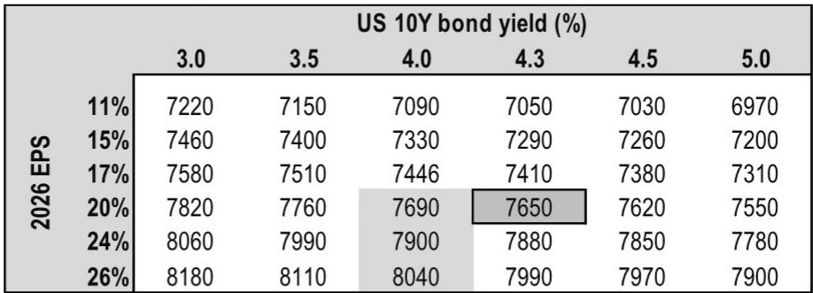
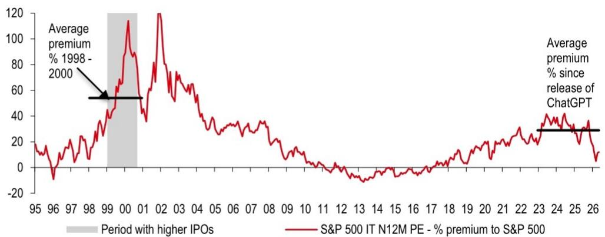

# S&P 500 突破 8000 点并非妄想，但真正驱动下一轮上涨的并非盈利增长本身

市场正在经历一个罕见的时刻：指数处于历史高位，但大多数股票仍低于 52 周高点。这份来自某外资投行股票策略团队的报告提出了一个看似激进的判断——标普 500 指数有望在 2026 年底突破 8000 点。但真正值得关注的不是这个数字本身，而是报告揭示的一个深层逻辑：下一轮上涨的驱动力将从盈利增长切换到情绪重估，而情绪重估的锚点，是科技板块的估值溢价是否能够重返甚至超越历史峰值。

报告将 2026 年底标普 500 目标价从 7500 点上调至 7650 点，主要基于每股盈利预测上调 8%。但更重要的信号在于，报告首次系统性地勾勒了指数突破 8000 点的四条路径，每条路径的核心驱动力都不是盈利，而是市场情绪的重新定价。这意味着，当前市场可能低估了“情绪杠杆”对指数的影响幅度。

## 1. 科技板块的估值溢价正在经历一个被忽视的结构性重置窗口

科技公司（含超大规模云厂商）目前占标普 500 市值超过一半，贡献指数盈利超过 40%。报告指出，科技板块当前 12 个月远期市盈率为 25.8 倍，低于历史峰值水平。如果板块估值重返历史高点，将直接为指数贡献约 360 点。而如果 AI/科技公司的 IPO 热潮推高整个板块的估值基准，科技板块溢价可能超越历史峰值，贡献 700 点甚至更多。

这里的关键参照系是 1990 年代末的互联网泡沫时期：当时科技股相对全市场平均溢价超过 50%。而当前，自 ChatGPT 发布以来，科技板块的平均溢价仅为 12%。这个对比本身并不暗示泡沫重演，而是揭示了一个事实：即便经历了过去两年的 AI 主题大幅上涨，科技板块的估值溢价仍远未达到极端水平。这意味着，如果 AI 商业化进程持续验证市场预期，科技板块的估值重估空间可能比多数投资者想象的更大。

但报告没有充分展开的一个问题是：当前科技板块的盈利增长质量与 1990 年代末是否存在本质差异？1990 年代末的盈利增长更多来自资本利得和股权激励，而当前科技巨头的盈利更多来自实际业务现金流。如果这一判断成立，那么当前较低估值溢价对应的可能不是“安全边际”，而是市场对科技盈利可持续性的系统性低估。

## 2. 滞后板块的补涨机会可能被低估，但触发条件比想象中更苛刻

报告识别出地缘政治和贸易政策不确定性是压制部分板块表现的核心因素。自中东冲突以来，消费品、工业、材料等板块显著跑输。如果不确定性消退至此前水平，这些滞后板块的补涨可能为指数贡献约 130 点。

这个判断的逻辑链条是清晰的：地缘政治风险溢价压缩了部分板块的估值，而这些风险溢价一旦回落，估值修复将释放可观的上行空间。但这里存在一个报告没有明确讨论的结构性问题——滞后板块的补涨可能不是线性的。消费品和工业板块当前的利润率压力不仅来自地缘政治，还来自持续的工资通胀和供应链重构成本。即使地缘政治风险消退，这些结构性成本可能也不会完全消失。因此，补涨幅度可能低于历史经验暗示的水平。

另一个值得关注的细节是：报告展示的行业表现图表中，半导体板块自中东冲突以来上涨 31%，而消费品板块下跌 13%。这种分化不仅是风险偏好的体现，更反映了 AI 投资周期对不同行业的差异化影响。滞后板块的补涨，可能需要的不是“不确定性消退”这一单一条件，而是 AI 投资红利从科技向传统行业的实质性外溢。

## 3. AI 效率提升的扩散效应是当前市场最被低估的定价因子

报告指出，AI 采纳率上升带来的利润率改善目前主要集中在科技板块。科技板块 12 个月净利润率已从 2016 年的 17% 攀升至当前的 33%，而指数其余部分的利润率仅从 9.5% 升至 12%。如果市场开始将 AI 驱动的利润率改善定价到其他板块——尤其是软件和金融——这将为指数贡献约 200 点。

这个判断的核心假设是：AI 对利润率的提升效应将从科技板块外溢至更多劳动密集型行业。美国人口调查局的数据显示，金融、专业服务、教育等行业的 AI 采纳率正在快速上升，这为利润率改善提供了微观基础。

但报告没有深入讨论的是，利润率改善的传导机制可能比预期的更慢。AI 采纳率的上升并不自动转化为利润率提升，中间需要经过投资周期、组织变革和竞争格局重塑等多个环节。此外，AI 对利润率的提升可能被竞争性定价所抵消——如果所有企业同时使用 AI 降本，价格竞争可能压缩利润空间。这个“竞争性侵蚀”效应在报告的分析框架中尚未被充分建模。

## 4. 利率环境与科技板块的关系正在发生结构性转变

报告识别了一个关键但容易被忽视的变化：科技板块与长期利率的相关性正在减弱。过去一年，科技股在利率上升的环境下依然表现强劲。但随着超大规模云厂商的资本开支预计从 2024 年的 2400 亿美元飙升至 2027 年的 8600 亿美元，利率环境对科技板块的影响可能重新变得重要。

这个判断的深层含义是：科技板块对利率的“免疫”可能是暂时的。当科技公司的资本开支占自由现金流的比例持续上升时，融资成本将重新成为估值的重要变量。报告提供的敏感性表格显示，在 20% 的盈利增长假设下，10 年期国债收益率从 4.3% 降至 3.0% 将为指数贡献约 170 点；反之，收益率升至 5.0% 将抹去约 100 点。

这里报告没有完全展开的一个问题是：资本开支的“回报期”与市场定价的时间维度可能存在错配。超大规模云厂商当前的资本开支主要用于建设 AI 基础设施，但这些投资的回报可能需要 3-5 年才能完全体现。如果市场在此期间因利率上升而降低估值倍数，这些公司可能面临“盈利增长被估值收缩抵消”的局面。这是当前 AI 投资主题中最值得警惕的定价风险。

## 5. 报告尚未完全回答的关键问题：下行风险的非对称性

报告列出的下行风险——科技盈利放缓、能源供给冲击、美联储转向加息——都是合理的担忧。但真正值得深入分析的是这些风险的非对称性：上行空间（从 7650 到 8000+ 点）与下行空间之间的不对称程度。

当前标普 500 的估值已处于 5 年平均水平之上 5% 的溢价位置。在估值偏高的背景下，负面冲击的影响往往比正面冲击更剧烈。报告展示的敏感性表格暗示，在相同的盈利增长假设下，利率变化对指数的影响幅度约为每 50 个基点对应 100-150 点。但历史经验表明，在估值高位时，利率冲击的实际影响往往大于线性模型的预测。

另一个报告没有充分讨论的风险点是：科技板块的盈利集中度。当前 Mag 7 加 IT 板块的盈利权重已升至 43%，这意味着指数盈利增长的可持续性高度依赖少数几家公司的表现。如果其中任何一家出现盈利预警，其对指数的冲击将远超历史均值。

## 6. 投资者需要建立的观察框架：从“是否突破 8000”转向“突破的条件是否成熟”

与其争论标普 500 能否突破 8000 点，不如建立一个更务实的观察框架，跟踪报告提出的四条路径的触发条件是否逐步兑现。

第一个观察点是科技 IPO 市场的活跃度。报告数据显示，2026 年 IPO 数量已显著回升，但仍远低于 1990 年代末的水平。如果 AI 公司的 IPO 定价持续超出预期，这将为科技板块的估值溢价提供新的参照基准。投资者可以关注 IPO 首日涨幅和后续表现，这比单纯的数量更有信号意义。

第二个观察点是地缘政治风险指标的边际变化。报告引用的美国地缘政治风险指数仍处于历史高位。如果这一指标出现趋势性回落，滞后板块的补涨逻辑将获得验证。但需要警惕的是，风险指标的下降可能已经被部分定价。

第三个观察点是 AI 采纳率与利润率之间的传导时滞。报告显示 AI 采纳率在快速上升，但利润率改善仍集中在科技板块。如果非科技板块的利润率开始出现可观测的加速，这将是 AI 效率扩散效应启动的最直接证据。

第四个观察点是超大规模云厂商的资本开支与自由现金流之间的关系。如果资本开支增速开始放缓，或者现金流开始改善，这将缓解市场对“投资回报期过长”的担忧，从而降低利率对科技估值的压制。

这些观察框架的核心意义在于：将注意力从“指数点位”转移到“条件验证”。市场可能不会在短期内给出明确的 8000 点答案，但会逐步提供这些条件是否兑现的信号。

---

这份报告的价值不在于给出了一个具体的指数目标，而在于系统性地拆解了市场情绪如何成为下一轮上涨的核心变量。情绪重估的逻辑链条是清晰的，但每个环节都存在尚未完全回答的问题：科技溢价重返历史峰值的条件是否已经具备？滞后板块的补涨是否会被结构性成本压制？AI 效率扩散的速度是否足以抵消竞争性侵蚀？利率与科技板块的关系是否真的发生了结构性转变？

这些问题的答案，可能需要更长时间的市场验证，也需要更深入的产业跟踪。我们将在社群中持续拆解这些未解问题，结合更多一手数据和产业调研，与读者一起跟踪这些关键条件的演变。如果你对这些问题的深层逻辑感兴趣，欢迎来我们的社群继续讨论——那里有更完整的报告原文、更细致的图表拆解，以及不同视角的碰撞。

Personal reading notes and learning share only. Not investment advice.

