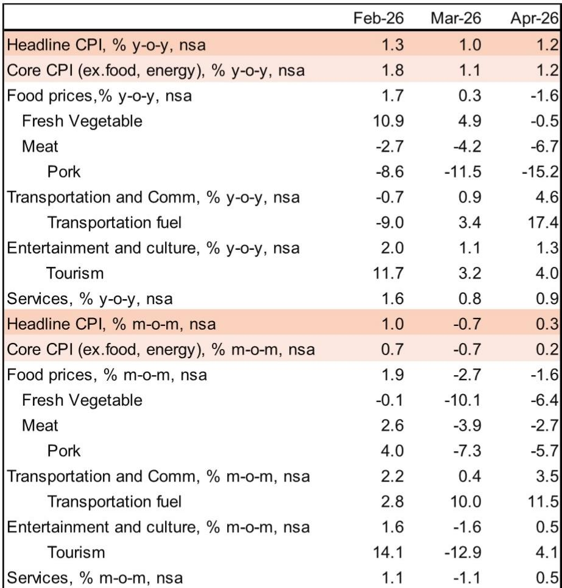
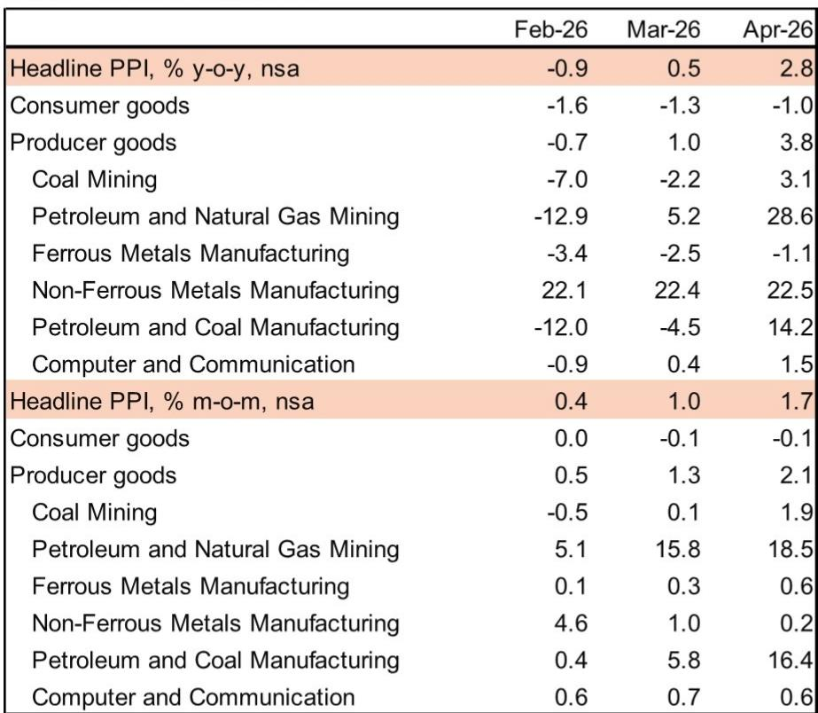
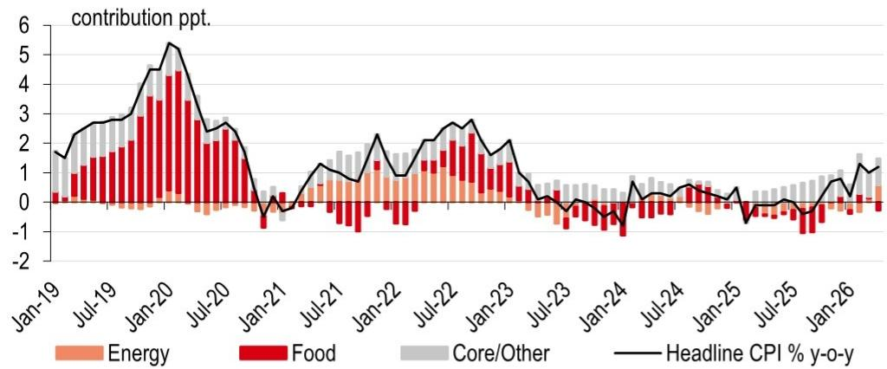

# 市场真正低估的不是通胀本身，而是成本传导的结构性断裂

4月的中国通胀数据看起来平淡无奇：CPI同比1.2%，核心CPI同比1.2%，PPI同比2.8%。但拆开来看，这组数字背后藏着一条正在收紧的利润链——上游能源价格已经翻涌，中游企业正在咬牙消化成本，下游却几乎纹丝不动。某外资投行在最新研报中给出了一个值得反复推敲的判断：如果能源价格持续高位，中游企业将不得不向客户转嫁成本，即使这意味着市场份额的流失。

这不是一个关于通胀高低的讨论，而是一个关于利润分配和竞争格局重新洗牌的信号。报告中最有价值的洞察，不是PPI超预期了多少，而是“成本传导到哪个环节会断掉”——以及断掉之后，谁受损、谁受益、政策会如何干预。

## 1. PPI超预期的真正推手不是需求，而是能源成本的快速传导

4月PPI同比从0.5%跳升至2.8%，远超市场预期的1.8%。报告指出，最直接的驱动力来自石油相关的上游行业。石油和天然气开采、煤炭开采、石油煤炭加工这三个板块对PPI同比的贡献较3月增加了约1.1个百分点。

这不是需求拉动的涨价。布伦特原油在报告撰写时已超过每桶100美元，而去年5月均价仅为64美元。低基数叠加地缘冲突的持续发酵，使得能源价格传导变得异常迅速。但关键在于，这种传导并不均匀——上游几乎全盘接收了油价冲击，而中游和下游的反应则呈现出明显的梯度衰减。

这意味着什么？对于那些身处中游、以石油为原材料的企业来说，成本压力正在以超出预期的速度积累。而它们能否将成本转嫁出去，将直接决定未来几个季度的利润率走向。

## 2. 中游行业已经出现成本转嫁的早期信号，但幅度远不及上游

报告中有两个值得关注的数字。第一，化学原料及化学制品、化学纤维这两个中游行业的PPI同比在4月转为正增长，这是自2024年8月和9月以来的首次。第二，报告估算这两个板块对PPI同比的贡献较3月增加了约0.7个百分点。

但更重要的判断是：它们的价格上涨幅度仍然明显滞后于上游。也就是说，中游企业正在提价，但提价速度跟不上成本上升的速度。报告明确指出了这种风险——利润空间正在被压缩。

这不是一个短期波动的问题。如果能源价格持续高位，中游企业的利润承压将从一个季度的问题演变为一个结构性挑战。那些定价能力强、客户粘性高的企业可能还能撑住，但依赖价格竞争、缺乏议价权的企业将面临真正的考验。

## 3. 下游消费品行业尚未感受到冲击，但这恰恰是最大的不确定性

与中游形成鲜明对比的是，下游消费品行业的价格反应几乎为零。报告中的图表4清晰地展示了这一点：PPI中的生产资料价格在4月环比上涨2.2%，而生活资料价格环比反而微降0.1%。

这意味着什么？下游企业目前还在自行消化成本压力，没有将涨价传导给终端消费者。但报告对此提出了一个重要的前瞻判断：如果能源价格持续高位，这些下游企业最终将不得不转嫁成本，即使这意味着市场份额的损失。

这里有一个值得追问的问题：为什么下游企业现在还能扛住？是因为需求太弱、不敢涨价？还是因为库存缓冲、暂时还能消化？报告没有给出确定答案，但这恰恰是后续观察的核心变量。如果下游开始涨价，核心CPI将面临上行压力，政策层面可能不得不对受影响较大的群体提供额外支持。

## 4. CPI表面平稳的背后，猪肉和能源正在上演“冰火两重天”

4月CPI同比1.2%，看似温和。但拆开来看，内部结构极为分化。

能源板块是最大的正向拉动。车用燃料价格同比上涨17.4%，创下2022年10月以来最高。但报告特别指出，发改委的成品油定价机制已经提供了缓冲——国内成品油价格的涨幅实际上滞后于国际油价的上涨幅度。这意味着，如果国际油价继续走高，国内燃油价格还有进一步上调的空间。

而食品板块则成为拖累。猪肉价格同比下跌15.2%，已经是连续第11个月同比下降。供需失衡的问题已经引起了政策层面的关注——4月政治局会议明确提出要稳定生猪价格，农业农村部和发改委也释放了收紧产能管理的信号。

这两个变量的走向将决定未来CPI的节奏。能源推动CPI上行，猪肉拖累CPI下行，两者对冲之后，核心CPI才是真正的“温度计”。报告显示，剔除食品和能源后的核心CPI同比1.2%，环比走势基本符合季节性规律。但问题是，如果能源传导最终蔓延到核心CPI，这个温度计就会开始升温。

## 5. 报告尚未完全回答的关键问题：AI需求和“反内卷”能撑多久？

PPI超预期的另一个结构性因素值得单独讨论。报告提到，除了石油冲击之外，AI驱动的需求、全球铜价上涨、国内电气化进程以及“反内卷”措施也是PPI上行的推动力。电气机械、计算机通信、有色金属等板块的同比价格在4月继续走高。

这提供了一个不同于能源冲击的叙事——部分工业品价格的上涨是有真实需求支撑的，而不是单纯的成本推动。但报告没有展开的是：这些结构性因素的可持续性如何？AI资本开支周期能支撑多久？有色金属的供给约束是否会松动？“反内卷”措施对产能出清的实际效果如何？

这些问题的答案将决定PPI的上涨中，有多少是“好通胀”（需求拉动），有多少是“坏通胀”（成本推动）。而两者的区分，对于投资决策具有截然不同的含义。

## 6. 真正需要关注的不是通胀数字，而是利润分配格局的重塑

综合以上分析，这份报告给出的核心观察框架其实是一个“三段式传导模型”：

上游完全承接能源冲击，价格快速上涨，利润受益（如果成本可以转嫁）。

中游部分传导但幅度滞后，利润空间正在被压缩，考验议价能力和成本管控。

下游尚未传导，但压力正在积累，未来可能面临“涨不涨价”的两难选择。

对于产业决策者而言，这个框架意味着：未来几个季度的竞争胜负手，可能不在于需求增长有多快，而在于企业能否在成本压力下维持利润率。那些拥有品牌溢价、技术壁垒或客户粘性的企业，将更有能力消化或转嫁成本；而那些依赖规模扩张、价格竞争的企业，可能面临利润率的系统性压缩。

对于投资者而言，这个框架提供了一个筛选思路：在能源价格高企的背景下，哪些行业的利润分配格局正在改善，哪些正在恶化。上游资源品可能受益，中游制造业面临压力测试，下游消费品则需要观察传导时点和幅度。

报告中没有展开但值得追问的是：如果中游企业开始大规模转嫁成本，下游消费者的承受力如何？政策层面是否会通过补贴或价格管控来干预？这些二阶效应，才是这份研报数据背后最值得继续讨论的问题。

---

以上分析只是基于这份研报的初步解读。报告中还有大量关于部门间传导弹性、历史可比周期、以及政策响应路径的详细论证，以及更完整的图表和数据支撑，无法在一篇文章中全部展开。如果你对“成本传导何时会触及核心CPI”“猪肉产能调控的具体路径”“AI需求对工业品价格的持续拉动”等问题感兴趣，欢迎来星球微信群里继续讨论。我们将围绕这份报告的核心判断，进一步拆解那些报告没有完全回答、但值得持续追踪的关键变量。

Personal reading notes and learning share only. Not investment advice.

