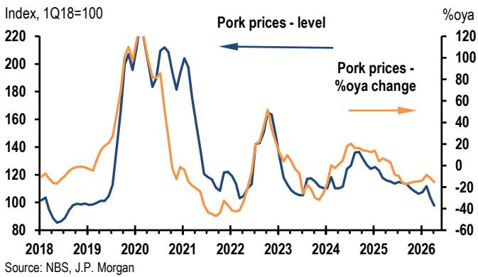
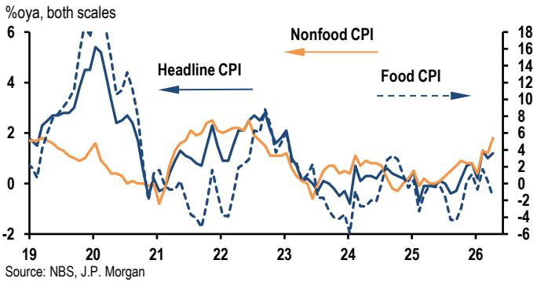
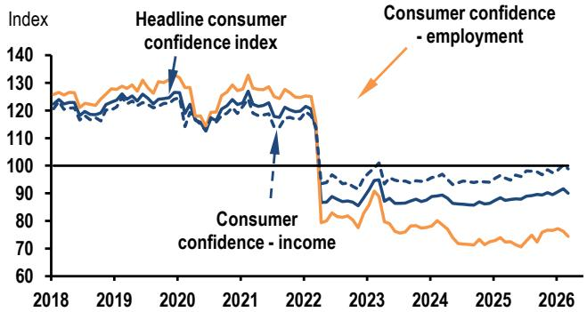

# Chinas Inflation Is No Longer a Demand Story: The Real Driver Is Imported Energy, and That Changes the Policy Calculus

The April inflation prints from China were not just a beat relative to consensus. They represent a structural shift in the composition of price pressures that forces a fundamental rethinking of how investors should interpret Chinas reflation narrative. Headline CPI rose 1.2 percent year-on-year, above the 0.9 percent consensus estimate, while PPI surged to 2.8 percent year-on-year, nearly double the 1.4 percent that markets had anticipated. These are not modest upside surprises. They are signals that a new price dynamic is taking hold, one driven less by domestic demand recovery and more by external energy shocks and supply-side discipline.

For the past two years, the dominant narrative on China has been one of persistent deflationary pressure, weak consumer confidence, and a property-led demand vacuum that kept both CPI and PPI in negative or near-zero territory. That narrative is now incomplete. The April data shows that prices are rising, but the composition reveals a critical distinction: the upward momentum is concentrated in energy, energy-related producer goods, and travel services tied to holiday seasons, while core consumer inflation remains tepid and food prices continue to drag. This is not the broad-based reflation that policymakers would celebrate. It is a cost-push inflation imported through the Strait of Hormuz, layered on top of a domestic economy that still lacks self-sustaining demand.

The strategic implication is uncomfortable. Chinas policymakers now face a dilemma they have not had to manage in years: rising producer prices that squeeze margins for downstream manufacturers, combined with consumer inflation that remains too weak to signal a healthy recovery but is no longer low enough to ignore. The window for aggressive monetary easing is narrowing, even as the real economy still needs support. Investors who treat the April inflation prints as a simple bullish signal for consumption or growth are missing the nuance. The real story is about the pass-through mechanism that is breaking down, and about which sectors will bear the cost of imported inflation while domestic demand remains fragile.

---

## The PPI Surge Is an Imported Supply Shock, Not a Demand Recovery, and It Is Concentrated in a Narrow Set of Energy-Related Sectors

The magnitude of the April PPI acceleration demands attention. After years of deflation, producer prices rose 1.8 percent month-on-month on a seasonally adjusted basis, the fastest pace in recent memory. But the driver is not a broad-based industrial recovery. It is a concentrated spike in energy and energy-linked inputs. Oil and gas extraction prices jumped 18.5 percent month-on-month. Petroleum refining and coking rose 16.4 percent. Chemical materials climbed 8.3 percent. These three categories alone account for the vast majority of the PPI acceleration.

This is textbook imported inflation. The Strait of Hormuz remains effectively closed despite the April 8 ceasefire agreement between the United States and Iran, and global energy markets are pricing in persistent supply disruption. China, as the worlds largest importer of crude oil and natural gas, is absorbing the price shock directly into its industrial pipeline. The governments price smoothing mechanisms have limited the pass-through to consumers, but they cannot shield producer margins. The data shows that producer goods PPI accelerated to 3.8 percent year-on-year, while consumer goods PPI remains in deflation at negative 1.0 percent. That 4.8 percentage point gap is the squeeze. Downstream manufacturers are paying more for inputs and cannot pass those costs to end consumers because demand is too weak.

The so-what for investors is clear: any analysis of Chinas industrial profitability must now separate energy-exposed sectors from the rest of the economy. Companies in petrochemicals, fertilizers, synthetic fibers, and logistics are facing margin compression that has nothing to do with Chinese domestic demand. Meanwhile, sectors that are net beneficiaries of the energy price environment, such as upstream oil and gas producers and coal miners, are seeing a temporary windfall that is not sustainable if geopolitical tensions ease. The PPI spike is a sector-specific shock, not a signal of reflationary momentum across the industrial economy.

---

## Consumer Inflation Is Rising on Travel and Energy, but the Core Story Is Stagnation, Not Recovery

Headline CPI at 1.2 percent year-on-year is the highest reading in months, and it is tempting to read this as evidence that Chinese consumers are finally spending again. The data does not support that conclusion. The increase is driven by two forces: energy pass-through and seasonal travel demand. Gasoline prices alone contributed 0.56 percentage points to headline CPI, accelerating to 19.3 percent year-on-year. Travel services added another 0.13 percentage points, driven by Qingming Festival, Labor Day holiday, and spring break travel. These are not signs of a structural uplift in consumer confidence.

Core CPI, which excludes food and energy, rose only 1.2 percent year-on-year, and on a month-on-month seasonally adjusted basis, it increased just 0.1 percent. That is stagnation. Healthcare and education services continue to show modest price increases, but these are structural trends tied to demographic shifts and regulatory changes, not cyclical demand recovery. The real drag comes from food prices, which fell 1.6 percent year-on-year, driven by a 15.2 percent decline in pork prices. Pork is a staple item and a key component of the Chinese consumption basket. Its persistent deflation reflects both oversupply in the hog cycle and weak protein demand from lower-income households.

The strategic implication is uncomfortable for policymakers. The CPI print is being lifted by forces that are largely outside their control: global energy prices and holiday calendars. The underlying consumption dynamic remains weak. Consumer confidence indices remain depressed relative to pre-pandemic levels, and the labor market has not shown meaningful improvement. If energy prices moderate or the Strait of Hormuz reopens, the headline CPI boost will dissipate, leaving the core deflationary structure exposed. The Peoples Bank of China cannot claim victory on reflation when the primary drivers are imported and temporary.

---

## The Anti-Involution Campaign Is Having a Measurable Effect on Prices, but It Is a Double-Edged Sword for Profitability

One of the more intriguing signals in the April PPI data is the evidence that Chinas anti-involution campaign, aimed at reducing excessive competition in manufacturing, is beginning to show results. Lithium-ion battery manufacturing prices rose 1.6 percent month-on-month. New energy vehicle prices fell only 0.1 percent, an improvement from the 0.8 percent decline in March. Fiber optic manufacturing prices surged 22.5 percent month-on-month, driven by demand for computing power infrastructure. External storage equipment prices rose 3.2 percent.

These are not random data points. They reflect a deliberate policy effort to consolidate fragmented industries, reduce overcapacity, and restore pricing power to producers. In sectors like batteries and EVs, where Chinese companies have engaged in brutal price wars to capture market share, the campaign is forcing a more orderly competitive environment. The result is a narrowing of deflation in consumer goods PPI, which improved from negative 1.3 percent in March to negative 1.0 percent in April.

The double-edged nature of this policy is that it improves margins for the surviving producers but reduces output growth and employment in the short term. For investors, the anti-involution campaign creates a clear differentiation between sectors that are consolidating and sectors that are not. Companies in industries targeted by the campaign may see improved pricing power and profitability, but the aggregate effect on the economy is ambiguous. Fewer firms producing at higher margins does not necessarily translate into stronger GDP growth or higher household incomes. The campaign may help lift PPI, but it does not address the underlying demand weakness that makes deflation a persistent risk in consumer-facing sectors.

---

## The Most Important Question the Report Leaves Unanswered: Will the Pass-Through from PPI to CPI Ever Materialize?

The report provides a detailed breakdown of the April inflation data, but it leaves one critical analytical question open: why is the pass-through from producer prices to consumer prices so weak, and under what conditions would it strengthen? Producer goods PPI is running at 3.8 percent year-on-year, while consumer goods PPI is at negative 1.0 percent. That gap has persisted for months and shows no sign of narrowing. The report notes that pass-through remains limited with a time lag, but it does not specify what would close the gap.

This is not a minor technical detail. It goes to the heart of whether Chinas inflation trajectory is sustainable or temporary. If energy-driven PPI increases eventually feed into consumer prices, then headline CPI could accelerate toward the governments 2 percent target, giving the PBOC room to normalize policy. If the pass-through remains blocked because downstream demand is too weak for manufacturers to raise prices, then the PPI spike is a margin squeeze that will eventually correct through lower production and employment.

The answer depends on the shape of the demand recovery, which remains the biggest unknown. The report points to some signs of price recovery in domestic demand but cautions that the strength and sustainability remain to be seen. That is the right note of caution. Investors should watch for evidence that core CPI is accelerating on a month-on-month basis, not just benefiting from base effects or seasonal boosts. Until that happens, the inflation story in China remains a supply-side phenomenon with limited implications for consumer spending or corporate pricing power.

---

## A Decision Framework for Investors: How to Position for Three Scenarios

Given the complexity of the current inflation dynamics, investors need a structured way to think about the range of outcomes. The report provides the data; the decision framework is for the reader to construct. Based on the analysis, three scenarios are worth considering, each with distinct implications for asset allocation.

Scenario one is that the Strait of Hormuz reopens and energy prices normalize. In this case, the PPI spike reverses, headline CPI declines, and the deflationary pressures that characterized 2024 and early 2025 return. This is the most bearish scenario for cyclical assets and for the renminbi, but it would also give the PBOC room to ease policy again. The anti-involution campaign would remain the only structural support for producer prices. Investors would favor domestic demand sectors that benefit from lower input costs, such as downstream manufacturing and consumer goods.

Scenario two is that energy prices remain elevated but domestic demand recovers gradually. In this case, the pass-through from PPI to CPI begins to materialize, headline inflation moves toward the 2 percent target, and the PBOC holds steady. This is the most benign scenario for equities, as it combines improving corporate margins with stable monetary policy. Sectors with pricing power, including healthcare, education, and travel services, would outperform. Energy-exposed upstream sectors would benefit, but downstream manufacturers would face continued margin pressure.

Scenario three is that energy prices remain elevated and domestic demand remains weak. This is the stagflationary scenario, and it is the most challenging for policymakers and investors alike. PPI stays high, CPI drifts modestly higher on energy pass-through, but core consumption stagnates. The PBOC cannot ease because of inflation concerns and cannot tighten because of growth concerns. This scenario favors gold, energy equities, and exporters that can pass through costs to global markets, while domestic cyclicals and consumer discretionary stocks would underperform.

The April data does not decisively point to any one of these scenarios. It does, however, narrow the range of possibilities. The odds of scenario two have increased modestly, but the evidence is not yet strong enough to justify a conviction trade. The next two months of data, particularly the May and June prints that will strip out some of the seasonal travel effects, will be decisive.

---

## Chinas Inflation Puzzle Is Unsolved, and That Is Exactly Why the Full Report Matters

The April inflation numbers are a wake-up call for anyone who thought Chinas deflation story was straightforward. The data reveals a more complex reality: imported energy shocks, selective industrial consolidation, and persistent consumer weakness are all operating simultaneously. The headline numbers look better, but the composition tells a cautionary tale. Policymakers have less room to maneuver than the topline figures suggest, and investors who extrapolate from the CPI and PPI beats without understanding the underlying drivers risk making the wrong allocation decisions.

The report from which this analysis is drawn contains the original data tables, the detailed sector breakdowns, and the historical context that allows readers to test these scenarios for themselves. The charts on PPI by industry, the breakdown of CPI components, and the comparison between producer and consumer goods inflation are essential tools for any serious investor tracking Chinas macro trajectory. The analysis presented here has extended the reports logic into second-order implications and decision frameworks, but the raw material for independent judgment is in the report itself.

Join the community to read the full report and review the original charts.

*This article is for learning and discussion only and does not constitute investment advice.*

Personal reading notes and learning share only. Not investment advice.

