# China Economics Mid-Year Outlook

# Upgrading Growth to Reflect AI and Energy Capex Super-cycle

Strong exports plus AI and green capex lift our 2026e real GDP growth 0.1ppt, to 4.8%; our GDP deflator rises 0.3ppt, to 0.5%. But reflation is narrow: domestic consumption lags amid a soft labor market and ongoing property adjustments. Policy is on cruise control – additional easing is unlikely.

Exports driving growth amid AI and energy capex super-cycle: We lift our 2026 and 2027 real GDP growth forecasts 0.1ppt each, to 4.8% and 4.7%. Exports lead – China's supply chain resilience enables incremental export market share gains. The economy is also relatively insulated from the oil shock, supported by a more balanced energy mix and strategic reserves. The Middle East conflict is accelerating green transition demand that plays to China's renewable supply chain. Domestic demand still lags: consumption is constrained by a soft labor market and ongoing property adjustment, though investment is accelerating modestly. Infrastructure is supported by quasi-fiscal tools, manufacturing capex is underpinned by AI and exports, and housing is becoming marginally less of a drag.

Inflation is rising but reflation is narrow: We see higher energy costs and demand tied to AI and the green transition lifting PPI to 1.5% in 2026, but pass-through to core consumer prices remains limited – weak domestic demand and a soft labor market constrain pricing power. Headline CPI should average 0.8%Y, with core CPI at 1.1%Y on a shallow moderating path. We raise our GDP deflator forecast 0.3ppt, to 0.5%. Strong export volumes provide support, though terms of trade losses from higher commodity import prices keep it below headline inflation. As energy effects fade, headline inflation should soften into 2027.

Policy on cruise control: Strong exports reduce the urgency for stimulus. We remove our calls for 2H fiscal top-ups and additional monetary easing. Instead, we see a flat augmented deficit; the PBoC will rely on liquidity operations and targeted credit tools, not rate cuts. The Middle East conflict may reinforce supply-side priorities on energy security and tech self-sufficiency, with rebalancing of consumption proceeding gradually. On RMB, we revise year-end USDCNY to 6.75 (from 7.00), and see a near-term shift toward 6.70 as possible, given growth outperformance and a softer USD as risk aversion fades. But we think the PBoC remains mindful of soft domestic prices. It is unlikely to use currency strength to address growth imbalances.

Risks hinge on external demand and domestic policy direction: Stronger global growth would further boost exports, giving room for economic rebalancing policies. Conversely, a demand-destructive oil shock would hit mainly via weaker exports, compressing margins, lowering capacity utilization, and renewing deflationary pressures. Cyclical easing may step up, but policy mix would remain supply-centric. MS ASIA LIMITED

# Robin Xing

Chief China Economist

Robin.Xing@morganstanley.com +852 2848-6511

# Jenny Zheng, CFA

Economist

Jenny.L.Zheng@morganstanley.com +852 3963-4015

# Zhipeng Cai

Economist

Zhipeng.Cai@morganstanley.com +852 2239-7820

# Harry Zhao

Economist

Harry.Zhao@morganstanley.com +852 2239-7229

Exhibit 1 : Forecast summary table 

<table><tr><td></td><td>2024</td><td>2025</td><td>2026E</td><td>2027E</td></tr><tr><td>GDP Nominal %, YoY</td><td>4.2</td><td>4.0</td><td>5.4</td><td>5.1</td></tr><tr><td>GDP Real %, YoY</td><td>5.0</td><td>5.0</td><td>4.8</td><td>4.7</td></tr><tr><td>Household Consumption</td><td>5.3</td><td>4.5</td><td>3.7</td><td>4.0</td></tr><tr><td>Government Consumption</td><td>1.4</td><td>4.9</td><td>4.5</td><td>4.0</td></tr><tr><td>Gross Capital Formation</td><td>2.9</td><td>2.0</td><td>3.5</td><td>2.8</td></tr><tr><td>Goods and Service Exports</td><td>15.9</td><td>10.8</td><td>6.6</td><td>8.9</td></tr><tr><td>Goods and Service Imports</td><td>10.3</td><td>2.4</td><td>3.5</td><td>3.9</td></tr><tr><td colspan="5">Contribution to GDP, ppts</td></tr><tr><td>Household Consumption</td><td>2.1</td><td>1.8</td><td>1.5</td><td>1.6</td></tr><tr><td>Government Consumption</td><td>0.2</td><td>0.8</td><td>0.7</td><td>0.7</td></tr><tr><td>Gross Capital Formation</td><td>1.1</td><td>0.8</td><td>1.3</td><td>1.0</td></tr><tr><td>Net Exports</td><td>1.5</td><td>1.6</td><td>1.3</td><td>1.5</td></tr><tr><td colspan="5">Inflation, YoY%</td></tr><tr><td>GDP Deflator</td><td>-0.8</td><td>-0.9</td><td>0.5</td><td>0.3</td></tr><tr><td>CPI</td><td>0.2</td><td>0.1</td><td>0.8</td><td>0.6</td></tr><tr><td>Core CPI</td><td>0.5</td><td>0.8</td><td>1.1</td><td>0.8</td></tr><tr><td>PPI</td><td>-2.2</td><td>-2.6</td><td>1.5</td><td>-0.4</td></tr><tr><td colspan="5">Policy</td></tr><tr><td>7-day Reverse Repo Rate^</td><td>1.50</td><td>1.40</td><td>1.40</td><td>1.40</td></tr><tr><td>Augmented Fiscal Deficit#, % of GDP</td><td>-11.1</td><td>-11.7</td><td>-11.7</td><td>-11.7</td></tr><tr><td>USD/CNY^</td><td>7.30</td><td>6.99</td><td>6.75</td><td>6.75</td></tr></table>

Source: CEIC, MS Estimates (E) # General fiscal balance + off-budget quasi fiscal balance (including LGFV debt, net land sales revenue, and policy bank supports). ^End of Period.

# A Two-Speed Economy, Stable in Aggregate

China's economy is running on its exports engine. We lift our 2026 real GDP growth forecast 0.1ppt, to 4.8%, with the GDP deflator raised 0.3ppt, to 0.5%. Structural tailwinds from AI and energy transition, along with supply chain resilience culminate in strong exports, largely offsetting the drag from higher oil prices.

But the economy remains distinctly two-speed: private consumption growth is slowing, while investment is policy-driven and mixed. Infrastructure is accelerating with quasi-fiscal support, manufacturing capex is diverging sharply across sectors, and property remains in contraction, though the drag is incrementally milder.

Exhibit 2: GDP expenditure breakdown   
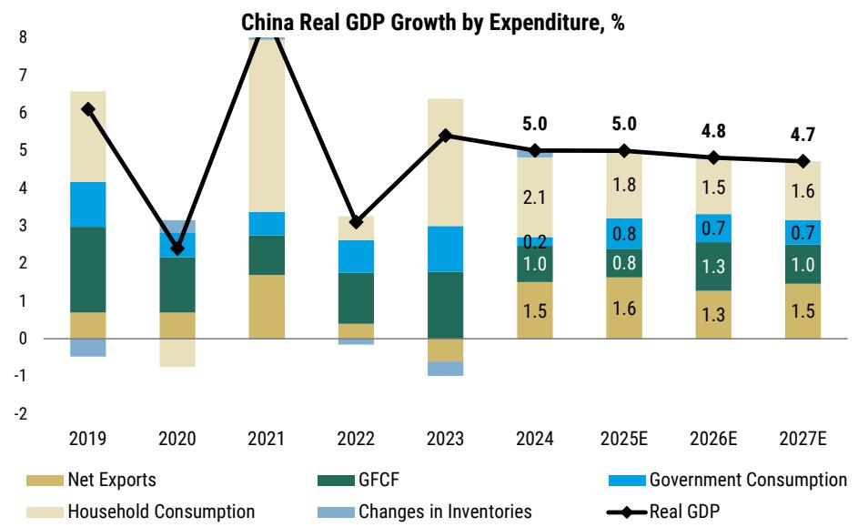

bar_line

China Real GDP Growth by Expenditure, %
| Year | Net Exports (%) | GFCF (%) | Government Consumption (%) | Household Consumption (%) | Changes in Inventories (%) | Real GDP (in %) |
| :--- | :--- | :--- | :--- | :--- | :--- | :--- |
| 2019 | 0.6 | 2.3 | 1.4 | 1.8 | -0.5 | 6.1 |
| 2020 | 0.7 | 1.4 | 0.5 | -0.8 | 0.2 | 2.4 |
| 2021 | 1.7 | 1.1 | 0.6 | 4.5 | 0.0 | 8.0 |
| 2022 | 0.3 | 1.4 | 0.9 | 0.0 | -0.2 | 3.1 |
| 2023 | -0.5 | 1.8 | 1.3 | 2.5 | -0.7 | 5.4 |
| 2024 | 1.5 | 1.0 | 0.2 | 2.1 | 0.1 | 5.0 |
| 2025E | 1.6 | 0.8 | 0.8 | 1.8 | 0.0 | 5.0 |
| 2026E | 1.3 | 1.3 | 0.7 | 1.5 | 0.0 | 4.8 |
| 2027E | 1.5 | 1.0 | 0.7 | 1.6 | 0.0 | 4.7 |

Source: NBS, MS (E) estimates

# Exports anchor cyclical growth momentum

We forecast China's goods export growth at 10%Y in nominal terms and 9%Y in real terms in 2026. Net exports should contribute \~1.3ppt to real GDP growth in 2026 – down slightly from 1.6ppt in 2025 owing to a terms of trade shock, but remaining the key growth driver.

\- Near term – market share gain largely offsets oil shock: On an annualized basis, we think China's global export market share gains could approach the upper end of our previously estimated 0.3-0.9ppt range, concentrated in the "new three" (solar, batteries, EVs), electrical capital goods (including power equipment), electronics and AI-related categories, and select basic materials. Even if global GDP growth may slow 0.5ppt in 2Q26 in response to the energy shock – implying roughly a 1ppt slowdown in global trade growth – share gains alone could bring an additional 4-5ppt of export growth. The April PMI new export orders index rebounded to 50.3, the highest in recent years, reflecting strong sUBStitution demand from overseas buyers as supply elsewhere is less insulated from the oil shock.

- Structural driver #1 – the global AI super-cycle: With the semiconductor market projected to surpass US\$1trn in 2026 and broadening deployment of agentic AI, China's deep electronics supply chain is a direct beneficiary. AI chip localization is accelerating, and Chinese capital goods companies are gaining share in global AI infrastructure.   
- Structural driver #2 – energy transition: The Middle East conflict has likely accelerated global demand for renewables and power equipment, and China controls over 80% of key solar manufacturing stages. Combined exports of solar, batteries, and EVs surged 70% YoY in March, to a record US\$21.9bn.

# Why export strength may translate into narrower improvement in job market than in previous cycles

The demand arithmetic is demanding: Housing and related sectors are still a drag on nominal GDP of roughly 2ppt this year. With exports at \~15% of GDP on a value-added basis, fully offsetting this drag alone would require sustained nominal export growth of 14-15% – a bar China has rarely cleared in recent years. Exports are clearly doing the heavy lifting, but the math shows that the hole they need to fill is exceptionally large.

The employment content of today's export dollar is lower than in previous cycles: China's export mix has shifted decisively up the value chain - toward EVs, ships, semiconductors, and power equipment – sectors that are more capital-intensive and automated. This means that each incremental dollar of export growth generates fewer jobs than it used to.

Overcapacity in the broader manufacturing sector means firms will raise utilization before headcount: Years of rapid investment in 2022–24 have left significant excess capacity across much of the manufacturing base. As export orders pick up, the natural corporate response is to run existing lines harder—not to expand capex, particularly under the anti-involution policy guidance. Job gains at the extensive margin only materialize once capacity utilization tightens meaningfully, which requires a strong and sustained export cycle beyond a few quarters.

That said, wage growth in select sectors could accelerate, supporting aggregate income: Export strength and profitability improvement are concentrated in a handful of high-value sectors populated by skilled labor. Wage growth in these pockets may accelerate even as the broader labor market remains soft, supporting aggregate wage growth. But this is a narrow, segmented improvement, not the broad-based income recovery that would move the needle on aggregate consumption.

Bottom line: Exports are helping, but the labor market arithmetic has structurally changed. The bar for a full offset via exports is high, and overcapacity means that transmission works with a longer lag. This is why the improvement in the job market is likely to remain narrower and slower than in previous export-driven cycles.

Exhibit 3: The spillover from profits to employment growth is also weakening as the industrial sector becomes more capital intensive and automated   
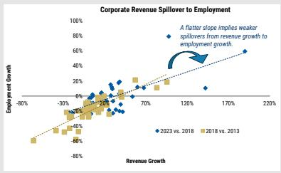  
Source: NBS, Economic Census, MS

Exhibit 4: Reduced transmission effect of export strength to capex given pervasive excess capacity problems   
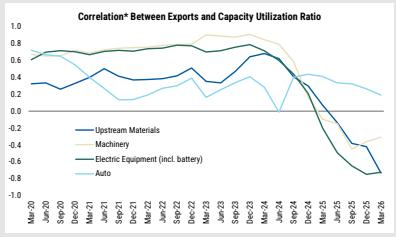  
Source: NBS, MS. \*3-year rolling correlation

# Domestic demand is still lagging

Consumption remains a laggard in China's growth mix, constrained by a soft labor market: We forecast private consumption growth of 3.7% in 2026, down from 4.5% in 2025 – below headline GDP growth – implying that consumption's share of growth continues to underwhelm relative to exports.

- Labor market slack is the key binding constraint: The urban surveyed unemployment rate rose to a 13-month high of 5.4% in March, with YoY change in youth unemployment remaining positive (barring LNY distortions) since the definition change. Critically, the weakness is structural:   
- Export strength is concentrated in capital-intensive, higher-value-added sectors with limited job spillover.   
- Most labor-intensive domestic sectors – led by construction and derivative services – remain in a prolonged adjustment.

\- AI diffusion adds a medium-term headwind: As a form of skill-biased technical change, AI displaces entry-level or even medium-level cognitive work. Labor market for fresh/recent graduates will likely remain loose, particularly given 12-13mn new entrants each year.

\- Social welfare reform is advancing only incrementally: Beijing will likely maintain a supply-centric policy framework – as evidenced in the Five-Year Plan – which limits fiscal space for demand-side support/transfers. Without a meaningful pivot toward strengthening social protection, precautionary savings will stay elevated and private spending will remain in a slow lane.

Investment presents a mixed picture: We forecast real growth of gross fixed asset formation to rebound to 3.5% in 2026 from 2% in 2025. The key drivers would be booming AI capex, policy support for infrastructure, and export-driven capex in select manufacturing sectors. Manufacturing investment is stabilizing but divergent, and property remains a persistent but slightly milder drag.

\- Infrastructure capex will likely accelerate modestly with carryover of quasi-fiscal funding: The newly planned RMB800bn in policy-based financing instruments, together with RMB500bn carried over from 2H25 – largely unused owing to a lack of eligible projects – should more than offset the continued decline in local government land revenue. At the same time, the front-loading and launch of key national strategic projects under the 15th Five-Year Plan helps alleviate the project pipeline bottleneck that constrained infrastructure spending last year.

\- Overall manufacturing capacity consolidation to continue: Anti-involution policies should continue to cap manufacturing investment upside, following the rapid capacity buildout in 2022-24 that partially offset the housing investment slump. That said, there should be wider divergence across sectors: those with severe excess capacity (e.g., solar) may see capacity utilization improve but are unlikely to add new investment, while sectors where supply and demand are more balanced/tight amid AI- and green transition-related demand (e.g., power equipment) could see investment accelerate.

\- Property investment to remain sluggish in view of weak new starts and land sales: Years of declining new starts have depleted the construction pipeline, and the weakness has persisted into 2026: new starts fell another 22% YoY and land sale revenues declined 24%, pointing to subdued construction activity in coming quarters. While secondary home sales have shown signs of recovery, the improvement remains localized and narrow, concentrated in select Cities and low-lump sum units. We expect broader stabilization across Tier 1 and 2 Cities by 2027, but until then, property investment will likely remain sluggish, though incrementally less bad.

Exhibit 5: Structural labor market weakness in non-manufacturing sectors   
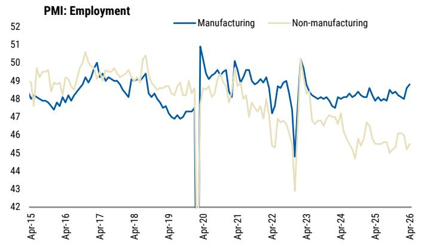

line

| Date   | Manufacturing | Non-manufacturing |
|--------|---------------|-------------------|
| Apr-15 | 48.0          | 49.0              |
| Apr-16 | 47.5          | 48.5              |
| Apr-17 | 49.5          | 50.5              |
| Apr-18 | 48.5          | 49.0              |
| Apr-19 | 47.0          | 48.0              |
| Apr-20 | 51.0          | 48.5              |
| Apr-21 | 49.5          | 48.0              |
| Apr-22 | 47.0          | 46.0              |
| Apr-23 | 45.0          | 43.0              |
| Apr-24 | 48.0          | 46.0              |
| Apr-25 | 48.5          | 45.5              |
| Apr-26 | 49.0          | 45.0              |

Source: NBS, MS

Exhibit 6: AI diffusion could further weigh on youth employment, which is already at a low starting point   
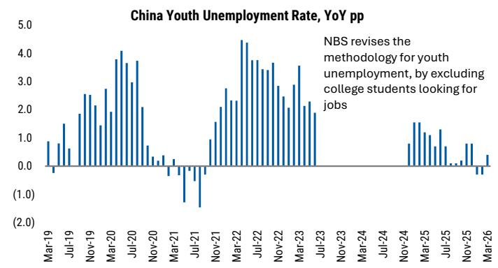

bar

| Date    | Unemployment Rate (pp) |
|---------|------------------------|
| Mar-19  | 0.8                    |
| Jul-19  | 1.5                    |
| Nov-19  | 2.5                    |
| Mar-20  | 3.8                    |
| Jul-20  | 3.7                    |
| Nov-20  | 2.0                    |
| Mar-21  | -0.5                   |
| Jul-21  | -1.0                   |
| Nov-21  | 1.5                    |
| Mar-22  | 4.5                    |
| Jul-22  | 3.8                    |
| Nov-22  | 3.5                    |
| Mar-23  | 3.7                    |
| Jul-23  | 2.0                    |
| Nov-23  | 1.8                    |
| Mar-24  | 0.8                    |
| Jul-24  | 0.5                    |
| Nov-24  | 1.5                    |
| Mar-25  | 1.2                    |
| Jul-25  | 0.8                    |
| Nov-25  | 0.5                    |
| Mar-26  | -0.5                   |

Source: CEIC, MS

Exhibit 7:   
FAI Breakdown 

<table><tr><td></td><td>Weight</td><td>2019</td><td>2020</td><td>2021</td><td>2022</td><td>2023</td><td>2024</td><td>2025</td><td>2026E</td><td>2027E</td></tr><tr><td>Overall FAI Growth</td><td>100%</td><td>5.4%</td><td>2.9%</td><td>4.9%</td><td>5.1%</td><td>3.0%</td><td>3.2%</td><td>-3.8%</td><td>3.0%</td><td>2.0%</td></tr><tr><td>Manufacturing</td><td>36%</td><td>3.1%</td><td>-2.2%</td><td>13.5%</td><td>9.1%</td><td>6.5%</td><td>9.2%</td><td>0.6%</td><td>4.5%</td><td>4.0%</td></tr><tr><td>Infrastructure</td><td>29%</td><td>3.3%</td><td>3.4%</td><td>0.2%</td><td>11.5%</td><td>8.2%</td><td>9.2%</td><td>-1.5%</td><td>8.0%</td><td>4.5%</td></tr><tr><td>- Utility</td><td>7%</td><td>4.5%</td><td>17.6%</td><td>1.1%</td><td>19.3%</td><td>23.0%</td><td>23.9%</td><td>9.1%</td><td>8.5%</td><td>6.0%</td></tr><tr><td>- Transportation, Storage and Postal Service</td><td>10%</td><td>3.4%</td><td>1.4%</td><td>1.6%</td><td>9.1%</td><td>10.5%</td><td>5.9%</td><td>-1.2%</td><td>12.5%</td><td>4.9%</td></tr><tr><td>- Water Conservancy &amp; Environment Management</td><td>12%</td><td>2.9%</td><td>0.2%</td><td>-1.2%</td><td>10.3%</td><td>0.1%</td><td>4.2%</td><td>-8.4%</td><td>3.5%</td><td>3.0%</td></tr><tr><td>Property</td><td>16%</td><td>9.2%</td><td>5.0%</td><td>5.0%</td><td>-8.4%</td><td>-8.1%</td><td>-10.8%</td><td>-17.5%</td><td>-11.5%</td><td>-10.0%</td></tr><tr><td>By Developers</td><td>13%</td><td>9.9%</td><td>7.0%</td><td>4.4%</td><td>-10.0%</td><td>-9.6%</td><td>-10.6%</td><td>-17.2%</td><td>-14.0%</td><td>-12.5%</td></tr><tr><td>· Land</td><td>4%</td><td>14.5%</td><td>6.7%</td><td>-2.1%</td><td>-5.7%</td><td>-5.9%</td><td>-7.7%</td><td>-13.7%</td><td>-8.0%</td><td>-6.0%</td></tr><tr><td>· Property excl. Land</td><td>8%</td><td>7.9%</td><td>7.2%</td><td>7.4%</td><td>-11.8%</td><td>-11.3%</td><td>-12.0%</td><td>-18.9%</td><td>-17.2%</td><td>-16.3%</td></tr><tr><td>Other Related Services</td><td>3%</td><td>6.5%</td><td>-3.0%</td><td>7.6%</td><td>-1.6%</td><td>-2.2%</td><td>-11.5%</td><td>-18.6%</td><td>-2.2%</td><td>-1.8%</td></tr><tr><td>Others*</td><td>18%</td><td>7.6%</td><td>7.7%</td><td>-1.6%</td><td>7.0%</td><td>1.9%</td><td>-2.4%</td><td>-4.2%</td><td>2.5%</td><td>1.2%</td></tr><tr><td>SOEs</td><td>40%</td><td>6.8%</td><td>5.3%</td><td>2.9%</td><td>10.1%</td><td>6.4%</td><td>5.7%</td><td>-2.5%</td><td>2.0%</td><td>1.2%</td></tr><tr><td>Private</td><td>60%</td><td>4.6%</td><td>1.6%</td><td>6.1%</td><td>2.3%</td><td>0.9%</td><td>1.6%</td><td>-4.7%</td><td>3.7%</td><td>2.5%</td></tr></table>

NBS, MS (E) estimates

# What rapid AI diffusion means for China's economy

China's AI story has entered a new chapter. No longer defined by the question of whether it can compete at the frontier, the debate has shifted to what rapid, broad-based AI diffusion means for growth, jobs, and productivity. The answer is nuanced: there's significant long-run upside, but the near-term path is bumpy.

AI to become China's key productivity engine over the medium term: We estimate that AI could lift China's total factor productivity growth around 3ppt cumulatively over the next decade, with gains skewed toward the latter half of the period as adoption scales and organizational adjustment matures. Combined with AI-related capital expenditure, this could raise the level of potential GDP \~3.5ppt above a no-Al trajectory by 2035. To this end, the 15th Five-Year Plan has institutionalized "Al+" as a national productivity strategy – explicitly linking digital upgrading to the target of maintaining faster labor-productivity growth than GDP expansion.

# But its near-term net contributions to headline growth will likely remain

muted: For 2026-27, the primary growth impulse stems from an Al capex expansion cycle in computing infrastructure, data centers, and energy, estimated to add 0.2-0.3ppt to annual real GDP growth. But early productivity gains will remain narrow – concentrated in knowledge-intensive activities rather than generating an economy-wide boost – and the positives will be largely offset by transitional labor market frictions.

Transitional job disruption risk in focus: While China's aggregate job exposure to AI is structurally lower than that of the US, it masks meaningful risks. Against a backdrop of weak corporate earnings, firms are more likely to deploy AI as a tool to cut costs rather than enhance output in the near term, accelerating labor sUBStitution ahead of new job creation. The displacement is broad-based: generative AI is displacing junior white-collar roles, agentic AI is encroaching on mid-level professional functions, and physical AI – from delivery drones to autonomous vehicles – threatens the labor-intensive service sector, which has been the primary absorber of employment losses in recent years.

Policy mitigation to be calibrated, not blanket: As Beijing seeks to narrow the gap with global peers in Gen-AI adoption among higher-end, knowledge-intensive white-collar roles, it may grant firms greater flexibility in labor adjustment to accelerate diffusion and productivity gains. By contrast, in areas where China is already near the technological frontier – such as AI-enabled delivery drones and autonomous driving – and where adoption directly affects large pools of service-sector employment, policymakers are likely to proceed more cautiously. Concrete mitigation measures are expected to be articulated later in 2026-27, including expanded job reskilling support, broader social insurance coverage for gig and flexible workers, and more calibrated automation in labor-intensive sectors.

Bottom line: The path of AI diffusion in China follows the historical J-curve of transformative technologies – near-term adjustment costs precede sustained productivity gains. The risk is that, in a weak demand environment, displacement effects materialize faster than complementarity effects and new job creation, forming a negative feedback loop that exacerbates deflationary pressures and constrains the very corporate earnings needed to fund further AI investment. How well Beijing manages this transition – balancing technological acceleration with labor market stability – will determine whether China could capture AI's long-run structural dividend on schedule.

For more details, please read China AI 2.0 – Entering a New Phase (10 May 2026).

Exhibit 8: AI's impact on China's GDP growth: near-term neutral, long-term positive   
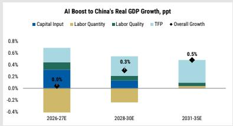

bar_stacked

AI Boost to China's Real GDP Growth, ppt
| Period | Capital Input (%) | Labor Quantity (%) | Labor Quality (%) | TFP (%) | Overall Growth (%) |
|---|---|---|---|---|---|
| 2026-27E | 0.4 | -0.3 | 0.1 | 0.3 | -0.1 |
| 2028-30E | 0.1 | -0.2 | 0.1 | 0.3 | 0.3 |
| 2031-35E | 0.1 | -0.1 | 0.1 | 0.5 | 0.5 |

Source: CEIC, MS estimates

Exhibit 10: Yet China's weak starting point of corporate earnings...   
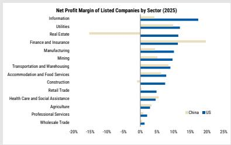

bar

Net Profit Margin of Listed Companies by Sector (2025)
| Sector | China (%) | US (%) |
|---|---|---|
| Information | 18 | 16 |
| Utilities | 13 | 12 |
| Real Estate | -14 | 12 |
| Finance and Insurance | 13 | 20 |
| Manufacturing | 6 | 10 |
| Mining | 6 | 9 |
| Transportation and Warehousing | 8 | 9 |
| Accommodation and Food Services | 7 | 8 |
| Construction | 0 | 0 |
| Retail Trade | 5 | 5 |
| Health Care and Social Assistance | 6 | 4 |
| Agriculture | 3 | 3 |
| Professional Services | 2 | 2 |
| Wholesale Trade | 1 | 1 |

Source: Factset, MS

Exhibit 9: Hyperscalers to step up AI-related capex significantly in next two years   
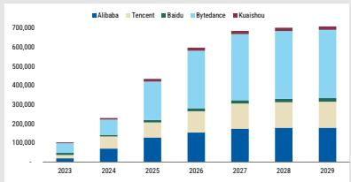

bar_stacked

| Year | Alibaba | Tencent | Baidu | Bytedance | Kuashou |
|---|---|---|---|---|---|
| 2023 | 40000 | 10000 | 5000 | 10000 | 1000 |
| 2024 | 80000 | 20000 | 10000 | 20000 | 1000 |
| 2025 | 120000 | 30000 | 15000 | 35000 | 1500 |
| 2026 | 150000 | 45000 | 20000 | 45000 | 2000 |
| 2027 | 180000 | 65000 | 25000 | 55000 | 2500 |
| 2028 | 190000 | 75000 | 30000 | 65000 | 3000 |
| 2029 | 195000 | 85000 | 35000 | 75000 | 3500 |

Source: Company data, MS estimates.

Exhibit 11: ...suggests that near-term AI-induced labor replacement risks should not be underestimated 

<table><tr><td>TYPE OF AI</td><td>IMPACTED JOBS</td><td>MACRO CONTEXT</td><td>IMPlications</td></tr><tr><td>Generative AI</td><td>Displacing junior white-collar roles e.g., data entry research support, labor promotion, basic analysis</td><td>China has elevated youth unemployment and rising numbers of university graduates towards 2020</td><td>More extended youth unemployment problems</td></tr><tr><td>Agentic AI</td><td>Encroaching on mid-level professional functions e.g. financial analysis, high rates, diagnostics, engineering design</td><td>Middle income has been under stress given job and wage pressures and housing downfall</td><td>Erosion of middle-income wage stability, harnessing consumption</td></tr><tr><td>Physical AI</td><td>Threatened labor-intensive service sector e.g., delivery transport, motor, smartwatching, hospitality</td><td>Low-end service sectors have been the primary shorter of employment losses in recent years</td><td>Higher structural displacement risk in the blue-collar service jobs</td></tr></table>

Source: MS

# Reflation: More Imported Than Organic

Inflation is rising, but endogenous reflation momentum remains thin: Higher energy costs and demand tied to AI and the green transition lift PPI to 1.5% in 2026 (from -2.6% in 2025; previous forecast: 1.2%), but pass-through to core consumer prices remains limited: weak domestic demand and a soft labor market constrain downstream pricing power. Headline CPI should average 0.8%Y, with core CPI at 1.1%Y on a shallow moderating path. As energy effects fade, inflation is expected to soften again in 2027 (PPI - 0.4%, CPI 0.6%), underscoring the absence of a fully self-sustaining demand-price loop.

Besides PPI, we also upgrade the GDP deflator: We raise our 2026 GDP deflator forecast 0.3ppt, to 0.5%, reflecting real demand that was stronger than previously assumed via exports, rather than systemic improvement in underlying pricing dynamics. The gap between GDP deflator and headline inflation is the key diagnostic: when an economy pays more for imported inputs, headline CPI and PPI register higher, but domestically produced value-added, as captured by the deflator, is compressed by the negative terms of trade shock. Nominal income growth underperforms headline inflation, and real wages may actually decline. True reflation requires the opposite.

Imported inflation can break deflationary expectations, but eventually needs to be validated by demand: In principle, externally driven price increases can disrupt entrenched deflationary psychology and encourage firms and households to adjust pricing and spending behavior. But for this to become self-sustaining, cost pressures must be accompanied by demand recovery, policy support that offsets the real income drag, and (critically) transmission into wages. Without these conditions, the inflation impulse is likely temporary and may ultimately even be disinflationary, compressing margins, weakening real incomes, and dampening activity even after the initial shock fades.

True reflation hinges on two swing factors – the scale of the energy shock and the policy response: In a constructive scenario, a contained rise in energy prices combined with more forceful demand-side support would induce a broader reflation dynamic, lifting expectations while cushioning real incomes. In a downside scenario, a large and persistent shock paired with insufficient policy support would act as a tax on both firms and households, making the initial inflation uptick self-limiting. On balance, the evidence so far slightly tilts to reflation being imported rather than organic. April inflation data suggest an intensified cost push, yet downstream demand remains relatively narrow, mainly anchored by AI. That said, China's policy space and low starting point mean that the window remains open for converting it into something more durable.

Exhibit 12: PPI will be lifted by higher energy costs and AI-related demand in 2026 – but should soften again in 2027 as energy effects sUBSide   
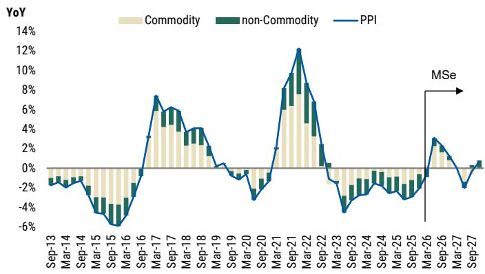

line

| Date    | Commodity | non-Commodity | PPI   |
|---------|-----------|---------------|-------|
| Sep-13  | -0.5%     | -0.8%         | -0.3% |
| Mar-14  | -0.7%     | -0.9%         | -0.5% |
| Sep-14  | -0.6%     | -0.7%         | -0.4% |
| Mar-15  | -0.8%     | -1.0%         | -0.6% |
| Sep-15  | -1.0%     | -1.2%         | -0.8% |
| Mar-16  | -1.2%     | -1.4%         | -1.0% |
| Sep-16  | -1.5%     | -1.6%         | -1.2% |
| Mar-17  | -1.8%     | -1.9%         | -1.5% |
| Sep-17  | -2.0%     | -2.1%         | -1.8% |
| Mar-18  | -2.2%     | -2.3%         | -2.0% |
| Sep-18  | -2.5%     | -2.6%         | -2.3% |
| Mar-19  | -2.8%     | -2.9%         | -2.6% |
| Sep-19  | -3.0%     | -3.1%         | -2.8% |
| Mar-20  | -3.2%     | -3.3%         | -3.0% |
| Sep-20  | -3.5%     | -3.6%         | -3.3% |
| Mar-21  | -3.8%     | -3.9%         | -3.6% |
| Sep-21  | -4.0%     | -4.1%         | -3.8% |
| Mar-22  | -4.2%     | -4.3%         | -4.0% |
| Sep-22  | -4.5%     | -4.6%         | -4.3% |
| Mar-23  | -4.8%     | -4.9%         | -4.6% |
| Sep-23  | -5.0%     | -5.1%         | -4.8% |
| Mar-24  | -5.2%     | -5.3%         | -5.0% |
| Sep-24  | -5.5%     | -5.6%         | -5.3% |
| Mar-25  | -5.8%     | -5.9%         | -5.6% |
| Sep-25  | -6.0%     | -6.1%         | -5.8% |
| Mar-26  | -6.2%     | -6.3%         | -6.0% |
| Sep-26  | -6.5%     | -6.6%         | -6.3% |
| Mar-27  | -6.8%     | -6.9%         | -6.6% |
| Sep-27  | -7.0%     | -7.1%         | -6.8% |

Source: NBS, MS estimates

Exhibit 13: Pass-through to core consumer prices remains limited   
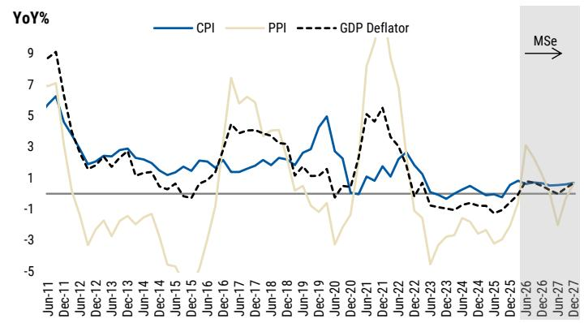

line

| Date    | CPI  | PPI  | GDP Deflator |
|---------|------|------|--------------|
| Jun-11  | 6.0  | 7.0  | 9.0          |
| Dec-11  | 5.5  | 6.5  | 8.5          |
| Jun-12  | 3.0  | -3.0 | 3.0          |
| Dec-12  | 2.5  | -2.5 | 2.5          |
| Jun-13  | 2.0  | -2.0 | 2.0          |
| Dec-13  | 2.5  | -1.5 | 2.5          |
| Jun-14  | 2.0  | -1.0 | 2.0          |
| Dec-14  | 1.5  | -0.5 | 1.5          |
| Jun-15  | 1.0  | -0.5 | 1.0          |
| Dec-15  | 1.5  | -0.5 | 1.5          |
| Jun-16  | 2.0  | -0.5 | 2.0          |
| Dec-16  | 2.5  | -0.5 | 2.5          |
| Jun-17  | 3.0  | -0.5 | 3.0          |
| Dec-17  | 3.5  | -0.5 | 3.5          |
| Jun-18  | 4.0  | -0.5 | 4.0          |
| Dec-18  | 4.5  | -0.5 | 4.5          |
| Jun-19  | 5.0  | -0.5 | 5.0          |
| Dec-19  | 4.5  | -0.5 | 4.5          |
| Jun-20  | 4.0  | -0.5 | 4.0          |
| Dec-20  | 3.5  | -0.5 | 3.5          |
| Jun-21  | 3.0  | -0.5 | 3.0          |
| Dec-21  | 2.5  | -0.5 | 2.5          |
| Jun-22  | 2.0  | -0.5 | 2.0          |
| Dec-22  | 1.5  | -0.5 | 1.5          |
| Jun-23  | 1.0  | -0.5 | 1.0          |
| Dec-23  | 0.5  | -0.5 | 0.5          |
| Jun-24  | 0.0  | -0.5 | 0.0          |
| Dec-24  | -0.5 | -0.5 | -0.5         |
| Jun-25  | -1.0 | -0.5 | -1.0         |
| Dec-25  | -1.5 | -0.5 | -1.5         |
| Jun-26  | -2.0 | -0.5 | -2.0         |
| Dec-26  | -2.5 | -0.5 | -2.5         |
| Jun-27  | -3.0 | -0.5 | -3.0         |
| Dec-27  | -3.5 | -0.5 | -3.5         |

Source: NBS, MS estimates

# How Japan leveraged imported inflation for a clear escape from deflation

Japan's exit from deflation reflects several forces finally moving in the same direction.

Imported inflation was the initial catalyst that broke the deflationary

mindset... The yen depreciated sharply (from \~105 per dollar in 2020 to \~140 by late 2022) amid coordinated policy easing. Combined with pandemic-era supply-chain disruptions, this pushed import prices sharply higher, forcing a reassessment of Japan's long-standing social norm of “no price hikes, no wage hikes.”

...triggered by coordinated policy easing: While the Fed and other major central banks tightened aggressively in response to post-pandemic inflation, the Bank of Japan stayed accommodative even as US rates hit a 23-year high, preventing premature tightening of domestic financial conditions. In November 2023, the government rolled out the "Comprehensive Economic Package for a Complete Exit from Deflation," combining tax cuts, sUBSidies for productivity-enhancing domestic investment, and targeted support for households facing higher prices – helping anchor the expectation that inflation would persist rather than fade.

A virtuous (nominal) wage-price cycle finally emerged: Empirical evidence shows that pass-through from prices to wages strengthened from 1Q23, while wage-to-price pass-through became visible for the first time in 3Q23 – channels that were largely dormant in the early 2010s. The turning point was confirmed in March 2024, when annual wage negotiations at large Japanese firms resulted in a 5.85% average pay increase, the largest in 31 years.

Despite this progress, the job is not finished: While yen depreciation has boosted corporate profits, which then enabled higher wage growth in the corporate sector, real wage growth still lags. It first registered negative growth in 2022 and 2023, before recovering to sub-1% in 2025 (high YoY in 2024 due to base effect).

Stronger real wage growth will complete the virtuous cycle – robust real growth amid sustained healthy inflation.

# Policy on Cruise Control

No additional policy easing in sight: Under Beijing's "cushioning, not lifting" policy approach, the upbeat 1Q26 GDP (5%) and export resilience through the oil shock have likely reduced the urgency for fresh stimulus. The April Politburo meeting highlighted "targeted and effective" policy support and urged prompt rollout of "shovel-ready" infrastructure projects, implying continued budget front-loading but a low likelihood of fiscal top-ups or policy rate cuts for the remainder of the year.

We thus expect the augmented fiscal deficit to stay flat at 11.7% of GDP this year, as set at the March NPC, and remove our previous call of additional monetary easing (10bps rate cut and 25bps RRR cut) in 2H26. Instead, policymakers will likely lean more on liquidity operations and quasi-fiscal tools (such as PBoC targeted relending and PSL) to support the economy.

Geopolitical tensions reinforce a supply-centric policy bias, delaying rebalancing: As it is, the 2026–30 Five-Year Plan has affirmed a tech-led, supply-centric path, while a consumption push remains qualitative and non-binding. Recent geopolitical tensions have reinforced the importance to ensure energy security and tech self-sufficiency, and thus will likely lead to continued capital allocation toward strategic sectors. On the other hand, policy support for consumption and social welfare reforms would remain gradual and calibrated. No meaningful housing support is in sight, as Beijing has been steadily shifting its growth drivers from property and infrastructure towards tech and supply chain. We thus believe policymakers would only guard against an uncontrolled slide while allowing necessary price adjustment to run its course.

Exhibit 14: Augmented fiscal deficit will likely stay flat at 11.7% of GDP this year; no supplementary budget in 2H   
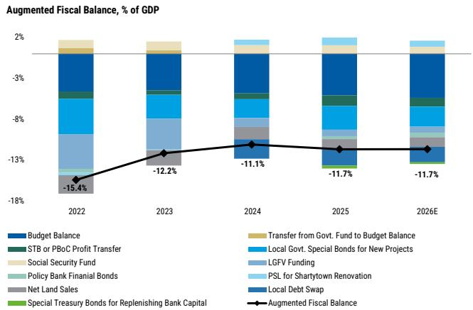

bar_stacked

Augmented Fiscal Balance, % of GDP
| Year | Budget Balance (%) | STB or PBoC Profit Transfer (%) | Social Security Fund (%) | Policy Bank Financial Bonds (%) | Net Land Sales (%) | Special Treasury Bonds for Replenishing Bank Capital (%) | Local Debt Swap (%) | Local Govt. Special Bonds for New Projects (%) | Transfer from Govt. Fund to Budget Balance (%) | LGFV Funding (%) | PSL for Shartytown Renovation (%) | Augmented Fiscal Balance (%) |
|---|---|---|---|---|---|---|---|---|---|---|---|---|
| 2022 | -15.4 | -1.8 | -0.7 | -0.3 | -0.2 | -0.1 | -0.1 | -0.9 | -0.1 | -0.1 | -0.1 | -15.4 |
| 2023 | -12.2 | -0.8 | -0.6 | -0.3 | -0.2 | -0.1 | -0.1 | -0.8 | -0.1 | -0.1 | -0.1 | -12.2 |
| 2024 | -11.1 | -0.7 | -0.5 | -0.3 | -0.2 | -0.1 | -0.1 | -0.7 | -0.1 | -0.1 | -0.1 | -11.1 |
| 2025 | -11.7 | -0.6 | -0.4 | -0.3 | -0.2 | -0.1 | -0.1 | -0.6 | -0.1 | -0.1 | -0.1 | -11.7 |
| 2026E | -11.7 | -0.5 | -0.3 | -0.3 | -0.2 | -0.1 | -0.1 | -0.5 | -0.1 | -0.1 | -0.1 | -11.7 |

Source: CEIC, Wind, MS estimates

Exhibit 15: Export resilience will likely reduce urgency for additional countercyclical infrastructure push   
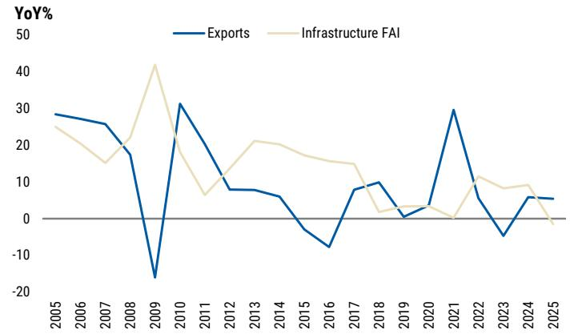

line

| Year | Exports | Infrastructure FAI |
|------|---------|---------------------|
| 2005 | 28      | 25                  |
| 2006 | 27      | 20                  |
| 2007 | 25      | 15                  |
| 2008 | 18      | 20                  |
| 2009 | -18     | 42                  |
| 2010 | 31      | 15                  |
| 2011 | 20      | 7                   |
| 2012 | 8       | 12                  |
| 2013 | 7       | 21                  |
| 2014 | 6       | 20                  |
| 2015 | -5      | 18                  |
| 2016 | -8      | 15                  |
| 2017 | 8       | 14                  |
| 2018 | 10      | 3                   |
| 2019 | 1       | 4                   |
| 2020 | 3       | 3                   |
| 2021 | 30      | 1                   |
| 2022 | 5       | 10                  |
| 2023 | -5      | 8                   |
| 2024 | 6       | 9                   |
| 2025 | 5       | -2                  |

Source: CEIC, MS estimates.

Exhibit 16: Five-Year Plan remains supply-centric   
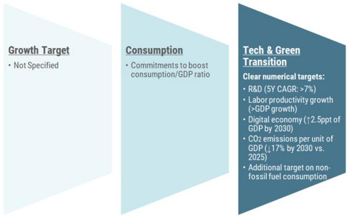

text_image

Growth Target
• Not Specified
Consumption
• Commitments to boost consumption/GDP ratio
Tech & Green Transition
Clear numerical targets:
• R&D (5Y CAGR: >7%)
• Labor productivity growth (>GDP growth)
• Digital economy (↑2.5ppt of GDP by 2030)
• CO2 emissions per unit of GDP (↓17% by 2030 vs. 2025)
• Additional target on non-fossil fuel consumption

Source: NPC, MS

Exhibit 17: Economic rebalancing at a calibrated pace   
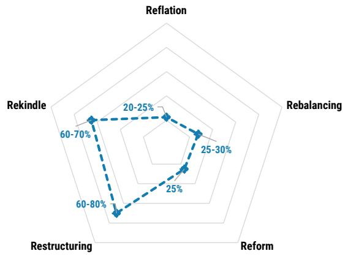

radar

| Category | Value (%) |
|---|---|
| Reflation | 25 |
| Rebalancing | 25-30 |
| Reform | 25 |
| Restructuring | 60-80 |
| Rekindle | 60-70 |

Source: MS estimates

# RMB outlook: mild appreciation ahead

Understanding the PBoC's RMB management framework: The strong RMB performance since 4Q25 has sparked market speculation about the PBoC's endorsement of sustained currency appreciation. In our view, the YTD RMB strength largely reflects a catch-up from last year's underperformance amid export resilience – China's trade surplus hit a record high in 2025 despite US tariffs. Now that RMB CFETS has returned to its long-term trendline, we believe the PBoC may allow a modest appreciation if export outperformance continues. But a sharp rise beyond the fundamentally supported level appears unlikely: we believe that the PBOC remains mindful of still soft domestic demand and price dynamics, and is unlikely to deploy currency appreciation as the primary tool to address structural growth imbalances. This means that USDCNY would remain more of a function of broader dollar moves.

Forecast – modest RMB CFETS upside, USDCNY reaching 6.75 by end-2026: We see room for another 3-4% appreciation in RMB CFETS towards end-2027, backed by China's supply chain competitiveness amid the rise of Asia's industrial super-cycle, led by AI-related investment and energy transition. That said, the movement in USDCNY will largely mirror the dollar trend. Our global FX team expects the trade-weighted dollar to soften towards year end as oil-driven risk aversion fades, before rebounding in 1H27 as US growth outperforms (our US economics team expects US real GDP growth to rise from 2.2% in 2026 to 2.5% in 2027).

\- Accordingly, we revise our USDCNY forecast to 6.75 by end-2026 (prior: 7.00), and see scope for a near-term shift toward 6.70, followed by a modest reversal to \~6.80 by mid-2027.

Exhibit 18: Modest CFETS upside, USDCNY a function of USD   
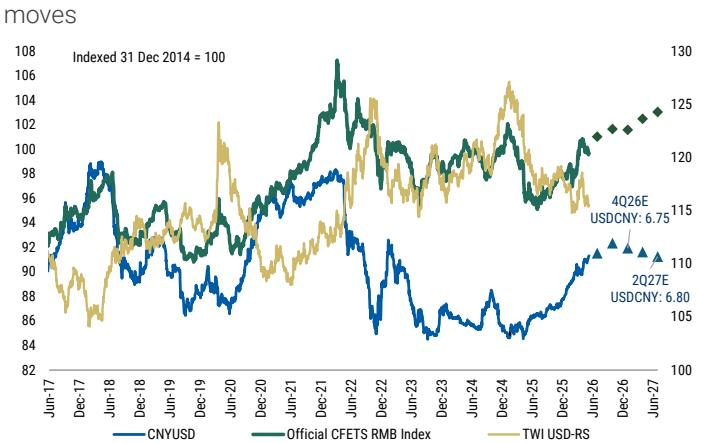

line

| Date     | CNYUSD | Official CFETS RMB Index | TWI USD-RS |
|----------|--------|--------------------------|------------|
| Jun-26   |        |                          |            |
| Jun-27   |        |                          |            |
| 4Q26E    |        |                          | USDCNY:    |
| 2Q27E    |        |                          | USDCNY:    |

Source: Bloomberg, MS estimates

Exhibit 19: How PBoC managed RMB moves in the past   
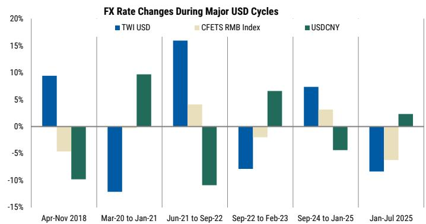

bar

FX Rate Changes During Major USD Cycles
| Period | TWI USD (%) | CFETS RMB Index (%) | USDCNY (%) |
| :--- | :--- | :--- | :--- |
| Apr-Nov 2018 | 9.5 | -4.5 | -9.5 |
| Mar-20 to Jan-21 | -12.5 | -0.5 | 9.5 |
| Jun-21 to Sep-22 | 16.0 | 4.0 | -10.5 |
| Sep-22 to Feb-23 | -7.5 | -1.0 | 6.5 |
| Sep-24 to Jan-25 | 7.5 | 3.0 | -4.5 |
| Jan-Jul 2025 | -8.5 | -5.5 | 2.5 |

Source: Bloomberg, MS

# Risks to Watch

As mentioned previously, our base case assumption is that China could withstand a sizable yet not extreme oil shock and gain export market share in select sectors, but that domestic demand would remain subdued given limited wage pass-through from exports, oil-induced downstream margin pressures, and a continued supply-centric policy bias.

Against this backdrop, we view the external environment and domestic policy direction as the two key swing factors in this baseline two-speed economy.

# Upside scenario: better external demand, more consumption-centric policy

Stronger global demand creates space for economic rebalancing... In this scenario, we assume a stronger-than-expected recovery in global demand led by the US, resulting in a broad-based improvement in China's exports. Firmer external demand would lift industrial capacity utilization and enhance export pricing power. More importantly, this would ease policymakers' pressure to achieve the 4.5–5% GDP target, creating room to reallocate policy resources from capex toward household consumption and social welfare, especially amid rising concerns over AI-driven labor market disruptions.

...supporting more sustained improvement in GDP growth and inflation: We expect real GDP growth to reach 5.2% in 2026 and 5.0% in 2027. Stronger fiscal supports to household consumption and social safety net would help reduce precautionary savings, translating into stronger final demand and thus corporate earnings improvement beyond upstream sectors. This would feed through to better labor income dynamics and reinforce consumption growth, forming a more self-sustaining demand cycle. In turn, both CPI and PPI would remain positive through 2027, with the GDP deflator turning durably positive and nominal growth outpacing real growth.

# Downside scenario: oil-induced global recession

A more severe oil shock to trigger global demand destruction: In this scenario, we assume that oil prices exceed US\$150/bbl and remain elevated for several months, as renewed geopolitical escalation would halt oil supply through the Strait of Hormuz for longer. Such extreme energy prices would sharply compress household purchasing power and corporate margins globally, triggering a synchronized slowdown in consumption and manufacturing. Supply chains—particularly for energy-intensive goods —would also be severely disrupted. Global growth would stabilize only as oil prices gradually retreat toward US\$80/bbl by mid-2027.

We thus see slower GDP growth and renewed deflationary pressures in China: In turn, China's GDP growth would slow to 4.3% in 2026 before normalizing to 4.5% in 2027. Oil shock would affect China beyond a terms of trade hit, with weaker exports (the main growth driver for the economy), deeper downstream margin compression, and spillover to weaker employment, wage growth, and consumption. These, combined with lower capacity utilization, would weaken China's endogenous inflation drivers, sending the economy back to deflation in 2027 after a brief oil-driven price uptick. In response, Beijing would likely step up cyclical easing through a combination of fiscal support and

accommodative monetary policy. But the impact would be limited by a reactive and largely supply-centric policy mix, leaving growth and reflation outcomes meaningfully weaker than in the base case.

# Appendix: Forecast Summary Tables

Exhibit 20: Summary of key macro indicators 

<table><tr><td></td><td>2019</td><td>2020</td><td>2021</td><td>2022</td><td>2023</td><td>2024</td><td>2025</td><td>2026E</td><td>2027E</td></tr><tr><td>GDP (Nominal, RMB, bn)</td><td>100,587</td><td>103,487</td><td>117,382</td><td>123,403</td><td>129,427</td><td>134,807</td><td>140,188</td><td>147,757</td><td>155,239</td></tr><tr><td>Nominal GDP Growth (%, YoY)</td><td>7.5</td><td>2.9</td><td>13.4</td><td>5.1</td><td>4.9</td><td>4.2</td><td>4.0</td><td>5.4</td><td>5.1</td></tr><tr><td>Real GDP Growth (%, YoY)</td><td>6.1</td><td>2.4</td><td>8.6</td><td>3.1</td><td>5.4</td><td>5.0</td><td>5.0</td><td>4.8</td><td>4.7</td></tr><tr><td>Household Consumption</td><td>6.1</td><td>-1.9</td><td>12.7</td><td>1.6</td><td>8.8</td><td>5.3</td><td>4.5</td><td>3.7</td><td>4.0</td></tr><tr><td>Government Consumption</td><td>7.0</td><td>3.8</td><td>3.6</td><td>5.2</td><td>7.2</td><td>1.4</td><td>4.9</td><td>4.5</td><td>4.0</td></tr><tr><td>GFCF</td><td>5.5</td><td>3.6</td><td>2.5</td><td>3.5</td><td>4.5</td><td>2.5</td><td>2.0</td><td>3.5</td><td>2.9</td></tr><tr><td>Inventory</td><td>-52.5</td><td>80.4</td><td>90.9</td><td>-12.4</td><td>-35.9</td><td>28.4</td><td>0.8</td><td>5.0</td><td>0.0</td></tr><tr><td>Goods &amp; Service Exports</td><td>1.0</td><td>3.5</td><td>24.8</td><td>-1.6</td><td>4.3</td><td>15.9</td><td>10.8</td><td>6.6</td><td>8.9</td></tr><tr><td>Goods &amp; Service Imports</td><td>-2.8</td><td>-0.4</td><td>18.4</td><td>-4.3</td><td>9.3</td><td>10.3</td><td>2.4</td><td>3.5</td><td>3.9</td></tr><tr><td colspan="10">Contribution to Growth (ppt)</td></tr><tr><td>Household Consumption</td><td>2.4</td><td>-0.8</td><td>4.6</td><td>0.6</td><td>3.4</td><td>2.1</td><td>1.8</td><td>1.5</td><td>1.6</td></tr><tr><td>Government Consumption</td><td>1.2</td><td>0.7</td><td>0.6</td><td>0.9</td><td>1.2</td><td>0.2</td><td>0.8</td><td>0.7</td><td>0.7</td></tr><tr><td>Gross Capital Formation</td><td>1.8</td><td>1.8</td><td>1.7</td><td>1.2</td><td>1.4</td><td>1.1</td><td>0.8</td><td>1.3</td><td>1.0</td></tr><tr><td>Net Exports</td><td>0.7</td><td>0.7</td><td>1.7</td><td>0.4</td><td>-0.6</td><td>1.5</td><td>1.6</td><td>1.3</td><td>1.5</td></tr><tr><td colspan="10">Inflation (%, YoY)</td></tr><tr><td>GDP Deflator</td><td>1.3</td><td>0.6</td><td>4.4</td><td>2.1</td><td>-0.5</td><td>-0.8</td><td>-0.9</td><td>0.5</td><td>0.3</td></tr><tr><td>CPI</td><td>2.9</td><td>2.5</td><td>0.9</td><td>2.0</td><td>0.2</td><td>0.2</td><td>0.1</td><td>0.8</td><td>0.6</td></tr><tr><td>Core CPI</td><td>1.6</td><td>0.8</td><td>0.8</td><td>0.9</td><td>0.7</td><td>0.5</td><td>0.8</td><td>1.1</td><td>0.8</td></tr><tr><td>PPI</td><td>-0.3</td><td>-1.8</td><td>8.1</td><td>4.2</td><td>-3.0</td><td>-2.2</td><td>-2.6</td><td>1.5</td><td>-0.4</td></tr><tr><td colspan="10">Key Policy Variables</td></tr><tr><td>Augmented Fiscal Balance, % of GDP</td><td>-13.9</td><td>-19.8</td><td>-12.1</td><td>-15.4</td><td>-12.2</td><td>-11.1</td><td>-11.7</td><td>-11.7</td><td>-11.7</td></tr><tr><td>7-day Reverse Repo Rate</td><td>2.50</td><td>2.20</td><td>2.20</td><td>2.00</td><td>1.80</td><td>1.50</td><td>1.40</td><td>1.40</td><td>1.40</td></tr><tr><td colspan="10">Financial Indicators</td></tr><tr><td>M2</td><td>8.7</td><td>10.1</td><td>9.0</td><td>11.8</td><td>9.7</td><td>7.3</td><td>8.5</td><td>8.2</td><td>8.0</td></tr><tr><td>Broad Credit Growth*</td><td>11.1</td><td>13.4</td><td>10.5</td><td>9.7</td><td>10.0</td><td>8.3</td><td>8.5</td><td>8.0</td><td>7.8</td></tr><tr><td>USD/CNY Exchange Rate (eop)</td><td>6.96</td><td>6.53</td><td>6.36</td><td>6.90</td><td>7.10</td><td>7.30</td><td>6.99</td><td>6.75</td><td>6.75</td></tr><tr><td>Current Account Balance, % of GDP</td><td>0.6</td><td>1.5</td><td>1.6</td><td>2.2</td><td>1.4</td><td>2.4</td><td>3.8</td><td>3.2</td><td>4.3</td></tr></table>

Source: CEIC, MS estimates (E) \*Official TSF - equity financing

Exhibit 21: Quarterly forecasts 

<table><tr><td></td><td>1Q24</td><td>2Q24</td><td>3Q24</td><td>4Q24</td><td>1Q25</td><td>2Q25</td><td>3Q25</td><td>4Q25</td><td>1Q26</td><td>2Q26E</td><td>3Q26E</td><td>4Q26E</td><td>1Q27E</td><td>2Q27E</td><td>3Q27E</td><td>4Q27E</td><td>2024</td><td>2025</td><td>2026E</td><td>2027E</td></tr><tr><td colspan="21">Real GDP Growth</td></tr><tr><td>YoY%</td><td>5.3</td><td>4.7</td><td>4.6</td><td>5.4</td><td>5.4</td><td>5.2</td><td>4.8</td><td>4.5</td><td>5.0</td><td>4.7</td><td>4.8</td><td>4.9</td><td>4.7</td><td>4.8</td><td>4.8</td><td>4.6</td><td>5.0</td><td>5.0</td><td>4.8</td><td>4.7</td></tr><tr><td>QoQ% SAAR</td><td>5.3</td><td>4.1</td><td>5.7</td><td>6.6</td><td>4.5</td><td>4.5</td><td>4.5</td><td>4.9</td><td>5.3</td><td>3.2</td><td>4.4</td><td>5.5</td><td>5.1</td><td>4.4</td><td>4.1</td><td>4.1</td><td></td><td></td><td></td><td></td></tr><tr><td colspan="21">GDP Component, YoY%</td></tr><tr><td>Private Consumption</td><td>8.4</td><td>4.8</td><td>3.1</td><td>4.4</td><td>5.3</td><td>5.2</td><td>3.8</td><td>3.6</td><td>3.1</td><td>3.5</td><td>3.8</td><td>3.9</td><td>4.3</td><td>3.9</td><td>4.0</td><td>4.0</td><td>5.3</td><td>4.5</td><td>3.7</td><td>4.0</td></tr><tr><td>Government Consumption</td><td>0.6</td><td>3.4</td><td>0.9</td><td>-0.4</td><td>1.3</td><td>5.6</td><td>8.1</td><td>6.5</td><td>3.7</td><td>5.5</td><td>4.8</td><td>4.6</td><td>3.8</td><td>4.2</td><td>4.6</td><td>3.8</td><td>1.4</td><td>4.9</td><td>4.5</td><td>4.0</td></tr><tr><td>Gross Capital Formation</td><td>2.4</td><td>4.2</td><td>2.7</td><td>3.1</td><td>2.0</td><td>2.8</td><td>1.8</td><td>1.7</td><td>8.0</td><td>4.3</td><td>2.1</td><td>2.0</td><td>0.6</td><td>2.6</td><td>3.3</td><td>3.4</td><td>2.9</td><td>2.0</td><td>3.5</td><td>2.8</td></tr><tr><td>GDP Deflator, YoY%</td><td>-1.1</td><td>-0.7</td><td>-0.6</td><td>-0.8</td><td>-0.8</td><td>-1.3</td><td>-1.0</td><td>-0.6</td><td>-0.1</td><td>0.9</td><td>0.7</td><td>0.5</td><td>0.2</td><td>0.0</td><td>0.4</td><td>0.7</td><td>-0.8</td><td>-0.9</td><td>0.5</td><td>0.3</td></tr><tr><td>CPI Inflation, YoY%</td><td>0.0</td><td>0.3</td><td>0.5</td><td>0.2</td><td>-0.1</td><td>0.0</td><td>-0.2</td><td>0.6</td><td>0.8</td><td>0.8</td><td>0.7</td><td>0.7</td><td>0.5</td><td>0.6</td><td>0.6</td><td>0.7</td><td>0.2</td><td>0.1</td><td>0.8</td><td>0.6</td></tr><tr><td>Core</td><td>0.7</td><td>0.6</td><td>0.3</td><td>0.3</td><td>0.3</td><td>0.6</td><td>0.9</td><td>1.2</td><td>1.2</td><td>1.2</td><td>1.1</td><td>0.9</td><td>0.8</td><td>0.8</td><td>0.9</td><td>0.9</td><td>0.5</td><td>0.8</td><td>1.1</td><td>0.8</td></tr><tr><td>Food</td><td>-3.2</td><td>-2.3</td><td>2.0</td><td>1.1</td><td>-1.4</td><td>-0.3</td><td>-3.4</td><td>-0.5</td><td>0.4</td><td>-2.3</td><td>-1.5</td><td>-1.1</td><td>-1.0</td><td>0.2</td><td>0.4</td><td>0.4</td><td>-0.6</td><td>-1.4</td><td>-1.1</td><td>0.0</td></tr><tr><td>Fuel</td><td>1.0</td><td>6.3</td><td>-1.7</td><td>-7.5</td><td>-2.5</td><td>-11.3</td><td>-7.4</td><td>-7.0</td><td>-5.3</td><td>13.7</td><td>10.8</td><td>9.6</td><td>5.5</td><td>-6.0</td><td>-7.7</td><td>-5.9</td><td>-0.5</td><td>-7.0</td><td>7.2</td><td>-3.5</td></tr><tr><td>PPI Inflation, YoY%</td><td>-2.7</td><td>-1.6</td><td>-1.8</td><td>-2.6</td><td>-2.3</td><td>-3.2</td><td>-2.9</td><td>-2.1</td><td>-0.6</td><td>3.1</td><td>2.3</td><td>1.3</td><td>0.0</td><td>-2.0</td><td>-0.3</td><td>0.7</td><td>-2.2</td><td>-2.6</td><td>1.5</td><td>-0.4</td></tr><tr><td>7D Reverse Repo Rate*</td><td>1.80</td><td>1.80</td><td>1.50</td><td>1.50</td><td>1.50</td><td>1.40</td><td>1.40</td><td>1.40</td><td>1.40</td><td>1.40</td><td>1.40</td><td>1.40</td><td>1.40</td><td>1.40</td><td>1.40</td><td>1.40</td><td>1.50</td><td>1.40</td><td>1.40</td><td>1.40</td></tr><tr><td>USDCNY*</td><td>7.22</td><td>7.27</td><td>7.02</td><td>7.30</td><td>7.26</td><td>7.16</td><td>7.12</td><td>6.99</td><td>6.89</td><td>6.78</td><td>6.72</td><td>6.75</td><td>6.77</td><td>6.80</td><td>6.77</td><td>6.75</td><td>7.30</td><td>6.99</td><td>6.75</td><td>6.75</td></tr></table>

Source: CEIC, MS estimates (E) \*End of Period

# Disclosure Section

Information and opinions in MS were prepared or are disseminated by one or more of the following, which accept responsibility for its contents: MS Asia Limited, and/or MS Asia (Singapore) Pte. (Registration number 199206298Z) and/or MS Asia (Singapore) Securities Pte Ltd (Registration number 200008434H), regulated by the Monetary Authority of Singapore (which accepts legal responsibility for its contents and should be contacted with respect to any matters arising from, or in connection with, MS), and/or MS Taiwan Limited and/or MS & Co International plc, Seoul Branch, and/or MS Australia Limited (A.B.N. 67 003 734 576, holder of Australian financial services license No. 233742), and/or MS Wealth Management Australia Pty Ltd (A.B.N. 19 009 145 555, holder of Australian financial services license No. 240813, and/or MS India Company Private Limited having Corporate Identification No (CIN) U22990MH1998PTC115305, regulated by the Securities and Exchange Board of India ("SEBI") and holder of licenses as a Research Analyst (SEBI Registration No. INH000001105), Stock Broker (SEBI Stock Broker Registration No. INZ000244438), Merchant Banker (SEBI Registration No. INM000011203), and depository participant with National Securities Depository Limited (SEBI Registration No. IN-DP-NSDL-567-2021) having registered office at Altimus, Level 39 & 40, Pandurang Budhkar Marg, Worli, Mumbai 400018, India; Telephone no. +91-22-61181000; Compliance Officer Details: Mr. Tejarshi Hardas, Tel. No.: +91-22-61181000 or Email: tejarshi.hardas@morganstanley.com; Grievance officer details: Mr. Tejarshi Hardas, Tel. No.: +91-22-61181000 or Email: msic-compliance@morganstanley.com which accepts the responsibility for its contents and should be contacted with respect to any matters arising from, or in connection with, MS and their affiliates (collectively, "MS"). MS India Company Private Limited (MSICPL) may use AI tools in providing research services. All recommendations contained herein are made by the duly qualified research analysts; For important disclosures, stock price charts and equity rating histories regarding companies that are the subject of this report, please see the MS Disclosure Website at www.morganstanley.com/eqr/disclosures/webapp/generalresearch, or contact your investment representative or MS at 1585 Broadway, (Attention: Research Management), New York, NY, 10036 USA.

For valuation methodology and risks associated with any recommendation, rating or price target referenced in this research report, please contact the Client Support Team as follows: US/Canada +1 800 303-2495; Hong Kong +852 2848-5999; Latin America +1 718 754-5444 (U.S.); London +44 (0)20-7425-8169; Singapore +65 6834-6860; Sydney +61 (0)2-9770-1505; Tokyo +81 (0)3-6836-9000. Alternatively you may contact your investment representative or MS at 1585 Broadway, (Attention: Research Management), New York, NY 10036 USA.

# Global Research Conflict Management Policy

MS has been published in accordance with our conflict management policy, which is available at www.morganstanley.com/institutional/research/conflictpolicies. A Portuguese version of the policy can be found at www.morganstanley.com.br

# Important Disclosures

MS is not acting as a municipal advisor and the opinions or views contained herein are not intended to be, and do not constitute, advice within the meaning of Section 975 of the Dodd-Frank Wall Street Reform and Consumer Protection Act.

MS does not provide individually tailored investment advice. MS has been prepared without regard to the circumstances and objectives of those who receive it. MS recommends that investors independently evaluate particular investments and strategies, and encourages investors to seek the advice of a financial adviser. The appropriateness of an investment or strategy will depend on an investor's circumstances and objectives. The securities, instruments, or strategies discussed in MS may not be suitable for all investors, and certain investors may not be eligible to purchase or participate in some or all of them. MS is not an offer to buy or sell or the solicitation of an offer to buy or sell any security/instrument or to participate in any particular trading strategy. The value of and income from your investments may vary because of changes in interest rates, foreign exchange rates, default rates, prepayment rates, securities/instruments prices, market indexes, operational or financial conditions of companies or other factors. There may be time limitations on the exercise of options or other rights in securities/instruments transactions. Past performance is not necessarily a guide to future performance. Estimates of future performance are based on assumptions that may not be realized. If provided, and unless otherwise stated, the closing price on the cover page is that of the primary exchange for the subject company's securities/instruments.

The fixed income research analysts, strategists or economists principally responsible for the preparation of MS have received compensation based upon various factors, including quality, accuracy and value of research, firm profitability or revenues (which include fixed income trading and capital markets profitability or revenues), client feedback and competitive factors. Fixed Income Research analysts', strategists' or economists' compensation is not linked to investment banking or capital markets transactions performed by MS or the profitability or revenues of particular trading desks.

With the exception of information regarding MS, MS is based on public information. MS makes every effort to use reliable, comprehensive information, but we make no representation that it is accurate or complete. We have no obligation to tell you when opinions or information in MS change apart from when we intend to discontinue equity research coverage of a subject company. Facts and views presented in MS have not been reviewed by, and may not reflect information known to, professionals in other MS business areas, including investment banking personnel.

MS may make investment decisions that are inconsistent with the recommendations or views in this report.

To our readers based in Taiwan or trading in Taiwan securities/instruments: Information on securities/instruments that trade in Taiwan is distributed by MS Taiwan Limited ("MSTL"). Such information is for your reference only. The reader should independently evaluate the investment risks and is solely responsible for their investment decisions. MS may not be distributed to the public media or quoted or used by the public media without the express written consent of MS. Any non-customer reader within the scope of Article 7-1 of the Taiwan Stock Exchange Recommendation Regulations accessing and/or receiving MS is not permitted to provide MS to any third party (including but not limited to related parties, affiliated companies and any other third parties) or engage in any activities regarding MS which may create or give the appearance of creating a conflict of interest. Information on securities/instruments that do not trade in Taiwan is for informational purposes only and is not to be construed as a recommendation or a solicitation to trade in such securities/instruments. MSTL may not execute transactions for clients in these securities/instruments.

MS is not incorporated under PRC law and the research in relation to this report is conducted outside the PRC. MS does not constitute an offer to sell or the solicitation of an offer to buy any securities in the PRC. PRC investors shall have the relevant qualifications to invest in such securities and shall be responsible for obtaining all relevant approvals, licenses, verifications and/or registrations from the relevant governmental authorities themselves. Neither this report nor any part of it is intended as, or shall constitute, provision of any consultancy or advisory service of securities investment as defined under PRC law. Such information is provided for your reference only.

MS is disseminated in Brazil by MS C.T.V.M. S.A. located at Av. Brigadeiro Faria Lima, 3600, 6th floor, São Paulo - SP, Brazil; and is regulated by the Comissão de Valores Mobiliários; in Mexico by MS México, Casa de Bolsa, S.A. de C.V which is regulated by Comision Nacional Bancaria y de Valores. Paseo de los Tamarindos 90, Torre 1, Col. Bosques de las Lomas Floor 29, 05120 Mexico City; in Japan by MS MUFG Securities Co., Ltd. and, for Commodities related research reports only, MS Capital Group Japan Co., Ltd; in Hong Kong by MS Asia Limited (which accepts responsibility for its contents) and by MS Bank Asia Limited; in Singapore by MS Asia (Singapore) Pte. (Registration number 199206298Z) and/or MS Asia (Singapore) Securities Pte Ltd (Registration number 200008434H), regulated by the Monetary Authority of

Singapore (which accepts legal responsibility for its contents and should be contacted with respect to any matters arising from, or in connection with, MS) and by MS Bank Asia Limited, Singapore Branch (Registration number T14FC0118); in Australia to "wholesale clients" within the meaning of the Australian Corporations Act by MS Australia Limited A.B.N. 67 003 734 576, holder of Australian financial services license No. 233742, which accepts responsibility for its contents; in Australia to "wholesale clients" and "retail clients" within the meaning of the Australian Corporations Act by MS Wealth Management Australia Pty Ltd (A.B.N. 19 009 145 555, holder of Australian financial services license No. 240813, which accepts responsibility for its contents; in Korea by MS & Co International plc, Seoul Branch; in India by MS India Company Private Limited having Corporate Identification No (CIN) U22990MH1998PTC115305, regulated by the Securities and Exchange Board of India ("SEBI") and holder of licenses as a Research Analyst (SEBI Registration No. INH000001105); Stock Broker (SEBI Stock Broker Registration No. INZ000244438), Merchant Banker (SEBI Registration No. INM000011203), and depository participant with National Securities Depository Limited (SEBI Registration No. IN-DP-NSDL-567-2021) having registered office at Altimus, Level 39 & 40, Pandurang Budhkar Marg, Worli, Mumbai 400018, India; Telephone no. +91-22-61181000; Compliance Officer Details: Mr. Tejarshi Hardas, Tel. No.: +91-22-61181000 or Email: tejarshi.hardas@morganstanley.com; Grievance officer details: Mr. Tejarshi Hardas, Tel. No.: +91-22-61181000 or Email: msic-compliance@morganstanley.com. MS India Company Private Limited (MSICPL) may use AI tools in providing research services. All recommendations contained herein are made by the duly qualified research analysts; in Canada by MS Canada Limited; in Germany and the European Economic Area where required by MS Europe S.E., regulated by Bundesanstalt fuer Finanzdienstleistungsaufsicht (BaFin) under the reference number 149169; in the United States by MS & Co. LLC, which accepts responsibility for its contents. MS & Co. International plc, authorized by the Prudential Regulation Authority and regulated by the Financial Conduct Authority and the Prudential Regulation Authority, disseminates in the UK research that it has prepared, and research which has been prepared by any of its affiliates, only to persons who (i) are investment professionals falling within Article 19(5) of the Financial Services and Markets Act 2000 (Financial Promotion) Order 2005 (as amended, the "Order"); (ii) are persons who are high net worth entities falling within Article 49(2)(a) to (d) of the Order; or (iii) are persons to whom an invitation or inducement to engage in investment activity (within the meaning of section 21 of the Financial Services and Markets Act 2000, as amended) may otherwise lawfully be communicated or caused to be communicated. RMB MS Proprietary Limited is a member of the JSE Limited and A2X (Pty) Ltd. RMB MS Proprietary Limited is a joint venture owned equally by MS International Holdings Inc. and RMB Investment Advisory (Proprietary) Limited, which is wholly owned by FirstRand Limited. The information in MS is being disseminated by MS Saudi Arabia, regulated by the Capital Market Authority in the Kingdom of Saudi Arabia, and is directed at Sophisticated investors only.

The trademarks and service marks contained in MS are the property of their respective owners. Third-party data providers make no warranties or representations relating to the accuracy, completeness, or timeliness of the data they provide and shall not have liability for any damages relating to such data. The Global Industry Classification Standard (GICS) was developed by and is the exclusive property of MSCI and S&P.

MS, or any portion thereof may not be reprinted, sold or redistributed without the written consent of MS.

Indicators and trackers referenced in MS may not be used as, or treated as, a benchmark under Regulation EU 2016/1011, or any other similar framework.

The information in MS is being communicated by MS & Co. International plc (DIFC Branch), regulated by the Dubai Financial Services Authority (the DFSA) or by MS & Co. International plc (ADGM Branch), regulated by the Financial Services Regulatory Authority Abu Dhabi (the FSRA), and is directed at Professional Clients only, as defined by the DFSA or the FSRA, respectively. The financial products or financial services to which this research relates will only be made available to a customer who we are satisfied meets the regulatory criteria of a Professional Client. A distribution of the different MS Research ratings or recommendations, in percentage terms for Investments in each sector covered, is available upon request from your sales representative.

The information in MS is being communicated by MS & Co. International plc (QFC Branch), regulated by the Qatar Financial Centre Regulatory Authority (the QFCRA), and is directed at business customers and market counterparties only and is not intended for Retail Customers as defined by the QFCRA.

As required by the Capital Markets Board of Turkey, investment information, comments and recommendations stated here, are not within the scope of investment advisory activity. Investment advisory service is provided exclusively to persons based on their risk and income preferences by the authorized firms. Comments and recommendations stated here are general in nature. These opinions may not fit to your financial status, risk and return preferences. For this reason, to make an investment decision by relying solely to this information stated here may not bring about outcomes that fit your expectations.

Registration granted by SEBI and certification from the National Institute of Securities Markets (NISM) in no way guarantee performance of the intermediary or provide any assurance of returns to investors. Investment in securities market are subject to market risks. Read all the related documents carefully before investing.

© 2026 MS