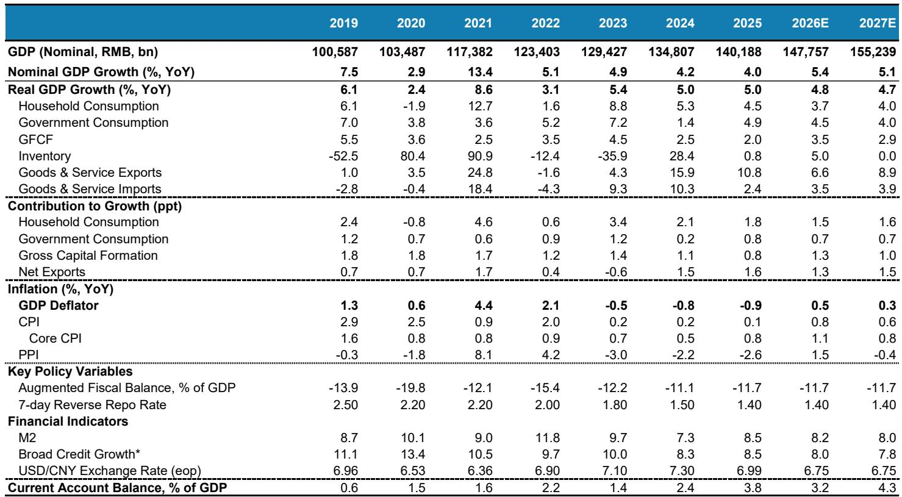
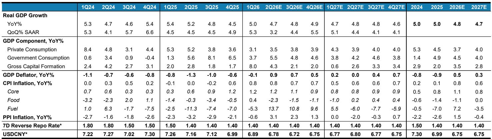
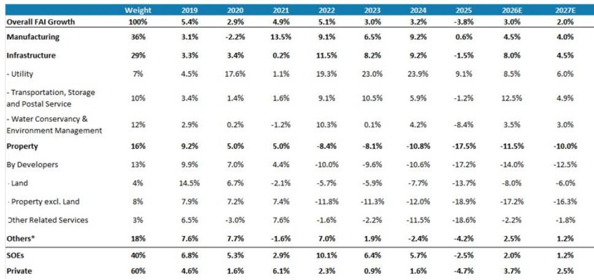

# 市场真正低估的不是出口韧性，而是出口拉动增长的结构性天花板

这份来自某外资投行的中国宏观经济年中展望，核心判断并不在于它上调了2026年GDP增速预测0.1个百分点至4.8%——这个数字本身并不令人兴奋。真正值得产业决策者和投资者反复咀嚼的，是报告揭示的一个深层矛盾：中国经济的增长引擎正在切换，但新引擎的就业乘数和收入传导效率，远低于市场直觉所认为的水平。

出口正在成为增长的主锚。AI和能源转型催生的资本开支超级周期，叠加中国供应链的韧性，使得净出口对GDP的贡献持续维持在1.3至1.6个百分点的高位。但报告用一组严谨的数据推演告诉我们：今天的出口美元，每单位能创造的就业岗位比上一轮周期少了多少？答案是显著减少。而就业是消费的前提，消费是内循环的基石。

这意味着什么？意味着市场如果仅仅因为出口数据亮眼就对中国经济复苏持乐观态度，可能忽略了增长质量的结构性变化。这份报告的价值，不在于它预测了4.8%还是4.7%，而在于它拆解了“为什么出口好不等于就业好，就业好不等于消费好”这一关键传导链条。

以下是我们从这份报告中提炼出的五个核心洞察，以及一个报告尚未完全回答的关键问题。

## 1. 出口的结构性升级正在改变其就业传导效率，这是市场定价尚未充分反映的变量

报告明确指出，中国出口的品类结构已经发生了决定性的上移。从光伏、锂电池、电动汽车，到半导体、电力设备、AI基础设施相关的资本品，这些高附加值产品的出口增速远超传统商品。2026年，中国货物出口名义增速预计仍维持在10%左右。

但问题在于，这些行业是资本密集型和自动化程度极高的领域。每增加一美元的出口，所需要的劳动力投入远低于纺织、家具、玩具等传统出口部门。报告用了一个简洁但有力的计算：如果仅靠出口来完全对冲房地产对名义GDP约2个百分点的拖累，需要出口名义增速持续维持在14%至15%——这是一个中国近年来极少达到的水平。

更关键的是，制造业普遍存在的产能过剩问题，使得企业在接到出口订单时，首先选择提高现有产能利用率，而非扩产招人。报告中的数据显示，制造业产能利用率与就业增长之间的相关性正在持续减弱。这意味着，即便出口数据连续几个季度表现强劲，就业市场的改善也可能比市场预期的更慢、更窄。

对投资者的含义：盯住出口总量数据是不够的。需要关注的是出口企业的产能利用率和资本开支意愿，以及高附加值出口部门与非贸易部门之间的就业传导效率是否出现边际改善。

## 2. 通胀回升是真实的，但“再通胀”的范围极其狭窄，消费端的定价权依然缺失

报告将2026年GDP平减指数预测上调0.3个百分点至0.5%，PPI预测上调至1.5%。但仔细阅读会发现，这个通胀回升的故事是高度结构性的。

PPI的上行主要来自两个因素：一是能源成本上升（中东冲突推高油价），二是AI和绿色转型带来的上游需求拉动。但报告明确警告，上游价格向核心CPI的传导十分有限。2026年核心CPI预测仅为1.1%，且处于温和下行路径。原因很简单——国内需求疲软，劳动力市场松软，企业缺乏将成本转嫁给终端消费者的定价权。

这意味着什么？意味着中国正在经历一个“上游热、下游冷”的通胀格局。对于下游消费企业来说，成本端压力上升，但收入端提价能力不足，利润率将持续承压。对于投资者而言，这提示了一个重要的行业配置逻辑：在通胀回升但范围狭窄的环境下，拥有上游资源优势或能够通过技术壁垒维持定价权的企业，将显著跑赢依赖消费量驱动的企业。

报告还提出了一个容易被忽视的点：由于中国进口大宗商品价格上涨导致贸易条件恶化，即便出口量强劲，GDP平减指数仍低于整体通胀水平。这意味着名义GDP的增长质量，可能不如实际GDP增速所暗示的那么健康。

## 3. 政策进入“巡航模式”，但这不是放松警惕的理由，而是对政策框架的重新理解

报告最引人注目的判断之一，是撤回了对下半年财政加码和进一步货币宽松的预期。政策进入“巡航模式”——既不会大幅收紧，也不会额外刺激。强出口降低了政策紧迫性，中东冲突反而强化了供给端优先的政策思路。

但“巡航模式”并不意味着政策无足轻重。恰恰相反，它揭示了一个重要的政策框架转变：决策层正在用供给端政策（能源安全、技术自主、产业升级）替代需求端刺激（消费补贴、降息降准）来应对经济下行。报告明确指出，十五五规划中体现的供给端优先框架，限制了财政空间向需求端转移。

这对资产定价有深远含义。人民币汇率方面，报告将2026年末美元兑人民币预测从7.00大幅上调至6.75，理由是增长表现优于全球和美元走弱。但报告同时强调，央行不会利用汇率走强来解决增长失衡问题。这意味着人民币升值更多是被动的、结果性的，而非政策主动引导的。

对债券市场而言，政策利率保持稳定（7天逆回购利率维持在1.40%），意味着收益率曲线将更多由通胀预期和供给冲击驱动，而非货币政策方向。对权益市场而言，政策框架的供给端优先意味着，受益于产业政策支持的领域（AI、新能源、电力设备）将继续获得政策溢价，而依赖消费刺激的传统板块则面临预期差。

## 4. 房地产的拖累正在边际减弱，但“底部”的定义需要重新校准

报告对房地产的判断值得反复阅读。2026年房地产投资预计仍将下滑11.5%，新开工面积同比下降22%，土地出让收入下降24%——这些数字并不好看。但报告用了一个关键词：“incrementally less bad”（边际上不那么糟糕）。

这个表述非常克制，但含义深刻。它意味着房地产对经济的拖累正在从“加速恶化”转向“缓慢触底”。报告预计，一二线城市可能在2027年实现更广泛的稳定。但这里有一个关键前提：稳定不等于反弹。即便一二线城市的二手房成交出现复苏，这种改善也是局部的、低总价段的，并非全面的市场反转。

对产业决策者而言，这意味着与房地产相关的产业链（建材、家居、工程机械）仍需做好长期低位的准备。对投资者而言，房地产板块的估值修复机会可能更多来自政策预期的边际变化，而非基本面的实质性改善。报告没有说透的是，房地产市场的出清速度在很大程度上取决于地方政府能否有效消化存量库存，而这又依赖于财政资源的分配效率。

## 5. AI扩散正在成为劳动力市场的一个新结构性变量，其影响可能被当前宏观讨论所低估

报告在讨论劳动力市场时，提出了一个值得深思的观点：AI作为一种技能偏向型技术变革，正在替代入门级甚至中级的认知工作。每年1200至1300万新增毕业生进入劳动力市场，而AI的扩散使得这部分劳动力的就业前景更加承压。

这个判断的宏观含义是双重的。第一，青年失业率的结构性压力将持续存在，即便出口数据改善也难以快速缓解。第二，AI对就业的替代效应，可能进一步抑制居民收入和消费倾向，因为被替代的往往是消费边际倾向较高的年轻群体。

报告没有充分展开的是，AI对就业的影响并非只有替代效应，也有创造效应——AI基础设施建设和应用部署本身会创造新的就业岗位。但这些新岗位的技能要求更高，数量可能不足以完全对冲替代效应。这意味着劳动力市场的结构性错配将进一步加剧，对教育和职业培训体系提出了更高的要求。

对投资者的启示是，在评估消费类资产时，不能只看居民收入增速，还需要关注收入分配的结构。如果收入增长主要集中在高技能岗位，而中低技能岗位收入停滞甚至下降，整体消费倾向可能会持续走低。这是当前市场对消费复苏定价时可能低估的一个变量。

## 6. 报告尚未完全回答的关键问题：出口的可持续性取决于全球需求，而非仅靠份额提升

报告对出口的乐观判断建立在两个支柱上：一是中国供应链韧性带来的全球市场份额提升，二是AI和能源转型相关的结构性需求。但报告也坦承，如果全球经济增长因石油冲击而放缓0.5个百分点，全球贸易增速可能放缓约1个百分点。

这里有一个尚未被充分讨论的风险：市场份额的提升是有上限的。当中国在光伏、电池、电动汽车等领域的全球份额已经超过50%甚至80%时，继续提升的空间正在收窄。更重要的是，贸易伙伴的政策反应——关税、反补贴调查、本地化要求——可能成为份额提升的阻力。

报告提到了“反内卷”政策对制造业投资的抑制作用，但没有深入分析，如果出口增速因外部需求减弱而放缓，而国内消费又无法接棒，经济将面临怎样的调整压力。这个问题的答案，可能决定了2027年及之后中国经济的增长路径。

此外，报告对“消费何时能成为增长主动力”这个问题着墨不多。它指出了消费受制于劳动力市场和社保改革进展缓慢，但没有给出一个清晰的触发条件或时间表。这可能是投资者需要自行跟踪和判断的关键变量。

---

这些未解问题，恰恰是理解中国经济下半场的关键。出口的韧性是真实的，但它能否持续、能否有效传导至更广泛的经济领域，取决于全球需求环境、贸易政策演变以及国内改革的推进速度。报告的洞察在于，它让我们看到了增长数字背后的结构性变化，而非仅仅给出一个预测数字。

如果你对这些未解问题感兴趣——比如AI对就业的长期影响如何量化、出口份额提升的天花板在哪里、消费复苏需要哪些条件——欢迎来我们的微信群里继续讨论。我们每周会围绕这类深度报告的核心矛盾组织专题讨论，帮助参与者建立更立体的分析框架。

Personal reading notes and learning share only. Not investment advice.

