# China Equity Strategy Mid-year Outlook | Asia Pacific Forging New Horizons

We see moderate upside by 2Q27 on improved earnings, growing dominance in global upstream supply chains, and a stronger USDCNY. The US-China summit could trigger moderate index upside if the truce extends. We prefer A over offshore and recommend thematic stock picking vs. passive index investing.

YTD – a thematic growth market masked by index compilation rules: Upstream focused sectors (Energy, Materials, and high-end manufacturing concentrated industrials) and technology localization (Semi, Healthcare) have delivered 2-30% YTD absolute returns vs. the index. However, MSCI China index's performance has been significantly hindered by an index composition overly skewed towards large-cap platform companies (45% of index weight) while heavily discounting A-share listings due to the existing inclusion rule (<20% for the aforementioned outperforming sectors combined, most of which are listed in the A-share market).

We see the earnings outlook improving moderately: 1) stronger export growth amid accelerating AI/Energy capex cycle; 2) CNY appreciation vs. USD; 3) earnings damage peaking from large-cap platform companies' intense price competition, with strict government regulation having started in April. Valuation could also see a marginal re-rating as earnings growth improves, the US/China truce extends, and Chinese companies gain more dominance in global high-end supply chains.

Our new 2Q2027 price targets are 28,400 for Hang Seng, 91 for MSCI China, 9,900 for HSCEI and 5,400 for CSI300, implying upsides of 8%, 12%, 11% and 11%, respectively. Near-term volatility swings could still happen given: 1) another quarter of misses in 1Q; 2) sizeable HK IPO share unlocking in July; 3) liquidity uncertainty if Fed rate cut prospects disappear and/or turn into hikes; 4) global growth risk amid lofty energy prices. As a result, we expect market dynamics to turn clearer and smoother more likely around/after summer.

We continue to prefer A-share market over offshore given: 1) higher concentration of high-end upstream manufacturing and hard-core tech companies; 2) highly anticipated potential A-share IPOs to trigger greater domestic investor participation; and 3) National Team standing by.

Sector preference: We strongly prefer upstream asset-focused sectors that are less disruptable by the AI supercycle, compounded by their growing global market share against a backdrop of energy efficiency re-prioritization – selected Materials, Industrials, and Energy. We also like the tech localization theme (semis) and maintain moderate exposure to Financials (Insurance and Exchanges), as well as yield plays. We stay OW on Real Estate and Consumer Staples.

Key trades recommended: 1) A-shares > offshore; 2) China Best Business Model stocks; 3) Upstream global energy sufficiency supplier champions; 4) Event-driven tactical trade of Stock Connect Southbound inclusion/deletion.

MS ASIA LIMITED+

# Laura Wang

Equity Strategist

Laura.Wang@morganstanley.com +852 2848-6853

# Chloe Liu

Equity Strategist

Chloe.Liu1@morganstanley.com +852 2848-5497

# Vicky Wu

Equity Strategist

Vicky.Wu@morganstanley.com +852 3963-3928

Exhibit 1: 2Q 2027 bull/base/bear index targets for MS China coverage equity indices: 8-12% upside implied for Chinese equity indices 

<table><tr><td rowspan="2"></td><td rowspan="2">Index</td><td rowspan="2">Current Price</td><td rowspan="2">MS Target Price (June - 27)</td><td colspan="2">MS Top-Down EPS</td><td colspan="2">IBES Consensus EPS</td><td rowspan="2">MS Target Paid P/E Jun-27</td><td rowspan="2">Consensus 12m Fed P/E Spot</td></tr><tr><td>Dec-26</td><td>Dec-27</td><td>Dec-26</td><td>Dec-27</td></tr><tr><td rowspan="8">Base Case</td><td rowspan="2">Hang Seng</td><td rowspan="2">26,394</td><td>28,400</td><td>2,254</td><td>2,408</td><td>2,270</td><td>2,499</td><td>11.4x</td><td>11.3x</td></tr><tr><td>8%</td><td>7%</td><td>7%</td><td>12%</td><td>10%</td><td></td><td></td></tr><tr><td rowspan="2">HSCEI</td><td rowspan="2">8,889</td><td>9,900</td><td>939</td><td>993</td><td>904</td><td>961</td><td>9.7x</td><td>10.1x</td></tr><tr><td>11%</td><td>5%</td><td>6%</td><td>7%</td><td>6%</td><td></td><td></td></tr><tr><td rowspan="2">MSCI China</td><td rowspan="2">81</td><td>91</td><td>6.6</td><td>7.2</td><td>6.5</td><td>7.5</td><td>12.2x</td><td>11.9x</td></tr><tr><td>12%</td><td>7%</td><td>10%</td><td>14%</td><td>15%</td><td></td><td></td></tr><tr><td rowspan="2">CSI300</td><td rowspan="2">4,872</td><td>5,400</td><td>315</td><td>347</td><td>341</td><td>378</td><td>14.8x</td><td>14.6x</td></tr><tr><td>11%</td><td>10%</td><td>10%</td><td>12%</td><td>11%</td><td></td><td></td></tr><tr><td rowspan="8">Bull Case</td><td rowspan="2">Hang Seng</td><td rowspan="2">26,394</td><td>32,400</td><td>2,299</td><td>2,504</td><td>2270</td><td>2499</td><td>12.5x</td><td>11.3x</td></tr><tr><td>23%</td><td>8%</td><td>9%</td><td>12%</td><td>10%</td><td></td><td></td></tr><tr><td rowspan="2">HSCEI</td><td rowspan="2">8,889</td><td>11,000</td><td>958</td><td>1013</td><td>904</td><td>961</td><td>10.6x</td><td>10.1x</td></tr><tr><td>24%</td><td>6%</td><td>6%</td><td>7%</td><td>6%</td><td></td><td></td></tr><tr><td rowspan="2">MSCI China</td><td rowspan="2">81</td><td>103</td><td>6.7</td><td>7.4</td><td>6.5</td><td>7.5</td><td>13.3x</td><td>11.9x</td></tr><tr><td>27%</td><td>8%</td><td>11%</td><td>14%</td><td>15%</td><td></td><td></td></tr><tr><td rowspan="2">CSI300</td><td rowspan="2">4,872</td><td>6,090</td><td>321</td><td>361</td><td>341</td><td>378</td><td>16.0x</td><td>14.6x</td></tr><tr><td>25%</td><td>11%</td><td>12%</td><td>12%</td><td>11%</td><td></td><td></td></tr><tr><td rowspan="6">Bear Case</td><td rowspan="2">HSCEI</td><td rowspan="2">8,889</td><td>6,200</td><td>892</td><td>923</td><td>904</td><td>961</td><td>6.7x</td><td>10.1x</td></tr><tr><td>-30%</td><td>3%</td><td>4%</td><td>7%</td><td>6%</td><td></td><td></td></tr><tr><td rowspan="2">MSCI China</td><td rowspan="2">81</td><td>60</td><td>6.1</td><td>6.4</td><td>6.5</td><td>7.5</td><td>9.1x</td><td>11.9x</td></tr><tr><td>-26%</td><td>3%</td><td>5%</td><td>14%</td><td>15%</td><td></td><td></td></tr><tr><td rowspan="2">CSI300</td><td rowspan="2">4,872</td><td>3,550</td><td>304</td><td>319</td><td>341</td><td>378</td><td>10.9x</td><td>14.6x</td></tr><tr><td>-27%</td><td>7%</td><td>5%</td><td>12%</td><td>11%</td><td></td><td></td></tr></table>

Source: MSCI, IBES, Bloomberg, FactSet, RIMES, MS estimates. Data as of May 8, 2026.

MS does and seeks to do business with companies covered in MS. As a result, investors should be aware that the firm may have a conflict of interest that could affect the objectivity of MS. Investors should consider MS as only a single factor in making their investment decision.

# For analyst certification and other important disclosures, refer to the Disclosure Section, located at the end of this report.

+= Analysts employed by non-U.S. affiliates are not registered with FINRA, may not be associated persons of the member and may not be subject to FINRA restrictions on communications with a subject company, public appearances and trading securities held by a research analyst account.

# 2026 China mid-year outlook – Forging New Horizons

# A thematic growth market YTD masked by index compilation rules

Upstream focused sectors (Energy, Materials, and high-end manufacturing concentrated industrials) and technology localization (Semi, Healthcare) have registered 2-30% YTD absolute returns (Exhibit 2) as well as broadly better earnings estimate revisions vs. the index. However, MSCI China index's performance has been dragged down by an index composition overly skewed towards large-cap platform companies (45% of index weight) while heavily discounting A-share listings (20% for the aforementioned outperforming sectors combined, most of which are listed in the A-share market).

We argue that such skewed index weight representation does not truly reflect China's equity market reality, as the index compilation rules amplify the AI disruption challenges while suppressing the outperforming sectors. Outperforming sectors are under-represented right now given two main reasons:

- Severe discount factor (20%) for the A-share component index weight in MSCI indices: the outperforming sectors are more concentrated in the A-share market, with only 20% of their qualified A-share market caps counted for index weight calculation. This artificially suppresses A-share stocks' total representation in MSCI China and other indices.   
- Disappearance from the index of stocks on the NS-CMIC list published by the US government. Some of the better-performing industries/sectors such as Industrials/ Capital Goods, Semis and Energy as well as Materials are the most heavily affected, and thus are under-represented in the MSCI China index and other global indices.

Exhibit 2: MSCI China performance vs. weight - Internet (Consumer Disc + Communication Services) has been the largest drag on index performance   
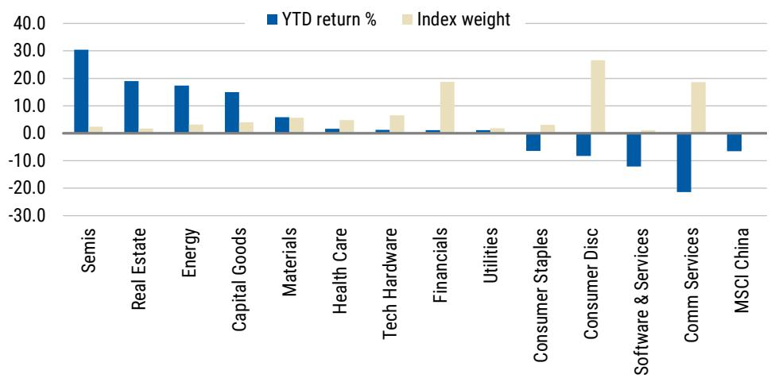

bar

| Category | YTD return % | Index weight |
| :--- | :--- | :--- |
| Semis | 30.0 | 2.0 |
| Real Estate | 19.0 | 1.0 |
| Energy | 17.0 | 2.5 |
| Capital Goods | 15.0 | 3.0 |
| Materials | 6.0 | 5.0 |
| Health Care | 1.5 | 4.5 |
| Tech Hardware | 1.0 | 6.0 |
| Financials | 1.0 | 18.0 |
| Utilities | 1.0 | 1.5 |
| Consumer Staples | -5.0 | 3.0 |
| Consumer Disc | -8.0 | 26.0 |
| Software & Services | -12.0 | 1.0 |
| Comm Services | -22.0 | 18.0 |
| MSCI China | -5.0 | 0.0 |

Source: FactSet, MS. Data as of May 8, 2026.

Exhibit 3: MSCI China's pro forma index weight by sector – Capital Goods, Semis, Materials, Tech Hardware and Energy would see the biggest rise in weighting   
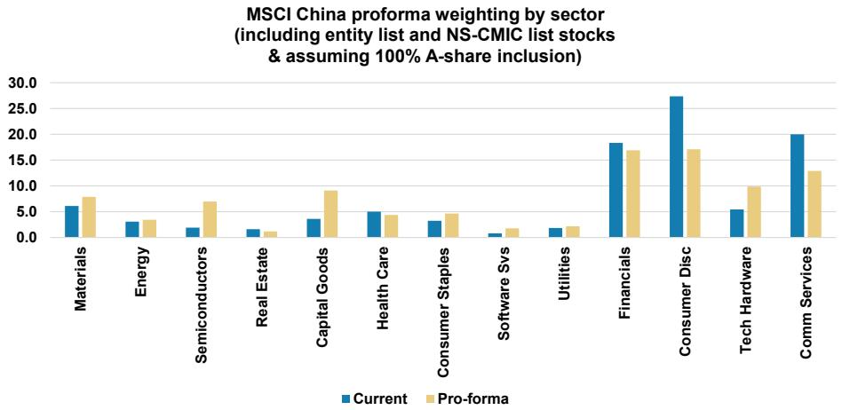

bar

MSCI China proforma weighting by sector (including entity list and NS-CMIC list stocks & assuming 100% A-share inclusion)
| Sector | Current | Pro-forma |
| :--- | :--- | :--- |
| Materials | 6 | 8 |
| Energy | 3 | 4 |
| Semiconductors | 2 | 7 |
| Real Estate | 2 | 1 |
| Capital Goods | 4 | 9 |
| Health Care | 5 | 5 |
| Consumer Staples | 3 | 5 |
| Software Svs | 1 | 2 |
| Utilities | 2 | 2 |
| Financials | 18 | 17 |
| Consumer Disc | 27 | 17 |
| Tech Hardware | 5 | 10 |
| Comm Services | 20 | 13 |

Source: US government websites, Factset, MS.

Exhibit 3 shows that the outperforming sectors collectively would gain 13ppt in index weight while e-commerce will lose 17ppt within MSCI China, based on our calculation of pro forma index weight for MSCI China by adding back the entity list and MS-CMIC list stocks, and assuming 100% inclusion factors for qualified A-share index constituents. As a result the overall China equity space performance should be meaningfully better than shown by the current index. We also believe that focusing on these structural thematic investment opportunities would help generate better returns vs. passively investing at the index level.

# Earnings outlook modestly improving, thanks to three key reasons

Looking into the next 6-12 months, we see a marginally better earnings growth outlook...

...and believe that the momentum in earnings estimate cuts could start to decelerate from 2H: Three key developments are the key driving force behind it:

1. Stronger export growth and near-term reflation signs;   
2. Stronger-than-expected CNY against USD; and most importantly   
3. Earnings damage peaking from large-cap platform companies' intense price competition, with strict enforcement of government regulation having started in April.

However, we remind investors that, as we go through 1Q results season, we may experience another round of reductions before things start to lighten up with 2Q results from July: This is because the biggest earnings growth driver at the sector level for MSCI China remains the Internet platform companies. Implementation of anti-involution price war regulation has only been strictly enforced since April, suggesting that recovery of earnings damage will only start to show up in 2Q results.

# Geopolitical developments enhancing China's positioning

2025 was an inflection point for US-China relations as the two countries agreed to a 'truce', with each party holding an effective card against the other – for the US, tech restrictions against China; for China, the rare earth card.

We expect the truce to continue, with the upcoming Trump-Xi meeting expected to take place on schedule (May 14-15) and likely producing symbolic deliverables, including selected sets of trade relaxations, and resumption of talks on some other subjects with wider common ground (e.g., fentanyl, climate, aviation, etc.). We believe moderate index level upside is possible as a result of this, as investors direct attention back to China somewhat, after being occupied by the ME/Hormuz situation, as well as the AI-related supercycle that has been making some neighboring markets stand out more (such as Korea, Taiwan and Japan). In addition, China may have additional leverage from the potential role it could play in the ME situation – the latest visit by Iran's foreign minister to Beijing (May 6th) ahead of the US-China summit also supports this.

The prolonged Middle East situation will likely reinforce the high-end power/green tech theme, as energy sufficiency and efficiency gets higher prioritization globally, and where China is best positioned with its highly competitive supply chain. Ongoing US-China competition will continue to enhance China's focus on tech localization with policy support, especially in AI/semi and bio-tech. We believe those themes are longer-term sustainable, eventually nurturing more global champions with valuation re-ratings and a bigger share of the overall China equity market.

Exhibit 4: China's global export market share - MS forecasts another 1-2ppt expansion by 2030 in base case   
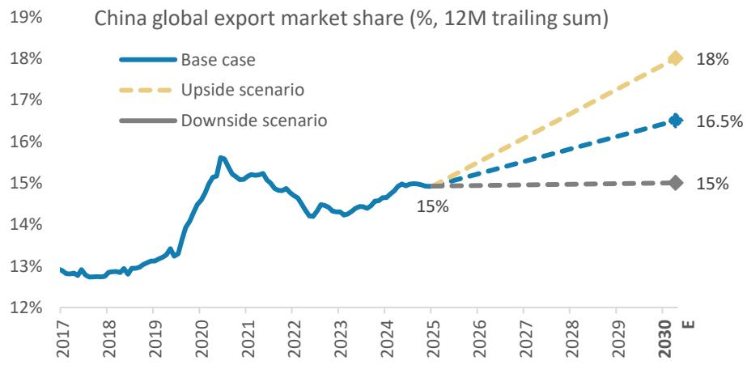

line

| Year | Base case | Upside scenario | Downside scenario |
|------|-----------|-----------------|-------------------|
| 2025 | 15%       | 15%             | 15%               |
| 2030 | 16.5%     | 18%             | 15%               |

Source: Haver, MS forecasts.

# Fluid factors worth monitoring

Aside from near-term downward pressure on earnings estimates, we see three factors that could also increase market volatility for China:

1) Sizable HK IPO share unlocking in July vs. Hang Seng Tech Index and Southbound inclusion events: The two best performing stocks in the HK market year to date – Minimax and Knowledge Atlas – could be included into Hang Seng Tech and Hang Seng

Indices with an approximate combined index weighting of 5-7% and 1-3%, respectively, in early June, based on index review methodology. These two companies should join Stock Connect South Bound in June (Knowledge Atlas) and August (MiniMax), respectively, based on Stock Connect inclusion criteria. These inclusion events would help drive positive momentum towards these indices, inflows into benchmarked ETF funds, and Southbound purchases. On the other hand, the first major unlocking of IPO shares for Minimax (0100.HK) will take place on July 8th 2026, which could push up the company's free float market cap. from its current \~25% of total market cap. to \~33%. This usually tends to cause near-term selling pressure to the stock/theme and may cancel/cannibalize the ETF flows/SB flows discussed earlier.

2) Domestic deflationary environment – when is the inflection? The MS China Economics team are expecting an improved overall inflation reading as they expect exports to continue anchoring China's growth amid the energy shock. They lift 2026 real GDP by 0.1ppt to 4.8%, and GDP deflator by 0.3ppt to 0.5% (China Economics Mid-Year Outlook: Upgrading Growth to reflect AI and Energy Capex Super-cycle), with policy on cruise control. That said, they believe that consumption will still lag amid modest spillover to jobs, leaving reflation narrow in a two-speed economy. The biggest drag on private consumption, the property market, is still facing lofty primary housing inventories with our MS sector team taking a conservative view (China Property: Our Thoughts on Recent Stronger-than-Expected Sales). If we could see any upside surprise from the property market bottoming-out and/or private consumption re-accelerating, we would be more convinced of bigger upside at the broad index level.

3) Still wide range of global macro growth paths: Our Global Economics team has emphasized that the potential paths for US growth and inflation will be unusually important in defining the global macro outlook for the next 12 months. Their baseline scenario for the US sees growth drags and inflation boosts have only a modest and temporary effect on the US (assuming that the conflict with Iran is resolved in the next month), and the Fed reacts to softening inflation in early 2027 with two cuts. In addition to the base case, an AI productivity surge, upside aggregate demand, and two oil scenarios – a permanent risk premium in the price and a “demand destruction” scenario that is recessionary. Those alternative macro growth paths in 2026 could also have different implications for China's macro growth, and top-down fiscal and monetary policies, especially given that export growth has been the bigger growth driver for Chinese economy in recent quarters.

# 2Q 2027 price targets: Moderate upside

As a result, we expect moderate index level upside led mainly by earnings growth and marginal valuation upside, and the overall next-12-month path should become smoother from 2H, with 1) more clarity on the global energy crisis, 2) more stable US-China relations, 3) earnings cuts bottoming out, and 4) China further establishing dominant positions in global high-end supply chains.

We see slightly higher earnings growth for 2026 for MSCI China at 7% (vs. 6% previously) for reasons discussed. We also see marginal valuation upside vs. the current level (12.2x vs. 11.9x) but lower than our previous forecast at 12.7x due to a delay in the Fed rate cut cycle and overall smaller liquidity support from the Southbound channel compared to

2025.

Our new 2Q 2027 targets for the Hang Seng (28,400), HSCEI (9,900), MSCI China (91), and CSI300 (5,400) imply upside of 8%, 11%, 12% and 11% from current levels (as of May 8th), respectively.

Exhibit 5: 2Q 2027 bull/base/bear index targets for MS Asia/EM coverage equity indices: 8-12% upside for Chinese equity indices in our base case 

<table><tr><td rowspan="2"></td><td rowspan="2">Index</td><td rowspan="2">Current Price</td><td rowspan="2">MS Target Price (2Q-2027)</td><td colspan="4">MS Top-Down EPS YoY %</td><td colspan="3">Consensus EPS Forecast YoY %</td><td rowspan="2">MS Target Fwd P/E 2Q - 2027</td><td rowspan="2">Consensus 12m Fwd P/E Current</td></tr><tr><td>Dec-26</td><td>Dec-27</td><td>2Q-28</td><td>Dec-28</td><td>Dec-26</td><td>Dec-27</td><td>Dec-28</td></tr><tr><td rowspan="7">Base Case</td><td>TOPIX</td><td>3,829</td><td>4,30012%</td><td>2169%</td><td>2359%</td><td>2469%</td><td>26312%</td><td>22411%</td><td>25112%</td><td>27610%</td><td>17.5x</td><td>16.4x</td></tr><tr><td>MSCI EM</td><td>1,711</td><td>1,8005%</td><td>12540%</td><td>1369%</td><td>1396%</td><td>1414%</td><td>13051%</td><td>15419%</td><td>17413%</td><td>13.0x</td><td>12.4x</td></tr><tr><td>MSCI APxJ</td><td>879</td><td>9002%</td><td>5940%</td><td>648%</td><td>655%</td><td>652%</td><td>6151%</td><td>7319%</td><td>8212%</td><td>14.0x</td><td>13.6x</td></tr><tr><td>Hang Seng</td><td>26,394</td><td>28,4008%</td><td>2,2547%</td><td>2,4087%</td><td>2,4836%</td><td>2,5576%</td><td>2,27012%</td><td>2,49910%</td><td>2,7339%</td><td>11.4x</td><td>11.3x</td></tr><tr><td>HSCEI</td><td>8,889</td><td>9,90011%</td><td>9395%</td><td>9936%</td><td>10226%</td><td>10506%</td><td>9215%</td><td>9796%</td><td>1,0477%</td><td>9.7x</td><td>9.8x</td></tr><tr><td>MSCI China</td><td>81</td><td>9112%</td><td>6.67%</td><td>7.210%</td><td>7.58%</td><td>7.77%</td><td>6.514%</td><td>7.515%</td><td>8.513%</td><td>12.2x</td><td>11.9x</td></tr><tr><td>CSI300</td><td>4,872</td><td>5,40011%</td><td>31510%</td><td>34710%</td><td>36310%</td><td>3789%</td><td>35018%</td><td>39513%</td><td>44212%</td><td>14.8x</td><td>14.6x</td></tr><tr><td rowspan="7">Bull Case</td><td>TOPIX</td><td>3,829</td><td>4,89028%</td><td>22413%</td><td>25514%</td><td>27215%</td><td>29014%</td><td>22411%</td><td>25112%</td><td>27610%</td><td>18.0x</td><td>16.4x</td></tr><tr><td>MSCI EM</td><td>1,711</td><td>2,10023%</td><td>13550%</td><td>1479%</td><td>1507%</td><td>1545%</td><td>13051%</td><td>15419%</td><td>17413%</td><td>14.0x</td><td>12.4x</td></tr><tr><td>MSCI APxJ</td><td>879</td><td>1,08023%</td><td>6553%</td><td>7210%</td><td>726%</td><td>732%</td><td>6151%</td><td>7319%</td><td>8212%</td><td>15.0x</td><td>13.6x</td></tr><tr><td>Hang Seng</td><td>26,394</td><td>32,40023%</td><td>2,2998%</td><td>2,5049%</td><td>2,5898%</td><td>2,6757%</td><td>2,27012%</td><td>2,49910%</td><td>2,7339%</td><td>12.5x</td><td>11.3x</td></tr><tr><td>HSCEI</td><td>8,889</td><td>11,00024%</td><td>9586%</td><td>1,0136%</td><td>1,0466%</td><td>1,0797%</td><td>9215%</td><td>9796%</td><td>1,0477%</td><td>10.6x</td><td>9.8x</td></tr><tr><td>MSCI China</td><td>81</td><td>10327%</td><td>6.78%</td><td>7.411%</td><td>7.79%</td><td>8.08%</td><td>6.514%</td><td>7.515%</td><td>8.513%</td><td>13.3x</td><td>11.9x</td></tr><tr><td>CSI300</td><td>4,872</td><td>6,09025%</td><td>32111%</td><td>36112%</td><td>38112%</td><td>40111%</td><td>35018%</td><td>39513%</td><td>44212%</td><td>16.0x</td><td>14.6x</td></tr><tr><td rowspan="7">Bear Case</td><td>TOPIX</td><td>3,829</td><td>2,600-32%</td><td>2022%</td><td>2094%</td><td>2177%</td><td>2226%</td><td>22411%</td><td>25112%</td><td>27610%</td><td>12.0x</td><td>16.4x</td></tr><tr><td>MSCI EM</td><td>1,711</td><td>1,100-36%</td><td>10316%</td><td>101-2%</td><td>100-2%</td><td>99-2%</td><td>13051%</td><td>15419%</td><td>17413%</td><td>11.0x</td><td>12.4x</td></tr><tr><td>MSCI APxJ</td><td>879</td><td>590-33%</td><td>5021%</td><td>512%</td><td>511%</td><td>510%</td><td>6151%</td><td>7319%</td><td>8212%</td><td>11.5x</td><td>12.9x</td></tr><tr><td>Hang Seng</td><td>26,394</td><td>18,000-32%</td><td>2,1414%</td><td>2,2395%</td><td>2,3095%</td><td>2,3786%</td><td>2,27012%</td><td>2,49910%</td><td>2,7339%</td><td>7.8x</td><td>11.3x</td></tr><tr><td>HSCEI</td><td>8,889</td><td>6,200-30%</td><td>8923%</td><td>9234%</td><td>9343%</td><td>9452%</td><td>9215%</td><td>9796%</td><td>10477%</td><td>6.7x</td><td>9.8x</td></tr><tr><td>MSCI China</td><td>81</td><td>60-26%</td><td>6.13%</td><td>6.45%</td><td>6.65%</td><td>6.75%</td><td>6.514%</td><td>7.515%</td><td>8.513%</td><td>9.1x</td><td>11.9x</td></tr><tr><td>CSI300</td><td>4,872</td><td>3,550-27%</td><td>3047%</td><td>3195%</td><td>3265%</td><td>3334%</td><td>35018%</td><td>39513%</td><td>44212%</td><td>10.9x</td><td>14.6x</td></tr></table>

Source: RIMES, MSCI, FactSet, IBES, Datastream, Bloomberg, MS. Data as of May 8, 2026.

# Stay equal-weight on China within our EM/APxJ framework given MSCI China's suppressed performance due to index composition limits

We maintain our equal-weight recommendation for MSCI China within the global EM/AxJ framework as we see largely comparable upside compared to the broad MSCI EM index. As explained earlier, the sectors that we believe will outperform the index are artificially less represented in the index due to composition rule limits.

We do believe that the sheer size of opportunities in China's equity market at the single stock and thematic level – fueled by solid fundamentals and promising themes (e.g. tech localization, high-end manufacturing, etc.) – should allow investors to construct a targeted Chinese portfolio that outperforms other peers.

We highly recommend high-quality stocks with strong tech/innovation capabilities given their closer alignment with China's 15th Five-YHear Plan, and stocks showing promise of taking a bigger global footprint to meet demand for energy sufficiency and efficiency. Other catalyst-driven stock ideas, such as US-China summit beneficiaries and Southbound inclusion, are also worth considering.

Exhibit 6: MSCI China relative performance (vs. MSCI EM, by index total return in USD) & MS rating history on China – Stay equal-weight   
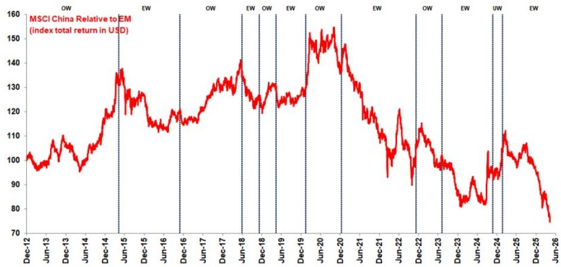

line

| Date    | MSCI China Relative to EM (index total return in USD) |
|---------|--------------------------------------------------------|
| Dec-12  | 100                                                    |
| Jun-13  | 98                                                     |
| Dec-13  | 105                                                    |
| Jun-14  | 102                                                    |
| Dec-14  | 115                                                    |
| Jun-15  | 135                                                    |
| Dec-15  | 125                                                    |
| Jun-16  | 118                                                    |
| Dec-16  | 115                                                    |
| Jun-17  | 120                                                    |
| Dec-17  | 130                                                    |
| Jun-18  | 140                                                    |
| Dec-18  | 125                                                    |
| Jun-19  | 130                                                    |
| Dec-19  | 135                                                    |
| Jun-20  | 150                                                    |
| Dec-20  | 145                                                    |
| Jun-21  | 130                                                    |
| Dec-21  | 120                                                    |
| Jun-22  | 105                                                    |
| Dec-22  | 95                                                     |
| Jun-23  | 100                                                    |
| Dec-23  | 85                                                     |
| Jun-24  | 90                                                     |
| Dec-24  | 95                                                     |
| Jun-25  | 105                                                    |
| Dec-25  | 90                                                     |
| Jun-26  | 75                                                     |

Source: MSCI, FactSet, Datastream, MS. Data as of May 7, 2026; Past performance is no guarantee of future results.

# What could get us more bullish at the broad index level?

- A clearer path to an earlier-than-expected breakout of the current deflationary trend would be extremely important.   
- More sustained global geopolitical situation, particularly on a quicker and sustainable solution to the energy shock and/or a much improved US/China relationship.   
- Further breakthrough of China's technology advancement, with potential addressable market size expanding to cover more regional and even global market share. Meaningful improvement of LLM capabilities and monetization outlook by the major hyperscalers would provide much better support for the broad index.

# Bull-bear spread remains wide

Our bear/bull targets for 2Q 2027 represent a rather wide range of Chinese equity market performance outcomes (for MSCI China, from bear -26% to bull +27%).

A bull case would entail a much earlier breakout from the current deflation cycle, combined with an improved US/China relationship, supported by the upcoming US-China presidential summit in Beijing. Together with steady and robust R&D development by Chinese companies, and more global champions rising in the higher-end manufacturing supply chain, a much higher valuation would be justified. This scenario would suggest meaningful upside for Chinese equities at 27% for MSCI China. We would expect MSCI China's valuation discount vs. MSCI EM to compress (from 6.5%, as suggested by the base case to 4.7%) as China regains the status as a robust growth economy.

Bear case: WSe would expect a much worse deterioration of domestic macro conditions with deflation further entrenched across different segments of the economy. Moreover, a much gloomier global growth slowdown or even recession would significantly dampen export growth for China, which currently serves as the biggest growth driver for the economy. In addition, unexpected disruption could re-emerge on the US/China front, which could cause spike in the equity risk premium. We think such a combination would send the market much lower (Exhibit 7, Exhibit 8). Valuations could de-rate, back to 9.1x 12-month forward P/E for MSCI China, while earnings growth could also slow to 3% in 2026, and continue to stagnate in 2027, reflecting the more challenging macro environment.

Exhibit 7: MS index target history for Hang Seng (bull, base, bear) – We set our base-case 2Q 2027 target at 28,400, implying 8% upside from the close on May 8, 2026   
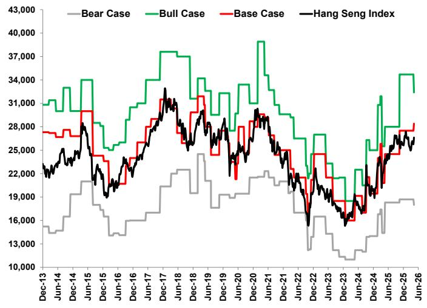

line

| Date    | Bear Case | Bull Case | Base Case | Hang Seng Index |
|---------|-----------|-----------|-----------|-----------------|
| Dec-13  | 15,000    | 31,000    | 28,000    | 22,000          |
| Jun-14  | 16,000    | 32,000    | 29,000    | 23,000          |
| Dec-14  | 17,000    | 33,000    | 30,000    | 24,000          |
| Jun-15  | 18,000    | 34,000    | 31,000    | 25,000          |
| Dec-15  | 19,000    | 35,000    | 32,000    | 26,000          |
| Jun-16  | 20,000    | 36,000    | 33,000    | 27,000          |
| Dec-16  | 21,000    | 37,000    | 34,000    | 28,000          |
| Jun-17  | 22,000    | 38,000    | 35,000    | 29,000          |
| Dec-17  | 23,000    | 39,000    | 36,000    | 30,000          |
| Jun-18  | 24,000    | 40,000    | 37,000    | 31,000          |
| Dec-18  | 25,000    | 41,000    | 38,000    | 32,000          |
| Jun-19  | 26,000    | 42,000    | 39,000    | 33,000          |
| Dec-19  | 27,000    | 43,000    | 40,000    | 34,000          |
| Jun-20  | 28,000    | 44,000    | 41,000    | 35,000          |
| Dec-20  | 29,000    | 45,000    | 42,000    | 36,000          |
| Jun-21  | 30,000    | 46,000    | 43,000    | 37,000          |
| Dec-21  | 31,000    | 47,000    | 44,000    | 38,000          |
| Jun-22  | 32,000    | 48,000    | 45,000    | 39,000          |
| Dec-22  | 33,000    | 49,000    | 46,000    | 40,000          |
| Jun-23  | 34,000    | 50,000    | 47,000    | 41,000          |
| Dec-23  | 35,000    | 51,000    | 48,000    | 42,000          |
| Jun-24  | 36,000    | 52,000    | 49,000    | 43,000          |
| Dec-24  | 37,000    | 53,000    | 50,000    | 44,000          |
| Jun-25  | 38,000    | 54,000    | 51,000    | 45,000          |
| Dec-25  | 39,000    | 55,000    | 52,000    | 46,000          |
| Jun-26  | 40,000    | 56,000    | 53,000    | 47,000          |

Source: RIMES, FactSet, MS forecasts. Weekly price index data as of May 8, 2026.

Exhibit 8: MS index target history for MSCI China (bull, base, bear) – We set our base-case 2Q 2027target at 91, implying 12% upside from the close on May 8, 2026   
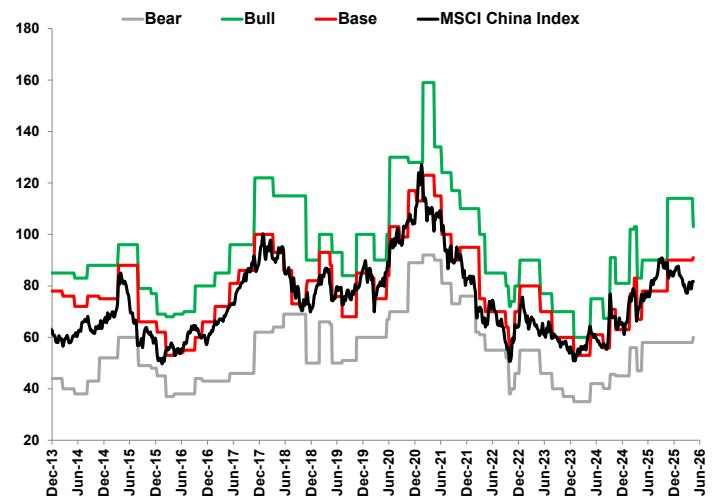

line

| Date    | Bear | Bull | Base | MSCI China Index |
|---------|------|------|------|------------------|
| Dec-13  | 40   | 85   | 75   | 60               |
| Jun-14  | 45   | 88   | 78   | 65               |
| Dec-14  | 50   | 90   | 80   | 70               |
| Jun-15  | 55   | 95   | 85   | 75               |
| Dec-15  | 60   | 80   | 70   | 60               |
| Jun-16  | 55   | 85   | 75   | 65               |
| Dec-16  | 60   | 90   | 80   | 70               |
| Jun-17  | 65   | 95   | 85   | 75               |
| Dec-17  | 70   | 100  | 90   | 80               |
| Jun-18  | 75   | 105  | 95   | 85               |
| Dec-18  | 80   | 110  | 100  | 90               |
| Jun-19  | 85   | 115  | 105  | 95               |
| Dec-19  | 90   | 120  | 110  | 100              |
| Jun-20  | 95   | 125  | 115  | 105              |
| Dec-20  | 100  | 130  | 120  | 110              |
| Jun-21  | 105  | 135  | 125  | 115              |
| Dec-21  | 110  | 140  | 130  | 120              |
| Jun-22  | 115  | 145  | 135  | 125              |
| Dec-22  | 120  | 150  | 140  | 130              |
| Jun-23  | 125  | 155  | 145  | 135              |
| Dec-23  | 130  | 160  | 150  | 140              |
| Jun-24  | 135  | 165  | 155  | 145              |
| Dec-24  | 140  | 170  | 160  | 150              |
| Jun-25  | 145  | 175  | 165  | 155              |
| Dec-25  | 150  | 180  | 170  | 160              |
| Jun-26  | 155  | 185  | 175  | 165              |

Source: RIMES, FactSet, MS forecasts. Weekly price index data as of May 8, 2026.

# We prefer A-shares over China's offshore markets

We still prefer A shares on a full-year 2026 basis given the following reasons:

- Higher concentration of high-end upstream manufacturing and hard-core tech companies, which we continue to like as a multi-year long-term investment thesis;   
• Highly anticipated potential A-share IPOs, such as YMTC, CXMT, and Unitree

Technology, are likely to generate bigger participation by domestic institutional and retail investors;

\- National Team standing by. We reiterate that the National Team sold approximately US\$80bn worth of positions back in Jan-Feb 2026. These funds could be directed to smooth short-term market volatilities, as well as invest in longer-term, more strategic and thematic ETFs.

# Sector preferences & recommended trades – Focus more on thematic stock picking; less on index

We strongly prefer upstream asset-focused sectors that are less disruptable by the AI super cycle, compounded by the rising likelihood of taking over more global market share with the backdrop of energy sufficiency and efficiency being re-prioritized. Those sectors include selected Materials, Industrials, and Energy. We also like the tech localization theme, which should continue to benefit semis particularly within IT. We maintain moderate exposure to Financials (Insurance and Exchanges), as well as yield plays, to continue to receive stable cash payments that help smooth any potential market volatility. We stay underweight on sectors dragged down by gloomy macro conditions, i.e., Real Estate and Consumer Staples.

Key trades for 2H2026:

1. A-shares > offshore, given bigger focus on tech and high-end manufacturing;   
2. Sector-wise overweight on selected Materials, Industrials, Semis and Insurance; underweight consumer and property;   
3. Upstream global energy self-sufficiency beneficiaries with growing export footprints.

We provide detailed discussions and rationales for each of these trades in Key trades for the next 12 months.

# MS's equity framework for China – we see brighter spots in earnings and currency

# What our framework says – Earnings cut decelerating amid stronger forecast of USDCNY amid global macro uncertainty

We revisit our equity market evaluation framework for China (Exhibit 9) and highlight how the key influencing factors have evolved and what the overall market impact is likely to be. The arrows in the exhibit show the incremental dynamic shifts (improving/deteriorating) compared with the past. In general, we would like to see at least three or more factors improving before becoming more constructive on the market.

# For the 2026 mid-year outlook review cycle, we see a few trends that collectively point towards a slightly better outlook with some serious uncertainty lingering:

Positives: significant pressure for consensus estimate reductoins to lessen; stronger outlook for USDCNY compared to 6 months ago.

We see the upcoming US-China presidential meeting (May 14-15) as a potential minor positive from a US-China relationship perspective with selected sectors and stocks likely to benefit. However, more clarity is definitely needed to judge its magnitude and sustainability, especially given the global geopolitical uncertainty.

The negatives and the unknowns: The biggest question mark remains the uncertainty around the global macro growth outlook against the backdrop of a still-ongoing energy crisis. MS's latest Fed rate policy path has been pushed out to two cuts in 1H 2027 compared to late 2026 when the new year outlook was published. We are also mindful that the global energy shock situation remains fluid and expectations for inflation, macro growth, etc., are subject to change and could impact global central bank policies as well.

Exhibit 9: MS China Equity Strategy framework – Earnings pressure reappears while US/China tension eases   
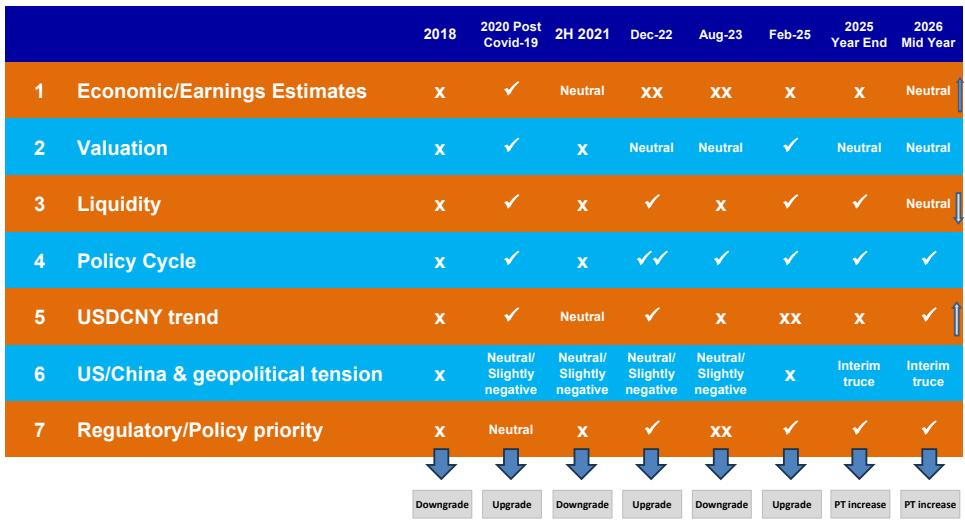

bar

| Category | 2018 | 2020 Post Covid-19 | 2H 2021 | Dec-22 | Aug-23 | Feb-25 | 2025 Year End | 2026 Mid Year |
|---|---|---|---|---|---|---|---|---|
| 1 | Economic/Earnings Estimates | x | ✓ | Neutral | xx | xx | x | Neutral |
| 2 | Valuation | x | ✓ | x | Neutral | Neutral | ✓ | Neutral |
| 3 | Liquidity | x | ✓ | x | ✓ | x | ✓ | ✓ |
| 4 | Policy Cycle | x | ✓ | x | ✓✓<fcel>✓ | ✓ | ✓ | ✓ |
| 5 | USDCNY trend | x | ✓ | Neutral | ✓ | x | xx | x |
| 6 | US/China & geopolitical tension | x | Neutral/ Slightly negative | Neutral/ Slightly negative | Neutral/ Slightly negative | Neutral/ Slightly negative | x | Interim truce |
| 7 | Regulatory/Policy priority | x | Neutral | x | ✓ | xx | ✓ | ✓ |
Downgrade Upgrade Downgrade Upgrade Downgrade Upgrade PT increase PT increase

Source: MS. Tick indicates our view on the factor is improving, while x indicates the factor is deteriorating, and xx indicates a greater level of deterioration.

# Earnings outlook modestly improving, thanks to three key reasons

Looking into the next 6-12 months, we see a marginally better earnings growth outlook and believe that the momentum in earnings estimate cuts could start to decelerate from 2H. Three key developments, in our view, are the key driving force behind it:

# 1) Stronger export growth and AI/Energy capex supercycle.

MS China economics team lifts their 2026 real GDP growth forecast by 0.1ppt to 4.8%, sustained at 4.7% in 2027. They expect export growth to still lead growth given that the Middle East conflict is accelerating green-transition demand, which plays to China's renewable supply chain, while supply chain resilience enables incremental export market-share gains. They also raise the GDP deflator forecast 0.3ppt, to 0.5%, as structural tailwinds in AI, energy transition, and supply chain resilience - culminating in strong exports - largely offset the drag from higher oil prices.

Exhibit 10: China – GDP growth history and forecasts – MS forecasts 2026 and 2027 real GDP to be at 4.8% and 4.7%, respectively   
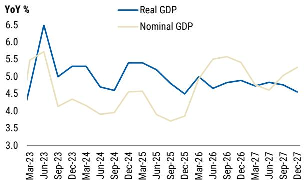

line

| Date   | Real GDP | Nominal GDP |
|--------|----------|-------------|
| Mar-23 | 4.3      | 5.0         |
| Jun-23 | 6.5      | 5.8         |
| Sep-23 | 5.0      | 4.1         |
| Dec-23 | 5.3      | 4.3         |
| Mar-24 | 5.3      | 4.0         |
| Jun-24 | 4.7      | 3.9         |
| Sep-24 | 4.6      | 4.0         |
| Dec-24 | 5.4      | 4.6         |
| Mar-25 | 5.4      | 4.6         |
| Jun-25 | 5.2      | 3.9         |
| Sep-25 | 4.8      | 3.7         |
| Dec-25 | 4.5      | 3.8         |
| Mar-26 | 5.0      | 5.0         |
| Jun-26 | 4.7      | 5.6         |
| Sep-26 | 4.9      | 5.5         |
| Dec-26 | 4.9      | 5.3         |
| Mar-27 | 4.8      | 4.7         |
| Jun-27 | 4.9      | 4.6         |
| Sep-27 | 4.8      | 5.0         |
| Dec-27 | 4.6      | 5.3         |

Source: CEIC, MS estimates

Exhibit 11: China – GDP deflator (yoy%) – Deflation Persists in 2026, Reflation Ahead in 2027   
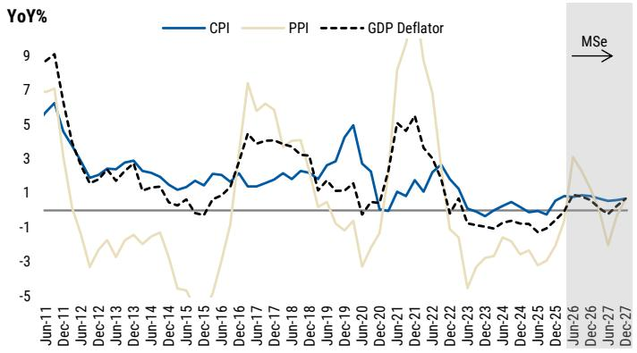

line

| Date    | CPI  | PPI  | GDP Deflator |
|---------|------|------|--------------|
| Jun-11  | 6.0  | 7.0  | 9.0          |
| Dec-11  | 5.0  | -3.0 | 8.0          |
| Jun-12  | 2.0  | -1.0 | 1.0          |
| Dec-12  | 3.0  | -2.0 | 2.0          |
| Jun-13  | 2.5  | -1.5 | 1.5          |
| Dec-13  | 2.0  | -1.0 | 1.0          |
| Jun-14  | 1.5  | -0.5 | 0.5          |
| Dec-14  | 1.0  | -0.5 | 0.0          |
| Jun-15  | 1.5  | -0.5 | -0.5         |
| Dec-15  | 2.0  | -5.0 | -1.0         |
| Jun-16  | 2.5  | -3.0 | -2.0         |
| Dec-16  | 3.0  | -1.0 | -3.0         |
| Jun-17  | 4.0  | 7.0  | -4.0         |
| Dec-17  | 3.5  | 6.0  | -3.5         |
| Jun-18  | 3.0  | 5.0  | -3.0         |
| Dec-18  | 2.5  | 4.0  | -2.5         |
| Jun-19  | 3.0  | 3.0  | -2.0         |
| Dec-19  | 4.5  | -1.0 | -1.5         |
| Jun-20  | 3.0  | -3.0 | -1.0         |
| Dec-20  | 2.0  | -1.0 | -0.5         |
| Jun-21  | 1.0  | 9.0  | -0.5         |
| Dec-21  | 2.0  | -1.0 | -0.5         |
| Jun-22  | 3.0  | -3.0 | -1.0         |
| Dec-22  | 2.0  | -4.0 | -1.5         |
| Jun-23  | 1.5  | -3.0 | -2.0         |
| Dec-23  | 1.0  | -2.0 | -2.5         |
| Jun-24  | 0.5  | -1.0 | -3.0         |
| Dec-24  | 0.5  | -1.5 | -3.5         |
| Jun-25  | 0.5  | -2.0 | -4.0         |
| Dec-25  | 1.0  | -1.5 | -3.5         |
| Jun-26  | 1.5  | -1.0 | -3.0         |
| Dec-26  | 1.0  | -0.5 | -2.5         |
| Jun-27  | 0.5  | -1.0 | -2.0         |
| Dec-27  | 0.5  | -1.5 | -1.5         |

Source: CEIC, MS estimates

Exhibit 12:   
China – real GDP growth by expenditure – magnitude of fiscal stimulus would remain modest   
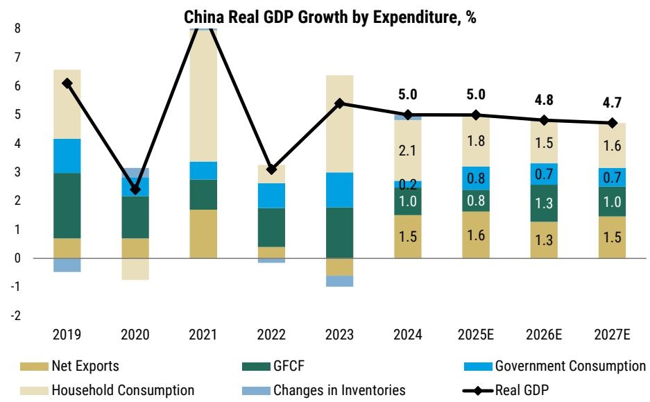

bar_line

China Real GDP Growth by Expenditure, %
| Year | Net Exports (%) | GFCF (%) | Government Consumption (%) | Household Consumption (%) | Changes in Inventories (%) | Real GDP (in %) |
| :--- | :--- | :--- | :--- | :--- | :--- | :--- |
| 2019 | 0.6 | 2.4 | 1.3 | 1.8 | -0.5 | 6.1 |
| 2020 | 0.6 | 1.4 | 0.3 | -0.7 | 0.2 | 2.4 |
| 2021 | 1.7 | 1.1 | 0.6 | 4.5 | -0.1 | 8.0 |
| 2022 | 0.3 | 1.3 | 0.9 | 0.7 | -0.2 | 3.1 |
| 2023 | 0.8 | 1.7 | 1.3 | 2.5 | -0.8 | 5.4 |
| 2024 | 1.5 | 1.0 | 0.2 | 2.1 | 0.3 | 5.0 |
| 2025E | 1.6 | 0.8 | 0.8 | 1.8 | -0.1 | 5.0 |
| 2026E | 1.3 | 1.3 | 0.7 | 1.5 | -0.1 | 4.8 |
| 2027E | 1.5 | 1.0 | 0.7 | 1.6 | -0.1 | 4.7 |

Source: NBS, MS (E) estimates

# 2) Earnings damage peaking from large-cap platform companies' price war, with the strict government regulation being enforced from April.

China's top market regulator (SAMR, the State Administration for Market Regulation) summoned major e-commerce and internet platforms in Feb. 2026 (e.g. Alibaba, JD.com, Meituan, Douyin, Tencent, Baidu). The meeting was part of a broader regulatory push to curb intense price competition and aggressive promotional practices. Authorities explicitly told companies to stop “involution-style competition” (this refers to excessive discounting/sUBSidies, and competing on price at or below cost while creating little real productivity or innovation gain). Strictly enforced rules then took effect on April 10, 2026. Announced jointly by NDRC, SAMR, and the Cyber Administration of China, the rules banned e-commerce platforms from forcing merchants to set the lowest prices, or using algorithms to set different prices for users without consent. Our MS China internet team has also flagged that fast delivery competition-driven losses should have peaked for companies like Baba and Meituan.

Given the dominant share of platform e-commerce companies in MSCI China earnings growth breakdown (Exhibit 13), we take the peaking of price competition as a positive catalyst for the sUBSequent earnings trend.

Exhibit 13: Growth breakdown: MSCI China consensus 2026 EPS - Internet/E-commerce contribute 40% of consensus earnings yoy growth   
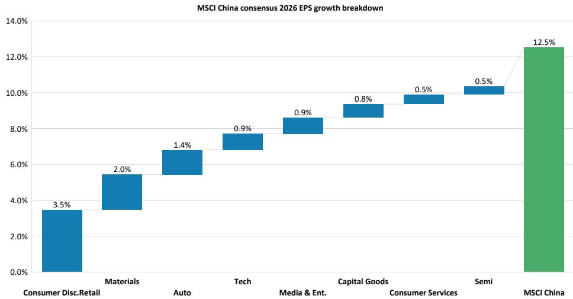

bar

MSCI China consensus 2026 EPS growth breakdown
| Sector | Growth (%) |
| :--- | :--- |
| Consumer Disc.Retail | 3.5 |
| Materials | 2.0 |
| Auto | 1.4 |
| Tech | 0.9 |
| Media & Ent. | 0.9 |
| Capital Goods | 0.8 |
| Consumer Services | 0.5 |
| Semi | 0.5 |
| MSCI China | 12.5 |

Source: IBES, MSCI, Factset, Datastream, MS. Data as of May 8, 2025.

Comparisons between our and consensus estimates are shown in (Exhibit 14, Exhibit 15).

Exhibit 14: MS EPS base-case forecasts for MSCI China at Dec-25, Dec-26 and Dec-27   
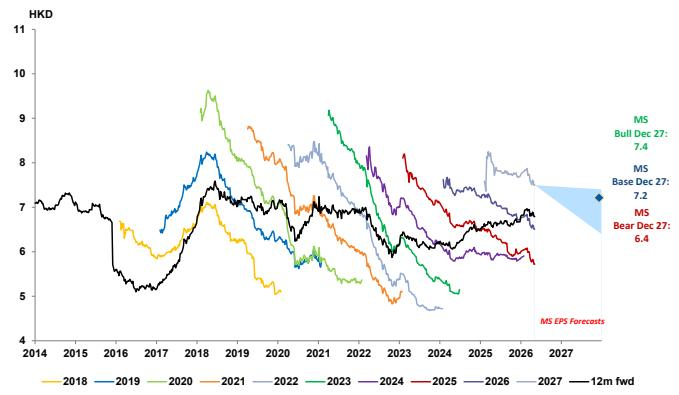

line

| Year | Value |
|------|-------|
| 2018 | 7.2   |
| 2019 | 7.4   |
| 2020 | 7.2   |
| 2021 | 7.2   |
| 2022 | 7.2   |
| 2023 | 6.4   |
| 2024 | 6.4   |
| 2025 | 6.4   |
| 2026 | 6.4   |
| 2027 | 6.4   |

Source: IBES, Datastream, MS. Weekly data as of May 7, 2026.

Exhibit 15: MS EPS base-case forecasts for CSI 300 at Dec-25, Dec-26 and Dec-27   
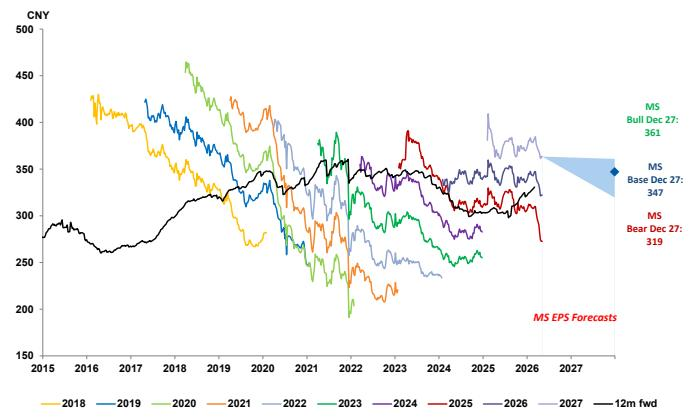

line

| Year | Value |
|------|-------|
| 2018 | ~420  |
| 2019 | ~400  |
| 2020 | ~460  |
| 2021 | ~400  |
| 2022 | ~350  |
| 2023 | ~350  |
| 2024 | ~350  |
| 2025 | ~350  |
| 2026 | ~350  |
| 2027 | ~347  |

Source: IBES, Datastream, MS. Data as of May 7, 2026.

# 3) Modest CNY appreciation against USD (detailed discussion in Section USDCNY trajectory: modest appreciation ahead).

However, we remind investors that as we go through 1Q results season, we may experience another round of downward earnings revisions...

...before things start to lighten up with 2Q results coming out from July: This is because the biggest earnings growth driver at the sector level for MSCI China remains the Internet platform companies. The anti-involution price war regulation implementation had only been strictly enforced since April, suggesting that the improvement of earnings damage will only start to show up in the second quarter results. Preliminary 1Q earnings results across MSCI China and the A-share universe still show sizeable misses by number of companies (Exhibit 16), with the A-share universe starting to show some early signs of earnings misses bottoming out.

Exhibit 16: History of Chinese equity market earnings surprises by number of companies - Slightly better results so far in 1Q26 vs. 4Q25, but still a solid miss   
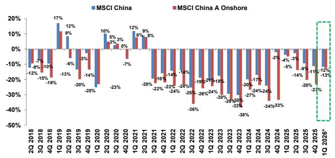

bar

| Quarter | MSCI China (%) | MSCI China A Onshore (%) |
|---|---|---|
| 2Q 2018 | -9 | -12 |
| 3Q 2018 | -7 | -15 |
| 4Q 2018 | -10 | -19 |
| 1Q 2019 | 17 | 9 |
| 2Q 2019 | 12 | -6 |
| 3Q 2019 | -6 | -20 |
| 4Q 2019 | -3 | -14 |
| 1Q 2020 | 10 | -25 |
| 2Q 2020 | 5 | -23 |
| 3Q 2020 | 3 | -7 |
| 4Q 2020 | 0 | -7 |
| 1Q 2021 | 12 | 8 |
| 2Q 2021 | 9 | 8 |
| 3Q 2021 | -8 | -20 |
| 4Q 2021 | -16 | -22 |
| 1Q 2022 | -14 | -23 |
| 2Q 2022 | -14 | -24 |
| 3Q 2022 | -14 | -25 |
| 4Q 2022 | -19 | -26 |
| 1Q 2023 | -24 | -24 |
| 2Q 2023 | -18 | -30 |
| 3Q 2023 | -29 | -33 |
| 4Q 2023 | -30 | -33 |
| 1Q 2024 | -20 | -33 |
| 2Q 2024 | -17 | -33 |
| 3Q 2024 | -24 | -33 |
| 4Q 2024 | -34 | -33 |
| 1Q 2025 | -4 | -5 |
| 2Q 2025 | -5 | -14 |
| 3Q 2025 | -3 | -9 |
| 4Q 2025* | -11 | -25 |
| 1Q 2026* | -13 | -13 |
MSCI China A Onshore
MSCI China China

Source: MSCI, Bloomberg, RIMES, Factset, MS. Data as of May 7, 2026. 1Q 2026\* represents interim cut for 1Q 2026 results.

Exhibit 17: 12-month forward consensus earnings estimate revision breadth (ERB, 3mma) - Trending up but yet to break positive   
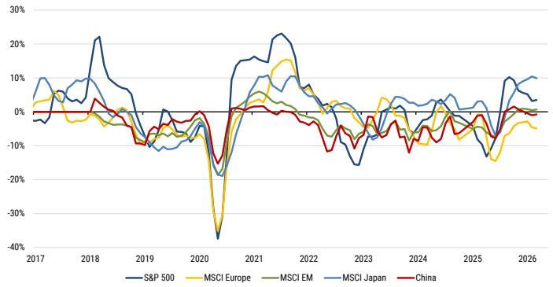

line

| Year | S&P 500 | MSCI Europe | MSCI EM | MSCI Japan | China |
|------|---------|-------------|---------|------------|-------|
| 2017 | ~0%     | ~0%         | ~0%     | ~10%       | ~0%   |
| 2018 | ~20%    | ~-5%        | ~-5%    | ~10%       | ~5%   |
| 2019 | ~-10%   | ~-10%       | ~-10%   | ~-10%      | ~-10% |
| 2020 | ~-40%   | ~-40%       | ~-40%   | ~-20%      | ~-20% |
| 2021 | ~15%    | ~15%        | ~5%     | ~10%       | ~5%   |
| 2022 | ~25%    | ~15%        | ~5%     | ~10%       | ~5%   |
| 2023 | ~-15%   | ~-15%       | ~-15%   | ~-10%      | ~-10% |
| 2024 | ~-5%    | ~-5%        | ~-5%    | ~-5%       | ~-5%  |
| 2025 | ~-10%   | ~-10%       | ~-10%   | ~-5%       | ~-5%  |
| 2026 | ~10%    | ~-5%        | ~-5%    | ~10%       | ~-5%  |

Source: Factset, MS. Note: Monthly data as of April, 2026

For a detailed breakdown of consensus earnings growth estimates as well as MS's bottom-up aggregate earnings growth estimates for MSCI China, please see Exhibit 18 and Exhibit 19.

Exhibit 18: MSCI China consensus EPS decomposition, by industry 

<table><tr><td></td><td colspan="3">Consensus EPS Contribution</td><td colspan="3">EPS Growth</td><td colspan="3">EPS Growth Contribution</td></tr><tr><td>MSCI China</td><td>2025E</td><td>2026E</td><td>2027E</td><td>2025E</td><td>2026E</td><td>2027E</td><td>2025E</td><td>2026E</td><td>2027E</td></tr><tr><td>Automobiles &amp; Components</td><td>0.09</td><td>0.17</td><td>0.25</td><td>22%</td><td>96%</td><td>47%</td><td>0.3%</td><td>1.3%</td><td>1.1%</td></tr><tr><td>Banks</td><td>1.59</td><td>1.62</td><td>1.68</td><td>1%</td><td>1%</td><td>4%</td><td>0.3%</td><td>0.4%</td><td>0.9%</td></tr><tr><td>Capital Goods</td><td>0.16</td><td>0.23</td><td>0.26</td><td>-15%</td><td>47%</td><td>13%</td><td>-0.5%</td><td>1.2%</td><td>0.4%</td></tr><tr><td>Commercial &amp; Professional Services</td><td>0.00</td><td>0.01</td><td>0.02</td><td>NM</td><td>NM</td><td>15%</td><td>0.0%</td><td>0.2%</td><td>0.0%</td></tr><tr><td>Consumer Durables &amp; Apparel</td><td>0.10</td><td>0.12</td><td>0.13</td><td>22%</td><td>11%</td><td>11%</td><td>0.3%</td><td>0.2%</td><td>0.2%</td></tr><tr><td>Consumer Services</td><td>0.14</td><td>0.15</td><td>0.28</td><td>-52%</td><td>12%</td><td>80%</td><td>-2.7%</td><td>0.2%</td><td>1.6%</td></tr><tr><td>Diversified Financials</td><td>0.13</td><td>0.16</td><td>0.18</td><td>4%</td><td>28%</td><td>10%</td><td>0.1%</td><td>0.6%</td><td>0.2%</td></tr><tr><td>Energy</td><td>0.21</td><td>0.24</td><td>0.25</td><td>-13%</td><td>15%</td><td>2%</td><td>-0.6%</td><td>0.5%</td><td>0.1%</td></tr><tr><td>Consumer Staples Distribution &amp; Retail</td><td>0.01</td><td>0.01</td><td>0.02</td><td>15%</td><td>13%</td><td>18%</td><td>0.0%</td><td>0.0%</td><td>0.0%</td></tr><tr><td>Food Beverage &amp; Tobacco</td><td>0.10</td><td>0.12</td><td>0.14</td><td>-20%</td><td>21%</td><td>15%</td><td>-0.4%</td><td>0.3%</td><td>0.2%</td></tr><tr><td>Health Care Equipment &amp; Services</td><td>0.03</td><td>0.03</td><td>0.03</td><td>-22%</td><td>2%</td><td>10%</td><td>-0.1%</td><td>0.0%</td><td>0.0%</td></tr><tr><td>Household &amp; Personal Products</td><td>0.01</td><td>0.01</td><td>0.01</td><td>16%</td><td>6%</td><td>7%</td><td>0.0%</td><td>0.0%</td><td>0.0%</td></tr><tr><td>Insurance</td><td>0.67</td><td>0.60</td><td>0.66</td><td>26%</td><td>-10%</td><td>8%</td><td>2.4%</td><td>-1.1%</td><td>0.7%</td></tr><tr><td>Materials</td><td>0.18</td><td>0.36</td><td>0.40</td><td>22%</td><td>97%</td><td>10%</td><td>0.6%</td><td>2.7%</td><td>0.5%</td></tr><tr><td>Media &amp; Entertainment</td><td>1.05</td><td>1.08</td><td>1.21</td><td>13%</td><td>3%</td><td>12%</td><td>2.1%</td><td>0.4%</td><td>1.7%</td></tr><tr><td>Pharmaceuticals, Biotechnology &amp; Life Sciences</td><td>0.09</td><td>0.12</td><td>0.14</td><td>86%</td><td>32%</td><td>24%</td><td>0.7%</td><td>0.4%</td><td>0.4%</td></tr><tr><td>Real Estate</td><td>0.08</td><td>0.09</td><td>0.11</td><td>12%</td><td>16%</td><td>11%</td><td>0.1%</td><td>0.2%</td><td>0.1%</td></tr><tr><td>Consumer Discretionary Distribution &amp; Retail</td><td>0.66</td><td>0.87</td><td>1.13</td><td>-33%</td><td>31%</td><td>30%</td><td>-5.6%</td><td>3.2%</td><td>3.5%</td></tr><tr><td>Semiconductors &amp; Semiconductor Equipment</td><td>-0.01</td><td>0.03</td><td>0.05</td><td>54%</td><td>NM</td><td>66%</td><td>0.2%</td><td>0.5%</td><td>0.2%</td></tr><tr><td>Software &amp; Services</td><td>-0.01</td><td>-0.01</td><td>0.00</td><td>-23%</td><td>NM</td><td>139%</td><td>0.0%</td><td>0.0%</td><td>0.1%</td></tr><tr><td>Technology Hardware &amp; Equipment</td><td>0.17</td><td>0.23</td><td>0.30</td><td>17%</td><td>33%</td><td>31%</td><td>0.4%</td><td>0.9%</td><td>0.9%</td></tr><tr><td>Telecommunication Services</td><td>0.02</td><td>0.02</td><td>0.02</td><td>9%</td><td>24%</td><td>7%</td><td>0.0%</td><td>0.1%</td><td>0.0%</td></tr><tr><td>Transportation</td><td>0.09</td><td>0.09</td><td>0.10</td><td>-27%</td><td>-1%</td><td>4%</td><td>-0.6%</td><td>0.0%</td><td>0.0%</td></tr><tr><td>Utilities</td><td>0.15</td><td>0.14</td><td>0.15</td><td>3%</td><td>-4%</td><td>6%</td><td>0.1%</td><td>-0.1%</td><td>0.1%</td></tr><tr><td>MSCI China</td><td>5.7</td><td>6.5</td><td>7.5</td><td>-3%</td><td>14%</td><td>15%</td><td>-3%</td><td>14%</td><td>15%</td></tr></table>

Source: IBES, MSCI, FactSet, Datastream, MS. Data as of May 8, 2026.

Exhibit 19: MS top-down and bottom-up MSCI China EPS forecasts, by industry 

<table><tr><td>MSCI China SectorsEPS Growth Decomposition</td><td>Index weight*</td><td>2025E</td><td>2026E</td><td>2027E</td></tr><tr><td>Consumer Discretionary</td><td>24%</td><td>(33%)</td><td>17%</td><td>42%</td></tr><tr><td>Consumer Staples</td><td>3%</td><td>(0%)</td><td>26%</td><td>10%</td></tr><tr><td>Information Technology</td><td>7%</td><td>21%</td><td>2%</td><td>30%</td></tr><tr><td>Health Care</td><td>4%</td><td>40%</td><td>4%</td><td>17%</td></tr><tr><td>Communication Services</td><td>18%</td><td>9%</td><td>8%</td><td>14%</td></tr><tr><td>Utilities</td><td>1%</td><td>2%</td><td>(3%)</td><td>5%</td></tr><tr><td>Real Estate</td><td>1%</td><td>(39%)</td><td>26%</td><td>14%</td></tr><tr><td>Financials</td><td>18%</td><td>7%</td><td>(3%)</td><td>7%</td></tr><tr><td>Energy</td><td>3%</td><td>(12%)</td><td>28%</td><td>9%</td></tr><tr><td>Materials</td><td>4%</td><td>29%</td><td>78%</td><td>5%</td></tr><tr><td>Industrials</td><td>4%</td><td>(1%)</td><td>7%</td><td>13%</td></tr><tr><td colspan="5"></td></tr><tr><td>MS bottom up forecasts of EPS growth for MSCI China</td><td></td><td>(3%)</td><td>7%</td><td>15%</td></tr><tr><td>MS top down forecasts of EPS growth for MSCI China</td><td></td><td>5%</td><td>6%</td><td>10%</td></tr><tr><td>Consensus EPS growth for MSCI China</td><td></td><td>(3%)</td><td>14%</td><td>15%</td></tr></table>

Source: FactSet, Datastream, ModelWare, MS. Data as of May 8, 2025. \*Only index weight of MS research covered stocks that are MSCI China constituents are counted. Hence it may not sum to $100\%$ due to coverage.

# Valuation looks fair with marginal upside

MSCI China's 12-month forward P/E now sits at 11.9x, implying a 4% discount vs. MSCI EM at 12.4x: The current P/E is just on par with MSCI China's five-year average forward P/E at 11.5x. We think this valuation is more fair vs. six months ago, when MSCI China was trading at more than 13x 12-month forward P/E, significantly above the historical average. Therefore, in both absolute and relative terms, we think valuation for Chinese equities looks fair and sustainable.

We see marginal re-rating upside: We expect marginal upside in valuation - 12-month forward P/E to hit 12.2x by 2Q2027. This should be supported by:

- Gradual improvement of earnings/corporate fundamentals as discussed in the earnings section,   
• Further dominance achieved by Chinese companies in the global supply chain,   
- Addition of high-quality, popular technology names (i.e., LLMs) into the index,   
- Alongside a stronger USDCNY outlook.

MS's US economics team still expects two rate cuts in the coming 12 months in the base case, suggesting a stable liquidity environment, with everything else being equal.

Further upside for MSCI China's valuation could be triggered by a confluence of the following developments:

• China's macro economy breaking out of deflation,   
- Meaningful further de-escalation of US/China tensions in the format of a "Grand Bargain", and/or   
• Major breakthrough in tech and innovation areas.

Exhibit 20: MSCI China 12-month forward P/E vs. MSCI EM – MSCI China now trades at 11.9x with \~4% discount vs. MSCI EM   
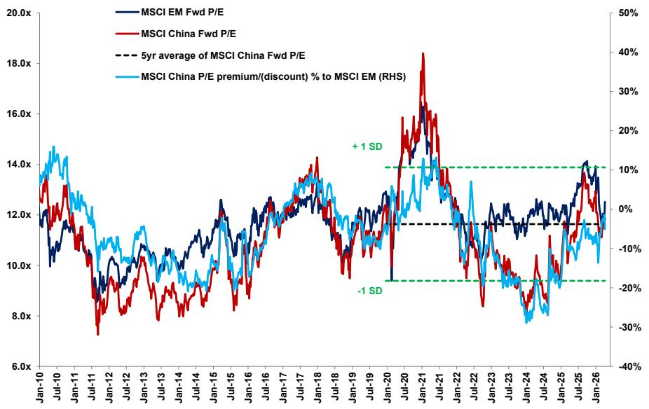

line

| Date   | MSCI EM Fwd P/E | MSCI China Fwd P/E | MSCI China premium/(discount) % to MSCI EM (RHS) |
|--------|-----------------|--------------------|-----------------------------------------------|
| Jan-10 | ~12.0x          | ~13.0x             | ~14.0x                                        |
| Jul-10 | ~11.5x          | ~12.5x             | ~13.5x                                        |
| Jan-11 | ~10.5x          | ~11.5x             | ~12.5x                                        |
| Jul-11 | ~9.5x           | ~8.5x              | ~11.5x                                        |
| Jan-12 | ~9.0x           | ~8.0x              | ~11.0x                                        |
| Jul-12 | ~9.5x           | ~8.5x              | ~11.5x                                        |
| Jan-13 | ~10.0x          | ~9.0x              | ~11.0x                                        |
| Jul-13 | ~10.5x          | ~9.5x              | ~11.5x                                        |
| Jan-14 | ~11.0x          | ~10.0x             | ~12.0x                                        |
| Jul-14 | ~11.5x          | ~10.5x             | ~12.5x                                        |
| Jan-15 | ~12.0x          | ~11.0x             | ~13.0x                                        |
| Jul-15 | ~12.5x          | ~11.5x             | ~13.5x                                        |
| Jan-16 | ~13.0x          | ~12.0x             | ~14.0x                                        |
| Jul-16 | ~13.5x          | ~12.5x             | ~14.5x                                        |
| Jan-17 | ~14.0x          | ~13.0x             | ~15.0x                                        |
| Jul-17 | ~14.5x          | ~13.5x             | ~15.5x                                        |
| Jan-18 | ~15.0x          | ~14.0x             | ~16.0x                                        |
| Jul-18 | ~15.5x          | ~14.5x             | ~16.5x                                        |
| Jan-19 | ~16.0x          | ~15.0x             | ~17.0x                                        |
| Jul-19 | ~16.5x          | ~15.5x             | ~17.5x                                        |
| Jan-20 | ~17.0x          | ~16.0x             | ~18.0x                                        |
| Jul-20 | ~17.5x          | ~16.5x             | ~18.5x                                        |
| Jan-21 | ~18.0x          | ~17.0x             | ~19.0x                                        |
| Jul-21 | ~18.5x          | ~17.5x             | ~19.5x                                        |
| Jan-22 | ~19.0x          | ~18.0x             | ~20.0x                                        |
| Jul-22 | ~19.5x          | ~18.5x             | ~20.5x                                        |
| Jan-23 | ~20.0x          | ~19.0x             | ~21.0x                                        |
| Jul-23 | ~20.5x          | ~19.5x             | ~21.5x                                        |
| Jan-24 | ~21.0x          | ~20.0x             | ~22.0x                                        |
| Jul-24 | ~21.5x          | ~20.5x             | ~22.5x                                        |
| Jan-25 | ~22.0x          | ~21.0x             | ~23.0x                                        |
| Jul-25 | ~22.5x          | ~21.5x             | ~23.5x                                        |
| Jan-26 | ~23.0x          | ~22.0x             | ~24.0x                                        |

Source: Datastream, MSCI, MS. Weekly data as of May 8, 2026.

Exhibit 21: MSCI China trades at 11.9x 12-month forward P/E, still at discounts to other major global equity markets   
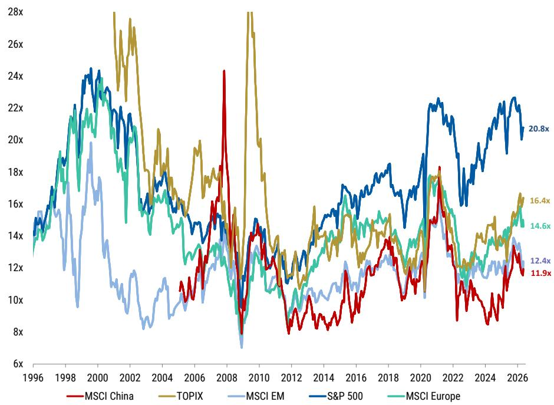

line

| Year | MSCI China | TOPIX | MSCI EM | S&P 500 | MSCI Europe |
|------|------------|-------|---------|---------|-------------|
| 2026 | 11.9x      | 16.4x | 12.4x   | 20.8x   | 14.6x       |

Source: Datastream, RIMES, MS. Data as of May 8, 2026

# Liquidity – tighter for longer in 2026

Fed rate cut schedule pushed out to 1H2027: The Hong Kong market and ADRs are more correlated with external liquidity dynamics, which are closely affected by the Fed policy cycle. MS's US economics team has pushed out their schedule of two rate cuts to 1H 2027, reflecting a shift toward neutrality and a higher bar for rate cuts signaled at the April FOMC.

Southbound net inflow remains positive but at a much smaller scale: Another important source of liquidity for the Hong Kong market is the Southbound channel inflow. YTD, it has been in a steady positive trend, with total net inflow hitting US\$32bn. That said, this is only about \~41% of the total net cumulative inflow during the same time in 2025. Multiple reasons have contributed to this, in our view:

1. Lackluster YTD performance of large-cap platform companies (used to be the largest inflow destination for Southbound investors);   
2. Greater concentration of better-performing sectors/stocks in the A-share market;   
3. Hong Kong's higher sensitivity to global geopolitical uncertainties and fund flow volatility, etc.

Points #2 and #3 will remain status quo on a six- to 12-month basis; #3 in particular would be subject to a more sustainable solution to the Hormuz situation.

A-share market – National Team standing by: The A-share market, it is more directly influenced by the domestic funding situation, which is highly linked to the domestic yield environment and monetary policy direction. The most recent decline of long-term government bond yields onshore (10-year and 30-year) may temporarily slow down

allocation from bonds to equities. However, we continue to believe strongly that the National Team's deep pockets could be leveraged to smooth out unexpected volatility spikes and/or to support thematic ETF investment on hard-core tech & innovation fronts, in addition to large-cap index ETFs. Please also refer to the section Flows and positioning – positive inflow outlook, with greater visibility onshore for more detailed discussion of global investor positioning and implications.

No investment recommendation is made with respect to any of the ETFs or mutual funds referenced herein. Investors should not rely on the information included in making investment decisions with respect to those funds.

# Beijing policies set to stay on cruise control

MS's economics team for China thinks no additional policy easing is in sight: According to the team (China Economics Mid-Year Outlook: Upgrading Growth to reflect AI and Energy Capex Super-cycle), under Beijing's "cushioning, not lifting" policy approach, the upbeat 1Q26 GDP growth (5%) and export resilience through the oil shock have likely reduced the urgency for fresh stimulus. The April Politburo meeting highlighted "targeted and effective" policy support, and urged prompt rollout of "shovel-ready" infrastructure projects, implying continued budget front-loading but a low likelihood of fiscal top-ups or policy rate cuts for the remainder of the year. Thus, the team expects the augmented fiscal deficit to stay flat at 11.7% of GDP this year, as set at the March NPC, with no additional monetary easing in 2H26.

Instead, policymakers will likely lean more on liquidity operations and quasi-fiscal tools (such as PBoC targeted relending and PSL) to support the economy. We also expect Beijing to double down on a tech-led, supply-centric path given the global geopolitical development, which will likely lead to continued capital allocation toward strategic sectors (see more related investment opportunities in the section Key trades for the next 12 months). As a result, we see "policy cycle" as a neutral factor (compared to six months ago) with limited impact on the overall equity market.

Exhibit 22: Augmented fiscal deficit will likely stay flat at 11.7% of GDP this year; no supplementary budget in 2H   
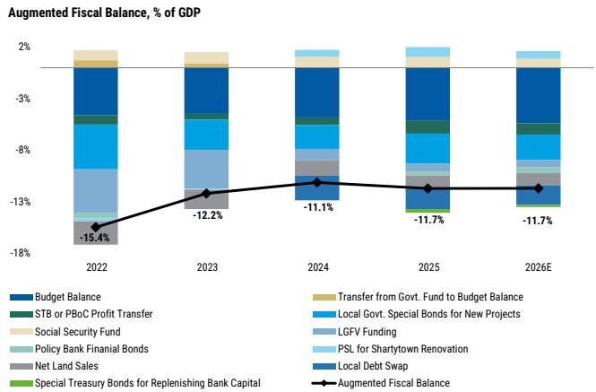

bar_stacked

Augmented Fiscal Balance, % of GDP
| Year | Budget Balance (%) | STB or PBoC Profit Transfer (%) | Social Security Fund (%) | Policy Bank Financial Bonds (%) | Net Land Sales (%) | Special Treasury Bonds for Replenishing Bank Capital (%) | Local Debt Swap (%) | Local Govt. Special Bonds for New Projects (%) | Transfer from Govt. Fund to Budget Balance (%) | LGFV Funding (%) | PSL for Shartytown Renovation (%) | Augmented Fiscal Balance (%) |
|---|---|---|---|---|---|---|---|---|---|---|---|---|
| 2022 | -1.5 | 0.5 | 0.3 | 0.1 | 0.1 | 0.1 | 0.8 | 0.7 | 0.4 | 0.9 | 0.1 | -15.4 |
| 2023 | -1.4 | 0.4 | 0.2 | 0.1 | 0.1 | 0.1 | 0.7 | 0.6 | 0.3 | 0.8 | 0.1 | -12.2 |
| 2024 | -1.3 | 0.3 | 0.1 | 0.1 | 0.1 | 0.1 | 0.6 | 0.5 | 0.2 | 0.7 | 0.1 | -11.1 |
| 2025 | -1.2 | 0.2 | 0.1 | 0.1 | 0.1 | 0.1 | 0.5 | 0.4 | 0.1 | 0.6 | 0.1 | -11.7 |
| 2026E | -1.1 | 0.1 | 0.1 | 0.1 | 0.1 | 0.1 | 0.4 | 0.3 | 0.1 | 0.5 | 0.1 | -11.7 |

Source: CEIC, Wind, MS estimates

Exhibit 23: Export resilience will likely reduce urgency for additional countercyclical easing   
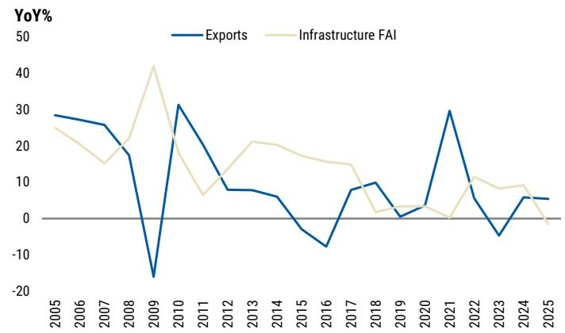

line

| Year | Exports | Infrastructure FAI |
|------|---------|---------------------|
| 2005 | 28      | 25                  |
| 2006 | 27      | 23                  |
| 2007 | 26      | 15                  |
| 2008 | 18      | 20                  |
| 2009 | -18     | 42                  |
| 2010 | 31      | 15                  |
| 2011 | 20      | 7                   |
| 2012 | 8       | 12                  |
| 2013 | 8       | 21                  |
| 2014 | 6       | 20                  |
| 2015 | -5      | 18                  |
| 2016 | -8      | 16                  |
| 2017 | 8       | 15                  |
| 2018 | 10      | 3                   |
| 2019 | 1       | 3                   |
| 2020 | 3       | 1                   |
| 2021 | 30      | 1                   |
| 2022 | 5       | 10                  |
| 2023 | -5      | 8                   |
| 2024 | 6       | 9                   |
| 2025 | 5       | -2                  |

Source: CEIC, MS estimates.

# USDCNY trajectory: modest appreciation ahead

MS's forecast of USDCNY by 2Q2027 has been revised to \~6.80, with interim exchange rate strengthening to as much as 6.75 by year-end 2026 (from 7.00; currently \~6.83), reflecting growth outperformance and later, a softer USD as oil-driven risk aversion fades. We expect appreciation through end of 2026, followed by a largely range-bound pattern through 2027.

That said, while the large trade surplus suggests scope for RMB strength, we do not see it as the sole anchor for RMB dynamics. The PBoC is likely to remain mindful of still-soft domestic price dynamics, and is unlikely to rely on currency strength as a primary tool to address growth imbalances.

Historically, MSCI China has tended to show quite a clear negative correlation between its performance and currency weakness (Exhibit 24). Therefore, MS's latest USDCNY forecast suggests some marginal support for the equity market through the positive translational impact on earnings, particularly for the offshore equity indices (MSCI China, Hang Seng, HSCEI). This is also part of why we are raising our full-year 2026 earnings growth forecast modestly.

Exhibit 24: MSCI China vs. USDCNY – MS USDCNY forecast points to 6.78 by end-2Q26 and 6.75 by 2026 year-end   
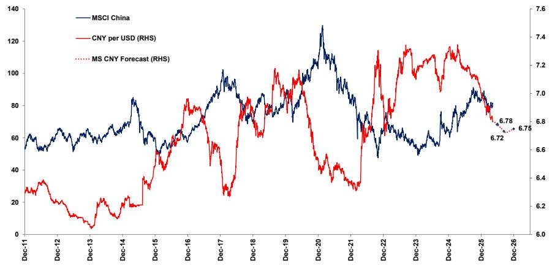

line

| Date   | MSCI China | CNY per USD (RHS) | MS CNY Forecast (RHS) |
|--------|------------|-------------------|----------------------|
| Dec-26 | 6.78       | 6.75              | 6.72                 |

Source: CEIC, MS. Data as of May 8, 2026. MS China Economics team expects USDCNY to reach 6.78, 6.72 and 6.75 by end-2Q26, end-3Q26 and end-2026.

# US-China relationship amid new global geopolitical developments

In our view, the Trump-Xi Summit – set for May 14-15 – will be an event laden with near-term catalysts. Investors are somewhat concerned about tail risk, given the higher frequency of bilateral conflicts lately, including:

- Recent exercises and deployments by the US and Philippines;   
- The progress of the MATCH Act in the US Congress, which aims to tighten semiconductor equipment controls on China; and   
- The latest Section 301 investigations into alleged excess capacity.

We expect an extension of the current US-China truce with symbolic deliverables:

Minor index-level upside is likely, but unlikely to lead to a major market risk premium re-rating. We expect the upside in the format of a minor "relief rally" instead of a "fundamental re-rating catalyst." This is because what can realistically be achieved on some of the likely key topics of the summit by nature comes under the category of a "managed-stability communiqué" rather than what might be termed a "Grand Bargain." These topics include: 1) Middle East conflict; 2) tariff/trade investigation; 3) tech controls and restrictions; and 4) Taiwan.

A moderate set of trade relaxations in certain industries is possible, along with resumption of talks on some other subjects with wider common ground (e.g., fentanyl, climate, aviation, etc.). We see upside for selected TMT, Materials and Transportation stocks, while Utilities, Chemicals and Batteries may see a very short-term boost depending on the relaxation scope disclosed.

The ongoing Hormuz/energy crisis has strategically enhanced China's positioning: The Hormuz situation, in our view, has, on balance, meaningfully improved China's global geopolitical and economic leverage across several dimensions. China's energy consumption mix is comparatively less reliant on oil and gas, with coal retaining a dominant share of its energy structure, rendering China more resilient amid direct oil price shocks than regional peers such as Japan, South Korea, and India. Furthermore, China had already built sUBStantial strategic petroleum reserves ahead of the crisis, providing a meaningful buffer against near-term supply disruptions. Meanwhile, China's commitment to green/alternative energy transition has also prepared China well for future potential disruptions.

We have argued that China's share of global exports could rise from 15% currently to 16.5% by 2030 despite rising global trade protectionism, underpinned by its ability to anticipate shifts in global demand and mobilize resources ahead of the curve – most visibly in EVs, batteries, solar, and increasingly AI-adjacent hardware.

The Middle East conflict strengthens this conviction by refocusing attention on China's resilient energy structure, which should:

1. Insulate its supply chain from oil shocks more effectively than global peers, translating into superior cost and operational resilience; and   
2. Enable faster AI build-out and diffusion, as stable, low-cost green power remains a critical input for data centers and intelligent manufacturing.   
3. Moreover, sustained oil shocks may heighten global urgency around energy transition, further benefiting China's green-tech sectors, where the country already holds dominant global market share.

We have screened for high-quality stocks best positioned to gain more global footprint as a result of this. For more details please refer to Section Key trades for the next 12 months.

At the geopolitical level, we note that China is Iran's largest oil buyer and a sUBStantial economic partner. A recent example of cooperation was the visit by Iran's foreign minister visit to Beijing on May 6, just ahead of the US-China presidential summit. We think this suggests that Beijing could play a more active role as a mediator for global energy stability.

# China's A-share market: continue to prefer A over offshore

The A-share market has been largely outperforming MSCI China YTD: The A-share market (proxied by CSI 300) has posted 8% absolute USD return YTD, outperforming both MSCI China and Hang Seng – by 11ppts and 6ppts, respectively.

\- We officially switched to overweight A-shares over offshore indices as of March 1 against the backdrop of the abrupt breakout of crisis in the Middle East. The CSI 300 has outperformed MSCI China by 6ppts since then (and about 20% in the past 12 months).

We continue to expect such outperformance in the next 6-12 months, because:

We still prefer A-shares on a full-year 2026 basis: We believe that the Hong Kong market could enjoy a bigger rebound opportunity versus the A-share market if a faster, sustainable, and complete reopening of the Strait of Hormuz takes place in the near term. However, we still prefer A-shares on a full-year 2026 basis for the following reasons:

\- Higher concentration of high-end upstream manufacturing and hard-core tech companies, which we continue to like as a multi-year investment theme. Our recommended A-share Thematic Focus List (Exhibit 46) reflects this view;

Exhibit 25: Snapshot of high-end upstream manufacturing and hard-core tech companies - Much bigger representation in the A-share market than in MSCI China   
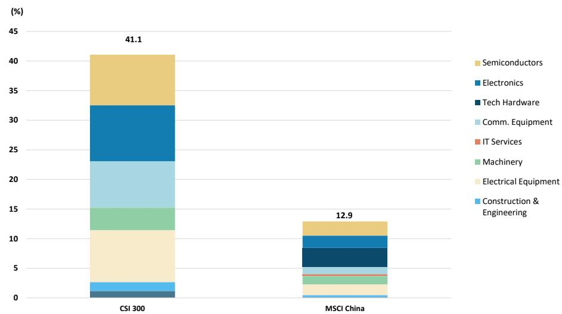

bar_stacked

| Category | CSI 300 (%) | MSCI China (%) |
| :--- | :--- | :--- |
| Semiconductors | 18.2 | 4.5 |
| Electronics | 16.7 | 3.9 |
| Tech Hardware | 1.2 | 6.5 |
| Comm. Equipment | 14.5 | 2.1 |
| IT Services | 0.1 | 2.8 |
| Machinery | 0.3 | 1.9 |
| Electrical Equipment | 12.1 | 1.5 |
| Construction & Engineering | 1.5 | 0.8 |

Source: Factset, MS. Data as of May 8, 2026.

- Highly anticipated potential A-share IPOs – such as YMTC, and CXMT, and Unitree Technology – are likely to generate greater participation by domestic institutional and retail investors. We see clear policy support by Chinese regulators to direct more high-tech companies to A-share market IPOs, and for the broader domestic investors to be able to participate in their growth journey;.   
- The National Team is standing by. We reiterate that the National Team sold approximately US\$80bn worth of positions back in Jan-Feb 2026. These funds could be directed to smooth short-term market volatility, as well as invest in

longer-term, more strategic and thematic ETFs

Exhibit 26: China – domestic passive fund flows – National Team sold \~US\$80bn in CSI 300 ETFs in January 2026 and US\$8bn in April   
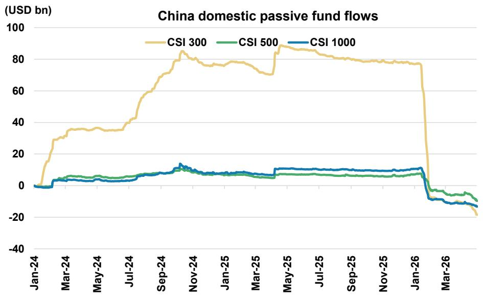

line

| Date   | CSI 300 | CSI 500 | CSI 1000 |
|--------|---------|---------|----------|
| Jan-24 | 0       | 0       | 0        |
| Mar-24 | 30      | 5       | 2        |
| May-24 | 35      | 6       | 3        |
| Jul-24 | 40      | 7       | 4        |
| Sep-24 | 60      | 8       | 5        |
| Nov-24 | 85      | 10      | 12       |
| Jan-25 | 75      | 8       | 8        |
| Mar-25 | 70      | 7       | 7        |
| May-25 | 85      | 8       | 10       |
| Jul-25 | 80      | 7       | 10       |
| Sep-25 | 78      | 7       | 10       |
| Nov-25 | 78      | 7       | 10       |
| Jan-26 | 78      | 7       | 10       |
| Mar-26 | -20     | -10     | -15      |

Source: EPFR, MS. Data as of May 7, 2026.

Exhibit 27: Valuation of CSI300 absolute and relative to MSCI China   
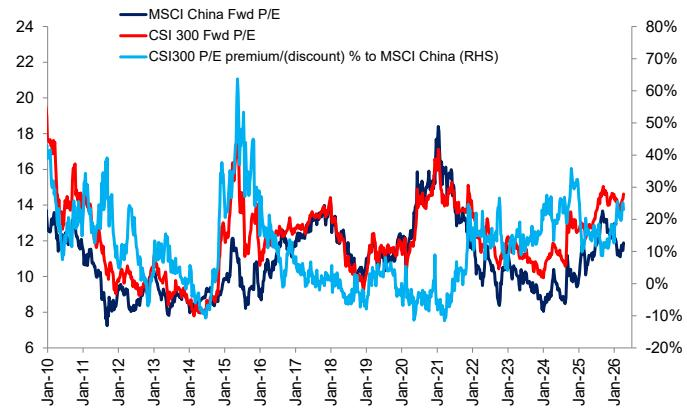

line

| Date   | MSCI China Fwd P/E | CSI 300 Fwd P/E | CSI300 P/E premium/(discount) % to MSCI China (RHS) |
|--------|--------------------|-----------------|----------------------------------------------------|
| Jan-10 | ~13                | ~17             | ~15                                                |
| Jan-11 | ~12                | ~15             | ~14                                                |
| Jan-12 | ~8                 | ~10             | ~12                                                |
| Jan-13 | ~9                 | ~11             | ~13                                                |
| Jan-14 | ~8                 | ~9              | ~10                                                |
| Jan-15 | ~10                | ~12             | ~16                                                |
| Jan-16 | ~12                | ~14             | ~21                                                |
| Jan-17 | ~13                | ~15             | ~18                                                |
| Jan-18 | ~12                | ~14             | ~16                                                |
| Jan-19 | ~11                | ~13             | ~14                                                |
| Jan-20 | ~12                | ~14             | ~15                                                |
| Jan-21 | ~18                | ~16             | ~17                                                |
| Jan-22 | ~14                | ~15             | ~14                                                |
| Jan-23 | ~10                | ~12             | ~12                                                |
| Jan-24 | ~8                 | ~10             | ~10                                                |
| Jan-25 | ~10                | ~12             | ~14                                                |
| Jan-26 | ~12                | ~14             | ~15                                                |

Source: Datastream, MS. Data as of May 8, 2026.

Exhibit 28: Hang Seng A-H Premium index   
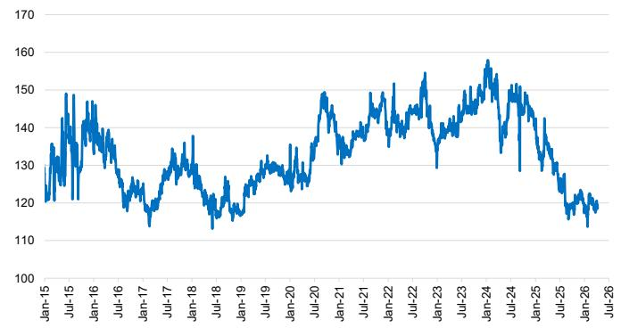

line

| Date   | Value |
|--------|-------|
| Jan-15 | 120   |
| Jul-15 | 145   |
| Jan-16 | 148   |
| Jul-16 | 135   |
| Jan-17 | 125   |
| Jul-17 | 138   |
| Jan-18 | 128   |
| Jul-18 | 120   |
| Jan-19 | 125   |
| Jul-19 | 130   |
| Jan-20 | 135   |
| Jul-20 | 148   |
| Jan-21 | 138   |
| Jul-21 | 145   |
| Jan-22 | 150   |
| Jul-22 | 140   |
| Jan-23 | 155   |
| Jul-23 | 145   |
| Jan-24 | 160   |
| Jul-24 | 150   |
| Jan-25 | 140   |
| Jul-25 | 130   |
| Jan-26 | 120   |
| Jul-26 | 115   |

Source: Factset, MS. Data as of May 7, 2026.

# What could change our view?

- A major improvement in the US/China relationship following the May 14-15 Summit;   
- Relative valuation premium vs. offshore becoming extreme: The CSI 300 now trades at a 23.8% premium vs. MSCI China on a 12-month forward P/E basis. Historically a premium above 30% or more could be alerting a near-term performance reversal;   
- A sustained macro reflation in China: Large-cap platform companies represent a significant percentage of the offshore indices and their performance is still meaningfully tied to private consumption momentum.

We recommend MS's A-share Thematic stock list (Exhibit 46).

# Flows and positioning – positive inflow outlook, with greater visibility onshore

We look at flows and positioning for offshore and A-share markets and expect stable inflow for both in our base case, though onshore A-share flows carry higher visibility and greater certainty: The flow dynamics for the onshore A-share market and offshore (Hong Kong, ADRs) should be looked at separately as they can be subject to different drivers and dynamics. We see steady inflow for both for the following reasons:

# Offshore Chinese markets: ongoing inflow trend supported by stronger currency and low existing positioning; rate cut delay could curb the size

A modest RMB appreciation should provide a marginal tailwind for offshore Chinese equities: As mentioned in the framework discussion, MS has revised its USD/CNY forecast to \~6.80 by 2Q 2027, with the RMB expected to strengthen to as much as \~6.75 by end-2026 While the magnitude of appreciation is modest, it could provide a marginal tailwind for China's offshore equity markets, helping to improve foreign investor appetite and support incremental inflows.

That said, a potential delay in Fed rate cuts poses a risk to the weaker-dollar thesis: A more hawkish-for-longer Fed could slow USD depreciation, limit RMB upside, and weigh on the pace of foreign capital returning to emerging markets including China.

Foreign mutual fund inflows strengthened further in 2026 after turning positive in 2025, though still largely driven by passive funds: US- and EU-domiciled China-focused mutual funds recorded US\$14bn of net inflows in 2025, reversing US\$26bn of cumulative outflows in 2023-24. Momentum has accelerated in 2026, with US\$11bn of inflows in 4M26, already reaching \~80% of the full-year 2025 level (Exhibit 29). While inflows remain predominantly passive-led, active funds briefly turned to net inflows in January-February 2026, before reverting to outflows from March. We believe the renewed and strengthening foreign inflows reflect rising investor interest and confidence in China's innovation capabilities, particularly in AI, technology, high-end manufacturing, and biotech. With sentiment and policy support continuing to improve, we see further upside potential for foreign inflows. (Exhibit 30 Exhibit 31).

Global, emerging markets, and AxJ funds remain underweight China amid stronger performance in other emerging markets: Our fund positioning data show that global funds are 1.3ppt underweight China, while EM and AxJ funds are 5.7ppt and 1.8ppt underweight, respectively. The deepened underweight reflects investors' preference for other emerging markets, such as Korea and Taiwan, supported by stronger equity performance and fewer macro headwinds.

Looking ahead, we believe China's continued progress in innovation, and any upside scenario of an earlier exit from deflation, could help improve investor confidence and support a gradual increase in active allocations to China among foreign investors (Exhibit 32).

Exhibit 29: Fund flows in China/HK equities by US and EU domiciled active funds (2020-2026 YTD) - Foreign mutual fund flows strengthened further in 2026, YTD inflows reaching 80% of full year 2025 level   
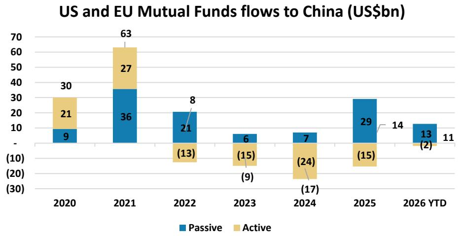

bar_stacked

US and EU Mutual Funds flows to China (US$bn)
| Year | Passive (US$bn) | Active (US$bn) | Total (US$bn) |
| :--- | :--- | :--- | :--- |
| 2020 | 9 | 21 | 30 |
| 2021 | 36 | 27 | 63 |
| 2022 | 21 | -13 | 8 |
| 2023 | 6 | -15 | -9 |
| 2024 | 7 | -24 | -17 |
| 2025 | 29 | -15 | 14 |
| 2026 YTD | 13 | -2 | 11 |

Source: EPFR, MS; data as of April 30, 2026.

Exhibit 30: Daily cumulative fund flows in China/HK equities by both US- and EU-domiciled active funds – net outflow yet to stop   
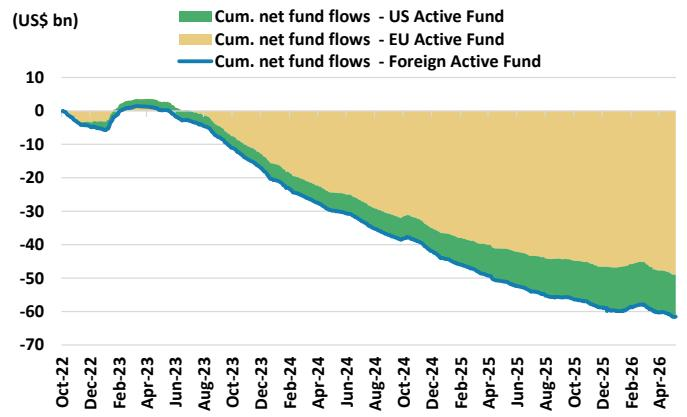

area

| Date    | Cum. net fund flows - US Active Fund | Cum. net fund flows - EU Active Fund | Cum. net fund flows - Foreign Active Fund |
|---------|--------------------------------------|--------------------------------------|-------------------------------------------|
| Oct-22  | 0                                    | 0                                    | 0                                         |
| Dec-22  | -5                                   | -5                                   | -5                                        |
| Feb-23  | 0                                    | 0                                    | 0                                         |
| Apr-23  | 0                                    | 0                                    | 0                                         |
| Jun-23  | -5                                   | -5                                   | -5                                        |
| Aug-23  | -10                                  | -10                                  | -10                                       |
| Oct-23  | -15                                  | -15                                  | -15                                       |
| Dec-23  | -20                                  | -20                                  | -20                                       |
| Feb-24  | -25                                  | -25                                  | -25                                       |
| Apr-24  | -30                                  | -30                                  | -30                                       |
| Jun-24  | -35                                  | -35                                  | -35                                       |
| Aug-24  | -40                                  | -40                                  | -40                                       |
| Oct-24  | -45                                  | -45                                  | -45                                       |
| Dec-24  | -50                                  | -50                                  | -50                                       |
| Feb-25  | -55                                  | -55                                  | -55                                       |
| Apr-25  | -60                                  | -60                                  | -60                                       |
| Jun-25  | -65                                  | -65                                  | -65                                       |
| Aug-25  | -70                                  | -70                                  | -70                                       |
| Oct-25  | -75                                  | -75                                  | -75                                       |
| Dec-25  | -80                                  | -80                                  | -80                                       |
| Feb-26  | -85                                  | -85                                  | -85                                       |
| Apr-26  | -90                                  | -90                                  | -90                                       |

Source: EPFR, MS; data as of May 7, 2026.

Exhibit 31: Daily cumulative fund flows in China/HK equities by both US- and EU-domiciled passive funds – inflow further accelerated in 2026   
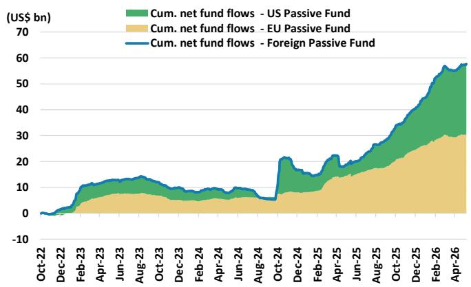

area

| Date | Cum. net fund flows - US Passive Fund (US$ bn) | Cum. net fund flows - EU Passive Fund (US$ bn) | Cum. net fund flows - Foreign Passive Fund (US$ bn) |
|---|---|---|---|
| Oct-22 | 0 | 0 | 0 |
| Dec-22 | 1 | 0 | 1 |
| Feb-23 | 5 | 3 | 4 |
| Apr-23 | 8 | 5 | 7 |
| Jun-23 | 10 | 6 | 9 |
| Aug-23 | 12 | 7 | 10 |
| Oct-23 | 8 | 5 | 8 |
| Dec-23 | 7 | 5 | 7 |
| Feb-24 | 8 | 6 | 8 |
| Apr-24 | 9 | 7 | 9 |
| Jun-24 | 8 | 6 | 8 |
| Aug-24 | 5 | 4 | 5 |
| Oct-24 | 15 | 8 | 10 |
| Dec-24 | 10 | 6 | 8 |
| Feb-25 | 15 | 10 | 12 |
| Apr-25 | 20 | 13 | 15 |
| Jun-25 | 25 | 16 | 18 |
| Aug-25 | 30 | 19 | 22 |
| Oct-25 | 35 | 22 | 26 |
| Dec-25 | 40 | 25 | 30 |
| Feb-26 | 45 | 28 | 35 |
| Apr-26 | 50 | 30 | 40 |
The chart displays a stacked area chart representing cumulative net fund flows for three funds: US Passive Fund, EU Passive Fund, and Foreign Passive Fund. The x-axis represents time from Oct-22 to Apr-26, and the y-axis represents cumulative net fund flows in US$ billions. The data is presented in a single column with each month labeled on the left. The total cumulative net fund flows are shown as a separate stacked area at the bottom of each stack. The chart is saved as a PNG file named "cum.net fund flows" and is displayed on the right side.

Source: EPFR, MS; data as of May 7, 2026.

# Exhibit 32:

Active weights of China/HK equities by regional fund category and manager domicile – long-only funds still heavily underweight on China

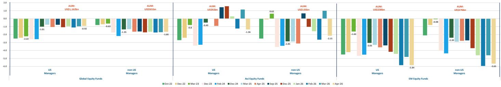  
Source: Morningstar, FactSet, EPFR, MS; Note: Data as of April 30, 2026, most funds have disclosed data up to March 31. Fund universe of each category is formed by the largest 30 active mutual funds under Morningstar regional category. Funds under “non-US Managers” are mostly domiciled in Europe. We exclude ESG funds, Income funds, and Systematic funds. All the covered funds are benchmarking to either MSCI or FTSE standard regional indices of All Country World, Asia ex Japan, or Emerging Markets. The EPFR data and charts displayed here must not be extracted and republished (whether internally or externally). Such use will violate the terms of MS’s contract with EPFR which only covers named users.

# Southbound inflows still positive, but cooling from 2025's record pace

Southbound inflows remain positive in 2026, but momentum has cooled notably from 2025's record highs: YTD net inflows reached \~US\$32bn, with average daily flow running at roughly 57% of 2025 levels (Exhibit 33, Exhibit 34). The slowdown reflects several factors:

1. Lackluster YTD performance of large-cap platform companies – historically the largest destination for Southbound capital;   
2. Better-performing sectors and stocks being more concentrated in the A-share market; and   
3. Hong Kong's greater sensitivity to global geopolitical uncertainty and fund flow volatility.

A more favourable A-share sector mix is likely to continue diluting Southbound flow into Hong Kong. A meaningful re-acceleration would likely require:

1. Moderation of the e-commerce price war, potentially driven by government tightening on competitive practices; and   
2. Platform companies demonstrating stronger AI model development and innovation capability – particularly as competitive pressure from ByteDance and others persists.

Exhibit 33: Annual Southbound net inflows – 2026 YTD inflow reached US\$32bn, average daily flow around 57% of 2025's level   
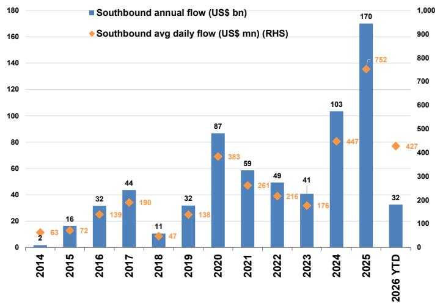

bar_line

| Year | Southbound annual flow (US$ bn) | Southbound avg daily flow (US$ mn) (RHS) |
| :--- | :--- | :--- |
| 2014 | 2 | 63 |
| 2015 | 16 | 72 |
| 2016 | 32 | 139 |
| 2017 | 44 | 190 |
| 2018 | 11 | 47 |
| 2019 | 32 | 138 |
| 2020 | 87 | 383 |
| 2021 | 59 | 261 |
| 2022 | 49 | 216 |
| 2023 | 41 | 176 |
| 2024 | 103 | 447 |
| 2025 | 170 | 752 |
| 2026 YTD | 32 | 427 |

Source: CEIC, MS. Data as of May 8, 2026.

Exhibit 34: Southbound net inflows by sector – Media&Entertainment, IT, Consumer Discretionary are the top three sectors   
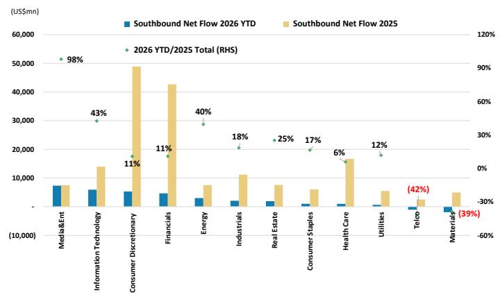

bar_line

| Sector | 2026 YTD (US$mn) | 2025 YTD (US$mn) | 2026 YTD/2025 Total (RHS) (%) |
| :--- | :--- | :--- | :--- |
| Media&Ent | 8000 | 8000 | 98 |
| Information Technology | 7000 | 13000 | 43 |
| Consumer Discretionary | 6500 | 49000 | 11 |
| Financials | 6000 | 43000 | 11 |
| Energy | 4500 | 8000 | 40 |
| Industrials | 3500 | 11000 | 18 |
| Real Estate | 3500 | 8500 | 25 |
| Consumer Staples | 2500 | 7000 | 17 |
| Health Care | 2500 | 16500 | 6 |
| Utilities | 2500 | 6500 | 12 |
| Telco | 2500 | 4500 | (42) |
| Materials | -3500 | 6500 | (39) |

Source: Wind, CEIC, MS. Data as of April 29, 2026.

# Onshore A-share market: deposit migration, recovering retail participation, and growing private fund AUM all point to sustained liquidity tailwinds

Deposit maturity cycle supports gradual fund migration into equities: Our banking team estimates that \~Rmb81tn in retail term deposits will mature in 2026, up from Rmb71tn in 2025 – though the share of higher-yield deposits (those locked in before

2H23) shrinks to \~Rmb16tn from Rmb28tn (Exhibit 35, Exhibit 36). Deposit growth is expected to slow modestly to 7-8% in 2026 (from 9.7% in 2025), as insurance products offer competitive long-term returns and appetite for equity products recovers. Every 1ppt slowdown in deposit growth equates to \~Rmb1.6-1.7tn of potential flows into other investment products – sufficient to drive mid-teens growth in insurance, mutual funds, or private funds, while still supporting reasonable bank balance sheet expansion.

Declining term deposit rates, the A-share market's decent performance, and lower equity volatility – smoothed by National Team activity – should continue to encourage deposit migration into equities. This is already evident in private fund AUM growth since 2025, which has carried through steadily into 2026 (Exhibit 37).

That said, retail participation has picked up but remains moderate relative to prior cycles: New brokerage account openings and small-ticket trading orders both remain well below the October 2024 surge or previous cycle peaks (Exhibit 38, Exhibit 39). Further acceleration in retail momentum would likely require clearer signs of macro stabilization.

Exhibit 35: Household term deposit maturity - \~Rmb81trn of retail term deposits could mature in 2026   
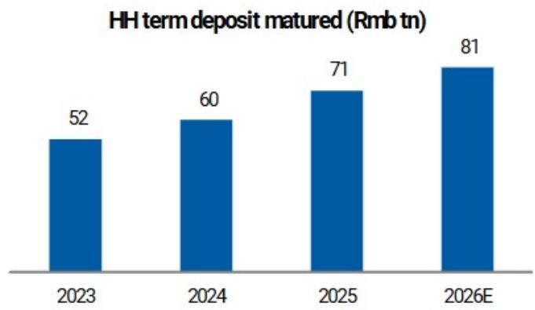

bar

HH term deposit matured (Rmb tn)
| Year | Value (Rmb tn) |
| :--- | :--- |
| 2023 | 52 |
| 2024 | 60 |
| 2025 | 71 |
| 2026E | 81 |

Source: Company data, PBOC, MS (E) estimates.

Exhibit 36: Rmb81tn of retail term deposits could mature in 2026, Rmb16tn of which could bear higher rates   
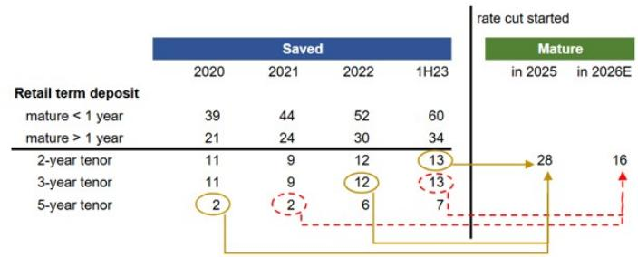

other

| Retail term deposit | 2020 | 2021 | 2022 | 1H23 |
|---|---|---|---|---|
| mature < 1 year | 39 | 44 | 52 | 60 |
| mature > 1 year | 21 | 24 | 30 | 34 |
| 2-year tenor | 11 | 9 | 12 | 13 |
| 3-year tenor | 11 | 9 | 12 | 13 |
| 5-year tenor | 2 | 2 | 6 | 7 |
rate cut started in 2025: mature in 2025 → rate cut in 2026E: mature in 2026E

Source: Company data, PBOC, MS estimates.

Exhibit 37: Onshore private equity funds AUM - Steady growth since 2025   
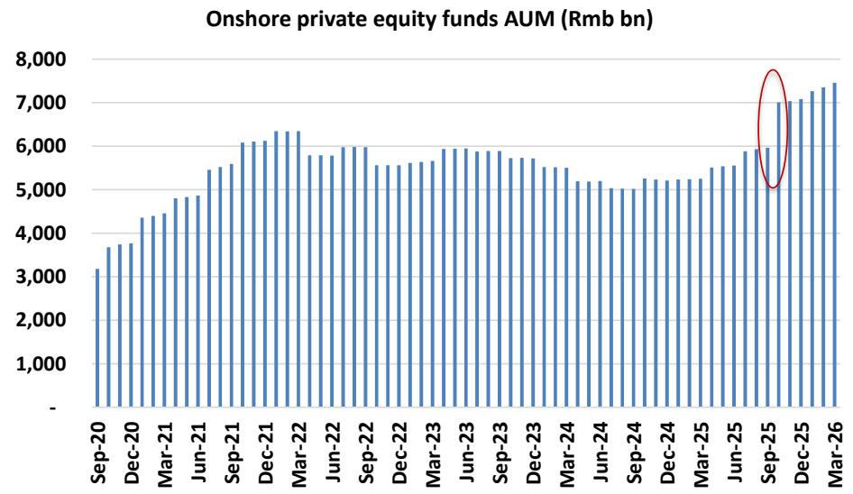

bar

Onshore private equity funds AUM (Rmb bn)
| Date | AUM (Rmb bn) |
|---|---|
| Sep-20 | 3150 |
| Dec-20 | 3700 |
| Mar-21 | 4350 |
| Jun-21 | 4850 |
| Sep-21 | 5500 |
| Dec-21 | 6100 |
| Mar-22 | 6350 |
| Jun-22 | 5800 |
| Sep-22 | 6000 |
| Dec-22 | 5600 |
| Mar-23 | 5700 |
| Jun-23 | 5950 |
| Sep-23 | 5850 |
| Dec-23 | 5750 |
| Mar-24 | 5500 |
| Jun-24 | 5200 |
| Sep-24 | 5050 |
| Dec-24 | 5250 |
| Mar-25 | 5350 |
| Jun-25 | 5600 |
| Sep-25 | 6000 |
| Dec-25 | 7000 |
| Mar-26 | 7400 |

Source: Wind, MS. Data as of April 2026.

Exhibit 38: SSE registered new accounts – current cycle momentum has picked up but is not yet comparable with previous peaks   
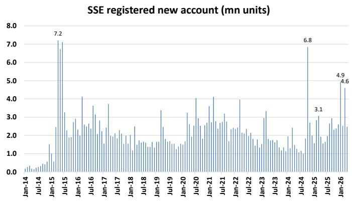

bar

| Date    | Value |
|---------|-------|
| Jan-15  | 7.2   |
| Jul-24  | 6.8   |
| Jan-25  | 3.1   |
| Jul-25  | 4.9   |
| Jan-26  | 4.6   |

Source: CEIC, MS. Data as of Apr 2026.

Exhibit 39: Daily average of A-share small orders net inflow – volume more measured compared to the October 2024 rally period   
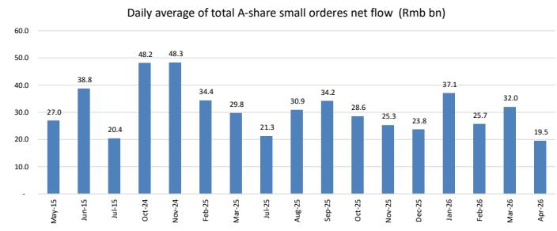

bar

Daily average of total A-share small orders net flow (Rmb bn)
| Month | Daily average of total A-share small orders net flow (Rmb bn) |
| :--- | :--- |
| May-15 | 27.0 |
| Jun-15 | 38.8 |
| Jul-15 | 20.4 |
| Oct-24 | 48.2 |
| Nov-24 | 48.3 |
| Feb-25 | 34.4 |
| Mar-25 | 29.8 |
| Jul-25 | 21.3 |
| Aug-25 | 30.9 |
| Sep-25 | 34.2 |
| Oct-25 | 28.6 |
| Nov-25 | 25.3 |
| Dec-25 | 23.8 |
| Jan-26 | 37.1 |
| Feb-26 | 25.7 |
| Mar-26 | 32.0 |
| Apr-26 | 19.5 |

Source: Wind, MS. Data as of Apr 2026.

# Sector allocation: focus more on thematic stock-picking; less on indices

We strongly prefer upstream asset-focused sectors that are less prone to disruption by the AI supercycle – compounded by rising likelihood of taking more global market share against the backdrop of energy sufficiency and efficiency being reprioritized.

\- Those sectors include selected Materials, Industrials, and Energy.

We also like the tech localization theme: This would continue to benefit semis, particularly within IT.

Meanwhile, we maintain moderate exposure to Financials (Insurance and Exchanges), as well as yield plays – to continue to receive stable cash payments that help smooth any potential market volatility.

We stay underweight on sectors dragged down by gloomy macro conditions – i.e. Real Estate and Consumer Staples.

Exhibit 40: China – sector/industry group allocation: we continue to favor a barbell approach between structural tech/growth opportunities and quality dividend plays   
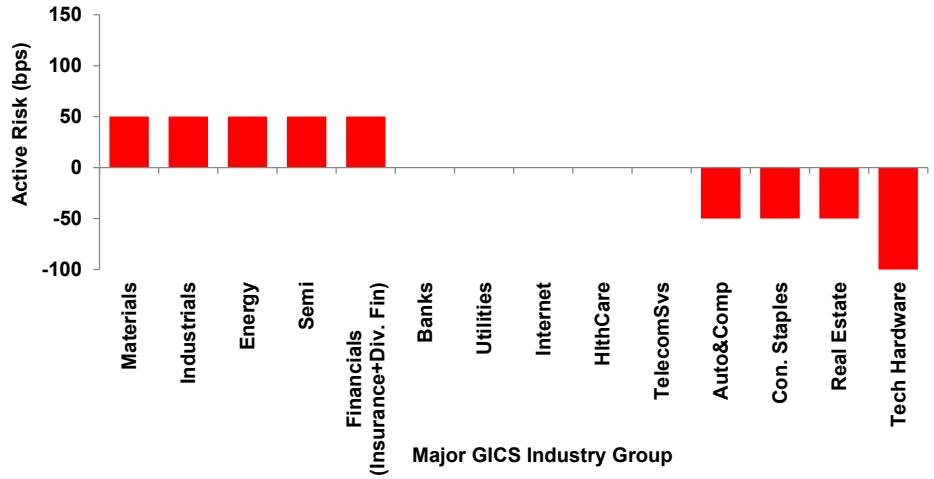

bar

| Major GICS Industry Group | Active Risk (bps) |
| :--- | :--- |
| Materials | 50 |
| Industrials | 50 |
| Energy | 50 |
| Semi | 50 |
| Financials (Insurance+Div. Fin) | 50 |
| Banks | 0 |
| Utilities | 0 |
| Internet | 0 |
| HlthCare | 0 |
| TelecomSvs | 0 |
| Auto&Comp | -50 |
| Con. Staples | -50 |
| Real Estate | -50 |
| Tech Hardware | -100 |

Source: MS

# Key trades for the next 12 months

- Overweight A-shares vs. offshore;   
- MS China/Hong Kong Focus List and A-share Thematic Focus List: For details, please view MS China/HK Focus List & A-Share Thematic List);   
- China Best Business Model:

We launched China Best Business Model V2 in March 2026: It is a concentrated portfolio of 26 high-quality companies spanning 16 industry groups, with a clear tilt toward structural/thematic growth sectors such as Information Technology (19% weight), Industrials (19%), and Materials (12%). See China Equity Strategy: Launching China Best Business Models Version 2 (30 Mar 2026).

The stocks also align with global investment themes as well as China's strategic growth plan. The purpose of this list is to provide a long-term, fundamental driven, all-weather portfolio that could transcend short-term market cycles and provide long-term alpha. These stocks offer ROE 1.5x higher than the benchmark with a back-tested three-year Sharpe Ratio of 1.2. Stock list can be found in Exhibit 43.

The performance data provided is a hypothetical illustration of mathematical principles, it does not predict or project the performance of an investment or investment strategy. Past performance is no guarantee of future results.

Exhibit 41: China Best Business Models Version 2 – Key Statistics   
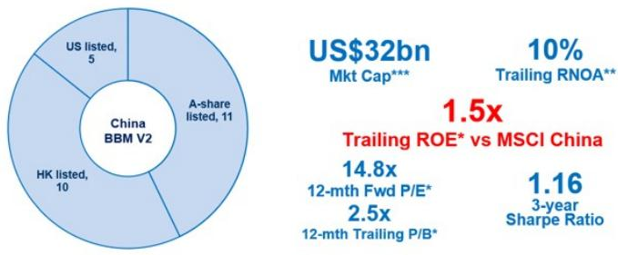

pie

China BBM V2
| Category | Value |
| :--- | :--- |
| US listed | 5 |
| A-share listed | 11 |
| HK listed | 10 |

| Metric | Description |
| :--- | Value |
| :--- | :--- |
| US$32bn Mkt Cap*** | 10% Trailing RNOA**
1.5x Trailing ROE* vs MSCI China
14.8x 12-mth Fwd P/E*
2.5x 12-mth Trailing P/B*
1.16 3-year Sharpe Ratio

Source: IBES, FactSet, MS. Data as of May 8, 2026.   
\*\*\*: Median of the 26 companies included in China BBM V2   
\*\*: Average of the 24 non-financial companies included in China BBM V2.   
\*: Computed based on an equally weighted portfolio of China BBM V2 stocks.

Exhibit 42: China Best Business Models Version 2 – superior Sharpe ratio based on back-testing   
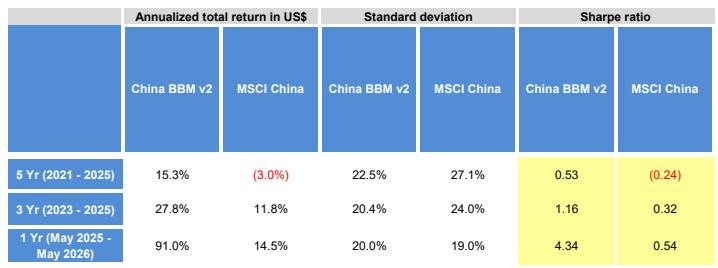

other

| Period | China BBM v2 | MSCI China | China BBM v2 | MSCI China | China BBM v2 | MSCI China |
|---|---|---|---|---|---|---|
| 5 Yr (2021 - 2025) | 15.3% | (3.0%) | 22.5% | 27.1% | 0.53 | (0.24) |
| 3 Yr (2023 - 2025) | 27.8% | 11.8% | 20.4% | 24.0% | 1.16 | 0.32 |
| 1 Yr (May 2025 - May 2026) | 91.0% | 14.5% | 20.0% | 19.0% | 4.34 | 0.54 |

Source: MSCI, FactSet, MS. Data as of May 8, 2026; Past performance is no guarantee of future results. US 10-year Treasury yield is used as a proxy for risk free rate.

# - China's Global Export Champions:

The escalation of Middle East geopolitical tensions has reinforced China's strategic positioning in global manufacturing, underpinned by its energy security and supply-chain resilience. We identify 25 stocks under MS coverage that stand to benefit from China's rising export share in upstream and high-end manufacturing supply chain, and the ongoing global capex up-cycle Exhibit 44).

# - Event-driven tactical trade of Stock Connect Southbound inclusion/deletion.

Following the launch of MSSBT V1 (MS Southbound Eligibility Trading Strategy), which achieved a $95\%$ hit ratio, we introduced MSSBT V2 in February 2026 to further enhance the model's alpha-generation capability by capturing both sides of

Southbound eligibility review and implementation events – deletions as well as inclusions. We recommend a short-term tactical trading strategy strictly based on our model, constructing an equal-weighted portfolio of forecast Stock Connect inclusion and deletion stocks. We publish our bi-annual forecast lists twice a year, in August and in February.

For details please see:

- China Equity Strategy: Enhancing MSSBT – Capturing Full Alpha From Southbound Eligibility (3 Feb 2026);   
- China Equity Strategy: Southbound Inclusion – A Back-Tested Trading Strategy (19 Aug 2025)

Exhibit 43: China Best Business Models V2 

<table><tr><td rowspan="2">Company Name</td><td rowspan="2">Ticker</td><td rowspan="2">MS Rating</td><td rowspan="2">GICS Industry Group</td><td rowspan="2">Mkt Cap (US$bn)</td><td rowspan="2">Last Price (Local CCY)</td><td rowspan="2">Target Price</td><td rowspan="2">Upside to Target Price</td><td rowspan="2">CCY</td><td colspan="2">MS P/E (CY)</td><td colspan="2">MS P/B (CY)</td><td colspan="2">MS DY (CY)</td><td colspan="2">ROE (CY)</td><td rowspan="2">MS Analyst</td></tr><tr><td>2026E</td><td>2027E</td><td>2026E</td><td>2027E</td><td>2026E</td><td>2027E</td><td>2026E</td><td>2027E</td></tr><tr><td>Tencent Holdings Ltd.</td><td>0700.HK</td><td>OW</td><td>Media &amp; Entertainment</td><td>558.8</td><td>471.4</td><td>650</td><td>37.9%</td><td>HKD</td><td>18.7x</td><td>16.3x</td><td>3.1x</td><td>2.7x</td><td>1.0%</td><td>1.1%</td><td>20.3%</td><td>19.6%</td><td>Yu, Gary</td></tr><tr><td>Alibaba Group Holding</td><td>BABA.N</td><td>OW</td><td>Consumer Discretionary Distribution &amp; Retail</td><td>332.7</td><td>140.1</td><td>180</td><td>28.5%</td><td>USD</td><td>3.1x</td><td>2.2x</td><td>0.3x</td><td>0.2x</td><td>-</td><td>-</td><td>9.5%</td><td>10.0%</td><td>Yu, Gary</td></tr><tr><td>Fuyao Glass Industry Group</td><td>3606.HK</td><td>EW</td><td>Automobiles &amp; Components</td><td>22.7</td><td>64.5</td><td>54</td><td>-17.1%</td><td>HKD</td><td>17.1x</td><td>14.2x</td><td>4.0x</td><td>3.6x</td><td>3.5%</td><td>4.1%</td><td>26.3%</td><td>28.4%</td><td>Wang, Shelley</td></tr><tr><td>Yum China Holdings Inc.</td><td>YUMC.N</td><td>OW</td><td>Consumer Services</td><td>16.6</td><td>46.9</td><td>60</td><td>27.9%</td><td>USD</td><td>16.0x</td><td>14.4x</td><td>3.0x</td><td>2.8x</td><td>2.7%</td><td>3.1%</td><td>18.9%</td><td>21.5%</td><td>Lou, Lillian</td></tr><tr><td>H World Group Ltd</td><td>HTHT.O</td><td>OW</td><td>Consumer Services</td><td>14.7</td><td>47.1</td><td>65</td><td>38.1%</td><td>USD</td><td>2.7x</td><td>2.3x</td><td>1.0x</td><td>0.9x</td><td>32.2%</td><td>35.2%</td><td>44.3%</td><td>45.5%</td><td>Chee, Dan</td></tr><tr><td>PetroChina</td><td>0857.HK</td><td>OW</td><td>Energy</td><td>293.3</td><td>10.6</td><td>13</td><td>25.1%</td><td>HKD</td><td>10.1x</td><td>10.0x</td><td>1.2x</td><td>1.1x</td><td>5.1%</td><td>5.2%</td><td>12.1%</td><td>11.6%</td><td>Lu, Jack</td></tr><tr><td>Ping An Insurance Group Co of China Ltd</td><td>2318.HK</td><td>OW</td><td>Insurance</td><td>156.6</td><td>65.6</td><td>92</td><td>40.2%</td><td>HKD</td><td>7.9x</td><td>7.1x</td><td>0.8x</td><td>0.7x</td><td>4.4%</td><td>4.7%</td><td>14.9%</td><td>15.4%</td><td>Xu, Richard</td></tr><tr><td>Bank of Ningbo Co. Ltd</td><td>002142.SZ</td><td>OW</td><td>Banks</td><td>31.1</td><td>32.1</td><td>45</td><td>40.4%</td><td>CNY</td><td>6.7x</td><td>5.8x</td><td>0.9x</td><td>0.8x</td><td>3.6%</td><td>4.1%</td><td>14.3%</td><td>14.8%</td><td>Xu, Richard</td></tr><tr><td>Futu Holdings Ltd</td><td>FUTU.O</td><td>OW</td><td>Financial Services</td><td>20.4</td><td>144.6</td><td>225</td><td>55.6%</td><td>USD</td><td>1.6x</td><td>1.3x</td><td>3.1x</td><td>2.3x</td><td>0.0%</td><td>0.0%</td><td>32.5%</td><td>29.6%</td><td>Huang, Chiyao</td></tr><tr><td>Jiangsu Hengrui</td><td>600276.SS</td><td>OW</td><td>Pharmaceuticals Biotechnology &amp; Life Sciences</td><td>51.6</td><td>52.8</td><td>81</td><td>53.4%</td><td>CNY</td><td>38.7x</td><td>33.5x</td><td>10.2x</td><td>8.9x</td><td>0.3%</td><td>0.3%</td><td>14.8%</td><td>15.1%</td><td>Yan, Alexis</td></tr><tr><td>Insilico Medicine</td><td>3696.HK</td><td>OW</td><td>Pharmaceuticals Biotechnology &amp; Life Sciences</td><td>0.6</td><td>64.3</td><td>74</td><td>15.1%</td><td>HKD</td><td>NA</td><td>NA</td><td>NA</td><td>NA</td><td>0.0%</td><td>0.0%</td><td>4.2%</td><td>22.9%</td><td>Lin, Jack</td></tr><tr><td>Contemporary Amperex Technology Co. Ltd.</td><td>300750.SZ</td><td>OW</td><td>Capital Goods</td><td>308.0</td><td>437.0</td><td>595</td><td>36.2%</td><td>CNY</td><td>21.3x</td><td>15.7x</td><td>4.8x</td><td>4.1x</td><td>2.3%</td><td>3.2%</td><td>28.1%</td><td>32.5%</td><td>Lu, Jack</td></tr><tr><td>Techtronic Industries Co Ltd</td><td>0669.HK</td><td>OW</td><td>Capital Goods</td><td>28.8</td><td>123.2</td><td>135</td><td>9.6%</td><td>HKD</td><td>20.1x</td><td>18.1x</td><td>4.0x</td><td>3.7x</td><td>2.1%</td><td>2.6%</td><td>21.8%</td><td>22.2%</td><td>Cheng, Terence</td></tr><tr><td>Shenzhen Inovance Technology</td><td>300124.SZ</td><td>OW</td><td>Capital Goods</td><td>29.7</td><td>75.0</td><td>95</td><td>26.7%</td><td>CNY</td><td>33.3x</td><td>26.4x</td><td>5.1x</td><td>4.5x</td><td>0.8%</td><td>1.0%</td><td>17.2%</td><td>19.4%</td><td>Zhong, Sheng</td></tr><tr><td>Sieyuan Electric Co.Ltd.</td><td>002028.SZ</td><td>OW</td><td>Capital Goods</td><td>22.8</td><td>198.1</td><td>287</td><td>44.6%</td><td>CNY</td><td>34.7x</td><td>24.2x</td><td>8.0x</td><td>6.2x</td><td>0.4%</td><td>0.5%</td><td>28.8%</td><td>33.0%</td><td>Hou, Eva</td></tr><tr><td>ZTO Express</td><td>ZTO.N</td><td>OW</td><td>Transportation</td><td>19.8</td><td>25.1</td><td>29</td><td>13.8%</td><td>USD</td><td>1.9x</td><td>1.6x</td><td>0.3x</td><td>0.2x</td><td>0.0%</td><td>22.2%</td><td>16.4%</td><td>16.9%</td><td>Fan, Qianlei</td></tr><tr><td>Foxconn Industrial Internet Co. Ltd.</td><td>601138.SS</td><td>OW</td><td>Technology Hardware &amp; Equipment</td><td>174.8</td><td>63.3</td><td>83</td><td>30.8%</td><td>CNY</td><td>20.6x</td><td>15.6x</td><td>7.3x</td><td>7.1x</td><td>4.5%</td><td>5.9%</td><td>36.6%</td><td>46.7%</td><td>Shih, Sharon</td></tr><tr><td>Luxshare Precision Industry Co., Ltd.</td><td>002475.SZ</td><td>OW</td><td>Technology Hardware &amp; Equipment</td><td>73.4</td><td>71.3</td><td>77</td><td>8.0%</td><td>CNY</td><td>25.0x</td><td>17.6x</td><td>4.2x</td><td>3.4x</td><td>0.0%</td><td>0.0%</td><td>20.3%</td><td>24.1%</td><td>Shih, Sharon</td></tr><tr><td>NAURA Technology Group Co Ltd</td><td>002371.SZ</td><td>OW</td><td>Semiconductors &amp; Semiconductor Equipment</td><td>57.6</td><td>540.8</td><td>600</td><td>10.9%</td><td>CNY</td><td>43.1x</td><td>32.2x</td><td>7.6x</td><td>6.4x</td><td>0.4%</td><td>0.7%</td><td>20.8%</td><td>23.7%</td><td>Chan, Charlie</td></tr><tr><td>Montage Technology Co Ltd</td><td>688008.SS</td><td>OW</td><td>Semiconductors &amp; Semiconductor Equipment</td><td>35.1</td><td>210.3</td><td>274</td><td>30.3%</td><td>CNY</td><td>68.7x</td><td>36.4x</td><td>7.1x</td><td>5.7x</td><td>0.0%</td><td>0.0%</td><td>27.6%</td><td>29.5%</td><td>Yen, Daniel</td></tr><tr><td>ASMPT Ltd</td><td>0522.HK</td><td>OW</td><td>Semiconductors &amp; Semiconductor Equipment</td><td>8.6</td><td>168.9</td><td>188</td><td>11.3%</td><td>HKD</td><td>46.0x</td><td>27.5x</td><td>3.9x</td><td>3.6x</td><td>1.1%</td><td>1.8%</td><td>9.0%</td><td>14.4%</td><td>Dai, Daisy</td></tr><tr><td>Zijin Mining Group</td><td>2899.HK</td><td>OW</td><td>Materials</td><td>134.8</td><td>38.5</td><td>55</td><td>42.9%</td><td>HKD</td><td>12.8x</td><td>12.6x</td><td>4.1x</td><td>3.3x</td><td>2.0%</td><td>2.8%</td><td>43.2%</td><td>32.3%</td><td>Zhang, Rachel</td></tr><tr><td>Huaxin Building Materials</td><td>6655.HK</td><td>OW</td><td>Materials</td><td>5.7</td><td>16.0</td><td>25</td><td>55.8%</td><td>HKD</td><td>8.9x</td><td>8.4x</td><td>0.8x</td><td>0.7x</td><td>4.5%</td><td>4.8%</td><td>11.7%</td><td>11.5%</td><td>Zhang, Rachel</td></tr><tr><td>Sunresin New Materials Co Ltd</td><td>300487.SZ</td><td>EW</td><td>Materials</td><td>4.8</td><td>64.6</td><td>55</td><td>-14.8%</td><td>CNY</td><td>31.5x</td><td>24.9x</td><td>6.2x</td><td>5.4x</td><td>1.4%</td><td>1.8%</td><td>23.7%</td><td>25.0%</td><td>Xu, Kaylee</td></tr><tr><td>China Resources Land Ltd.</td><td>1109.HK</td><td>OW</td><td>Real Estate Management &amp; Development</td><td>33.5</td><td>36.8</td><td>43</td><td>15.9%</td><td>HKD</td><td>11.2x</td><td>10.5x</td><td>0.8x</td><td>0.8x</td><td>3.3%</td><td>3.5%</td><td>8.1%</td><td>7.8%</td><td>Cheung, Stephen</td></tr><tr><td>China Yangtze Power Co.</td><td>600900.SS</td><td>OW</td><td>Utilities</td><td>97.1</td><td>27.0</td><td>35</td><td>28.9%</td><td>CNY</td><td>16.7x</td><td>16.3x</td><td>2.8x</td><td>2.6x</td><td>4.2%</td><td>4.3%</td><td>17.6%</td><td>17.0%</td><td>Hou, Eva</td></tr></table>

Source: ModelWare, MS (E) estimates. Data as of May 8, 2026.

Exhibit 44: China's global export champions (sorted by GICS industry group and then by market cap) 

<table><tr><td rowspan="2">Ticker</td><td rowspan="2">Company name</td><td rowspan="2">Analyst Rating</td><td rowspan="2">GICS industry group</td><td rowspan="2">Last Price (US$)</td><td rowspan="2">Avg daily t/o US$ mn</td><td rowspan="2">Mkt cap. US$ bn</td><td rowspan="2">Upside to target price</td><td colspan="2">EPS Growth (MS estimate)</td><td colspan="2">ROE</td><td colspan="2">PE</td><td colspan="2">DY</td><td rowspan="2">Analyst</td><td rowspan="2">2025 Overseas revenue %</td></tr><tr><td>2026e</td><td>2027e</td><td>2026e</td><td>2027e</td><td>2026e</td><td>2027e</td><td>2026e</td><td>2027e</td></tr><tr><td>300750.SZ</td><td>Contemporary Amperex Technology Co. Ltd.</td><td>OW</td><td>Capital Goods</td><td>64.26</td><td>1,507</td><td>308</td><td>36.2%</td><td>27%</td><td>35%</td><td>25.8%</td><td>29.4%</td><td>21.3</td><td>15.7</td><td>2.3%</td><td>3.2% Lu, Jack</td><td></td><td>32%</td></tr><tr><td>2338.HK</td><td>WeiChai Power</td><td>OW</td><td>Capital Goods</td><td>5.29</td><td>42</td><td>43</td><td>13.5%</td><td>22%</td><td>29%</td><td>13.8%</td><td>16.4%</td><td>23.5</td><td>18.2</td><td>2.5%</td><td>3.3% Zhong, Sheng</td><td></td><td>53%</td></tr><tr><td>0669.HK</td><td>Techtronic Industries Co Ltd</td><td>OW</td><td>Capital Goods</td><td>15.74</td><td>64</td><td>29</td><td>9.6%</td><td>20%</td><td>11%</td><td>20.8%</td><td>21.3%</td><td>20.1</td><td>18.0</td><td>2.1%</td><td>2.6% Cheng, Terence</td><td></td><td>97%</td></tr><tr><td>600031.SS</td><td>Sany Heavy Industry Co., Ltd.</td><td>OW</td><td>Capital Goods</td><td>3.02</td><td>209</td><td>28</td><td>36.4%</td><td>12%</td><td>39%</td><td>11.1%</td><td>14.5%</td><td>18.7</td><td>13.5</td><td>2.7%</td><td>3.8% Zhong, Sheng</td><td></td><td>64%</td></tr><tr><td>002028.SZ</td><td>Sieyuan Electric Co.Ltd.</td><td>OW</td><td>Capital Goods</td><td>29.13</td><td>174</td><td>23</td><td>44.6%</td><td>42%</td><td>43%</td><td>25.6%</td><td>28.8%</td><td>34.7</td><td>24.2</td><td>0.4%</td><td>0.5% Hou, Eva</td><td></td><td>29%</td></tr><tr><td>600522.SS</td><td>Jiangsu Zhongtian Technology Co. Ltd.</td><td>OW</td><td>Capital Goods</td><td>6.01</td><td>327</td><td>21</td><td>18.7%</td><td>151%</td><td>30%</td><td>18.2%</td><td>20.2%</td><td>19.1</td><td>14.8</td><td>1.6%</td><td>2.2% Hou, Eva</td><td></td><td>19%</td></tr><tr><td>603799.SS</td><td>Zhejiang Huayou Cobalt Co Ltd</td><td>OW</td><td>Capital Goods</td><td>9.71</td><td>546</td><td>16</td><td>15.2%</td><td>37%</td><td>14%</td><td>17.8%</td><td>17.5%</td><td>13.8</td><td>12.1</td><td>1.1%</td><td>1.4% Jiang, Chris</td><td></td><td>64%</td></tr><tr><td>300450.SZ</td><td>Wuxi Lead Intelligent</td><td>OW</td><td>Capital Goods</td><td>8.05</td><td>481</td><td>13</td><td>58.9%</td><td>53%</td><td>79%</td><td>15.5%</td><td>21.7%</td><td>35.8</td><td>20.0</td><td>0.5%</td><td>0.8% Zhong, Sheng</td><td></td><td>24%</td></tr><tr><td>1157.HK</td><td>Zoomlion Heavy Industry</td><td>OW</td><td>Capital Goods</td><td>1.01</td><td>10</td><td>10</td><td>23.6%</td><td>6%</td><td>40%</td><td>8.7%</td><td>11.7%</td><td>11.8</td><td>8.4</td><td>6.1%</td><td>8.6% Zhong, Sheng</td><td></td><td>60%</td></tr><tr><td>603308.SS</td><td>Anhui Yingliu Electromechanical Co Ltd</td><td>OW</td><td>Capital Goods</td><td>11.58</td><td>108</td><td>8</td><td>28.5%</td><td>67%</td><td>93%</td><td>10.9%</td><td>18.6%</td><td>92.5</td><td>48.0</td><td>0.2%</td><td>0.3% Li, Tom</td><td></td><td>53%</td></tr><tr><td>002487.SZ</td><td>Dajin Heavy Industry</td><td>OW</td><td>Capital Goods</td><td>12.20</td><td>135</td><td>8</td><td>36.6%</td><td>77%</td><td>46%</td><td>21.2%</td><td>25.0%</td><td>27.1</td><td>18.6</td><td>0.3%</td><td>0.5% Hou, Eva</td><td></td><td>75%</td></tr><tr><td>600885.SS</td><td>Hongfa Technology Co Ltd</td><td>OW</td><td>Capital Goods</td><td>4.77</td><td>81</td><td>7</td><td>7.9%</td><td>6%</td><td>39%</td><td>14.4%</td><td>16.9%</td><td>25.6</td><td>18.4</td><td>1.1%</td><td>1.2% Zhong, Sheng</td><td></td><td>31%</td></tr><tr><td>603606.SS</td><td>Ningbo Orient Wires &amp; Cables Co Ltd</td><td>OW</td><td>Capital Goods</td><td>9.07</td><td>84</td><td>6</td><td>18.9%</td><td>27%</td><td>26%</td><td>18.2%</td><td>19.8%</td><td>26.2</td><td>20.8</td><td>0.9%</td><td>1.2% Hou, Eva</td><td></td><td>14%</td></tr><tr><td>603338.SS</td><td>Zhejiang Dingli Machinery Co Ltd.</td><td>OW</td><td>Capital Goods</td><td>8.37</td><td>51</td><td>4</td><td>17.8%</td><td>10%</td><td>27%</td><td>17.2%</td><td>19.2%</td><td>13.8</td><td>10.9</td><td>2.2%</td><td>2.8% Zhong, Sheng</td><td></td><td>82%</td></tr><tr><td>601567.SS</td><td>Ningbo Sanxing Medical Electric Co. Ltd.</td><td>OW</td><td>Capital Goods</td><td>2.90</td><td>79</td><td>4</td><td>83.7%</td><td>27%</td><td>31%</td><td>16.3%</td><td>19.2%</td><td>13.0</td><td>10.0</td><td>3.3%</td><td>4.2% Li, Tom</td><td></td><td>20%</td></tr><tr><td>002270.SZ</td><td>Huaming Power Equipment</td><td>OW</td><td>Capital Goods</td><td>3.62</td><td>47</td><td>3</td><td>47.3%</td><td>23%</td><td>23%</td><td>26.3%</td><td>29.3%</td><td>25.4</td><td>20.6</td><td>2.5%</td><td>3.1% Li, Tom</td><td></td><td>20%</td></tr><tr><td>2590.HK</td><td>Beijing Geekplus Technology Co., Ltd.</td><td>OW</td><td>Capital Goods</td><td>2.42</td><td>13</td><td>3</td><td>53.1%</td><td>506%</td><td>408%</td><td>1.8%</td><td>8.8%</td><td>349.1</td><td>68.8</td><td>NA</td><td>NA Zhong, Sheng</td><td></td><td>71%</td></tr><tr><td>688006.SS</td><td>Zhejiang Hangke Technology</td><td>OW</td><td>Capital Goods</td><td>4.83</td><td>43</td><td>3</td><td>52.1%</td><td>52%</td><td>45%</td><td>12.9%</td><td>16.3%</td><td>25.9</td><td>17.9</td><td>0.4%</td><td>0.6% Zhong, Sheng</td><td></td><td>56%</td></tr><tr><td>600309.SS</td><td>Wanhua Chemical</td><td>OW</td><td>Materials</td><td>12.29</td><td>356</td><td>39</td><td>20.8%</td><td>44%</td><td>16%</td><td>15.7%</td><td>16.3%</td><td>14.6</td><td>12.6</td><td>2.1%</td><td>2.5% Xu, Kaylee</td><td></td><td>47%</td></tr><tr><td>600219.SS</td><td>Shandong Nanshan Aluminium Co.</td><td>OW</td><td>Materials</td><td>0.82</td><td>175</td><td>10</td><td>31.3%</td><td>20%</td><td>11%</td><td>11.4%</td><td>12.6%</td><td>11.7</td><td>10.5</td><td>8.1%</td><td>9.0% Zhang, Rachel</td><td></td><td>54%</td></tr><tr><td>6655.HK</td><td>Huaxin Building Materials</td><td>OW</td><td>Materials</td><td>2.04</td><td>17</td><td>6</td><td>55.8%</td><td>30%</td><td>6%</td><td>11.3%</td><td>11.2%</td><td>7.7</td><td>7.3</td><td>5.2%</td><td>5.5% Zhang, Rachel</td><td></td><td>35%</td></tr><tr><td>688008.SS</td><td>Montage Technology Co Ltd</td><td>OW</td><td>Semiconductors &amp; Semiconductor Equipment</td><td>30.92</td><td>657</td><td>35</td><td>30.3%</td><td>61%</td><td>89%</td><td>20.0%</td><td>25.7%</td><td>67.3</td><td>35.6</td><td>0.0%</td><td>0.0% Yen, Daniel</td><td></td><td>72%</td></tr><tr><td>300373.SZ</td><td>Yangjie Technology</td><td>OW</td><td>Semiconductors &amp; Semiconductor Equipment</td><td>11.27</td><td>141</td><td>6</td><td>18.7%</td><td>23%</td><td>36%</td><td>14.7%</td><td>17.5%</td><td>26.9</td><td>19.7</td><td>0.7%</td><td>0.7% Dai, Daisy</td><td></td><td>25%</td></tr><tr><td>601138.SS</td><td>Foxconn Industrial Internet Co. Ltd.</td><td>OW</td><td>Technology Hardware &amp; Equipment</td><td>9.31</td><td>1,272</td><td>175</td><td>30.8%</td><td>73%</td><td>31%</td><td>36.1%</td><td>45.9%</td><td>20.6</td><td>15.6</td><td>4.5%</td><td>5.9% Shih, Sharon</td><td></td><td>44%</td></tr><tr><td>601231.SS</td><td>Universal Scientific Ind. (Shanghai)</td><td>OW</td><td>Technology Hardware &amp; Equipment</td><td>6.10</td><td>129</td><td>14</td><td>9.4%</td><td>42%</td><td>48%</td><td>12.5%</td><td>16.7%</td><td>35.0</td><td>23.6</td><td>1.0%</td><td>1.5% Dai, Daisy</td><td></td><td>46%</td></tr></table>

Source: MS. Data as of May 8, 2026.

# MS China/HK Focus List & A-Share Thematic List

# Focus List valuations and comparisons

Exhibit 45: MS China/HK Focus List 

<table><tr><td rowspan="2">Company Name</td><td rowspan="2">Ticker</td><td rowspan="2">Rating</td><td rowspan="2">Market</td><td rowspan="2">GICS Sector</td><td rowspan="2">Mkt Cap (US$bn)</td><td rowspan="2">Date Added</td><td rowspan="2">Total US$ Returns Since Added</td><td rowspan="2">12M Total Return Perf.</td><td rowspan="2">Last Price (US $)</td><td rowspan="2">Upside to Target Price</td><td colspan="2">MS P/E</td><td rowspan="2">MS P/B 2026E</td><td rowspan="2">MS ROE 2026E</td><td rowspan="2">MS Div. Yld 2026E</td><td rowspan="2">MS P/Sales 2026E</td><td rowspan="2">Analyst</td></tr><tr><td>2026E</td><td>2027E</td></tr><tr><td>Alibaba Group Holding</td><td>BABA.N</td><td>OW</td><td>China</td><td>Consumer Discretionary</td><td>332.7</td><td>24-Feb-25</td><td>3.4%</td><td>15.5%</td><td>140.1</td><td>28.5%</td><td>27.6x</td><td>29.0x</td><td>1.9x</td><td>7.1%</td><td>-</td><td>2.4x</td><td>Yu, Gary</td></tr><tr><td>Aluminum Corp. of China Ltd.</td><td>601600.SS</td><td>OW</td><td>China</td><td>Materials</td><td>28.9</td><td>2-Feb-26</td><td>-4.4%</td><td>101.1% √</td><td>1.7</td><td>47.1%</td><td>8.2x</td><td>9.5x</td><td>2.2x</td><td>27.3%</td><td>4.5%</td><td>0.8x</td><td>Zhang, Rachel</td></tr><tr><td>China Petroleum &amp; Chemical Corp.</td><td>0386.HK</td><td>OW</td><td>China</td><td>Energy</td><td>88.4</td><td>2-Mar-26</td><td>-17.6%</td><td>22.4%</td><td>0.6</td><td>51.4%</td><td>8.3x</td><td>6.0x</td><td>0.6x</td><td>6.8%</td><td>8.8%</td><td>0.2x</td><td>Lu, Jack</td></tr><tr><td>China Shenhua Energy</td><td>1088.HK</td><td>OW</td><td>China</td><td>Energy</td><td>129.0</td><td>25-Mar-26</td><td>-4.7%</td><td>64.4%</td><td>5.8</td><td>18.9%</td><td>13.2x</td><td>12.4x</td><td>1.7x</td><td>13.1%</td><td>5.8%</td><td>2.7x</td><td>Yang, Hannah</td></tr><tr><td>Contemporary Amperex Technology Co. Ltd.</td><td>300750.SZ</td><td>OW</td><td>China</td><td>Industrials</td><td>308.0</td><td>10-Mar-24</td><td>213.1%</td><td>93.8% √</td><td>64.3</td><td>36.2%</td><td>21.3x</td><td>15.7x</td><td>5.2x</td><td>25.8%</td><td>2.3%</td><td>3.6x</td><td>Lu, Jack</td></tr><tr><td>Duality Biotherapeutics Inc</td><td>9606.HK</td><td>OW</td><td>China</td><td>Health Care</td><td>2.8</td><td>21-Aug-25</td><td>-22.8%</td><td>26.5%</td><td>32.7</td><td>92.6%</td><td>73.7x</td><td>-54.1x</td><td>-9.7x</td><td>-13.2%</td><td>0.0%</td><td>14.9x</td><td>Lin, Jack</td></tr><tr><td>GigaDevice Semiconductor Beijing Inc</td><td>603986.SS</td><td>OW</td><td>China</td><td>Information Technology</td><td>32.8</td><td>2-Mar-26</td><td>15.4%</td><td>179.5% √</td><td>49.1</td><td>4.2%</td><td>41.3x</td><td>25.7x</td><td>10.0x</td><td>24.2%</td><td>0.7%</td><td>13.1x</td><td>Yen, Daniel</td></tr><tr><td>HK Exchanges &amp; Clearing</td><td>0388.HK</td><td>OW</td><td>Hong Kong</td><td>Financials</td><td>68.9</td><td>24-Feb-25</td><td>27.3%</td><td>18.1% √</td><td>54.2</td><td>21.4%</td><td>29.5x</td><td>27.6x</td><td>8.8x</td><td>29.9%</td><td>3.0%</td><td>17.8x</td><td>Xu, Richard</td></tr><tr><td>HKT Trust and HKT Ltd.</td><td>6823.HK</td><td>OW</td><td>Hong Kong</td><td>Communication Services</td><td>0.0</td><td>24-Mar-21</td><td>65.3%</td><td>18.4% √</td><td>1.6</td><td>11.0%</td><td>17.2x</td><td>16.5x</td><td>2.6x</td><td>15.4%</td><td>6.7%</td><td>0.0x</td><td>Tang, Tom</td></tr><tr><td>Jiangsu Zhongtian Technology Co. Ltd.</td><td>600522.SS</td><td>OW</td><td>China</td><td>Industrials</td><td>20.5</td><td>25-Mar-26</td><td>49.9%</td><td>213.7% √</td><td>6.0</td><td>18.7%</td><td>19.1x</td><td>14.8x</td><td>3.2x</td><td>16.8%</td><td>1.6%</td><td>2.2x</td><td>Hou, Eva</td></tr><tr><td>NARI Technology</td><td>600406.SS</td><td>OW</td><td>China</td><td>Industrials</td><td>30.8</td><td>13-Jun-19</td><td>193.3%</td><td>24.2% √</td><td>3.8</td><td>23.7%</td><td>22.2x</td><td>19.6x</td><td>3.6x</td><td>16.4%</td><td>2.4%</td><td>2.9x</td><td>Hou, Eva</td></tr><tr><td>Ping An Insurance Group Co of China Ltd</td><td>2318.HK</td><td>OW</td><td>China</td><td>Financials</td><td>29.3</td><td>2-Dec-25</td><td>13.6%</td><td>46.4% √</td><td>8.4</td><td>40.2%</td><td>6.9x</td><td>6.2x</td><td>1.0x</td><td>14.3%</td><td>5.0%</td><td>1.0x</td><td>Xu, Richard</td></tr><tr><td>Shenzhen Inovance Technology</td><td>300124.SZ</td><td>OW</td><td>China</td><td>Industrials</td><td>29.7</td><td>26-Sep-25</td><td>-3.5%</td><td>13.7% √</td><td>11.0</td><td>26.7%</td><td>33.3x</td><td>26.4x</td><td>5.1x</td><td>15.3%</td><td>0.8%</td><td>3.6x</td><td>Zhong, Sheng</td></tr><tr><td>Sinoma Science &amp; Technology Co. Ltd.</td><td>002080.SZ</td><td>OW</td><td>China</td><td>Materials</td><td>15.4</td><td>12-Jan-26</td><td>73.9%</td><td>364.9% √</td><td>9.2</td><td>-10.2%</td><td>46.3x</td><td>34.2x</td><td>4.9x</td><td>10.5%</td><td>0.6%</td><td>2.9x</td><td>Hou, Eva</td></tr><tr><td>Zijin Mining Group</td><td>2899.HK</td><td>OW</td><td>China</td><td>Materials</td><td>134.8</td><td>14-Nov-22</td><td>308.5%</td><td>122.6% √</td><td>4.9</td><td>42.9%</td><td>11.1x</td><td>10.9x</td><td>3.5x</td><td>31.7%</td><td>2.3%</td><td>1.8x</td><td>Zhang, Rachel</td></tr></table>

ModelWare, RIMES, Factset, MS. Note: OW = Overweight, EW = Equal-weight. Data as of May 8, 2026. The US\$ total return of the MS China/HK Equity Strategy Focus List since inception on September 3, 2014 is 107.9% (MSCI China Index total return +57.3%). This assumes the Focus List constitutes an equal-weighted portfolio, rebalanced whenever positions are added or subtracted. Results shown represent total absolute return (including dividends) and exclude brokerage commissions. These figures are not audited. Past performance is no guarantee of future results. Tick-mark indicates stock has outperformed MSCI China Index since inclusion in the Focus List.

Exhibit 46: MS China A-share Thematic Focus List 

<table><tr><td rowspan="2">Company Name</td><td rowspan="2">Ticker</td><td rowspan="2">Rating</td><td rowspan="2">Market</td><td rowspan="2">GICS Sector</td><td rowspan="2">Mkt Cap (US$bn)</td><td rowspan="2">Date Added</td><td rowspan="2">Total US$ Returns Since Added</td><td rowspan="2" colspan="2">12M Total Return Perf.</td><td rowspan="2">Last Price (US $)</td><td rowspan="2">Upside to Target Price</td><td colspan="2">MS P/E</td><td>MS P/B</td><td>MS ROE</td><td>MS Div. Yld</td><td>MS P/Sales</td><td rowspan="2">Analyst</td></tr><tr><td>2026E</td><td>2027E</td><td>2026E</td><td>2026E</td><td>2026E</td><td>2026E</td></tr><tr><td>Aluminum Corp. of China Ltd.</td><td>601600.SS</td><td>OW</td><td>China</td><td>Materials</td><td>28.9</td><td>2-Feb-26</td><td>-4.4%</td><td>101.1%</td><td>√</td><td>1.7</td><td>47.1%</td><td>8.2x</td><td>9.5x</td><td>2.2x</td><td>27.3%</td><td>4.5%</td><td>0.8x</td><td>Zhang, Rachel</td></tr><tr><td>Contemporary Amperex Technology Co. Ltd.</td><td>300750.SZ</td><td>OW</td><td>China</td><td>Industrials</td><td>308.0</td><td>10-Mar-24</td><td>213.1%</td><td>93.8%</td><td>√</td><td>64.3</td><td>36.2%</td><td>21.3x</td><td>15.7x</td><td>5.2x</td><td>25.8%</td><td>2.3%</td><td>3.6x</td><td>Lu, Jack</td></tr><tr><td>GigaDevice Semiconductor Beijing Inc</td><td>603986.SS</td><td>OW</td><td>China</td><td>Information Technology</td><td>32.8</td><td>2-Mar-26</td><td>15.4%</td><td>179.5%</td><td>√</td><td>49.1</td><td>4.2%</td><td>41.3x</td><td>25.7x</td><td>10.0x</td><td>24.2%</td><td>0.7%</td><td>13.1x</td><td>Yen, Daniel</td></tr><tr><td>Hongfa Technology Co Ltd</td><td>600885.SS</td><td>OW</td><td>China</td><td>Industrials</td><td>7.0</td><td>16-Apr-24</td><td>86.1%</td><td>47.7%</td><td>√</td><td>4.8</td><td>7.9%</td><td>25.6x</td><td>18.4x</td><td>3.4x</td><td>13.3%</td><td>1.1%</td><td>2.4x</td><td>Zhong, Sheng</td></tr><tr><td>Jiangsu Zhongtian Technology Co. Ltd.</td><td>600522.SS</td><td>OW</td><td>China</td><td>Industrials</td><td>20.5</td><td>25-Mar-26</td><td>49.9%</td><td>213.7%</td><td>√</td><td>6.0</td><td>18.7%</td><td>19.1x</td><td>14.8x</td><td>3.2x</td><td>16.8%</td><td>1.6%</td><td>2.2x</td><td>Hou, Eva</td></tr><tr><td>NARI Technology</td><td>600406.SS</td><td>OW</td><td>China</td><td>Industrials</td><td>30.8</td><td>13-Jun-19</td><td>193.3%</td><td>24.2%</td><td>√</td><td>3.8</td><td>23.7%</td><td>22.2x</td><td>19.6x</td><td>3.6x</td><td>16.4%</td><td>2.4%</td><td>2.9x</td><td>Hou, Eva</td></tr><tr><td>Ping An Insurance Group Co of China Ltd</td><td>601318.SS</td><td>OW</td><td>China</td><td>Financials</td><td>156.6</td><td>12-Jan-26</td><td>-8.8%</td><td>28.6%</td><td></td><td>8.8</td><td>39.9%</td><td>7.2x</td><td>6.5x</td><td>1.0x</td><td>14.3%</td><td>4.8%</td><td>1.0x</td><td>Xu, Richard</td></tr><tr><td>Shenzhen Inovance Technology</td><td>300124.SZ</td><td>OW</td><td>China</td><td>Industrials</td><td>29.7</td><td>17-Nov-25</td><td>9.6%</td><td>13.7%</td><td>√</td><td>11.0</td><td>26.7%</td><td>33.3x</td><td>26.4x</td><td>5.1x</td><td>15.3%</td><td>0.8%</td><td>3.6x</td><td>Zhong, Sheng</td></tr><tr><td>Sinoma Science &amp; Technology Co. Ltd.</td><td>002080.SZ</td><td>OW</td><td>China</td><td>Materials</td><td>15.4</td><td>17-Nov-25</td><td>99.3%</td><td>364.9%</td><td>√</td><td>9.2</td><td>-10.2%</td><td>46.3x</td><td>34.2x</td><td>4.9x</td><td>10.5%</td><td>0.6%</td><td>2.9x</td><td>Hou, Eva</td></tr><tr><td>Zijin Mining Group</td><td>601899.SS</td><td>OW</td><td>China</td><td>Materials</td><td>134.8</td><td>28-Nov-22</td><td>308.7%</td><td>113.1%</td><td>√</td><td>5.1</td><td>49.4%</td><td>11.5x</td><td>11.3x</td><td>3.7x</td><td>31.7%</td><td>2.2%</td><td>1.8x</td><td>Zhang, Rachel</td></tr></table>

Source: MSCI, RIMES, MS. Data as of May 8, 2026. The CNY total return of the selected stocks in the A-share thematic list since inception on February 18, 2016, is 190.1% (Shanghai Stock Exchange Composite Index total return is 114.5%). This assumes the group of selected stocks constitutes an equal-weighted portfolio, rebalanced whenever positions are added or subtracted. Results shown represent total absolute returns (including dividends) and exclude brokerage commissions. These figures are not audited. Past performance is no guarantee of future results. Tick-mark indicates stock has outperformed Shanghai Composite Index since inclusion in the Focus List.

# Focus list performance

Exhibit 47: Performance of Focus Lists 

<table><tr><td rowspan="2">Total Return</td><td colspan="2">Since Inception</td><td colspan="2">12 Months</td><td colspan="2">1 Month</td></tr><tr><td>Absolute</td><td>Relative</td><td>Absolute</td><td>Relative</td><td>Absolute</td><td>Relative</td></tr><tr><td>China Focus List (US$)</td><td>107.9%</td><td>57.3%</td><td>24.8%</td><td>13.7%</td><td>6.8%</td><td>3.5%</td></tr><tr><td>China A-Share Thematic Focus List (US$)</td><td>190.1%</td><td>114.5%</td><td>41.4%</td><td>7.0%</td><td>12.7%</td><td>6.5%</td></tr></table>

Source: MS. China/HK Focus List performance is relative to MSCI China Index and China A-share Thematic Focus List performance is relative to Shanghai Composite Index. Past performance is no guarantee of future results. Data is total return based and excludes brokerage commissions. Data as of May 8, 2026.

This report references jurisdiction(s) or person(s) which may be the subject of economic sanctions. Readers are solely responsible for ensuring that their investment activities are carried out in compliance with applicable laws.

# Disclosure Section

The information and opinions in MS were prepared or are disseminated by MS Asia Limited (which accepts the responsibility for its contents) and/or MS Asia (Singapore) Pte. (Registration number 199206298Z) and/or MS Asia (Singapore) Securities Pte Ltd (Registration number 200008434H), regulated by the Monetary Authority of Singapore (which accepts legal responsibility for its contents and should be contacted with respect to any matters arising from, or in connection with, MS), and/or MS Taiwan Limited and/or MS & Co International plc, Seoul Branch, and/or MS Australia Limited (A.B.N. 67 003 734 576, holder of Australian financial services license No. 233742, which accepts responsibility for its contents), and/or MS Wealth Management Australia Pty Ltd (A.B.N. 19 009 145 555, holder of Australian financial services license No. 240813, which accepts responsibility for its contents), and/or MS India Company Private Limited having Corporate Identification No (CIN) U22990MH1998PTC115305, regulated by the Securities and Exchange Board of India ("SEBI") and holder of licenses as a Research Analyst (SEBI Registration No. INH000001105); Stock Broker (SEBI Stock Broker Registration No. INZ000244438), Merchant Banker (SEBI Registration No. INM000011203), and depository participant with National Securities Depository Limited (SEBI Registration No. IN-DP-NSDL-567-2021) having registered office at Altimus, Level 39 & 40, Pandurang Budhkar Marg, Worli, Mumbai 400018, India; Telephone no. +91-22-61181000; Compliance Officer Details: Mr. Tejarshi Hardas, Tel. No.: +91-22-61181000 or Email: tejarshi.hardas@morganstanley.com; Grievance officer details: Mr. Tejarshi Hardas, Tel. No.: +91-22-61181000 or Email: msic-compliance@morganstanley.com which accepts the responsibility for its contents and should be contacted with respect to any matters arising from, or in connection with, MS, and their affiliates (collectively, "MS"). MS India Company Private Limited (MSICPL) may use AI tools in providing research services. All recommendations contained herein are made by the duly qualified research analysts.

For important disclosures, stock price charts and equity rating histories regarding companies that are the subject of this report, please see the MS Disclosure Website at www.morganstanley.com/eqr/disclosures/webapp/generalresearch, or contact your investment representative or MS at 1585 Broadway, (Attention: Research Management), New York, NY, 10036 USA.

For valuation methodology and risks associated with any recommendation, rating or price target referenced in this research report, please contact the Client Support Team as follows: US/Canada +1 800 303-2495; Hong Kong +852 2848-5999; Latin America +1 718 754-5444 (U.S.); London +44 (0)20-7425-8169; Singapore +65 6834-6860; Sydney +61 (0)2-9770-1505; Tokyo +81 (0)3-6836-9000. Alternatively you may contact your investment representative or MS at 1585 Broadway, (Attention: Research Management), New York, NY 10036 USA.

# Analyst Certification

The following analysts hereby certify that their views about the companies and their securities discussed in this report are accurately expressed and that they have not received and will not receive direct or indirect compensation in exchange for expressing specific recommendations or views in this report: Chloe Liu; Laura Wang; Vicky Wu.

# Global Research Conflict Management Policy

MS has been published in accordance with our conflict management policy, which is available at www.morganstanley.com/institutional/research/conflictpolicies. A Portuguese version of the policy can be found at www.morganstanley.com.br

# Important Regulatory Disclosures on Subject Companies

As of April 30, 2026, MS beneficially owned 1% or more of a class of common equity securities of the following companies covered in MS: Alibaba Group Holding, Aluminum Corp. of China Ltd., Anhui Yingliu Electromechanical Co Ltd, ASMPT Ltd, Beijing Geekplus Technology Co., Ltd., Contemporary Amperex Technology Co. Ltd., Futu Holdings Ltd, H World Group Ltd, HK Exchanges & Clearing, Huaming Power Equipment, Jiangsu Hengrui, Jiangsu Zhongtian Technology Co. Ltd., Luxshare Precision Industry Co., Ltd., Montage Technology Co Ltd, NAURA Technology Group Co Ltd, PetroChina, Ping An Insurance Group Co of China Ltd, Sany Heavy Industry Co., Ltd., Sieyuan Electric Co.Ltd., Sunresin New Materials Co Ltd, WeiChai Power, Wuxi Lead Intelligent, Zhejiang Dingli Machinery Co Ltd., Zijin Mining Group, Zoomlion Heavy Industry, ZTO Express.

Within the last 12 months, MS managed or co-managed a public offering (or 144A offering) of securities of Alibaba Group Holding, Beijing Geekplus Technology Co., Ltd., Contemporary Amperex Technology Co. Ltd., Duality Biotherapeutics Inc, Insilico Medicine, Jiangsu Hengrui, Montage Technology Co Ltd, Ping An Insurance Group Co of China Ltd, Tencent Holdings Ltd., Zijin Mining Group, Zoomlion Heavy Industry.

Within the last 12 months, MS has received compensation for investment banking services from Alibaba Group Holding, ASMPT Ltd, Contemporary Amperex Technology Co. Ltd., Insilico Medicine, Jiangsu Hengrui, Montage Technology Co Ltd, Ping An Insurance Group Co of China Ltd, Shenzhen Inovance Technology, Tencent Holdings Ltd., Zijin Mining Group, Zoomlion Heavy Industry.

In the next 3 months, MS expects to receive or intends to seek compensation for investment banking services from Alibaba Group Holding, Aluminum Corp. of China Ltd., ASMPT Ltd, Bank of Ningbo Co. Ltd, Beijing Geekplus Technology Co., Ltd., China Petroleum & Chemical Corp., China Resources Land Ltd., Contemporary Amperex Technology Co. Ltd., Duality Biotherapeutics Inc, Futu Holdings Ltd, Fuyao Glass Industry Group, GigaDevice Semiconductor Beijing Inc, H World Group Ltd, HK Exchanges & Clearing, Huaxin Building Materials, Insilico Medicine, Jiangsu Hengrui, Luxshare Precision Industry Co., Ltd., Montage Technology Co Ltd, Ping An Insurance Group Co of China Ltd, Sany Heavy Industry Co., Ltd., Shenzhen Inovance Technology, Techtronic Industries Co Ltd, Tencent Holdings Ltd., Universal Scientific Ind. (Shanghai), Wanhua Chemical, Wuxi Lead Intelligent, Zhejiang Hangke Technology, Zhejiang Huayou Cobalt Co Ltd, Zijin Mining Group, Zoomlion Heavy Industry.

Within the last 12 months, MS has received compensation for products and services other than investment banking services from Alibaba Group Holding, Bank of Ningbo Co. Ltd, China Petroleum & Chemical Corp., Futu Holdings Ltd, H World Group Ltd, HK Exchanges & Clearing, PetroChina, Ping An Insurance Group Co of China Ltd, Techtronic Industries Co Ltd, Tencent Holdings Ltd., Universal Scientific Ind. (Shanghai), Wanhua Chemical, Yum China Holdings Inc., Zijin Mining Group, ZTO Express.

Within the last 12 months, MS has provided or is providing investment banking services to, or has an investment banking client relationship with, the following company: Alibaba Group Holding, Aluminum Corp. of China Ltd., ASMPT Ltd, Bank of Ningbo Co. Ltd, Beijing Geekplus Technology Co., Ltd., China Petroleum & Chemical Corp., China Resources Land Ltd., Contemporary Amperex Technology Co. Ltd., Duality Biotherapeutics Inc, Futu Holdings Ltd, Fuyao Glass Industry Group, GigaDevice Semiconductor Beijing Inc, H World Group Ltd, HK Exchanges & Clearing, Huaxin Building Materials, Insilico Medicine, Jiangsu Hengrui, Luxshare Precision Industry Co., Ltd., Montage Technology Co Ltd, Ping An Insurance Group Co of China Ltd, Sany Heavy Industry Co., Ltd., Shenzhen Inovance Technology, Techtronic Industries Co Ltd, Tencent Holdings Ltd., Universal Scientific Ind. (Shanghai), Wanhua Chemical, Wuxi Lead Intelligent, Zhejiang Hangke Technology, Zhejiang Huayou Cobalt Co Ltd, Zijin Mining Group, Zoomlion Heavy Industry.

Within the last 12 months, MS has either provided or is providing non-investment banking, securities-related services to and/or in the past has entered into an agreement to provide services or has a client relationship with the following company: Alibaba Group Holding, Bank of Ningbo Co. Ltd, Beijing Geekplus Technology Co., Ltd., China Petroleum & Chemical Corp., China Resources Land Ltd., Duality Biotherapeutics Inc, Futu Holdings Ltd, H World Group Ltd, HK Exchanges & Clearing, Insilico Medicine, Montage Technology Co Ltd, PetroChina, Ping An Insurance Group Co of China Ltd, Techtronic Industries Co Ltd, Tencent Holdings Ltd., Universal Scientific Ind. (Shanghai), Wanhua Chemical, Yum China Holdings Inc., Zijin Mining Group, ZTO Express. An employee, director or consultant of MS is a director of Beijing Geekplus Technology Co., Ltd.. This person is not a research analyst or a member of a research analyst's household.

The equity research analysts or strategists principally responsible for the preparation of MS have received compensation based upon various factors, including quality of research, investor client feedback, stock picking, competitive factors, firm revenues and overall investment banking revenues. Equity Research analysts' or strategists' compensation is not linked to investment banking or capital markets transactions performed by MS or the profitability or revenues of particular trading desks.

MS and its affiliates do business that relates to companies/instruments covered in MS, including market making, providing liquidity, fund management, commercial banking, extension of credit, investment services and investment banking. MS sells to and buys from customers the securities/instruments of companies covered in MS on a principal basis. MS may have a position in the debt of the Company or instruments discussed in this report. MS trades or may trade as principal in the debt securities (or in related derivatives) that are the subject of the debt research report.

Certain disclosures listed above are also for compliance with applicable regulations in non-US jurisdictions.

# STOCK RATINGS

MS uses a relative rating system using terms such as Overweight, Equal-weight, Not-Rated or Underweight (see definitions below). MS does not assign ratings of Buy, Hold or Sell to the stocks we cover. Overweight, Equal-weight, Not-Rated and Underweight are not the equivalent of buy, hold and sell. Investors should carefully read the definitions of all ratings used in MS. In addition, since MS contains more complete information concerning the analyst's views, investors should carefully read MS, in its entirety, and not infer the contents from the rating alone. In any case, ratings (or research) should not be used or relied upon as investment advice. An investor's decision to buy or sell a stock should depend on individual circumstances (such as the investor's existing holdings) and other considerations.

# Global Stock Ratings Distribution

(as of April 30, 2026)

The Stock Ratings described below apply to MS's Fundamental Equity Research and do not apply to Debt Research produced by the Firm.

For disclosure purposes only (in accordance with FINRA requirements), we include the category headings of Buy, Hold, and Sell alongside our ratings of Overweight, Equal-weight, Not-Rated and Underweight. MS does not assign ratings of Buy, Hold or Sell to the stocks we cover. Overweight, Equal-weight, Not-Rated and Underweight are not the equivalent of buy, hold, and sell but represent recommended relative weightings (see definitions below). To satisfy regulatory requirements, we correspond Overweight, our most positive stock rating, with a buy recommendation; we correspond Equal-weight and Not-Rated to hold and Underweight to sell recommendations, respectively.

<table><tr><td></td><td colspan="2">Coverage Universe</td><td colspan="3">Investment Banking Clients (IBC)</td><td colspan="2">Other Material Investment ServicesClients (MISC)</td></tr><tr><td>Stock RatingCategory</td><td>Count</td><td>% of Total</td><td>Count</td><td>% of Total IBC</td><td>% of RatingCategory</td><td>Count</td><td>% of Total OtherMISC</td></tr><tr><td>Overweight/Buy</td><td>1546</td><td>42%</td><td>467</td><td>51%</td><td>30%</td><td>709</td><td>44%</td></tr><tr><td>Equal-weight/Hold</td><td>1568</td><td>43%</td><td>358</td><td>39%</td><td>23%</td><td>715</td><td>44%</td></tr><tr><td>Not-Rated/Hold</td><td>4</td><td>0%</td><td>0</td><td>0%</td><td>0%</td><td>1</td><td>0%</td></tr><tr><td>Underweight/Sell</td><td>555</td><td>15%</td><td>84</td><td>9%</td><td>15%</td><td>202</td><td>12%</td></tr><tr><td>Total</td><td>3,673</td><td></td><td>909</td><td></td><td></td><td>1627</td><td></td></tr></table>

Data include common stock and ADRs currently assigned ratings. Investment Banking Clients are companies from whom MS received investment banking compensation in the last 12 months. Due to rounding off of decimals, the percentages provided in the "% of total" column may not add up to exactly 100 percent.

# Analyst Stock Ratings

Overweight (O). The stock's total return is expected to exceed the average total return of the analyst's industry (or industry team's) coverage universe, on a risk-adjusted basis, over the next 12-18 months.

Equal-weight (E). The stock's total return is expected to be in line with the average total return of the analyst's industry (or industry team's) coverage universe, on a risk-adjusted basis, over the next 12-18 months.

Not-Rated (NR). Currently the analyst does not have adequate conviction about the stock's total return relative to the average total return of the analyst's industry (or industry team's) coverage universe, on a risk-adjusted basis, over the next 12-18 months.

Underweight (U). The stock's total return is expected to be below the average total return of the analyst's industry (or industry team's) coverage universe, on a risk-adjusted basis, over the next 12-18 months.

Unless otherwise specified, the time frame for price targets included in MS is 12 to 18 months.

# Analyst Industry Views

Attractive (A): The analyst expects the performance of his or her industry coverage universe over the next 12-18 months to be attractive vs. the relevant broad market benchmark, as indicated below.

In-Line (I): The analyst expects the performance of his or her industry coverage universe over the next 12-18 months to be in line with the relevant broad market benchmark, as indicated below. Cautious (C): The analyst views the performance of his or her industry coverage universe over the next 12-18 months with caution vs. the relevant broad market benchmark, as indicated below. Benchmarks for each region are as follows: North America - S&P 500; Latin America - relevant MSCI country index or MSCI Latin America Index; Europe - MSCI Europe; Japan - TOPIX; Asia - relevant MSCI country index or MSCI sub-regional index or MSCI AC Asia Pacific ex Japan Index.

# Important Disclosures for MS Smith Barney LLC Customers

Important disclosures regarding any material conflict of interest that can reasonably be expected to have influenced MS Smith Barney LLC's choice of a third-party research provider or the subject company of a third-party research report, are available on the MS Wealth Management disclosure website at www.morganstanley.com/online/researchdisclosures.

For MS specific disclosures, you may refer to https://www.morganstanley.com/eqr/disclosures/webapp/generalresearch.

Each MS report is reviewed and approved on behalf of MS Smith Barney LLC. This review and approval is conducted by the same person who reviews the

research report on behalf of MS. This could create a conflict of interest.

# Other Important Disclosures

MS policy is to update research reports as and when the Research Analyst and Research Management deem appropriate, based on developments with the issuer, the sector, or the market that may have a material impact on the research views or opinions stated therein. In addition, certain Research publications are intended to be updated on a regular periodic basis (weekly/monthly/quarterly/annual) and will ordinarily be updated with that frequency, unless the Research Analyst and Research Management determine that a different publication schedule is appropriate based on current conditions.

MS is not acting as a municipal advisor and the opinions or views contained herein are not intended to be, and do not constitute, advice within the meaning of Section 975 of the Dodd-Frank Wall Street Reform and Consumer Protection Act.

MS produces an equity research product called a "Tactical Idea." Views contained in a "Tactical Idea" on a particular stock may be contrary to the recommendations or views expressed in research on the same stock. This may be the result of differing time horizons, methodologies, market events, or other factors. For all research available on a particular stock, please contact your sales representative or go to Matrix at http://www.morganstanley.com/matrix.

MS is provided to our clients through our proprietary research portal on Matrix and also distributed electronically by MS to clients. Certain, but not all, MS products are also made available to clients through third-party vendors or redistributed to clients through alternate electronic means as a convenience. For access to all available MS, please contact your sales representative or go to Matrix at http://www.morganstanley.com/matrix.

Any access and/or use of MS is subject to MS's Terms of Use (http://www.morganstanley.com/terms.html). By accessing and/or using MS, you are indicating that you have read and agree to be bound by our Terms of Use (http://www.morganstanley.com/terms.html). In addition you consent to MS processing your personal data and using cookies in accordance with our Privacy Policy and our Global Cookies Policy (http://www.morganstanley.com/privacy\_pledge.html), including for the purposes of setting your preferences and to collect readership data so that we can deliver better and more personalized service and products to you. To find out more information about how MS processes personal data, how we use cookies and how to reject cookies see our Privacy Policy and our Global Cookies Policy (http://www.morganstanley.com/privacy\_pledge.html). Please use the provided link to review the Terms and Conditions and Most Important Terms and Conditions for MS India Company Private Limited (https://www.morganstanley.com/assets/pdfs/about-us-global-offices/india/Terms\_and\_conditions.pdf) and the following link to review the audit report (https://ny.matrix.ms.com/eqr/research/webapp/researchdocs/MSICPL\_Morgan\_Stanley\_Research\_Audit\_Report.pdf).

If you do not agree to our Terms of Use and/or if you do not wish to provide your consent to MS processing your personal data or using cookies please do not access our research. MS does not provide individually tailored investment advice. MS has been prepared without regard to the circumstances and objectives of those who receive it. MS recommends that investors independently evaluate particular investments and strategies, and encourages investors to seek the advice of a financial adviser. The appropriateness of an investment or strategy will depend on an investor's circumstances and objectives. The securities, instruments, or strategies discussed in MS may not be suitable for all investors, and certain investors may not be eligible to purchase or participate in some or all of them. MS is not an offer to buy or sell or the solicitation of an offer to buy or sell any security/instrument or to participate in any particular trading strategy. The value of and income from your investments may vary because of changes in interest rates, foreign exchange rates, default rates, prepayment rates, securities/instruments prices, market indexes, operational or financial conditions of companies or other factors. There may be time limitations on the exercise of options or other rights in securities/instruments transactions. Past performance is not necessarily a guide to future performance. Estimates of future performance are based on assumptions that may not be realized. If provided, and unless otherwise stated, the closing price on the cover page is that of the primary exchange for the subject company's securities/instruments.

The fixed income research analysts, strategists or economists principally responsible for the preparation of MS have received compensation based upon various factors, including quality, accuracy and value of research, firm profitability or revenues (which include fixed income trading and capital markets profitability or revenues), client feedback and competitive factors. Fixed Income Research analysts', strategists' or economists' compensation is not linked to investment banking or capital markets transactions performed by MS or the profitability or revenues of particular trading desks.

The "Important Regulatory Disclosures on Subject Companies" section in MS lists all companies mentioned where MS owns 1% or more of a class of common equity securities of the companies. For all other companies mentioned in MS, MS may have an investment of less than 1% in securities/instruments or derivatives of securities/instruments of companies and may trade them in ways different from those discussed in MS. Employees of MS not involved in the preparation of MS may have investments in securities/instruments or derivatives of securities/instruments of companies mentioned and may trade them in ways different from those discussed in MS. Derivatives may be issued by MS or associated persons.

With the exception of information regarding MS, MS is based on public information. MS makes every effort to use reliable, comprehensive information, but we make no representation that it is accurate or complete. We have no obligation to tell you when opinions or information in MS change apart from when we intend to discontinue equity research coverage of a subject company. Facts and views presented in MS have not been reviewed by, and may not reflect information known to, professionals in other MS business areas, including investment banking personnel.

MS personnel may participate in company events such as site visits and are generally prohibited from accepting payment by the company of associated expenses unless pre-approved by authorized members of Research management.

MS may make investment decisions that are inconsistent with the recommendations or views in this report.

To our readers based in Taiwan or trading in Taiwan securities/instruments: Information on securities/instruments that trade in Taiwan is distributed by MS Taiwan Limited ("MSTL"). Such information is for your reference only. The reader should independently evaluate the investment risks and is solely responsible for their investment decisions. MS may not be distributed to the public media or quoted or used by the public media without the express written consent of MS. Any non-customer reader within the scope of Article 7-1 of the Taiwan Stock Exchange Recommendation Regulations accessing and/or receiving MS is not permitted to provide MS to any third party (including but not limited to related parties, affiliated companies and any other third parties) or engage in any activities regarding MS which may create or give the appearance of creating a conflict of interest. Information on securities/instruments that do not trade in Taiwan is for informational purposes only and is not to be construed as a recommendation or a solicitation to trade in such securities/instruments. MSTL may not execute transactions for clients in these securities/instruments.

Certain information in MS was sourced by employees of the Shanghai Representative Office of MS Asia Limited for the use of MS Asia Limited. MS is not incorporated under PRC law and the research in relation to this report is conducted outside the PRC. MS does not constitute an offer to sell or the solicitation of an offer to buy any securities in the PRC. PRC investors shall have the relevant qualifications to invest in such securities and shall be responsible for obtaining all relevant approvals, licenses, verifications and/or registrations from the relevant governmental authorities themselves. Neither this report nor any part of it is intended as, or shall constitute, provision of any consultancy or advisory service of securities investment as defined under PRC law. Such information is provided for your reference only.

MS is disseminated in Brazil by MS C.T.V.M. S.A. located at Av. Brigadeiro Faria Lima, 3600, 6th floor, São Paulo - SP, Brazil; and is regulated by the Comissão de Valores Mobiliários; in Mexico by MS México, Casa de Bolsa, S.A. de C.V which is regulated by Comision Nacional Bancaria y de Valores. Paseo de los Tamarindos 90, Torre 1, Col. Bosques de las Lomas Floor 29, 05120 Mexico City; in Japan by MS MUFG Securities Co., Ltd. and, for Commodities related research reports only, MS Capital Group Japan Co., Ltd; in Hong Kong by MS Asia Limited (which accepts responsibility for its contents) and by MS Bank Asia Limited; in Singapore by MS Asia (Singapore) Pte. (Registration number 199206298Z) and/or MS Asia (Singapore) Securities Pte Ltd (Registration number 200008434H), regulated by the Monetary Authority of Singapore (which accepts legal responsibility for its contents and should be contacted with respect to any matters arising from, or in connection with, MS) and by MS Bank Asia Limited, Singapore Branch (Registration number T14FC0118); in Australia to "wholesale clients" within the meaning of the Australian Corporations Act by MS Australia Limited A.B.N. 67 003 734 576, holder of Australian financial services license No. 233742, which accepts responsibility for its contents; in Australia to "wholesale clients" and "retail clients" within the meaning of the Australian Corporations Act by MS Wealth Management Australia Pty Ltd (A.B.N. 19 009 145 555, holder of Australian financial services license No. 240813, which accepts responsibility for its contents; in Korea by MS & Co International plc, Seoul Branch; in India by MS India Company Private Limited having Corporate Identification No (CIN) U22990MH1998PTC115305, regulated by the Securities and Exchange Board of India ("SEBI") and holder of licenses as a Research Analyst (SEBI Registration No. INH000001105); Stock Broker (SEBI Stock Broker Registration No. INZ000244438), Merchant Banker (SEBI Registration No. INM000011203), and depository participant with National Securities Depository Limited (SEBI Registration No. IN-DP-NSDL-567-2021) having registered office at Altimus, Level 39 & 40, Pandurang Budhkar Marg, Worli, Mumbai 400018, India; Telephone no. +91-22-61181000; Compliance Officer Details: Mr. Tejarshi Hardas, Tel. No.: +91-22-61181000 or Email: tejarshi.hardas@morganstanley.com; Grievance officer details: Mr. Tejarshi Hardas, Tel. No.: +91-22-61181000 or Email: msic-compliance@morganstanley.com. MS India Company Private Limited (MSICPL) may use AI tools in providing research services. All recommendations contained herein are made by the duly qualified research analysts; in Canada by MS Canada Limited; in Germany and the European Economic Area where required by MS Europe S.E., authorised and regulated by Bundesanstalt fuer Finanzdienstleistungsaufsicht (BaFin) under the reference number 149169; in the US by MS & Co. LLC, which accepts responsibility for its contents. MS & Co. International plc, authorized by the Prudential Regulation Authority and regulated by the Financial Conduct Authority and the Prudential Regulation Authority, disseminates in the UK research that it has prepared, and research which has been prepared by any of its affiliates, only to persons who (i) are investment professionals falling within Article 19(5) of the Financial Services and Markets Act 2000 (Financial Promotion) Order 2005 (as amended, the "Order"); (ii) are persons who are high net worth entities falling within Article 49(2)(a) to (d) of the Order; or (iii) are persons to whom an invitation or inducement to engage in investment activity (within the meaning of section 21 of the Financial Services and Markets Act 2000, as amended) may otherwise lawfully be communicated or caused to be communicated. RMB MS Proprietary Limited is a member of the JSE Limited and A2X (Pty) Ltd. RMB MS Proprietary Limited is a joint venture owned equally by MS International Holdings Inc. and RMB Investment Advisory (Proprietary) Limited, which is wholly owned by FirstRand Limited. The information in MS is being disseminated by MS Saudi Arabia, regulated by the Capital Market Authority in the Kingdom of Saudi Arabia, and is directed at Sophisticated investors only.

MS Hong Kong Securities Limited is the liquidity provider/market maker for securities of Alibaba Group Holding, Aluminum Corp. of China Ltd., ASMPT Ltd, China Petroleum & Chemical Corp., China Resources Land Ltd., Contemporary Amperex Technology Co. Ltd., HK Exchanges & Clearing, HKT Trust and HKT Ltd., PetroChina, Ping An Insurance Group Co of China Ltd, Techtronic Industries Co Ltd, Tencent Holdings Ltd., WeiChai Power, Zijin Mining Group, Zoomlion Heavy Industry, ZTO Express listed on the Stock Exchange of Hong Kong Limited. An updated list can be found on HKEx website: http://www.hkex.com.hk.

The information in MS is being communicated by MS & Co. International plc (DIFC Branch), regulated by the Dubai Financial Services Authority (the DFSA) or by MS & Co. International plc (ADGM Branch), regulated by the Financial Services Regulatory Authority Abu Dhabi (the FSRA), and is directed at Professional Clients only, as defined by the DFSA or the FSRA, respectively. The financial products or financial services to which this research relates will only be made available to a customer who we are satisfied meets the regulatory criteria of a Professional Client. A distribution of the different MS Research ratings or recommendations, in percentage terms for Investments in each sector covered, is available upon request from your sales representative.

The information in MS is being communicated by MS & Co. International plc (QFC Branch), regulated by the Qatar Financial Centre Regulatory Authority (the QFCRA), and is directed at business customers and market counterparties only and is not intended for Retail Customers as defined by the QFCRA.

As required by the Capital Markets Board of Turkey, investment information, comments and recommendations stated here, are not within the scope of investment advisory activity. Investment advisory service is provided exclusively to persons based on their risk and income preferences by the authorized firms. Comments and recommendations stated here are general in nature. These opinions may not fit to your financial status, risk and return preferences. For this reason, to make an investment decision by relying solely to this information stated here may not bring about outcomes that fit your expectations.

The trademarks and service marks contained in MS are the property of their respective owners. Third-party data providers make no warranties or representations relating to the accuracy, completeness, or timeliness of the data they provide and shall not have liability for any damages relating to such data. The Global Industry Classification Standard (GICS) was developed by and is the exclusive property of MSCI and S&P.

MS, or any portion thereof may not be reprinted, sold or redistributed without the written consent of MS.

Indicators and trackers referenced in MS may not be used as, or treated as, a benchmark under Regulation EU 2016/1011, or any other similar framework.

The issuers and/or fixed income products recommended or discussed in certain fixed income research reports may not be continuously followed. Accordingly, investors should regard those fixed income research reports as providing stand-alone analysis and should not expect continuing analysis or additional reports relating to such issuers and/or individual fixed income products. MS may hold, from time to time, material financial and commercial interests regarding the company subject to the Research report.

Registration granted by SEBI and certification from the National Institute of Securities Markets (NISM) in no way guarantee performance of the intermediary or provide any assurance of returns to investors. Investment in securities market are subject to market risks. Read all the related documents carefully before investing.

© 2026 MS