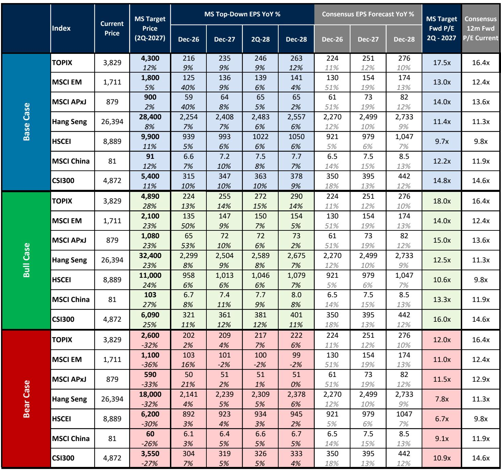
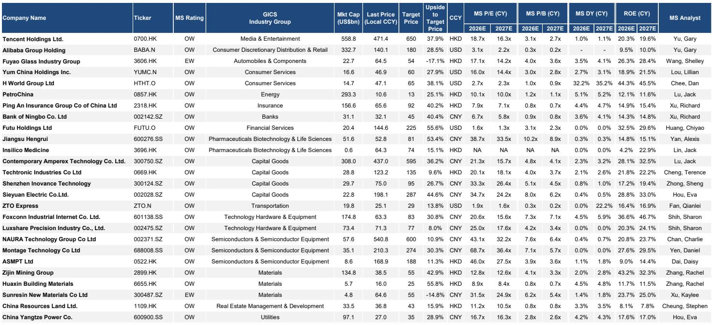
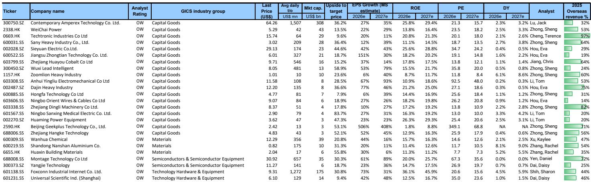

# China’s Equity Market Is Not as Weak as the Index Suggests — And the Real Opportunity Lies in What the Benchmark Misses

The MSCI China index has delivered a negative return year-to-date, but this is a misleading signal. A small handful of large-cap platform companies, representing 45% of the index weight, have dragged down headline performance while the real growth engines of China’s economy — upstream manufacturing, energy, materials, and semiconductor localization — have delivered absolute returns of 2% to 30%. The disconnect is not a story of weak fundamentals. It is a story of index construction rules that systematically underweight the very sectors that are winning.

This is not a statistical quirk. It is a structural distortion that creates both a trap for passive investors and an opportunity for those who look beyond the benchmark. The MSCI China index applies a 20% inclusion factor to A-share stocks, which means that the majority of China’s high-end industrials, energy champions, and semiconductor leaders are severely underrepresented in the index. Add to that the removal of stocks on the U.S. NS-CMIC list, and the picture becomes clear: the index is not reflecting China’s equity market reality. It is reflecting a regulatory and geopolitical filter.

A global investment bank’s mid-year outlook makes a compelling case that the true performance of China’s equity market is meaningfully better than what the index shows. If we adjust for the inclusion factor and add back the excluded stocks, the outperforming sectors would collectively gain 13 percentage points in index weight, while the e-commerce and platform sector would lose 17 points. The implication is direct: thematic stock picking in the right sectors will outperform passive index investing, and the window to reposition is now.

The report projects moderate upside of 8% to 12% across major Chinese equity indices by the second quarter of 2027. But this is not a broad-based recovery story. It is a story of selective earnings improvement, a potential geopolitical truce, and China’s deepening role in global high-end supply chains. The upside is real, but it is concentrated. And the path to get there will be volatile.

## The Index Masked a Thematic Growth Market, and That Distortion Is the Investor’s Edge

The single most important insight from the report is that China’s equity market is not a single story. The MSCI China index, which is the most commonly used benchmark for global investors, has been a poor representation of where value is being created. Year-to-date, the index has been pulled down by the poor performance of large-cap internet and platform companies, which have been locked in an intense price war that has damaged earnings. Meanwhile, sectors like semiconductors, energy, capital goods, and materials have posted strong absolute returns and positive earnings revisions.

The reason these winning sectors are not reflected in the index is twofold. First, the MSCI inclusion rule for A-shares applies a 20% discount factor to the market capitalization of eligible A-share stocks. This means that even if a company is a global leader in its field, only one-fifth of its market cap counts toward the index weight. Since the outperforming sectors are disproportionately listed in the A-share market, their representation is artificially suppressed. Second, the U.S. government’s NS-CMIC list has led to the removal of several stocks from global indices, many of which are in the very sectors that have been performing well.

The result is a benchmark that is structurally biased against the most dynamic parts of China’s economy. For an investor relying on passive index exposure, this means they are effectively betting on the recovery of the platform economy while ignoring the structural rise of China’s upstream and tech localization champions. The report’s pro-forma analysis shows that if the index were adjusted to reflect full A-share inclusion and the reinstatement of excluded stocks, the weight of capital goods would rise from 4% to 9%, semiconductors from 2% to 7%, and tech hardware from 5% to 10%. Consumer discretionary and communication services would collectively lose 17 percentage points.

The strategic implication is clear: the index is not the market. Investors who treat the MSCI China index as a proxy for China’s equity opportunity are making a category error. The real opportunity is in the sectors the index underweights.

## Earnings Growth Is Improving, but the Recovery Will Be Two-Speed and Back-End Loaded

The report identifies three key drivers of an improving earnings outlook: stronger export growth driven by the AI and energy capex cycle, a stronger-than-expected Chinese yuan against the U.S. dollar, and the peaking of earnings damage from the platform companies’ price war. The last factor is particularly important. The Chinese government began enforcing stricter regulations against “involution” — the destructive price competition that has characterized the platform sector — in April. This means the recovery in earnings for these large-cap companies will not show up until second-quarter results are reported in July.

This creates a near-term risk. The first-quarter earnings season, which is currently underway, may still show weakness, especially from the platform companies that dominate the index. Investors should expect another round of earnings estimate reductions before the trend reverses. The report warns that the path will become smoother only after the summer, when second-quarter results begin to reflect the regulatory impact and the broader export-driven recovery.

There is also a macro dimension to the earnings story. The global investment bank’s economics team expects China’s real GDP growth to be supported by exports, particularly in the context of the global energy shock. They have revised their 2026 GDP forecast up by 0.1 percentage point to 4.8%, and their GDP deflator forecast up by 0.3 points to 0.5%. But they caution that consumption will remain a laggard, held back by a still-weak property market and modest spillover to jobs. The recovery is two-speed: exports and industrial production are leading, while domestic consumption and real estate are still dragging.

For investors, this means that the earnings recovery will be concentrated in the sectors that are directly tied to the export and capex cycle — materials, industrials, energy, and semiconductors. Consumer-facing sectors and real estate will take longer to recover. The report’s sector preferences reflect this: it strongly favors upstream asset-focused sectors that are less disruptable by the AI supercycle, and it maintains only moderate exposure to financials and yield plays.

## The Geopolitical Truce Is Real but Fragile, and It Creates a Tactical Window

The U.S.-China relationship has reached an inflection point. The two countries agreed to a truce in 2025, and the upcoming summit between the U.S. and Chinese leaders is expected to produce symbolic deliverables, including selected trade relaxations and the resumption of talks on areas of common interest such as climate and aviation. The report suggests that a successful summit could trigger moderate index-level upside as investor attention returns to China, which has been overshadowed by the Middle East situation and the AI-driven outperformance of markets like Korea, Taiwan, and Japan.

But the truce is not without risks. The prolonged Middle East situation could reinforce the energy sufficiency theme, which plays directly into China’s strengths in the green tech and power equipment supply chains. At the same time, ongoing U.S.-China competition will continue to push China toward tech localization, particularly in AI, semiconductors, and biotech. These are not short-term trades. The report argues that these themes are structurally sustainable and will eventually nurture global champions that command higher valuations.

The geopolitical dimension also introduces a tactical element. The report notes that China may have additional leverage from its potential role in the Middle East, as evidenced by the Iranian foreign minister’s visit to Beijing ahead of the U.S.-China summit. This is a reminder that the geopolitical landscape is fluid, and that any escalation or de-escalation could have outsized effects on specific sectors. Investors need to monitor not just the headlines, but the second-order implications for supply chains and trade flows.

## Three Volatility Drivers the Report Identifies but Does Not Fully Resolve

The report is candid about the risks that could create near-term volatility. Three factors stand out, and each raises questions that the report does not fully answer.

First, the unlocking of IPO shares in Hong Kong. Two of the best-performing stocks in Hong Kong this year — Minimax and Knowledge Atlas — are expected to be included in the Hang Seng Tech Index and the Stock Connect Southbound program. This will drive inflows from ETF funds and Southbound purchases. But the first major unlocking of IPO shares for Minimax on July 8 could create selling pressure that offsets those inflows. The net effect is uncertain, and the timing could create a sharp reversal in momentum.

Second, the domestic deflationary environment. The report’s economics team expects inflation to improve, but they acknowledge that consumption will lag and that the property market remains a drag. The question is whether there is a catalyst that could change this trajectory. If property sales surprise to the upside or if private consumption re-accelerates, the broad index could see bigger upside. But the report does not assign a high probability to either scenario.

Third, the wide range of global macro growth paths. The U.S. economy could see an AI-driven productivity surge, a recessionary demand destruction from high oil prices, or a more benign soft landing. Each scenario has different implications for China’s export growth and for the Fed’s rate path. The report’s base case assumes the Fed cuts rates twice in early 2027, but if the alternative scenarios materialize, the implications for Chinese equities could be very different.

These are not weaknesses in the report. They are honest acknowledgments of uncertainty. But they mean that investors cannot simply buy the index and wait. They need to have a view on these variables and position accordingly.

## A Decision Framework for Positioning in China Equities Over the Next 12 Months

The report provides enough material to construct a clear decision framework. The first question is market selection. The report strongly prefers A-shares over offshore listings. The reasons are structural: A-shares have a higher concentration of upstream manufacturing and hard-core tech companies, there is a pipeline of highly anticipated A-share IPOs that could trigger greater domestic investor participation, and the National Team is standing by to support the market. For investors with the ability to access A-shares, this is the preferred venue.

The second question is sector selection. The report’s top-down framework favors sectors that benefit from three overlapping themes: the global energy sufficiency cycle, the tech localization push, and China’s growing dominance in high-end supply chains. This points to selected materials, industrials, and energy stocks, as well as semiconductors. The report also recommends maintaining moderate exposure to financials, specifically insurance and exchanges, and to yield plays. Real estate and consumer staples are overweight, but this is a more contrarian call that depends on a recovery in domestic demand.

The third question is trade construction. The report recommends four specific trades: A-shares over offshore; China’s best business model stocks; upstream global energy sufficiency supplier champions; and an event-driven tactical trade based on Stock Connect Southbound inclusion and deletion. The last trade is particularly interesting because it is driven by index mechanics rather than fundamentals, and it offers a clear catalyst with a defined timeline.

The framework is not a one-size-fits-all solution. It requires investors to make a judgment about the trajectory of U.S.-China relations, the path of global energy prices, and the speed of China’s domestic recovery. But it provides a structured way to think about the trade-offs.

## What the Report Leaves Open: The Unanswered Questions That Matter Most

For all its analytical rigor, the report leaves several meaningful questions unanswered. The first is the timing and magnitude of the property market recovery. The report’s view on real estate is cautiously optimistic, but it does not identify a specific catalyst that would turn the sector around. If property inventories remain high and prices continue to fall, the drag on consumer confidence and domestic demand will persist, limiting the upside for the broad index.

The second is the sustainability of the export-driven growth model. The report assumes that China’s global export market share will expand by another 1 to 2 percentage points by 2030. But this depends on the global trade environment remaining relatively open, which is not guaranteed. If the U.S. or Europe impose new tariffs or non-tariff barriers, the export engine could stall.

The third is the behavior of the National Team. The report mentions that the National Team is standing by to support the A-share market, but it does not specify the conditions under which it would intervene or the scale of its potential purchases. This creates a layer of policy uncertainty that investors cannot fully model.

These open questions are not reasons to avoid the market. They are reasons to stay engaged and to read the full report. The report’s value lies not in providing all the answers, but in framing the right questions.

Join the community to read the full report and review the original charts.

*This article is for learning and discussion only and does not constitute investment advice.*

Personal reading notes and learning share only. Not investment advice.

