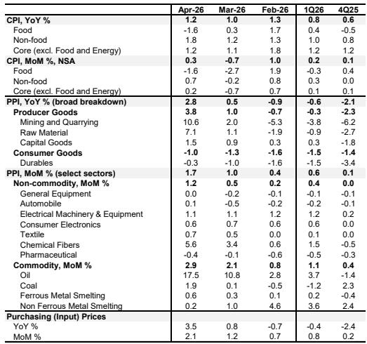

# 市场真正低估的不是通胀，而是成本传导的结构性断层

四月通胀数据公布后，市场关注点集中在PPI同比跳升至2.8%、环比创下1.7%的年内新高。但这份投行研报揭示了一个更值得产业决策者警惕的结构性事实：**PPI的上涨高度集中于上游能源与石化链条，而下游消费品PPI已连续两个月为负。** 这不是一次普通的成本推动型通胀，而是一场沿着产业链逐级传导、但传导效率正在断裂的定价权分化。

研报的核心判断指向一个尚未被充分定价的风险：当上游成本以90%的贡献度推高PPI，而下游消费品价格仍在负区间徘徊时，中游制造业的利润空间正在被系统性压缩。除非企业处于AI或绿色转型这类需求确定性较强的赛道，否则“增收不增利”甚至“减收减利”将成为二季度财报的主旋律。

以下是对这份研报核心逻辑的拆解与延伸。

## 1. 石油与石化链条是四月PPI跳升的绝对主力，而非普遍性的工业复苏

四月PPI环比上涨1.7%，其中石油和石化行业单独贡献了1.5个百分点。这意味着，如果剔除这一链条，PPI环比仅上涨0.2%，基本与三月持平。研报明确指出，石油、煤炭（受能源溢出效应支撑）和有色金属（受供给约束驱动）三大板块合计贡献了四月PPI环比涨幅的90%。

这一数据值得反复推敲。市场往往将PPI上行解读为工业需求回暖的信号，但本次数据恰恰相反：**推动PPI的力量来自供给端，而非需求端。** 石油价格受地缘政治溢价和OPEC+减产预期推动，有色金属受全球绿色转型带来的结构性供给缺口支撑，煤炭则因能源价格联动而保持韧性。这些因素与国内制造业的订单景气度没有直接关系。

对投资者的启示是：不要将PPI上行简单等同于周期复苏。当前PPI的结构性特征意味着，上游资源品公司的利润可能继续改善，但中下游制造业的成本压力正在快速累积。这一判断在研报的下游数据中得到了直接印证。

## 2. 下游消费品PPI持续为负，中游制造业的利润挤压已成系统性风险

研报中一个容易被忽略但极其重要的数据点是：消费品PPI在四月环比下降0.1%，为连续第二个月负增长，其中食品类价格是主要拖累项。这意味着，上游原材料涨价尚未传导至终端消费品价格。

这并非偶然。在需求端疲弱、竞争格局分散的消费品领域，企业缺乏将成本转嫁给消费者的议价权。食品、纺织、一般装备等行业的PPI环比增速均落后于上游。即便是汽车行业，四月PPI环比也仅微涨0.1%，远不足以覆盖原材料成本的上升。

**真正考验企业能力的，不是能否感知到成本压力，而是能否将规模优势转化为对上下游的定价权。** 研报暗示，那些缺乏技术壁垒或品牌溢价的中游制造商，将在未来一到两个季度面临毛利率的显著压缩。对于投资者而言，需要从上市公司一季报中识别哪些企业具备“成本转嫁能力”这一关键护城河，而不是仅关注收入增速。

## 3. AI需求正在溢出至消费电子，但这是结构性亮点而非系统性拐点

研报在普遍偏弱的通胀数据中识别出一个值得关注的积极信号：AI需求正在从数据中心向移动消费电子溢出。具体表现为“通信设备”和“家用电器”细分项中的消费电子价格环比上涨0.6%，同比涨幅扩大1.6个百分点。

这一判断的逻辑链条是清晰的。AI大模型的训练和推理需求拉动高端芯片和存储器的需求，而这些组件的成本上升最终会反映在手机、平板、PC等终端产品上。研报进一步指出，这种溢出效应可能正在推动核心CPI（剔除黄金后）小幅回升，四月同比上涨0.8%，较三月提高0.2个百分点。

但需要警惕的是，这一结构性亮点目前体量有限。消费电子在整体CPI篮子中的权重不高，且其价格上涨更多反映的是成本推动而非需求拉动——消费者是否愿意为“AI手机”支付溢价，目前仍有待市场验证。研报对此保持了克制的判断，并未将其视为消费电子行业全面复苏的信号。

## 4. 医疗服务价格上行揭示了一个被忽视的结构性变量：人力资本定价改革

研报在分析CPI分项时，专门指出医疗服务价格持续上行，并给出了一个具有深意的解释：这很可能反映了正在扩大的医疗服务定价改革，其方向是提升人力资本价值，同时降低耗材成本。

这一判断值得产业观察者高度重视。中国医疗体系长期存在“以药养医”的结构性问题，医疗服务价格被严重低估。新一轮改革试图通过提高诊疗、手术、护理等体现医生技术劳务价值的项目价格，同时压缩药品和耗材的加成空间，来实现医疗费用的结构性调整。

**对医疗健康行业的投资者而言，这意味着行业利润结构正在发生根本性变化。** 以耗材销售为利润核心的商业模式将面临持续压力，而以医疗服务能力为核心壁垒的企业将获得定价权的提升。研报虽然没有展开，但这一趋势对医疗器械、医药流通、民营医院等细分领域的长期影响，值得在完整报告中深入挖掘。

## 5. 报告尚未完全回答的关键问题：PPI高企与政策定力的平衡点在哪里？

研报在展望部分给出了明确的判断：考虑到去年五月和六月PPI环比均为-0.4%的低基数，未来两个月PPI同比可能超过3%。同时，研报认为政策应保持耐心，理由是通胀数据改善和贸易数据强劲。

这里存在一个尚未完全展开的张力。如果PPI同比突破3%甚至更高，而下游需求依然疲弱，政策制定者将面临两难选择：是容忍更高的通胀读数以换取上游行业的利润修复，还是通过宽松政策刺激需求以缓解中下游的利润压力？研报倾向于前者，但这一判断依赖于一个关键假设——石油价格不会进一步失控。

研报的石油策略师预计二季度布伦特原油价格为110美元/桶。如果地缘政治风险超预期，这一假设可能被打破。届时，成本推动型通胀可能演变为更广泛的物价上涨，迫使政策制定者重新评估“保持耐心”的立场。这是读者在阅读完整报告时需要重点关注的变量。

## 6. 如何用这份研报的框架重新审视你的投资组合

基于上述分析，我们可以提炼出一个简化的观察框架，用于评估企业在中观层面的竞争位置：

第一，判断企业处于产业链的哪个环节。上游资源品企业（石油、煤炭、有色金属）受益于供给约束和价格上行，利润确定性相对较高。中游制造企业面临成本上升和需求疲软的双重挤压，需要重点考察其成本转嫁能力。下游消费品企业虽然终端价格稳定，但如果原材料成本占比高且无法转嫁，毛利率压力将在二季度集中体现。

第二，识别企业是否处于AI或绿色转型的需求强相关赛道。研报明确指出，这是当前少数能够支撑下游价格和利润率的结构性需求来源。如果企业的产品或服务与AI算力、数据中心、新能源设备、电力设备等方向相关，其利润受成本挤压的程度可能相对可控。

第三，关注企业的定价权来源。是技术壁垒、品牌溢价、还是规模效应？在成本快速上升的环境中，只有前两者能够提供真正的保护。单纯依赖规模的企业，可能面临“越大越亏”的困境。

第四，警惕低基数带来的数据幻觉。PPI同比在未来两个月可能突破3%，但这更多反映的是统计基数的变化，而非经济基本面的显著改善。不要因为通胀数据好看就放松对中游利润风险的警惕。

---

上述框架只是基于这份研报核心逻辑的初步提炼。研报中还有大量关于分项数据拆解、跨周期比较、以及政策情景分析的细节尚未展开。例如，有色金属供给约束的具体来源、AI需求溢出的量化测算、医疗服务定价改革的区域差异等，都是理解当前通胀结构的关键拼图。

这些内容，以及研报中完整的图表数据，我们会在社群中继续讨论。如果你对“如何识别真正具备定价权的公司”或“PPI上行周期中哪些行业可能逆势扩张”感兴趣，欢迎来星球微信群里继续交流。我们将围绕这份研报做一次更深入的案例拆解，并分享我们对二季度利润趋势的初步判断。

Personal reading notes and learning share only. Not investment advice.

