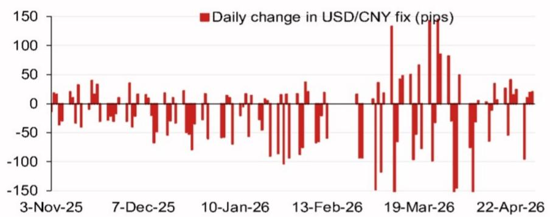
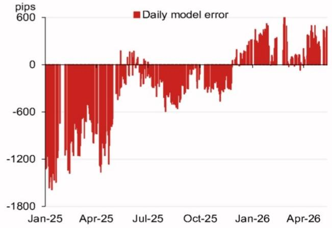

# The PBOC Is Signaling a Tactical Pause, Not a Structural Shift in USD/CNY Policy

The People's Bank of China is not abandoning its managed depreciation strategy. It is adjusting the pace. A global investment bank's USD/CNY fix model projects a midpoint of 6.7950, a full 476 pips lower than the previous projection of 6.8426. When the counter-cyclical factor is included, the projection rises to 6.8156, still 270 pips lower than the prior fix. This is not a random fluctuation. It is a deliberate signal that Beijing is tightening its grip on the currency's trajectory ahead of a series of high-stakes diplomatic and domestic political events.

The timing matters. The model's latest reading comes as the market prepares for the Xi-Trump summit scheduled for 14-15 May 2026 in China. The PBOC has a well-established playbook of using the fix to manage expectations before major bilateral meetings. A stronger fix reduces the risk of the yuan becoming a bargaining chip in trade negotiations. It also limits the upside for dollar-denominated import costs at a moment when China's economic recovery remains uneven. The message is clear: Beijing wants stability, not a free fall, but it also wants to retain the option to weaken the currency later if needed.

The data from the model error chart reinforces this interpretation. The daily model error has been trending downward from a peak of -1800 pips in January 2025 to near zero by January 2026, and has now turned positive at around 600 pips by April 2026. This pattern suggests that the PBOC's actual fix has been systematically stronger than what the model would predict without intervention. In other words, the central bank has been leaning against depreciation pressure more aggressively in recent months. The question is whether this is a temporary tactical move or the beginning of a more sustained policy shift.

The answer lies in the calendar. The second half of 2026 is packed with events that will test China's currency management: the Politburo meeting for economic work in late July, the National Day Golden Week holiday in October, the APEC summit in Shenzhen in November, the Central Economic Work Conference in mid-December, and President Xi's state visit to the US toward the end of the year. Each of these events creates a different set of incentives for the PBOC. A stronger fix ahead of the Xi-Trump summit makes diplomatic sense. A weaker fix after the summit could help support exports if trade tensions escalate. The PBOC is not making a one-directional bet. It is building optionality.

## The Counter-Cyclical Factor Is the PBOC's Primary Tool for Signaling Intent Without Committing to a Path

The model's projection with the counter-cyclical factor included is 6.8156, which is 206 pips higher than the base model projection of 6.7950. This 206-pip gap is the explicit cost of the PBOC's intervention. It represents the premium the central bank is willing to pay to keep the fix stronger than what pure market forces would dictate. The counter-cyclical factor is not a new tool, but its current magnitude is telling. It suggests that the PBOC is actively managing expectations, not just passively absorbing market pressure.

The counter-cyclical factor works as a dampener. When the market is pushing for a weaker yuan, the PBOC applies this factor to push the fix stronger. When the market is pushing for a stronger yuan, the factor can be reduced or removed. The current application of the factor indicates that the PBOC sees depreciation pressure as excessive relative to its desired path. The central bank is not trying to reverse the trend. It is trying to slow it down.

This has direct implications for traders and corporate treasurers. The gap between the base model projection and the counter-cyclical-adjusted projection represents a measure of the PBOC's discomfort. A widening gap signals increasing intervention. A narrowing gap signals that the PBOC is becoming more comfortable with the market's direction. Monitoring this spread in real time provides a leading indicator of policy shifts. The current 206-pip gap is moderate but not trivial. It suggests that the PBOC is prepared to defend the fix but is not yet in crisis mode.

The model error chart provides additional context. The error has moved from deeply negative territory to slightly positive territory over the past 15 months. This means that the PBOC's actual fix has been consistently stronger than the model's prediction. The trend is clear: the PBOC has been leaning against depreciation. But the magnitude of the error is now small. This could mean that the PBOC is running out of room to keep the fix strong without more aggressive intervention, or it could mean that the market is finally aligning with the PBOC's desired path. The data alone cannot distinguish between these two possibilities. That is where the event calendar becomes essential.

## The Xi-Trump Summit Sets the Near-Term Floor for USD/CNY, but the Medium-Term Ceiling Depends on Trade Outcomes

The Xi-Trump summit on 14-15 May 2026 is the single most important near-term catalyst for USD/CNY. Historical precedent suggests that the PBOC will keep the fix stable or even slightly stronger in the weeks leading up to such a high-profile meeting. The logic is straightforward: a stable yuan reduces the risk of the currency becoming a point of contention in the negotiations. It also signals China's willingness to cooperate on macroeconomic issues.

The model's projection of 6.7950 is consistent with this narrative. It implies a fix that is stronger than the previous level of 6.8426. If the PBOC follows through with a fix in this range, it would represent a clear signal of stability ahead of the summit. The counter-cyclical factor adds an extra layer of assurance. The PBOC is not leaving the fix to chance. It is actively managing it.

But the summit is only the beginning. The outcome of the meeting will determine the medium-term trajectory. If the summit results in a trade truce or a de-escalation of tariffs, the PBOC may feel comfortable allowing the yuan to weaken gradually in the second half of the year to support exports. If the summit results in an escalation of trade tensions, the PBOC may need to defend the fix more aggressively to prevent a disorderly depreciation. The range of outcomes is wide, and the PBOC's response will depend on the specific terms of any agreement.

The calendar of events after the summit reinforces this uncertainty. The July Politburo meeting will provide clues about domestic economic priorities. The APEC summit in November will be another major diplomatic event. President Xi's visit to the US toward the end of the year will be the culmination of a year of high-level engagement. Each of these events creates a new set of incentives for the PBOC. The central bank is not managing the yuan in a vacuum. It is managing it in the context of a complex diplomatic and economic calendar.

## The Model's Historical Error Pattern Reveals a PBOC That Is Becoming More Predictable, Not Less

The daily model error chart shows a clear trend: the error has been converging toward zero. In January 2025, the error was -1800 pips. By January 2026, it was near zero. By April 2026, it had turned positive at around 600 pips. This convergence is significant for two reasons.

First, it suggests that the PBOC's behavior is becoming more systematic. The model is capturing the central bank's decision-making process with increasing accuracy. This is good news for traders who rely on quantitative models. It means that the model's projections are becoming more reliable as a guide to the actual fix. The PBOC is not trying to surprise the market. It is trying to guide it.

Second, the convergence implies that the PBOC's intervention is becoming less discretionary. The model error was large when the PBOC was actively pushing against market trends. It is now small because the PBOC's actions are more aligned with what the model would predict. This could be because the PBOC has achieved its desired level of adjustment, or because the market has adjusted to the PBOC's preferred path. Either way, the result is greater predictability.

The positive error in April 2026 is the most recent data point. It means that the actual fix was stronger than the model's prediction by about 600 pips. This is a modest deviation compared to the -1800 pips seen in January 2025. It suggests that the PBOC is still leaning slightly against depreciation, but the magnitude of the intervention is much smaller than before. The central bank is not fighting a losing battle. It is fine-tuning.

## The Report Leaves Unanswered Questions About the PBOC's Tolerance for a Weaker Yuan After the Summit

The report provides a detailed model and a calendar of events, but it does not fully address the question of what happens after the Xi-Trump summit. The model projection of 6.7950 is for the near term. What about the third and fourth quarters of 2026? The report notes the July Politburo meeting, the APEC summit, and President Xi's US visit, but it does not provide a clear projection for how the fix will evolve through these events.

This gap is not a flaw in the model. It is a reflection of the inherent uncertainty in the outlook. The PBOC's policy will depend on the outcome of the summit, the trajectory of the US economy, and the state of China's domestic recovery. No model can fully capture this complexity. But the report could have provided a framework for thinking about the range of possible outcomes.

For example, what would the model project if the summit results in a 10% tariff increase on Chinese goods? What would it project if the summit results in a partial rollback of existing tariffs? The report does not provide these scenarios. It leaves the reader to infer the implications from the model's structure and the event calendar.

This is where the report's value lies. It provides the tools for analysis, not the answers. The model's projection is a starting point, not a conclusion. The reader must combine the model with an assessment of the political and economic environment to form a view. The report is honest about this limitation. It provides the data and the framework, but it does not pretend to have all the answers.

## A Decision Framework for Using the USD/CNY Fix Model in a Volatile Environment

For readers who want to apply this analysis to their own decision-making, a structured framework is essential. The following approach translates the report's insights into actionable steps.

Step one: Monitor the gap between the base model projection and the counter-cyclical-adjusted projection. A widening gap indicates increasing PBOC intervention. A narrowing gap indicates decreasing intervention. This spread is the single most useful leading indicator in the report.

Step two: Track the daily model error. A positive error means the actual fix is stronger than the model predicts. A negative error means the actual fix is weaker. The trend in the error tells you whether the PBOC is leaning for or against the market. The magnitude tells you how aggressively it is leaning.

Step three: Map the event calendar. The Xi-Trump summit, the July Politburo meeting, the APEC summit, and President Xi's US visit are all potential inflection points. For each event, assess the likely outcome and the PBOC's likely response. This is where qualitative judgment becomes essential.

Step four: Combine the quantitative signals with the qualitative assessment. If the counter-cyclical factor is widening and the model error is turning negative, it suggests the PBOC is preparing for a period of weakness. If the factor is narrowing and the error is positive, it suggests the PBOC is comfortable with the current trajectory.

Step five: Do not assume that the PBOC's current stance will persist. The central bank's priorities shift with the diplomatic and economic calendar. A fix that makes sense in May may not make sense in November. The model is a tool for understanding the present, not a crystal ball for the future.

This framework is not a trading strategy. It is a way of thinking about the problem. It forces the user to be explicit about assumptions and to update views as new information becomes available. The report provides the data. The framework provides the structure. The judgment is up to the user.

Join the community to read the full report and review the original charts.

*This article is for learning and discussion only and does not constitute investment advice.*

Personal reading notes and learning share only. Not investment advice.

