# Property Data Monitor

Mainland China: Divergence between primary & secondary sales; HK: Weekend primary sales reached a 2.5-year high

# Mainland China

- Leading indicator #1) The Centraline tier-1 Cities' secondary asking price index mildly rose from 19.0 last week to 19.3 (Figure 1). Shenzhen saw the largest W/W increase (up 1.0 to 28.1), likely due to policy easing in late April.   
- Leading indicator #2) The Centaline manager confidence index stayed flattish at 57 (Figure 2).   
- 60-city primary sales registrations dropped 7% Y/Y (last week: +1%) (more). Tier-1 / 2 Cities outperformed (-3% Y/Y). YTD, 20-city sales have dropped 10% Y/Y.   
- 12-city secondary sales registrations increased 16% Y/Y (last week: +25% (Figure 5)). YTD, 12-city secondary sales have risen 3% Y/Y (Shanghai +9%; Beijing +4%; Shenzhen +1%).   
- Southbound holdings rose 0.01% W/W (Table 5): Yuexiu +0.7%; Greentown, C&D, COLI, Country Garden all +0.3%.   
- Share price moves (Figure 14): The sector rose 14% last week, significantly outperforming the HSI (+1%), due to solid data from Golden Week (more in Golden Week stayed solid; target \~20% upside). The outperformers were Longfor (+22%), Yuexiu & COLI (both +18%), and Jinmao (+17%). The underperformer was Country Garden (-2%).   
- JPM top picks: COLI (more in A laggard poised to outperform), CR Land, Jinmao & CR Mixc.

# Hong Kong SAR

- The home price index rose 0.2% W/W (Figure 10). Home prices have risen 8.0% YTD and are just 2% away from reaching our 2026 home price forecast of 10-15%.   
- Secondary transactions in the top 35 estates totaled 78 units, down 24% W/W but up 22% Y/Y (Figure 9).   
- The Centa Valuation Index (CVI) (Figure 11) rose to 89.3 (last week: 85.3). This is a leading indicator that home price growth may continue (a reading of >60 = banks revising up property valuations).   
- The Centa Salesman Index (CSI) (Figure 12) stays elevated at 69.7 (last week: 70.3). A reading of $>50 =$ sentiment is positive and property prices are likely to rise.   
- SHKP & Henderson's launches achieved 100% sell-through rates: The primary market saw 560 transactions over the weekend, the highest in the past 2.5 years. 3 primary launches were all 100% sold out, including the 1st batch of Lime Spark (by SHKP; in Tseun Wan) (154 units; ASP 14% higher than secondary), Highwood Ph2 (by Henderson; in To Kwa Wan) (150 units, ASP 14% higher than secondary), One Victoria Cove Ph3 (led by Henderson;

# Mainland China/Hong Kong Property & Conglomerates

Karl Chan AC

(852) 2800-8513

karl.chan@JPM.com

JPM Securities (Asia Pacific) Limited/ JPM Broking (Hong Kong) Limited

Jocelyn Gao

(852) 2800-8529

jocelyn.gao@JPM.com

JPM Securities (Asia Pacific) Limited/ JPM Broking (Hong Kong) Limited

Venus Choi

(852) 2800-8599

venus.choi@JPM.com

JPM Securities (Asia Pacific) Limited/ JPM Broking (Hong Kong) Limited

# APAC Credit Research

Alvin Au AC

(852) 2800-8533

alvin.au@JPM.com

JPM Securities (Asia Pacific) Limited

Soo Chong Lim

(852) 2800-7387

soochong.lim@JPM.com

JPM Securities (Asia Pacific) Limited

Shirley Yau

(852) 2800-0566

shirley.yau@JPM.com

JPM Securities (Asia Pacific) Limited

in Hung Hom) (130 units; ASP 20% higher than secondary). Meanwhile, PORTO (by Wang On; in Ap Lei Chau) launched the first batch (86 units; ASP 31% higher than secondary), and it was 51% sold.

- Southbound holdings rose 0.07% W/W (Table 5): Hang Lung +0.5%; Henderson +0.3%.   
- Share price moves (Figure 15): The sector rose 4% last week, outperforming the HSI (1%). The outperformers were CK Hutchison (+11%; due to disposal of 49% stake in VodafoneThree UK), NWD (+10%) and Wharf Holdings (+9%). The underperformers were MTRC and Hang Lung (both +1%).   
- JPM top picks: Developers – SHKP & Sino; landlords – Swire Prop & Hang Lung; conglomerates – JM & CKH.

# Credit views (by Alvin Au)

- The JACI China HY Property Index rose 1.7% last week (vs China HY: +0.7%), bringing YTD returns to +1.3%.   
- Hysan: Swire Properties' 1Q26 data indicated that HK retail tenant sales growth accelerated from +6% yoy in 4Q25 to +13% in 1Q26. For HK office, Swire expects negative rental reversion to narrow at Pacific Place in 2H26, on the back of increased leasing activities and stabilizing office rents in Central (see details in equity report). We believe a solid HK retail market and gradual stabilization of office segment is positive for Hysan (covered by Soo Chong Lim), and we prefer Hysan 7.2% perp (105.825, 5.7% ytc, z+189) as the best credit to ride on the recovery of HK commercial property market.   
- CR Land: REDD reported last week that China Resources Land (CR Land) plans to inject Rmb10bn-15bn of shopping mall assets into public REITs in 2026, and it targets to issue a total of Rmb60bn in public REITs by 2030. \~60% of the proceeds from REITs will be used for construction and maintenance spending on existing projects, and \~30% will be allocated for M&A activities. We note that commercial REITs have become an emerging funding channel for developers with material IP resources, such as CR Land and Seazen, etc.

# Table Of Contents

Mainland China.... 1

Hong Kong SAR 1

Credit views (by Alvin Au) 2

1. Mainland China – Leading indicators.... 4

2. Mainland China – Weekly Primary Sales 5

3. Mainland China – Weekly Secondary Sales.... 7

4. Hong Kong – Residential Market Update 9

5. Hong Kong – Tourist Arrivals & Resident Departures..... 13

6. Share price update 14

7. Credit recommendations .... 18

8. Equity valuation summary 19

# 1. Mainland China – Leading indicators

Figure 1: Centraline secondary asking price index vs. NBS secondary home price index M/M in tier-1 Cities   
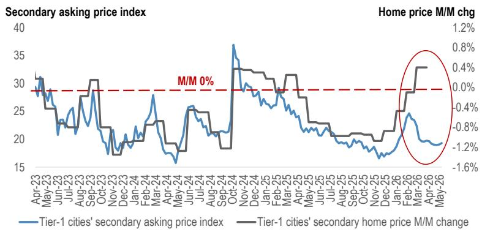

line

| Date     | Tier-1 Cities' secondary asking price index | Tier-1 Cities' secondary home price M/M change |
|----------|---------------------------------------------|--------------------------------------------------|
| Apr-23   | ~30                                         | ~0.8%                                            |
| May-23   | ~28                                         | ~0.6%                                            |
| Jun-23   | ~25                                         | ~0.4%                                            |
| Jul-23   | ~27                                         | ~0.6%                                            |
| Aug-23   | ~30                                         | ~0.8%                                            |
| Sep-23   | ~28                                         | ~0.6%                                            |
| Oct-23   | ~25                                         | ~0.4%                                            |
| Nov-23   | ~20                                         | ~0.2%                                            |
| Dec-23   | ~18                                         | ~0.0%                                            |
| Jan-24   | ~20                                         | ~0.2%                                            |
| Feb-24   | ~25                                         | ~0.4%                                            |
| Mar-24   | ~28                                         | ~0.6%                                            |
| Apr-24   | ~25                                         | ~0.4%                                            |
| May-24   | ~20                                         | ~0.2%                                            |
| Jun-24   | ~18                                         | ~0.0%                                            |
| Jul-24   | ~25                                         | ~0.2%                                            |
| Aug-24   | ~28                                         | ~0.4%                                            |
| Sep-24   | ~35                                         | ~0.6%                                            |
| Oct-24   | ~37                                         | ~0.8%                                            |
| Nov-24   | ~30                                         | ~0.6%                                            |
| Dec-24   | ~28                                         | ~0.4%                                            |
| Jan-25   | ~25                                         | ~0.2%                                            |
| Feb-25   | ~28                                         | ~0.4%                                            |
| Mar-25   | ~25                                         | ~0.6%                                            |
| Apr-25   | ~20                                         | ~0.4%                                            |
| May-25   | ~18                                         | ~0.2%                                            |
| Jun-25   | ~15                                         | ~0.0%                                            |
| Jul-25   | ~18                                         | ~0.2%                                            |
| Aug-25   | ~20                                         | ~0.4%                                            |
| Sep-25   | ~18                                         | ~0.6%                                            |
| Oct-25   | ~15                                         | ~0.4%                                            |
| Nov-25   | ~18                                         | ~0.6%                                            |
| Dec-25   | ~15                                         | ~0.4%                                            |
| Jan-26   | ~18                                         | ~0.6%                                            |
| Feb-26   | ~25                                         | ~0.8%                                            |
| Mar-26   | ~30                                         | ~1.0%                                            |
| Apr-26   | ~35                                         | ~1.2%                                            |
| May-26   | ~30                                         | ~1.0%                                            |

Source: Centraline, Wind, NBS. Note: The asking price index represents the percentage of projects with home price increases. For example, an index of 20 means that 20% of projects raise prices (while 80% do not).

Figure 2: Centraline secondary manager confidence index in tier-1 Cities vs. three-month rolling secondary sales   
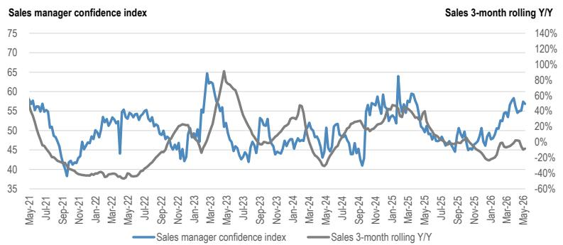

line

| Date    | Sales manager confidence index | Sales 3-month rolling Y/Y |
|---------|----------------------------------|---------------------------|
| May-21  | 58                               | 40%                       |
| Jul-21  | 55                               | 20%                       |
| Sep-21  | 40                               | -40%                      |
| Nov-21  | 45                               | -20%                      |
| Jan-22  | 50                               | 0%                        |
| Mar-22  | 55                               | 20%                       |
| May-22  | 50                               | 40%                       |
| Jul-22  | 45                               | 60%                       |
| Sep-22  | 50                               | 80%                       |
| Nov-22  | 55                               | 100%                      |
| Jan-23  | 65                               | 120%                      |
| Mar-23  | 60                               | 140%                      |
| May-23  | 55                               | 120%                      |
| Jul-23  | 50                               | 100%                      |
| Sep-23  | 45                               | 80%                       |
| Nov-23  | 50                               | 60%                       |
| Jan-24  | 55                               | 40%                       |
| Mar-24  | 60                               | 20%                       |
| May-24  | 55                               | 0%                        |
| Jul-24  | 50                               | -20%                      |
| Sep-24  | 45                               | -40%                      |
| Nov-24  | 50                               | -60%                      |
| Jan-25  | 65                               | -40%                      |
| Mar-25  | 60                               | -20%                      |
| May-25  | 55                               | 0%                        |
| Jul-25  | 50                               | 20%                       |
| Sep-25  | 45                               | 40%                       |
| Nov-25  | 50                               | 60%                       |
| Jan-26  | 55                               | 80%                       |
| Mar-26  | 60                               | 100%                      |
| May-26  | 55                               | 120%                      |

Source: Centraline, Wind. Note: The index surveys managers across the country for their judgment on the market outlook.

# 2. Mainland China – Weekly primary sales

Figure 3: 60-city weekly primary sales registrations – compared with 2019-24   
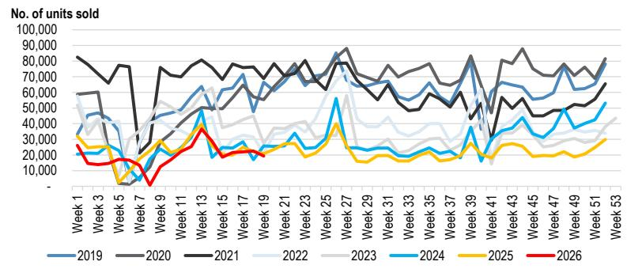  
Source: CREIS.

Figure 4: 60-city weekly primary sales registrations   
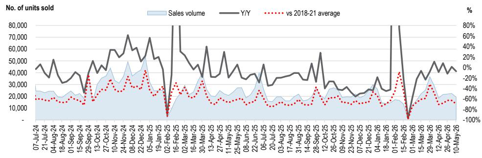  
Source: CREIS.

Table 1: 60-city weekly primary sales registrations by tier 

<table><tr><td rowspan="2">Week ending</td><td colspan="5">60-City</td><td colspan="5">Tier-1</td><td colspan="5">Tier-2</td><td colspan="5">Tier-3/4</td></tr><tr><td>No. of units</td><td>Y/Y</td><td>W/W</td><td>1M rolling Y/Y</td><td>vs. 18-21 avg</td><td>No. of units</td><td>Y/Y</td><td>W/W</td><td>1M rolling Y/Y</td><td>vs. 18-21 avg</td><td>No. of units</td><td>Y/Y</td><td>W/W</td><td>1M rolling Y/Y</td><td>vs. 18-21 avg</td><td>No. of units</td><td>Y/Y</td><td>W/W</td><td>1M rolling Y/Y</td><td>vs. 18-21 avg</td></tr><tr><td>8-Mar-26</td><td>16,815</td><td>-22%↑</td><td>35%↓</td><td>-52%↓</td><td>-66%↑</td><td>1,725</td><td>-46%↑</td><td>20%↓</td><td>-62%↓</td><td>-60%↑</td><td>11,097</td><td>-17%↑</td><td>37%↓</td><td>-50%↓</td><td>-62%↑</td><td>3,993</td><td>-21%↑</td><td>36%↓</td><td>-51%↓</td><td>-75%↑</td></tr><tr><td>15-Mar-26</td><td>22,191</td><td>-6%↑</td><td>32%↓</td><td>-46%↑</td><td>-61%↑</td><td>3,550</td><td>-9%↑</td><td>106%↑</td><td>-54%↑</td><td>-32%↑</td><td>13,197</td><td>-7%↑</td><td>19%↓</td><td>-45%↑</td><td>-61%↑</td><td>5,444</td><td>-3%↑</td><td>36%↑</td><td>-45%↑</td><td>-69%↑</td></tr><tr><td>22-Mar-26</td><td>25,414</td><td>-23%↓</td><td>15%↓</td><td>-29%↑</td><td>-59%↑</td><td>3,286</td><td>-34%↓</td><td>-7%↓</td><td>-40%↑</td><td>-43%↓</td><td>17,125</td><td>-15%↓</td><td>30%↑</td><td>-25%↑</td><td>-54%↑</td><td>5,003</td><td>-37%↓</td><td>-8%↓</td><td>-31%↑</td><td>-73%↓</td></tr><tr><td>29-Mar-26</td><td>36,602</td><td>-8%↑</td><td>44%↑</td><td>-14%↑</td><td>-32%↑</td><td>5,928</td><td>4%↑</td><td>80%↑</td><td>-18%↑</td><td>42%↑</td><td>24,617</td><td>-1%↑</td><td>44%↑</td><td>-9%↑</td><td>-25%↑</td><td>6,057</td><td>-34%↑</td><td>21%↑</td><td>-26%↑</td><td>-63%↑</td></tr><tr><td>5-Apr-26</td><td>28,805</td><td>11%↑</td><td>-21%↓</td><td>-8%↑</td><td>-49%↓</td><td>6,082</td><td>30%↑</td><td>3%↓</td><td>-2%↑</td><td>53%↑</td><td>16,560</td><td>8%↑</td><td>-33%↓</td><td>-4%↑</td><td>-53%↓</td><td>6,163</td><td>4%↑</td><td>2%↓</td><td>-21%↑</td><td>-65%↓</td></tr><tr><td>12-Apr-26</td><td>18,580</td><td>-9%↓</td><td>-35%↓</td><td>-8%↓</td><td>-70%↓</td><td>3,339</td><td>4%↓</td><td>-45%↓</td><td>0%↑</td><td>-26%↓</td><td>11,293</td><td>-1%↓</td><td>-32%↑</td><td>-3%↑</td><td>-71%↓</td><td>3,948</td><td>-31%↓</td><td>-36%↓</td><td>-26%↓</td><td>-79%↓</td></tr><tr><td>19-Apr-26</td><td>21,601</td><td>8%↑</td><td>16%↑</td><td>0%↑</td><td>-68%↑</td><td>3,737</td><td>5%↑</td><td>12%↑</td><td>11%↑</td><td>-35%↓</td><td>13,370</td><td>23%↑</td><td>18%↑</td><td>6%↑</td><td>-68%↑</td><td>4,494</td><td>-18%↑</td><td>14%↑</td><td>-21%↑</td><td>-77%↑</td></tr><tr><td>26-Apr-26</td><td>22,029</td><td>-12%↓</td><td>2%↓</td><td>0%↑</td><td>-63%↑</td><td>4,303</td><td>6%↑</td><td>15%↑</td><td>13%↑</td><td>-23%↑</td><td>13,251</td><td>-10%↓</td><td>-1%↓</td><td>4%↓</td><td>-62%↑</td><td>4,475</td><td>-27%↓</td><td>0%↓</td><td>-18%↑</td><td>-76%↑</td></tr><tr><td>3-May-26</td><td>22,468</td><td>1%↑</td><td>2%↑</td><td>-3%↓</td><td>-63%↓</td><td>4,216</td><td>12%↑</td><td>-2%↓</td><td>7%↓</td><td>-14%↑</td><td>13,627</td><td>12%↑</td><td>3%↑</td><td>5%↑</td><td>-63%↓</td><td>4,625</td><td>-26%↑</td><td>3%↑</td><td>-26%↓</td><td>-75%↑</td></tr><tr><td>10-May-26</td><td>19,317</td><td>-7%↓</td><td>-14%↓</td><td>-3%↑</td><td>-69%↓</td><td>3,355</td><td>-3%↓</td><td>-20%↓</td><td>5%↓</td><td>-33%↓</td><td>11,351</td><td>-3%↓</td><td>-17%↓</td><td>4%↓</td><td>-70%↓</td><td>4,611</td><td>-18%↑</td><td>0%↓</td><td>-22%↑</td><td>-77%↓</td></tr></table>

Source: CREIS.

# 3. Mainland China – Weekly secondary sales

Figure 5: 12-city daily secondary sales registrations   
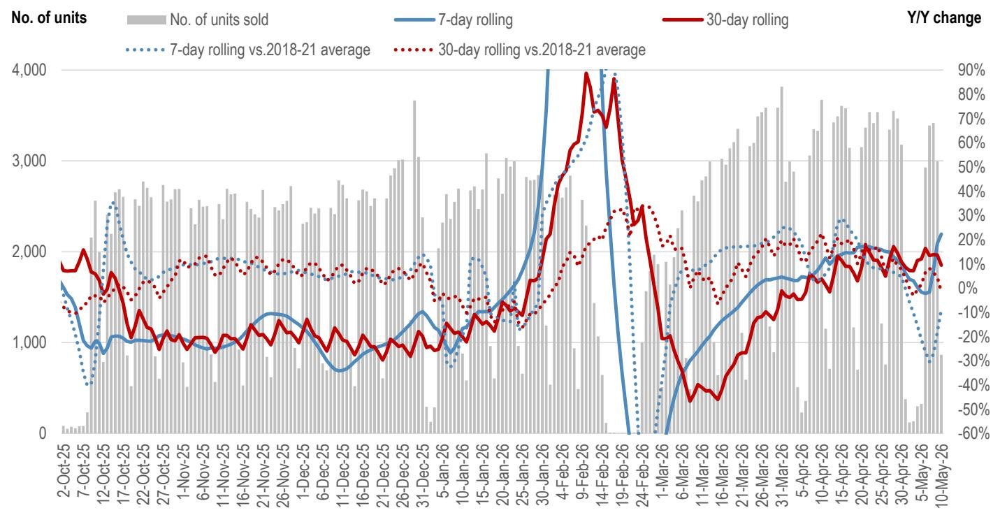  
Source: Wind.

Figure 6: 12-city secondary sales registrations' seven-day moving average   
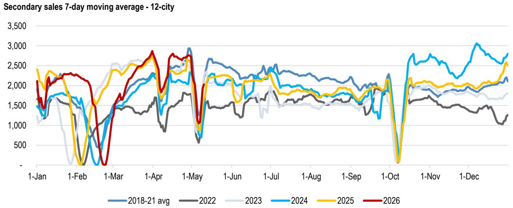

line

| Month   | 2018-21 avg | 2022  | 2023  | 2024  | 2025  | 2026  |
|---------|-------------|-------|-------|-------|-------|-------|
| 1-Jan   | ~1,500      | ~1,600| ~1,400| ~1,700| ~2,400| ~2,100|
| 1-Feb   | ~1,600      | ~1,700| ~1,500| ~1,800| ~2,300| ~2,300|
| 1-Mar   | ~1,800      | ~1,900| ~1,700| ~2,000| ~2,500| ~1,800|
| 1-Apr   | ~2,000      | ~1,800| ~1,900| ~2,300| ~2,700| ~2,900|
| 1-May   | ~2,500      | ~1,700| ~2,100| ~2,400| ~2,600| ~2,800|
| 1-Jun   | ~2,300      | ~1,600| ~1,900| ~2,200| ~2,300| ~2,100|
| 1-Jul   | ~2,400      | ~1,700| ~1,800| ~2,300| ~2,200| ~2,300|
| 1-Aug   | ~2,300      | ~1,600| ~1,700| ~2,100| ~2,100| ~2,100|
| 1-Sep   | ~2,200      | ~1,500| ~1,600| ~1,900| ~1,900| ~1,900|
| 1-Oct   | ~2,300      | ~1,600| ~1,700| ~2,800| ~1,900| ~1,900|
| 1-Nov   | ~2,400      | ~1,700| ~1,800| ~2,700| ~2,100| ~2,300|
| 1-Dec   | ~2,500      | ~1,800| ~1,900| ~3,100| ~2,500| ~2,600|

Source: Wind.

# 4. Hong Kong – Residential market update

Table 2: Hong Kong primary residential projects – Latest sell-through rates and upcoming launches 

<table><tr><td colspan="2">Project</td><td>Location</td><td>Developer</td><td>Launch Date</td><td>ASP (HK$ psf)</td><td>Total no. of units</td><td>Units launched</td><td>Units sold</td><td>Sell-through</td><td>vs. previous phase</td><td>vs. secondary prices</td></tr><tr><td colspan="12">Major primary new launches since April 2026</td></tr><tr><td rowspan="3">Deep Water South Ph6A Mont Blue</td><td></td><td>Wong Chuk Hang</td><td>Wheelock/MTRC</td><td>22-Mar-26</td><td>27 - 33K</td><td>463</td><td>93</td><td>60</td><td>65%</td><td>39%</td><td>16%</td></tr><tr><td></td><td></td><td></td><td>28-Mar-26</td><td>26 - 32K</td><td></td><td>99</td><td>71</td><td>72%</td><td>-3%</td><td>12%</td></tr><tr><td></td><td></td><td></td><td>4-May-26</td><td>26 - 33K</td><td></td><td>113</td><td>6</td><td>5%</td><td>0%</td><td>16%</td></tr><tr><td rowspan="3">La Mirabelle I</td><td>海堤灣I</td><td>Lohas Park</td><td>Sino/Kerry/K Wah/ CML/MTRC</td><td>31-Mar-26</td><td>15 - 17K</td><td>1,266</td><td>254</td><td>254</td><td>100%</td><td>6%</td><td>-2%</td></tr><tr><td></td><td></td><td></td><td>7-Apr-26</td><td>15 - 18K</td><td></td><td>168</td><td>152</td><td>90%</td><td>6%</td><td>4%</td></tr><tr><td></td><td></td><td></td><td>12-Apr-26</td><td>16 - 20K</td><td></td><td>261</td><td>163</td><td>62%</td><td>3%</td><td>7%</td></tr><tr><td rowspan="3">Pavilia Farm III</td><td>柏傲莊III</td><td>Tai Wai</td><td>NWD/MTRC</td><td>18-Apr-26</td><td>20 - 26K</td><td>892</td><td>88</td><td>88</td><td>100%</td><td>10%</td><td>0%</td></tr><tr><td></td><td></td><td></td><td>25-Apr-26</td><td>22 - 27K</td><td></td><td>75</td><td>75</td><td>100%</td><td>2%</td><td>2%</td></tr><tr><td></td><td></td><td></td><td>30-Apr-26</td><td>26 - 30K</td><td></td><td>45</td><td>25</td><td>56%</td><td>13%</td><td>27%</td></tr><tr><td rowspan="2">KT Marina Ph2</td><td>啟德海灣2期</td><td>Kai Tak</td><td>K Wah/Wheelock/ COLI</td><td>18-Apr-26</td><td>18 - 24K</td><td>1,121</td><td>160</td><td>140</td><td>88%</td><td>4%</td><td>18%</td></tr><tr><td></td><td></td><td></td><td>26-Apr-26</td><td>18 - 28K</td><td></td><td>142</td><td>97</td><td>68%</td><td>7%</td><td>26%</td></tr><tr><td rowspan="2">One Victoria Cove Ph1</td><td>首岸</td><td>Hung Hom</td><td>Henderson/Hysan/ Empire/URA</td><td>25-Apr-26</td><td>17 - 20K</td><td>360</td><td>218</td><td>218</td><td>100%</td><td>-</td><td>8%</td></tr><tr><td></td><td></td><td></td><td>30-Apr-26</td><td>19 - 24K</td><td></td><td>120</td><td>120</td><td>100%</td><td>8%</td><td>16%</td></tr><tr><td>Lime SPARK</td><td>形瑨</td><td>Tsuen Wan</td><td>SHKP</td><td>9-May-26</td><td>16 - 18K</td><td>462</td><td>154</td><td>154</td><td>100%</td><td>-</td><td>14%</td></tr><tr><td rowspan="2">Highwood Ph2</td><td>壹沐2期</td><td>To Kwa Wan</td><td>Henderson</td><td>9-May-26</td><td>19 - 24K</td><td>415</td><td>150</td><td>150</td><td>100%</td><td>14%</td><td>14%</td></tr><tr><td></td><td></td><td></td><td>13-May-26</td><td>19 - 24K</td><td></td><td>50</td><td>TBC</td><td></td><td>4%</td><td>22%</td></tr><tr><td>PORTO</td><td></td><td>Ap Lei Chau</td><td>Wang On</td><td>9-Apr-26</td><td>20 - 25K</td><td>174</td><td>86</td><td>44</td><td>51%</td><td>-</td><td>31%</td></tr><tr><td>One Victoria Cove Ph3</td><td>首岸3期</td><td>Hung Hom</td><td>Henderson/Hysan/ Empire/URA</td><td>10-May-26</td><td>21 - 23K</td><td>288</td><td>130</td><td>130</td><td>100%</td><td>16%</td><td>20%</td></tr><tr><td colspan="7">Average</td><td>2,356</td><td>1,947</td><td>83%</td><td>6%</td><td>10%</td></tr><tr><td colspan="12">Major new launches of inventory since April 2026</td></tr><tr><td>Eight Southpark</td><td>南首</td><td>Kowloon City</td><td>Henderson</td><td>6-Apr-26</td><td>24 - 26K</td><td>313</td><td>22</td><td>10</td><td>45%</td><td>21%</td><td>20%</td></tr><tr><td>Highwood Ph1</td><td>壹沐1期</td><td>To Kwa Wan</td><td>Henderson</td><td>6-Apr-26</td><td>19 - 24K</td><td>401</td><td>38</td><td>30</td><td>79%</td><td>4%</td><td>14%</td></tr><tr><td>DOUBLE COAST III</td><td></td><td>Kai Tak</td><td>Wheelock/Henderon/C OLI/NWD</td><td>10-Apr-26</td><td>17 - 22K</td><td>525</td><td>88</td><td>85</td><td>97%</td><td>-1%</td><td>2%</td></tr><tr><td colspan="7">Average</td><td>148</td><td>125</td><td>84%</td><td>2%</td><td>6%</td></tr></table>

Source: HK government, HKET, Centraline, Midland. Note: Sell-through rate data as of 10 May 2026.

Figure 7: Midland weekend appointment volume (in 15 housing estates)   
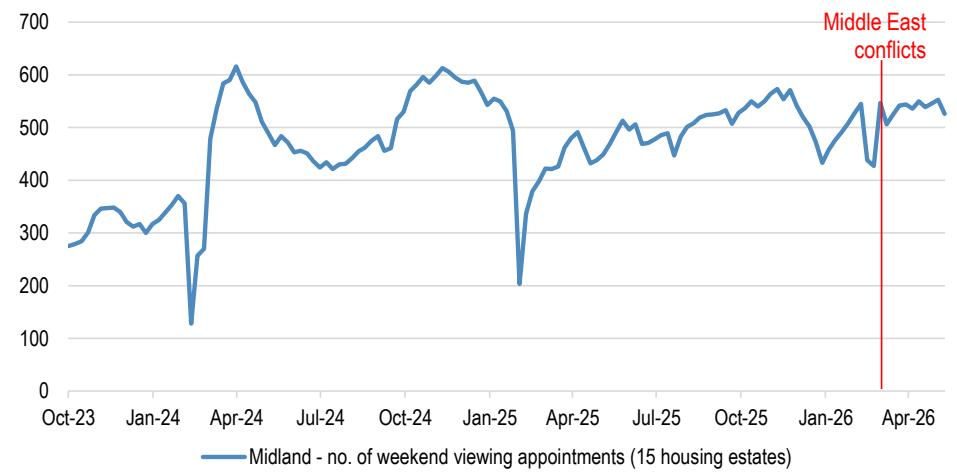

line

| Date    | Midland - no. of weekend viewing appointments (15 housing estates) |
|---------|------------------------------------------------------------------------|
| Oct-23  | ~280                                                                   |
| Jan-24  | ~350                                                                   |
| Apr-24  | ~620                                                                   |
| Jul-24  | ~450                                                                   |
| Oct-24  | ~600                                                                   |
| Jan-25  | ~550                                                                   |
| Apr-25  | ~450                                                                   |
| Jul-25  | ~500                                                                   |
| Oct-25  | ~550                                                                   |
| Jan-26  | ~450                                                                   |
| Apr-26  | ~550                                                                   |

Source: Similarweb, Midland, Centraline, JPM.

Figure 8: Centraline – No. of secondary listings (for sale)   
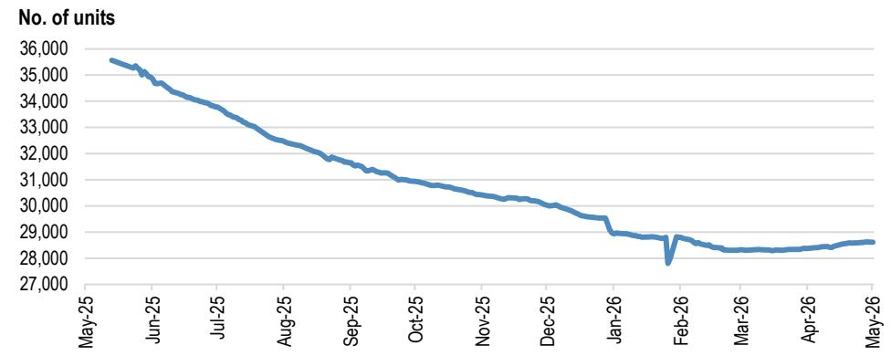

line

| Month   | No. of units |
| ------- | ------------ |
| May-25  | 35,500       |
| Jun-25  | 34,500       |
| Jul-25  | 33,500       |
| Aug-25  | 32,500       |
| Sep-25  | 31,500       |
| Oct-25  | 31,000       |
| Nov-25  | 30,500       |
| Dec-25  | 30,000       |
| Jan-26  | 29,000       |
| Feb-26  | 28,000       |
| Mar-26  | 28,000       |
| Apr-26  | 28,000       |
| May-26  | 28,500       |

Source: Similarweb, Centraline, JPM.

Figure 9: Hong Kong weekly secondary transactions in 35 major estates   
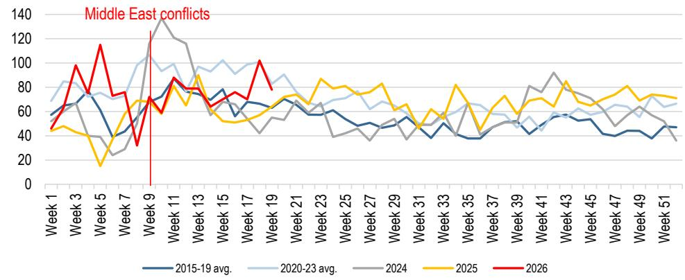

line

| Week | 2015-19 avg. | 2020-23 avg. | 2024 | 2025 | 2026 |
|------|--------------|--------------|------|------|------|
| Week 1 | ~60 | ~70 | ~65 | ~50 | ~55 |
| Week 3 | ~70 | ~80 | ~75 | ~45 | ~100 |
| Week 5 | ~50 | ~70 | ~40 | ~15 | ~115 |
| Week 7 | ~40 | ~60 | ~30 | ~30 | ~75 |
| Week 9 | ~65 | ~110 | ~130 | ~60 | ~60 |
| Week 11 | ~70 | ~90 | ~120 | ~85 | ~85 |
| Week 13 | ~75 | ~85 | ~90 | ~70 | ~75 |
| Week 15 | ~70 | ~80 | ~75 | ~65 | ~70 |
| Week 17 | ~65 | ~75 | ~60 | ~55 | ~75 |
| Week 19 | ~60 | ~70 | ~55 | ~60 | ~80 |
| Week 21 | ~65 | ~75 | ~65 | ~70 | ~75 |
| Week 23 | ~60 | ~70 | ~60 | ~85 | ~70 |
| Week 25 | ~55 | ~65 | ~55 | ~80 | ~65 |
| Week 27 | ~50 | ~60 | ~40 | ~85 | ~60 |
| Week 29 | ~45 | ~55 | ~45 | ~80 | ~55 |
| Week 31 | ~40 | ~50 | ~40 | ~75 | ~50 |
| Week 33 | ~45 | ~55 | ~50 | ~80 | ~45 |
| Week 35 | ~40 | ~50 | ~45 | ~75 | ~40 |
| Week 37 | ~45 | ~55 | ~50 | ~70 | ~45 |
| Week 39 | ~40 | ~50 | ~45 | ~65 | ~40 |
| Week 41 | ~45 | ~55 | ~60 | ~70 | ~45 |
| Week 43 | ~50 | ~60 | ~85 | ~80 | ~40 |
| Week 45 | ~45 | ~55 | ~70 | ~75 | ~35 |
| Week 47 | ~40 | ~50 | ~65 | ~70 | ~30 |
| Week 49 | ~35 | ~45 | ~60 | ~75 | ~25 |
| Week 51 | ~30 | ~40 | ~35 | ~70 | ~20 |

Source: Midland.

Figure 10: Hong Kong secondary home prices (Centa-city Leading Index, or CCL)   
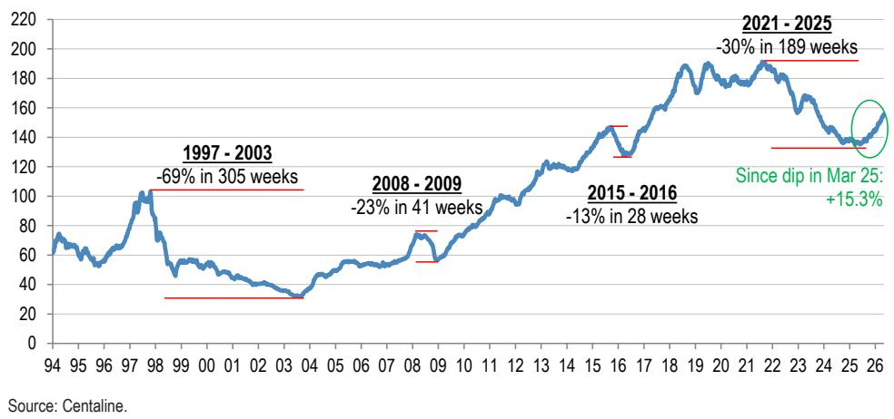

line

| Period       | Value | Change     |
| ------------ | ----- | ---------- |
| 1997 - 2003 | 100   | -69% in 305 weeks |
| 2008 - 2009 | 60    | -23% in 41 weeks |
| 2015 - 2016 | 140   | -13% in 28 weeks |
| 2021 - 2025 | 189   | -30% in 189 weeks |
| Since dip    | 140   | +15.3%     |

Figure 11: Centa Valuation Index (CVI) vs. secondary home prices (CCL) 1m rolling W/W

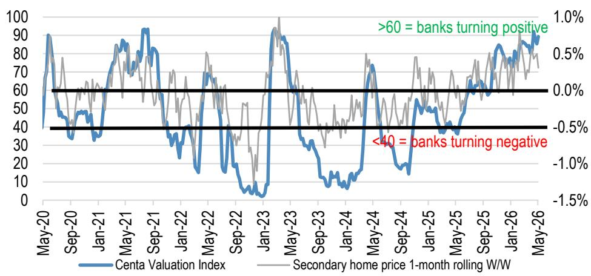

line

| Date    | Centa Valuation Index | Secondary home price 1-month rolling W/W |
|---------|------------------------|------------------------------------------|
| May-20  | ~90                    | ~0.5%                                    |
| Sep-20  | ~45                    | ~0.0%                                    |
| Jan-21  | ~35                    | ~-0.5%                                   |
| May-21  | ~85                    | ~0.5%                                    |
| Sep-21  | ~95                    | ~0.0%                                    |
| Jan-22  | ~30                    | ~-0.5%                                   |
| May-22  | ~70                    | ~0.0%                                    |
| Sep-22  | ~15                    | ~-0.5%                                   |
| Jan-23  | ~5                     | ~-1.0%                                   |
| May-23  | ~95                    | ~0.5%                                    |
| Sep-23  | ~30                    | ~-0.5%                                   |
| Jan-24  | ~10                    | ~-1.0%                                   |
| May-24  | ~75                    | ~0.5%                                    |
| Sep-24  | ~15                    | ~-0.5%                                   |
| Jan-25  | ~50                    | ~0.0%                                    |
| May-25  | ~35                    | ~-0.5%                                   |
| Sep-25  | ~60                    | ~0.5%                                    |
| Jan-26  | ~85                    | ~0.0%                                    |
| May-26  | ~90                    | ~0.5%                                    |

Source: Centraline.

Table 3: Hong Kong secondary home price index (Centa-City Leading Index) 

<table><tr><td rowspan="2">Week ending</td><td colspan="2">Overall CCL</td><td colspan="2">Mass CCL</td><td colspan="2">HK Island</td><td colspan="2">Kowloon</td><td colspan="2">NT East</td><td colspan="2">NT West</td></tr><tr><td>Index</td><td>W/W</td><td>Index</td><td>W/W</td><td>Index</td><td>W/W</td><td>Index</td><td>W/W</td><td>Index</td><td>W/W</td><td>Index</td><td>W/W</td></tr><tr><td>15-Mar-26</td><td>151.05</td><td>0.5%↑</td><td>152.76</td><td>0.6%↑</td><td>152.10</td><td>-0.4%↓</td><td>151.57</td><td>0.8%↑</td><td>163.97</td><td>1.2%↑</td><td>138.13</td><td>0.9%↑</td></tr><tr><td>22-Mar-26</td><td>150.88</td><td>-0.1%↓</td><td>152.44</td><td>-0.2%↓</td><td>153.48</td><td>0.9%↑</td><td>150.02</td><td>-1.0%↓</td><td>164.34</td><td>0.2%↓</td><td>137.43</td><td>-0.5%↓</td></tr><tr><td>29-Mar-26</td><td>152.17</td><td>0.9%↑</td><td>153.83</td><td>0.9%↑</td><td>154.51</td><td>0.7%↓</td><td>151.13</td><td>0.7%↑</td><td>165.23</td><td>0.5%↑</td><td>139.81</td><td>1.7%↑</td></tr><tr><td>5-Apr-26</td><td>153.68</td><td>1.0%↑</td><td>154.84</td><td>0.7%↓</td><td>155.03</td><td>0.3%↓</td><td>152.00</td><td>0.6%↓</td><td>169.18</td><td>2.4%↑</td><td>139.49</td><td>-0.2%↓</td></tr><tr><td>12-Apr-26</td><td>153.67</td><td>0.0%↓</td><td>154.76</td><td>-0.1%↓</td><td>154.91</td><td>-0.1%↓</td><td>152.71</td><td>0.5%↓</td><td>166.08</td><td>-1.8%↓</td><td>140.34</td><td>0.6%↑</td></tr><tr><td>19-Apr-26</td><td>153.72</td><td>0.0%↑</td><td>155.45</td><td>0.4%↑</td><td>155.56</td><td>0.4%↑</td><td>152.47</td><td>-0.2%↓</td><td>169.03</td><td>1.8%↑</td><td>140.86</td><td>0.4%↓</td></tr><tr><td>26-Apr-26</td><td>155.20</td><td>1.0%↑</td><td>156.79</td><td>0.9%↑</td><td>159.85</td><td>2.8%↑</td><td>154.13</td><td>1.1%↑</td><td>170.40</td><td>0.8%↓</td><td>138.75</td><td>-1.5%↓</td></tr><tr><td>3-May-26</td><td>155.58</td><td>0.2%↓</td><td>157.48</td><td>0.4%↓</td><td>159.72</td><td>-0.1%↓</td><td>154.74</td><td>0.4%↓</td><td>171.06</td><td>0.4%↓</td><td>140.35</td><td>1.2%↑</td></tr><tr><td>vs. 21 peak</td><td></td><td>-18.7%</td><td></td><td>-18.6%</td><td></td><td>-19.7%</td><td></td><td>-18.5%</td><td></td><td>-17.9%</td><td></td><td>-21.7%</td></tr></table>

Source: Centraline.

Figure 12: Centa-Salesman Index (CSI) vs. secondary home prices (CCL)   
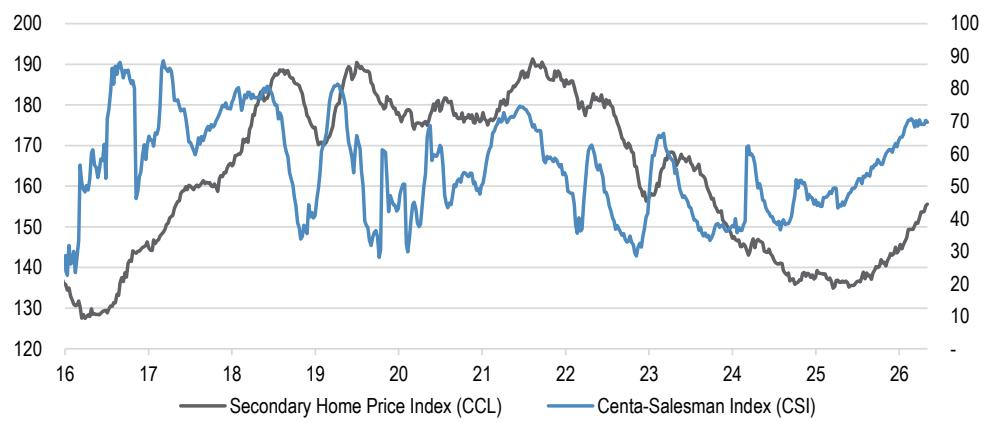

line

| Year | Secondary Home Price Index (CCL) | Centa-Salesman Index (CSI) |
|------|----------------------------------|---------------------------|
| 16   | 130                              | 140                       |
| 17   | 150                              | 190                       |
| 18   | 160                              | 180                       |
| 19   | 170                              | 150                       |
| 20   | 180                              | 140                       |
| 21   | 175                              | 160                       |
| 22   | 185                              | 170                       |
| 23   | 160                              | 140                       |
| 24   | 140                              | 150                       |
| 25   | 130                              | 140                       |
| 26   | 150                              | 170                       |

Source: Centraline. Note: Centa-Salesman Index (CSI) is a weekly sentiment survey that measures market confidence and sentiment based on feedback from Centraline's salesforce. A reading above 50 suggests property prices are likely to rise in the future.

# 5. Hong Kong – Tourist arrivals and resident departures

Table 4: Hong Kong weekly tourist arrivals and resident departures 

<table><tr><td rowspan="2">Week ending</td><td colspan="5">Total tourist arrivals</td><td colspan="5">HK resident departure</td></tr><tr><td>No. of people</td><td>W/W</td><td colspan="2">4-week rolling W/W</td><td>Y/Y</td><td>No. of people</td><td>W/W</td><td colspan="2">4-week rolling W/W</td><td>Y/Y</td></tr><tr><td>22-Mar-26</td><td>1,029,479</td><td>4%</td><td>↑</td><td>-9%</td><td>↓</td><td>12%</td><td>↑</td><td>2,416,582</td><td>1%</td><td>↑</td></tr><tr><td>29-Mar-26</td><td>1,085,155</td><td>5%</td><td>↑</td><td>0%</td><td>↑</td><td>23%</td><td>↑</td><td>2,540,445</td><td>5%</td><td>↑</td></tr><tr><td>5-Apr-26</td><td>911,533</td><td>-16%</td><td>↓</td><td>1%</td><td>↑</td><td>-2%</td><td>↓</td><td>3,431,806</td><td>35%</td><td>↑</td></tr><tr><td>12-Apr-26</td><td>880,536</td><td>-3%</td><td>↑</td><td>-3%</td><td>↓</td><td>-1%</td><td>↑</td><td>2,363,101</td><td>-31%</td><td>↓</td></tr><tr><td>19-Apr-26</td><td>1,233,283</td><td>40%</td><td>↑</td><td>5%</td><td>↑</td><td>42%</td><td>↑</td><td>2,665,198</td><td>13%</td><td>↑</td></tr><tr><td>26-Apr-26</td><td>997,437</td><td>-19%</td><td>↓</td><td>-2%</td><td>↓</td><td>15%</td><td>↓</td><td>2,343,631</td><td>-12%</td><td>↓</td></tr><tr><td>3-May-26</td><td>1,407,354</td><td>41%</td><td>↑</td><td>12%</td><td>↑</td><td>2%</td><td>↓</td><td>2,356,758</td><td>1%</td><td>↑</td></tr><tr><td>10-May-26</td><td>953,814</td><td>-32%</td><td>↓</td><td>2%</td><td>↓</td><td>21%</td><td>↑</td><td>2,284,671</td><td>-3%</td><td>↓</td></tr></table>

Source: CEIC, HK Immigration Department.

Figure 13: Hong Kong seven-day rolling average total tourist arrivals minus resident departures   
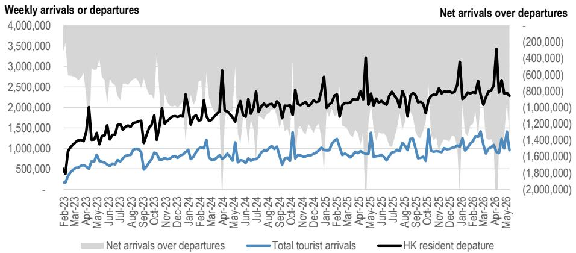  
Source: CEIC, HK Immigration Department.

# 6. Share price update

Figure 14: Mainland China Property – Weekly share price performance (%)   
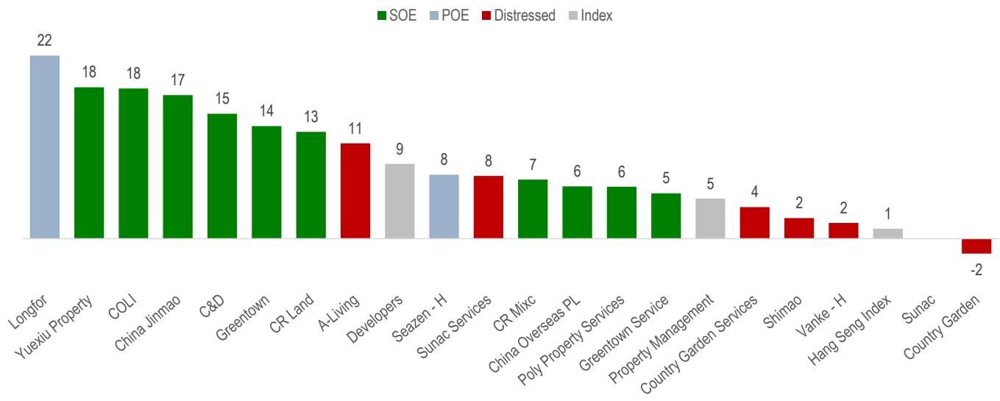

bar

| Company | SOE | POE | Distressed | Index |
| :--- | :--- | :--- | :--- | :--- |
| Longfor | 22 | 22 | 0 | 0 |
| Yuexiu Property | 18 | 0 | 0 | 0 |
| COLI | 18 | 0 | 0 | 0 |
| China Jinmao | 17 | 0 | 0 | 0 |
| C&D | 15 | 0 | 0 | 0 |
| Greentown | 14 | 0 | 0 | 0 |
| CR Land | 13 | 0 | 0 | 0 |
| A-Living | 11 | 0 | 11 | 0 |
| Developers | 9 | 0 | 0 | 0 |
| Seazen - H | 8 | 0 | 8 | 0 |
| Sunac Services | 8 | 0 | 8 | 0 |
| CR Mixc | 7 | 0 | 0 | 0 |
| China Overseas PL | 6 | 0 | 0 | 0 |
| Poly Property Services | 6 | 0 | 0 | 0 |
| Greentown Service | 5 | 0 | 0 | 0 |
| Property Management | 5 | 0 | 0 | 0 |
| Country Garden Services | 4 | 0 | 4 | 0 |
| Shimao | 2 | 0 | 2 | 0 |
| Vanke - H | 2 | 0 | 2 | 1 |
| Hang Seng Index | 1 | 0 | 1 | 0 |
| Sunac | -2 | 0 | -2 | -2 |
| Country Garden | -2 | -2 | -2 | -2 |

Source: Bloomberg Finance L.P., JPM. Note: As of close on 11 May 2026. Past performance is not an indicator of future results.

Figure 15: Hong Kong Property & Conglomerates – Weekly share price performance (%)   
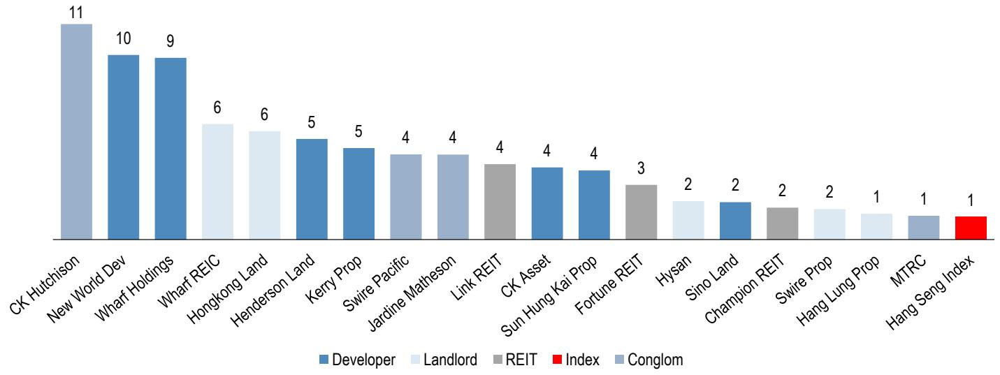

bar

| Company | Value |
| :--- | :--- |
| CK Hutchison | 11 |
| New World Dev | 10 |
| Wharf Holdings | 9 |
| Wharf REIC | 6 |
| Hongkong Land | 6 |
| Henderson Land | 5 |
| Kerry Prop | 5 |
| Swire Pacific | 4 |
| Jardine Matheson | 4 |
| Link REIT | 4 |
| CK Asset | 4 |
| Sun Hung Kai Prop | 4 |
| Fortune REIT | 3 |
| Hysan | 2 |
| Sino Land | 2 |
| Champion REIT | 2 |
| Swire Prop | 2 |
| Hang Lung Prop | 1 |
| MTRC | 1 |
| Hang Seng Index | 1 |

Source: Bloomberg Finance L.P., JPM. Note: As of close on 11 May 2026. Past performance is not an indicator of future results.

Figure 16: Mainland China / Hong Kong Property & Conglomerates – Weekly share price performance by company type   
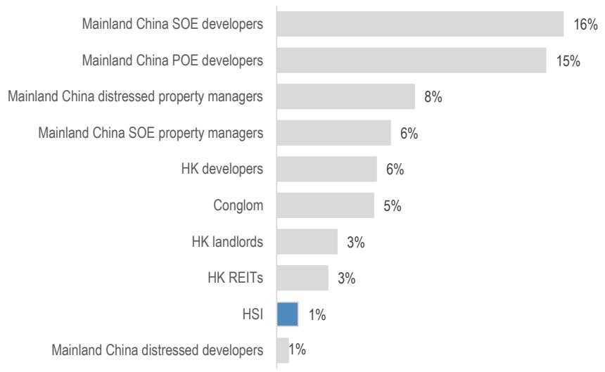

bar

| Category | Value (%) |
|---|---|
| Mainland China SOE developers | 16 |
| Mainland China POE developers | 15 |
| Mainland China distressed property managers | 8 |
| Mainland China SOE property managers | 6 |
| HK developers | 6 |
| Conglom | 5 |
| HK landlords | 3 |
| HK REITs | 3 |
| HSI | 1 |
| Mainland China distressed developers | 1 |

Source: Bloomberg Finance L.P. Note: Share price from close of 4 May 2026 to 11 May 2026. Past performance is not an indicator of future results.

Figure 17: Short interest in Mainland China / Hong Kong Property – 30-day moving average   
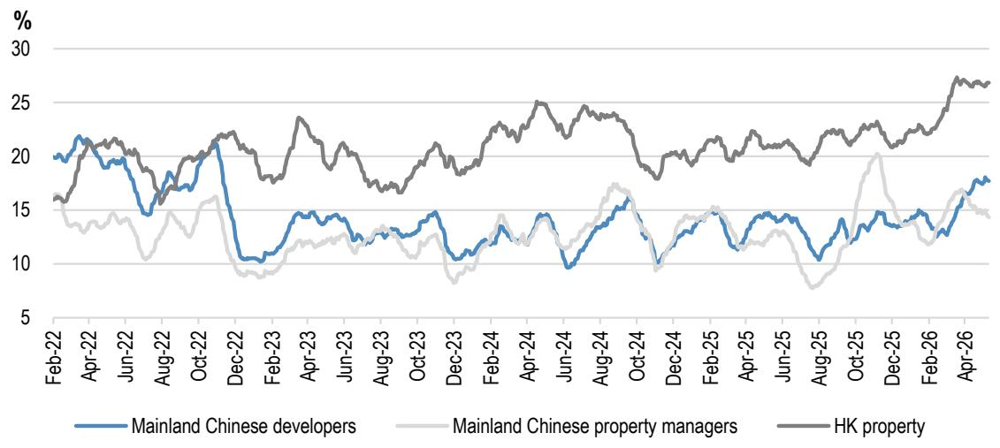

line

| Date    | Mainland Chinese developers | Mainland Chinese property managers | HK property |
|---------|-----------------------------|------------------------------------|-----------|
| Feb-22  | ~20                         | ~14                                | ~16       |
| Apr-22  | ~21                         | ~13                                | ~18       |
| Jun-22  | ~19                         | ~12                                | ~17       |
| Aug-22  | ~15                         | ~10                                | ~16       |
| Oct-22  | ~18                         | ~15                                | ~20       |
| Dec-22  | ~10                         | ~9                                 | ~18       |
| Feb-23  | ~14                         | ~11                                | ~19       |
| Apr-23  | ~15                         | ~12                                | ~23       |
| Jun-23  | ~13                         | ~11                                | ~19       |
| Aug-23  | ~13                         | ~10                                | ~17       |
| Oct-23  | ~14                         | ~11                                | ~18       |
| Dec-23  | ~10                         | ~8                                 | ~19       |
| Feb-24  | ~13                         | ~10                                | ~22       |
| Apr-24  | ~14                         | ~12                                | ~25       |
| Jun-24  | ~10                         | ~10                                | ~24       |
| Aug-24  | ~15                         | ~17                                | ~23       |
| Oct-24  | ~10                         | ~9                                 | ~18       |
| Dec-24  | ~13                         | ~10                                | ~20       |
| Feb-25  | ~14                         | ~12                                | ~21       |
| Apr-25  | ~13                         | ~13                                | ~20       |
| Jun-25  | ~14                         | ~10                                | ~19       |
| Aug-25  | ~10                         | ~7                                 | ~20       |
| Oct-25  | ~13                         | ~10                                | ~22       |
| Dec-25  | ~14                         | ~15                                | ~23       |
| Feb-26  | ~15                         | ~13                                | ~24       |
| Apr-26  | ~18                         | ~15                                | ~27       |

Source: Bloomberg Finance L.P., JPM.

Table 5: Mainland China / Hong Kong Property – Southbound holdings as a % of free float (W/W change) 

<table><tr><td colspan="3">Southbound holding as % of free float</td></tr><tr><td colspan="2">Mainland China Developers</td><td>W/W change</td></tr><tr><td>China Resources Land</td><td>1109 HK</td><td>-0.12%</td></tr><tr><td>China Overseas Land</td><td>688 HK</td><td>0.27%</td></tr><tr><td>China Jinmao</td><td>817 HK</td><td>-0.20%</td></tr><tr><td>C&amp;D International</td><td>1908 HK</td><td>0.30%</td></tr><tr><td>Greentown China</td><td>3900 HK</td><td>0.32%</td></tr><tr><td>Yuexiu Property</td><td>123 HK</td><td>0.75%</td></tr><tr><td>Longfor</td><td>960 HK</td><td>-0.87%</td></tr><tr><td>Country Garden</td><td>2007 HK</td><td>0.29%</td></tr><tr><td>Sunac China</td><td>1918 HK</td><td>-0.61%</td></tr><tr><td>Shimao</td><td>813 HK</td><td>0.00%</td></tr><tr><td colspan="2">Mainland China Developers Avg.</td><td>0.01%</td></tr><tr><td colspan="2">Mainland China Property Management</td><td>W/W change</td></tr><tr><td>China Resources Mixc</td><td>1209 HK</td><td>0.19%</td></tr><tr><td>China Overseas PL</td><td>2669 HK</td><td>-0.68%</td></tr><tr><td>Poly Property Services</td><td>6049 HK</td><td>-0.29%</td></tr><tr><td>Greentown Service</td><td>2869 HK</td><td>0.35%</td></tr><tr><td>Country Garden Services</td><td>6098 HK</td><td>-0.19%</td></tr><tr><td>A-Living</td><td>3319 HK</td><td>-0.20%</td></tr><tr><td>Sunac Services</td><td>1516 HK</td><td>-0.14%</td></tr><tr><td colspan="2">Property Management Avg.</td><td>-0.13%</td></tr><tr><td colspan="2">Hong Kong Property / Conglomerates</td><td>W/W change</td></tr><tr><td>SHKP</td><td>16 HK</td><td>0.01%</td></tr><tr><td>CK Asset</td><td>1113 HK</td><td>-0.06%</td></tr><tr><td>Henderson Land</td><td>12 HK</td><td>0.26%</td></tr><tr><td>Sino Land</td><td>83 HK</td><td>0.01%</td></tr><tr><td>New World Dev</td><td>17 HK</td><td>0.09%</td></tr><tr><td>Wharf Holdings</td><td>4 HK</td><td>0.00%</td></tr><tr><td>Kerry Prop</td><td>683 HK</td><td>0.02%</td></tr><tr><td>Swire Prop</td><td>1972 HK</td><td>0.03%</td></tr><tr><td>Wharf REIC</td><td>1997 HK</td><td>0.01%</td></tr><tr><td>Hang Lung Prop</td><td>101 HK</td><td>0.49%</td></tr><tr><td>Hysan</td><td>14 HK</td><td>0.07%</td></tr><tr><td>CK Hutchison</td><td>1 HK</td><td>0.00%</td></tr><tr><td>Swire Pac</td><td>19 HK</td><td>0.01%</td></tr><tr><td>MTRC</td><td>66 HK</td><td>0.00%</td></tr><tr><td colspan="2">HK Property / Conglom Avg.</td><td>0.07%</td></tr></table>

Source: Bloomberg Finance L.P., HKEx. As of 7 May 2026.

Figure 18: HK property average southbound holdings as a % of free float   
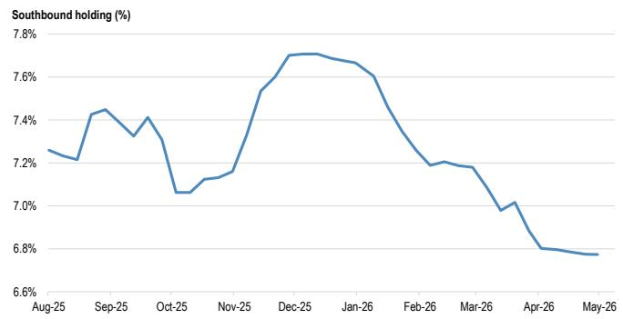

line

| Month   | Southbound holding (%) |
| ------- | ---------------------- |
| Aug-25  | 7.2%                   |
| Sep-25  | 7.4%                   |
| Oct-25  | 7.1%                   |
| Nov-25  | 7.2%                   |
| Dec-25  | 7.7%                   |
| Jan-26  | 7.6%                   |
| Feb-26  | 7.2%                   |
| Mar-26  | 7.1%                   |
| Apr-26  | 6.9%                   |
| May-26  | 6.8%                   |

Source: HKEx, Bloomberg Finance L.P.

# 7. Credit recommendations

Table 6: China Property Credit Recommendations 

<table><tr><td>Issuer</td><td>Instrument</td><td>Credit rating (M/S/F)</td><td>JPM rating</td><td>Maturity</td><td>Price</td><td>Coupon</td><td>YTM</td><td>Z-spd (bps)</td><td>SOT (bps)</td><td>Dur</td></tr><tr><td rowspan="4">Longfor</td><td>LNGFOR &#x27;27</td><td>B2/B+/BB-</td><td>OW</td><td>4/13/2027</td><td>95.2</td><td>3.38%</td><td>9.0%</td><td>471</td><td>505</td><td>0.9</td></tr><tr><td>LNGFOR &#x27;28</td><td>B2/NA/BB-</td><td>OW</td><td>1/16/2028</td><td>92.8</td><td>4.50%</td><td>9.2%</td><td>518</td><td>531</td><td>1.5</td></tr><tr><td>LNGFOR &#x27;29</td><td>B2/B+/BB-</td><td>OW</td><td>9/16/2029</td><td>83.5</td><td>3.95%</td><td>9.9%</td><td>595</td><td>590</td><td>3.0</td></tr><tr><td>LNGFOR &#x27;32</td><td>B2/B+/BB-</td><td>OW</td><td>1/13/2032</td><td>73.0</td><td>3.85%</td><td>10.2%</td><td>629</td><td>619</td><td>4.7</td></tr><tr><td>Seazen</td><td>FUTLAN &#x27;28</td><td>NA/B-/NA</td><td>N</td><td>6/26/2028</td><td>98.8</td><td>11.88%</td><td>13.0%</td><td>877</td><td>912</td><td>1.0</td></tr><tr><td rowspan="2">Vanke</td><td>VNKRLE &#x27;27</td><td>C/CCC-/C</td><td>N</td><td>11/9/2027</td><td>43.9</td><td>3.98%</td><td>70.8%</td><td>6595</td><td>6687</td><td>1.1</td></tr><tr><td>VNKRLE &#x27;29</td><td>C/CCC-/C</td><td>N</td><td>11/12/2029</td><td>41.1</td><td>3.50%</td><td>33.2%</td><td>2900</td><td>2928</td><td>2.7</td></tr><tr><td>Greentown</td><td>GRNCH &#x27;28</td><td>B1/NA/NA</td><td>N</td><td>2/24/2028</td><td>101.7</td><td>8.45%</td><td>7.4%</td><td>310</td><td>345</td><td>0.7</td></tr><tr><td>Jinmao</td><td>CHJMAO &#x27;29</td><td>Ba3/NA/NA</td><td>N</td><td>7/23/2029</td><td>93.1</td><td>4.25%</td><td>6.7%</td><td>276</td><td>274</td><td>2.9</td></tr><tr><td>CR Land</td><td>CRHZCH &#x27;29</td><td>Baa1/BBB+/NA</td><td>N</td><td>2/26/2029</td><td>98.6</td><td>4.13%</td><td>4.7%</td><td>85</td><td>73</td><td>2.6</td></tr><tr><td rowspan="4">COLI</td><td>CHIOLI &#x27;28</td><td>Baa2/A-/A-</td><td>N</td><td>4/26/2028</td><td>100.1</td><td>4.75%</td><td>4.7%</td><td>85</td><td>76</td><td>1.8</td></tr><tr><td>CHIOLI &#x27;30</td><td>Baa2/NA/A-</td><td>N</td><td>3/2/2030</td><td>92.7</td><td>2.75%</td><td>4.9%</td><td>106</td><td>83</td><td>3.5</td></tr><tr><td>CHIOLI &#x27;35</td><td>Baa2/NA/A-</td><td>N</td><td>3/2/2035</td><td>84.8</td><td>3.13%</td><td>5.3%</td><td>132</td><td>92</td><td>7.4</td></tr><tr><td>CHIOLI &#x27;43</td><td>Baa2/A-/A-</td><td>N</td><td>10/29/2043</td><td>104.8</td><td>6.38%</td><td>5.9%</td><td>169</td><td>97</td><td>10.6</td></tr></table>

Source: Bloomberg Finance L.P., JPM. As of 11 May 2026.

Figure 19: JACI China HY Property Index: Performance since 2026 (January 2026 = 100)   
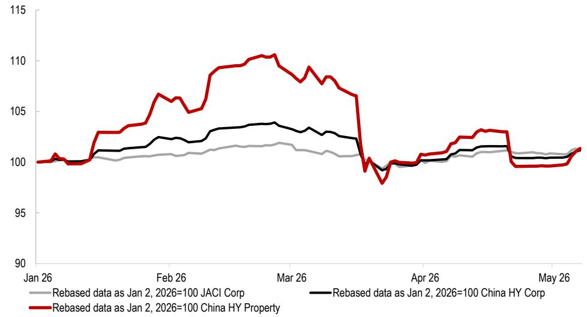

line

| Date   | Rebased data as Jan 2, 2026=100 JACI Corp | Rebased data as Jan 2, 2026=100 China HY Corp | Rebased data as Jan 2, 2026=100 China HY Property |
|--------|------------------------------------------|-----------------------------------------------|--------------------------------------------------|
| Jan 26 | 100                                      | 100                                           | 100                                              |
| Feb 26 | ~101                                     | ~103                                          | ~107                                             |
| Mar 26 | ~102                                     | ~104                                          | ~110                                             |
| Apr 26 | ~101                                     | ~101                                          | ~100                                             |
| May 26 | ~101                                     | ~101                                          | ~101                                             |

Source: JPM.

# 8. Equity valuation summary

Table 7: Mainland China Property – Valuation summary 

<table><tr><td rowspan="2">Company</td><td rowspan="2">Stock Code</td><td rowspan="2">JPM Rating</td><td rowspan="2">Last Close (HK$)</td><td rowspan="2">Market Cap US$M</td><td rowspan="2">ADV US$M</td><td colspan="2">P/E</td><td colspan="2">Dvd Yield</td><td colspan="2">P/B</td><td colspan="4">Share price return</td></tr><tr><td>1FY (x)</td><td>2FY (x)</td><td>1FY (%)</td><td>2FY (%)</td><td>1FY (x)</td><td>2FY (x)</td><td>5D</td><td>YTD</td><td>1Y</td><td>vs. AT high</td></tr><tr><td colspan="6">Mainland China Developers</td><td colspan="10"></td></tr><tr><td>China Resources Land</td><td>1109.HK</td><td>OW</td><td>38.40</td><td>34,976</td><td>68.9</td><td>11.1</td><td>11.0</td><td>3.3%</td><td>3.4%</td><td>0.8</td><td>0.7</td><td>16%</td><td>41%</td><td>59%</td><td>-1%</td></tr><tr><td>China Overseas Land</td><td>0688.HK</td><td>OW</td><td>16.37</td><td>22,885</td><td>42.2</td><td>13.0</td><td>11.8</td><td>2.8%</td><td>3.1%</td><td>0.4</td><td>0.4</td><td>19%</td><td>34%</td><td>29%</td><td>-28%</td></tr><tr><td>China Jinmao</td><td>0817.HK</td><td>OW</td><td>2.00</td><td>3,452</td><td>8.1</td><td>31.4</td><td>25.0</td><td>1.7%</td><td>1.8%</td><td>0.6</td><td>0.6</td><td>19%</td><td>65%</td><td>87%</td><td>-58%</td></tr><tr><td>C&amp;D International</td><td>1908.HK</td><td>NC</td><td>17.55</td><td>5,022</td><td>11.7</td><td>9.3</td><td>8.6</td><td>5.9%</td><td>6.4%</td><td>0.9</td><td>0.9</td><td>17%</td><td>12%</td><td>24%</td><td>-21%</td></tr><tr><td>Greentown China</td><td>3900.HK</td><td>NC</td><td>10.99</td><td>3,565</td><td>13.1</td><td>59.6</td><td>27.0</td><td>1.4%</td><td>3.1%</td><td>0.7</td><td>0.7</td><td>14%</td><td>30%</td><td>22%</td><td>-30%</td></tr><tr><td>Yuexiu Property</td><td>123.HK</td><td>NC</td><td>4.65</td><td>2,391</td><td>5.4</td><td>40.8</td><td>20.5</td><td>2.0%</td><td>3.6%</td><td>0.3</td><td>0.3</td><td>19%</td><td>17%</td><td>3%</td><td>-57%</td></tr><tr><td>Poly Property</td><td>119.HK</td><td>NC</td><td>2.46</td><td>1,201</td><td>4.3</td><td>31.9</td><td>13.4</td><td>1.2%</td><td>3.9%</td><td>0.3</td><td>0.3</td><td>27%</td><td>23%</td><td>71%</td><td>-65%</td></tr><tr><td colspan="5">SOEs</td><td>48.0</td><td>16.2</td><td>12.9</td><td>3.1%</td><td>3.4%</td><td>0.6</td><td>0.6</td><td>17%</td><td>36%</td><td>45%</td><td>-18%</td></tr><tr><td>Longfor</td><td>0960.HK</td><td>OW</td><td>9.92</td><td>8,993</td><td>18.7</td><td>-</td><td>-</td><td>0.0%</td><td>0.7%</td><td>0.4</td><td>0.4</td><td>22%</td><td>17%</td><td>1%</td><td>-76%</td></tr><tr><td>Seazen Group</td><td>1030.HK</td><td>N</td><td>2.38</td><td>2,208</td><td>5.7</td><td>-</td><td>-</td><td>-</td><td>-</td><td>0.3</td><td>0.3</td><td>8%</td><td>16%</td><td>28%</td><td>-76%</td></tr><tr><td colspan="5">POEs</td><td>16.1</td><td>-</td><td>-</td><td>0.0%</td><td>0.6%</td><td>0.4</td><td>0.4</td><td>19%</td><td>17%</td><td>6%</td><td>-76%</td></tr><tr><td>China Vanke - H</td><td>2202.HK</td><td>UW</td><td>3.22</td><td>6,759</td><td>11.7</td><td>-</td><td>-</td><td>-</td><td>-</td><td>0.4</td><td>0.5</td><td>2%</td><td>-2%</td><td>-39%</td><td>-90%</td></tr><tr><td>Country Garden</td><td>2007.HK</td><td>UW</td><td>0.28</td><td>1,596</td><td>12.9</td><td>-</td><td>-</td><td>-</td><td>-</td><td>-</td><td>-</td><td>-2%</td><td>-34%</td><td>-34%</td><td>-98%</td></tr><tr><td>Sunac China</td><td>1918.HK</td><td>UW</td><td>1.16</td><td>2,471</td><td>25.3</td><td>-</td><td>-</td><td>-</td><td>-</td><td>0.6</td><td>1.3</td><td>0%</td><td>-11%</td><td>-19%</td><td>-97%</td></tr><tr><td>Shimao</td><td>0813.HK</td><td>UW</td><td>0.17</td><td>207</td><td>0.8</td><td>-</td><td>-</td><td>-</td><td>-</td><td>-</td><td>-</td><td>2%</td><td>-13%</td><td>-80%</td><td>-100%</td></tr><tr><td>Agile</td><td>3383.HK</td><td>NC</td><td>0.26</td><td>164</td><td>0.1</td><td>-</td><td>-</td><td>-</td><td>-</td><td>-</td><td>-</td><td>2%</td><td>-6%</td><td>-43%</td><td>-98%</td></tr><tr><td>Logan</td><td>3380.HK</td><td>NC</td><td>1.28</td><td>930</td><td>1.0</td><td>-</td><td>-</td><td>-</td><td>-</td><td>-</td><td>-</td><td>1%</td><td>-28%</td><td>56%</td><td>-90%</td></tr><tr><td>CIFI</td><td>884.HK</td><td>NC</td><td>0.07</td><td>161</td><td>1.0</td><td>-</td><td>-</td><td>-</td><td>-</td><td>-</td><td>-</td><td>1%</td><td>-57%</td><td>-65%</td><td>-99%</td></tr><tr><td>R&amp;F</td><td>2777.HK</td><td>NC</td><td>0.41</td><td>194</td><td>0.4</td><td>-</td><td>-</td><td>-</td><td>-</td><td>-</td><td>-</td><td>13%</td><td>-21%</td><td>-58%</td><td>-98%</td></tr><tr><td colspan="5">Distressed</td><td>13.1</td><td>-</td><td>-</td><td>-</td><td>-</td><td>0.3</td><td>0.5</td><td>1%</td><td>-11%</td><td>-28%</td><td>-93%</td></tr><tr><td colspan="6">Mainland China Developers (Overall HK Listed)</td><td>12.3</td><td>9.7</td><td>2.3%</td><td>2.7%</td><td>0.6</td><td>0.6</td><td>15%</td><td>28%</td><td>31%</td><td>-34%</td></tr><tr><td colspan="16">Mainland China Property Management</td></tr><tr><td>China Resources Mixc</td><td>1209.HK</td><td>OW</td><td>50.15</td><td>14,621</td><td>17.2</td><td>22.7</td><td>20.4</td><td>4.4%</td><td>4.9%</td><td>6.4</td><td>6.3</td><td>7%</td><td>17%</td><td>44%</td><td>-1%</td></tr><tr><td>China Overseas PH</td><td>2669.HK</td><td>UW</td><td>4.22</td><td>1,770</td><td>4.6</td><td>9.0</td><td>9.3</td><td>5.0%</td><td>5.0%</td><td>1.8</td><td>1.6</td><td>6%</td><td>-7%</td><td>-17%</td><td>-58%</td></tr><tr><td>Poly Property Services</td><td>6049.HK</td><td>OW</td><td>33.04</td><td>2,335</td><td>3.5</td><td>9.8</td><td>9.3</td><td>5.1%</td><td>5.4%</td><td>1.4</td><td>1.3</td><td>6%</td><td>4%</td><td>11%</td><td>-60%</td></tr><tr><td>Greentown Service</td><td>2869.HK</td><td>OW</td><td>4.83</td><td>1,934</td><td>1.6</td><td>12.4</td><td>11.6</td><td>5.8%</td><td>6.2%</td><td>1.5</td><td>1.5</td><td>5%</td><td>3%</td><td>16%</td><td>-59%</td></tr><tr><td colspan="5">Backed by SOE developers</td><td>13.1</td><td>19.1</td><td>17.4</td><td>4.7%</td><td>5.1%</td><td>5.0</td><td>4.9</td><td>7%</td><td>12%</td><td>32%</td><td>-18%</td></tr><tr><td>Country Garden Services</td><td>6098.HK</td><td>N</td><td>6.56</td><td>2,729</td><td>5.6</td><td>7.5</td><td>7.4</td><td>8.0%</td><td>8.1%</td><td>0.5</td><td>0.6</td><td>4%</td><td>9%</td><td>2%</td><td>-91%</td></tr><tr><td>A-Living</td><td>3319.HK</td><td>UW</td><td>2.43</td><td>440</td><td>0.6</td><td>4.0</td><td>4.5</td><td>2.7%</td><td>2.4%</td><td>0.3</td><td>0.3</td><td>11%</td><td>7%</td><td>-13%</td><td>-94%</td></tr><tr><td>Sunac Services</td><td>1516.HK</td><td>UW</td><td>1.14</td><td>444</td><td>1.9</td><td>6.4</td><td>7.6</td><td>4.7%</td><td>2.8%</td><td>0.6</td><td>0.6</td><td>8%</td><td>-19%</td><td>-32%</td><td>-95%</td></tr><tr><td colspan="5">Backed by POE developers</td><td>4.6</td><td>6.9</td><td>7.1</td><td>7.0%</td><td>6.8%</td><td>0.5</td><td>0.5</td><td>5%</td><td>5%</td><td>-4%</td><td>-92%</td></tr><tr><td colspan="5">Property Management (Overall)</td><td>11.8</td><td>17.3</td><td>15.9</td><td>5.0%</td><td>5.3%</td><td>4.3</td><td>4.2</td><td>7%</td><td>11%</td><td>27%</td><td>-29%</td></tr></table>

Source: Company data, Bloomberg Finance L.P., JPM estimates. Note: Companies marked “NC” are not under JPM coverage; all estimates for such companies are based on consensus estimates from Bloomberg Finance L.P.

Table 8: Hong Kong Property & Conglomerates – Valuation summary 

<table><tr><td rowspan="2">Company</td><td rowspan="2">Stock Code</td><td rowspan="2">JPM Rating</td><td rowspan="2">Last Close (HK$)</td><td rowspan="2">Market Cap US$M</td><td rowspan="2">ADV US$M</td><td rowspan="2">NAV Discount</td><td colspan="2">P/E</td><td colspan="2">Dvd Yield</td><td colspan="2">P/B</td><td colspan="4">Share Price Return</td></tr><tr><td>1FY (x)</td><td>2FY (x)</td><td>1FY (%)</td><td>2FY (%)</td><td>1FY (x)</td><td>2FY (x)</td><td>5D</td><td>YTD</td><td>1Y</td><td>Peak</td></tr><tr><td colspan="7">Hong Kong Property</td><td colspan="10"></td></tr><tr><td>Sun Hung Kai Properties</td><td>0016.HK</td><td>OW</td><td>143.30</td><td>53,040</td><td>112.0</td><td>-31%</td><td>18.2</td><td>17.0</td><td>2.8%</td><td>2.9%</td><td>0.7</td><td>0.6</td><td>4%</td><td>52%</td><td>85%</td><td>-3%</td></tr><tr><td>CK Asset</td><td>1113.HK</td><td>OW</td><td>51.20</td><td>22,888</td><td>36.6</td><td>-44%</td><td>15.9</td><td>15.9</td><td>3.3%</td><td>3.3%</td><td>0.5</td><td>0.5</td><td>4%</td><td>30%</td><td>64%</td><td>-4%</td></tr><tr><td>Henderson Land</td><td>0012.HK</td><td>N</td><td>34.00</td><td>21,025</td><td>40.9</td><td>-45%</td><td>21.2</td><td>17.9</td><td>3.7%</td><td>3.7%</td><td>0.5</td><td>0.5</td><td>5%</td><td>21%</td><td>52%</td><td>-5%</td></tr><tr><td>Sino Land</td><td>0083.HK</td><td>OW</td><td>13.00</td><td>15,918</td><td>14.2</td><td>-29%</td><td>25.4</td><td>27.3</td><td>4.5%</td><td>4.5%</td><td>0.7</td><td>0.7</td><td>2%</td><td>29%</td><td>69%</td><td>-2%</td></tr><tr><td>New World Development</td><td>0017.HK</td><td>N</td><td>9.55</td><td>3,070</td><td>10.0</td><td>-52%</td><td>-14.4</td><td>-11.1</td><td>0.0%</td><td>0.0%</td><td>0.2</td><td>0.2</td><td>10%</td><td>31%</td><td>99%</td><td>-84%</td></tr><tr><td>Wharf Holdings</td><td>0004.HK</td><td>NC</td><td>28.14</td><td>10,984</td><td>7.0</td><td>-</td><td>18.7</td><td>18.0</td><td>1.5%</td><td>1.5%</td><td>0.6</td><td>0.6</td><td>9%</td><td>31%</td><td>45%</td><td>-8%</td></tr><tr><td>Kerry Properties</td><td>0683.HK</td><td>NC</td><td>25.00</td><td>4,634</td><td>5.8</td><td>-</td><td>17.8</td><td>8.4</td><td>5.4%</td><td>5.4%</td><td>0.3</td><td>0.3</td><td>5%</td><td>23%</td><td>37%</td><td>-4%</td></tr><tr><td colspan="5">Developers</td><td>60.8</td><td>-32%</td><td>18.4</td><td>17.3</td><td>3.1%</td><td>3.2%</td><td>0.6</td><td>0.6</td><td>4%</td><td>37%</td><td>70%</td><td>-6%</td></tr><tr><td>Swire Properties</td><td>1972.HK</td><td>OW</td><td>25.42</td><td>18,694</td><td>12.0</td><td>-45%</td><td>18.2</td><td>16.4</td><td>4.7%</td><td>5.0%</td><td>0.5</td><td>0.5</td><td>2%</td><td>25%</td><td>57%</td><td>-3%</td></tr><tr><td>Wharf REIC</td><td>1997.HK</td><td>N</td><td>26.00</td><td>10,083</td><td>15.0</td><td>-53%</td><td>12.5</td><td>12.5</td><td>5.0%</td><td>5.0%</td><td>0.4</td><td>0.4</td><td>6%</td><td>9%</td><td>41%</td><td>-43%</td></tr><tr><td>HK Land (in US$)</td><td>HKLD.SI</td><td>OW</td><td>8.39</td><td>18,021</td><td>24.6</td><td>-37%</td><td>39.1</td><td>37.0</td><td>3.1%</td><td>3.3%</td><td>0.6</td><td>0.6</td><td>6%</td><td>23%</td><td>73%</td><td>-6%</td></tr><tr><td>Hang Lung Properties</td><td>0101.HK</td><td>OW</td><td>9.01</td><td>5,819</td><td>11.4</td><td>-67%</td><td>14.3</td><td>13.4</td><td>5.8%</td><td>5.8%</td><td>0.3</td><td>0.3</td><td>1%</td><td>9%</td><td>55%</td><td>-54%</td></tr><tr><td>Hysan</td><td>0014.HK</td><td>NC</td><td>20.34</td><td>2,668</td><td>6.5</td><td>-</td><td>9.9</td><td>11.8</td><td>5.3%</td><td>5.3%</td><td>0.3</td><td>0.3</td><td>2%</td><td>12%</td><td>66%</td><td>-30%</td></tr><tr><td colspan="5">Landlords</td><td>16.3</td><td>-44%</td><td>23.2</td><td>21.9</td><td>4.4%</td><td>4.5%</td><td>0.5</td><td>0.5</td><td>4%</td><td>19%</td><td>59%</td><td>-18%</td></tr><tr><td>Link REIT</td><td>0823.HK</td><td>N</td><td>41.18</td><td>13,583</td><td>55.9</td><td>6%</td><td>16.4</td><td>16.9</td><td>6.1%</td><td>5.9%</td><td>0.6</td><td>0.6</td><td>4%</td><td>19%</td><td>9%</td><td>-39%</td></tr><tr><td>Fortune REIT</td><td>778.HK</td><td>NC</td><td>5.04</td><td>1,324</td><td>2.1</td><td>-</td><td>17.4</td><td>17.4</td><td>6.8%</td><td>6.8%</td><td>0.4</td><td>0.4</td><td>3%</td><td>7%</td><td>20%</td><td>-27%</td></tr><tr><td>Champion REIT</td><td>2778.HK</td><td>NC</td><td>2.44</td><td>1,912</td><td>1.0</td><td>-</td><td>19.5</td><td>19.1</td><td>5.7%</td><td>5.9%</td><td>0.4</td><td>0.4</td><td>2%</td><td>-2%</td><td>23%</td><td>-44%</td></tr><tr><td colspan="5">REITs</td><td>45.4</td><td>5%</td><td>16.8</td><td>17.2</td><td>6.1%</td><td>6.0%</td><td>0.6</td><td>0.6</td><td>4%</td><td>15%</td><td>11%</td><td>-39%</td></tr><tr><td colspan="5">Hong Kong Property (Overall)</td><td>47.5</td><td>-32%</td><td>19.6</td><td>18.5</td><td>3.7%</td><td>3.8%</td><td>0.6</td><td>0.6</td><td>4%</td><td>31%</td><td>62%</td><td>-12%</td></tr><tr><td>CK Hutchison</td><td>0001.HK</td><td>OW</td><td>72.65</td><td>35,541</td><td>70.2</td><td>-36%</td><td>9.5</td><td>11.7</td><td>4.2%</td><td>3.4%</td><td>0.5</td><td>0.5</td><td>11%</td><td>37%</td><td>71%</td><td>-9%</td></tr><tr><td>Jardine Matheson</td><td>JARD.SI</td><td>OW</td><td>71.46</td><td>20,927</td><td>27.5</td><td>-40%</td><td>12.0</td><td>11.4</td><td>3.4%</td><td>3.6%</td><td>0.7</td><td>0.7</td><td>4%</td><td>7%</td><td>59%</td><td>-11%</td></tr><tr><td>Swire Pacific</td><td>19.HK</td><td>NC</td><td>90.30</td><td>14,141</td><td>14.3</td><td>-</td><td>11.0</td><td>10.0</td><td>4.4%</td><td>4.7%</td><td>0.5</td><td>0.4</td><td>4%</td><td>48%</td><td>35%</td><td>-1%</td></tr><tr><td colspan="5">Conglomerates</td><td>46.3</td><td>-38%</td><td>10.5</td><td>11.2</td><td>4.0%</td><td>3.7%</td><td>0.5</td><td>0.5</td><td>8%</td><td>30%</td><td>60%</td><td>-8%</td></tr></table>

Source: Company data, Bloomberg Finance L.P., JPM estimates. Note: Companies marked “NC” are not under JPM coverage; all estimates for such companies are based on consensus estimates from Bloomberg Finance L.P.

Analyst Certification: The Research Analyst(s) denoted by an “AC” on the cover of this report certifies (or, where multiple Research Analysts are primarily responsible for this report, the Research Analyst denoted by an “AC” on the cover or within the document individually certifies, with respect to each security or issuer that the Research Analyst covers in this research) that: (1) all of the views expressed in this report accurately reflect the Research Analyst’s personal views about any and all of the subject securities or issuers; and (2) no part of any of the Research Analyst's compensation was, is, or will be directly or indirectly related to the specific recommendations or views expressed by the Research Analyst(s) in this report. For all Korea-based Research Analysts listed on the front cover, if applicable, they also certify, as per KOFIA requirements, that the Research Analyst’s analysis was made in good faith and that the views reflect the Research Analyst’s own opinion, without undue influence or intervention.

All authors named within this report are Research Analysts who produce independent research unless otherwise specified. In Europe, Sector Specialists (Sales and Trading) may be shown on this report as contacts but are not authors of the report or part of the Research Department.

# Important Disclosures

- Client: JPM currently has, or had within the past 12 months, the following entity(ies) as clients: Hysan Development Company or related entities.   
- Client/Investment Banking: JPM currently has, or had within the past 12 months, the following entity(ies) as investment banking clients: Hysan Development Company or related entities.   
- Client/Non-Investment Banking, Securities-Related: JPM currently has, or had within the past 12 months, the following entity(ies) as clients, and the services provided were non-investment-banking, securities-related: Hysan Development Company or related entities.   
- Investment Banking Compensation Received: JPM has received in the past 12 months compensation for investment banking services from Hysan Development Company or related entities.   
- Potential Investment Banking Compensation: JPM expects to receive, or intends to seek, compensation for investment banking services in the next three months from Hysan Development Company or related entities.   
• Non-Investment Banking Compensation Received: JPM has received compensation in the past 12 months for products or services other than investment banking from Hysan Development Company or related entities.   
- Debt Position: JPM may hold a position in the debt securities of Hysan Development Company or related entities, if any.

Company-Specific Disclosures: JPM does and seeks to do business with companies covered in its research reports. As a result, investors should be aware that the firm may have a conflict of interest that could affect the objectivity of this report. Investors should consider this report as only a single factor in making their investment decision. Important disclosures, including price charts and credit opinion history tables (if applicable), are available for compendium reports and all JPM-covered companies, and certain non-covered companies, by visiting https://www.jpmm.com/research/disclosures, calling 1-800-477-0406, or e-mailing research.disclosure.inquiries@JPM.com with your request.

# Explanation of Equity Research Ratings, Designations and Analyst(s) Coverage Universe:

JPM uses the following rating system: Overweight (over the duration of the price target indicated in this report, we expect this stock will outperform the average total return of the stocks in the Research Analyst's, or the Research Analyst's team's, coverage universe); Neutral (over the duration of the price target indicated in this report, we expect this stock will perform in line with the average total return of the stocks in the Research Analyst's, or the Research Analyst's team's, coverage universe); and Underweight (over the duration of the price target indicated in this report, we expect this stock will underperform the average total return of the stocks in the Research Analyst's, or the Research Analyst's team's, coverage universe. NR is Not Rated. In this case, JPM has removed the rating and, if applicable, the price target, for this stock because of either a lack of a sufficient fundamental basis or for legal, regulatory or policy reasons. The previous rating and, if applicable, the price target, no longer should be relied upon. An NR designation is not a recommendation or a rating. Some stocks under coverage have a rating but no price target; in these cases, we expect the stock will outperform/perform in line/underperform the average total return of the stocks in the Research Analyst's, or the Research Analyst's team's, coverage universe of the relevant duration of the region. In our Asia (ex-Australia and ex-India) and U.K. small- and mid-cap Equity Research, each stock's expected total return is compared to the expected total return of a benchmark country market index, not to those Research Analysts' coverage universe. If it does not appear in the Important Disclosures section of this report, the certifying Research Analyst's coverage universe can be found on JPM's Research website, https://www.JPMmarkets.com.

Coverage Universe: Chan, Karl Man Ho: A-Living Smart City Services (3319.HK), CK Asset Holdings Ltd (1113) (1113.HK), CK Hutchison Holdings (0001) (0001.HK), China Jinmao (0817) (0817.HK), China Merchants Shekou Industrial Zone Holdings - A (001979.SZ), China Overseas Land & Investment (0688) (0688.HK), China Overseas Property Holdings (2669.HK), China Resources Land (1109) (1109.HK), China Resources Mixc Lifestyle Services (1209.HK), China Vanke - A (000002.SZ), China Vanke - H (2202.HK), Country Garden Holdings (2007) (2007.HK), Country Garden Services (6098.HK), Greentown Service (2869.HK), Hang Lung Properties (0101) (0101.HK), Henderson Land Development (0012) (0012.HK), Hongkong Land (HKLD.SI), Jardine Matheson (JARD.SI), Link REIT (0823) (0823.HK), Longfor Group (0960) (0960.HK), New World Development (0017) (0017.HK), Poly Developments & Holdings - A (600048.SS), Poly Property Services (6049.HK), SUNAC China (1918.HK), Seazen Group (1030.HK), Seazen Holdings - A (601155.SS), Shimao Group Holdings (0813) (0813.HK), Sino Land (0083) (0083.HK), Sun Hung Kai Properties (0016) (0016.HK), Sunac Services (1516.HK), Swire Properties (1972)

(1972.HK), Wharf REIC (1997) (1997.HK)

JPM Equity Research Ratings Distribution, as of April 04, 2026 

<table><tr><td></td><td>Overweight (buy)</td><td>Neutral (hold)</td><td>Underweight (sell)</td></tr><tr><td>JPM Global Equity Research Coverage*</td><td>51%</td><td>37%</td><td>12%</td></tr><tr><td>IB clients**</td><td>83%</td><td>79%</td><td>74%</td></tr><tr><td>JPMS Equity Research Coverage*</td><td>49%</td><td>39%</td><td>13%</td></tr><tr><td>IB clients**</td><td>94%</td><td>93%</td><td>85%</td></tr></table>

\*Please note that the percentages may not add to 100% because of rounding.

\*\*Percentage of subject companies within each of the "buy," "hold" and "sell" categories for which JPM has provided investment banking services within the previous 12 months.

For purposes of FINRA ratings distribution rules only, our Overweight rating falls into a buy rating category; our Neutral rating falls into a hold rating category; and our Underweight rating falls into a sell rating category. Please note that stocks with an NR designation are not included in the table above. This information is current as of the end of the most recent calendar quarter.

Equity Valuation and Risks: For valuation methodology and risks associated with covered companies or price targets for covered companies, please see the most recent company-specific research report at http://www.JPMmarkets.com, contact the primary analyst or your JPM representative, or email research.disclosure.inquiries@JPM.com. For material information about the proprietary models used, please see the Summary of Financials in company-specific research reports and the Company Tearsheets, which are available to download on the company pages of our client website, http://www.JPMmarkets.com. This report also sets out within it the material underlying assumptions used.

# History of Investment Recommendations:

A history of JPM investment recommendations disseminated during the preceding 12 months can be accessed on the Research & Commentary page of http://www.JPMmarkets.com where you can also search by analyst name, sector or financial instrument.

Hysan Development Company - JPM Credit Opinion History 

<table><tr><td></td><td>Date</td><td>Action</td><td>Rating/Designation</td><td>Ticker/ISIN</td></tr><tr><td>Issuer</td><td>28 Aug 25</td><td>Upgrade</td><td>Overweight</td><td>HYSAN</td></tr><tr><td>2.82% &#x27;29 *</td><td>28 Aug 25</td><td>Upgrade</td><td>Overweight</td><td>XS2044279334</td></tr><tr><td>2.875% &#x27;27</td><td>31 Aug 23</td><td>Initiate</td><td>Neutral</td><td>XS2178221490</td></tr><tr><td>2.875% &#x27;27</td><td>05 Dec 24</td><td>Upgrade</td><td>Overweight</td><td>XS2178221490</td></tr><tr><td>2.875% &#x27;27</td><td>27 Feb 26</td><td>Downgrade</td><td>Neutral</td><td>XS2178221490</td></tr><tr><td>3 1/2% &#x27;23</td><td>24 Feb 23</td><td>Terminate</td><td>Not Covered</td><td>XS0871996491</td></tr><tr><td>3.55% &#x27;35</td><td>31 Aug 23</td><td>Initiate</td><td>Neutral</td><td>XS2190202015</td></tr><tr><td>3.55% &#x27;35</td><td>28 Aug 25</td><td>Upgrade</td><td>Overweight</td><td>XS2190202015</td></tr><tr><td>4.1% Perp &#x27;c25</td><td>28 Aug 25</td><td>Terminate</td><td>Not Covered</td><td>XS2123115029</td></tr><tr><td>4.85% fixed-for-life Perp</td><td>28 Aug 25</td><td>Upgrade</td><td>Overweight</td><td>XS2216209333</td></tr><tr><td>7.2% Perp &#x27;c30s</td><td>28 Aug 25</td><td>Initiate</td><td>Overweight</td><td>XS3012400746</td></tr></table>

# \*Indicates representative/primary bond/instrument.

The table(s) above show the recommendation changes made by JPM Credit Research Analysts in the subject company and/or instruments over the past three years (or, if no recommendation changes were made during that period, the most recent change). Notes: Effective April 11, 2016, JPM changed its Credit Research Ratings System. Please see the Explanation of Credit Research Ratings below for the new definitions. The previous rating system no longer should be relied upon. For the history prior to April 11, 2016, please call 1-800-447-0406 or e-mail research.disclosure.inquiries@JPM.com.

# Explanation of Credit Research Valuation Methodology, Ratings and Risk to Ratings:

JPM uses a bond-level rating system that incorporates valuations (relative value) and our fundamental view on the security. Our fundamental credit view of an issuer is based on the company's underlying credit trends, overall creditworthiness and our opinion on whether the issuer will be able to service its debt obligations when they become due and payable. We analyze, among other things, the company's cash flow capacity and trends and standard credit ratios, such as gross and net leverage, interest coverage and liquidity ratios. We also analyze profitability, capitalization and asset quality, among other variables, when assessing financials. Analysts also rate the issuer, based on the rating of the benchmark or representative security. Unless we specify a different recommendation for the company's individual securities, an issuer recommendation applies to all of the bonds at the same level of the issuer's capital structure. We may also rate certain loans and preferred

securities, as applicable. This report also sets out within it the material underlying assumptions used. We use the following ratings for bonds (issues), issuers, loans, and preferred securities: Overweight (over the next three months, the recommended risk position is expected to outperform the relevant index, sector, or benchmark); Neutral (over the next three months, the recommended risk position is expected to perform in line with the relevant index, sector, or benchmark); and Underweight (over the next three months, the recommended risk position is expected to underperform the relevant index, sector, or benchmark). For CDS, we use the following rating system: Long Risk (over the next three months, the credit return on the recommended position is expected to exceed the relevant index, sector or benchmark); Neutral (over the next three months, the credit return on the recommended position is expected to match the relevant index, sector or benchmark); and Short Risk (over the next three months, the credit return on the recommended position is expected to underperform the relevant index, sector or benchmark).

JPM Credit Research Ratings Distribution, as of April 04, 2026 

<table><tr><td></td><td>Overweight (buy)</td><td>Neutral (hold)</td><td>Underweight (sell)</td></tr><tr><td>Global Credit Research Universe*</td><td>27%</td><td>57%</td><td>16%</td></tr><tr><td>IB clients**</td><td>84%</td><td>84%</td><td>89%</td></tr></table>

\*Please note that the percentages may not add to 100% because of rounding.

\*\*Percentage of subject companies within each of the "Overweight," "Neutral" and "Underweight" categories for which JPM has provided investment banking services within the previous 12 months.

For purposes of FINRA ratings distribution rules only, our Overweight rating falls into a buy rating category; our Neutral rating falls into a hold rating category; and our Underweight rating falls into a sell rating category. The Credit Research Rating Distribution is at the issuer level. Issuers with an NR or an NC designation are not included in the table above. This information is current as of the end of the most recent calendar quarter.

Analysts' Compensation: The research analysts responsible for the preparation of this report receive compensation based upon various factors, including the quality and accuracy of research, client feedback, competitive factors, and overall firm revenues.

Registration of non-US Analysts: Unless otherwise noted, the non-US analysts listed on the front of this report are employees of non-US affiliates of JPM Securities LLC, may not be registered as research analysts under FINRA rules, may not be associated persons of JPM Securities LLC, and may not be subject to FINRA Rule 2241 or 2242 restrictions on communications with covered companies, public appearances, and trading securities held by a research analyst account.

# Other Disclosures

JPM is a marketing name for investment banking businesses of JPM Chase & Co. and its sUBSidiaries and affiliates worldwide.

UK MIFID FICC research unbundling exemption: UK clients should refer to UK MIFID Research Unbundling exemption for details of JPM's implementation of the FICC research exemption and guidance on relevant FICC research categorisation.

All research material made available to clients are simultaneously available on our client website, JPM Markets, unless specifically permitted by relevant laws. Not all research content is redistributed, e-mailed or made available to third-party aggregators. For all research material available on a particular stock, please contact your sales representative.

Any long form nomenclature for references to China; Hong Kong; Taiwan; and Macau within this research material are Mainland China; Hong Kong SAR (China); Taiwan (China); and Macau SAR (China).

JPM may, from time to time, write on issuers or securities targeted by economic or financial sanctions imposed or administered by the governmental authorities of the U.S., EU, UK or other relevant jurisdictions (Sanctioned Securities). Nothing in this report is intended to be read or construed as encouraging, facilitating, promoting or otherwise approving investment or dealing in such Sanctioned Securities. Clients should be aware of their own legal and compliance obligations when making investment decisions.

Any digital or crypto assets discussed in this research report are subject to a rapidly changing regulatory landscape. For relevant regulatory advisories on crypto assets, including bitcoin and ether, please see https://www.JPM.com/disclosures/cryptoasset-disclosure.

The author(s) of this research report may not be licensed to carry on regulated activities in your jurisdiction and, if not licensed, do not hold themselves out as being able to do so.

Exchange-Traded Funds (ETFs): JPM Securities LLC (“JPMS”) acts as authorized participant for sUBStantially all U.S.-listed ETFs. To the extent that any ETFs are mentioned in this report, JPMS may earn commissions and transaction-based compensation in connection with the distribution of those ETF shares and may earn fees for performing other trade-related services, such as securities lending to short sellers of the ETF shares. JPMS may also perform services for the ETFs themselves, including acting as a broker or dealer to the ETFs. In addition, affiliates of JPMS may perform services for the ETFs, including trust, custodial, administration, lending, index calculation and/or maintenance and other services.

Options and Futures related research: If the information contained herein regards options- or futures-related research, such information is available only to persons who have received the proper options or futures risk disclosure documents. Please contact your JPM Representative or visit https://www.theocc.com/components/docs/riskstoc.pdf for a copy of the Option Clearing Corporation's Characteristics and Risks of Standardized Options or https://www.finra.org/sites/default/files/2020-08/Security\_Futures\_Risk\_Disclosure\_Statement\_2020.pdf for a copy of the Security Futures Risk Disclosure Statement.

Changes to Interbank Offered Rates (IBORs) and other benchmark rates: Certain interest rate benchmarks are, or may in the future become, subject to ongoing international, national and other regulatory guidance, reform and proposals for reform. For more information, please consult: https://www.JPM.com/global/disclosures/interbank\_offered\_rates

Private Bank Clients: Where you are receiving research as a client of the private banking businesses offered by JPM Chase & Co. and its sUBSidiaries (“JPM Private Bank”), research is provided to you by JPM Private Bank and not by any other division of JPM, including, but not limited to, the JPM Corporate and Investment Bank and its Global Research division.

Legal entity responsible for the production and distribution of research: The legal entity identified below the name of the Reg AC Research Analyst who authored this material is the legal entity responsible for the production of this research. Where multiple Reg AC Research Analysts authored this material with different legal entities identified below their names, these legal entities are jointly responsible for the production of this research. Where more than one legal entity is listed under an analyst's name, the first legal entity is responsible for the production unless stated otherwise. Research Analysts from various JPM affiliates may have contributed to the production of this material but may not be licensed to carry out regulated activities in your jurisdiction (and do not hold themselves out as being able to do so). Unless otherwise stated below in the legal entity disclosures, this material has been distributed by the legal entity responsible for production, or where more than one legal entity is listed under the analyst's name, the first legal entity will be responsible for distribution. If you have any queries, please contact the relevant Research Analyst in your jurisdiction or the entity in your jurisdiction that has distributed this research material.

# Legal Entities Disclosures and Country-/Region-Specific Disclosures:

Argentina: JPM Chase Bank N.A Sucursal Buenos Aires is regulated by Banco Central de la República Argentina (“BCRA”- Central Bank of Argentina) and Comisión Nacional de Valores (“CNV”- Argentinian Securities Commission - ALYC y AN Integral N°51).

Australia: JPM Securities Australia Limited (“JPMSAL”) (ABN 61 003 245 234/AFS Licence No: 238066) is regulated by the Australian Securities and Investments Commission and is a Market Participant of ASX Limited, a Clearing and Settlement Participant of ASX Clear Pty Limited and a Clearing Participant of ASX Clear (Futures) Pty Limited. This material is issued and distributed in Australia by or on behalf of JPMSAL only to "wholesale clients" (as defined in section 761G of the Corporations Act 2001). A list of all financial products covered can be found by visiting https://www.jpmm.com/research/disclosures. JPM seeks to cover companies of relevance to the domestic and international investor base across all Global Industry Classification Standard (GICS) sectors, as well as across a range of market capitalisation sizes. If applicable, in the course of conducting public side due diligence on the subject company(ies), the Research Analyst team may at times perform such diligence through corporate engagements such as site visits, discussions with company representatives, management presentations, etc. Research issued by JPMSAL has been prepared in accordance with JPM Australia’s Research Independence Policy which can be found at the following link: JPM Australia - Research Independence Policy.

Brazil: Banco JPM S.A. is regulated by the Comissao de Valores Mobiliarios (CVM) and by the Central Bank of Brazil. Ombudsman JPM: 0800-7700847 / 0800-7700810 (For Hearing Impaired) / ouvidoria.jp.morgan@jpmchase.com.

Canada: JPM Securities Canada Inc. is a registered investment dealer, regulated by the Canadian Investment Regulatory Organization and the Ontario Securities Commission and is the participating member on Canadian exchanges. This material is distributed in Canada by or on behalf of JPM Securities Canada Inc.

Chile: Inversiones JPM Limitada is an unregulated entity incorporated in Chile.

China: JPM Securities (China) Company Limited has been approved by CSRC to conduct the securities investment consultancy business.

Colombia: Banco JPM Colombia S.A. is supervised by the Superintendencia Financiera de Colombia (SFC).

Dubai International Financial Centre (DIFC): JPM Chase Bank, N.A., Dubai Branch is regulated by the Dubai Financial Services Authority (DFSA) and its registered address is Dubai International Financial Centre - The Gate, West Wing, Level 3 and 9 PO Box 506551, Dubai, UAE. This material has been distributed by JPM Chase Bank, N.A., Dubai Branch to persons regarded as professional clients or market counterparties as defined under the DFSA rules.

European Economic Area (EEA): Unless specified to the contrary, research is distributed in the EEA by JPM SE (“JPM SE”), which is authorised as a credit institution by the Federal Financial Supervisory Authority (Bundesanstalt für Finanzdienstleistungsaufsicht, BaFin) and jointly supervised by the BaFin, the German Central Bank (Deutsche Bundesbank) and the European Central Bank (ECB). JPM SE is a company headquartered in Frankfurt with registered address at TaunusTurm, Taunustor 1, Frankfurt am Main, 60310, Germany. The material has been distributed in the EEA to persons regarded as professional investors (or equivalent) pursuant to Art. 4 para. 1 no. 10 and Annex II of MiFID II and its respective implementation in their home jurisdictions (“EEA professional investors”). This material must not be acted on or relied on by persons who are not EEA professional investors. Any investment or investment activity to which this material relates is only available to EEA relevant persons and will be engaged in only with EEA relevant persons.

Hong Kong: JPM Securities (Asia Pacific) Limited (CE number AAJ321) is regulated by the Hong Kong Monetary Authority and the Securities and Futures Commission in Hong Kong, and JPM Broking (Hong Kong) Limited (CE number AAB027) is regulated by the Securities and Futures Commission in Hong Kong. JPM Chase Bank, N.A., Hong Kong Branch (CE Number AAL996) is regulated by the Hong Kong Monetary Authority and the Securities and Futures Commission, is organized under the laws of the United States with limited liability. Where the distribution of this material is a regulated activity in Hong Kong, the material is distributed in Hong Kong by or through JPM Securities (Asia Pacific) Limited and/or JPM Broking (Hong Kong) Limited.

India: JPM India Private Limited (Corporate Identity Number - U67120MH1992FTC068724), having its registered office at JPM Tower, Off. C.S.T. Road, Kalina, Santacruz - East, Mumbai – 400098, is registered with the Securities and Exchange Board of India (SEBI) as a 'Research Analyst' having registration number INH000001873. JPM India Private Limited is also registered with SEBI as a member of the National Stock Exchange of India Limited and the Bombay Stock Exchange Limited (SEBI Registration Number – INZ000239730) and as a Merchant Banker (SEBI Registration Number - MB/INM000002970). Telephone: 91-22-6157 3000, Facsimile: 91-22-6157 3990 and Website: http://www.jpmipl.com. JPM Chase Bank, N.A. - Mumbai Branch is licensed by the Reserve Bank of India (RBI) (Licence No. 53/Licence No. BY.4/94; SEBI - IN/CUS/014/ CDSL : IN-DP-CDSL-444-2008/ IN-DP-NSDL-285-2008/ INBI00000984/ INE231311239) as a Scheduled Commercial Bank in India, which is its primary license allowing it to carry on Banking business in India and other activities, which a Bank branch in India are permitted to undertake. For non-local research material, this material is not distributed in India by JPM India Private Limited. Compliance Officer: Prasanna Bandal; prasanna.bandal@jpmchase.com; +912261575159. Grievance Officer: Ramprasadh K, jpmipl.research.feedback@JPM.com; +912261573000. Registration granted by SEBI and certification from NISM in no way guarantee performance of the intermediary or provide any assurance of returns to investors. Please visit Terms and Conditions and Most Important Terms and Conditions (MITC). The annual Compliance audit report is available at http://www.jpmipl.com/#research.

Indonesia: PT JPM Sekuritas Indonesia is a member of the Indonesia Stock Exchange and is registered and supervised by the Otoritas Jasa Keuangan (OJK).

Korea: JPM Securities (Far East) Limited, Seoul Branch, is a member of the Korea Exchange (KRX). JPM Chase Bank, N.A., Seoul Branch, is licensed as a branch office of foreign bank (JPM Chase Bank, N.A.) in Korea. Both entities are regulated by the Financial Services Commission (FSC) and the Financial Supervisory Service (FSS). For non-macro research material, the material is distributed in Korea by or through JPM Securities (Far East) Limited, Seoul Branch.

Japan: JPM Securities Japan Co., Ltd. and JPM Chase Bank, N.A., Tokyo Branch are regulated by the Financial Services Agency in Japan.

Malaysia: This material is issued and distributed in Malaysia by JPM Securities (Malaysia) Sdn Bhd (18146-X), which is a Participating Organization of Bursa Malaysia Berhad and holds a Capital Markets Services License issued by the Securities Commission in Malaysia.

Mexico: JPM Casa de Bolsa, S.A. de C.V. and JPM Grupo Financiero are members of the Mexican Stock Exchange and are authorized to act as a broker dealer by the National Banking and Securities Exchange Commission.

New Zealand: This material is issued and distributed by JPMSAL in New Zealand only to "wholesale clients" (as defined in the Financial Markets Conduct Act 2013). JPMSAL is registered as a Financial Service Provider under the Financial Service providers (Registration and Dispute Resolution) Act of 2008.

Philippines: JPM Securities Philippines Inc. is a Trading Participant of the Philippine Stock Exchange and a member of the Securities Clearing Corporation of the Philippines and the Securities Investor Protection Fund. It is regulated by the Securities and Exchange Commission.

Singapore: This material is issued and distributed in Singapore by or through JPM Securities Singapore Private Limited (JPMSS) [MDDI (P) 057/08/2025 and Co. Reg. No.: 199405335R], which is a member of the Singapore Exchange Securities Trading Limited, and/or JPM Chase Bank, N.A., Singapore branch (JPMCB Singapore), both of which are regulated by the Monetary Authority of Singapore. This material is issued and distributed in Singapore only to accredited investors, expert investors and institutional investors, as defined in Section 4A of the Securities and Futures Act, Cap. 289 (SFA). This material is not intended to be issued or distributed to any retail investors or any other investors that do not fall into the classes of “accredited investors,” “expert investors” or “institutional investors,” as defined under Section 4A of the SFA. Recipients of this material in Singapore are to contact JPMSS or JPMCB Singapore in respect of any matters arising from, or in connection with, the material.

South Africa: JPM Equities South Africa Proprietary Limited and JPM Chase Bank, N.A., Johannesburg Branch are members of the Johannesburg Securities Exchange and are regulated by the Financial Services Conduct Authority (FSCA).

Taiwan: JPM Securities (Taiwan) Limited is a participant of the Taiwan Stock Exchange (company-type) and regulated by the Taiwan Securities and Futures Bureau. Material relating to equity securities is issued and distributed in Taiwan by JPM Securities (Taiwan) Limited, subject to the license scope and the applicable laws and the regulations in Taiwan. To the extent that JPM Securities (Taiwan) Limited produces research materials on securities not listed on the Taiwan Stock Exchange or Taipei Exchange (“Non-Taiwan Listed Securities”), these materials shall not constitute securities recommendations for the purpose of applicable Taiwan regulations, and, for the avoidance of doubt, JPM Securities (Taiwan) Limited does not act as broker for Non-Taiwan Listed Securities. According to Paragraph 2, Article 7-1 of Operational Regulations Governing Securities Firms Recommending Trades in Securities to Customers (as amended or supplemented) and/or other applicable laws or regulations, please note that the recipient of this material is not permitted to engage in any activities in connection with the material that may give rise to conflicts of interests, unless otherwise disclosed in the “Important

Disclosures" in this material.

Thailand: This material is issued and distributed in Thailand by JPM Securities (Thailand) Ltd., which is a member of the Stock Exchange of Thailand and is regulated by the Ministry of Finance and the Securities and Exchange Commission, and its registered address is 3rd Floor, 20 North Sathorn Road, Silom, Bangrak, Bangkok 10500.

UK: Research is produced in the UK by JPM Securities plc (“JPMS plc”) which is a member of the London Stock Exchange and is authorised by the Prudential Regulation Authority and regulated by the Financial Conduct Authority and the Prudential Regulation Authority or JPM Markets Limited (“JPMML Ltd”) which is authorised and regulated by the Financial Conduct Authority. Unless specified to the contrary, this material is distributed in the UK by JPMS plc and is directed in the UK only to: (a) persons having professional experience in matters relating to investments falling within article 19(5) of the Financial Services and Markets Act 2000 (Financial Promotion) (Order) 2005 (“the FPO”); (b) persons outlined in article 49 of the FPO (high net worth companies, unincorporated associations or partnerships, the trustees of high value trusts, etc.); or (c) any persons to whom this communication may otherwise lawfully be made; all such persons being referred to as "UK relevant persons". This material must not be acted on or relied on by persons who are not UK relevant persons. Any investment or investment activity to which this material relates is only available to UK relevant persons and will be engaged in only with UK relevant persons. A description of JPM EMEA’s policy for prevention and avoidance of conflicts of interest related to the production of Research can be found at the following link: JPM EMEA - Research Independence Policy.

U.S.: JPM Securities LLC (“JPMS”) is a member of the NYSE, FINRA, SIPC, and the NFA. JPM Chase Bank, N.A. is a member of the FDIC. Material published by non-U.S. affiliates is distributed in the U.S. by JPMS who accepts responsibility for its content.

General: Additional information is available upon request. The information in this material has been obtained from sources believed to be reliable. While all reasonable care has been taken to ensure that the facts stated in this material are accurate and that the forecasts, opinions and expectations contained herein are fair and reasonable, JPM Chase & Co. or its affiliates and/or sUBSidiaries (collectively JPM) make no representations or warranties whatsoever to the completeness or accuracy of the material provided, except with respect to any disclosures relative to JPM and the Research Analyst's involvement with the issuer that is the subject of the material. Accordingly, no reliance should be placed on the accuracy, fairness or completeness of the information contained in this material. There may be certain discrepancies with data and/or limited content in this material as a result of calculations, adjustments, translations to different languages, and/or local regulatory restrictions, as applicable. These discrepancies should not impact the overall investment analysis, views and/or recommendations of the subject company(ies) that may be discussed in the material. Artificial intelligence tools may have been used in the preparation of this material, including assisting in data analysis, pattern recognition, and content drafting for research material. JPM accepts no liability whatsoever for any loss arising from any use of this material or its contents, and neither JPM nor any of its respective directors, officers or employees, shall be in any way responsible for the contents hereof, apart from the liabilities and responsibilities that may be imposed on them by the relevant regulatory authority in the jurisdiction in question, or the regulatory regime thereunder. Opinions, forecasts or projections contained in this material represent JPM's current opinions or judgment as of the date of the material only and are therefore subject to change without notice. Periodic updates may be provided on companies/industries based on company-specific developments or announcements, market conditions or any other publicly available information. There can be no assurance that future results or events will be consistent with any such opinions, forecasts or projections, which represent only one possible outcome. Furthermore, such opinions, forecasts or projections are subject to certain risks, uncertainties and assumptions that have not been verified, and future actual results or events could differ materially. The value of, or income from, any investments referred to in this material may fluctuate and/or be affected by changes in exchange rates. All pricing is indicative as of the close of market for the securities discussed, unless otherwise stated. Past performance is not indicative of future results. Accordingly, investors may receive back less than originally invested. This material is not intended as an offer or solicitation for the purchase or sale of any financial instrument. The opinions and recommendations herein do not take into account individual client circumstances, objectives, or needs and are not intended as recommendations of particular securities, financial instruments or strategies to particular clients. This material may include views on structured securities, options, futures and other derivatives. These are complex instruments, may involve a high degree of risk and may be appropriate investments only for sophisticated investors who are capable of understanding and assuming the risks involved. The recipients of this material must make their own independent decisions regarding any securities or financial instruments mentioned herein and should seek advice from such independent financial, legal, tax or other adviser as they deem necessary. JPM may trade as a principal on the basis of the Research Analysts' views and research, and it may also engage in transactions for its own account or for its clients' accounts in a manner inconsistent with the views taken in this material, and JPM is under no obligation to ensure that such other communication is brought to the attention of any recipient of this material. Others within JPM, including Strategists, Sales staff and other Research Analysts, may take views that are inconsistent with those taken in this material. Employees of JPM not involved in the preparation of this material may have investments in the securities (or derivatives of such securities) mentioned in this material and may trade them in ways different from those discussed in this material. This material is not an advertisement for or marketing of any issuer, its products or services, or its securities in any jurisdiction.

Confidentiality and Security Notice: This transmission may contain information that is privileged, confidential, legally privileged, and/or exempt from disclosure under applicable law. If you are not the intended recipient, you are hereby notified that any disclosure, copying, distribution, or use of the information contained herein (including any reliance thereon) is STRICTLY PROHIBITED. Although this transmission and any attachments are believed to be free of any virus or other defect that might affect any computer system into which it is received and opened, it is the responsibility of the recipient to ensure that it is virus free and no responsibility is accepted by JPM Chase & Co., its sUBSidiaries and affiliates, as applicable, for any loss or damage arising in any way from its use. If you received this transmission in error, please immediately contact the sender and destroy the material in its entirety, whether in electronic or hard copy format. This message is subject to electronic monitoring: https://www.JPM.com/disclosures/email

MSCI: Certain information herein (“Information”) is reproduced by permission of MSCI Inc., its affiliates and information providers (“MSCI”) ©2026. No reproduction or dissemination of the Information is permitted without an appropriate license. MSCI MAKES NO EXPRESS OR IMPLIED WARRANTIES (INCLUDING MERCHANTABILITY OR FITNESS) AS TO THE INFORMATION AND DISCLAIMS ALL LIABILITY TO THE EXTENT PERMITTED BY LAW. No Information constitutes investment advice, except for any applicable Information from MSCI ESG. Subject also to msci.com/disclaimer

Sustainalytics: Certain information, data, analyses and opinions contained herein are reproduced by permission of Sustainalytics and: (1) includes the proprietary information of Sustainalytics; (2) may not be copied or redistributed except as specifically authorized; (3) do not constitute investment advice nor an endorsement of any product or project; (4) are provided solely for informational purposes; and (5) are not warranted to be complete, accurate or timely. Sustainalytics is not responsible for any trading decisions, damages or other losses related to it or its use. The use of the data is subject to conditions available at https://www.sustainalytics.com/legal-disclaimers. ©2026 Sustainalytics. All Rights Reserved.

"Other Disclosures" last revised April 04, 2026.

Copyright 2026 JPM Chase & Co. All rights reserved. This material or any portion hereof may not be reprinted, sold or redistributed without the written consent of JPM. It is strictly prohibited to use or share without prior written consent from JPM any research material received from JPM or an authorized third-party (“JPM Data”) in any third-party artificial intelligence (“AI”) systems or models when such JPM Data is accessible by a third-party.

Completed 12 May 2026 01:09 AM HKT

Disseminated 12 May 2026 01:09 AM HKT