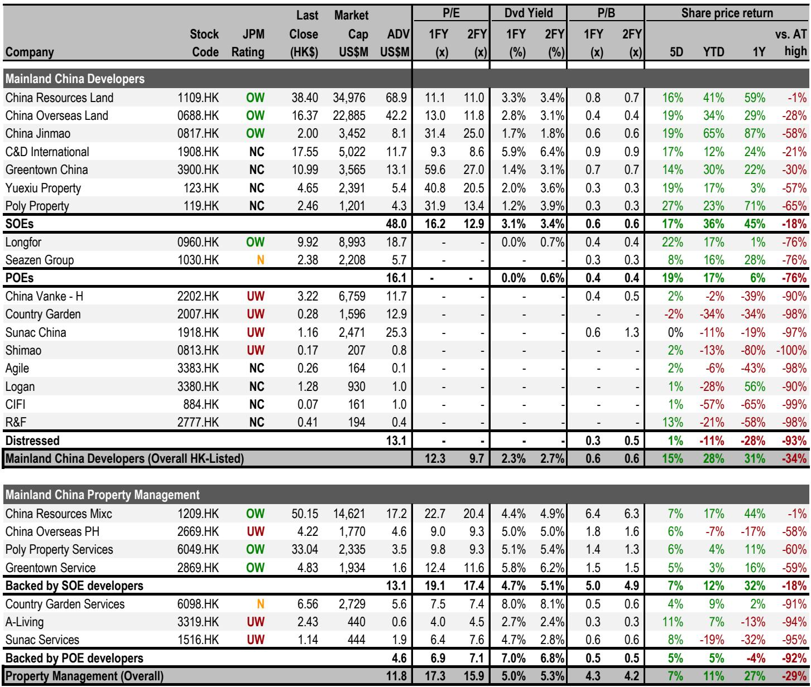
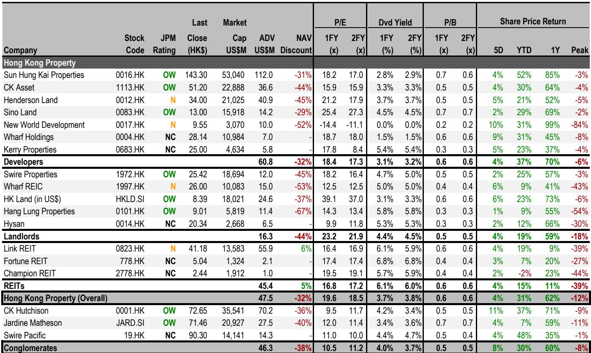
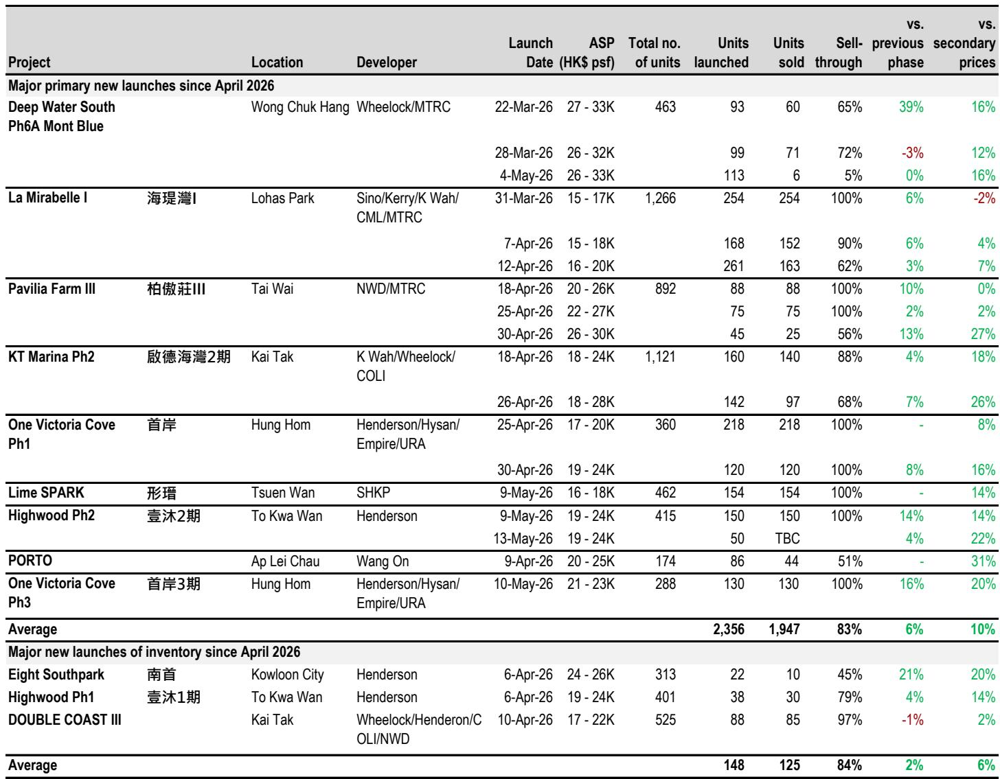

# 市场真正低估的不是需求，而是供给侧的再定价

这份来自某外资投行的最新周度地产数据监测，表面上是常规的销售与价格追踪，但放在当前的宏观与资产定价背景下，它揭示了一个被多数投资者忽略的结构性变化：中国房地产市场的核心矛盾，正在从“需求能不能起来”转向“优质供给的稀缺性如何被重新定价”。报告中的关键信号——香港一手市场周末成交量创2.5年新高、三盘全部售罄且定价普遍高于二手14%-31%；内地一线城市二手房挂牌价指数微幅回升，深圳领涨——这些不是简单的“回暖”，而是市场正在为“被低估的优质房源”重新标价。对于关注中国资产配置的决策者而言，理解这一轮定价逻辑的切换，比预测月度销售数据重要得多。

这份报告的价值不在于它给出了多少图表，而在于它用数据证明了一个正在发生的转折：当政策底、价格底和信心底在部分城市和细分市场同时出现时，市场开始自发地寻找并定价“稀缺”。而稀缺，恰恰是过去三年市场最被忽视的变量。

## 1. 香港市场已经走完“政策反弹”，进入“稀缺溢价”阶段

报告中最具冲击力的数据来自香港：过去一个周末，一手市场录得560宗成交，创下2.5年新高。三个新盘全部100%售罄，分别是新鸿基地产的Lime Spark、恒基兆业的Highwood第二期和One Victoria Cove第三期。更值得注意的是，这三个项目的平均售价均比同区二手物业高出14%至20%。

这不是简单的“降价促销”换来的去化。开发商在定价上明确选择了溢价策略，而市场用100%的售罄率回应了这种定价。这背后的逻辑是：在经历了一轮价格调整后，香港住宅市场的新增供应，尤其是优质地段的新盘，已经具备了相对于二手房的“稀缺溢价”能力。只要产品力足够强、地段足够好，买家愿意为“新”和“好”支付溢价。

报告还提供了一个前瞻性指标：Centa Valuation Index (CVI) 升至89.3，显著高于上周的85.3。当这个读数超过60时，意味着银行正在上调物业估值。这是一个极其重要的信号，因为它意味着“资产定价的锚”正在从市场情绪转向金融机构的资产负债表。银行愿意为物业给出更高的估值，意味着信贷条件正在实质性改善，而这又会反过来支撑价格。

另一个领先指标是Centa Salesman Index (CSI)，维持在69.7的高位。当读数超过50时，市场情绪被视为正面，价格大概率继续上涨。两个指标同时指向同一个方向，这不是噪音，是趋势。

对于关注香港资产的投资者，核心问题已经不是“香港楼市是否见底”，而是“哪些资产已经完成了稀缺定价的重估，哪些还处于滞后阶段”。报告推荐的新鸿基地产和信和置业，恰恰是那些拥有最多稀缺地段和优质产品储备的开发商。

## 2. 内地市场正在发生“一二手背离”，这是周期切换的典型特征

报告显示，内地60城一手住宅销售注册量同比下降7%，而12城二手住宅销售注册量同比上升16%。这种“一冷一热”的背离，在过去几轮地产周期中都出现在底部反转的前夜。

理解这一背离的关键在于：一手市场反映的是开发商的新推盘节奏和定价策略，而二手市场反映的是真实居住需求和存量资产的流动性。当前二手市场成交活跃，说明真实需求并没有消失，只是从“买新房”转向了“买存量”。而一手市场的疲软，更多是开发商在主动控制推盘节奏、等待更好的定价窗口。

报告中的另一个细节值得注意：一线城市二手房挂牌价指数从上周的19.0微升至19.3，深圳的升幅最大，环比上升1.0至28.1。报告明确指出，深圳的回升与4月底的政策放松有关。但更深的含义是：当政策放松首先在二手市场得到价格响应时，说明市场对政策的敏感度正在从“成交量”转向“成交价”。这是一个更健康的信号。

对于内地地产股而言，报告指出板块上周上涨14%，显著跑赢恒指。龙湖、越秀、中海和华润置地领涨。这说明资本市场已经在为“稀缺资产”重新定价，而不是简单地博弈政策。那些拥有大量核心城市优质土储和商业不动产的开发商，正在获得溢价。

## 3. 商业不动产REITs正在成为新的融资通道，改变开发商的资产负债表逻辑

报告在信用分析部分披露了一个关键信息：据REDD报道，华润置地计划在2026年向公募REITs注入100-150亿元人民币的购物中心资产，并计划到2030年累计发行600亿元公募REITs。其中约60%的募集资金将用于现有项目的建设和维护支出，约30%用于并购。

这组数字的意义不在于华润置地本身，而在于它标志着一个新的融资范式正在形成。过去，开发商依赖住宅销售回款和表内借贷来支撑商业资产的持有和运营。现在，公募REITs提供了一个“出表”通道，让商业资产从“沉淀资金”变成“可循环资本”。

报告明确指出，商业REITs已成为拥有大量投资性物业的开发商的“新兴融资渠道”。这意味着，那些拥有优质购物中心、写字楼和产业园区的企业，将获得一个全新的资产负债表优化工具。这不仅仅是融资手段的丰富，更是估值逻辑的重塑——当商业资产可以独立定价、独立融资时，开发商的整体估值就应该从“土地储备的折价”转向“运营资产的现金流折现”。

报告推荐关注华润置地和其旗下的华润万象生活，以及新城控股等拥有大量商业物业储备的企业。这个逻辑链条是清晰的：REITs通道的打开，将加速这些企业的资产价值重估。

## 4. 报告尚未完全回答的关键问题：二手市场的“量价背离”能持续多久

尽管报告提供了大量积极信号，但有一个关键问题没有被充分讨论：内地二手市场的成交量上升，是否能够持续转化为价格上升？目前的数据显示，虽然成交量同比增长16%，但价格指数仅微幅回升。这意味着市场仍然处于“以价换量”的阶段，卖方的议价能力尚未真正恢复。

报告中的另一个细节暗示了这种不确定性：60城一手销售注册量虽然同比下降7%，但在一线城市仅下降3%，表现相对较好。这说明真正的购买力仍然集中在核心城市，而低线城市的去化压力并未缓解。如果低线城市继续拖累整体数据，那么二手市场的活跃可能只是“局部现象”，而非全局反转。

此外，报告提到的“经理信心指数”维持在57的平位水平，没有进一步上升。这表明市场参与者虽然不再悲观，但也远未达到“乐观”的程度。这种“中性偏正面”的情绪，能否支撑价格持续上涨，仍需要更多数据验证。

对于读者而言，这些未解问题恰恰是进一步深入研究的入口。比如：二手市场成交量上升的背后，是真实的自住需求，还是投资客的抄底行为？不同城市的“价格弹性”差异有多大？REITs通道的打开，对开发商资产负债表的具体改善程度如何？

## 5. 一个可供决策者参考的观察框架

基于这份报告的逻辑，我们建议读者从以下三个维度持续跟踪市场变化：

第一，关注“一手与二手的价格差”是否在收窄。当二手价格开始追赶一手新盘的定价时，意味着市场的稀缺定价逻辑已经从“新盘”扩散到“存量”。这是趋势强化的信号。

第二，关注“银行估值指数”的变化。在香港市场，CVI指数已经给出了明确的正面信号。在内地，虽然没有类似的公开指数，但可以关注银行对房贷的审批速度和抵押率变化。当银行开始主动上调估值时，市场的底部就更加坚实。

第三，关注“商业REITs的发行节奏和定价”。华润置地的计划只是一个开始。如果更多开发商跟进，并且REITs发行获得市场认可，那么整个行业的估值体系将被重塑。这是比住宅销售数据更重要的结构性变量。

这三个维度，构成了一个比单纯追踪月度销售数据更完整的观察框架。它们分别对应着资产定价、信贷条件和融资范式，共同决定了市场下一阶段的走向。

---

上述分析中提到的几个未解问题——二手市场量价背离的持续性、低线城市的分化程度、REITs通道对估值的实际影响——在完整报告中都有更详尽的图表和分城市数据支撑。如果您希望获取原始图表、分城市数据表格以及报告中对重点个股的详细估值分析，欢迎来星球微信群里继续讨论。我们会定期组织线上交流，共同拆解这类高质量研报的核心逻辑。

Personal reading notes and learning share only. Not investment advice.

