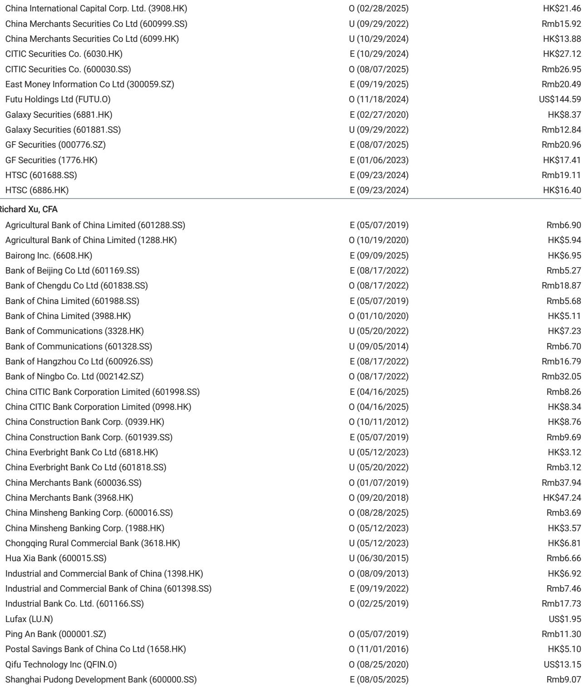

# China's Bond Yield Puzzle: Why Strong GDP Growth Has Not Lifted Yields, and What That Means for Financial Stocks

The Chinese economy is growing faster than expected, nominal GDP has improved notably, and the property market is showing early signs of stabilization. Yet government bond yields remain stubbornly low. This divergence between macro strength and fixed-income market behavior is not a statistical anomaly. It is a structural signal that demands a re-examination of how China's financial sector generates returns in the current cycle.

For investors in Chinese banks and financial institutions, the implications are profound. If bond yields do not rise in tandem with growth, traditional net interest income models face continued pressure. But the same forces that suppress yields are also reshaping the competitive landscape in ways that favor certain institutions. The key is to understand why yields are low, whether they will stay low, and which banks are best positioned to profit from the transition rather than wait for a yield rebound that may arrive later than consensus expects.

This article argues that the current low-yield environment is not a temporary glitch but a reflection of deliberate policy design and structural liquidity dynamics. The path to outperformance in China financials lies not in betting on a yield recovery, but in identifying banks that have already adapted their business models to the new regime.

## Strong Export Flows and Policy Liquidity Management Are Suppressing Bond Yields More Than Cyclical Factors

The most immediate reason bond yields have not responded to improving GDP data lies in the composition of China's liquidity. Export growth has been exceptionally strong, and with it, a surge in dollar-to-renminbi conversion by exporters. This creates a wall of domestic currency liquidity that flows into the bond market, pushing yields down regardless of the economic cycle.

But this is not a passive outcome. The People's Bank of China has been actively managing liquidity through reverse repo operations, with net withdrawals in several recent months. What appears at first glance as a contradiction is actually a calibrated strategy: the PBOC is absorbing some of the excess liquidity to prevent financial asset yields from falling too far, but it is not tightening enough to force a meaningful yield rebound. The central bank's message is clear: it wants stable yields, not rising yields.

For banks, this means the traditional relationship between economic growth and net interest margins is broken in the near term. Loan yields may stabilize, as they did in the first quarter of 2026, but bond portfolio yields will remain under pressure. Banks that rely heavily on bond trading for income must adjust their expectations. The good news is that many banks are already doing exactly that.

## Banks Are Trading the Bond Market Rather Than Waiting for Yields to Rise, and This Changes How We Evaluate Their Earnings

Conversations with bank management reveal a notable shift in behavior. Rather than holding government bonds to maturity and praying for a yield recovery, many banks are actively trading their bond portfolios to capture gains. They view current yield levels as attractive entry points for short-term trading, not as long-term holds.

This is a critical insight for investors. It means the low-yield environment is not uniformly negative for bank earnings. Banks with strong trading capabilities and risk management infrastructure can generate non-interest income from bond market volatility. The question is not whether yields rise, but whether a bank has the operational sophistication to profit from the current regime.

The data supports this view. Several banks reported sequential net interest margin improvement in the first quarter of 2026, alongside healthy fee income growth. This suggests that the most adaptable institutions are already finding ways to compensate for lower bond yields. The sector is not passively suffering; it is actively reconfiguring its revenue mix.

However, this also introduces a new source of earnings variability. Trading gains are less predictable than interest income. Investors must differentiate between banks that are structurally improving their fee businesses and those that are merely benefiting from favorable trading conditions that may reverse.

## A Gradual Rebound in Financial Asset Yields Remains Likely, But It Will Be Driven by Credit Risk Normalization, Not GDP Acceleration

The report argues that financial asset yields will eventually rebound, but the mechanism is not what most investors assume. The catalyst is not faster GDP growth, but a reduction in deflation pressure and a return to risk-based loan pricing.

China's financial sector has been operating in a deflationary environment where credit risk was elevated and banks were reluctant to price loans aggressively. As deflation moderates and industrial credit risk declines faster than expected, banks can begin to reprice loans upward. This is already visible in the stabilization of new loan pricing in the first quarter of 2026.

The property market plays a supporting role. A gradual stabilization of real estate prices reduces the systemic risk premium embedded in bank balance sheets, allowing for higher yields on new credit. But this is a multi-year process, not a sudden inflection.

The implication is that the yield rebound will be gradual and driven by micro-level credit dynamics rather than macro-level growth numbers. Banks that have maintained disciplined underwriting standards throughout the downturn will be the first to benefit. Those that accumulated risk during the property correction will face a slower recovery.

## What the Report Does Not Fully Answer: The Sustainability of Trading Income and the Risk of a Liquidity Reversal

For all its analytical rigor, the report leaves several critical questions open. The most important is whether the current bank strategy of generating trading gains from bond portfolios is sustainable. If the PBOC changes its liquidity management stance, or if export growth slows, the liquidity environment could shift rapidly. Banks that have become dependent on trading income could face a sharp earnings correction.

A second open question concerns the behavior of smaller banks. The report focuses on major institutions and top picks like Ningbo Bank and the Big Four state-owned banks. But the regional banking sector may be less capable of executing the trading strategy that is currently supporting earnings. If smaller banks are forced to hold bonds to maturity in a low-yield environment, their net interest margins could deteriorate further.

Third, the report does not fully address the impact of potential regulatory changes. If authorities decide to cap bond trading activity by banks or impose new risk-weighting rules, the current income strategy could be disrupted. Investors must monitor regulatory developments closely.

These uncertainties do not invalidate the report's thesis, but they underscore the importance of selectivity. Not all banks are equally positioned for the current environment, and the dispersion of outcomes is likely to widen.

## A Decision Framework for Investors: Three Questions to Distinguish Between Structural Winners and Cyclical Beneficiaries

To translate the report's insights into actionable investment decisions, investors should evaluate each bank against three criteria.

First, what is the composition of the bank's non-interest income? Banks with diversified fee businesses such as wealth management, advisory services, and transaction banking are better positioned than those relying primarily on bond trading. Trading gains are cyclical; fee income is structural.

Second, how has the bank's loan book behaved during the deflationary period? Banks that maintained stable new loan pricing and did not engage in aggressive rate cutting to gain market share are likely to have stronger pricing power when yields recover. Look for sequential NIM stability as a proxy for underwriting discipline.

Third, does the bank have the balance sheet flexibility to absorb a liquidity reversal? Banks with high deposit bases and low loan-to-deposit ratios are more resilient if the PBOC tightens or if export-driven liquidity flows diminish. The Big Four state-owned banks and select joint-stock banks like CitiC Bank H-shares score well on this metric.

Applying this framework, the report's top picks make sense. Ningbo Bank combines strong regional franchise with disciplined loan pricing. The Big Four offer liquidity resilience and dividend stability. CitiC Bank H-shares benefit from a restructuring story that is improving its earnings mix.

The banks to avoid are those with weak fee income, aggressive loan pricing during the downturn, and high reliance on bond trading for income generation. These institutions face a double risk: if yields do not rebound, their core earnings suffer; if yields rebound too quickly, their trading positions could generate losses.

## The Next Phase of China Financials Requires a New Investment Paradigm, and the Full Data Tells a Richer Story

The bond yield puzzle is not a temporary anomaly. It is a signal that China's financial system is transitioning from a growth-driven model to a stability-driven model. In this new paradigm, bank performance depends less on macro tailwinds and more on micro-level adaptation. The banks that understand this shift and have built the capabilities to operate in a low-yield, high-volatility environment will outperform.

The charts in the full report reveal the precise timing of liquidity withdrawals and yield movements that support this analysis. They also show the divergence between nominal GDP improvement and bond market behavior in a way that summary data cannot capture.

Join the community to read the full report and review the original charts.

*This article is for learning and discussion only and does not constitute investment advice.*

Personal reading notes and learning share only. Not investment advice.

