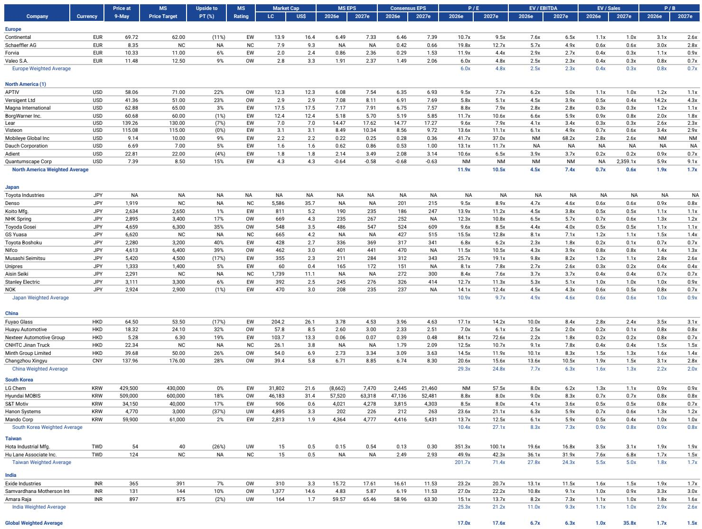
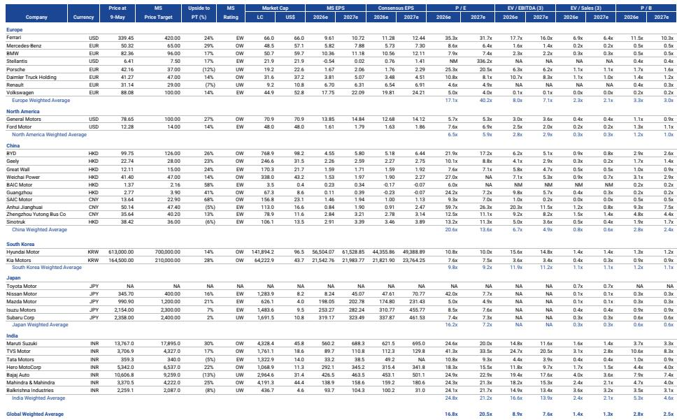
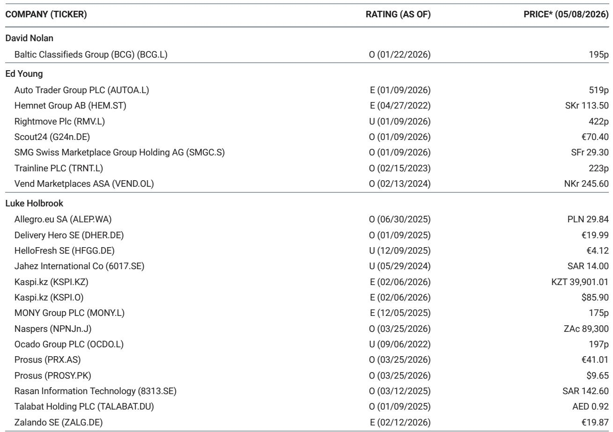

# 全球电动车市场正在进入一个“需求验证供给”的新阶段，而非简单的销量复苏

过去几周，全球汽车行业的数据发布密集而复杂。美国4月SAAR录得1610万辆，同比下降6%，但市场并未将此解读为需求崩塌——因为去年同期存在关税驱动的需求前置。欧洲BEV销量同比激增41%，中国电动车渗透率首次突破20%达到25.9%。这些数字单独看各有指向，但合在一起，它们指向一个更重要的结构性变化：市场正在从“谁卖得多”转向“谁能在供给端兑现持续的规模与成本优势”。

这份最新发布的全球汽车监测报告提供了关键的证据拼图。我们的核心判断是：电动车市场的下一个周期，不再由补贴或政策预期驱动，而是由供给侧的结构性能力——包括电气架构的升级、软件定义车辆的规模化、以及供应链的全球化布局——决定谁是赢家。真正被低估的，不是需求端的弹性，而是供给端正在发生的再定价。

## 1. 欧洲BEV的41%同比增长不是偶然，而是供给端积压能力释放的起点

报告显示，欧洲五国4月销量同比增长7%，其中英国以24%的增速领跑。更值得关注的是BEV的表现：全球3月BEV销量环比增长82%，欧洲BEV同比反弹41%。这组数据很容易被解读为“需求回来了”，但报告的细节提示我们，这更像是供给端问题解决后的补库存与积压订单释放。

法国市场销量同比微降0.3%，德国仅增2.7%，而英国却录得24%的增长。这种区域分化并非需求差异所致，而是与各市场充电基础设施的完善速度、以及OEM在当地的产能释放节奏高度相关。报告提到，梅赛德斯-奔驰集团终于开始在欧洲恢复市场份额——这背后是其纯电车型产能爬坡的初步效果。

这意味着什么：欧洲BEV的反弹可持续性取决于OEM能否持续交付，而非消费者的购买意愿。如果供给端无法维持当前节奏，市场将再次陷入“有需求、无供给”的尴尬。投资者应关注的不是月度销量数字本身，而是各OEM的产能利用率与在手订单转化为交付的周期。

## 2. 特斯拉的FSD里程突破10亿英里，但真正的护城河是软件定义电气架构的规模化

报告特别指出，特斯拉本周累计FSD行驶里程突破了10亿英里。这个数字在自动驾驶领域无疑是一个里程碑，但报告将其放在“个人自动驾驶领先地位”的语境下讨论，而非作为独立的估值驱动因素。

更重要的信号来自报告对Versigent和Aptiv的升级。研究团队认为，自动驾驶、电动化和软件定义车辆是持久的长期增长驱动力，它们持续增加电气架构的内容与价值。Versigent被首次覆盖并给予超配评级，Aptiv被从平配升级为超配——这背后的逻辑是：电气架构的复杂度正在从高端车型向主流车型渗透，而能够提供“从线束到功率电子”一体化方案的供应商将获得结构性溢价。

特斯拉的FSD里程是能力积累的证明，但真正决定行业竞争格局的，是能否将这种能力转化为可规模化的电气架构产品。特斯拉在这方面有先发优势，但Aptiv和Versigent代表的传统Tier 1正在通过收购与整合追赶。报告在这里留下了一个值得追问的问题：自动驾驶的护城河究竟是算法和数据，还是底层电气架构的工程化能力？

## 3. 中国电动车渗透率突破25%，但盈利压力正在将市场从“份额战”推向“成本战”

报告显示，中国3月电动车渗透率达到25.9%，高于去年同期的18.0%。比亚迪在全球BEV份额上已从11%追至12%，与特斯拉的14%差距进一步缩小。然而，报告对中国电动车初创企业的1季度展望并不乐观：预计主要新势力将因规模不足和研发支出上升而重新陷入亏损。

这是一个典型的“量增利薄”阶段。渗透率突破25%意味着市场已从早期采用者过渡到主流消费者，价格弹性增大，竞争从产品差异化转向成本结构优化。报告提到，中国零部件供应商在2026年面临“收入向上、利润率向下”的局面——它们正在与OEM客户进行价格谈判，同时积累高成本库存。

这里的关键变量是出口。报告指出，中国零部件企业的增长已转向出口和产品升级。这与中国OEM加速出海的大趋势一致。但出口并非万能药——关税风险、本地化生产要求、以及海外消费者对品牌认知的建立，都需要时间。报告对Geely的评级上调至超配，目标价从25港元上调至28港元，暗示市场对部分中国OEM的海外扩张能力仍有信心，但整体而言，中国电动车板块的盈利拐点尚未到来。

## 4. 美国市场的“混合动力替代”正在重塑OEM的产品组合与资本配置

报告中最容易被忽视但影响深远的一个信号是：美国4月混合动力车份额在汽油价格上涨的背景下持续上升。同期，美国轻型车SAAR为1610万辆，同比下降6%，但库存天数从3月的48天上升至51天，激励措施环比下降4%。这意味着需求端没有显著恶化，但消费者正在从纯燃油车向混合动力车转移。

这对OEM的产品规划和资本配置有直接影响。混合动力车需要同时具备内燃机和电驱动系统，其电气架构复杂度介于纯燃油车和纯电动车之间。对于传统OEM来说，这意味着他们不能简单地将资本全部押注于纯电转型，而必须在混合动力和纯电之间保持灵活的产能分配。

报告对美国经销商板块的评级调整也印证了这一点：AutoNation、Group 1 Automotive和Penske Automotive均被维持超配，研究团队对经销商的销售管理费用杠杆、服务利润提升和战略资本配置的信心在增强。经销商是OEM产品组合变化的直接反映——如果混合动力车持续受到青睐，经销商的库存周转和售后利润结构将受益。

## 5. 报告尚未完全回答的关键问题：关税风险如何重新定价全球供应链

报告对欧洲板块的讨论中，有一个值得警惕的标题：“EU-US Trade Deal: back to 25% Auto Tariffs?” 研究团队指出，如果美欧关税回到25%，将给已经承压的利润率、回报和现金流预期带来额外压力，尤其影响保时捷。同时，中东局势的潜在升级也被视为对2026财年指引的新风险。

但这些讨论在报告中并未展开为系统的情景分析。关税的影响不是线性的——它取决于OEM的本地化生产比例、供应链的替代弹性、以及消费者对价格变化的敏感度。例如，报告提到BorgWarner正在加倍押注分布式电源业务（ESS和微电网逆变器），这既是对传统动力总成业务的下行对冲，也是对其供应链多元化能力的验证。但客户验证（通过积压订单增长）仍是估值上行的关键。

这里有一个值得深入的问题：如果全球贸易摩擦升级，哪些OEM和供应商的供应链布局最具韧性？报告给出了部分线索——比如对印度Bajaj Auto的出口前景保持乐观，对韩国HMC和Kia的分化表现做了点评——但一个完整的、跨区域的供应链再定价框架，还需要结合更多维度的数据才能构建。

## 6. 一个更实用的观察框架：从“销量增长”转向“每辆车的内容价值增长”

综合报告的多个板块，我们提炼出一个适用于当前阶段的观察框架：不要只看OEM的销量增速，要看每辆车所承载的电气架构、软件和电池系统的价值增速。

这个框架有三个层次：

第一层，电气架构的价值。Versigent和Aptiv的升级表明，无论整车销量如何波动，每辆车需要的线束、连接器、功率电子模块都在增加。这是确定性最高的增量。

第二层，软件与服务价值。特斯拉FSD里程的积累、以及软件定义架构对传统Tier1的冲击，提示我们软件订阅收入正在成为OEM和供应商的差异化变量。但报告也指出，这方面的收入规模化仍需时间——中国新势力仍在亏损，说明软件变现尚未覆盖硬件成本。

第三层，电池与能源系统的价值。BorgWarner向分布式电源的扩张、以及韩国电池板块的评级调整（LG Energy Solution目标价从38万韩元上调至50万韩元），暗示能源存储正在成为汽车供应链的新增长极。这不仅是电动车需求的衍生，更是独立于汽车周期的能源基础设施投资。

这个框架可以帮助投资者识别哪些公司是“周期性的销量赌注”，哪些是“结构性的价值增长”。报告对通用汽车和Carvana的全球首选推荐，以及对Suzuki的持续看好，都符合这一逻辑——它们要么拥有规模化的电气架构能力，要么在特定市场拥有不可替代的渠道与品牌资产。

---

全球汽车行业正站在一个从“电动化叙事”向“电动化运营”切换的关键节点。销量数据的波动会继续，但真正决定下一个五年竞争格局的，是供给端的工程化能力、供应链的韧性、以及每辆车价值含量的提升速度。这份报告没有给出所有答案——关税风险的量化、中国新势力的盈利拐点、以及自动驾驶商业化的时间表，都还需要更多数据验证。但它的价值在于，为这些关键问题提供了清晰的讨论框架和可追踪的指标。

欢迎来星球微信群里继续讨论这些未解问题——比如关税情景下的供应链再定价模型，或者中国OEM出海过程中的盈利拐点判断。我们会在社群里分享完整的原始图表和更细致的区域拆解。

Personal reading notes and learning share only. Not investment advice.

