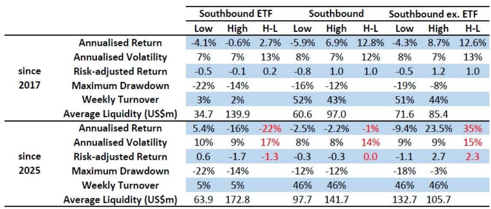
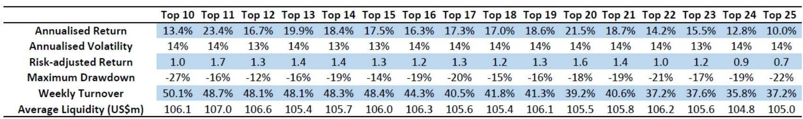
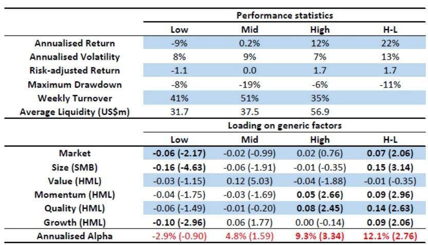

# 港股真正的alpha不在总量，而在拆解南向资金的结构性变化

过去一年，南向资金加速流入港股，日均成交额从2024年的约120亿美元攀升至2025年的300亿美元，市场活跃度显著提升。许多投资者将此视为港股整体机会的回归信号。但某外资投行最新发布的量化研究报告揭示了一个反直觉的判断：南向资金总量的增长恰恰掩盖了其选股能力的系统性下降。真正值得关注的不是资金流入了多少，而是流入的结构发生了什么变化——以及不同投资者群体之间的行为差异正在创造怎样的alpha机会。

这份报告的核心洞察在于：当被动型跨境ETF占据南向持仓超过10%（截至2026年1月），南向资金整体已不再具备超额选股能力。然而，剥离ETF通道后，主动型南向投资者的持仓信息依然能够产生稳定的超额收益。更关键的是，当将南向主动资金、香港本地及海外最佳表现参与者、以及全球机构拥挤度信号三者组合时，策略的年化超额回报达到12%，最大回撤仅6%。这意味着，港股市场的定价权正在经历一场静默的再分配，而理解这场分配的结构性逻辑，才是把握alpha的关键。

## 1. 港股市场结构正在经历一次流动性扩散，而非简单的总量膨胀

过去十年，港股市场的一个显著特征是高度集中。最大的10%市值公司占据了南向标的70%以上市值、非南向标的80%以上市值；最活跃的10%标的则分别贡献了南向和非南向市场60%和90%以上的成交额。这种集中度使得中小市值股票长期处于流动性边缘。

但自2024年四季度以来，情况发生了根本性变化。报告数据显示，以三个月日均成交额超过500万美元为门槛，港股活跃股票数量从2024年的约230只，激增至2025年的约500只。这意味着，过去一年里，港股的流动性正在向更广泛的标的扩散，中小市值股票的可交易性显著提升。

这一扩散并非偶然。南向标的日均成交额从2024年的约120亿美元跃升至2025年的约300亿美元，而非南向标的的成交额同期仅从约10亿美元微增至约20亿美元。流动性扩散的主要驱动力来自南向通道。对于系统化投资者和容量敏感的基金而言，这意味着选股池的实质性扩容——过去因流动性不足而无法配置的标的，现在进入了可执行范围。

## 2. 南向资金的结构性转变：被动化正在侵蚀整体选股能力

南向资金在港股市场的重要性持续上升，但资金性质正在发生微妙但关键的变化。报告指出，截至2026年1月，ETF持仓已占南向总持仓的10%以上。这一比例在2024年底之前几乎可以忽略不计，但此后加速攀升。

这一变化的含义是深远的。传统上，南向资金以主动交易为主，其持仓变动能够反映境内投资者的选股偏好和alpha能力。但被动型ETF的流入逻辑完全不同——它们追踪指数，不反映个股层面的判断。因此，尽管南向资金总量加速流入，其整体的选股效率（stock picking efficacy）自2025年以来持续下降。

这里需要强调的是，报告并非否定南向资金的信息价值，而是指出“总量”是一个误导性指标。真正有价值的信息隐藏在被动资金之外。当报告将ETF持仓从南向数据中剥离后，剩余的主动型持仓数据依然能够产生稳定的alpha。这意味着，南向通道中仍然存在聪明的钱，但需要更精细的拆解才能捕捉到。

## 3. 不同投资者群体的行为差异是alpha的核心来源

报告通过对投资者群体进行划分，揭示了港股市场alpha的结构性来源。南向投资者（剔除ETF）与全球参与者（包括香港本地及海外投资者）在持仓偏好上存在显著差异：南向投资者倾向于超配高波动性的信息技术板块，而全球参与者则更偏好高股息的价值股，集中在公用事业和通信服务板块。

这种差异意味着两个群体的信息含量具有低相关性。单纯跟踪南向主动资金或全球最佳表现参与者，各自都能产生超额收益，但组合后的效果更为显著。报告构建的HK Composite Ownership Factor，将三个信号源——南向主动资金、滚动52周表现最佳的前20名参与者（包括经纪商和托管银行）、以及UBS Proprietary Crowding Factor（衡量全球机构在港股的头寸拥挤度）——进行合成。

回测结果显示，从2019年至2026年，该复合策略的年化超额回报为12%，风险调整回报（夏普比率）达到1.7，最大回撤仅6%。相比之下，单一信号源的表现均不及组合：南向主动资金年化10%、最佳参与者12%、拥挤度因子仅6%，且最大回撤分别为-8%、-12%和-11%。组合策略不仅收益更高，波动率和回撤也更低，这直接证明了多信号源分散化的价值。

## 4. 报告尚未完全回答的关键问题：被动化趋势的可持续性与竞争格局演变

尽管报告提供了极具操作性的框架，但有几个关键问题仍未充分展开，值得读者进一步思考。

第一，南向资金被动化趋势的可持续性。ETF持仓占南向比例突破10%是在不到两年内完成的。如果这一趋势继续加速，南向主动资金的信息价值会否被进一步稀释？报告虽然展示了剥离ETF后的alpha依然有效，但未讨论当主动资金占比持续下降时，该信号的统计显著性是否会衰减。

第二，最佳参与者滚动筛选的稳健性。报告使用滚动52周窗口筛选表现最佳的前20名参与者，这一方法在回测中表现优异。但需要验证的是，这些参与者的表现是否具有持续性？还是说，最佳参与者的名单本身存在高换手率？报告给出的数据显示，最佳参与者策略的周换手率为57%，远高于复合策略的35%。高换手率意味着信号衰减可能较快，实盘中的交易成本可能侵蚀部分超额收益。

第三，拥挤度信号的边界。UBS Crowding Factor用于衡量全球机构头寸的拥挤程度，但拥挤度本身是一个双刃剑——低拥挤度的头寸可能意味着未被市场定价，但也可能意味着缺乏基本面支撑。报告未讨论拥挤度因子在不同市场环境下的表现差异，例如在流动性收缩或风险偏好下降时，该因子是否会失效甚至逆转。

## 5. 投资者的观察框架：从“南向流入”到“资金结构拆解”

基于报告的发现，投资者可以建立一个更精细的观察框架来审视港股市场的alpha机会。

第一步，区分南向资金的性质。不要只看南向净流入的总量，而要拆解其中ETF被动资金与主动交易资金的比例。当ETF占比持续上升时，总量流入对选股的参考价值下降。反之，如果主动资金占比回升，可能意味着新的alpha信号正在生成。

第二步，关注不同投资者群体的持仓变化。南向主动资金与全球参与者的持仓偏好差异，本身就是一种信息。当某个板块同时获得两个群体的增持时，可能意味着更强的共识；而当两者出现分歧时，往往提供了逆向机会。报告显示，南向投资者超配高波动科技股，全球参与者超配高股息价值股，这两个方向本身就构成了一个天然的分散化组合。

第三步，利用拥挤度信号进行风险管理。全球机构拥挤度因子虽然单独表现一般（年化6%），但在组合中有效降低了最大回撤。这意味着，当某个头寸的机构拥挤度达到极端水平时，即使基本面逻辑依然成立，也可能面临短期流动性风险。投资者可以将拥挤度作为仓位调整的辅助信号，而非选股的主信号。

第四步，关注市场结构变化对容量的影响。港股活跃股票数量从230只增至500只，意味着量化策略和系统化投资的执行空间大幅扩展。对于大资金而言，过去因流动性限制而无法进入的中小市值标的，现在可能成为新的alpha来源。但这也意味着，选股池的扩大本身会带来竞争加剧——当更多资金追逐同样的扩散机会时，早期进入者的优势可能被稀释。

## 6. 一个值得警惕的隐含假设：回测中的幸存者偏差与实盘执行差距

报告的量化回测结果令人印象深刻，但投资者需要意识到回测与实盘之间的天然差距。首先，回测中使用的“最佳参与者”筛选依赖于事后数据——在实盘中，投资者无法提前知道未来52周哪些参与者表现最佳。报告采用滚动窗口设计部分缓解了这一问题，但信号的实际可用性仍需验证。

其次，回测假设了完美的执行能力。报告显示复合策略的周换手率为35%，年化双边换手率可能超过1800%。在港股市场，尤其是中小市值标的，如此高的换手率将产生可观的交易成本，包括佣金、冲击成本和印花税。报告未讨论扣除交易成本后的净收益，这可能是实盘表现与回测结果之间最大的差距来源。

最后，报告的研究框架依赖特定数据源——南向持仓数据、托管银行和经纪商数据、以及UBS proprietary crowding factor。这些数据并非对所有投资者公开可得。对于无法获取这些数据的投资者而言，报告的结论更多提供了一个分析思路，而非可直接复制的策略。

---

以上讨论的问题——被动化趋势的边界、最佳参与者信号的衰减速度、拥挤度因子的环境依赖性、以及回测与实盘的差距——正是完整报告中有更深入数据支撑和敏感性分析的部分。这些未解问题并非报告的缺陷，而是其价值所在：一份好的研报不是给出所有答案，而是提供正确的分析框架和值得追问的问题。

欢迎来星球微信群里继续讨论。我们将围绕这份报告的原始图表、数据回测细节、以及不同投资者群体持仓变化的实时跟踪展开更深入的交流。如果你对如何拆解南向资金结构、如何构建自己的多信号选股框架感兴趣，这些讨论或许能提供一些新的视角。

Personal reading notes and learning share only. Not investment advice.

