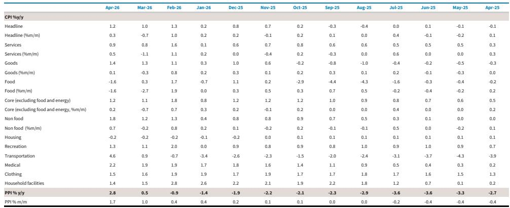
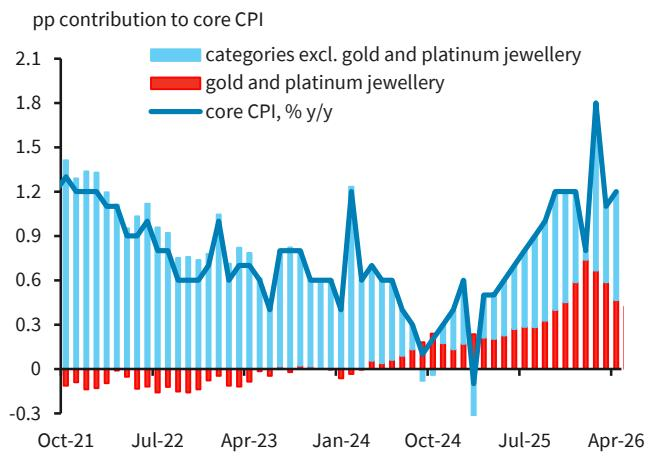
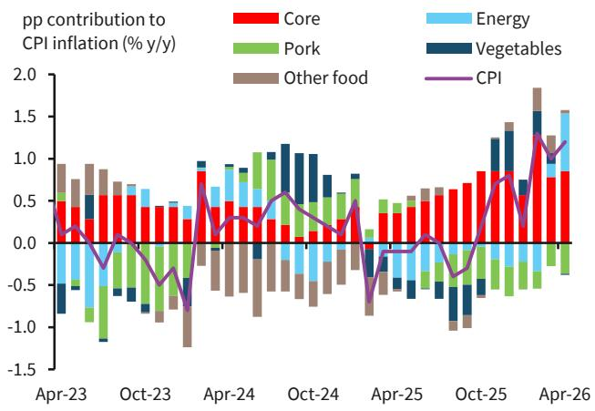

# China's April Inflation Data Reveals an Energy-Driven Price Spike That Masks Persistent Demand Weakness

The April inflation data from China presents a paradox that every serious investor must understand. Headline CPI rose to 1.2% year-on-year and PPI surged to 2.8%, far exceeding consensus expectations of 0.9% and 1.8% respectively. At first glance, this appears to be evidence of reflationary momentum building in the world's second-largest economy. But a careful decomposition tells a very different story. The price acceleration was overwhelmingly concentrated in energy-related components, while core inflation, services prices, and downstream manufacturing remained stubbornly soft. This is not the beginning of a broad-based inflationary cycle. It is a supply-side energy shock superimposed on an economy where domestic demand is still too weak to generate self-sustaining price pressures. The critical strategic question for portfolio positioning is not whether China is reflating, but how long this divergence between upstream and downstream pricing can persist, and what it reveals about the underlying health of corporate margins and consumer spending.

The timing of this data release matters enormously. It comes after PPI exited deflation in March for the first time since late 2022, and the acceleration to 2.8% in April was far sharper than any forecaster anticipated. On a month-on-month basis, PPI surged to a post-COVID high of 1.7%, up from 1.0% in March. This suggests a lagged pass-through from earlier oil price increases, even though the rise in crude prices was less pronounced in April than in March. For investors who had been positioning for a cyclical recovery in Chinese industrial earnings, this data provides both confirmation and a warning. The confirmation is that upstream sectors are experiencing genuine pricing power. The warning is that this pricing power is not translating downstream, which means the sustainability of the recovery is questionable.

## The PPI Surge Is Almost Entirely an Upstream Energy Story, Not a Broad Industrial Recovery

The breakdown of the PPI data reveals a stark bifurcation that is easy to miss in the headline number. Producer goods prices for mining jumped to 10.6% year-on-year in April from 2.0% in March, while raw materials surged to 7.1% from 1.1%. By contrast, manufacturing PPI only edged up to 1.5% from 0.9%, and consumer goods PPI remained in deflation at -1.0%, albeit narrowing from -1.3%. This is not the profile of a synchronized industrial upswing. It is the profile of an energy price shock that is enriching upstream extractors while squeezing downstream processors.

Within the upstream sectors, the concentration is even more extreme. PPI for oil and gas extraction surged to 29% year-on-year in April, the strongest reading since late 2022. This single sub-sector is driving the entire PPI narrative. The spillover into coal is also notable, with coal mining and washing turning positive for the first time since mid-2024. On a month-on-month basis, energy-related sectors showed extraordinary price momentum: oil and gas extraction rose 18.5%, fuel processing jumped 16.4%, chemicals increased 8.3%, chemical fiber rose 5.6%, and rubber and plastics gained 1.7%. These are not normal monthly movements. They reflect the direct pass-through of global energy prices into China's industrial pricing system.

The so-what for investors is that this creates a classic margin squeeze dynamic. Upstream firms in energy and raw materials are enjoying windfall profits. But downstream manufacturers in consumer goods, durable goods, and even parts of manufacturing are unable to pass through these higher input costs. The consumer goods PPI at -1.0% year-on-year tells you everything you need to know about the pricing power of companies that sell to Chinese households. They are absorbing cost increases, which compresses their margins. For equity investors, this means sector selection is paramount. The energy and materials sectors may look attractive on earnings momentum, but the broader industrial and consumer discretionary sectors face a headwind that is not yet priced into consensus estimates.

## Headline CPI Masks a Softening Underlying Inflation Picture When Energy Is Removed

The CPI data requires the same analytical decomposition. Headline CPI rose by 0.2 percentage points to 1.2% year-on-year in April. But the contribution from energy to headline CPI rose by approximately 0.5 percentage points, meaning that excluding energy, underlying CPI inflation actually softened. This is the critical insight that the headline number obscures. The energy contribution was driven overwhelmingly by domestic gasoline prices, which surged 19.3% year-on-year in April, up from just 3.8% in March. This single component contributed around 0.56 percentage points to headline CPI.

The rest of the CPI basket tells a story of demand weakness. Several major components continued to decline. Housing rents fell 0.6% year-on-year, marking the fastest pace of decline since January 2023. Data from the China Index Academy shows that rents in major Cities declined at an even sharper rate of 3.4% year-on-year. This is not a signal of a recovering property market or improving household confidence. Automobile prices fell 1.2% year-on-year, extending a deflationary trend that reflects both structural overcapacity in the EV sector and weak consumer demand for big-ticket discretionary items. Household goods and services inflation moderated to 1.4% from 1.5%. Even core CPI, which remained relatively resilient at 1.2% year-on-year, was still below its pre-conflict average of 1.3% in January and February.

The services CPI data reinforces this interpretation. Services inflation edged up to only 0.9% year-on-year from 0.8% in March, broadly flat with pre-conflict levels. The acceleration in travel-related services to 3.7% year-on-year likely reflects the pass-through of higher oil prices to transportation costs, not a surge in demand. Labour-intensive services such as dining out, housekeeping, and vehicle repair saw modest price increases of 1.1% to 1.4%, contributing only about 0.10 percentage points to headline CPI. This is not the profile of an economy where wage pressures are building or where consumers are spending freely.

## The Divergence Between Upstream and Downstream Pricing Creates a Policy Dilemma That the Report Does Not Fully Resolve

This is the point where the data raises questions that the report does not fully answer. The energy-driven price spike creates a genuine policy dilemma for Chinese authorities. On one hand, the PPI surge could be interpreted as a positive signal that deflationary risks are receding, which would support the case for maintaining accommodative monetary and fiscal policy. On the other hand, the weakness in core CPI and services inflation suggests that domestic demand remains too soft to generate self-sustaining growth, which argues for additional stimulus.

The report leaves several meaningful open questions. First, how much of the energy price pass-through is temporary versus structural? If global oil prices stabilize or decline, the PPI spike could reverse as quickly as it appeared, leaving the underlying deflationary pressures in manufacturing and consumer goods fully exposed. Second, what is the transmission mechanism from upstream price increases to downstream pricing decisions? The fact that consumer goods PPI remains in deflation after months of upstream pressure suggests that the pass-through elasticity is extremely low, which implies either that downstream firms have no pricing power or that they are choosing to absorb costs to defend market share. Third, what does the housing rent data tell us about the trajectory of household income expectations? Rents are a forward-looking indicator of household confidence, and the accelerating decline is deeply concerning.

For investors, the unresolved question is whether the divergence between upstream and downstream pricing will eventually correct through a demand recovery that lifts downstream prices, or through a supply adjustment that brings upstream prices back down. The answer to this question has profound implications for sector allocation, duration positioning, and currency exposure.

## A Decision Framework for Investors Navigating the Energy-Driven Inflation Divergence

The data from April provides a clear framework for making investment decisions in the current environment. Investors should evaluate their China exposure along three dimensions: sector positioning, factor exposure, and policy sensitivity.

On sector positioning, the energy-driven inflation narrative favors upstream sectors in the near term. Oil and gas extraction, coal, non-ferrous metals, and chemicals are experiencing genuine pricing power that is directly boosting earnings. However, the sustainability of this advantage depends on global energy prices, which are subject to geopolitical risk and demand uncertainty. Investors should be prepared for a sharp reversal if energy prices moderate. The downstream sectors are facing margin compression that is likely to persist until domestic demand recovers. Consumer goods, automobiles, and manufacturing companies with low pricing power should be approached with caution. The bright spot within downstream sectors is the new economy segments that are benefiting from structural demand. The report notes that prices for lithium-ion battery manufacturing rose 1.6% month-on-month, EV manufacturing prices fell at a slower pace, and optical fiber manufacturing prices jumped 22.5% month-on-month amid AI-driven demand for computing power. These segments are less dependent on the energy cycle and more driven by structural investment trends.

On factor exposure, the current environment favors value and commodity-related factors over growth and consumer factors. But this is a tactical call, not a strategic one. The underlying weakness in domestic demand suggests that value exposure should be hedged with positions that benefit from policy stimulus, such as infrastructure and green transition sectors. The data does not support a sustained rotation into cyclical value without a concurrent recovery in consumer confidence.

On policy sensitivity, the divergence between upstream and downstream pricing gives Chinese policymakers room to maintain accommodative policy without fear of overheating. The weak core CPI and services inflation mean that the People's Bank of China is unlikely to tighten monetary policy in response to the headline PPI spike. This is supportive for duration in Chinese bonds and for rate-sensitive sectors such as property and infrastructure. However, the effectiveness of additional stimulus depends on whether it can reach the downstream sectors that are most in need of support. The data suggests that previous stimulus measures have not yet translated into broad-based price recovery.

## The Full Report Contains the Charts and Granular Data That Make These Distinctions Actionable

The analysis above draws on the key insights from the April inflation report, but the full document contains the charts and granular breakdowns that allow investors to make these distinctions with precision. The decomposition of CPI into energy, core, food, and services components is essential for understanding which parts of the inflation picture are improving and which are deteriorating. The PPI breakdown by sector and by month-on-month momentum provides the data needed to identify which industries are gaining pricing power and which are losing it. The historical context provided by the charts showing auto prices, gold jewellery contributions, and the evolution of core CPI over time allows investors to assess whether current trends are cyclical or structural.

The report also contains the detailed month-on-month and year-on-year data for every major CPI and PPI sub-component, which is critical for building bottom-up earnings models. Investors who rely only on headline inflation numbers will miss the divergence that is driving relative performance across sectors. The charts showing the trajectory of PPI for oil and gas extraction, coal mining, and non-ferrous metals provide the visual evidence needed to understand the concentration of price pressures.

Join the community to read the full report and review the original charts.

*This article is for learning and discussion only and does not constitute investment advice.*

Personal reading notes and learning share only. Not investment advice.

