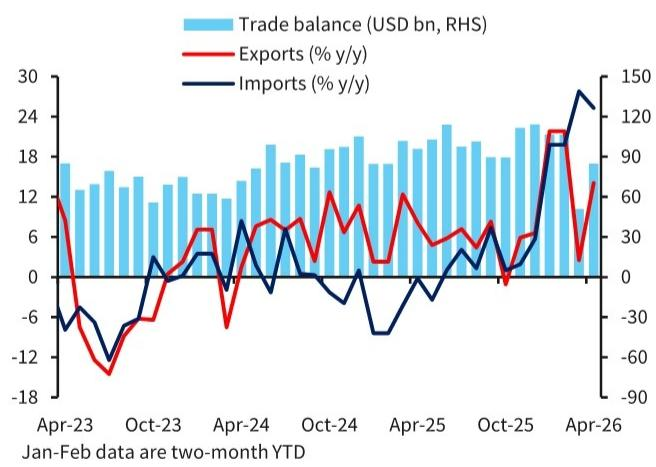
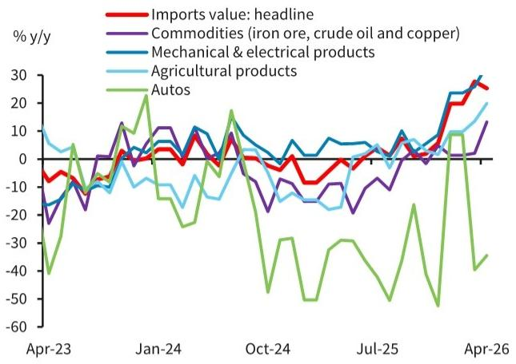
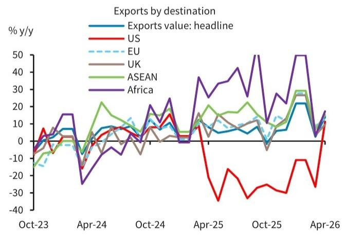

# 出口的超预期不是周期反弹，而是中国供给结构被全球重新定价

四月的出口数据，让市场再次陷入一种熟悉的尴尬：预期总是落后于现实。当月出口同比增长14.1%，远高于Bloomberg consensus的8.4%和BARC内部预测的6.5%。这不是一个简单的基数效应或抢出口故事。真正值得关注的信号是：全球制造业周期回暖叠加能源供给冲击，正在系统性地重估中国作为“高技术中间品+绿色终端品”双重供应商的定价权。

这份来自某外资投行的研报，用一组产品层面的拆解数据，揭示了出口结构正在发生的质变——半导体和自动数据处理设备两项合计贡献了约8个百分点的出口增速，占当月总增量的近60%。而绿色技术产品（电动车、锂电池、风电、光伏）则延续了双位数增长。这些数字合在一起指向一个判断：中国出口的韧性，已经从“成本优势驱动”切换到了“技术供应链不可替代性驱动”。

## 1. 市场真正低估的不是需求，而是中国在AI供应链中的结构性位置

研报中一个容易被忽视的数据是，中国在全球关键AI相关产品出口中占比超过30%，而韩国仅为约6%。这个数字意味着什么？当全球AI资本开支周期启动时，中国不是“参与者”之一，而是最大的硬件制造枢纽。四月份半导体出口同比近乎翻倍，自动数据处理设备增长47%，这两个品类并非终端消费品，而是AI基础设施的核心中间品。

市场的常见叙事是“中国出口依赖外需”，但这里的关键变量是：外需的结构正在从消费电子转向AI基础设施。前者是可替代的、价格敏感的，后者是技术认证周期长、供应链切换成本高的。研报数据显示，这一轮全球制造业PMI升至四年新高，而中国是少数能够同时提供芯片、半导体设备、计算机组件和电路板的全链条供应商。这意味着，即使地缘政治摩擦持续，短期内很难找到同等规模的替代供应源。

所以呢？AI相关的出口增长不是周期性脉冲，而是结构性红利。只要全球AI投资不出现系统性崩溃，这部分出口的增速中枢将显著高于整体贸易增速。

## 2. 能源冲击正在加速绿色技术出口的“二阶效应”

地缘冲突通常被视为贸易的负面变量，但研报揭示了一个反直觉的传导机制：能源供给冲击反而强化了中国绿色技术出口的增长逻辑。报告指出，中东冲突后，太阳能板、风电、电动车等产品的出口订单在过去两个月内激增。这不是巧合，而是一种“危机加速转型”的典型路径。

逻辑链条是这样的：能源价格高企 → 各国能源安全焦虑上升 → 可再生能源投资加速 → 中国作为全球成本最低、规模最大的绿色技术供应商，成为最大受益者。今年前四个月，电动车出口增长68%，锂电池增长55%，风电增长55%，太阳能电池增长34%。这些数字背后是一个更深的判断：绿色转型已经从“道德选择”变成了“能源安全刚需”。

这里需要特别注意的是，这种需求不是补贴驱动的，而是成本竞争力驱动的。中国在绿色技术领域的规模优势、产业链完整度和迭代速度，已经形成了其他经济体短期内难以复制的壁垒。研报隐含的判断是，地缘政治紧张持续时间越长，绿色转型的紧迫性越高，中国在这一领域的结构性优势就越突出。

## 3. 进口数据揭示了一个被价格信号掩盖的真实需求图景

四月进口同比增长25.3%，看似强劲，但研报拆解后揭示了截然不同的画面。按量计算，原油进口下降20%，天然气下降13%，煤炭下降12.5%，铁矿石增速从11.5%骤降至0.7%。进口金额的强劲几乎完全来自价格上涨，而非实际需求增加。

这个反差意味着什么？中国内需的真实状况，比进口金额数字所显示的要弱得多。大宗商品进口量的全面下滑，与研报中提到的“消费增速可能降至50%以下”的判断形成呼应。高频率消费指标——汽车销售、五一假期出行数据——在过去一个月明显走弱。所谓的“双速经济”，在进口量数据中得到了最直接的验证。

但有一个例外值得关注：大豆进口在四月达到848万吨，环比翻倍，同比增长39.4%。这与即将到来的中美高层会晤有关——中国可能承诺增购美国农产品。这提示我们，进口数据中有一部分是政策驱动的战略采购，而非真实需求信号。投资者在解读进口数据时，必须区分“价格效应”“政策采购”和“实际需求”三个层次。

## 4. 出口的目的地分散化正在改变中国的贸易脆弱性

一个容易被市场忽略的结构性变化是出口目的地的多元化。四月数据显示，对非洲和拉美的出口合计贡献了2.1个百分点的总出口增速，而三月还是拖累0.1个百分点。对东盟出口增长15.2%，对日韩台增长16.8%，对欧盟增长13.4%。即使是受到关税冲击的对美出口，也在低基数上反弹了11.3%。

这种分散化的意义不在于短期数据，而在于它降低了中国出口对单一市场的依赖风险。当市场过度关注中美贸易摩擦时，中国出口企业实际上已经通过供应链调整和市场开拓，将增长引擎分散到了全球多个区域。研报中提到的“全球制造业同步回暖”是背景，但中国出口的韧性更多来自于这种目的地结构的优化。

这里仍有一个未完全回答的问题：对新兴市场的出口增长，有多少是真正由当地需求驱动，有多少是中国企业为规避关税而进行的“转口贸易”？如果是后者，那么这些数据的可持续性就需要打上问号。研报没有对此展开，但这恰恰是投资者需要自己判断的关键变量。

## 5. 报告尚未完全回答：AI出口的可持续性取决于全球资本开支的延续性，而非中国自身

研报对AI相关出口的乐观判断，建立在一个关键假设之上：全球AI资本开支周期将继续扩张。但这里存在一个尚未被充分讨论的风险——如果AI投资回报率低于预期，或者美国科技巨头的资本开支出现边际放缓，中国作为硬件供应商的出口增速是否会同步回落？

研报提供了中国在AI供应链中的份额数据，但没有分析中国出口对全球AI投资周期的弹性系数。换句话说，当全球AI投资增速从100%回落到30%时，中国半导体出口增速会从100%回落到多少？这个问题直接关系到出口增速的可持续性，也是投资者在参考这份报告时需要自行推演的部分。

同样，绿色技术出口面临的是地缘政治风险。虽然研报正确地指出能源冲击加速了绿色转型，但欧美对中国绿色产品的贸易壁垒也在同步升级。反倾销调查、本地化生产要求、碳边境调节机制，这些政策变量如何影响中国绿色技术出口的长期增速，报告并未给出量化分析。

## 6. 读者需要建立的新观察框架：从“总量增速”转向“结构权重”

基于上述分析，对于关注中国出口和宏观走势的读者，建议调整观察框架的三个重点：

第一，不再用“出口增速是否超预期”作为核心判断指标，而是跟踪AI相关产品（半导体+自动数据处理设备）和绿色技术产品（电动车+锂电+风电+光伏）在总出口中的权重变化。这两个板块的权重每上升1个百分点，出口的“质量”就提升一个台阶。

第二，关注进口量的真实信号。进口金额受价格扰动太大，而进口量数据更能反映内需的真实强度。特别是原油、铁矿石、煤炭的进口量变化，是判断中国工业活动是否真正回暖的领先指标。

第三，跟踪出口目的地结构的边际变化。对美出口占比下降、对新兴市场占比上升，是一个长期趋势。如果这一趋势持续，中国出口对中美关系的敏感性将逐渐降低，投资的“地缘风险溢价”也需要相应调整。

这些框架并非直接来自研报，而是从研报的数据和逻辑中推导出的观察方法。报告本身提供了丰富的图表和拆解，但这些数据背后的二阶效应，需要读者自己完成推理。

---

四月出口数据真正值得关注的，不是14.1%这个数字本身，而是这组数字背后所代表的供给结构重定价。AI和绿色技术正在成为中国出口的“双引擎”，而这两大引擎的驱动力——全球AI资本开支和能源安全驱动的绿色转型——都具有超越短期周期的结构性特征。但正如上文所讨论的，这两个引擎的可持续性仍有一些关键假设尚未验证：全球AI投资的回报率拐点何时到来？欧美绿色贸易壁垒的升级速度有多快？出口目的地分散化中有多少是真正的需求增长，又有多少是贸易转口？

这些未解问题，恰恰是理解中国出口未来走向的关键。欢迎来星球微信群里继续讨论，我们将结合完整的研报图表和后续的高频数据，持续追踪这些变量的演变。

Personal reading notes and learning share only. Not investment advice.

