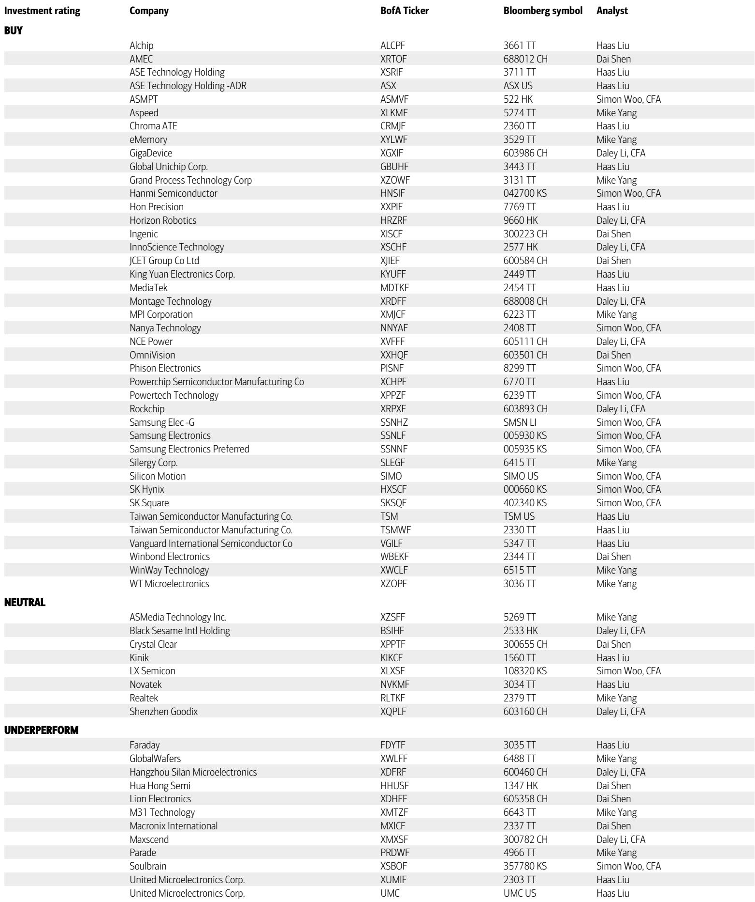
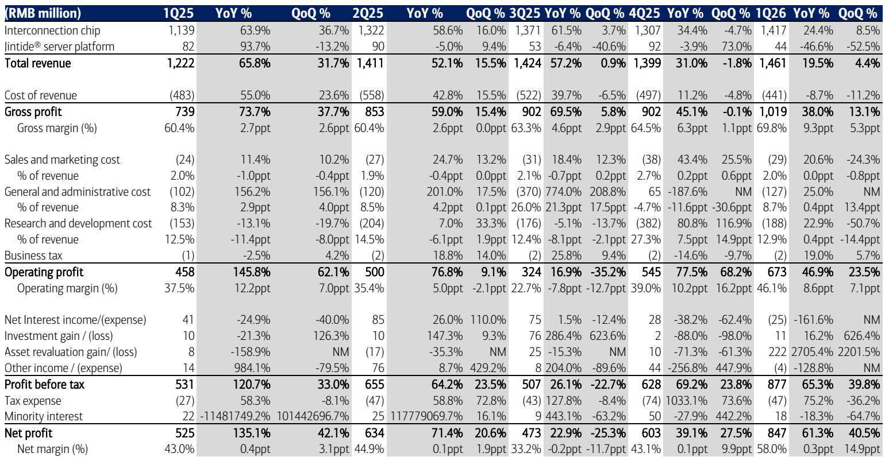
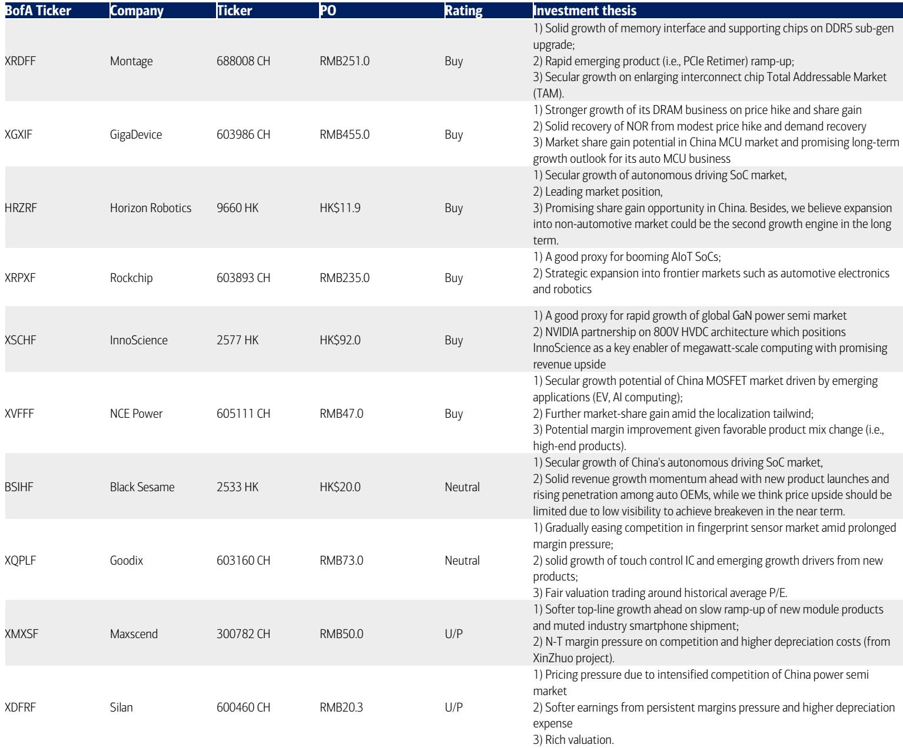

# The Semiconductor Recovery Is Not Uniform: Why AI-Demand Concentration Creates Both Winners and Structural Risks

The first quarter of 2026 has delivered a clear signal to investors in Chinese semiconductors: the sector is accelerating, but the recovery is not being shared equally. Average revenue growth among covered A-share semiconductor companies expanded from roughly 15 percent year-on-year in the fourth quarter of 2025 to approximately 30 percent in the first quarter of 2026. This is a meaningful acceleration, and it is primarily volume-driven, reflecting genuine demand recovery rather than inventory restocking or price inflation. Yet beneath the aggregate improvement lies a divergence that is becoming more pronounced, not less. Companies with direct exposure to AI infrastructure, memory upcycles, and computing demand are outperforming sharply, while those tied to smartphones, power semiconductors, and mature consumer segments continue to struggle. This is not a cyclical upturn that will lift all boats. It is a structural realignment in which capital, design wins, and earnings momentum are concentrating around a narrow set of end-markets. Understanding which companies sit on the right side of this divide is no longer a matter of preference. It is the central analytical task for anyone investing in Chinese semis over the next twelve to eighteen months.

The data from the latest earnings season makes this point starkly. Among A-share companies, Montage and GigaDevice both beat expectations in the first quarter, with GigaDevice posting net profit growth of over 500 percent year-on-year. Rockchip maintained solid momentum with 36 percent revenue growth. At the other end, Goodix saw revenue decline 9 percent year-on-year and missed estimates. Maxscend remained loss-making. Silan missed on both revenue and profit. The pattern is not random. It maps directly onto exposure to AI-related demand, memory content per server, and computing end-markets. The question investors must now answer is whether this divergence will narrow as the cycle matures, or whether it signals a permanent shift in the industry's center of gravity.

The argument of this article is that the divergence is likely to persist and even intensify. The reason is not cyclical but structural. The current capex cycle in cloud and AI infrastructure is of a scale and duration that is reshaping the demand profile for semiconductors in ways that favor a specific set of product categories and business models. Memory interface chips, PCIe retimers, AIoT SoCs, and automotive-grade processors are seeing demand pull from multi-year investment programs by hyperscalers and OEMs. Power semiconductors, smartphone sensors, and legacy consumer chips are not. Investors who treat this as a typical sector upturn risk allocating capital to companies that will underperform for the duration of this cycle.

## The First Quarter Acceleration Confirms That AI-Exposed Segments Are Leading, Not Just Participating

The most important data point in the earnings wrap is not the absolute growth rate but the composition of the beats and misses. In the first quarter of 2026, every company that beat expectations had a direct link to AI infrastructure or memory upcycles. Montage benefited from the ongoing DDR5 penetration cycle and the ramp of PCIe retimers, products that sit directly in the data center interconnect stack. GigaDevice delivered a 119 percent revenue surge, driven by DRAM price hikes and share gains in NOR Flash and MCU markets that are increasingly tied to computing and industrial applications. Rockchip, the AIoT proxy, continued its product ramp into automotive and robotics end-markets.

Conversely, every company that missed expectations was exposed to end-markets that are either mature, competitive, or structurally declining. Goodix and Maxscend are tied to the smartphone supply chain, a market where unit growth is flat and content per phone is under pricing pressure. Silan and NCE Power operate in power semiconductors, a segment that is recovering only gradually and faces persistent margin compression from domestic competition. The miss rate is not random. It is a direct function of end-market exposure.

This pattern matters because it suggests that the recovery is not being driven by a broad-based improvement in industrial activity or consumer spending. It is being driven by a concentrated wave of capital expenditure in AI data centers and computing infrastructure. According to the underlying report, consensus projections for aggregate capex across the top five US cloud vendors show growth of roughly 60 percent year-on-year in calendar 2026, followed by 17 percent growth in 2027. In China, total server capex is estimated to rise 25 percent year-on-year in 2026, with AI server capex growing 31 percent. These are not marginal increases. They represent a multi-year investment cycle that is already reshaping the demand curve for specific semiconductor components.

The implication for investors is straightforward but uncomfortable. The companies that benefit from this capex cycle are not the ones that benefit from a general economic recovery. They are the ones whose products are directly consumed by data center construction, server deployment, and AI inference at scale. Montage's memory interface chips and PCIe retimers, GigaDevice's DRAM and NOR Flash, Rockchip's AIoT SoCs, and Horizon Robotics' automotive processors are all examples of products that sit in the path of this capex wave. Power semiconductors and smartphone sensors do not.

## The Divergence Between Memory and Power Semiconductors Is Structural, Not Cyclical

One of the most striking features of the earnings season is the contrast between memory-exposed companies and power semiconductor companies. Montage and GigaDevice delivered strong results and raised guidance. NCE Power and Silan missed expectations and face ongoing margin pressure. This is not a temporary phenomenon. It reflects a fundamental difference in the demand drivers and competitive dynamics of the two sub-sectors.

Memory and memory-adjacent chips are benefiting from a supercycle that, according to the report's reference to a global memory technology team, is expected to continue into 2027 and 2028. The combination of tight chip supply and strongly rising AI chip demand is creating favorable pricing dynamics and volume growth for companies that produce DRAM, NAND, and the interface chips that connect them to processors. Montage's DDR5 penetration is still in its early to mid-cycle phase, and its emerging products such as PCIe retimers, MRCD, and MDB are opening new addressable markets. GigaDevice is gaining share in DRAM and NOR Flash while expanding its MCU business into automotive applications. These are secular growth stories supported by multi-year investment cycles.

Power semiconductors, by contrast, are facing a different set of conditions. The Chinese power semiconductor market is highly competitive, with numerous domestic players competing on price in mature product categories such as MOSFETs and IGBTs. Demand recovery in power is gradual and tied to industrial and automotive end-markets that are themselves recovering slowly. NCE Power's revenue growth of 15 percent year-on-year in the first quarter, while an improvement from 4 percent in the fourth quarter, is still well below the sector average. Silan missed estimates and faces higher depreciation expenses from its XinZhuo project, which will continue to pressure margins. The structural issue is that power semiconductors are a lower-value-add, higher-competition segment where pricing power is limited and differentiation is difficult.

The so-what for investors is that the divergence between memory and power is likely to persist for the duration of the current capex cycle. Companies with exposure to memory upcycles and data center interconnect have multiple years of demand visibility. Companies in power semiconductors face a more uncertain path to margin recovery and earnings growth.

## H-Share Companies Reveal a Different Risk-Reward Profile: High Growth, Low Profitability

The H-share companies covered in the report present a different analytical challenge. Horizon Robotics, InnoScience, and Black Sesame all delivered strong revenue growth in fiscal 2025, with Horizon growing 58 percent year-on-year, InnoScience growing 46 percent, and Black Sesame growing 73 percent. All three, however, remain loss-making. Horizon Robotics posted a net loss of over 10 billion RMB in fiscal 2025. InnoScience and Black Sesame also reported losses.

This creates a valuation dilemma that the report does not fully resolve. High revenue growth in emerging segments such as autonomous driving SoCs and gallium nitride power semiconductors is clearly attractive. These companies are positioned in markets with long-term structural demand drivers, including ADAS penetration, electric vehicle adoption, and AI data center power architecture. The report highlights Horizon Robotics' expanding design wins and InnoScience's partnership with NVIDIA on 800V HVDC architecture as specific catalysts.

Yet the path to profitability is uncertain. Horizon Robotics' losses are large and growing, driven by high R&D spending and the capital-intensive nature of automotive SoC development. InnoScience and Black Sesame face similar dynamics. The question that the report does not fully answer is whether these companies can achieve operating leverage as they scale, or whether the competitive intensity of their end-markets will keep margins depressed for an extended period.

For investors, this means that H-share semiconductor names require a different analytical framework than their A-share counterparts. The investment case for Montage or GigaDevice rests on visible earnings growth and proven profitability. The case for Horizon or InnoScience rests on optionality and market positioning, with profitability deferred to a later stage. Both approaches can be valid, but they require different risk tolerances and time horizons. The report's top picks include both types, which is intellectually consistent but leaves the reader to decide which framework applies to their own portfolio.

## What the Report Does Not Fully Answer: The Sustainability of AI Demand and the Risk of Over-Investment

For all its analytical rigor, the report leaves several important questions open. The most consequential is the sustainability of the AI capex cycle. The report cites consensus projections for 60 percent growth in US cloud capex in 2026 and 17 percent in 2027, and estimates 25 percent growth in China server capex in 2026. These are large numbers. They assume that the current wave of AI infrastructure investment will continue at an accelerating pace for at least two more years.

What happens if that assumption proves optimistic? If hyperscalers begin to moderate their capex plans in response to slowing AI adoption, regulatory pressure, or diminishing returns on scale, the companies most exposed to data center demand would face a sharp revenue deceleration. Montage's PCIe retimer ramp, GigaDevice's DRAM growth, and Rockchip's AIoT expansion all depend on continued expansion of AI infrastructure. A slowdown would not just reduce growth rates. It would likely trigger inventory corrections and pricing pressure that could compress margins significantly.

The report does not model this scenario or discuss the downside risks in detail. It acknowledges that the power semiconductor recovery is gradual and that smartphone-exposed companies face headwinds, but it does not apply the same critical lens to the AI-exposed names. This is a gap that investors need to fill themselves. The bull case for AI semis is well articulated. The bear case deserves equal attention.

A second open question is the competitive dynamics within China's semiconductor market. The report discusses market share gains and localization tailwinds, but it does not address the risk that increased domestic competition could erode margins across the board. As more Chinese companies enter the memory interface, AIoT SoC, and automotive processor markets, pricing discipline may weaken. The current earnings momentum for companies like Montage and GigaDevice is partly a function of favorable supply-demand dynamics. Those dynamics can change.

## A Decision Framework for Investors: Three Questions to Determine Exposure

Given the divergence in earnings trajectories and the unresolved questions about sustainability, investors need a structured way to evaluate semiconductor companies in the current environment. The following framework is derived from the report's analytical logic and is designed to help readers make their own judgments rather than rely on a single recommendation.

First, assess end-market exposure. The most important determinant of near-term earnings momentum is whether a company's products are consumed by AI infrastructure, data center construction, and computing end-markets, or by smartphones, consumer electronics, and traditional industrial applications. Companies in the first category are likely to benefit from the current capex cycle. Companies in the second category face headwinds that are unlikely to reverse quickly.

Second, evaluate earnings visibility and margin trajectory. Revenue growth is not enough. Investors should ask whether a company is profitable today, and if not, what the path to profitability looks like. Montage and GigaDevice offer visible earnings growth with expanding margins. Horizon Robotics and InnoScience offer high revenue growth but uncertain profitability. Both can be valid investments, but they require different conviction levels and holding periods.

Third, consider the competitive moat. In memory interface, the barriers to entry are relatively high due to the need for certification with major CPU and server platforms. In power semiconductors, the barriers are lower and competition is intense. In automotive SoCs, the barriers are high but the investment required to achieve scale is enormous. Investors should favor companies where the competitive dynamics support pricing power and margin stability over time.

This framework does not produce a single answer. It is designed to help investors ask better questions about each company in their portfolio or watchlist.

## The Next Phase of the Cycle Will Reward Discipline, Not Enthusiasm

The first quarter of 2026 has confirmed that the Chinese semiconductor sector is in a recovery. But it has also confirmed that the recovery is narrow, concentrated, and driven by forces that may not persist indefinitely. The companies that are winning today are those with direct exposure to AI infrastructure and memory upcycles. The companies that are struggling are those tied to mature end-markets with intense competition and limited pricing power.

The temptation for investors will be to extrapolate the current momentum indefinitely. That would be a mistake. The capex cycle that is driving demand today will eventually moderate. When it does, the divergence between winners and laggards may narrow, but it will not reverse. Companies that have used this period to build competitive moats, expand product portfolios, and achieve operating leverage will emerge stronger. Companies that have simply ridden the wave will face a difficult adjustment.

The report provides a valuable snapshot of where the sector stands today. It identifies the companies with the strongest earnings momentum and the most compelling structural stories. What it cannot do is predict the future with certainty. That is why the most important question for investors is not which companies to buy today, but which companies will still be winning when the cycle turns.

This article is for learning and discussion only and does not constitute investment advice.

Join the community to read the full report and review the original charts.

Personal reading notes and learning share only. Not investment advice.

