Asia China

Consumer
Hotels / Leisure / Gaming

# Industry China Hotels

Date
11 May 2026

Initiation of Coverage

# Entering the New Upcycle Phase

Initiating on the hotel sector with a positive outlook and Buy ratings on H World and Atour

We initiate coverage on H World and Atour Lifestyle with Buy ratings, alongside our positive 2026 outlook on the China hotel sector. Despite soft consumer sentiment in China, the hotel industry has demonstrated superior resilience relative to other discretionary categories since 4Q25. RevPAR performance in 1Q26 was robust (+4.3% YoY, per STR). We expect the sector to continue outperforming throughout 2026, remaining a unique bright spot among all consumer categories.

We are positive on H World (Target Price: US\$56/HK\$43.8). H World has been successfully navigating a clear, long-term growth trajectory fueled by a strategic shift toward an asset-light model and continuous product upgrades across its multi-brand portfolio. By leveraging a robust membership ecosystem, the company is well-positioned to capitalize on the industry's cyclical upcycle. For a 3-year view, we forecast H World to generate a 7% revenue CAGR and a 17% adjusted net profit CAGR from 2026 to 2028, reflecting inherent resilience and superior operational efficiency compared to other discretionary spending categories. The current share price trades at 18x one-year forward P/E based on our 2026 adj net profit, a valuation we consider undemanding given H World's highly visible long-term growth trajectory.

We have a positive stance on Atour Lifestyle( Target Price: US\$45), a high-growth "dual-engine" brand that is redefining the mid-to-high-end segment through its unique integration of hospitality and retail. With a relatively small footprint of 2,015 hotels as of 2025, Atour possesses significant "expansion alpha" potential compared to 10,000-unit industry giants, providing higher visibility for its goal of 3,000 hotels by 2028. Atour's unique retail exposure, combined with an asset-light scaling strategy, underpins our forecast of a 17% revenue CAGR and an 18% adjusted net profit CAGR from 2026 to 2028. Our proprietary trackers indicate that Atour's new retail business is significantly outperforming market expectations, with 1Q26 sales surging 45% YoY against conservative full-year guidance of 25-30%. Despite its high visibility for delivering high-teens growth, Atour's share price trades at a 15x one-year forward P/E on our 2026 adj net profit, reflecting cautious market sentiment regarding its retail business and near-term RevPAR fluctuations, which we view as an attractive entry point.

Sammi Xu
Research Analyst
+852-2203-5415

# Hotel industry enters upcycle as oversupply begins to fade

The core of our positive thesis on the China hotel sector is the shift toward balanced supply-demand dynamics in 2026. We foresee a structural transition from the oversupply environment that previously triggered irrational price competition to a more favorable operating environment, characterized by slower supply growth (+2.3% in 1Q26) and a solid demand rebound (+3.6% in 1Q26). This deceleration in supply is reinforced by a visible slowdown in new openings from major players in 4Q25. We expect this shifting landscape to bolster industry ADR by mitigating the oversupply pressures that fueled aggressive price wars throughout 2024 and 1H25.

Demand across all sub-sectors also remains constructive: business travel has stabilized following the conclusion of budget downgrades in 2025; leisure travel continues to demonstrate resilience as consumers pivot spending from goods to experiences, further supported by favorable holiday policies in 2026. Additionally, inbound tourism is expected to continue growing (2025: 82 million arrivals), driven by expanded visa-free policies, with arrivals from Hong Kong already exceeding 2019 levels and expected to continue their upward trend.

Following a multi-year downcycle since Covid-19, we believe industry RevPAR bottomed in 4Q25 and has now entered a structural upcycle. While we project full-year industry RevPAR growth of 2% for 2026 (+4.3% YTD trend), we expect market leaders to outpace the broader sector driven by ongoing consolidation and superior operational execution. Therefore, we believe the combination of improving RevPAR and accelerating industry consolidation provides a clear path for industry leaders to deliver stable, high-quality net profit growth.

# Near-term RevPar volatility creates attractive opportunity

We believe that recent RevPAR fluctuations and the impact on consumer sentiment due to geopolitical tensions and elevated fuel costs creates an attractive entry point for investors. While some investors may highlight near-term traffic weakness, specifically the impact of higher airfares on Labor Day holiday data, we view these recent disruptions as non-threatening to our full-year thesis. Our positive view is supported by the unchanged structural shift of leisure travelers towards experiences over goods, coupled with improving business demand during non-holiday periods, and a favorable low base in 2Q-3Q25.

Our medium-term optimism remains anchored by our view of a clear, cyclical bottom and accelerating consolidation led by industry leaders. These structural factors not only enhance the resilience of major hotel groups relative to other consumer categories but also provide high visibility, in our view, to deliver sustainable, double-digit EPS growth over the next three years.

# Risk Summary

Our thesis is subject to several key risks 1) Macroeconomic Headwinds and Demand Weakness in China; 2) Intensifying Competitive Landscape; 3) Franchisee Management and Growth Execution; 4) Retail/E-commerce Execution and Competitive Pressures; 5) Geopolitical and Macroeconomic Factors

# China hotel sector: structural upcycle commences as oversupply fades

The primary driver of our positive outlook on the China hotel sector is the anticipated shift toward more balanced supply-demand dynamics in 2026, which we believe marks a structural turning point for the industry's upcycle. As industry supply growth begins to decelerate and demand rebounds, the sector is well-positioned for a sustainable recovery starting in 2026.

# Slower industry supply since 4Q25

Following a period of significant oversupply between 2023 and 2025, our channel checks indicate that hotel supply growth began to decelerate as of late 2025. The earlier supply surge has absorbed the property pipeline accumulated during the Covid-19 pandemic. Meanwhile, the ongoing downturn in the commercial real estate sector has also constrained the availability of new assets suitable for hotel development.

For properties launched during the recent supply surge, weak RevPAR and unhealthy price competition among independent hotels has severely pressured individual operator profitability. This diminished return on investment, exacerbated by intense price competition for traffic, has significantly reduced the incentive for franchisees to open new hotels. Thus, the China hotel industry is starting to move toward a more favorable competitive landscape with supply growth gradually slowing in 2026, resulting in a more balanced supply demand dynamic.

Our expectation for disciplined supply growth in 2026 is reinforced by STR industry data. Following a multi-year downcycle and oversupply, the industry enters 2026 with disciplined supply growth of +2.3% in 1Q26, trailing a robust demand growth rate of +3.6% according to STR. This evolving supply-demand imbalance is expected to bolster industry ADR by mitigating the oversupply pressures that previously triggered aggressive price wars.

# Leading player expansion guidance

We have seen a decelerating pace of new openings from major players such as H World, Jinjiang, and Atour since 4Q25. Beyond the moderated growth of these market leaders, our channel checks indicate an even more pronounced slowdown in the independent hotel segment. This broader deceleration across the independent landscape implies a systemic tightening of industry supply. As independent players either exit the market or stall their expansion, irrational price volatility is expected to diminish.

■ H World: Target 2,200-2,300 new hotels. Expects 2%-6% revenue growth (or 5-9% exclucing DH)   
- Jinjiang: Targets \~1,200 new stores.   
Atour: Target similar to 2025 hotel new adds number (500 new hotels). Expects revenue to increase by 20-24%.

Figure 1: China hotels: industry new hotel add (gross) 

<table><tr><td rowspan="2"></td><td colspan="2">2023</td><td colspan="2">2024</td><td colspan="2">2025</td><td>2026</td></tr><tr><td>Planned</td><td>Actual</td><td>Planned</td><td>Actual</td><td>Planned</td><td>Actual</td><td>Planned</td></tr><tr><td>H World</td><td>1400</td><td>1641</td><td>1800</td><td>2430</td><td>2300</td><td>2444</td><td>2200-2300</td></tr><tr><td>Jin Jiang</td><td>1200</td><td>1407</td><td>1200</td><td>1515</td><td>1300</td><td>1314</td><td>1200</td></tr><tr><td>Atour</td><td>280</td><td>289</td><td>360</td><td>471</td><td>500</td><td>488</td><td>500</td></tr></table>

Source : Company data, DB estimate

Within the current industry landscape, we also observe a shift from economy hotels toward the mid-to-high-end segments, driven by consumers who increasingly prioritize the service consistency and quality standards that independent operators struggle to maintain. This flight to quality has transformed the nature of industry growth; we estimate that approximately 30% of new hotel supply now stems from the rebranding of existing properties rather than new construction. As independent hotels and smaller brands face severe profitability challenges, they are increasingly seeking stability by rebranding hotels under established hotel groups. This structural migration provides industry leaders with a unique opportunity to accelerate expansion through industry consolidation.

Figure 2: China hotel: hotel contribution by segment   
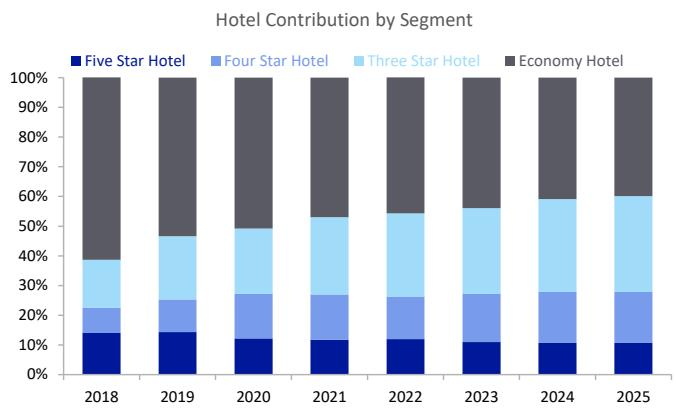

bar_stacked

| Year | Five Star Hotel | Four Star Hotel | Three Star Hotel | Economy Hotel |
|------|-----------------|-----------------|------------------|---------------|
| 2018 | 14%             | 8%              | 16%              | 57%           |
| 2019 | 14%             | 10%             | 20%              | 53%           |
| 2020 | 12%             | 16%             | 20%              | 50%           |
| 2021 | 12%             | 16%             | 23%              | 48%           |
| 2022 | 12%             | 16%             | 26%              | 46%           |
| 2023 | 11%             | 17%             | 28%              | 44%           |
| 2024 | 11%             | 18%             | 30%              | 42%           |
| 2025 | 11%             | 19%             | 32%              | 40%           |

Source : DB estimate

# Demand recovery across all sUBSegments further supports industry growth

Beyond the slower supply growth forecasted for 2026, we also anticipate a positive turn in demand across all segments, creating a better-than-feared outlook for the China hotel industry.

Business Travel: Stable growth with companies maintaining or increasing budgets, with most budget downgrades completed.   
- Leisure Travel: Growth has remained strong since 2023, driven by a shift in consumer spending toward experiences. We have seen strong traffic during the holidays, reflecting robust leisure travel demand, which is further supported by more favorable holiday polices (longer & more holidays in China).   
■ Conferences & Entertainment: We see demand stabilizing compared to previous downcycles, supported by a recovery in China-based exhibitions and the ongoing popularity of concerts.   
Inbound Tourism: Arrivals of foreign tourists in 2026 are expected to surge (from 82 million in 2025) due to visa-free policies and positive social media

reviews. Hong Kong, Macao, and Taiwan tourist arrivals have already surpassed the 2019 level, and the trend is expected to continue to grow in 2026.

Figure 3: China hotel: inbound travel demand from foreign visitors   
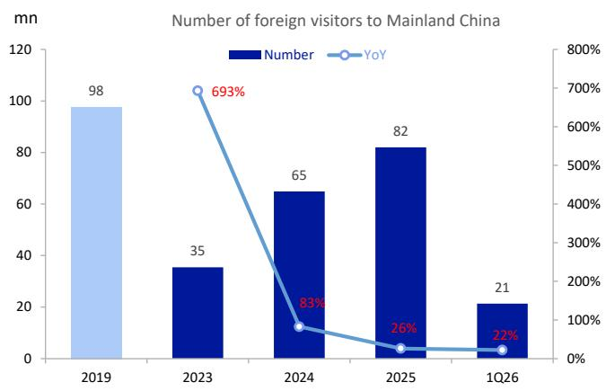

bar_line

Number of foreign visitors to Mainland China
| Year | Number (mn) | YoY (%) |
| :--- | :--- | :--- |
| 2019 | 98 | |
| 2023 | 35 | 693 |
| 2024 | 65 | 83 |
| 2025 | 82 | 26 |
| 1Q26 | 21 | 22 |

Source : Company data, DB estimate

Figure 4: China hotel: inbound travel demand from HK & Macau visitors   
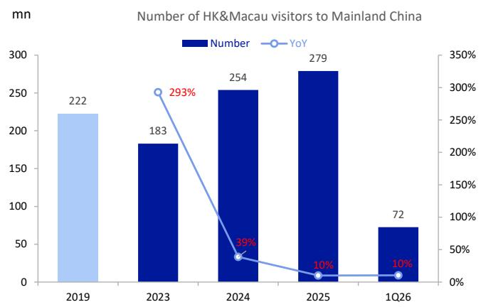

bar_line

Number of HK&Macau visitors to Mainland China
| Year | Number (mn) | YoY (%) |
| :--- | :--- | :--- |
| 2019 | 222 | |
| 2023 | 183 | 293 |
| 2024 | 254 | 39 |
| 2025 | 279 | 10 |
| 1Q26 | 72 | 10 |

Source : Company data, DB estimate

# 2026 RevPAR growth forecast

The industry's full-year RevPAR is projected to achieve 2% YoY growth in 2026 (YTD: +4.3%), a significant improvement from the 2024-2025 declines. Thus, we foresee 2026 marking a turnaround year for the China hotel industry, signaling the beginning of a new upcycle. Our forecast is underpinned by:

ADR Trend: Unlike previous cycles where occupancy led the recovery, the current RevPAR upturn is primarily driven by ADR expansion as oversupply pressures gradually recede. Since 4Q25, the industry has reached a critical consensus: aggressive price discounting during off-peak seasons fails to meaningfully stimulate demand, serving only to erode the profitability of all participants. This shift in strategy has led industry leaders to prioritize price, ensuring more sustainable operating margins and brand image. Furthermore, increasing chain penetration and continuous product upgrades—such as Ji 5.0 and Hanting 4.0—have significantly enhanced the pricing power of market leaders. We observed stabilizing ADR trends among top-tier chains like H World and Atour starting in 4Q25. This is corroborated by STR industry data, which indicates positive ADR growth since 4Q25, distinguishing the hotel sector from other consumer categories that remain mired in margin-dilutive price competition.   
Occupancy Ratio Trend: While Occupancy (OCC) has trailed ADR performance, we expect continued improvements in both leisure and business traffic to drive a recovery throughout 2026. Holiday periods remain a standout strength, bolstered by favorable government holiday policies and a structural shift in consumer spending toward experiences. However, we believe the critical catalyst for a sustained RevPAR uptrend lies in the stabilization of business demand. A consistent recovery in corporate travel would provide the necessary foundation to lift occupancy rates during non-peak periods, significantly improving the industry's overall operating leverage.

Figure 5:China hotel: Occ trend by STR   
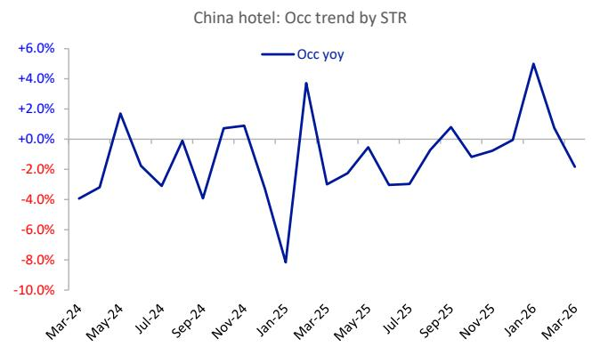

line

| Month    | Occ yoy |
| -------- | ------- |
| Mar-24   | -4.0%   |
| May-24   | +2.0%   |
| Jul-24   | -3.0%   |
| Sep-24   | -4.0%   |
| Nov-24   | +1.0%   |
| Jan-25   | -8.0%   |
| Mar-25   | +4.0%   |
| May-25   | -3.0%   |
| Jul-25   | -3.0%   |
| Sep-25   | +1.0%   |
| Nov-25   | -1.0%   |
| Jan-26   | +5.0%   |
| Mar-26   | -2.0%   |

Source : STR, DB estimate

Figure 6: China hotel: ADR trend by STR   
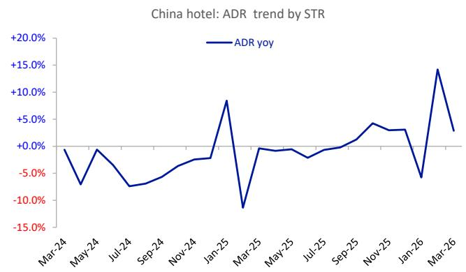

line

| Month   | ADR yoy |
|---------|---------|
| Mar-24  | -0.5%   |
| May-24  | -7.5%   |
| Jul-24  | -8.0%   |
| Sep-24  | -6.0%   |
| Nov-24  | -4.0%   |
| Jan-25  | -3.0%   |
| Mar-25  | -12.0%  |
| May-25  | -0.5%   |
| Jul-25  | -1.0%   |
| Sep-25  | -0.5%   |
| Nov-25  | 3.0%    |
| Jan-26  | -5.0%   |
| Mar-26  | +15.0%  |

Source : STR, DB estimate

Figure 7: China Hotel: Revpar Trend by STR   
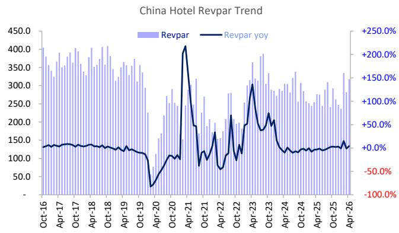

line

| Date   | Revpar | Revpar yoy |
|--------|--------|------------|
| Oct-16 | 400.0  | 0.0%       |
| Apr-17 | 380.0  | 0.0%       |
| Oct-17 | 400.0  | 0.0%       |
| Apr-18 | 410.0  | 0.0%       |
| Oct-18 | 400.0  | 0.0%       |
| Apr-19 | 380.0  | 0.0%       |
| Oct-19 | 350.0  | 0.0%       |
| Apr-20 | 100.0  | -50.0%     |
| Oct-20 | 250.0  | +250.0%    |
| Apr-21 | 400.0  | +250.0%    |
| Oct-21 | 250.0  | -50.0%     |
| Apr-22 | 280.0  | +50.0%     |
| Oct-22 | 300.0  | +150.0%    |
| Apr-23 | 350.0  | +150.0%    |
| Oct-23 | 380.0  | +150.0%    |
| Apr-24 | 350.0  | +50.0%     |
| Oct-24 | 320.0  | +50.0%     |
| Apr-25 | 330.0  | +50.0%     |
| Oct-25 | 340.0  | +50.0%     |
| Apr-26 | 320.0  | +50.0%     |

Source : STR, DB estimate

Figure 8: China Hotel: Supply and Demand Trend   
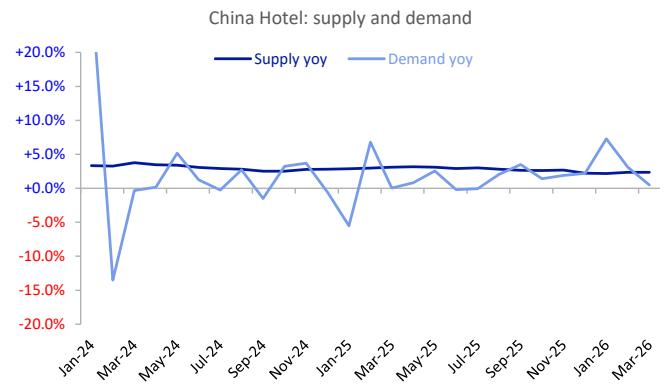

line

| Month   | Supply yoy | Demand yoy |
|---------|------------|------------|
| Jan-24  | ~3.0%      | ~20.0%     |
| Mar-24  | ~3.0%      | ~-15.0%    |
| May-24  | ~3.0%      | ~5.0%      |
| Jul-24  | ~3.0%      | ~-1.0%     |
| Sep-24  | ~3.0%      | ~-3.0%     |
| Nov-24  | ~3.0%      | ~4.0%      |
| Jan-25  | ~3.0%      | ~-7.0%     |
| Mar-25  | ~3.0%      | ~7.0%      |
| May-25  | ~3.0%      | ~-1.0%     |
| Jul-25  | ~3.0%      | ~-1.0%     |
| Sep-25  | ~3.0%      | ~4.0%      |
| Nov-25  | ~3.0%      | ~-1.0%     |
| Jan-26  | ~3.0%      | ~8.0%      |
| Mar-26  | ~3.0%      | ~-1.0%     |

Source : STR, DB estimate

# Potential Impact of OTA anti-monopoly measures

Based on our discussions with leading hotel groups, we believe the operational impact of recent anti-monopoly investigations into Trip.com will be limited. While regulators may scrutinize current commission rates (typically 25–30%), Trip.com is likely to mitigate any direct fee caps by leveraging algorithmic optimizations and expanding its suite of value-added services. While it is possible that overall commission rates may decline slightly, we do not anticipate a significant structural change. Furthermore, major hotel groups like H World have proactively insulated themselves from platform volatility by strictly managing their OTA reliance within a 20–25% range.

Regarding the rise of AI-generated itinerary recommendations, hotel operators anticipate a minimal long-term threat to their business models. Although consumers are increasingly using AI tools for hotel discovery, industry leaders believe that high brand equity and entrenched membership reward programs will continue to drive direct bookings. By focusing on superior customer experiences and loyalty ecosystems, major hotel groups remain well-positioned to maintain customer retention, regardless of the underlying search technology.

# Rating

# Buy

# Asia

# China

# Consumer

# Hotels / Leisure / Gaming

# Company

# H World

# Reuters

# HTHT.OQ

# Bloomberg

# HTHT US

# Driving Compounding Growth Amidst Industry Consolidation

# Initiate with Buy: a structural beneficiary in a new upcycle

We believe the industry bottomed in 4Q25 and is now entering a structural upcycle. H World is well-positioned to capitalize on this recovery and the ongoing market consolidation as a premier long-term compounder. Beyond macro tailwinds, the company's internal catalysts, including its continuous product upgrades, high margin asset light transition, and a strategic mix shift toward mid-to-high-end hotels, should help drive a more resilient RevPAR outlook compared to the industry. We expect H World to outpace industry benchmarks, with high visibility for robust double-digit net profit growth.

Our DCF-based target price of US\$56 / HK\$43.8 implies a 21x one-year forward P/E. Our valuation assumes an 8% WACC and a 0% terminal growth rate. With the stock currently trading at an attractive 18x one-year forward P/E based on our 2026 adj net profit forecast, we believe this offers a compelling entry point for investors seeking to capitalize on the industry's cyclical bottom, while gaining exposure to a best-in-class China consumer compounder.

# Stable openings and efficiency gains drive 3-year double-digit net profit growth expectations

In 2026, the synergy of robust leisure demand and stabilized business travel has established a constructive foundation for the China hotel sector. We forecast H World's 2026 revenue growth at 7.4%, exceeding management's guidance of 2–6%. This estimate is underpinned by a robust 18.6% YoY growth forecast in the M&F (Manachised & Franchised) segment, which significantly surpasses management's 12–16% target. Adjusted net profit is projected to grow by 23% in 2026, fueled by a continuous margin expansion trend.

Over a three-year horizon (2025–2028E), we project H World to deliver a 7% revenue CAGR and a 17% adjusted net profit CAGR. Our optimistic outlook is primarily driven by the increasing contribution from high-margin M&F hotels. We estimate that Gross Operating Profit (GOP) margins for M&F operations can reach 65%, compared to just 21% for L&O (Leased & Owned) hotels; thus, this structural shift toward an asset-light model will continue to enhance H World's margin profile over the medium term. Furthermore, H World possesses high growth visibility in new hotel additions, attributed to strong franchisee traction and robust membership traffic. This helps provide a resilient pipeline that supports the company's long-term growth trajectory toward its target of 20,000–30,000 hotels.

# Sammi Xu

Research Analyst

+852-2203-5415

<table><tr><td>Price at 7 May 2026 (USD)</td><td>47.80</td></tr></table>

<table><tr><td>Price target - 12mth (USD)</td><td>56.00</td></tr></table>

<table><tr><td>52-week range (USD)</td><td>56.06 - 30.48</td></tr></table>

<table><tr><td>Unavailable</td><td>26,626</td></tr></table>

Price/price relative   
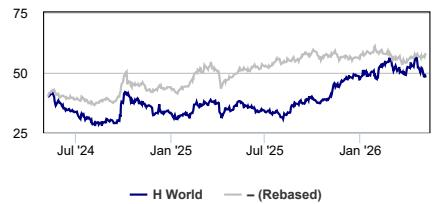

line

| Date   | H World | (Rebased) |
|--------|---------|-----------|
| Jul '24| 35      | 40        |
| Jan '25| 30      | 50        |
| Jul '25| 35      | 55        |
| Jan '26| 50      | 60        |

<table><tr><td>Performance (%)</td><td>1m</td><td>3m</td><td>12m</td></tr><tr><td>Absolute</td><td>-7.6</td><td>-8.0</td><td>34.4</td></tr><tr><td>HANG SENG INDEX</td><td>6.0</td><td>0.2</td><td>17.3</td></tr><tr><td colspan="4">Source: DB</td></tr></table>

Key indicators (FY1) 

<table><tr><td>ROE (%)</td><td>36.3</td></tr><tr><td>Net debt/equity (%)</td><td>-61.7</td></tr><tr><td>Book value/share (CNY)</td><td>60.17</td></tr><tr><td>Price/book (x)</td><td>5.4</td></tr><tr><td>Net interest cover (x)</td><td>171.4</td></tr><tr><td>Operating profit margin (%)</td><td>29.5</td></tr><tr><td colspan="2">Source: DB</td></tr></table>

Comparatives 

<table><tr><td colspan="3">H World (HTHT.OQ),USD47.80</td><td>Buy</td></tr><tr><td></td><td>2025A</td><td>2026E</td><td>2027E</td></tr><tr><td>P/E (x)</td><td>17.5</td><td>17.3</td><td>14.7</td></tr><tr><td>EV/EBITDA (x)</td><td>8.2</td><td>8.9</td><td>7.1</td></tr><tr><td>Price/book (x)</td><td>8.1</td><td>5.4</td><td>4.0</td></tr><tr><td colspan="4">Source: DB</td></tr></table>

# 1Q26 preview

We forecast H World's total revenue to grow by 8.8% YoY, driven by a robust 10.7% revenue increase for Legacy-Huazhu, which offsets a marginal 0.1% revenue decline for Legacy-DH. Adjusted net profit is projected to reach RMB 1,074 million, representing an 18.3% adjusted net margin and a significant 39% YoY growth. H World's result expectations are primarily propelled by the strong 1Q26 RevPar trend and sustained margin improvement trend established since 2025. Market attention is shifting toward 2Q26 demand, particularly following the impact of elevated fuel surcharges on airfares. We look forward to further insights on recent trends during the upcoming earnings call.

<table><tr><td colspan="6">Forecasts and ratios</td></tr><tr><td>Year End Dec 31</td><td>2024A</td><td>2025A</td><td>2026E</td><td>2027E</td><td>2028E</td></tr><tr><td>Sales (CNYm)</td><td>23,891.0</td><td>25,307.0</td><td>27,188.9</td><td>29,281.7</td><td>31,257.9</td></tr><tr><td>EBITDA (CNYm)</td><td>6,150.0</td><td>8,612.0</td><td>9,257.1</td><td>10,513.8</td><td>11,525.0</td></tr><tr><td>Reported NPAT (CNYm)</td><td>3,048.0</td><td>5,080.0</td><td>5,652.5</td><td>6,587.2</td><td>7,314.0</td></tr><tr><td>Reported EPS FD(CNY)</td><td>9.30</td><td>15.64</td><td>17.50</td><td>20.49</td><td>22.75</td></tr><tr><td>DB EPS FD(CNY)</td><td>11.34</td><td>15.21</td><td>18.83</td><td>22.08</td><td>24.68</td></tr><tr><td>OLD DB EPS FD(CNY)</td><td>-</td><td>-</td><td>-</td><td>-</td><td>-</td></tr><tr><td>% Change</td><td>-</td><td>-</td><td>-</td><td>-</td><td>-</td></tr><tr><td>DB EPS growth (%)</td><td>8.2</td><td>34.2</td><td>23.8</td><td>17.2</td><td>11.8</td></tr><tr><td>PER (x)</td><td>22.1</td><td>17.5</td><td>17.3</td><td>14.7</td><td>13.2</td></tr><tr><td>EV/EBITDA (x)</td><td>11.4</td><td>8.2</td><td>8.9</td><td>7.1</td><td>5.8</td></tr><tr><td>DPS (net) (CNY)</td><td>1.60</td><td>2.11</td><td>1.69</td><td>1.69</td><td>1.69</td></tr><tr><td>Yield (net) (%)</td><td>0.6</td><td>0.8</td><td>0.5</td><td>0.5</td><td>0.5</td></tr></table>

Source: DB estimates, company data

# H World: a rapidly growing multi-brand hotel group with deep roots in China

Founded in 2005, H World is a leading and rapidly growing multi-brand hotel group, operating 12,858 hotels as of the end of 2025 in 21 countries under Huazhu and Deutsche Hospitality. This portfolio includes 573 leased and operated (L&O) hotels and 12,285 manachised and franchised (M&F) properties, including multiple-brands in different price segments.

H World Group stands out as one of China's few hotel chain operators to have successfully developed a multi-brand portfolio covering the full spectrum of market segments. H World's journey began with its entry into the economy segment via the Hanting brand, followed by a strategic expansion into multi-brand offerings and its current penetration of the mid-to-high-end market. With 20 years of operations, H World's consistent growth underscores its deep understanding of Chinese hospitality and its long-term strategic vision as a global operator. Its core brands, Hanting and Ji Hotel, have surpassed 4,556 and 3,565 hotels respectively, establishing themselves as benchmark brands for their target price segments.

To enhance its global footprint, H World officially completed its 100% equity acquisition of Deutsche Hospitality (DH) on January 2, 2020. This strategic move transformed H World into a global player by adding five major European brands—including the luxury Steigenberger Hotels & Resorts and the urban IntercityHotel—to its portfolio.

Figure 9: H World: brand portfolios 

<table><tr><td>Mass Market</td><td>Select</td><td>Lifestyle</td><td>Upscale</td><td>Extended Stay</td></tr><tr><td>汉庭酒店
HANTONG HOTEL</td><td>全季大观
SHANG JI HOTEL</td><td>MERCURE HOTELS
美派酒店</td><td>宋品
SONG HOTEL</td><td>城家公寓
CIA APARTMENT</td></tr><tr><td>你好酒店</td><td>桔子水晶酒店</td><td>漫心府
CITY HOTEL</td><td>STEIGENBERGER ICONNE
施柏阁大厦</td><td>城家公寓酒店
CIA APARTHOTEL</td></tr><tr><td>汉庭快捷
HANTONG HOTEL</td><td>城际酒店
Intercity Hotel</td><td>速电酒店
CITY HOTEL</td><td>施柏阁
STEIGENBERGER</td><td>suize place
瑞立斯公寓酒店</td></tr><tr><td>海友酒店</td><td>全季酒店
LI HOTEL</td><td>CltiGO
欢闻酒店</td><td>裕玥酒店
SOYA HOTEL</td><td>CICCO HOUSE
欢阁服务公寓</td></tr><tr><td>星程酒店
STARWAY HOTEL</td><td>ORANGE
桔子酒店</td><td>NOVOTEL</td><td>花间堂
ALISSON HOUSE</td><td>CMAUX | 城家奢华公寓</td></tr><tr><td></td><td>美仑酒店
MADISON</td><td>碧碧
+BEATS+</td><td>MaxX
美仑美食酒店</td><td></td></tr><tr><td></td><td>ibis</td><td>JAZ
BEEY CITY</td><td></td><td></td></tr></table>

Source : company data

# H World's successful multi-brand transition

H World's China operations – Huazhu began with its flagship Hanting as an economy hotel brand but strategically evolved into a multi-brand portfolio, moving progressively into the mid-to-high-end segments. By 2025, mid-to-high-end hotels had surpassed economy hotels in proportional representation, driving continuous ADR improvements through Huazhu's portfolio mix upgrades. This strategic shift, leveraging Huazhu's foundational strength in brand image and customer loyalty, continues to drive ADR growth and help reduce the impact to H World from the macro environment in a downcycle.

Figure 10: H World: hotel number breakdown for China business   
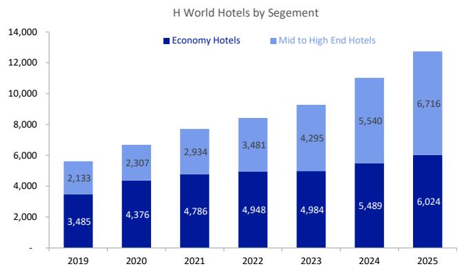

bar_stacked

| Year | Economy Hotels | Mid to High End Hotels |
| ---- | -------------- | ---------------------- |
| 2019 | 3,485          | 2,133                  |
| 2020 | 4,376          | 2,307                  |
| 2021 | 4,786          | 2,934                  |
| 2022 | 4,948          | 3,481                  |
| 2023 | 4,984          | 4,295                  |
| 2024 | 5,489          | 5,540                  |
| 2025 | 6,024          | 6,716                  |

Source : Company data, DB estimate

Figure 11: H World: hotel contribution in China   
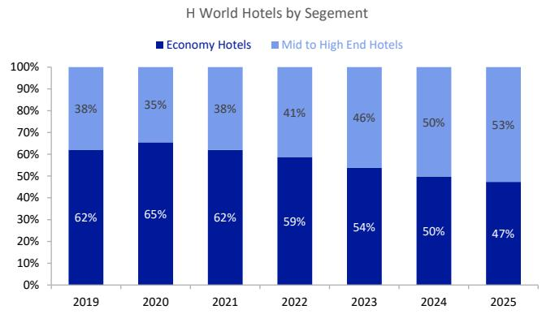

bar_stacked

| Year | Economy Hotels | Mid to High End Hotels |
| ---- | -------------- | ---------------------- |
| 2019 | 62%            | 38%                    |
| 2020 | 65%            | 35%                    |
| 2021 | 62%            | 38%                    |
| 2022 | 59%            | 41%                    |
| 2023 | 54%            | 46%                    |
| 2024 | 50%            | 50%                    |
| 2025 | 47%            | 53%                    |

Source : Company data, DB estimate

Driven by its solid execution and a diversified multi-brand portfolio, H World has consistently outpaced the industry's RevPAR recovery in both upcycles and downcycles. The company observed a visible RevPAR rebound starting in 3Q25, supported by higher ADR from a strategic mix shift toward mid-to-high-end hotels and continuous product upgrades of its core brands. We expect this momentum to carry into 1Q26, bolstered by a more favorable industry demand outlook across both leisure and business segments compared to the previous downcycle. Thus, we factor in both ADR improvement and better occupancy, driving continuous RevPar growth in 2026.

Figure 12: H World: Revpar trend   
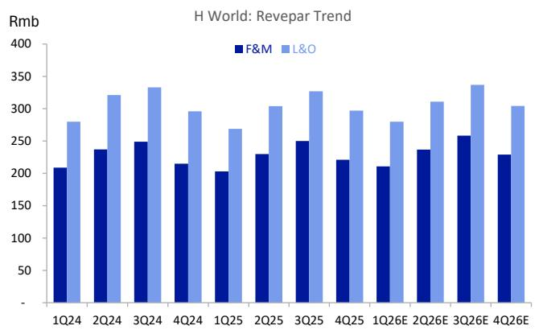

bar

| Quarter | F&M  | L&O  |
|---------|------|------|
| 1Q24    | 208  | 280  |
| 2Q24    | 238  | 320  |
| 3Q24    | 250  | 335  |
| 4Q24    | 215  | 295  |
| 1Q25    | 203  | 270  |
| 2Q25    | 230  | 305  |
| 3Q25    | 250  | 330  |
| 4Q25    | 220  | 295  |
| 1Q26E   | 210  | 280  |
| 2Q26E   | 235  | 310  |
| 3Q26E   | 260  | 340  |
| 4Q26E   | 230  | 305  |

Source : Company data, DB estimate

Figure 13:H World: Revpar YoY   
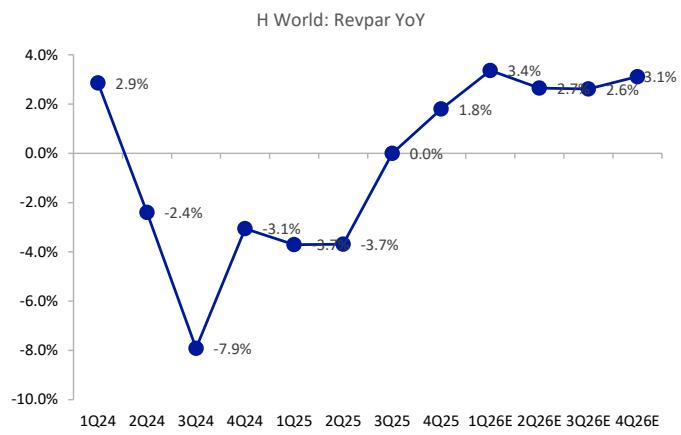

line

| Quarter | Revpar YoY |
| ------- | ---------- |
| 1Q24    | 2.9%       |
| 2Q24    | -2.4%      |
| 3Q24    | -7.9%      |
| 4Q24    | -3.1%      |
| 1Q25    | -3.7%      |
| 2Q25    | -3.7%      |
| 3Q25    | 0.0%       |
| 4Q25    | 1.8%       |
| 1Q26E   | 3.4%       |
| 2Q26E   | 2.7%       |
| 3Q26E   | 2.6%       |
| 4Q26E   | 3.1%       |

Source : Company data, DB estimate

Figure 14: H World: ADR trend   
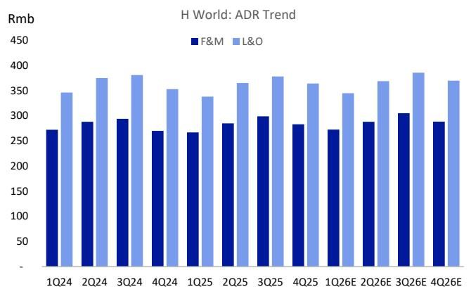

bar

H World: ADR Trend
| Quarter | F&M (Rmb) | L&O (Rmb) |
| :--- | :--- | :--- |
| 1Q24 | 273 | 345 |
| 2Q24 | 288 | 375 |
| 3Q24 | 293 | 380 |
| 4Q24 | 270 | 355 |
| 1Q25 | 267 | 338 |
| 2Q25 | 285 | 365 |
| 3Q25 | 298 | 378 |
| 4Q25 | 283 | 363 |
| 1Q26E | 274 | 345 |
| 2Q26E | 288 | 370 |
| 3Q26E | 305 | 385 |
| 4Q26E | 288 | 370 |

Source : Company data, DB estimate

Figure 15: H World: ADR YoY   
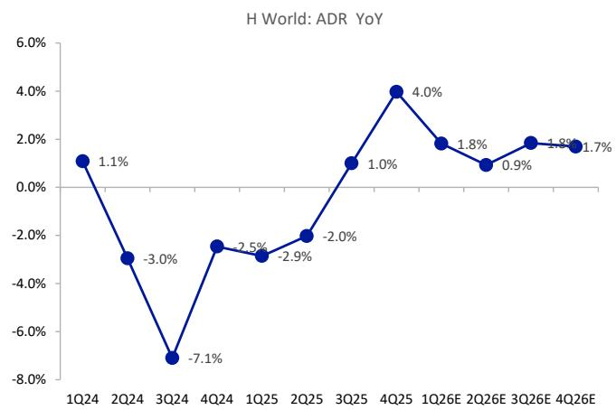

line

| Quarter | H World: ADR YoY |
| ------- | ---------------- |
| 1Q24    | 1.1%             |
| 2Q24    | -3.0%            |
| 3Q24    | -7.1%            |
| 4Q24    | -2.5%            |
| 1Q25    | -2.9%            |
| 2Q25    | -2.0%            |
| 3Q25    | 1.0%             |
| 4Q25    | 4.0%             |
| 1Q26E   | 1.8%             |
| 2Q26E   | 0.9%             |
| 3Q26E   | 1.8%             |
| 4Q26E   | 1.7%             |

Source : Company data, DB estimate

Figure 16: H World: occupancy ratio trend   
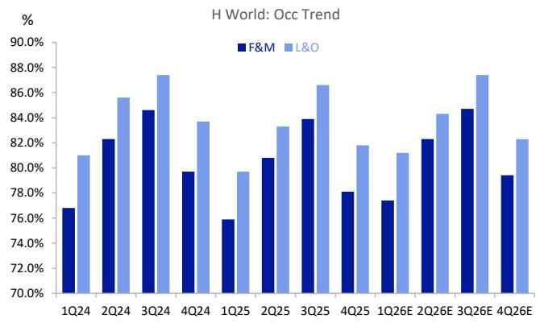

bar

H World: Occ Trend
| Quarter | F&M (%) | L&O (%) |
| :--- | :--- | :--- |
| 1Q24 | 76.8 | 80.9 |
| 2Q24 | 82.3 | 85.7 |
| 3Q24 | 84.6 | 87.5 |
| 4Q24 | 79.8 | 83.7 |
| 1Q25 | 75.9 | 79.7 |
| 2Q25 | 80.8 | 83.3 |
| 3Q25 | 83.9 | 86.6 |
| 4Q25 | 77.9 | 81.8 |
| 1Q26E | 77.2 | 81.2 |
| 2Q26E | 82.3 | 84.3 |
| 3Q26E | 84.7 | 87.5 |
| 4Q26E | 79.5 | 82.3 |

Source : Company data, DB estimate

Figure 17: H World: occupancy ratio YoY   
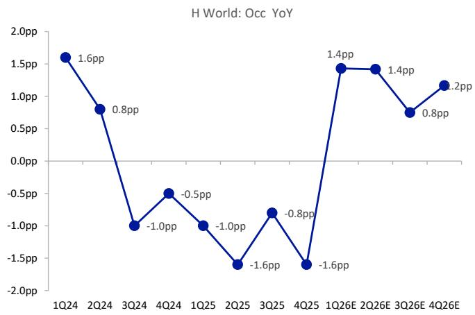

line

| Quarter | Value |
| ------- | ----- |
| 1Q24    | 1.6pp |
| 2Q24    | 0.8pp |
| 3Q24    | -1.0pp |
| 4Q24    | -0.5pp |
| 1Q25    | -1.0pp |
| 2Q25    | -1.6pp |
| 3Q25    | -0.8pp |
| 4Q25    | -1.6pp |
| 1Q26E   | 1.4pp |
| 2Q26E   | 1.4pp |
| 3Q26E   | 0.8pp |
| 4Q26E   | 1.2pp |

Source : Company data, DB estimate

# Continues to penetrate into lower-tier Cities

H World strategically leverages two pillars to fuel its growth: ongoing hotel mix upgrades towards mid to high end categories and expansion into lower-tier Cities. Significantly, more than 50% of its pipeline hotels were located in Tier 3 and below Cities as of 2025. Management identifies these regions as vast white spaces, presenting a sUBStantial opportunity for Huazhu to introduce its established standards and quality service, thereby capitalizing on escalating travel and business demand.

Figure 18: H World: hotels in operation by city tier   
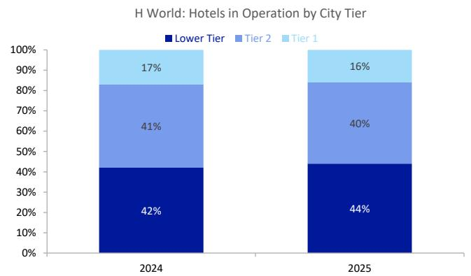

bar_stacked

H World: Hotels in Operation by City Tier
| Year | Lower Tier (%) | Tier 2 (%) | Tier 1 (%) |
|---|---|---|---|
| 2024 | 42 | 41 | 17 |
| 2025 | 44 | 40 | 16 |

Source : Company data, DB estimate

Figure 19: H World: hotels in pipeline by city tier   
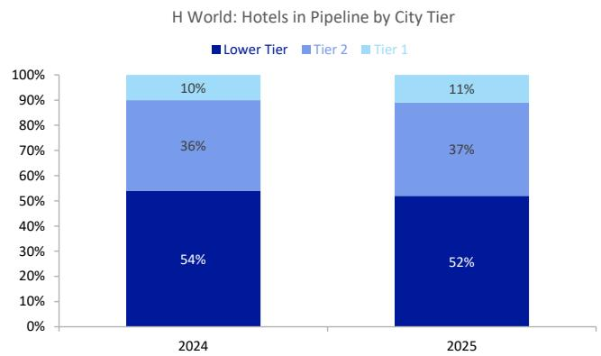

bar_stacked

H World: Hotels in Pipeline by City Tier
| Year | Lower Tier (%) | Tier 2 (%) | Tier 1 (%) |
|---|---|---|---|
| 2024 | 54 | 36 | 10 |
| 2025 | 52 | 37 | 11 |

Source : Company data, DB estimate

# Consistent product upgrade of major hotel brands

Through consistent product upgrades of major brands, H World differentiates itself by continuously enhancing its product quality and service standards, ensuring its brands remain a leading consumer choice. Unlike many competitors burdened by aging facilities, it has proactively pursued significant product upgrades across its major brands in recent years.

Figure 20: H World: product upgrade of major brands   
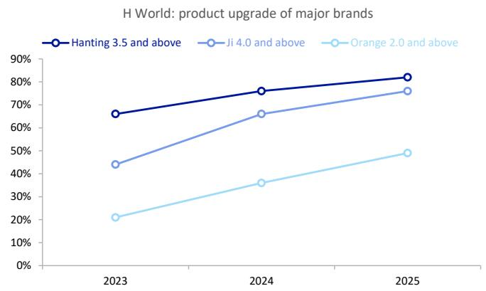

line

| Year | Hanting 3.5 and above | Ji 4.0 and above | Orange 2.0 and above |
| ---- | --------------------- | ---------------- | -------------------- |
| 2023 | 66%                   | 44%              | 21%                  |
| 2024 | 76%                   | 66%              | 36%                  |
| 2025 | 82%                   | 76%              | 49%                  |

Source : Company data, DB estimate

For example, Ji Hotel, since its launch in 2010 as a mid-end brand, has undergone five upgrades, evolving into the Ji Hotel 5.0 product. This latest version incorporates strong Eastern aesthetics with advanced digital in-room elements and integrates business meeting facilities in the lobby, making Ji an ideal choice for business travelers. Similarly, Hanting Hotel, positioned in the economy segment, is refreshing its image with the latest Hanting 4.0 model. This new model offers amenities such as printing, coffee, delivery pick-up, and self-service luggage storage, catering to budget travelers.

As Chinese customers increasingly prioritize quality experiences and new facilities over the legacy names of Western hotels, H World effectively captures this opportunity, enhancing its brand recognition through these consistent product upgrades.

# Asset-light transformation towards the M&F model

H World Group has successfully driven margin expansion through its asset-light transformation, shifting towards a M&F model. As of 2025, revenue from the asset light model reached 46% of total revenue, compared to 32% in 2022, as Huazhu continues to expand its network through the M&F model in China and close the underperforming L&O hotels which further improves its operational efficiency.

By strategically positioning itself across both economy and mid to high end segments, Huazhu also maintains a steady pace of new hotel openings from its M&F model. Its strong brand recognition, high member traffic, and solid technology infrastructure provide a significant advantage, enabling its hotels to attract greater franchise traction compared to other brands or independent hotels in China.

Figure 21: H World: revenue contribution breakdown   
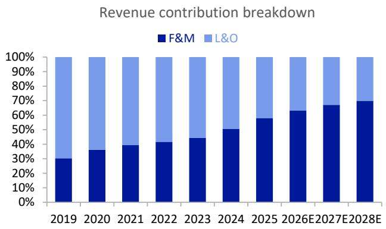

bar_stacked

Revenue contribution breakdown
| Year | F&M (%) | L&O (%) |
| :--- | :--- | :--- |
| 2019 | 30 | 70 |
| 2020 | 36 | 64 |
| 2021 | 39 | 61 |
| 2022 | 41 | 59 |
| 2023 | 44 | 55 |
| 2024 | 50 | 49 |
| 2025 | 58 | 42 |
| 2026E | 63 | 37 |
| 2027E | 67 | 33 |
| 2028E | 70 | 31 |

Source : Company data, DB estimate

Figure 22: H World: hotel in operation breakdown   
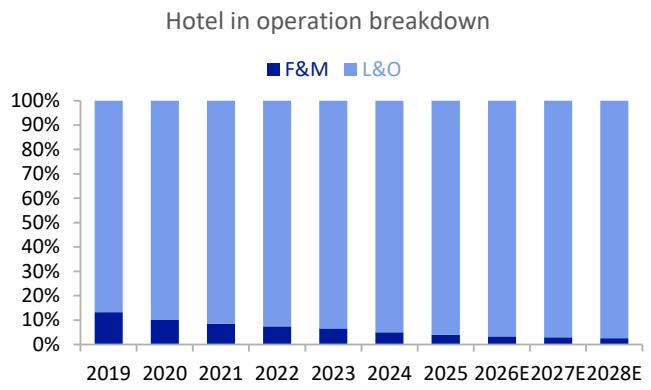

bar_stacked

Hotel in operation breakdown
| Year | F&M (%) | L&O (%) |
| :--- | :--- | :--- |
| 2019 | 13 | 87 |
| 2020 | 10 | 89 |
| 2021 | 9 | 89 |
| 2022 | 8 | 91 |
| 2023 | 7 | 93 |
| 2024 | 5 | 95 |
| 2025 | 4 | 96 |
| 2026E | 3 | 97 |
| 2027E | 2 | 98 |
| 2028E | 2 | 98 |

Source : Company data, DB estimate

Under this asset-light model, franchisees lease or own their hotel properties and are responsible for construction and renovation in accordance with H World's standards, ensuring product quality and consistency.

H World collects various fees from franchisees, including an upfront franchise fee, typically ranging from RMB 80,000 to RMB 1 million per hotel. Additionally, a monthly franchise fee of 3-6.5% of gross revenue generated by each hotel is charged. H World also charges reservation fees for bookings made through its central reservation system (CRS) and IT service fees. Franchisees are also responsible for the monthly compensation of appointed managers. Based on our estimate, the implied take rate for the M&F model reached 13.3% of gross revenue in 2025 (compared to 12% before 2023), and is expected to continue to rise in the future.

Figure 23: H World: take rate as % of gross revenue under its M&F model   
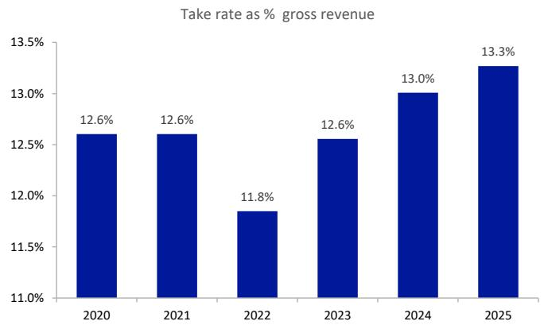

bar

Take rate as % gross revenue
| Year | Take rate as % gross revenue (%) |
| :--- | :--- |
| 2020 | 12.6 |
| 2021 | 12.6 |
| 2022 | 11.8 |
| 2023 | 12.6 |
| 2024 | 13.0 |
| 2025 | 13.3 |

Source : Company data, DB estimate

# CRS and membership to drive customer loyalty

A key component of H World's marketing efforts is H Rewards, the company's loyalty program. As of 2025, H Rewards boasts over 311 million members, with 73% of room nights booked under Huazhu being sold to H Rewards members. Members enjoy benefits such as discounts on room rates, complimentary breakfast (for Gold and Platinum members), and late check-out privileges. H Rewards members can accumulate points to offset future room charges, which encourages the members to book via its membership program instead of via OTAs.

H World also benefits from very solid customer traffic, thanks to its strong brand recognition and established customer loyalty. In 2025, 77% of room nights sold for Huazhu were booked through its own direct sales channels, with only 23% coming from intermediaries. The majority of direct sales are made via its CRS system, while a smaller proportion is made by walk-in and offline channels. According to management, H World aims to maintain the intermediary contribution to total sales below the 25% level, and continue to strengthen its membership networks through more efficient direct sales.

Figure 24: H World: direct booking contribution for Huazhu segment   
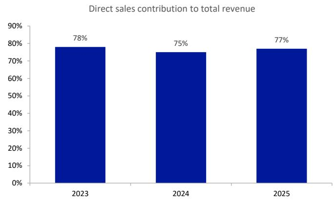

bar

Direct sales contribution to total revenue
| Year | Direct sales contribution (%) |
| :--- | :--- |
| 2023 | 78 |
| 2024 | 75 |
| 2025 | 77 |

Source : Company data, DB estimate

# Financial forecast and key assumptions

With over 20 years of expertise in China and an expanding international footprint, H World is a strong long-term compounder well-positioned to lead the structural consolidation of the Chinese hospitality market. We view the company as an ideal selection for investors seeking to capitalize on the cyclical bottoming of the industry while maintaining exposure to a best-in-class compounder within the China consumer space.

We forecast H World's consolidated revenue to grow by 7.4%, 7.7%, and 6.7% from 2026-2028E, respectively. This growth is driven by its China operations (Huazhu), projected to grow by 9.3%, 9.3%, and 7.9% during the same period, while Deutsche Hospitality (DH) is expected to contribute -0.9%, 0%, and 1% growth. Our forecast for China RevPAR growth is 2.8%, 3.0%, and 3.1% for 2026, 2027, and 2028, respectively, reflecting our view that the overall industry is bottoming out in 4Q25, thus providing a strong foundation for an industry upcycle.

For adjusted net profit, we factor in significant growth of 23.1%, 16.7%, and 11.8% from 2026-2028E. This accelerated profitability is driven by continuous margin improvement resulting from H World's strategic mix shift towards an asset-light model and robust cost control initiatives.

From a three-year perspective, we believe H World is capable of delivering 7% revenue and 17% adjusted net profit CAGRs. This positions it as one of the few players in China able to compound growth despite fierce industry competition and macro uncertainty.

Figure 25: H World: key assumptions for 2026-2028 

<table><tr><td>(Rmb mn)</td><td>2025</td><td>2026E</td><td>2027E</td><td>2028E</td></tr><tr><td colspan="5">Hotel operations summary</td></tr><tr><td>Total hotels in operations</td><td>12,740</td><td>14,390</td><td>15,766</td><td>16,749</td></tr><tr><td>F&amp;M</td><td>511</td><td>481</td><td>457</td><td>440</td></tr><tr><td>L&amp;O</td><td>12,229</td><td>13,909</td><td>15,309</td><td>16,309</td></tr><tr><td>Hotel Revpar</td><td>232</td><td>239</td><td>246</td><td>253</td></tr><tr><td>ADR</td><td>290</td><td>294</td><td>298</td><td>303</td></tr><tr><td>Occ Ratio</td><td>80%</td><td>81%</td><td>82%</td><td>84%</td></tr></table>

Revenue summary 

<table><tr><td>Net Revenue</td><td>25,307</td><td>27,189</td><td>29,282</td><td>31,258</td></tr><tr><td>China</td><td>20,535</td><td>22,437</td><td>24,530</td><td>26,459</td></tr><tr><td>F&amp;M</td><td>11,542</td><td>13,691</td><td>15,930</td><td>17,889</td></tr><tr><td>L&amp;O</td><td>8,371</td><td>7,999</td><td>7,779</td><td>7,667</td></tr><tr><td>DH</td><td>4,794</td><td>4,752</td><td>4,752</td><td>4,799</td></tr></table>

% of Net revenue 

<table><tr><td>China</td><td>81%</td><td>83%</td><td>84%</td><td>85%</td></tr><tr><td>F&amp;M</td><td>46%</td><td>50%</td><td>54%</td><td>57%</td></tr><tr><td>L&amp;O</td><td>33%</td><td>29%</td><td>27%</td><td>25%</td></tr><tr><td>DH</td><td>19%</td><td>17%</td><td>16%</td><td>15%</td></tr></table>

Gross margin 

<table><tr><td>Overall</td><td>39%</td><td>42%</td><td>45%</td><td>46%</td></tr><tr><td>EBITDA (adj)</td><td>8,473</td><td>9,679</td><td>11,016</td><td>12,135</td></tr><tr><td>EBITDA margin</td><td>33.5%</td><td>35.6%</td><td>37.6%</td><td>38.8%</td></tr><tr><td>Net profit (reported)</td><td>5,080</td><td>5,652</td><td>6,587</td><td>7,314</td></tr><tr><td>Reported net margin</td><td>20.1%</td><td>20.8%</td><td>22.5%</td><td>23.4%</td></tr><tr><td>Net profit (adj)</td><td>4,941</td><td>6,085</td><td>7,099</td><td>7,934</td></tr><tr><td>Adjusted net margin</td><td>19.5%</td><td>22.4%</td><td>24.2%</td><td>25.4%</td></tr></table>

<table><tr><td rowspan="2">2025</td><td colspan="3">Net change</td></tr><tr><td>2026E</td><td>2027E</td><td>2028E</td></tr><tr><td>15.6%</td><td>12.9%</td><td>9.6%</td><td>6.2%</td></tr><tr><td>-8.3%</td><td>-5.9%</td><td>-4.8%</td><td>-3.8%</td></tr><tr><td>16.8%</td><td>13.7%</td><td>10.1%</td><td>6.5%</td></tr><tr><td>-1.3%</td><td>2.8%</td><td>3.0%</td><td>3.1%</td></tr><tr><td>0.3%</td><td>1.4%</td><td>1.5%</td><td>1.6%</td></tr><tr><td>-1.5%</td><td>1.4%</td><td>1.4%</td><td>1.4%</td></tr></table>

<table><tr><td>5.9%</td><td>7.4%</td><td>7.7%</td><td>6.7%</td></tr><tr><td>7.9%</td><td>9.3%</td><td>9.3%</td><td>7.9%</td></tr><tr><td>23.0%</td><td>18.6%</td><td>16.3%</td><td>12.3%</td></tr><tr><td>-8.5%</td><td>-4.4%</td><td>-2.8%</td><td>-1.4%</td></tr><tr><td>-1.8%</td><td>-0.9%</td><td>0.0%</td><td>1.0%</td></tr></table>

<table><tr><td>1.5pp</td><td>1.4pp</td><td>1.2pp</td><td>0.9pp</td></tr><tr><td>6.3pp</td><td>4.7pp</td><td>4.0pp</td><td>2.8pp</td></tr><tr><td>-5.2pp</td><td>-3.7pp</td><td>-2.9pp</td><td>-2.0pp</td></tr><tr><td>-1.5pp</td><td>-1.5pp</td><td>-1.2pp</td><td>-0.9pp</td></tr></table>

<table><tr><td>3.4pp</td><td>3.1pp</td><td>2.4pp</td><td>1.6pp</td></tr><tr><td>24%</td><td>14%</td><td>14%</td><td>10%</td></tr><tr><td>5.0pp</td><td>2.1pp</td><td>2.0pp</td><td>1.2pp</td></tr><tr><td>67%</td><td>11%</td><td>17%</td><td>11%</td></tr><tr><td>7.3pp</td><td>0.7pp</td><td>1.7pp</td><td>0.9pp</td></tr><tr><td>33%</td><td>23%</td><td>17%</td><td>12%</td></tr><tr><td>4.0pp</td><td>2.9pp</td><td>1.9pp</td><td>1.1pp</td></tr></table>

Source : Company data, DB estimate

Figure 26: H World: DB forecast vs. consensus 

<table><tr><td rowspan="2">Rmb mn</td><td colspan="4">DB forecast</td><td colspan="3">BBG consensus</td><td colspan="3">DB vs. consensus</td></tr><tr><td>2025</td><td>2026E</td><td>2027E</td><td>2028E</td><td>2026E</td><td>2027E</td><td>2028E</td><td>2026E</td><td>2027E</td><td>2028E</td></tr><tr><td>Revenue</td><td>25,307</td><td>27,189</td><td>29,282</td><td>31,258</td><td>26,781</td><td>28,762</td><td>30,817</td><td>2%</td><td>2%</td><td>1%</td></tr><tr><td>Legacy-Huazhu</td><td>19,913</td><td>21,690</td><td>23,709</td><td>25,556</td><td>21,728</td><td>23,395</td><td>25,664</td><td>0%</td><td>1%</td><td>0%</td></tr><tr><td>Leased and owned hotels</td><td>8,371</td><td>7,999</td><td>7,779</td><td>7,667</td><td>8,143</td><td>7,865</td><td>7,770</td><td>-2%</td><td>-1%</td><td>-1%</td></tr><tr><td>Manachised and franchised</td><td>11,542</td><td>13,691</td><td>15,930</td><td>17,889</td><td>13,584</td><td>15,530</td><td>17,894</td><td>1%</td><td>3%</td><td>0%</td></tr><tr><td>Legacy-DH</td><td>4,794</td><td>4,752</td><td>4,752</td><td>4,799</td><td>4,553</td><td>4,498</td><td>4,723</td><td>4%</td><td>6%</td><td>2%</td></tr><tr><td>Income (loss) from operations</td><td>6,819</td><td>8,034</td><td>9,269</td><td>10,291</td><td>7,826</td><td>8,767</td><td>9,693</td><td>3%</td><td>6%</td><td>6%</td></tr><tr><td>OPM%</td><td>26.9%</td><td>29.5%</td><td>31.7%</td><td>32.9%</td><td>29.2%</td><td>30.5%</td><td>31.5%</td><td>0.3pp</td><td>1.2pp</td><td>1.5pp</td></tr><tr><td>Adjusted EBITDA</td><td>8,612</td><td>9,257</td><td>10,514</td><td>11,525</td><td>9,279</td><td>10,106</td><td>10,912</td><td>0%</td><td>4%</td><td>6%</td></tr><tr><td>EBITDA margin%</td><td>34.0%</td><td>34.0%</td><td>35.9%</td><td>36.9%</td><td>34.6%</td><td>35.1%</td><td>35.4%</td><td>-0.6pp</td><td>0.8pp</td><td>1.5pp</td></tr><tr><td>Adjusted Net profit</td><td>5,080</td><td>5,652</td><td>6,587</td><td>7,314</td><td>5,418</td><td>6,225</td><td>6,895</td><td>4%</td><td>6%</td><td>6%</td></tr><tr><td>NPM%</td><td>20.1%</td><td>20.8%</td><td>22.5%</td><td>23.4%</td><td>20.2%</td><td>21.6%</td><td>22.4%</td><td>0.6pp</td><td>0.9pp</td><td>1.0pp</td></tr></table>

Source : Bloomberg Finance LP, DB estimate

# 1Q Preview

We forecast H World's total revenue to grow by 8.8% YoY, driven by a robust 10.7% revenue increase for Legacy-Huazhu, which offsets a marginal 0.1% revenue decline for Legacy-DH. Adjusted net profit is projected to reach RMB 1,074 million, representing an 18.3% adjusted net margin and a significant 39% YoY growth. H World's solid outlook is primarily driven by the strong 1Q26 RevPar trend and sustained margin improvement trend established since 2025.

Investors are currently assessing 2Q26 demand elasticity as higher jet fuel costs begin to pressure ticket prices. We expect management to provide more color on these prevailing trends during the 1Q26 earnings call next week

Figure 27: H World: revenue forecast   
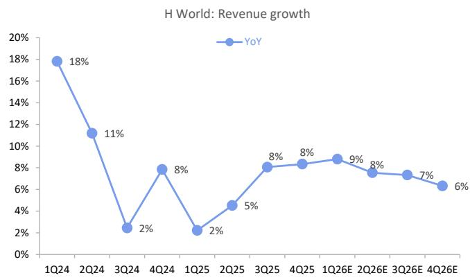

line

| Quarter | YoY  |
| ------- | ---- |
| 1Q24    | 18%  |
| 2Q24    | 11%  |
| 3Q24    | 2%   |
| 4Q24    | 8%   |
| 1Q25    | 2%   |
| 2Q25    | 5%   |
| 3Q25    | 8%   |
| 4Q25    | 8%   |
| 1Q26E   | 9%   |
| 2Q26E   | 8%   |
| 3Q26E   | 7%   |
| 4Q26E   | 6%   |

Source : Company data, DB estimate

Figure 28: H World: Huazhu revenue forecast   
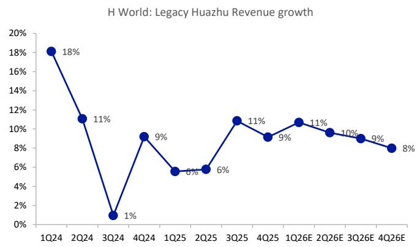

line

H World: Legacy Huazhu Revenue growth
| Quarter | Revenue Growth (%) |
| :--- | :--- |
| 1Q24 | 18 |
| 2Q24 | 11 |
| 3Q24 | 1 |
| 4Q24 | 9 |
| 1Q25 | 5.5 |
| 2Q25 | 5.7 |
| 3Q25 | 10.8 |
| 4Q25 | 9 |
| 1Q26E | 10.7 |
| 2Q26E | 9.7 |
| 3Q26E | 9 |
| 4Q26E | 8 |

Source : Company data, DB estimate

Figure 29: H World: key operation assumptions   
Operation summary 

<table><tr><td></td><td>1Q25</td><td>2Q25</td><td>3Q25</td><td>4Q25</td><td>1Q26E</td><td>2Q26E</td><td>3Q26E</td><td>4Q26E</td></tr><tr><td>Revpar</td><td>208</td><td>235</td><td>256</td><td>226</td><td>215</td><td>241</td><td>263</td><td>233</td></tr><tr><td>F&amp;M</td><td>203</td><td>230</td><td>250</td><td>221</td><td>211</td><td>237</td><td>258</td><td>229</td></tr><tr><td>L&amp;O</td><td>269</td><td>304</td><td>327</td><td>297</td><td>280</td><td>311</td><td>337</td><td>304</td></tr><tr><td>Revpar</td><td>-3.7%</td><td>-3.7%</td><td>0.0%</td><td>1.8%</td><td>3.4%</td><td>2.7%</td><td>2.6%</td><td>3.1%</td></tr><tr><td>F&amp;M YoY</td><td>-2.9%</td><td>-3.0%</td><td>0.4%</td><td>2.8%</td><td>3.8%</td><td>3.0%</td><td>3.3%</td><td>3.7%</td></tr><tr><td>L&amp;O YoY</td><td>-3.9%</td><td>-5.3%</td><td>-1.8%</td><td>0.3%</td><td>4.1%</td><td>2.2%</td><td>3.1%</td><td>2.5%</td></tr><tr><td>ADR</td><td>272</td><td>290</td><td>304</td><td>288</td><td>277</td><td>293</td><td>310</td><td>293</td></tr><tr><td>F&amp;M</td><td>267</td><td>285</td><td>299</td><td>283</td><td>272</td><td>288</td><td>305</td><td>288</td></tr><tr><td>L&amp;O</td><td>338</td><td>365</td><td>378</td><td>364</td><td>345</td><td>369</td><td>386</td><td>370</td></tr><tr><td>ADR</td><td>-2.9%</td><td>-2.0%</td><td>1.0%</td><td>4.0%</td><td>1.8%</td><td>0.9%</td><td>1.8%</td><td>1.7%</td></tr><tr><td>F&amp;M YoY</td><td>-1.8%</td><td>-1.0%</td><td>1.7%</td><td>4.8%</td><td>2.0%</td><td>1.0%</td><td>2.0%</td><td>1.9%</td></tr><tr><td>L&amp;O YoY</td><td>-2.3%</td><td>-2.7%</td><td>-0.8%</td><td>3.1%</td><td>2.0%</td><td>1.0%</td><td>2.0%</td><td>1.6%</td></tr><tr><td>Occ</td><td>76.2%</td><td>81.0%</td><td>84.1%</td><td>78.4%</td><td>77.6%</td><td>82.4%</td><td>84.9%</td><td>79.6%</td></tr><tr><td>F&amp;M</td><td>75.9%</td><td>80.8%</td><td>83.9%</td><td>78.1%</td><td>77.4%</td><td>82.3%</td><td>84.7%</td><td>79.4%</td></tr><tr><td>L&amp;O</td><td>79.7%</td><td>83.3%</td><td>86.6%</td><td>81.8%</td><td>81.2%</td><td>84.3%</td><td>87.4%</td><td>82.3%</td></tr><tr><td>Occ</td><td>-1.0pp</td><td>-1.6pp</td><td>-0.8pp</td><td>-1.6pp</td><td>1.4pp</td><td>1.4pp</td><td>0.8pp</td><td>1.2pp</td></tr><tr><td>F&amp;M YoY</td><td>-0.9pp</td><td>-1.5pp</td><td>-0.7pp</td><td>-1.6pp</td><td>1.5pp</td><td>1.5pp</td><td>0.8pp</td><td>1.3pp</td></tr><tr><td>L&amp;O YoY</td><td>-1.3pp</td><td>-2.3pp</td><td>-0.8pp</td><td>-1.9pp</td><td>1.5pp</td><td>1.0pp</td><td>0.8pp</td><td>0.5pp</td></tr><tr><td># of hotels</td><td>11,564</td><td>12,016</td><td>12,580</td><td>12,740</td><td>13,085</td><td>13,487</td><td>13,980</td><td>14,390</td></tr><tr><td>F&amp;M</td><td>11,012</td><td>11,469</td><td>12,049</td><td>12,229</td><td>12,579</td><td>12,986</td><td>13,495</td><td>13,909</td></tr><tr><td>L&amp;O</td><td>552</td><td>547</td><td>531</td><td>511</td><td>506</td><td>501</td><td>485</td><td>481</td></tr><tr><td>F&amp;M</td><td>95%</td><td>95%</td><td>96%</td><td>96%</td><td>96%</td><td>96%</td><td>97%</td><td>97%</td></tr><tr><td>L&amp;O</td><td>5%</td><td>5%</td><td>4%</td><td>4%</td><td>4%</td><td>4%</td><td>3%</td><td>3%</td></tr><tr><td>New add #</td><td>539</td><td>452</td><td>564</td><td>160</td><td>345</td><td>402</td><td>493</td><td>410</td></tr><tr><td>F&amp;M</td><td>544</td><td>457</td><td>580</td><td>180</td><td>350</td><td>407</td><td>509</td><td>414</td></tr><tr><td>L&amp;O</td><td>(5)</td><td>(5)</td><td>(16)</td><td>(20)</td><td>(5)</td><td>(5)</td><td>(16)</td><td>(4)</td></tr></table>

Source : Company data, DB estimate

Figure 30: H World: key financial summary   
Financial summary 

<table><tr><td></td><td>1Q25</td><td>2Q25</td><td>3Q25</td><td>4Q25</td><td>1Q26E</td><td>2Q26E</td><td>3Q26E</td><td>4Q26E</td></tr><tr><td>Total revenue</td><td>5,395</td><td>6,426</td><td>6,961</td><td>6,525</td><td>5,870</td><td>6,910</td><td>7,471</td><td>6,938</td></tr><tr><td>YoY</td><td>2%</td><td>5%</td><td>8%</td><td>8%</td><td>9%</td><td>8%</td><td>7%</td><td>6%</td></tr><tr><td>Legacy-Huazhu</td><td>4,481</td><td>5,107</td><td>5,722</td><td>5,225</td><td>4,960</td><td>5,598</td><td>6,237</td><td>5,642</td></tr><tr><td>YoY</td><td>6%</td><td>6%</td><td>11%</td><td>9%</td><td>11%</td><td>10%</td><td>9%</td><td>8%</td></tr><tr><td>Legacy-DH</td><td>918</td><td>1,324</td><td>1,245</td><td>1,307</td><td>910</td><td>1,312</td><td>1,234</td><td>1,296</td></tr><tr><td>YoY</td><td>-11%</td><td>0%</td><td>-3%</td><td>6%</td><td>-1%</td><td>-1%</td><td>-1%</td><td>-1%</td></tr><tr><td>Gross profit</td><td>1,780</td><td>2,663</td><td>2,883</td><td>2,581</td><td>2,175</td><td>3,121</td><td>3,251</td><td>2,934</td></tr><tr><td>% GPM</td><td>33%</td><td>41%</td><td>41%</td><td>40%</td><td>37%</td><td>45%</td><td>44%</td><td>42%</td></tr><tr><td>S&amp;M</td><td>243</td><td>309</td><td>339</td><td>379</td><td>276</td><td>346</td><td>379</td><td>418</td></tr><tr><td>% of revenue</td><td>5%</td><td>5%</td><td>5%</td><td>6%</td><td>5%</td><td>5%</td><td>5%</td><td>6%</td></tr><tr><td>G&amp;A</td><td>512</td><td>660</td><td>545</td><td>545</td><td>569</td><td>710</td><td>585</td><td>703</td></tr><tr><td>% of revenue</td><td>9%</td><td>10%</td><td>8%</td><td>8%</td><td>10%</td><td>10%</td><td>8%</td><td>10%</td></tr><tr><td>Operating profit</td><td>60</td><td>105</td><td>61</td><td>259</td><td>65</td><td>113</td><td>65</td><td>332</td></tr><tr><td>% OPM</td><td>1%</td><td>2%</td><td>1%</td><td>4%</td><td>1%</td><td>2%</td><td>1%</td><td>5%</td></tr><tr><td>Adjusted EBITDA</td><td>1,484</td><td>2,269</td><td>2,515</td><td>2,205</td><td>1,788</td><td>2,664</td><td>2,805</td><td>2,423</td></tr><tr><td>% EBITDA</td><td>28%</td><td>35%</td><td>36%</td><td>34%</td><td>30%</td><td>39%</td><td>38%</td><td>35%</td></tr><tr><td>Net Income</td><td>899</td><td>1,559</td><td>1,472</td><td>1,185</td><td>1,007</td><td>1,627</td><td>1,667</td><td>1,387</td></tr><tr><td>YoY</td><td>34.8%</td><td>44.1%</td><td>13.9%</td><td>1842.6%</td><td>12.1%</td><td>4.3%</td><td>13.2%</td><td>17.0%</td></tr><tr><td>Adjusted net profit</td><td>775</td><td>1,349</td><td>1,520</td><td>1,297</td><td>1,074</td><td>1,760</td><td>1,769</td><td>1,482</td></tr><tr><td>YoY</td><td>0.5%</td><td>7.6%</td><td>9.6%</td><td>304.0%</td><td>38.5%</td><td>30.5%</td><td>16.4%</td><td>14.3%</td></tr></table>

Source : Company data, DB estimate

# Initiate with Buy rating; target price US\$56 / HK\$43.8

We initiate coverage on H World with a Buy rating. We believe the industry bottomed in 4Q25 and is now entering a structural upcycle. H World is well-positioned to capitalize on this recovery and the ongoing market consolidation as a premier long-term compounder. Beyond macro tailwinds, the company's internal catalysts, including its continuous product upgrades, transition towards asset-light model, and a strategic mix shift toward mid-to-high-end hotels, all aids in a more resilient RevPAR outlook compared to industry. We expect H World to consistently outpace industry benchmarks, leveraging its superior execution and deep loyalty network to deliver outperformance, even in an uncertain demand environment.

Our DCF-based target price of US\$56 / HK\$43.8 implies a 21x one-year forward P/E. Our valuation assumes an 8% WACC (2% risk-free rate, 6.5% market risk premium, and 1.0x beta) and a 0% terminal growth rate (consistent with our industry rate of 0-2% TRG for China consumer). With the stock currently trading at an attractive 18x one-year forward P/E, we believe this offers a good entry point for investors seeking to capitalize on the industry's cyclical bottom while gaining exposure to a best-in-class China consumer compounder.

Figure 31: H World: DCF model 

<table><tr><td>Rmb mn</td><td>2023</td><td>2024</td><td>2025</td><td>2026E</td><td>2027E</td><td>2028E</td><td>2030E</td><td>2030E</td><td>2031E</td><td>2032E</td><td>2033E</td><td>2034E</td></tr><tr><td>Revenue</td><td>21,882</td><td>23,891</td><td>25,307</td><td>27,189</td><td>29,282</td><td>31,258</td><td>28,548</td><td>29,405</td><td>30,287</td><td>31,196</td><td>31,508</td><td>31,823</td></tr><tr><td>YoY %</td><td></td><td>9%</td><td>6%</td><td>7%</td><td>8%</td><td>7%</td><td>5%</td><td>3%</td><td>3%</td><td>3%</td><td>1%</td><td>1%</td></tr><tr><td>EBIT</td><td>4,314</td><td>4,841</td><td>6,334</td><td>7,459</td><td>8,649</td><td>9,629</td><td>8,823</td><td>9,117</td><td>9,421</td><td>9,735</td><td>9,864</td><td>9,963</td></tr><tr><td>EBIT margin</td><td>20%</td><td>20%</td><td>25%</td><td>27%</td><td>30%</td><td>31%</td><td>31%</td><td>31%</td><td>31%</td><td>31%</td><td>31%</td><td>31%</td></tr><tr><td>EBIT*(1-t)</td><td>3,343</td><td>3,167</td><td>4,459</td><td>5,251</td><td>6,090</td><td>6,780</td><td>6,176</td><td>6,382</td><td>6,595</td><td>6,815</td><td>6,905</td><td>6,974</td></tr><tr><td>YoY %</td><td></td><td>-5%</td><td>41%</td><td>18%</td><td>16%</td><td>11%</td><td>-9%</td><td>3%</td><td>3%</td><td>3%</td><td>1%</td><td>1%</td></tr><tr><td>D&amp;A</td><td>1,414</td><td>1,332</td><td>1,257</td><td>1,156</td><td>1,156</td><td>1,156</td><td>1,040</td><td>936</td><td>843</td><td>759</td><td>683</td><td>614</td></tr><tr><td>Change in working capital</td><td>(925)</td><td>25</td><td>1,852</td><td>1,354</td><td>1,223</td><td>931</td><td>931</td><td>931</td><td>931</td><td>931</td><td>931</td><td>931</td></tr><tr><td>Capex</td><td>(2,417)</td><td>(1,110)</td><td>(901)</td><td>(898)</td><td>(838)</td><td>(805)</td><td>(684)</td><td>(582)</td><td>(494)</td><td>(420)</td><td>(357)</td><td>(304)</td></tr><tr><td>Operating free cash flow</td><td>1,415</td><td>3,414</td><td>6,667</td><td>6,863</td><td>7,631</td><td>8,062</td><td>7,464</td><td>7,668</td><td>7,874</td><td>8,084</td><td>8,161</td><td>8,216</td></tr></table>

Equity value 

<table><tr><td>PV of FCF</td><td>49,504</td></tr><tr><td>Terminal value</td><td>102,697</td></tr><tr><td>NPV of terminal value</td><td>52,741</td></tr><tr><td>Enterprise value</td><td>102,245</td></tr><tr><td>Net cash</td><td>16,500</td></tr><tr><td>Equity value (Rmb mn)</td><td>118,745</td></tr><tr><td>Equity value (US$ mn)</td><td>17,086</td></tr><tr><td>Equity value (US$/shr)</td><td>56.0</td></tr><tr><td>Current price (US$/shr)</td><td>48.9</td></tr><tr><td>Up/(down)side</td><td>14.6%</td></tr><tr><td>Implied 2026E P/E</td><td>21x</td></tr></table>

Equity value (HK\$/shr) 

<table><tr><td>Current price (HK$/shr)</td><td>38.4</td></tr><tr><td>Up/(down)side</td><td>14.2%</td></tr></table>

Assumptions 

<table><tr><td>Cost of equity</td><td>8.5%</td></tr><tr><td>Cost of debt</td><td>5.0%</td></tr><tr><td>WACC</td><td>8.0%</td></tr><tr><td>Terminal growth rate, %</td><td>0.0%</td></tr><tr><td>Risk free rate</td><td>2.00%</td></tr><tr><td>Equity risk premium</td><td>6.5%</td></tr><tr><td>Beta</td><td>1.00</td></tr><tr><td>Tax rate</td><td>30%</td></tr><tr><td>Target debt/capital ratio</td><td>10%</td></tr></table>

Source : Company data, DB estimate

# Key risks

# Our thesis is subject to several key risks, including:

1. Macroeconomic Headwinds and Demand Weakness in China

Slower-than-expected business demand recovery due to a weak macroeconomic environment, coupled with potential weakness or downgrade in leisure travel demand, could put pressure on our industry assumptions and negatively impact H World's China RevPAR growth.

2. Intensifying Competitive Landscape

China's hotel market is highly competitive, with H World competing against both domestic and international players who also try capture the opportunities in the mid-to-high-end and lower-tier city segments. Should competitors offer comparable high-quality products at lower price points, H World's customer acquisition could be adversely affected. Furthermore, any failure in H World's execution could limit its competitive edge.

3. Franchisee Management and Growth Execution

H World's growth is significantly dependent on robust franchisee relationships, which are critical for ensuring product quality, service consistency, and continuous new store expansion. Should H World fail to effectively manage its franchisees, it could lead to a deteriorating brand image and reduced customer loyalty. Similarly, an inability to attract sufficient new franchisees could result in lower-than-expected store openings, thereby impacting H World's growth estimates.

4. Geopolitical and Macroeconomic Factors in Europe

Geopolitical tensions could adversely affect business-related travel demand in Europe. Additionally, high commodity prices may limit overall travel interest, both of which would negatively impact H World's European operations via Deutsche Hospitality (DH).

# Rating

# Buy

# Asia

# China

# Consumer

# Hotels / Leisure /

# Gaming

# Company

# Atour Lifestyle

# Reuters

# ATAT.OQ

# Bloomberg

# ATAT US

# A lifestyle brand driving mid-to-high-end hotel expansion

# Initiate with Buy: a niche player with high growth visibility and potential retail upside

We initiate coverage on Atour Lifestyle with a Buy rating. While we acknowledge near-term industry volatility due to elevated fuel costs and weather disruptions during the Labor Day Holiday, we remain optimistic over the broader cyclical bottoming trend, which we believe will catalyze a valuation re-rating for industry leaders.

As a niche player in the mid-to-high-end hotel segment, Atour is well-positioned for a robust three-year growth trajectory, powered by its unique "dual-engine" strategy: a disciplined expansion of its hotel network (targeted to grow from 2,000 to 3,000 properties by 2028), and a high-growth retail segment that has outperformed market expectations. In particular, Atour's new retail business offers upside compared to cautious market expectations in 2026. While the company guided for a conservative 25–30% YoY, our proprietary trackers indicate robust YTD momentum, with 1Q26 sales surging to above 45% YoY.

Our DCF-based target price is US\$45, implying a 17x one-year forward P/E. This valuation assumes a 9.5% WACC and a 0% terminal growth rate. With the company currently trading at 15x one-year forward P/E based on our 2026 adj net profit forecast, we consider it attractive given its high growth outlook.

# A lifestyle brand extending beyond the traditional hotel business

Atour, a leader in China's upper-midscale segment, has successfully evolved from a traditional hotel player into a premier lifestyle brand. By transitioning from a "space provider" to an "experience operator," Atour offers a comprehensive ecosystem that extends far beyond the traditional hotel business, capturing high-margin opportunities in the broader consumer lifestyle market, such as sleep related products.

The company is currently in a high-growth phase, expanding its network toward a target of over 3,000 hotels by 2028. Given its relatively small scale compared to the 10,000+ unit footprints of legacy chains, Atour possesses significant "expansion alpha" potential. Complementing its hospitality core, Atour's retail segment continues to outperformed market expectations. Despite intensifying competition, Atour's share of the e-commerce pillow market surged from $6\%$ in 2023 to $23\%$ in 1Q26. We attribute Atour's dominance to its unique premium positioning, which effectively captures China's booming "sleep economy" – a critical demand driver in an increasingly high-stress urban environment. While we conservatively model

# Sammi Xu

# Research Analyst

# +852-2203-5415

<table><tr><td>Price at 7 May 2026 (USD)</td><td>38.23</td></tr><tr><td>Price target - 12mth (USD)</td><td>45.00</td></tr><tr><td>52-week range (USD)</td><td>42.90 - 28.41</td></tr><tr><td>Unavailable</td><td>26,626</td></tr></table>

Price/price relative   
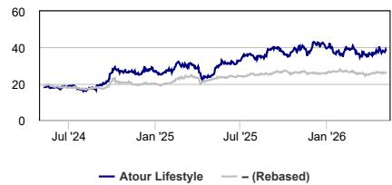

line

| Date   | Atour Lifestyle | (Rebased) |
|--------|-----------------|---------|
| Jul '24 | ~18             | ~18     |
| Jan '25 | ~30             | ~20     |
| Jul '25 | ~35             | ~22     |
| Jan '26 | ~40             | ~25     |

<table><tr><td>Performance (%)</td><td>1m</td><td>3m</td><td>12m</td></tr><tr><td>Absolute</td><td>7.6</td><td>2.7</td><td>43.8</td></tr><tr><td>HANG SENG INDEX</td><td>6.0</td><td>0.2</td><td>17.3</td></tr><tr><td colspan="4">Source: DB</td></tr></table>

Key indicators (FY1) 

<table><tr><td>ROE (%)</td><td>47.8</td></tr><tr><td>Net debt/equity (%)</td><td>-72.7</td></tr><tr><td>Book value/share (CNY)</td><td>35.70</td></tr><tr><td>Price/book (x)</td><td>7.3</td></tr><tr><td>Net interest cover (x)</td><td>-</td></tr><tr><td>Operating profit margin (%)</td><td>23.5</td></tr><tr><td colspan="2">Source: DB</td></tr></table>

Comparatives 

<table><tr><td colspan="3">Atour Lifestyle (ATAT.OQ),USD38.23</td><td>Buy</td></tr><tr><td></td><td>2025A</td><td>2026E</td><td>2027E</td></tr><tr><td>P/E (x)</td><td>19.1</td><td>16.7</td><td>14.2</td></tr><tr><td>EV/EBITDA (x)</td><td>11.7</td><td>9.8</td><td>7.9</td></tr><tr><td>Price/book (x)</td><td>11.0</td><td>7.3</td><td>5.3</td></tr><tr><td colspan="4">Source: DB</td></tr></table>

2026 retail growth at 30% (aligning with management's 25–30% guidance), we see upside potential given the brand's robust momentum observed in 1Q26.

# 1Q26 preview

For 1Q26, we project Atour to report robust revenue growth of 41% YoY. This performance is anchored by a 45% increase in its M&F (Manachised & Franchised) business and a significant 45% increase in its retail segment. Notably, the Atour's retail brand continues to demonstrate strong momentum, propelled by strong Chinese New Year sales and a structural rise in consumer awareness regarding "sleep economy" products. Should Atour's retail segment maintain its current trajectory despite fierce competition, we see meaningful upside potential relative to the conservative market consensus and the company's initial full-year guidance of 25–30%. On the bottom line, we forecast adjusted net profit of Rmb 480 million, representing a 39% YoY increase.

The market is closely monitoring the latest retail trends to determine if actual performance will lead to a "beat and raise" regarding management's initial guidance. Meanwhile, investors are assessing the impact of higher fuel surcharges on travel incentives and management's guidance on 2Q26 travel demand.

<table><tr><td colspan="6">Forecasts and ratios</td></tr><tr><td>Year End Dec 31</td><td>2024A</td><td>2025A</td><td>2026E</td><td>2027E</td><td>2028E</td></tr><tr><td>Sales (CNYm)</td><td>7,247.9</td><td>9,790.2</td><td>12,359.3</td><td>14,306.8</td><td>15,777.2</td></tr><tr><td>EBITDA (CNYm)</td><td>1,739.0</td><td>2,349.1</td><td>2,957.0</td><td>3,441.3</td><td>3,840.3</td></tr><tr><td>Reported NPAT (CNYm)</td><td>1,275.4</td><td>1,621.0</td><td>2,040.4</td><td>2,373.7</td><td>2,647.9</td></tr><tr><td>Reported EPS FD(CNY)</td><td>9.17</td><td>11.60</td><td>14.54</td><td>17.18</td><td>19.64</td></tr><tr><td>DB EPS FD(CNY)</td><td>9.39</td><td>12.54</td><td>15.57</td><td>18.28</td><td>20.82</td></tr><tr><td>OLD DB EPS FD(CNY)</td><td>-</td><td>-</td><td>-</td><td>-</td><td>-</td></tr><tr><td>% Change</td><td>-</td><td>-</td><td>-</td><td>-</td><td>-</td></tr><tr><td>DB EPS growth (%)</td><td>43.8</td><td>33.6</td><td>24.2</td><td>17.4</td><td>13.9</td></tr><tr><td>PER (x)</td><td>15.7</td><td>19.1</td><td>16.7</td><td>14.2</td><td>12.5</td></tr><tr><td>EV/EBITDA (x)</td><td>8.9</td><td>11.7</td><td>9.8</td><td>7.9</td><td>6.5</td></tr><tr><td>DPS (net) (CNY)</td><td>0.45</td><td>0.78</td><td>0.86</td><td>0.94</td><td>1.04</td></tr><tr><td>Yield (net) (%)</td><td>0.3</td><td>0.3</td><td>0.3</td><td>0.4</td><td>0.4</td></tr></table>

Source: DB estimates, company data

# Atour: A lifestyle brand driving mid-to-high-end expansion with dual growth engines

Atour, a Chinese mid-to-high-end hospitality group, has positioned itself as a lifestyle brand rooted in hospitality but extending well beyond the traditional hotel business. Since its inception in 2013, Atour has astutely identified evolving market demands: capturing business travelers adjusting to budget cuts (those migrating from five-star hotels) and retail consumers seeking experience-driven upgrades. After a decade of growth, Atour has emerged as China's leading listed hotel group by scale within the mid-to-high-end segment.

Atour is currently in a favorable position for network expansion, given its relatively smaller footprint—operating 2,015 hotels in 2025 compared to the 10,000+ locations managed by top-tier chains. The closure of numerous underperforming independent hotels over the past two years has released a significant volume of high-quality properties in prime business districts and transportation hUBS. Combined with superior operating efficiency and a robust Central Reservation System (CRS) for user acquisition, industry leaders like Atour are gaining significant traction over independent competitors.

# Atour's "24-Hour Lifestyle" Approach: Beyond Just Accommodation

Unlike traditional hotels that primarily sell 'a room for the night,' Atour offers a '24-hour lifestyle,' effectively transitioning from a 'space provider' to an 'experience operator.' Atour has shifted its focus from 'selling rooms' to 'selling sleep,' establishing the 'deep sleep' scenario as a competitive brand moat that creates a superior customer experience. This emphasis on experience significantly differentiates Atour from its peers and serves as a crucial edge for cultivating member loyalty.

# Atour's multi-tier strategy: capturing the full mid-to-high-end spectrum

While many larger hotel groups operate multi-brand portfolios, Atour's primary strategy centers on its singular 'Atour' brand, encompassing both its hotel and retail businesses. Despite this core focus, the company has strategically expanded its sub-brands since 2022, to include different price segments under different Atour's sub-brands to capture the full mid to high end spectrum in China.

One of Atour's strategic sub-brands is Atour Light, which is positioned to compete directly in the mid-end hotel segment at a more accessible price point than Huazhu's signature Ji Hotel. By offering a comparable quality of service and design at a more competitive price, Atour Light serves as an important tool for expanding the company's customer base.

Conversely, Atour S and Atour X are positioned at a premium relative to the flagship brand, featuring upgraded facilities, elevated interior design, and prime locations. This comprehensive segmentation allows Atour to capture a broader range of consumer demographics and accelerate network expansion while effectively mitigating the risk of internal brand cannibalization.

Figure 32: Atour: hotel breakdown by brands 

<table><tr><td>By Brand</td><td>2022</td><td>2023</td><td>2024</td><td>2025</td></tr><tr><td>Franchised</td><td>899</td><td>1,178</td><td>1,593</td><td>1,996</td></tr><tr><td>AT House</td><td></td><td></td><td>-</td><td></td></tr><tr><td>AtourS</td><td>45</td><td>57</td><td>79</td><td>87</td></tr><tr><td>Atour Flagship</td><td>731</td><td>898</td><td>1,191</td><td>1,479</td></tr><tr><td>Atour X</td><td>48</td><td>114</td><td>167</td><td>179</td></tr><tr><td>Atour Light</td><td>75</td><td>108</td><td>156</td><td>201</td></tr><tr><td>Others</td><td>-</td><td>1</td><td>-</td><td>50</td></tr><tr><td colspan="5">change</td></tr><tr><td>AT House</td><td>-</td><td>-</td><td>-</td><td>-</td></tr><tr><td>AtourS</td><td>45</td><td>12</td><td>22</td><td>8</td></tr><tr><td>Atour Flagship</td><td>731</td><td>167</td><td>293</td><td>288</td></tr><tr><td>Atour X</td><td>48</td><td>66</td><td>53</td><td>12</td></tr><tr><td>Atour Light</td><td>75</td><td>33</td><td>48</td><td>45</td></tr><tr><td>Others</td><td>-</td><td>1</td><td>(1)</td><td>50</td></tr><tr><td>Leased</td><td>33</td><td>32</td><td>26</td><td>19</td></tr><tr><td>AT House</td><td>1</td><td>1</td><td>1</td><td>1</td></tr><tr><td>AtourS</td><td>9</td><td>8</td><td>4</td><td>1</td></tr><tr><td>Atour Flagship</td><td>22</td><td>22</td><td>18</td><td>12</td></tr><tr><td>Atour X</td><td></td><td></td><td>3</td><td>2</td></tr><tr><td>Atour Light</td><td>1</td><td>1</td><td>-</td><td>-</td></tr><tr><td>Others</td><td></td><td>-</td><td>-</td><td>3</td></tr><tr><td colspan="5">change</td></tr><tr><td>AT House</td><td>1</td><td>-</td><td>-</td><td>-</td></tr><tr><td>AtourS</td><td>9</td><td>(1)</td><td>(4)</td><td>(3)</td></tr><tr><td>Atour Flagship</td><td>22</td><td>-</td><td>(4)</td><td>(6)</td></tr><tr><td>Atour X</td><td>-</td><td>-</td><td>3</td><td>(1)</td></tr><tr><td>Atour Light</td><td>1</td><td>-</td><td>(1)</td><td>-</td></tr><tr><td>Others</td><td>-</td><td>-</td><td>-</td><td>3</td></tr><tr><td colspan="5">Source : Company data</td></tr></table>

# Atour's franchise-centric asset light model

Atour utilizes a franchise-centric, asset-light model, where franchisees serve as the primary customers and partners for network expansion. This model generates highly predictable income streams; as of 2025, each newly signed and operational hotel contributes an estimated RMB 3 million annually to Atour's top line. We project this per-hotel revenue to improve steadily through 2028E, driven by a structural upturn in RevPAR and enhanced ancillary service monetization.

Under Atour's business model, approximately 50% of franchise revenue is derived from recurring management and franchise fees, representing a robust gross take rate of 10.5% on hotel gross revenue. A significant portion of the remainder (48–49%) is generated through the sale of hotel supplies and integrated products, while transaction fees account for less than 1%. Looking ahead, we model a consistent expansion of the take rate through 2028E, alongside enhanced monetization of its supply chain services to franchisees.

Figure 33: Atour: franchised business model revenue breakdown 

<table><tr><td>Rmb</td><td>2020</td><td>2021</td><td>2022</td><td>2023</td><td>2024</td><td>2025</td><td>2026E</td><td>2027E</td><td>2028E</td></tr><tr><td>Upfront franchise fees</td><td>30</td><td>32</td><td>38</td><td>47</td><td>68</td><td>83</td><td>83</td><td>68</td><td>51</td></tr><tr><td>Continuing franchise fees</td><td>352</td><td>554</td><td>757</td><td>1,363</td><td>1,904</td><td>2,463</td><td>3,137</td><td>3,709</td><td>4,175</td></tr><tr><td>Gross Take rate %</td><td>7.1%</td><td>7.8%</td><td>9.3%</td><td>9.2%</td><td>10.1%</td><td>10.5%</td><td>10.7%</td><td>10.8%</td><td>10.9%</td></tr><tr><td>Sales of hotel supplies and other products</td><td>421</td><td>515</td><td>517</td><td>1,180</td><td>2,012</td><td>2,555</td><td>3,288</td><td>3,927</td><td>4,381</td></tr><tr><td>Other transactions with the franchisees</td><td>123</td><td>119</td><td>49</td><td>116</td><td>164</td><td>208</td><td>260</td><td>305</td><td>340</td></tr><tr><td>Transaction fees %</td><td>2.5%</td><td>1.7%</td><td>0.6%</td><td>0.8%</td><td>0.9%</td><td>0.9%</td><td>0.9%</td><td>0.9%</td><td>0.9%</td></tr><tr><td>Manachised hotels</td><td>926</td><td>1,220</td><td>1,361</td><td>2,706</td><td>4,149</td><td>5,309</td><td>6,768</td><td>8,008</td><td>8,946</td></tr><tr><td>Revenue per hotels</td><td>2.0</td><td>2.0</td><td>1.7</td><td>2.6</td><td>3.0</td><td>3.0</td><td>3.1</td><td>3.1</td><td>3.1</td></tr></table>

Source : Company data, DB estimate

For 2026–2027, we anticipate a period of sustained network expansion, positioning Atour to surpass the 3,000-hotel milestone by 2028. Future growth is expected to be driven almost exclusively by the asset-light franchise model, which already represents 99% of the current portfolio. We project a robust pipeline of 418,340, and 240 net openings annually from 2026 to 2028E, respectively; this steady increase in hotel number will serve as the primary catalyst for Atour's top-line revenue growth and long-term market share gains.

Figure 34: Atour: number of hotels   
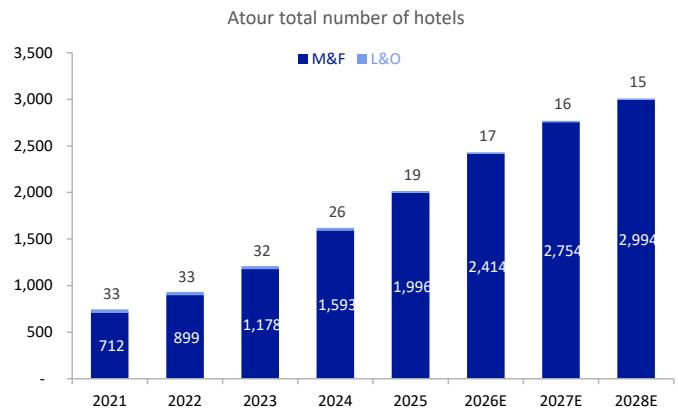

bar

| Year   | M&F  | L&O |
| ------ | ---- | --- |
| 2021   | 712  | 33  |
| 2022   | 899  | 33  |
| 2023   | 1,178| 32  |
| 2024   | 1,593| 26  |
| 2025   | 1,996| 19  |
| 2026E  | 2,414| 17  |
| 2027E  | 2,754| 16  |
| 2028E  | 2,994| 15  |

Source : Company data, DB estimate

Figure 35: Atour: number of franchised hotel added per year   
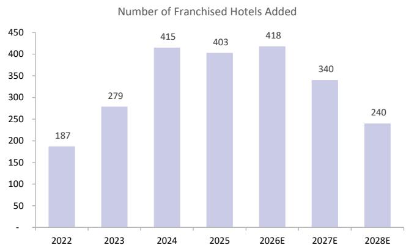

bar

Number of Franchised Hotels Added
| Year | Number of Franchised Hotels Added |
| :--- | :--- |
| 2022 | 187 |
| 2023 | 279 |
| 2024 | 415 |
| 2025 | 403 |
| 2026E | 418 |
| 2027E | 340 |
| 2028E | 240 |

Source : Company data, DB estimate

Figure 36: Atour: revenue per new franchised hotel added   
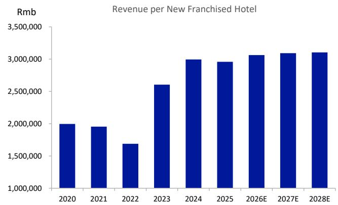

bar

Revenue per New Franchised Hotel
| Year | Revenue (Rmb) |
| :--- | :--- |
| 2020 | 2000000 |
| 2021 | 1950000 |
| 2022 | 1700000 |
| 2023 | 2600000 |
| 2024 | 3000000 |
| 2025 | 2950000 |
| 2026E | 3050000 |
| 2027E | 3100000 |
| 2028E | 3125000 |

Source : Company data, DB estimate

Figure 37: Atour: hotel breakdown by operating model   
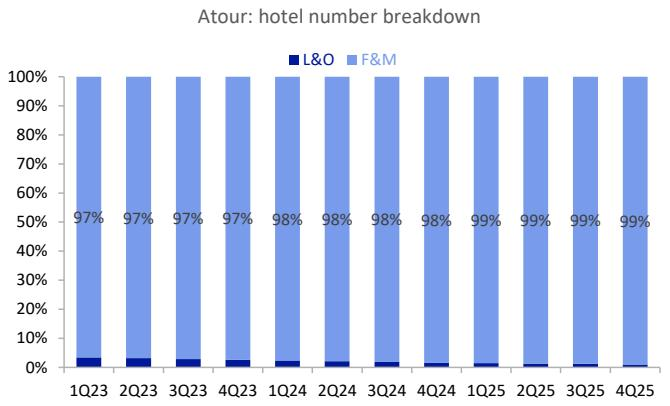

bar_stacked

Atour: hotel number breakdown
| Quarter | L&O (%) | F&M (%) |
| :--- | :--- | :--- |
| 1Q23 | 3 | 97 |
| 2Q23 | 3 | 97 |
| 3Q23 | 3 | 97 |
| 4Q23 | 3 | 97 |
| 1Q24 | 3 | 98 |
| 2Q24 | 3 | 98 |
| 3Q24 | 3 | 98 |
| 4Q24 | 3 | 98 |
| 1Q25 | 3 | 99 |
| 2Q25 | 3 | 99 |
| 3Q25 | 3 | 99 |
| 4Q25 | 3 | 99 |

Source : Company data, DB estimate

Figure 38: Atour: total number of hotels   
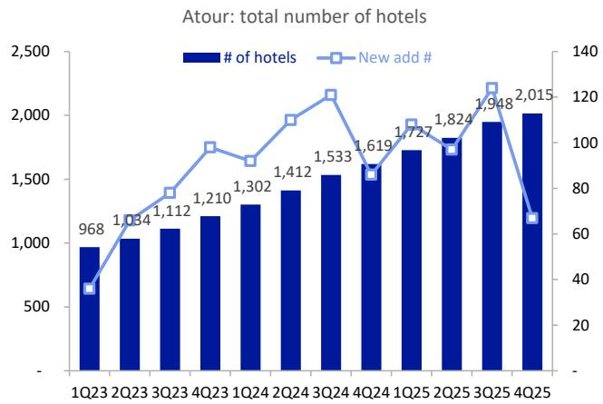

bar_line

Atour: total number of hotels
| Quarter | # of hotels | New add # |
| :--- | :--- | :--- |
| 1Q23 | 968 | 37 |
| 2Q23 | 1,034 | 60 |
| 3Q23 | 1,112 | 80 |
| 4Q23 | 1,210 | 100 |
| 1Q24 | 1,302 | 95 |
| 2Q24 | 1,412 | 105 |
| 3Q24 | 1,533 | 120 |
| 4Q24 | 1,619 | 90 |
| 1Q25 | 1,727 | 105 |
| 2Q25 | 1,824 | 95 |
| 3Q25 | 1,948 | 120 |
| 4Q25 | 2,015 | 70 |

Source : Company data, DB estimate

# Atour's CRS: enhancing membership engagement

Similar to H World, Atour leverages a robust membership ecosystem to cultivate brand loyalty and anchor its unique Atour Planet lifestyle platform. Mmebers' benefits include exclusive discounts, extended check-out privileges (up to 16:00), and complimentary breakfast for elite tiers. A standout feature is the signature "Late Night Hearth" (complimentary late-night porridge), a service touchpoint that significantly enhances the guest experience and differentiates the brand in the mid-to-high-end segment.

From 2023 to 2025, Atour's direct sales channels accounted for approximately $63\%$ of total room nights. This high direct-booking ratio drives sUBStantial operational efficiency by minimizing third-party acquisition costs. Notably, while Trip.com remains a major shareholder and strategic partner, it contributes less than $10\%$ of Atour's GMV. This underscores Atour's limited dependence on external OTAs and highlights the strength of its proprietary distribution network.

Figure 39: Atour: CRS contribution   
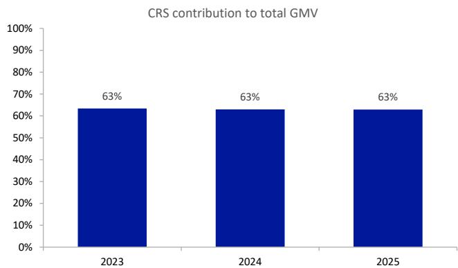

bar

CRS contribution to total GMV
| Year | Contribution (%) |
| :--- | :--- |
| 2023 | 63 |
| 2024 | 63 |
| 2025 | 63 |

Source : Company data, DB estimate

Figure 40: Atour: Trip.com contribution   
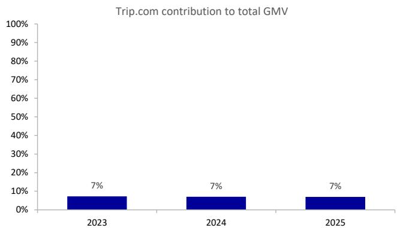

bar

Trip.com contribution to total GMV
| Year | Contribution (%) |
| :--- | :--- |
| 2023 | 7 |
| 2024 | 7 |
| 2025 | 7 |

Source : Company data, DB estimate

# Cyclical turning point: Atour RevPAR stabilizes in 4Q25

Since 4Q25, major players, including Atour, have reported positive ADR growth, signaling that the period of sacrificing pricing for volume looks to have ended. Although 4Q25 occupancy remains under slight pressure, improving demand is expected to gradually drive traffic in 2026 based on our industry forecast. By 1Q26, we observed sustainable growth in leisure demand and a potential turnaround in corporate travel. Consequently, we anticipate that both ADR and Occ will bottom out in 2026, driving RevPAR growth for Atour.

Figure 41: Atour: quarterly group revenue forecast   
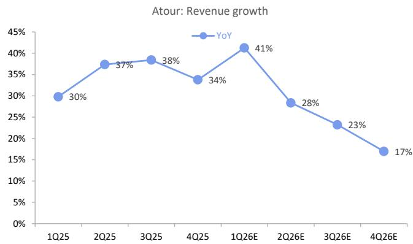

line

| Quarter | YoY  |
| ------- | ---- |
| 1Q25    | 30%  |
| 2Q25    | 37%  |
| 3Q25    | 38%  |
| 4Q25    | 34%  |
| 1Q26E   | 41%  |
| 2Q26E   | 28%  |
| 3Q26E   | 23%  |
| 4Q26E   | 17%  |

Source : Company data, DB estimate

Figure 42: Atour: quarterly hotel revenue forecast   
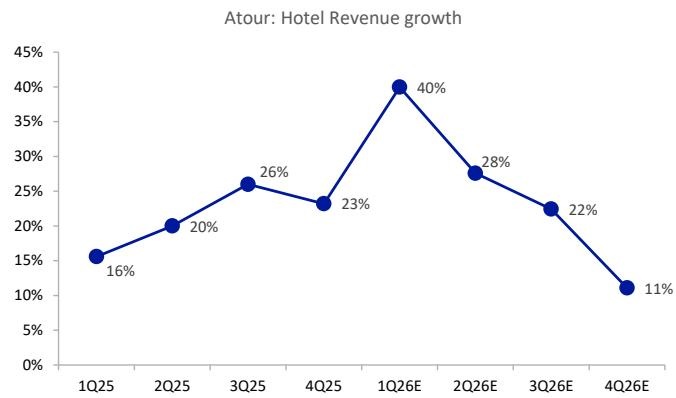

line

Atour: Hotel Revenue growth
| Quarter | Revenue Growth (%) |
| :--- | :--- |
| 1Q25 | 16 |
| 2Q25 | 20 |
| 3Q25 | 26 |
| 4Q25 | 23 |
| 1Q26E | 40 |
| 2Q26E | 28 |
| 3Q26E | 22 |
| 4Q26E | 11 |

Source : Company data, DB estimate

Figure 43: Atour: quarterly Revpar forecast   
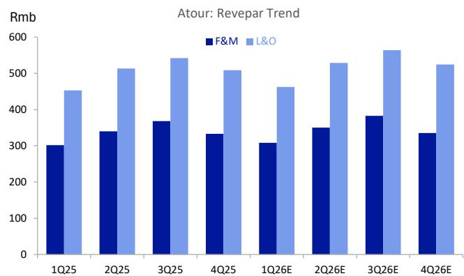

bar

| Quarter | F&M  | L&O  |
|---------|------|------|
| 1Q25    | 300  | 450  |
| 2Q25    | 340  | 510  |
| 3Q25    | 370  | 540  |
| 4Q25    | 330  | 500  |
| 1Q26E   | 310  | 460  |
| 2Q26E   | 350  | 520  |
| 3Q26E   | 380  | 560  |
| 4Q26E   | 330  | 520  |

Source : Company data, DB estimate

Figure 44: Atour: quarterly group Revpar YoY   
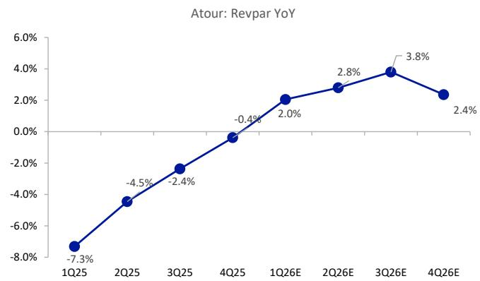

line

| Quarter | Revenue YoY |
| ------- | ----------- |
| 1Q25    | -7.3%       |
| 2Q25    | -4.5%       |
| 3Q25    | -2.4%       |
| 4Q25    | -0.4%       |
| 1Q26E   | 2.0%        |
| 2Q26E   | 2.8%        |
| 3Q26E   | 3.8%        |
| 4Q26E   | 2.4%        |

Source : Company data, DB estimate

Figure 45: Atour: quarterly ADR forecast   
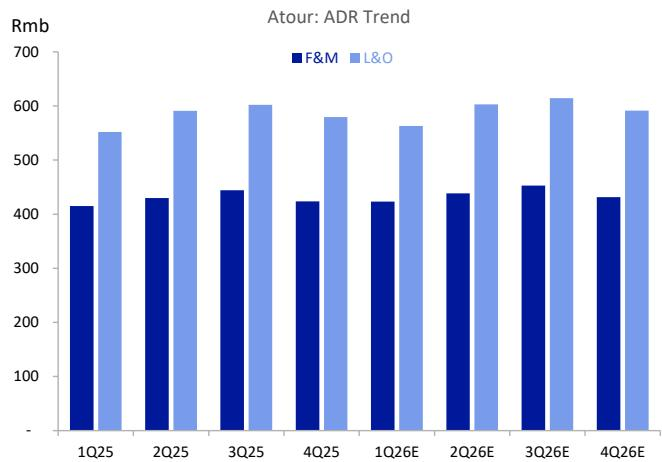

bar

Atour: ADR Trend
| Quarter | F&M (Rmb) | L&O (Rmb) |
| :--- | :--- | :--- |
| 1Q25 | 415 | 550 |
| 2Q25 | 430 | 590 |
| 3Q25 | 445 | 605 |
| 4Q25 | 425 | 580 |
| 1Q26E | 425 | 565 |
| 2Q26E | 440 | 605 |
| 3Q26E | 455 | 615 |
| 4Q26E | 430 | 590 |

Source : Company data, DB estimate

Figure 46: Atour: quarterly ADR YoY   
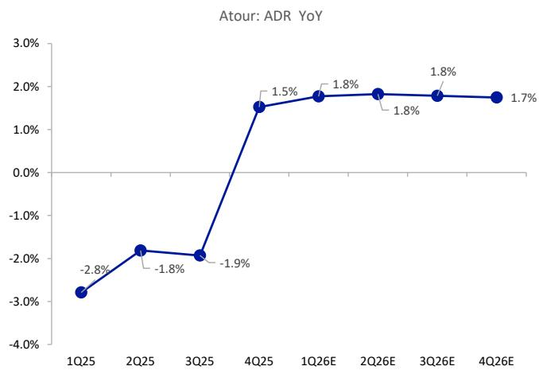

line

| Quarter | YoY Change |
| ------- | ---------- |
| 1Q25    | -2.8%      |
| 2Q25    | -1.8%      |
| 3Q25    | -1.9%      |
| 4Q25    | 1.5%       |
| 1Q26E   | 1.8%       |
| 2Q26E   | 1.8%       |
| 3Q26E   | 1.8%       |
| 4Q26E   | 1.7%       |

Source : Company data, DB estimate

Figure 47: Atour: quarterly Occ forecast   
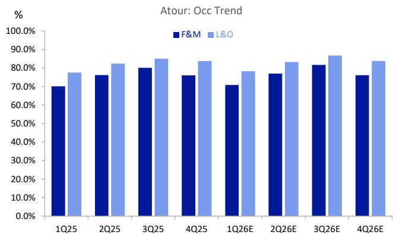

bar

Atour: Occ Trend
| Quarter | F&M (%) | L&O (%) |
| :--- | :--- | :--- |
| 1Q25 | 70.0 | 77.0 |
| 2Q25 | 76.0 | 82.0 |
| 3Q25 | 80.0 | 85.0 |
| 4Q25 | 76.0 | 83.0 |
| 1Q26E | 71.0 | 78.0 |
| 2Q26E | 77.0 | 83.0 |
| 3Q26E | 81.0 | 86.0 |
| 4Q26E | 76.0 | 84.0 |

Source : Company data, DB estimate

Figure 48: Atour: quarterly Occ YoY   
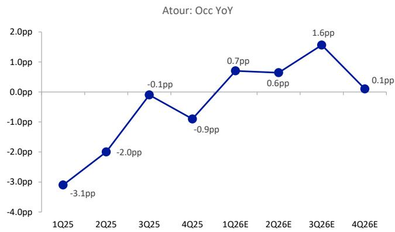

line

| Quarter | Value |
| ------- | ----- |
| 1Q25    | -3.1pp |
| 2Q25    | -2.0pp |
| 3Q25    | -0.1pp |
| 4Q25    | -0.9pp |
| 1Q26E   | 0.7pp |
| 2Q26E   | 0.6pp |
| 3Q26E   | 1.6pp |
| 4Q26E   | 0.1pp |

Source : Company data, DB estimate

Figure 49: Atour: total number of hotels   
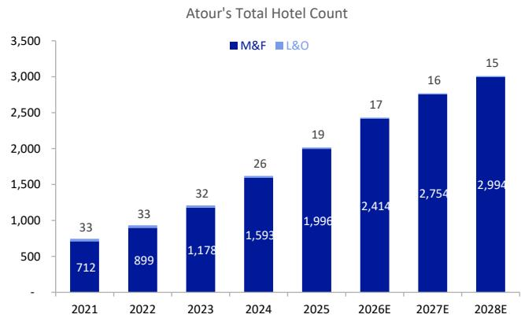

bar

| Year   | M&F   | L&O  |
| ------ | ----- | ---- |
| 2021   | 712   | 33   |
| 2022   | 899   | 33   |
| 2023   | 1,178 | 32   |
| 2024   | 1,593 | 26   |
| 2025   | 1,996 | 19   |
| 2026E  | 2,414 |      |
| 2027E  | 2,754 |      |
| 2028E  | 2,994 |      |

Source : Company data, DB estimate

Figure 50: Atour: revenue forecast by category YoY   
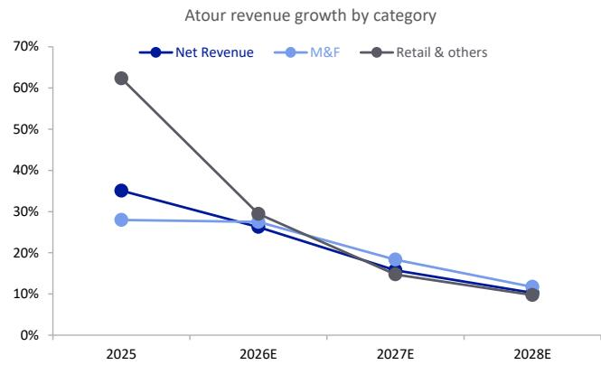

line

| Year   | Net Revenue | M&F  | Retail & others |
| ------ | ----------- | ---- | --------------- |
| 2025   | 35%         | 28%  | 62%             |
| 2026E  | 26%         | 28%  | 30%             |
| 2027E  | 15%         | 18%  | 14%             |
| 2028E  | 10%         | 12%  | 10%             |

Source : Company data, DB estimate

# Atour's "Sleep Economy" strategy: unlocking new markets through premium retail

Beyond its asset-light hotel business model, a key differentiator for Atour is its unique retail business, which extends revenue sources beyond traditional hotel operations. Atour's new retail strategy initially centered on the sale of key SKUs, specifically deep sleep memory foam pillows. The core message of this strategy aims to establish Atour as a brand synonymous with 'good sleep,' emphasizing a premium positioning and a significantly higher price compared to mass-market brands. In an era where consumers increasingly prioritize sleep quality due to daily pressures, Atour has successfully capitalized on this market opportunity as a first mover, thereby opening a new growth engine for its existing hotel business.

As of 2025, the retail business contributes 40% of Atour's total revenue, with the remaining 60% originating from its hotel operations. Notably, the retail business demonstrates a faster growth trajectory, exhibiting a 62% YoY increase in 2025, following sUBStantial jumps of 114% in 2024 and 221% in 2023.

Figure 51: Atour: revenue breakdown by segment 

<table><tr><td rowspan="2">(Rmb mn)</td><td colspan="10">Assumption</td></tr><tr><td>2019</td><td>2020</td><td>2021</td><td>2022</td><td>2023</td><td>2024</td><td>2025</td><td>2026E</td><td>2027E</td><td>2028E</td></tr><tr><td colspan="11">Revenue summary</td></tr><tr><td>Net Revenue</td><td>1,567</td><td>1,567</td><td>2,148</td><td>2,263</td><td>4,666</td><td>7,248</td><td>9,790</td><td>12,359</td><td>14,307</td><td>15,777</td></tr><tr><td>F&amp;M</td><td>840</td><td>926</td><td>1,220</td><td>1,361</td><td>2,706</td><td>4,149</td><td>5,309</td><td>6,768</td><td>8,008</td><td>8,946</td></tr><tr><td>L&amp;O</td><td>615</td><td>496</td><td>630</td><td>553</td><td>840</td><td>702</td><td>590</td><td>555</td><td>520</td><td>489</td></tr><tr><td>Retail</td><td>112</td><td>144</td><td>297</td><td>349</td><td>1,120</td><td>2,397</td><td>3,891</td><td>5,036</td><td>5,778</td><td>6,342</td></tr><tr><td>% of Net revenue</td><td>-</td><td>-</td><td>-</td><td>-</td><td>-</td><td>-</td><td>-</td><td>-</td><td>-</td><td>-</td></tr><tr><td>Manachised</td><td>54%</td><td>59%</td><td>57%</td><td>60%</td><td>58%</td><td>57%</td><td>54%</td><td>55%</td><td>56%</td><td>57%</td></tr><tr><td>Leased</td><td>39%</td><td>32%</td><td>29%</td><td>24%</td><td>18%</td><td>10%</td><td>6%</td><td>4%</td><td>4%</td><td>3%</td></tr><tr><td>Retail</td><td>7%</td><td>9%</td><td>14%</td><td>15%</td><td>24%</td><td>33%</td><td>40%</td><td>41%</td><td>40%</td><td>40%</td></tr></table>

Source : Company data, DB estimate

# OEM model for the product development and supply chain

Atour leverages robust in-house design and R&D capabilities, collaborating closely with top-tier OEM partners throughout the manufacturing process. To ensure standardized and scalable production, the company provides partners with rigorous technical specifications and proprietary reference samples. By adhering to the industry's highest quality standards, Atour effectively reinforces its premium brand image and ensures consistently positive customer feedback, which is critical for maintaining its leadership in the "sleep economy."

# Online channels as a major distribution channel

Atour primarily sells retail products through leading third-party e-commerce platforms in China, such as Tmall, JD.com, and Douyin. Complementing this, Atour has developed a comprehensive online sales platform that integrates e-commerce functionalities into its mobile app and mini-programs. This multi-channel online approach has been highly successful, with approximately 80.3%, 90.7%, and 93.1% of Atour's retail business's GMV generated online in 2023, 2024, and 2025, respectively. Through these online channels, Atour generally sells products directly to end customers, enabling direct engagement with a broad customer base.

Figure 52: Atour: e-commerce contribution to retail sales   
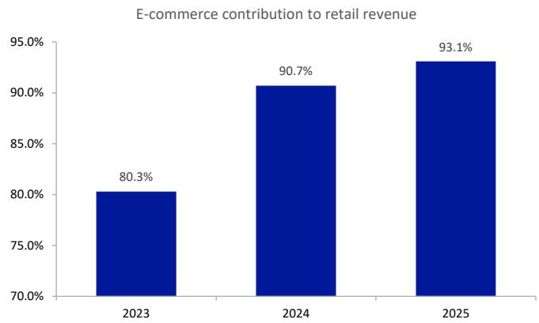

bar

E-commerce contribution to retail revenue
| Year | E-commerce contribution to retail revenue (%) |
| :--- | :--- |
| 2023 | 80.3 |
| 2024 | 90.7 |
| 2025 | 93.1 |

Source : Company data, DB estimate

# Offline channel is built on its extensive hotel networks

Beyond online distribution, Atour has developed a unique, scenario-based retail model seamlessly integrated into its extensive hotel networks. Atour's guest rooms serve as fully immersive product experience spaces, allowing guests to explore and try retail products during their stay, which in turn fosters brand loyalty. Atour equips specific hotel room types with its Atour Planet deep sleep products, enabling guests to opt for a sleep trial as part of its APLUS service. This allows guests to personally experience Atour's retail offerings during their hotel stays. Despite the strong online presence, offline channels contributed significantly to Atour's retail business GMV, accounting for approximately 19.7%, 9.3%, and 6.9% in 2023, 2024, and 2025, respectively.

# Atour's retail strategy starts from "deep sleep pillow"

Atour's "Pro 1.0" deep sleep memory foam pillow, launched in 2023, was upgraded to "Pro 3.0" in August 2025. This product, with an ASP over RMB 500 per item, established Atour's premium market positioning and served as a pivotal entry point into a broader range of sleep-related accessories. Atour's peers are priced at a RMB 200-300 level, indicating a discount compared to Atour's pricing.

In 2025, pillows comprised 67% of Atour's total retail sales, according to our e-commerce sales tracker. Building on this success, Atour expanded its offerings to include the "Deep Sleep Thermo-Regulating Comforter Pro," which now accounts for 19% of total online retail sales as the second-largest SKU.

Based on our estimates, Atour holds a 23% market share in the pillows market on e-commerce platforms. The ratio rose from 6% in 2023, to 21% in 2025, and 23% in 1Q26. Despite Atour's growth decelerating given its scale, its market share continues to rise against the fierce competition in the category. We believe that Atour's branding and unique premium and high-quality positioning help it maintain competitiveness despite increased market entrants.

Figure 53: Atour: ASP of all products on Tmall/Taobao   
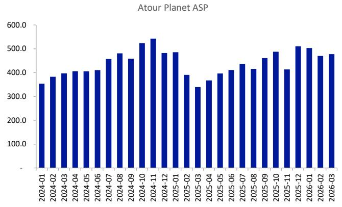

bar

Atour Planet ASP
| Month | Value |
|---|---|
| 2024-01 | 350.0 |
| 2024-02 | 380.0 |
| 2024-03 | 395.0 |
| 2024-04 | 405.0 |
| 2024-05 | 410.0 |
| 2024-06 | 415.0 |
| 2024-07 | 455.0 |
| 2024-08 | 480.0 |
| 2024-09 | 455.0 |
| 2024-10 | 525.0 |
| 2024-11 | 545.0 |
| 2024-12 | 485.0 |
| 2025-01 | 485.0 |
| 2025-02 | 390.0 |
| 2025-03 | 335.0 |
| 2025-04 | 365.0 |
| 2025-05 | 395.0 |
| 2025-06 | 410.0 |
| 2025-07 | 435.0 |
| 2025-08 | 415.0 |
| 2025-09 | 460.0 |
| 2025-10 | 485.0 |
| 2025-11 | 415.0 |
| 2025-12 | 510.0 |
| 2026-01 | 505.0 |
| 2026-02 | 475.0 |
| 2026-03 | 475.0 |

Source :Moojing, DB estimate

Figure 54: Atour: online sales breakdown by category   
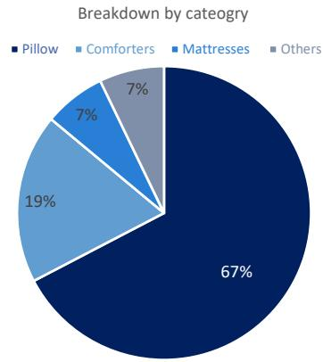

pie

Breakdown by category
| Category | Percentage (%) |
| :--- | :--- |
| Pillow | 67 |
| Comforters | 19 |
| Mattresses | 7 |
| Others | 7 |

Source : Moojing, DB estimate

Figure 55: Atour: pillow brand market share   
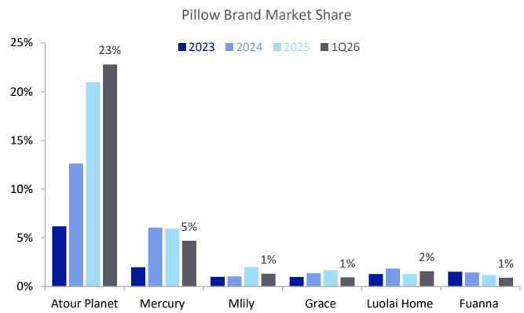

bar

Pillow Brand Market Share
| Company | 2023 (%) | 2024 (%) | 2025 (%) | 1Q26 (%) |
| :--- | :--- | :--- | :--- | :--- |
| Atour Planet | 6 | 12.8 | 21 | 23 |
| Mercury | 2 | 6 | 6 | 5 |
| Mlily | 1 | 1 | 2 | 1 |
| Grace | 1 | 1.7 | 2 | 1 |
| Luolai Home | 1.5 | 2 | 1.5 | 2 |
| Fuanna | 1.7 | 1.7 | 1.5 | 1 |

Source :Moojing, DB estimate

Figure 56: Atour: pillow price comparison   
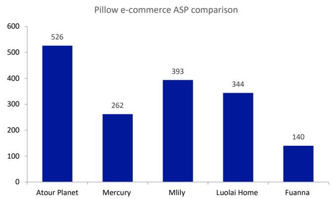

bar

Pillow e-commerce ASP comparison
| Company | Value |
| :--- | :--- |
| Atour Planet | 526 |
| Mercury | 262 |
| Mlily | 393 |
| Luolai Home | 344 |
| Fuanna | 140 |

Source : Moojing, DB estimate

# Competition in the memory foam pillow market

Following the strong growth of Atour's deep sleep memory foam pillows between 2023 and 2025, traditional home textile giants have aggressively entered the market. These competitors are now introducing similar memory foam pillows, often at lower price points, to seize market share from Atour Planet.

Traditional home textile players possess advantages in their supply chains and lower cost structures due to their ownership of factories, rather than relying solely on outsourcing. Their full-chain control, from fabric research and development to finished product delivery, results in comprehensive production costs that are 15-20% lower than Atour's OEM model, making their products more cost-effective. Key players such as Mercury, Mlily, Luolai Home, and Fuana, all boast mature supply chains and production capaCities. Historically, these brands dominated offline channels. Their major products, equivalent to Atour's pillows, are generally priced at a 10-20% discount to attract new users.

Furthermore, starting in 2025, these leading home textile brands have sUBStantially increased their investment in online marketing and IP collaborations to attract younger consumer demographics. While their historical strength lay in extensive offline distribution networks, catering to traditional shopping and trial preferences, these brands, with over 1000-2000 stores across China, are now actively strengthening their online presence to capture opportunities presented by younger consumers who prefer online shopping over physical stores.

# Comforters as another growth driver for Atour's new retail business

Atour's retail business growth also hinges on its ability to replicate the success of its pillow offerings across other product categories. Beyond pillows, Atour's expansion is driven by a gradual move towards a comprehensive range of sleep products, including comforters, mattresses, and sleepwear. This strategy aims to facilitate the upgrade and conversion of users from "individual product purchases" to "full-room sleep solutions." Atour's temperature-controlled comforters, launched in 2023, have become the second-largest SKU within its deep sleep product categories. These comforters essentially combine existing features, resolving the traditional dilemma of "temperature control and convenient cleaning not being achievable simultaneously."

In 2025, Atour's total retail business achieved over RMB 3 billion in sales. We assume that from 2025-2028E, comforters can enjoy a 30% CAGR, followed by mattresses and other products at 27% and 25%, respectively. This growth trajectory is projected to drive Atour's total retail business to deliver a CAGR of 17%.

Figure 57: Atour: retail sales forecast by category   
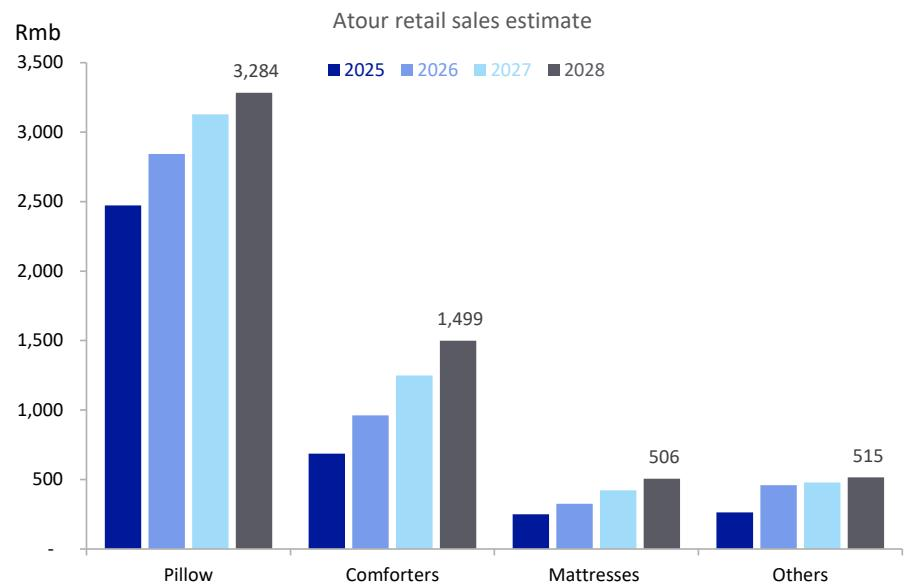

bar

Atour retail sales estimate
| Category | 2025 (Rmb) | 2026 (Rmb) | 2027 (Rmb) | 2028 (Rmb) |
| :--- | :--- | :--- | :--- | :--- |
| Pillow | 2480 | 2850 | 3130 | 3284 |
| Comforters | 680 | 970 | 1260 | 1499 |
| Mattresses | 260 | 330 | 430 | 506 |
| Others | 270 | 460 | 480 | 515 |

Source : Moojing, Company data, DB estimate

# Our growth estimate of the pillow business

Given intensified competition from a growing number of players offering premium sleep-related products at lower prices, Atour will inevitably face greater challenges in 2026. However, increased marketing efforts from leading traditional players and the introduction of more affordable products will also enhance consumer education within the category. This broader consumer awareness means more consumers who previously have not purchased memory foam pillows or premium sleep products may be inclined to try them, helping the category enjoy steady growth, benefiting both Atour and other brands.

Figure 58: Atour: pillow market share by product type   
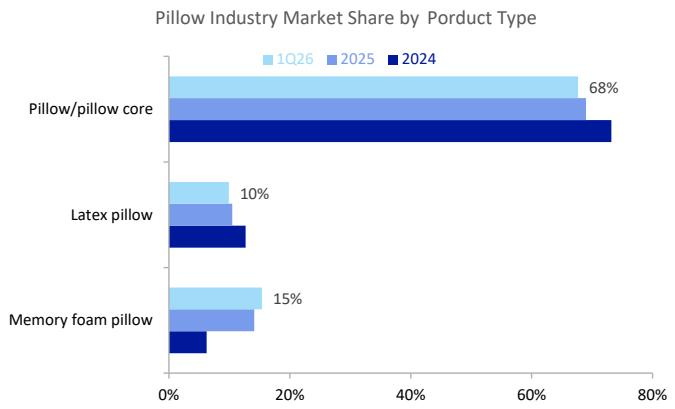

bar

Pillow Industry Market Share by Porduct Type
| Product Type | 1Q26 (%) | 2025 (%) | 2024 (%) |
|---|---|---|---|
| Pillow/pillow core | 68 | 67 | 73 |
| Latex pillow | 10 | 11 | 13 |
| Memory foam pillow | 15 | 14 | 6 |

Source : Moojing, DB estimate

Considering the impact of sleep-related products on sleep quality and health, Atour is also well-positioned to attract consumers who prioritize health and sleep quality. We factor in decelerating growth for Atour's retail & other business segment to 29%, 15%, and 10% from 2026E to 2028E, respectively, considering its scale. We believe it is feasible for Atour to achieve faster-than-industry growth (approximately 5%) despite the fierce competition.

Figure 59: Atour: revenue growth forecast   
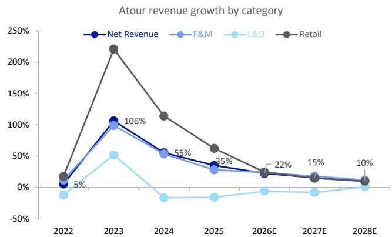

line

| Year   | Net Revenue | F&M  | L&O  | Retail |
|--------|-------------|------|------|--------|
| 2022   | 5%          |      |      | 5%     |
| 2023   | 106%        |      |      | 220%   |
| 2024   | 55%         |      |      | 110%   |
| 2025   | 35%         |      |      | 60%    |
| 2026E  | 22%         |      |      | 20%    |
| 2027E  | 15%         |      |      | 10%    |
| 2028E  | 10%         |      |      | 10%    |

Source : Company data, DB estimate

Figure 60: Atour: GPM forecast   
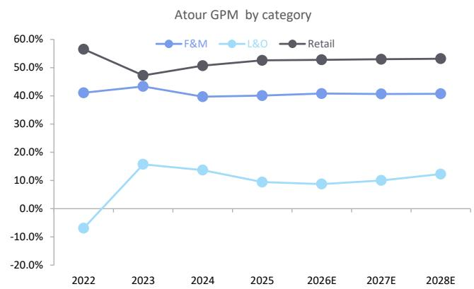

line

| Year   | F&M    | L&O    | Retail |
| ------ | ------ | ------ | ------ |
| 2022   | 41.0%  | -7.0%  | 56.0%  |
| 2023   | 43.0%  | 15.0%  | 47.0%  |
| 2024   | 40.0%  | 13.0%  | 50.0%  |
| 2025   | 40.0%  | 9.0%   | 52.0%  |
| 2026E  | 41.0%  | 8.0%   | 53.0%  |
| 2027E  | 41.0%  | 9.0%   | 53.0%  |
| 2028E  | 41.0%  | 11.0%  | 53.0%  |

Source : Company data, DB estimate

Figure 61: Atour: Tmall/Taobao sales YoY   
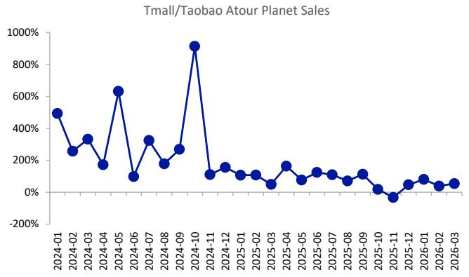

line

| Month    | Sales Growth |
| -------- | ------------ |
| 2024-01  | 500%         |
| 2024-02  | 250%         |
| 2024-03  | 350%         |
| 2024-04  | 180%         |
| 2024-05  | 650%         |
| 2024-06  | 100%         |
| 2024-07  | 330%         |
| 2024-08  | 180%         |
| 2024-09  | 270%         |
| 2024-10  | 920%         |
| 2024-11  | 120%         |
| 2024-12  | 160%         |
| 2025-01  | 130%         |
| 2025-02  | 110%         |
| 2025-03  | 50%          |
| 2025-04  | 170%         |
| 2025-05  | 90%          |
| 2025-06  | 130%         |
| 2025-07  | 110%         |
| 2025-08  | 80%          |
| 2025-09  | 130%         |
| 2025-10  | 30%          |
| 2025-11  | -50%         |
| 2025-12  | 60%          |
| 2026-01  | 110%         |
| 2026-02  | 40%          |
| 2026-03  | 60%          |

Source : Moojing, DB estimate

Figure 62: Atour: Douyin sales YoY   
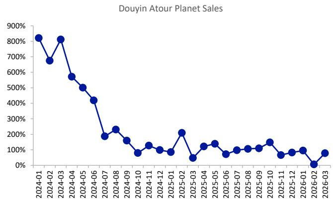

line

| Date     | Sales (%) |
| -------- | --------- |
| 2024-01  | 830       |
| 2024-02  | 680       |
| 2024-03  | 820       |
| 2024-04  | 570       |
| 2024-05  | 500       |
| 2024-06  | 420       |
| 2024-07  | 190       |
| 2024-08  | 230       |
| 2024-09  | 160       |
| 2024-10  | 80        |
| 2024-11  | 130       |
| 2024-12  | 110       |
| 2025-01  | 90        |
| 2025-02  | 210       |
| 2025-03  | 50        |
| 2025-04  | 130       |
| 2025-05  | 140       |
| 2025-06  | 80        |
| 2025-07  | 110       |
| 2025-08  | 110       |
| 2025-09  | 130       |
| 2025-10  | 150       |
| 2025-11  | 80        |
| 2025-12  | 90        |
| 2026-01  | 100       |
| 2026-02  | 30        |
| 2026-03  | 90        |

Source : Moojing, DB estimate

# Financial forecast and key assumptions

We hold a positive industry view on the China hotel sector, as we think that among all consumer spending categories, the travel market has proven to be resilient against the macro environment. Leisure demand has benefited from supportive policies (such as extended holiday periods) and a clear shift toward prioritizing services and experiences over physical goods since 2025. While business travel was previously dampened by slowing economic activity and geopolitical conflicts — a major concern given that over half of Atour's demand is business-related—the sector has stabilized since early 2026. This lack of further downward movement sets a solid foundation for a recovery trend throughout the year.

We forecast total revenue to grow by 26%, 16%, and 10% from 2026 to 2028, respectively. These projections are primarily driven by the continuous addition of new hotels under Atour's asset-light model and an anticipated expansion in RevPAR as the industry reaches its cyclical bottom. Conversely, we have factored in a gradual decline in the "retail & others" segment given its current scale. Our conservative forecast also provides potential upside, if Atour can maintain its strong retail momentum. For adjusted net profit, we project year-over-year growth of 25%, 16%, and 11% over the same period.

Figure 63: Atour: key financial assumption 

<table><tr><td rowspan="2">(Rmb mn)</td><td rowspan="2">2025</td><td rowspan="2">2026E</td><td rowspan="2">2027E</td><td rowspan="2">2028E</td><td colspan="4">Net change</td></tr><tr><td>2025</td><td>2026E</td><td>2027E</td><td>2028E</td></tr><tr><td colspan="9">Revenue summary</td></tr><tr><td>Net Revenue</td><td>9,790</td><td>12,359</td><td>14,307</td><td>15,777</td><td>35%</td><td>26%</td><td>16%</td><td>10%</td></tr><tr><td>M&amp;F</td><td>5,309</td><td>6,768</td><td>8,008</td><td>8,946</td><td>28%</td><td>27%</td><td>18%</td><td>12%</td></tr><tr><td>L&amp;O</td><td>590</td><td>555</td><td>520</td><td>489</td><td>-16%</td><td>-6%</td><td>-6%</td><td>-6%</td></tr><tr><td>Retail &amp; others</td><td>3,891</td><td>5,036</td><td>5,778</td><td>6,342</td><td>62%</td><td>29%</td><td>15%</td><td>10%</td></tr><tr><td colspan="9">% of Net revenue</td></tr><tr><td>Manachised</td><td>54%</td><td>55%</td><td>56%</td><td>57%</td><td>-3.0pp</td><td>0.5pp</td><td>1.2pp</td><td>0.7pp</td></tr><tr><td>Leased</td><td>6%</td><td>4%</td><td>4%</td><td>3%</td><td>-3.7pp</td><td>-1.5pp</td><td>-0.9pp</td><td>-0.5pp</td></tr><tr><td>Retail &amp; others</td><td>40%</td><td>41%</td><td>40%</td><td>40%</td><td>6.7pp</td><td>1.0pp</td><td>-0.4pp</td><td>-0.2pp</td></tr><tr><td colspan="9">Gross Profit summary</td></tr><tr><td>Gross Profit summary</td><td>4,307</td><td>5,549</td><td>6,427</td><td>7,123</td><td>43%</td><td>29%</td><td>16%</td><td>11%</td></tr><tr><td>M&amp;F</td><td>2,127</td><td>2,748</td><td>3,210</td><td>3,587</td><td>29%</td><td>29%</td><td>17%</td><td>12%</td></tr><tr><td>L&amp;O</td><td>56</td><td>45</td><td>48</td><td>51</td><td>-42%</td><td>-18%</td><td>5%</td><td>7%</td></tr><tr><td>Retail &amp; others</td><td>2,124</td><td>2,755</td><td>3,169</td><td>3,485</td><td>67%</td><td>30%</td><td>15%</td><td>10%</td></tr><tr><td colspan="9">% of Gross Profit</td></tr><tr><td>M&amp;F</td><td>49%</td><td>50%</td><td>50%</td><td>50%</td><td>-5.3pp</td><td>0.1pp</td><td>0.4pp</td><td>0.4pp</td></tr><tr><td>L&amp;O</td><td>1%</td><td>1%</td><td>1%</td><td>1%</td><td>-1.9pp</td><td>-0.5pp</td><td>-0.1pp</td><td>0.0pp</td></tr><tr><td>Retail &amp; others</td><td>49%</td><td>50%</td><td>49%</td><td>49%</td><td>7.2pp</td><td>0.3pp</td><td>-0.3pp</td><td>-0.4pp</td></tr><tr><td>GPM</td><td>44.0%</td><td>44.9%</td><td>44.9%</td><td>45.1%</td><td>2.4pp</td><td>0.9pp</td><td>0.0pp</td><td>0.2pp</td></tr><tr><td>M&amp;F</td><td>40.1%</td><td>40.6%</td><td>40.1%</td><td>40.1%</td><td>0.4pp</td><td>0.5pp</td><td>-0.5pp</td><td>0.0pp</td></tr><tr><td>L&amp;O</td><td>9.4%</td><td>8.2%</td><td>9.2%</td><td>10.5%</td><td>-4.2pp</td><td>-1.2pp</td><td>1.0pp</td><td>1.3pp</td></tr><tr><td>Retail &amp; others</td><td>52.6%</td><td>52.8%</td><td>53.0%</td><td>53.2%</td><td>1.9pp</td><td>0.2pp</td><td>0.2pp</td><td>0.2pp</td></tr><tr><td colspan="9">Operation summary</td></tr><tr><td>Hotel number</td><td>2,015</td><td>2,431</td><td>2,770</td><td>3,009</td><td>396</td><td>416</td><td>339</td><td>239</td></tr><tr><td>M&amp;F</td><td>1,996</td><td>2,414</td><td>2,754</td><td>2,994</td><td>403</td><td>418</td><td>340</td><td>240</td></tr><tr><td>L&amp;O</td><td>19</td><td>17</td><td>16</td><td>15</td><td>(7)</td><td>(2)</td><td>(1)</td><td>(1)</td></tr><tr><td colspan="9">Revenue per hotel</td></tr><tr><td>M&amp;F</td><td>2,958,408</td><td>3,069,583</td><td>3,099,222</td><td>3,112,862</td><td>-1%</td><td>4%</td><td>1%</td><td>0%</td></tr><tr><td>L&amp;O</td><td>26,238,756</td><td>30,816,688</td><td>31,516,108</td><td>31,554,377</td><td>8%</td><td>17%</td><td>2%</td><td>0%</td></tr><tr><td>EBITDA (adj)</td><td>2,481</td><td>3,102</td><td>3,593</td><td>4,000</td><td>40%</td><td>25%</td><td>16%</td><td>11%</td></tr><tr><td>EBITDA margin</td><td>25.3%</td><td>25.1%</td><td>25.1%</td><td>25.4%</td><td>0.9pp</td><td>-0.2pp</td><td>0.0pp</td><td>0.2pp</td></tr><tr><td>Net profit (adj)</td><td>1,753</td><td>2,185</td><td>2,526</td><td>2,808</td><td>34%</td><td>25%</td><td>16%</td><td>11%</td></tr><tr><td>Net margin</td><td>17.9%</td><td>17.7%</td><td>17.7%</td><td>17.8%</td><td>-0.1pp</td><td>-0.2pp</td><td>0.0pp</td><td>0.1pp</td></tr></table>

Source : Company data, DB estimate

# 1Q Preview

For 1Q26, we project Atour to report robust revenue growth of 41% YoY. This performance is anchored by a 45% increase in its M&F (Manachised & Franchised) business and a significant 45% surge in its retail segment. Notably, the Atour's retail brand continues to demonstrate strong momentum, propelled by strong Chinese New Year sales and a structural rise in consumer awareness regarding "sleep economy" products. Should Atour's retail segment maintain its current trajectory despite fierce competition, we see meaningful upside potential relative to the conservative market consensus and the company's initial full-year guidance of 25–30%. On the bottom line, we forecast adjusted net profit of Rmb 480 million, representing a 39% YoY increase.

The market is closely monitoring the latest retail trends to determine if actual performance will lead to a "beat and raise" regarding management's initial guidance. Meanwhile, investors are assessing the impact of higher fuel surcharges on travel incentives and management's guidance on 2Q26 travel demand.

Figure 64: Atour: key financial summary   
Financial summary 

<table><tr><td></td><td>1Q25</td><td>2Q25</td><td>3Q25</td><td>4Q25</td><td>1Q26E</td><td>2Q26E</td><td>3Q26E</td><td>4Q26E</td></tr><tr><td>Total revenue</td><td>1,906</td><td>2,469</td><td>2,628</td><td>2,788</td><td>2,692</td><td>3,169</td><td>3,238</td><td>3,261</td></tr><tr><td>YoY</td><td>30%</td><td>37%</td><td>38%</td><td>34%</td><td>41%</td><td>28%</td><td>23%</td><td>17%</td></tr><tr><td>Hotel revenue</td><td>1,161</td><td>1,449</td><td>1,724</td><td>1,565</td><td>1,625</td><td>1,848</td><td>2,111</td><td>1,739</td></tr><tr><td>YoY</td><td>16%</td><td>20%</td><td>26%</td><td>23%</td><td>40%</td><td>28%</td><td>22%</td><td>11%</td></tr><tr><td>Retail &amp; others</td><td>745</td><td>1,020</td><td>904</td><td>1,223</td><td>1,068</td><td>1,320</td><td>1,127</td><td>1,522</td></tr><tr><td>YoY</td><td>61%</td><td>73%</td><td>71%</td><td>50%</td><td>43%</td><td>29%</td><td>25%</td><td>24%</td></tr><tr><td>Gross profit</td><td>825</td><td>1,118</td><td>1,138</td><td>1,226</td><td>1,199</td><td>1,444</td><td>1,421</td><td>1,485</td></tr><tr><td>% GPM</td><td>43%</td><td>45%</td><td>43%</td><td>44%</td><td>45%</td><td>46%</td><td>44%</td><td>46%</td></tr><tr><td>S&amp;M</td><td>283</td><td>393</td><td>355</td><td>459</td><td>402</td><td>520</td><td>453</td><td>567</td></tr><tr><td>% of revenue</td><td>15%</td><td>16%</td><td>13%</td><td>16%</td><td>15%</td><td>16%</td><td>14%</td><td>17%</td></tr><tr><td>G&amp;A</td><td>162</td><td>90</td><td>100</td><td>165</td><td>188</td><td>162</td><td>172</td><td>165</td></tr><tr><td>% of revenue</td><td>8%</td><td>4%</td><td>4%</td><td>6%</td><td>7%</td><td>5%</td><td>5%</td><td>5%</td></tr><tr><td>Operating profit</td><td>355</td><td>596</td><td>651</td><td>704</td><td>609</td><td>762</td><td>796</td><td>740</td></tr><tr><td>% OPM</td><td>19%</td><td>24%</td><td>25%</td><td>25%</td><td>23%</td><td>24%</td><td>25%</td><td>23%</td></tr><tr><td>EBITDA</td><td>474</td><td>610</td><td>685</td><td>712</td><td>671</td><td>811</td><td>844</td><td>775</td></tr><tr><td>% EBITDA</td><td>25%</td><td>25%</td><td>26%</td><td>26%</td><td>25%</td><td>26%</td><td>26%</td><td>24%</td></tr><tr><td>Net Income</td><td>243</td><td>424</td><td>474</td><td>480</td><td>430</td><td>538</td><td>561</td><td>511</td></tr><tr><td>YoY</td><td>-5.6%</td><td>39.7%</td><td>23.2%</td><td>45.5%</td><td>77.1%</td><td>26.8%</td><td>18.5%</td><td>6.5%</td></tr><tr><td>Adjusted net profit</td><td>345</td><td>427</td><td>488</td><td>493</td><td>480</td><td>574</td><td>598</td><td>534</td></tr><tr><td>YoY</td><td>32.3%</td><td>30.2%</td><td>27.0%</td><td>48.0%</td><td>39.1%</td><td>34.5%</td><td>22.5%</td><td>8.2%</td></tr></table>

Source : Company data, DB estimate

Figure 65: Atour: key operation assumptions   
Operation summary 

<table><tr><td></td><td>1Q25</td><td>2Q25</td><td>3Q25</td><td>4Q25</td><td>1Q26E</td><td>2Q26E</td><td>3Q26E</td><td>4Q26E</td></tr><tr><td>Revpar</td><td>304</td><td>343</td><td>371</td><td>336</td><td>310</td><td>353</td><td>385</td><td>344</td></tr><tr><td>M&amp;F</td><td>302</td><td>340</td><td>368</td><td>333</td><td>308</td><td>350</td><td>383</td><td>342</td></tr><tr><td>L&amp;O</td><td>453</td><td>513</td><td>542</td><td>509</td><td>462</td><td>528</td><td>564</td><td>524</td></tr><tr><td>Revpar</td><td>-7.3%</td><td>-4.5%</td><td>-2.4%</td><td>-0.4%</td><td>2.0%</td><td>2.8%</td><td>3.8%</td><td>2.4%</td></tr><tr><td>M&amp;F YoY</td><td>-6.8%</td><td>-4.2%</td><td>-2.1%</td><td>0.0%</td><td>2.0%</td><td>3.0%</td><td>4.0%</td><td>2.6%</td></tr><tr><td>L&amp;O YoY</td><td>-0.4%</td><td>2.0%</td><td>2.8%</td><td>2.7%</td><td>2.0%</td><td>3.0%</td><td>4.0%</td><td>3.1%</td></tr><tr><td>ADR</td><td>418</td><td>433</td><td>447</td><td>426</td><td>425</td><td>441</td><td>455</td><td>434</td></tr><tr><td>M&amp;F</td><td>415</td><td>430</td><td>444</td><td>424</td><td>423</td><td>439</td><td>453</td><td>431</td></tr><tr><td>L&amp;O</td><td>552</td><td>591</td><td>602</td><td>580</td><td>563</td><td>603</td><td>614</td><td>592</td></tr><tr><td>ADR</td><td>-2.8%</td><td>-1.8%</td><td>-1.9%</td><td>1.5%</td><td>1.8%</td><td>1.8%</td><td>1.8%</td><td>1.7%</td></tr><tr><td>M&amp;F YoY</td><td>-2.6%</td><td>-1.4%</td><td>-1.7%</td><td>1.6%</td><td>2.0%</td><td>2.0%</td><td>2.0%</td><td>1.8%</td></tr><tr><td>L&amp;O YoY</td><td>1.8%</td><td>3.1%</td><td>2.6%</td><td>5.2%</td><td>2.0%</td><td>2.0%</td><td>2.0%</td><td>2.1%</td></tr><tr><td>Occ</td><td>70.2%</td><td>76.4%</td><td>80.2%</td><td>76.1%</td><td>70.9%</td><td>77.0%</td><td>81.8%</td><td>76.2%</td></tr><tr><td>M&amp;F</td><td>70.1%</td><td>76.2%</td><td>80.1%</td><td>76.0%</td><td>70.8%</td><td>77.0%</td><td>81.7%</td><td>76.1%</td></tr><tr><td>L&amp;O</td><td>77.5%</td><td>82.4%</td><td>85.0%</td><td>83.7%</td><td>78.3%</td><td>83.2%</td><td>86.7%</td><td>83.8%</td></tr><tr><td>Occ</td><td>-3.1pp</td><td>-2.0pp</td><td>-0.1pp</td><td>-0.9pp</td><td>0.7pp</td><td>0.6pp</td><td>1.6pp</td><td>0.1pp</td></tr><tr><td>M&amp;F YoY</td><td>-3.0pp</td><td>-2.0pp</td><td>-0.1pp</td><td>-0.9pp</td><td>0.7pp</td><td>0.8pp</td><td>1.6pp</td><td>0.1pp</td></tr><tr><td>L&amp;O YoY</td><td>-1.6pp</td><td>-1.3pp</td><td>-0.6pp</td><td>-1.0pp</td><td>0.8pp</td><td>0.8pp</td><td>1.7pp</td><td>0.1pp</td></tr><tr><td># of hotels</td><td>1,727</td><td>1,824</td><td>1,948</td><td>2,015</td><td>2,120</td><td>2,230</td><td>2,365</td><td>2,431</td></tr><tr><td>M&amp;F</td><td>1,702</td><td>1,800</td><td>1,924</td><td>1,996</td><td>2,101</td><td>2,211</td><td>2,346</td><td>2,414</td></tr><tr><td>L&amp;O</td><td>25</td><td>24</td><td>24</td><td>19</td><td>19</td><td>19</td><td>19</td><td>17</td></tr><tr><td>M&amp;F</td><td>99%</td><td>99%</td><td>99%</td><td>99%</td><td>99%</td><td>99%</td><td>99%</td><td>99%</td></tr><tr><td>L&amp;O</td><td>1%</td><td>1%</td><td>1%</td><td>1%</td><td>1%</td><td>1%</td><td>1%</td><td>1%</td></tr><tr><td>New add #</td><td>108</td><td>97</td><td>124</td><td>67</td><td>105</td><td>110</td><td>135</td><td>66</td></tr><tr><td>M&amp;F</td><td>109</td><td>98</td><td>124</td><td>72</td><td>105</td><td>110</td><td>135</td><td>68</td></tr><tr><td>L&amp;O</td><td>(1)</td><td>(1)</td><td>-</td><td>(5)</td><td>-</td><td>-</td><td>-</td><td>(2)</td></tr></table>

Source : Company data, DB estimate

# Initiate with Buy rating; target price US\$45

We initiate coverage on Atour Lifestyle with a Buy rating. As a niche player in the mid-to-high-end hotel segment, Atour is positioned for a robust three-year growth trajectory, powered by its unique "dual-engine" strategy: a disciplined expansion of its hotel network (targeted to grow from 2,000 to 3,000 properties by 2028), and a high-growth retail segment that has outperformed market expectations. In particular, Atour's new retail business offers upside compared to cautious market expectations in 2026. While the company guided for a conservative 25–30% YoY, our proprietary trackers indicate robust YTD momentum, with 1Q26 sales surging to above 45% YoY.

Our DCF-based target price is US\$45, implying a 17x one-year forward P/E. This valuation assumes a 9.5% WACC (2% risk-free rate, 6% market risk premium, and 1.5x beta) and a 0% terminal growth rate. (consistent with our consumer space with 0-2% TGR). With the company currently trading at 15.5x one-year forward P/E, we consider it attractive given undemanding valuation and high growth outlook.

Figure 66: Atour: DCF model 

<table><tr><td>Rmb mn</td><td>2021</td><td>2022</td><td>2023</td><td>2024</td><td>2025</td><td>2026E</td><td>2027E</td><td>2028E</td><td>2029E</td><td>2030E</td><td>2031E</td><td>2032E</td><td>2033E</td><td>2034E</td></tr><tr><td>Revenue</td><td>2,148</td><td>2,263</td><td>4,666</td><td>7,248</td><td>9,790</td><td>12,359</td><td>14,307</td><td>15,777</td><td>17,074</td><td>18,197</td><td>19,155</td><td>19,538</td><td>19,929</td><td>20,328</td></tr><tr><td>YoY %</td><td></td><td>5%</td><td>106%</td><td>55%</td><td>35%</td><td>26%</td><td>16%</td><td>10%</td><td>8%</td><td>7%</td><td>5%</td><td>2%</td><td>2%</td><td>2%</td></tr><tr><td>EBIT</td><td>196</td><td>410</td><td>924</td><td>1,622</td><td>2,307</td><td>2,907</td><td>3,398</td><td>3,805</td><td>4,203</td><td>4,571</td><td>4,907</td><td>5,005</td><td>5,105</td><td>5,208</td></tr><tr><td>EBIT margin</td><td>9%</td><td>18%</td><td>20%</td><td>22%</td><td>24%</td><td>24%</td><td>24%</td><td>24%</td><td>25%</td><td>25%</td><td>26%</td><td>26%</td><td>26%</td><td>26%</td></tr><tr><td>EBIT*(1-t)</td><td>134</td><td>329</td><td>695</td><td>1,201</td><td>1,583</td><td>2,035</td><td>2,378</td><td>2,664</td><td>2,942</td><td>3,200</td><td>3,435</td><td>3,504</td><td>3,574</td><td>3,645</td></tr><tr><td>YoY %</td><td></td><td>145%</td><td>112%</td><td>73%</td><td>32%</td><td>29%</td><td>17%</td><td>12%</td><td>10%</td><td>9%</td><td>7%</td><td>2%</td><td>2%</td><td>2%</td></tr><tr><td>D&amp;A</td><td>70</td><td>85</td><td>94</td><td>89</td><td>85</td><td>65</td><td>54</td><td>62</td><td>49</td><td>40</td><td>32</td><td>25</td><td>20</td><td>16</td></tr><tr><td>Change in working capital</td><td>147</td><td>(119)</td><td>917</td><td>228</td><td>131</td><td>231</td><td>248</td><td>146</td><td>132</td><td>119</td><td>107</td><td>96</td><td>86</td><td>78</td></tr><tr><td>Capex</td><td>(66)</td><td>(39)</td><td>(41)</td><td>(55)</td><td>(81)</td><td>(111)</td><td>(66)</td><td>(39)</td><td>(31)</td><td>(25)</td><td>(20)</td><td>(16)</td><td>(13)</td><td>(10)</td></tr><tr><td>Operating free cash flow</td><td>286</td><td>255</td><td>1,665</td><td>1,463</td><td>1,718</td><td>2,220</td><td>2,614</td><td>2,833</td><td>3,093</td><td>3,333</td><td>3,554</td><td>3,609</td><td>3,668</td><td>3,729</td></tr></table>

<table><tr><td colspan="2">Equity value</td></tr><tr><td>PV of FCF</td><td>18,603</td></tr><tr><td>Terminal value</td><td>39,255</td></tr><tr><td>NPV of terminal value</td><td>21,483</td></tr><tr><td>Enterprise value</td><td>40,085</td></tr><tr><td>Net cash</td><td>3,588</td></tr><tr><td>Equity value (Rmb mn)</td><td>43,673</td></tr><tr><td>Equity value (US$ mn)</td><td>6,284</td></tr><tr><td>Equity value (US$/shr)</td><td>45.0</td></tr><tr><td>Current price (US$/shr)</td><td>37.5</td></tr><tr><td>Up/(down)side</td><td>20.0%</td></tr><tr><td>Implied 2025E P/E</td><td>20x</td></tr><tr><td>Implied 2026E P/E</td><td>17x</td></tr></table>

<table><tr><td colspan="2">Assumptions</td></tr><tr><td>Cost of equity</td><td>11.0%</td></tr><tr><td>Cost of debt</td><td>5.0%</td></tr><tr><td>WACC</td><td>9.5%</td></tr><tr><td>Terminal growth rate, %</td><td>0.0%</td></tr><tr><td>Risk free rate</td><td>2.00%</td></tr><tr><td>Equity risk premium</td><td>6.0%</td></tr><tr><td>Beta</td><td>1.50</td></tr><tr><td>Tax rate</td><td>30%</td></tr><tr><td>Target debt/capital ratio</td><td>20%</td></tr></table>

Source : Company data, DB estimate

# Key risks

# Our thesis is subject to several key risks, including:

# 1. High Concentration in Upper-Midscale Segment

Unlike peers with diversified portfolios spanning economy hotels and mid to high end brands, Atour's growth is heavily tied to a single, premium-priced upper-midscale segment. A slowdown in the Chinese economy or a "trade-down" by consumers to more budget-friendly accommodations would leave Atour without a defensive brand to capture this shifting demand, making it highly sensitive to changes in middle-class discretionary spending.

# 2. Retail/E-commerce Execution and Competitive Pressures

A significant component of Atour's thesis is its robust retail business (including pillows, comforters, and accessories). However, this segment faces fierce competition from pure-play e-commerce brands and traditional home-goods retailers. Failure to effectively capture and capitalize on new growth opportunities within this evolving retail segment could lead to a decline in revenue.

# 3. Intensifying Competitive Landscape in Mid-to-High-End Hotels

China's hotel market remains highly competitive, with Atour needing to compete against numerous domestic and international players in the same price segment. Should competitors introduce comparable high-quality products at lower price points, Atour's market position and pricing power could come under significant pressure.

# 4. Franchisee Management and Network Expansion Risks

Atour's asset-light Management & Franchise (M&F) growth model is heavily reliant on robust franchisee relationships. These partnerships are critical for ensuring product quality, service consistency, and continuous new store expansion. Atour directly competes with established giants like H World (e.g., for its JI Hotel brand) for the same pool of franchisees. If competitors offer more attractive terms such as superior financing, lower fees, or higher guaranteed returns, Atour's pipeline for new hotel openings could significantly diminish, impacting its overall growth trajectory.

Model updated: 05 May 2026 

<table><tr><td>Running the numbers</td></tr><tr><td>Asia</td></tr><tr><td>China</td></tr><tr><td>Hotels / Leisure / Gaming</td></tr></table>

Atour Lifestyle 

<table><tr><td>Reuters: ATAT.OQ</td><td>Bloomberg: ATAT US</td></tr></table>

Buy 

<table><tr><td>Price (7 May 26)</td><td>USD 38.23</td></tr><tr><td>Target Price</td><td>USD 45.00</td></tr><tr><td>52 Week range</td><td>USD 28.41 - 42.90</td></tr><tr><td>Market cap (m)</td><td>USDm 5,318.6EURm 4,517.2</td></tr></table>

# Company Profile

Atour (ATAT), a leading Chinese hospitality group, has successfully positioned itself as a lifestyle brand that extends well beyond traditional hotel services. The company is currently in a "sweet spot" for network expansion. With 2,015 hotels as of 2025, Atour maintains a relatively small footprint compared to the 10,000+ locations managed by top-tier peers, offering significant white space for growth.

Price Performance   
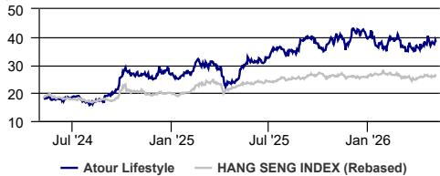

line

| Date   | Atour Lifestyle | HANG SENG INDEX (Rebased) |
|--------|-----------------|----------------------------|
| Jul '24 | 18              | 18                         |
| Jan '25 | 30              | 20                         |
| Jul '25 | 40              | 25                         |
| Jan '26 | 45              | 28                         |

Margin Trends   
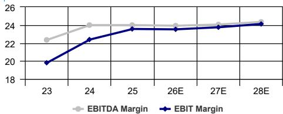

line

| Year | EBITDA Margin | EBIT Margin |
|------|---------------|-------------|
| 23   | 22.5          | 19.5        |
| 24   | 24.0          | 22.5        |
| 25   | 24.0          | 23.5        |
| 26E  | 24.0          | 23.5        |
| 27E  | 24.0          | 23.5        |
| 28E  | 24.0          | 24.0        |

Growth & Profitability   
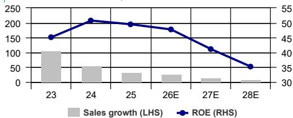

bar_line

| Year | Sales growth (LHS) | ROE (RHS) |
|---|---|---|
| 23 | 100 | 45 |
| 24 | 50 | 50 |
| 25 | 35 | 48 |
| 26E | 25 | 45 |
| 27E | 15 | 38 |
| 28E | 10 | 35 |

Solvency   
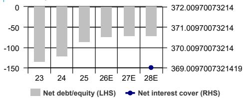

bar

| Year | Net debt/equity (LHS) | Net interest cover (RHS) |
|------|------------------------|--------------------------|
| 23   | -130                   | -                        |
| 24   | -110                   | -                        |
| 25   | -80                    | -                        |
| 26E  | -70                    | -                        |
| 27E  | -60                    | -                        |
| 28E  | -70                    | 369.0097007321419      |

Sammi Xu   
+852 2203 5415 sammi.xu@db.com

<table><tr><td>Fiscal year end 31-Dec</td><td>2023</td><td>2024</td><td>2025</td><td>2026E</td><td>2027E</td><td>2028E</td></tr><tr><td colspan="7">Financial Summary</td></tr><tr><td>DB EPS (CNY)</td><td>6.53</td><td>9.39</td><td>12.54</td><td>15.57</td><td>18.28</td><td>20.82</td></tr><tr><td>Reported EPS (CNY)</td><td>5.33</td><td>9.17</td><td>11.60</td><td>14.54</td><td>17.18</td><td>19.64</td></tr><tr><td>DPS (CNY)</td><td>0.16</td><td>0.45</td><td>0.78</td><td>0.86</td><td>0.94</td><td>1.04</td></tr><tr><td>BVPS (CNY)</td><td>15.3</td><td>21.4</td><td>25.7</td><td>35.7</td><td>48.7</td><td>64.0</td></tr><tr><td>Weighted average shares (m)</td><td>135</td><td>138</td><td>139</td><td>139</td><td>137</td><td>134</td></tr><tr><td>Average market cap (CNYm)</td><td>19,533</td><td>20,353</td><td>33,141</td><td>36,177</td><td>36,177</td><td>36,177</td></tr><tr><td>Enterprise value (CNYm)</td><td>16,005</td><td>15,520</td><td>27,514</td><td>29,012</td><td>27,135</td><td>25,123</td></tr></table>

Valuation Metrics 

<table><tr><td>P/E (DB) (x)</td><td>22.1</td><td>15.7</td><td>19.1</td><td>16.7</td><td>14.2</td><td>12.5</td></tr><tr><td>P/E (Reported) (x)</td><td>27.1</td><td>16.1</td><td>20.6</td><td>17.9</td><td>15.1</td><td>13.2</td></tr><tr><td>P/BV (x)</td><td>7.94</td><td>9.03</td><td>11.00</td><td>7.28</td><td>5.34</td><td>4.06</td></tr><tr><td>FCF Yield (%)</td><td>10.0</td><td>8.2</td><td>5.8</td><td>6.5</td><td>7.8</td><td>8.5</td></tr><tr><td>Dividend Yield (%)</td><td>0.1</td><td>0.3</td><td>0.3</td><td>0.3</td><td>0.4</td><td>0.4</td></tr><tr><td>EV/Sales (x)</td><td>3.4</td><td>2.1</td><td>2.8</td><td>2.3</td><td>1.9</td><td>1.6</td></tr><tr><td>EV/EBITDA (x)</td><td>15.4</td><td>8.9</td><td>11.7</td><td>9.8</td><td>7.9</td><td>6.5</td></tr><tr><td>EV/EBIT (x)</td><td>17.3</td><td>9.6</td><td>11.9</td><td>10.0</td><td>8.0</td><td>6.6</td></tr></table>

Income Statement (CNYm) 

<table><tr><td>Sales revenue</td><td>4,666</td><td>7,248</td><td>9,790</td><td>12,359</td><td>14,307</td><td>15,777</td></tr><tr><td>Gross profit</td><td>1,839</td><td>3,012</td><td>4,307</td><td>5,549</td><td>6,427</td><td>7,123</td></tr><tr><td>EBITDA</td><td>1,042</td><td>1,739</td><td>2,349</td><td>2,957</td><td>3,441</td><td>3,840</td></tr><tr><td>Depreciation</td><td>119</td><td>117</td><td>42</td><td>50</td><td>43</td><td>35</td></tr><tr><td>Amortisation</td><td>0</td><td>0</td><td>0</td><td>0</td><td>0</td><td>0</td></tr><tr><td>EBIT</td><td>924</td><td>1,622</td><td>2,307</td><td>2,907</td><td>3,398</td><td>3,805</td></tr><tr><td>Net interest income(expense)</td><td>25</td><td>45</td><td>68</td><td>20</td><td>5</td><td>-10</td></tr><tr><td>Associates/affiliates</td><td>0</td><td>0</td><td>0</td><td>0</td><td>0</td><td>0</td></tr><tr><td>Exceptionals/extraordinaries</td><td>35</td><td>49</td><td>45</td><td>45</td><td>45</td><td>45</td></tr><tr><td>Other pre-tax income/(expense)</td><td>-1</td><td>2</td><td>-57</td><td>-57</td><td>-57</td><td>-57</td></tr><tr><td>Profit before tax</td><td>982</td><td>1,719</td><td>2,363</td><td>2,915</td><td>3,391</td><td>3,783</td></tr><tr><td>Income tax expense</td><td>243</td><td>446</td><td>742</td><td>875</td><td>1,017</td><td>1,135</td></tr><tr><td>Minorities</td><td>2</td><td>-2</td><td>0</td><td>0</td><td>0</td><td>0</td></tr><tr><td>Other post-tax income/(expense)</td><td>0</td><td>0</td><td>0</td><td>0</td><td>0</td><td>0</td></tr><tr><td>Net profit</td><td>737</td><td>1,275</td><td>1,621</td><td>2,040</td><td>2,374</td><td>2,648</td></tr><tr><td>DB adjustments (including dilution)</td><td>166</td><td>30</td><td>132</td><td>145</td><td>152</td><td>160</td></tr><tr><td>DB Net profit</td><td>903</td><td>1,306</td><td>1,753</td><td>2,185</td><td>2,526</td><td>2,808</td></tr></table>

Cash Flow (CNYm) 

<table><tr><td>Cash flow from operations</td><td>1,989</td><td>1,726</td><td>1,993</td><td>2,478</td><td>2,829</td><td>3,001</td></tr><tr><td>Net Capex</td><td>-41</td><td>-55</td><td>-81</td><td>-111</td><td>-66</td><td>-39</td></tr><tr><td>Free cash flow</td><td>1,948</td><td>1,671</td><td>1,912</td><td>2,367</td><td>2,762</td><td>2,962</td></tr><tr><td>Equity raised/(bought back)</td><td>106</td><td>19</td><td>19</td><td>0</td><td>0</td><td>0</td></tr><tr><td>Dividends paid</td><td>-151</td><td>-436</td><td>-772</td><td>-829</td><td>-885</td><td>-950</td></tr><tr><td>Net inc/(dec) in borrowings</td><td>-102</td><td>-10</td><td>190</td><td>-190</td><td>0</td><td>0</td></tr><tr><td>Other investing/financing cash flows</td><td>-549</td><td>-466</td><td>-1,649</td><td>-1,037</td><td>-836</td><td>-676</td></tr><tr><td>Net cash flow</td><td>1,252</td><td>778</td><td>-300</td><td>311</td><td>1,041</td><td>1,336</td></tr><tr><td>Change in working capital</td><td>727</td><td>150</td><td>131</td><td>231</td><td>248</td><td>146</td></tr></table>

Balance Sheet (CNYm) 

<table><tr><td>Cash and other liquid assets</td><td>2,841</td><td>3,618</td><td>3,304</td><td>3,650</td><td>4,726</td><td>6,098</td></tr><tr><td>Tangible fixed assets</td><td>266</td><td>214</td><td>226</td><td>275</td><td>287</td><td>278</td></tr><tr><td>Goodwill/intangible assets</td><td>22</td><td>24</td><td>22</td><td>22</td><td>22</td><td>22</td></tr><tr><td>Associates/investments</td><td>752</td><td>1,266</td><td>2,563</td><td>3,564</td><td>4,365</td><td>5,006</td></tr><tr><td>Other assets</td><td>2,707</td><td>2,757</td><td>3,053</td><td>3,470</td><td>3,801</td><td>4,062</td></tr><tr><td>Total assets</td><td>6,587</td><td>7,879</td><td>9,168</td><td>10,982</td><td>13,201</td><td>15,467</td></tr><tr><td>Interest bearing debt</td><td>72</td><td>62</td><td>252</td><td>62</td><td>62</td><td>62</td></tr><tr><td>Other liabilities</td><td>4,455</td><td>4,871</td><td>5,335</td><td>5,983</td><td>6,562</td><td>6,969</td></tr><tr><td>Total liabilities</td><td>4,527</td><td>4,933</td><td>5,587</td><td>6,045</td><td>6,624</td><td>7,031</td></tr><tr><td>Shareholders&#x27; equity</td><td>2,068</td><td>2,956</td><td>3,593</td><td>4,949</td><td>6,590</td><td>8,448</td></tr><tr><td>Minorities</td><td>-8</td><td>-10</td><td>-13</td><td>-12</td><td>-12</td><td>-12</td></tr><tr><td>Total shareholders&#x27; equity</td><td>2,060</td><td>2,946</td><td>3,581</td><td>4,937</td><td>6,578</td><td>8,436</td></tr><tr><td>Net debt</td><td>-2,769</td><td>-3,556</td><td>-3,052</td><td>-3,588</td><td>-4,664</td><td>-6,036</td></tr></table>

Key Company Metrics 

<table><tr><td>Sales growth (%)</td><td>106.2</td><td>55.3</td><td>35.1</td><td>26.2</td><td>15.8</td><td>10.3</td></tr><tr><td>DB EPS growth (%)</td><td>64.7</td><td>43.8</td><td>33.6</td><td>24.2</td><td>17.4</td><td>13.9</td></tr><tr><td>EBITDA Margin (%)</td><td>22.3</td><td>24.0</td><td>24.0</td><td>23.9</td><td>24.1</td><td>24.3</td></tr><tr><td>EBIT Margin (%)</td><td>19.8</td><td>22.4</td><td>23.6</td><td>23.5</td><td>23.7</td><td>24.1</td></tr><tr><td>Payout ratio (%)</td><td>2.9</td><td>4.9</td><td>6.7</td><td>5.8</td><td>5.4</td><td>5.2</td></tr><tr><td>ROE (%)</td><td>45.1</td><td>50.8</td><td>49.5</td><td>47.8</td><td>41.1</td><td>35.2</td></tr><tr><td>Capex/sales (%)</td><td>0.9</td><td>0.8</td><td>0.8</td><td>0.9</td><td>0.5</td><td>0.2</td></tr><tr><td>Capex/depreciation (x)</td><td>0.3</td><td>0.5</td><td>1.9</td><td>2.2</td><td>1.5</td><td>1.1</td></tr><tr><td>Net debt/equity (%)</td><td>-134.4</td><td>-120.7</td><td>-85.2</td><td>-72.7</td><td>-70.9</td><td>-71.6</td></tr><tr><td>Net interest cover (x)</td><td>nm</td><td>nm</td><td>nm</td><td>nm</td><td>nm</td><td>369.0</td></tr></table>

Source: Company data, DB estimates

Model updated: 06 May 2026

# Running the numbers

Asia

China

Hotels / Leisure / Gaming

# H World

Reuters: HTHT.OQ

Bloomberg: HTHT US

Buy 

<table><tr><td>Price (7 May 26)</td><td>USD 47.80</td></tr><tr><td>Target Price</td><td>USD 56.00</td></tr><tr><td>52 Week range</td><td>USD 30.48 - 56.06</td></tr><tr><td>Market cap (m)</td><td>USDm 14,679EURm 12,467</td></tr></table>

# Company Profile

H World Group (formerly Huazhu Group) is a leading global hotel operator and franchisor, currently ranked as one of the largest hospitality companies with over 12k hotels across 20 countries. Established in 2005, the company has transformed the travel experience through a "tech-first" approach, building a comprehensive multi-brand portfolio that spans the economy, midscale, and luxury segments.

Price Performance   
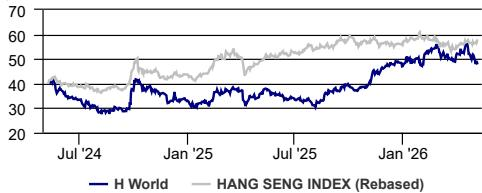

line

| Date   | H World | HANG SENG INDEX (Rebased) |
|--------|---------|---------------------------|
| Jul '24| 40      | 40                        |
| Jan '25| 35      | 50                        |
| Jul '25| 45      | 55                        |
| Jan '26| 55      | 60                        |

Margin Trends   
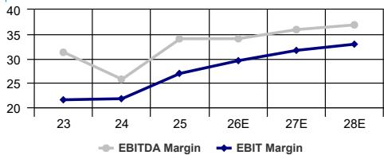

line

| Year | EBITDA Margin | EBIT Margin |
|------|---------------|-------------|
| 23   | 32            | 21          |
| 24   | 26            | 21          |
| 25   | 35            | 27          |
| 26E  | 35            | 30          |
| 27E  | 36            | 32          |
| 28E  | 37            | 34          |

Growth & Profitability   
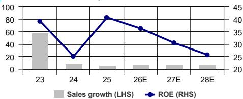

bar_line

| Year | Sales growth (LHS) | ROE (RHS) |
| :--- | :--- | :--- |
| 23 | 60 | 40 |
| 24 | 10 | 25 |
| 25 | 8 | 45 |
| 26E | 10 | 35 |
| 27E | 10 | 30 |
| 28E | 10 | 25 |

Solvency   

line

| Year | Net debt/equity (LHS) | Net interest cover (RHS) |
|------|------------------------|--------------------------|
| 23   | -75                    | -75                      |
| 24   | -75                    | -75                      |
| 25   | -75                    | -75                      |
| 26E  | -25                    | 0                        |
| 27E  | -25                    | -25                      |
| 28E  | -75                    | -75                      |

# Sammi Xu

+852 2203 5415

sammi.xu@db.com

<table><tr><td>Fiscal year end 31-Dec</td><td>2023</td><td>2024</td><td>2025</td><td>2026E</td><td>2027E</td><td>2028E</td></tr><tr><td>Financial Summary</td><td></td><td></td><td></td><td></td><td></td><td></td></tr><tr><td>DB EPS (CNY)</td><td>10.48</td><td>11.34</td><td>15.21</td><td>18.83</td><td>22.08</td><td>24.68</td></tr><tr><td>Reported EPS (CNY)</td><td>12.19</td><td>9.30</td><td>15.64</td><td>17.50</td><td>20.49</td><td>22.75</td></tr><tr><td>DPS (CNY)</td><td>0.93</td><td>1.60</td><td>2.11</td><td>1.69</td><td>1.69</td><td>1.69</td></tr><tr><td>BVPS (CNY)</td><td>38.1</td><td>39.1</td><td>41.7</td><td>60.2</td><td>81.9</td><td>105.7</td></tr><tr><td>Weighted average shares (m)</td><td>318</td><td>312</td><td>307</td><td>305</td><td>304</td><td>304</td></tr><tr><td>Average market cap (CNYm)</td><td>95,604</td><td>77,902</td><td>81,642</td><td>99,847</td><td>99,847</td><td>99,847</td></tr><tr><td>Enterprise value (CNYm)</td><td>89,333</td><td>70,029</td><td>70,963</td><td>82,313</td><td>74,841</td><td>66,635</td></tr></table>

Valuation Metrics 

<table><tr><td>P/E (DB) (x)</td><td>28.7</td><td>22.1</td><td>17.5</td><td>17.3</td><td>14.7</td><td>13.2</td></tr><tr><td>P/E (Reported) (x)</td><td>24.6</td><td>26.9</td><td>17.0</td><td>18.6</td><td>15.9</td><td>14.3</td></tr><tr><td>P/BV (x)</td><td>6.21</td><td>6.08</td><td>8.11</td><td>5.40</td><td>3.97</td><td>3.08</td></tr><tr><td>FCF Yield (%)</td><td>7.1</td><td>8.5</td><td>9.2</td><td>7.0</td><td>7.7</td><td>8.4</td></tr><tr><td>Dividend Yield (%)</td><td>0.3</td><td>0.6</td><td>0.8</td><td>0.5</td><td>0.5</td><td>0.5</td></tr><tr><td>EV/Sales (x)</td><td>4.1</td><td>2.9</td><td>2.8</td><td>3.0</td><td>2.6</td><td>2.1</td></tr><tr><td>EV/EBITDA (x)</td><td>13.1</td><td>11.4</td><td>8.2</td><td>8.9</td><td>7.1</td><td>5.8</td></tr><tr><td>EV/EBIT (x)</td><td>19.0</td><td>13.5</td><td>10.4</td><td>10.2</td><td>8.1</td><td>6.5</td></tr></table>

Income Statement (CNYm) 

<table><tr><td>Sales revenue</td><td>21,882</td><td>23,891</td><td>25,307</td><td>27,189</td><td>29,282</td><td>31,258</td></tr><tr><td>Gross profit</td><td>7,507</td><td>8,575</td><td>9,907</td><td>11,481</td><td>13,064</td><td>14,433</td></tr><tr><td>EBITDA</td><td>6,840</td><td>6,150</td><td>8,612</td><td>9,257</td><td>10,514</td><td>11,525</td></tr><tr><td>Depreciation</td><td>1,414</td><td>1,332</td><td>1,257</td><td>1,156</td><td>1,156</td><td>1,156</td></tr><tr><td>Amortisation</td><td>712</td><td>-382</td><td>536</td><td>67</td><td>89</td><td>78</td></tr><tr><td>EBIT</td><td>4,714</td><td>5,200</td><td>6,819</td><td>8,034</td><td>9,269</td><td>10,291</td></tr><tr><td>Net interest income(expense)</td><td>-137</td><td>-108</td><td>-114</td><td>-47</td><td>24</td><td>45</td></tr><tr><td>Associates/affiliates</td><td>0</td><td>0</td><td>0</td><td>0</td><td>0</td><td>0</td></tr><tr><td>Exceptionals/extraordinaries</td><td>0</td><td>0</td><td>0</td><td>0</td><td>0</td><td>0</td></tr><tr><td>Other pre-tax income/(expense)</td><td>772</td><td>-287</td><td>597</td><td>128</td><td>150</td><td>139</td></tr><tr><td>Profit before tax</td><td>5,349</td><td>4,805</td><td>7,302</td><td>8,115</td><td>9,443</td><td>10,475</td></tr><tr><td>Income tax expense</td><td>1,204</td><td>1,662</td><td>2,161</td><td>2,402</td><td>2,795</td><td>3,100</td></tr><tr><td>Minorities</td><td>46</td><td>54</td><td>35</td><td>35</td><td>35</td><td>35</td></tr><tr><td>Other post-tax income/(expense)</td><td>-14</td><td>-41</td><td>-26</td><td>-26</td><td>-26</td><td>-26</td></tr><tr><td>Net profit</td><td>4,085</td><td>3,048</td><td>5,080</td><td>5,652</td><td>6,587</td><td>7,314</td></tr><tr><td>DB adjustments (including dilution)</td><td>-572</td><td>670</td><td>-139</td><td>432</td><td>512</td><td>620</td></tr><tr><td>DB Net profit</td><td>3,513</td><td>3,718</td><td>4,941</td><td>6,085</td><td>7,099</td><td>7,934</td></tr></table>

Cash Flow (CNYm) 

<table><tr><td>Cash flow from operations</td><td>7,674</td><td>7,518</td><td>8,379</td><td>7,775</td><td>8,393</td><td>9,127</td></tr><tr><td>Net Capex</td><td>-901</td><td>-898</td><td>-838</td><td>-805</td><td>-805</td><td>-805</td></tr><tr><td>Free cash flow</td><td>6,773</td><td>6,620</td><td>7,541</td><td>6,970</td><td>7,588</td><td>8,322</td></tr><tr><td>Equity raised/(bought back)</td><td>1,125</td><td>-1,172</td><td>-783</td><td>0</td><td>0</td><td>0</td></tr><tr><td>Dividends paid</td><td>0</td><td>-3,480</td><td>-3,907</td><td>-80</td><td>-81</td><td>-81</td></tr><tr><td>Net inc/(dec) in borrowings</td><td>-4,693</td><td>30</td><td>425</td><td>0</td><td>0</td><td>0</td></tr><tr><td>Other investing/financing cash flows</td><td>-564</td><td>-2,184</td><td>-268</td><td>0</td><td>0</td><td>0</td></tr><tr><td>Net cash flow</td><td>2,641</td><td>-186</td><td>3,008</td><td>6,890</td><td>7,508</td><td>8,241</td></tr><tr><td>Change in working capital</td><td>1,852</td><td>1,354</td><td>1,223</td><td>931</td><td>615</td><td>622</td></tr></table>

Balance Sheet (CNYm) 

<table><tr><td>Cash and other liquid assets</td><td>6,946</td><td>7,474</td><td>10,386</td><td>17,276</td><td>24,783</td><td>33,024</td></tr><tr><td>Tangible fixed assets</td><td>6,097</td><td>5,682</td><td>5,230</td><td>4,879</td><td>4,528</td><td>4,177</td></tr><tr><td>Goodwill/intangible assets</td><td>10,598</td><td>9,997</td><td>10,456</td><td>10,456</td><td>10,456</td><td>10,456</td></tr><tr><td>Associates/investments</td><td>4,753</td><td>5,919</td><td>6,263</td><td>6,263</td><td>6,263</td><td>6,263</td></tr><tr><td>Other assets</td><td>35,138</td><td>33,480</td><td>32,439</td><td>32,710</td><td>33,033</td><td>33,313</td></tr><tr><td>Total assets</td><td>63,532</td><td>62,552</td><td>64,774</td><td>71,584</td><td>79,064</td><td>87,233</td></tr><tr><td>Interest bearing debt</td><td>5,314</td><td>5,426</td><td>5,816</td><td>5,816</td><td>5,816</td><td>5,816</td></tr><tr><td>Other liabilities</td><td>45,969</td><td>44,855</td><td>46,000</td><td>47,202</td><td>48,141</td><td>49,042</td></tr><tr><td>Total liabilities</td><td>51,283</td><td>50,281</td><td>51,816</td><td>53,018</td><td>53,957</td><td>54,858</td></tr><tr><td>Shareholders&#x27; equity</td><td>12,135</td><td>12,177</td><td>12,804</td><td>18,377</td><td>24,883</td><td>32,116</td></tr><tr><td>Minorities</td><td>114</td><td>94</td><td>154</td><td>189</td><td>224</td><td>259</td></tr><tr><td>Total shareholders&#x27; equity</td><td>12,249</td><td>12,271</td><td>12,958</td><td>18,566</td><td>25,107</td><td>32,375</td></tr><tr><td>Net debt</td><td>-1,632</td><td>-2,048</td><td>-4,570</td><td>-11,460</td><td>-18,967</td><td>-27,208</td></tr></table>

Key Company Metrics 

<table><tr><td>Sales growth (%)</td><td>57.9</td><td>9.2</td><td>5.9</td><td>7.4</td><td>7.7</td><td>6.7</td></tr><tr><td>DB EPS growth (%)</td><td>na</td><td>8.2</td><td>34.2</td><td>23.8</td><td>17.2</td><td>11.8</td></tr><tr><td>EBITDA Margin (%)</td><td>31.3</td><td>25.7</td><td>34.0</td><td>34.0</td><td>35.9</td><td>36.9</td></tr><tr><td>EBIT Margin (%)</td><td>21.5</td><td>21.8</td><td>26.9</td><td>29.5</td><td>31.7</td><td>32.9</td></tr><tr><td>Payout ratio (%)</td><td>7.2</td><td>16.4</td><td>12.8</td><td>9.1</td><td>7.8</td><td>7.0</td></tr><tr><td>ROE (%)</td><td>39.2</td><td>25.1</td><td>40.7</td><td>36.3</td><td>30.5</td><td>25.7</td></tr><tr><td>Capex/sales (%)</td><td>4.1</td><td>3.8</td><td>3.3</td><td>3.0</td><td>2.7</td><td>2.6</td></tr><tr><td>Capex/depreciation (x)</td><td>0.6</td><td>0.7</td><td>0.7</td><td>0.7</td><td>0.7</td><td>0.7</td></tr><tr><td>Net debt/equity (%)</td><td>-13.3</td><td>-16.7</td><td>-35.3</td><td>-61.7</td><td>-75.5</td><td>-84.0</td></tr><tr><td>Net interest cover (x)</td><td>34.4</td><td>48.1</td><td>59.8</td><td>171.4</td><td>nm</td><td>nm</td></tr></table>

Source: Company data, DB estimates

Model updated: 06 May 2026

# Running the numbers

Asia

China

Hotels / Leisure / Gaming

# H World

Reuters: 1179.HK

Bloomberg: 1179 HK

Buy 

<table><tr><td>Price (7 May 26)</td><td>HKD 38.36</td></tr><tr><td>Target Price</td><td>HKD 43.80</td></tr><tr><td>52 Week range</td><td>HKD 23.61 - 43.92</td></tr><tr><td>Market cap (m)</td><td>HKDm 117,801USDm 15,044</td></tr></table>

# Company Profile

H World Group (formerly Huazhu Group) is a leading global hotel operator and franchisor, currently ranked as one of the largest hospitality companies with over 12k hotels across 20 countries. Established in 2005, the company has transformed the travel experience through a "tech-first" approach, building a comprehensive multi-brand portfolio that spans the economy, midscale, and luxury segments.

Price Performance   
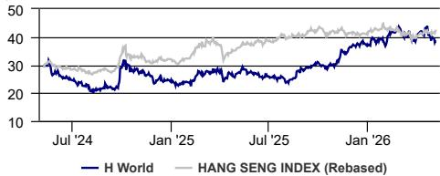

line

| Date   | H World | HANG SENG INDEX (Rebased) |
|--------|---------|---------------------------|
| Jul '24| 30      | 30                        |
| Jan '25| 25      | 35                        |
| Jul '25| 30      | 40                        |
| Jan '26| 40      | 45                        |

Margin Trends   

line

| Year | EBITDA Margin | EBIT Margin |
|------|---------------|-------------|
| 23   | 32            | 21          |
| 24   | 26            | 21          |
| 25   | 35            | 27          |
| 26E  | 35            | 30          |
| 27E  | 36            | 32          |
| 28E  | 37            | 34          |

Growth & Profitability   

bar_line

| Year | Sales growth (LHS) | ROE (RHS) |
| :--- | :--- | :--- |
| 23 | 60 | 40 |
| 24 | 10 | 25 |
| 25 | 8 | 45 |
| 26E | 10 | 35 |
| 27E | 10 | 30 |
| 28E | 10 | 25 |

Solvency   
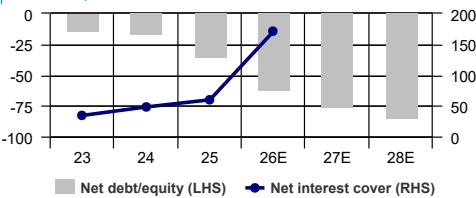

line

| Year | Net debt/equity (LHS) | Net interest cover (RHS) |
|------|------------------------|--------------------------|
| 23   | -75                    | -75                      |
| 24   | -75                    | -75                      |
| 25   | -75                    | -75                      |
| 26E  | -25                    | 0                        |
| 27E  | -25                    | -25                      |
| 28E  | -75                    | -75                      |

# Sammi Xu

+852 2203 5415

sammi.xu@db.com

<table><tr><td>Fiscal year end 31-Dec</td><td>2023</td><td>2024</td><td>2025</td><td>2026E</td><td>2027E</td><td>2028E</td></tr><tr><td colspan="7">Financial Summary</td></tr><tr><td>DB EPS (CNY)</td><td>1.05</td><td>1.13</td><td>1.52</td><td>1.88</td><td>2.21</td><td>2.47</td></tr><tr><td>Reported EPS (CNY)</td><td>1.22</td><td>0.93</td><td>1.56</td><td>1.75</td><td>2.05</td><td>2.27</td></tr><tr><td>DPS (CNY)</td><td>0.93</td><td>1.60</td><td>2.11</td><td>1.69</td><td>1.69</td><td>1.69</td></tr><tr><td>BVPS (CNY)</td><td>3.8</td><td>3.9</td><td>4.2</td><td>6.0</td><td>8.2</td><td>10.6</td></tr><tr><td>Weighted average shares (m)</td><td>3,183</td><td>3,115</td><td>3,071</td><td>3,054</td><td>3,039</td><td>3,039</td></tr><tr><td>Average market cap (CNYm)</td><td>90,292</td><td>73,869</td><td>79,944</td><td>102,326</td><td>102,326</td><td>102,326</td></tr><tr><td>Enterprise value (CNYm)</td><td>84,021</td><td>65,996</td><td>69,265</td><td>84,792</td><td>77,319</td><td>69,114</td></tr></table>

Valuation Metrics 

<table><tr><td>P/E (DB) (x)</td><td>27.1</td><td>20.9</td><td>17.1</td><td>17.7</td><td>15.1</td><td>13.5</td></tr><tr><td>P/E (Reported) (x)</td><td>23.3</td><td>25.5</td><td>16.6</td><td>19.0</td><td>16.3</td><td>14.6</td></tr><tr><td>P/BV (x)</td><td>5.91</td><td>5.84</td><td>8.16</td><td>5.54</td><td>4.07</td><td>3.15</td></tr><tr><td>FCF Yield (%)</td><td>7.5</td><td>9.0</td><td>9.4</td><td>6.8</td><td>7.5</td><td>8.2</td></tr><tr><td>Dividend Yield (%)</td><td>3.3</td><td>6.7</td><td>8.1</td><td>5.1</td><td>5.1</td><td>5.1</td></tr><tr><td>EV/Sales (x)</td><td>3.8</td><td>2.8</td><td>2.7</td><td>3.1</td><td>2.6</td><td>2.2</td></tr><tr><td>EV/EBITDA (x)</td><td>12.3</td><td>10.7</td><td>8.0</td><td>9.2</td><td>7.4</td><td>6.0</td></tr><tr><td>EV/EBIT (x)</td><td>17.8</td><td>12.7</td><td>10.2</td><td>10.6</td><td>8.3</td><td>6.7</td></tr></table>

Income Statement (CNYm) 

<table><tr><td>Sales revenue</td><td>21,882</td><td>23,891</td><td>25,307</td><td>27,189</td><td>29,282</td><td>31,258</td></tr><tr><td>Gross profit</td><td>7,507</td><td>8,575</td><td>9,907</td><td>11,481</td><td>13,064</td><td>14,433</td></tr><tr><td>EBITDA</td><td>6,840</td><td>6,150</td><td>8,612</td><td>9,257</td><td>10,514</td><td>11,525</td></tr><tr><td>Depreciation</td><td>1,414</td><td>1,332</td><td>1,257</td><td>1,156</td><td>1,156</td><td>1,156</td></tr><tr><td>Amortisation</td><td>712</td><td>-382</td><td>536</td><td>67</td><td>89</td><td>78</td></tr><tr><td>EBIT</td><td>4,714</td><td>5,200</td><td>6,819</td><td>8,034</td><td>9,269</td><td>10,291</td></tr><tr><td>Net interest income(expense)</td><td>-137</td><td>-108</td><td>-114</td><td>-47</td><td>24</td><td>45</td></tr><tr><td>Associates/affiliates</td><td>0</td><td>0</td><td>0</td><td>0</td><td>0</td><td>0</td></tr><tr><td>Exceptionals/extraordinaries</td><td>0</td><td>0</td><td>0</td><td>0</td><td>0</td><td>0</td></tr><tr><td>Other pre-tax income/(expense)</td><td>772</td><td>-287</td><td>597</td><td>128</td><td>150</td><td>139</td></tr><tr><td>Profit before tax</td><td>5,349</td><td>4,805</td><td>7,302</td><td>8,115</td><td>9,443</td><td>10,475</td></tr><tr><td>Income tax expense</td><td>1,204</td><td>1,662</td><td>2,161</td><td>2,402</td><td>2,795</td><td>3,100</td></tr><tr><td>Minorities</td><td>46</td><td>54</td><td>35</td><td>35</td><td>35</td><td>35</td></tr><tr><td>Other post-tax income/(expense)</td><td>-14</td><td>-41</td><td>-26</td><td>-26</td><td>-26</td><td>-26</td></tr><tr><td>Net profit</td><td>4,085</td><td>3,048</td><td>5,080</td><td>5,652</td><td>6,587</td><td>7,314</td></tr><tr><td>DB adjustments (including dilution)</td><td>-572</td><td>670</td><td>-139</td><td>432</td><td>512</td><td>620</td></tr><tr><td>DB Net profit</td><td>3,513</td><td>3,718</td><td>4,941</td><td>6,085</td><td>7,099</td><td>7,934</td></tr></table>

Cash Flow (CNYm) 

<table><tr><td>Cash flow from operations</td><td>7,674</td><td>7,518</td><td>8,379</td><td>7,775</td><td>8,393</td><td>9,127</td></tr><tr><td>Net Capex</td><td>-901</td><td>-898</td><td>-838</td><td>-805</td><td>-805</td><td>-805</td></tr><tr><td>Free cash flow</td><td>6,773</td><td>6,620</td><td>7,541</td><td>6,970</td><td>7,588</td><td>8,322</td></tr><tr><td>Equity raised/(bought back)</td><td>1,125</td><td>-1,172</td><td>-783</td><td>0</td><td>0</td><td>0</td></tr><tr><td>Dividends paid</td><td>0</td><td>-3,480</td><td>-3,907</td><td>-80</td><td>-81</td><td>-81</td></tr><tr><td>Net inc/(dec) in borrowings</td><td>-4,693</td><td>30</td><td>425</td><td>0</td><td>0</td><td>0</td></tr><tr><td>Other investing/financing cash flows</td><td>-564</td><td>-2,184</td><td>-268</td><td>0</td><td>0</td><td>0</td></tr><tr><td>Net cash flow</td><td>2,641</td><td>-186</td><td>3,008</td><td>6,890</td><td>7,508</td><td>8,241</td></tr><tr><td>Change in working capital</td><td>1,852</td><td>1,354</td><td>1,223</td><td>931</td><td>615</td><td>622</td></tr></table>

Balance Sheet (CNYm) 

<table><tr><td>Cash and other liquid assets</td><td>6,946</td><td>7,474</td><td>10,386</td><td>17,276</td><td>24,783</td><td>33,024</td></tr><tr><td>Tangible fixed assets</td><td>6,097</td><td>5,682</td><td>5,230</td><td>4,879</td><td>4,528</td><td>4,177</td></tr><tr><td>Goodwill/intangible assets</td><td>10,598</td><td>9,997</td><td>10,456</td><td>10,456</td><td>10,456</td><td>10,456</td></tr><tr><td>Associates/investments</td><td>4,753</td><td>5,919</td><td>6,263</td><td>6,263</td><td>6,263</td><td>6,263</td></tr><tr><td>Other assets</td><td>35,138</td><td>33,480</td><td>32,439</td><td>32,710</td><td>33,033</td><td>33,313</td></tr><tr><td>Total assets</td><td>63,532</td><td>62,552</td><td>64,774</td><td>71,584</td><td>79,064</td><td>87,233</td></tr><tr><td>Interest bearing debt</td><td>5,314</td><td>5,426</td><td>5,816</td><td>5,816</td><td>5,816</td><td>5,816</td></tr><tr><td>Other liabilities</td><td>45,969</td><td>44,855</td><td>46,000</td><td>47,202</td><td>48,141</td><td>49,042</td></tr><tr><td>Total liabilities</td><td>51,283</td><td>50,281</td><td>51,816</td><td>53,018</td><td>53,957</td><td>54,858</td></tr><tr><td>Shareholders&#x27; equity</td><td>12,135</td><td>12,177</td><td>12,804</td><td>18,377</td><td>24,883</td><td>32,116</td></tr><tr><td>Minorities</td><td>114</td><td>94</td><td>154</td><td>189</td><td>224</td><td>259</td></tr><tr><td>Total shareholders&#x27; equity</td><td>12,249</td><td>12,271</td><td>12,958</td><td>18,566</td><td>25,107</td><td>32,375</td></tr><tr><td>Net debt</td><td>-1,632</td><td>-2,048</td><td>-4,570</td><td>-11,460</td><td>-18,967</td><td>-27,208</td></tr></table>

Key Company Metrics 

<table><tr><td>Sales growth (%)</td><td>57.9</td><td>9.2</td><td>5.9</td><td>7.4</td><td>7.7</td><td>6.7</td></tr><tr><td>DB EPS growth (%)</td><td>na</td><td>8.2</td><td>34.2</td><td>23.8</td><td>17.2</td><td>11.8</td></tr><tr><td>EBITDA Margin (%)</td><td>31.3</td><td>25.7</td><td>34.0</td><td>34.0</td><td>35.9</td><td>36.9</td></tr><tr><td>EBIT Margin (%)</td><td>21.5</td><td>21.8</td><td>26.9</td><td>29.5</td><td>31.7</td><td>32.9</td></tr><tr><td>Payout ratio (%)</td><td>72.5</td><td>163.5</td><td>127.6</td><td>91.2</td><td>77.9</td><td>70.1</td></tr><tr><td>ROE (%)</td><td>39.2</td><td>25.1</td><td>40.7</td><td>36.3</td><td>30.5</td><td>25.7</td></tr><tr><td>Capex/sales (%)</td><td>4.1</td><td>3.8</td><td>3.3</td><td>3.0</td><td>2.7</td><td>2.6</td></tr><tr><td>Capex/depreciation (x)</td><td>0.6</td><td>0.7</td><td>0.7</td><td>0.7</td><td>0.7</td><td>0.7</td></tr><tr><td>Net debt/equity (%)</td><td>-13.3</td><td>-16.7</td><td>-35.3</td><td>-61.7</td><td>-75.5</td><td>-84.0</td></tr><tr><td>Net interest cover (x)</td><td>34.4</td><td>48.1</td><td>59.8</td><td>171.4</td><td>nm</td><td>nm</td></tr></table>

Source: Company data, DB estimates

# Appendix 1

# Important Disclosures

\*Other information available upon request

<table><tr><td colspan="4">Disclosure checklist</td></tr><tr><td>Company</td><td>Ticker</td><td>Recent price*</td><td>Disclosure</td></tr><tr><td>Atour Lifestyle</td><td>ATAT.OQ</td><td>38.23 (USD) 07 May 2026</td><td>8, 15</td></tr><tr><td>H World</td><td>HTHT.OQ</td><td>47.8 (USD) 07 May 2026</td><td>8, 14, 15, 24</td></tr><tr><td>H World</td><td>1179.HK</td><td>38.36 (HKD) 07 May 2026</td><td>8, 14, 15, 24</td></tr></table>

\*Prices are current as of the end of the previous trading session unless otherwise indicated and are sourced from local exchanges via Reuters, Bloomberg and other vendors. Other information is sourced from DB, subject companies, and other sources. For disclosures pertaining to recommendations or estimates made on securities other than the primary subject of this research, please see the most recently published company report or visit our global disclosure look-up page on our website at https://research.db.com/Research/Disclosures/EquityResearchDisclosures. Aside from within this report, important risk and conflict disclosures can also be found at https://research.db.com/Research/Disclosures/Disclaimer. Investors are strongly encouraged to review this information before investing.

# Important Disclosures Required by U.S. Regulators

Disclosures marked with an asterisk may also be required by at least one jurisdiction in addition to the United States. See Important Disclosures Required by Non-US Regulators and Explanatory Notes.

8. DB and/or its affiliate(s) expects to receive, or intends to seek, compensation for investment banking services from this company in the next three months.   
14. DB and/or its affiliate(s) has received compensation from this company within the past year for non-investment banking related services.   
15. This company has been a client of DB Securities Inc. within the past year during which time it received investment banking services.

# Important Disclosures Required by Non-U.S. Regulators

Disclosures marked with an asterisk may also be required by at least one jurisdiction in addition to the United States. See Important Disclosures Required by Non-US Regulators and Explanatory Notes.   
24. DB and/or its affiliate(s) is or has been over the previous 12 months party to an agreement with the company relating to the provision of services set out in Sections A and B of Annex I of Directive 2014/65/EU, or has over the previous 12 months been obliged or entitled (as applicable) to pay or receive compensation relating to the provision of services set out in Sections A and B of Annex I of Directive 2014/65/EU.

For disclosures pertaining to recommendations or estimates made on securities other than the primary subject of this research, please see the most recently published company report or visit our global disclosure look-up page on our website at https://research.db.com/Research/Disclosures/EquityResearchDisclosures. Aside from within this report, important risk and conflict disclosures can also be found at https://research.db.com/Research/Disclosures/Disclaimer. Investors are strongly encouraged to review this information before investing.

# Analyst Certification

The views expressed in this report accurately reflect the personal views of the undersigned lead analyst about the subject issuers and the securities of those issuers. In addition, the undersigned lead analyst has not and will not receive any compensation for providing a specific recommendation or view in this report. Sammi Xu.

Historical recommendations and target price: H World (1179.HK)   
(as of 05/07/2026)   
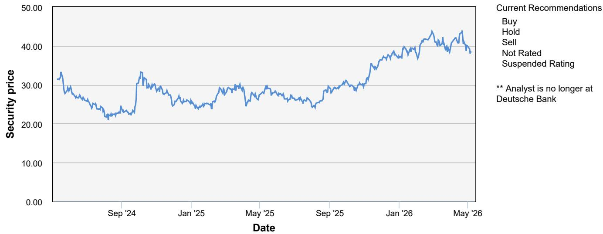

line

| Date     | Security price |
| -------- | -------------- |
| Sep '24  | ~22.00         |
| Jan '25  | ~25.00         |
| May '25  | ~28.00         |
| Sep '25  | ~30.00         |
| Jan '26  | ~38.00         |
| May '26  | ~39.00         |

Historical recommendations and target price: Atour Lifestyle (ATAT.OQ)   
(as of 05/07/2026)   
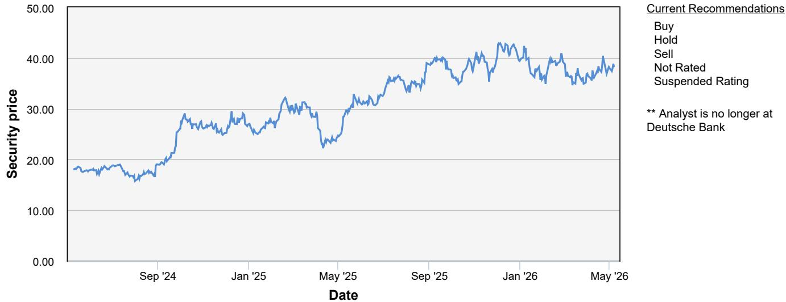

line

| Date     | Security price |
| -------- | -------------- |
| Sep '24  | ~18.00         |
| Jan '25  | ~28.00         |
| May '25  | ~32.00         |
| Sep '25  | ~40.00         |
| Jan '26  | ~42.00         |
| May '26  | ~39.00         |

Historical recommendations and target price: H World (HTHT.OQ)   
(as of 05/07/2026)   
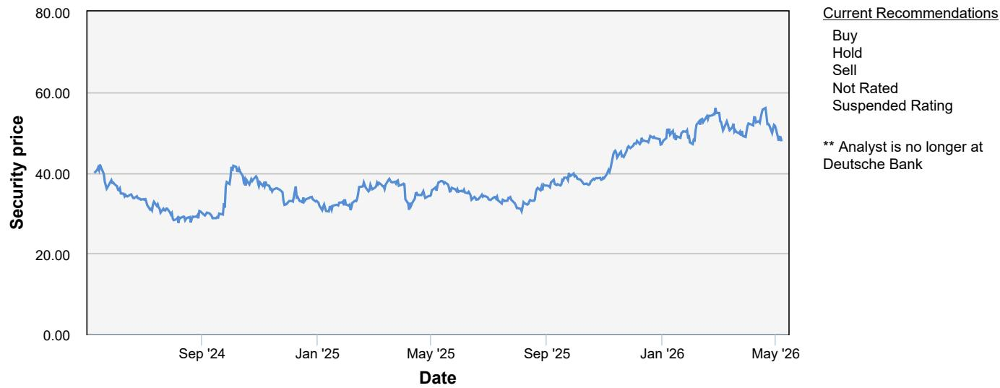

line

| Date     | Security price |
| -------- | -------------- |
| Sep '24  | ~35.00         |
| Jan '25  | ~38.00         |
| May '25  | ~37.00         |
| Sep '25  | ~40.00         |
| Jan '26  | ~50.00         |
| May '26  | ~55.00         |

Equity rating dispersion and banking relationships   
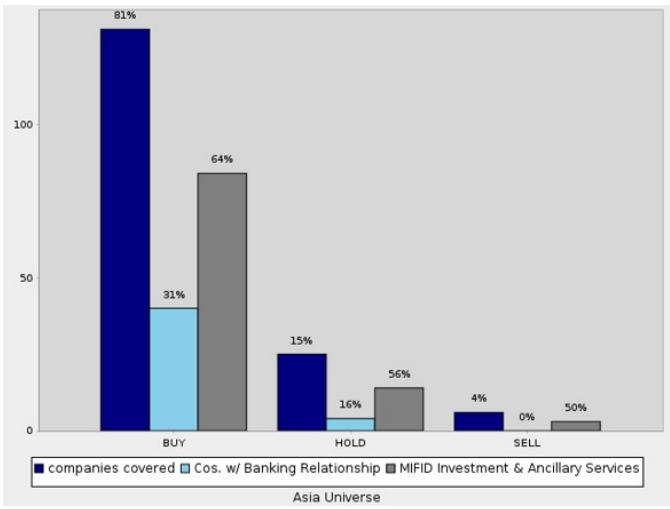

bar

| Category | companies covered (%) | Cos. w/ Banking Relationship (%) | MIFID Investment & Ancillary Services (%) |
|---|---|---|---|
| BUY | 81 | 31 | 64 |
| HOLD | 15 | 16 | 56 |
| SELL | 4 | 0 | 50 |
Asia Universe

# Equity Rating and Dispersion Key

The Equity Rating Dispersion Chart depicts the following:

The proportion of recommendations that are rated "buy", "sell" and "hold" over the previous 12 months. This is shown for securities issued in the stated region e.g. "Europe Universe". See rating definitions below. This is represented by the "Companies Covered" bars in the chart. The percentage value displayed above the bar is the proportion as a percentage. E.g. 50% above the "buy" / "Companies Covered" bar means that 50% of DB's equity research covered companies over the past 12 months have a "buy" rating.

Next to each of the three respective bars showing the proportion of "buy", "sell" and "hold" recommendations we provide two additional bars to show:

\- The proportion of "buy", "sell" or "hold recommendations where DB and or/Affiliates provided MIFID Investment or Ancillary Services in the past 12 months. This is represented in the "MIFID Investment and Ancillary Services" bar. The percentage value displayed above the bar shows the proportion of Companies Covered with the given rating where DB has also provided MIFID Investment and Ancillary Services in the past 12 months. E.g. 50% above the "Cos. w/ MIFID Investment and Ancillary Services" bar means 50% of the Companies Covered with the rating stated have also received MIFID Investment and Ancillary Services from DB.

\- The proportion of "buy" (or "sell" or "hold") recommendations where DB and or/Affiliates has provided Investment Banking services in the past 12 months for which it has received compensation. The percentage value displayed above the bar shows the proportion of Companies Covered with the stated rating where DB has also provided Investment Banking services in the past 12 months. E.g. 50% above the "Cos. w/ Investment Banking relationship" bar means 50% of the Companies Covered with the rating stated also have an Investment Banking Relationship with DB.

Buy: Based on a current 12-month view of TSR, we recommend that investors buy the stock.

Sell: Based on a current 12-month view of TSR, we recommend that investors sell the stock.

Hold: We take a neutral view on the stock 12-months out and, based on this time horizon, do not recommend either a Buy or Sell.

TSR = Total Shareholder Return. Percentage change in share price from current price to projected target price plus projected dividend yield

Newly issued research recommendations and target prices supersede previously published research.

# Additional Information

The information and opinions in this report were prepared by DB AG or one of its affiliates (collectively 'DB'). Though the information herein is believed to be reliable and has been obtained from public sources believed to be reliable, DB makes no representation as to its accuracy or completeness. Hyperlinks to third-party websites in this report are provided for reader convenience only. DB neither endorses the content nor is responsible for the accuracy or security controls of those websites.

If you use the services of DB in connection with a purchase or sale of a security that is discussed in this report, or is included or discussed in another communication (oral or written) from a DB analyst, DB may act as principal for its own account or as agent for another person.

DB may consider this report in deciding to trade as principal. It may also engage in transactions, for its own account or with customers, in a manner inconsistent with the views taken in this research report. Others within DB, including strategists, sales staff and other analysts, may take views that are inconsistent with those taken in this research report. DB issues a variety of research products, including fundamental analysis, equity-linked analysis, quantitative analysis and trade ideas. Recommendations contained in one type of communication may differ from recommendations contained in others, whether as a result of differing time horizons, methodologies, perspectives or otherwise. DB and/or its affiliates may also be holding debt or equity securities of the issuers it writes on. Analysts are paid in part based on the profitability of DB AG and its affiliates, which includes investment banking, trading and principal trading revenues.

Opinions, estimates and projections constitute the current judgment of the author as of the date of this report. They do not necessarily reflect the opinions of DB and are subject to change without notice. DB provides liquidity for buyers and sellers of securities issued by the companies it covers. DB analysts sometimes have shorter-term trade ideas that may be inconsistent with DB's existing longer-term ratings. Some trade ideas for equities are listed as Catalyst Calls on the Research Website (https://research.db.com/Research/), and can be found on the general coverage list and also on the covered company's page. A Catalyst Call represents a high-conviction belief by an analyst that a stock will outperform or underperform the market and/or a specified sector over a time frame of no less than two weeks and no more than three months. In addition to Catalyst Calls, analysts may occasionally discuss with our clients, and with DB salespersons and traders, trading strategies or ideas that reference catalysts or events that may have a near-term or medium-term impact on the market price of the securities discussed in this report, which impact may be directionally counter to the analysts' current 12-month view of total return or investment return as described herein. DB has no obligation to update, modify or amend this report or to otherwise notify a recipient thereof if an opinion, forecast or estimate changes or becomes inaccurate. Coverage and the frequency of changes in market conditions and in both general and company-specific economic prospects make it difficult to update research at defined intervals. Updates are at the sole discretion of the coverage analyst or of the Research Department Management, and the majority of reports are published at irregular intervals. This report is provided for informational purposes only and does not take into account the particular investment objectives, financial situations, or needs of individual clients. It is not an offer or a solicitation of an offer to buy or sell any financial instruments or to participate in any particular trading strategy. Target prices are inherently imprecise and a product of the analyst's judgment. The financial instruments discussed in this report may not be suitable for all investors, and investors must make their own informed investment decisions. Prices and availability of financial instruments are subject to change without notice, and investment transactions can lead to losses as a result of price fluctuations and other factors. If a financial instrument is denominated in a currency other than an investor's currency, a change in exchange rates may adversely affect the investment. Past performance is not necessarily indicative of future results. Performance calculations exclude transaction costs, unless otherwise indicated. Unless otherwise indicated, prices are current as of the end of the previous trading session and are sourced from local exchanges via Reuters, Bloomberg and other vendors. Data is also sourced from DB, subject companies, and other parties. Artificial intelligence tools may be used in the preparation of this material, including but not limited to assist in fact-finding, data analysis, pattern recognition, content drafting and editorial corrections pertaining to research material.

The DB Department is independent of other business divisions of the Bank. Details regarding our organizational arrangements and information barriers we have to prevent and avoid conflicts of interest with respect to our research are available on our website (https://research.db.com/Research/) under Disclaimer.

Macroeconomic fluctuations often account for most of the risks associated with exposures to instruments that promise to pay fixed or variable interest rates. For an investor who is long fixed-rate instruments (thus receiving these cash flows), increases in interest rates naturally lift the discount factors applied to the expected cash flows and thus cause a loss. The longer the maturity of a certain cash flow and the higher the move in the discount factor, the higher will be the loss. Upside surprises in inflation, fiscal funding needs, and FX depreciation rates are among the most common adverse macroeconomic shocks to receivers. But counterparty exposure, issuer creditworthiness, client segmentation, regulation (including changes in assets holding limits for different types of investors), changes in tax policies, currency convertibility (which may constrain currency conversion, repatriation of profits and/or liquidation of positions), and settlement issues related to local clearing houses are also important risk factors. The sensitivity of fixed-income instruments to macroeconomic shocks may be mitigated by indexing the contracted cash flows to inflation, to FX depreciation, or to specified interest rates - these are common in emerging markets. The index fixings may - by construction - lag or mis-measure the actual move in the underlying variables they are intended to track. The choice of the proper fixing (or metric) is particularly important in swaps markets, where floating coupon rates (i.e., coupons indexed to a typically short-dated interest rate reference index) are exchanged for fixed coupons. Funding in a currency that differs from the currency in which coupons are denominated carries FX risk. Options on swaps (swaptions) the risks typical to options in addition to the risks related to rates movements.

Derivative transactions involve numerous risks including market, counterparty default and illiquidity risk. The appropriateness of these products for use by investors depends on the investors' own circumstances, including their tax position, their regulatory environment and the nature of their other assets and liabilities; as such, investors should take expert legal and financial advice before entering into any transaction similar to or inspired by the contents of this publication. The risk of loss in futures trading and options, foreign or domestic, can be sUBStantial. As a result of the high degree of leverage obtainable in futures and options trading, losses may be incurred that are greater than the amount of funds initially deposited - up to theoretically unlimited losses. Trading in options involves risk and is not suitable for all investors. Prior to buying or selling an option, investors must review the 'Characteristics and Risks of Standardized Options", at https://www.theocc.com/company-information/documents-and-archives/options-disclosure-document. If you are unable to access the website, please contact your DB representative for a copy of this important document.

Participants in foreign exchange transactions may incur risks arising from several factors, including the following: (i) exchange rates can be volatile and are subject to large fluctuations; (ii) the value of currencies may be affected by numerous market factors, including world and national economic, political and regulatory events, events in equity and debt markets and changes in interest rates; and (iii) currencies may be subject to devaluation or government-imposed exchange controls, which could affect the value of the currency. Investors in securities such as ADRs, whose values are affected by the currency of an underlying security, effectively assume currency risk.

Unless governing law provides otherwise, all transactions should be executed through the DB entity in the investor's home jurisdiction. Aside from within this report, important conflict disclosures can also be found at https://research.db.com/Research/ on each company's research page or under the 'Disclosures' tab. Investors are strongly encouraged to review this information before investing.

DB (which includes DB AG, its branches and affiliated companies) is not acting as a financial adviser, consultant or fiduciary to you or any of your agents (collectively, "You" or "Your") with respect to any information provided in this report. DB does not provide investment, legal, tax or accounting advice, DB is not acting as your impartial adviser, and does not express any opinion or recommendation whatsoever as to any strategies, products or any other information presented in the materials. Information contained herein is being provided solely on the basis that the recipient will make an independent assessment of the merits of any investment decision, and it does not constitute a recommendation of, or express an opinion on, any product or service or any trading strategy.

The information presented is general in nature and is not directed to retirement accounts or any specific person or account type, and is therefore provided to You on the express basis that it is not advice, and You may not rely upon it in making Your decision. The information we provide is being directed only to persons we believe to be financially sophisticated, who are capable of evaluating investment risks independently, both in general and with regard to particular transactions and investment strategies, and who understand that DB has financial interests in the offering of its products and services. If this is not the case, or if You are an IRA or other retail investor receiving this directly from us, we ask that you inform us immediately.

In July 2018, DB revised its rating system for short term ideas whereby the branding has been changed to Catalyst Calls ("CC") from SOLAR ideas; the rating categories for Catalyst Calls originated in the Americas region have been made consistent with the categories used by Analysts globally; and the effective time period for CCs has been reduced from a maximum of 180 days to 90 days.

United States: Approved and/or distributed by DB Securities Incorporated, a member of FINRA and SIPC. Analysts located outside of the United States are employed by non-US affiliates and are not registered/qualified as research analysts with FINRA.

European Economic Area (exc. United Kingdom): Approved and/or distributed by DB AG, a joint stock corporation with limited liability incorporated in the Federal Republic of Germany with its principal office in Frankfurt am Main. DB AG is authorized under German Banking Law and is subject to supervision by the European Central Bank and by BaFin, Germany's Federal Financial Supervisory Authority.

United Kingdom: Approved and/or distributed by DB AG acting through its London Branch at 21 Moorfields, London EC2Y 9DB. DB AG in the United Kingdom is authorised by the Prudential Regulation Authority and is subject to limited regulation by the Prudential Regulation Authority and Financial Conduct Authority. Details about the extent of our authorisation and regulation are available on request.

Hong Kong SAR: Distributed by DB AG, Hong Kong Branch except for any research content relating to futures contracts within the meaning of the Hong Kong Securities and Futures Ordinance Cap. 571. Research reports on such futures contracts are not intended for access by persons who are located, incorporated, constituted or resident in Hong Kong. The author(s) of a research report may not be licensed to carry on regulated activities in Hong Kong and, if not licensed, do not hold themselves out as being able to do so. The provisions set out above in the 'Additional Information' section shall apply to the fullest extent permissible by local laws and regulations, including without limitation the Code of Conduct for Persons Licensed or Registered with the Securities and Futures Commission. This report is intended for distribution only to 'professional investors' as defined in Part 1 of Schedule of the SFO. This document must not be acted or relied on by persons who are not professional investors. Any investment or investment activity to which this document relates is only available to professional investors and will be engaged only with professional investors.

India: Prepared by Deutsche Equities India Private Limited (DEIPL) having CIN: U65990MH2002PTC137431 and registered office at 14th Floor, The Capital, C-70, G Block, Bandra Kurla Complex, Mumbai (India) 400051. Tel: +91 22 7180 4444. It is registered by the Securities and Exchange Board of India (SEBI) as a Stock broker bearing registration no.: INZ000252437; Merchant Banker bearing SEBI Registration no.: INM000010833 and Research Analyst bearing SEBI Registration no.: INH000001741. DEIPL's Compliance / Grievance officer is Ms. Rashmi Poddar (Tel: +91 22 7180 4929 email ID: complaints.deipl@db.com). Registration granted by SEBI and certification from NISM in no way guarantee performance of DEIPL or provide any assurance of returns to investors. Investment in securities market are subject to market risks. Read all the related documents carefully before investing. DEIPL may have received administrative warnings from the SEBI for breaches of Indian regulations. DB and/or its affiliate(s) may have debt holdings or positions in the subject company. With regard to information on associates, please refer to the "Shareholdings" section in the Annual Report at: https://www.db.com/ir/en/annual-reports.htm. For latest India research audit report, refer https://country.db.com/india/deutsche-equities-india/index?language\_id=1.

Japan: Approved and/or distributed by Deutsche Securities Inc.(DSI). Registration number - Registered as a financial instruments dealer by the Head of the Kanto Local Finance Bureau (Kinsho) No. 117. Member of associations: JSDA, Type II Financial Instruments Firms Association and The Financial Futures Association of Japan. Commissions and risks involved in stock transactions - for stock transactions, we charge stock commissions and consumption tax by multiplying the transaction amount by the commission rate agreed with each customer. Stock transactions can lead to losses as a result of share price fluctuations and other factors. Transactions in foreign stocks can lead to additional losses stemming from foreign exchange fluctuations. We may also charge commissions and fees for certain categories of investment advice, products and services. Recommended investment strategies, products and services carry the risk of losses to principal and other losses as a result of changes in market and/or economic trends, and/or fluctuations in market value. Before deciding on the purchase of financial products and/or services, customers should carefully read the relevant disclosures, prospectuses and other documentation. 'Moody's', 'Standard Poor's', and 'Fitch' mentioned in this report are not registered credit rating agencies in Japan unless Japan or 'Nippon' is specifically designated in the name of the entity. Reports on Japanese listed companies not written by analysts of DSI are written by DB Group's analysts with the coverage companies specified by DSI. Some of the foreign securities stated on this report are not disclosed according to the Financial Instruments and Exchange Law of Japan. Target prices set by DB's equity analysts are based on a 12-month forecast period.

Korea: Distributed by Deutsche Securities Korea Co.

South Africa: DB AG Johannesburg is incorporated in the Federal Republic of Germany (Branch Register Number in South Africa: 1998/003298/10).

Singapore: This report is issued by DB AG, Singapore Branch (One Raffles Quay #18-00 South Tower Singapore 048583, 65 6423 8001), which may be contacted in respect of any matters arising from, or in connection with, this report. Where this report is issued or promulgated by DB in Singapore to a person who is not an accredited investor, expert investor or institutional investor (as defined in the applicable Singapore laws and regulations), they accept legal responsibility to such person for its contents.

Taiwan: Information on securities/investments that trade in Taiwan is for your reference only. Readers should independently evaluate investment risks and are solely responsible for their investment decisions. DB may not be distributed to the Taiwan public media or quoted or used by the Taiwan public media without written consent. Information on securities/instruments that do not trade in Taiwan is for informational purposes only and is not to be construed as a recommendation to trade in such securities/instruments.

Qatar: DB AG in the Qatar Financial Centre (registered no. 00032) is regulated by the Qatar Financial Centre Regulatory Authority. DB AG - QFC Branch may undertake only the financial services activities that fall within the scope of its existing QFCRA license. Its principal place of business in the QFC: Qatar Financial Centre, Tower, West Bay, Level 5, PO Box 14928, Doha, Qatar. This information has been distributed by DB AG. Related financial products or services are only available only to Business Customers, as defined by the Qatar Financial Centre Regulatory Authority.

Russia: The information, interpretation and opinions submitted herein are not in the context of, and do not constitute, any appraisal or evaluation activity requiring a license in the Russian Federation.

Kingdom of Saudi Arabia: Deutsche Securities Saudi Arabia (DSSA) is a closed joint stock company authorized by the Capital Market Authority of the Kingdom of Saudi Arabia with a license number (No. 37-07073) to conduct the following business activities: Dealing, Arranging, Advising, and Custody activities. DSSA registered office is Faisaliah Tower, 17th Floor, King Fahad Road - Al Olaya District Riyadh, Kingdom of Saudi Arabia P.O. Box 301806.

United Arab Emirates: DB AG in the Dubai International Financial Centre (registered no. 00045) is regulated by the Dubai Financial Services Authority. DB AG - DIFC Branch may only undertake the financial services activities that fall within the scope of its existing DFSA license. Principal place of business in the DIFC: Dubai International Financial Centre, The Gate Village, Building 5, PO Box 504902, Dubai, U.A.E. This information has been distributed by DB AG. Related financial products or services are available only to Professional Clients, as defined by the Dubai Financial Services Authority.

Australia and New Zealand: This research is intended only for 'wholesale clients' within the meaning of the Australian Corporations Act and New Zealand Financial Advisors Act, respectively. Please refer to Australia-specific research disclosures and related information at https://www.dbresearch.com/PROD/RPS\_EN-PROD/PROD0000000000521304.xhtml. Where research refers to any particular financial product recipients of the research should consider any product disclosure statement, prospectus or other applicable disclosure document before making any decision about whether to acquire the product. In preparing this report, the primary analyst or an individual who assisted in the preparation of this report has likely been in contact with the company that is the subject of this research for confirmation/clarification of data, facts, statements, permission to use company-sourced material in the report, and/or site-visit attendance. Without prior approval from Research Management, analysts may not accept from current or potential Banking clients the costs of travel, accommodations, or other expenses incurred by analysts attending site visits, conferences, social events, and the like. Similarly, without prior approval from Research Management and Anti-Bribery and Corruption ("ABC") team, analysts may not accept perks or other items of value for their personal use from issuers they cover.

Additional information relative to securities, other financial products or issuers discussed in this report is available upon request. This report may not be reproduced, distributed or published without DB's prior written consent.

Backtested, hypothetical or simulated performance results have inherent limitations. Unlike an actual performance record based on trading actual client portfolios, simulated results are achieved by means of the retroactive application of a backtested model itself designed with the benefit of hindsight. Taking into account historical events the backtesting of performance also differs from actual account performance because an actual investment strategy may be adjusted any time, for any reason, including a response to material, economic or market factors. The backtested performance includes hypothetical results that do not reflect the reinvestment of dividends and other earnings or the deduction of advisory fees, brokerage or other commissions, and any other expenses that a client would have paid or actually paid. No representation is made that any trading strategy or account will or is likely to achieve profits or losses similar to those shown. Alternative modeling techniques or assumptions might produce significantly different results and prove to be more appropriate. Past hypothetical backtest results are neither an indicator nor guarantee of future returns. Actual results will vary, perhaps materially, from the analysis.

The method for computing individual E,S,G and composite ESG scores set forth herein is a novel method developed by the Research department within DB AG, computed using a systematic approach without human intervention. Different data providers, market sectors and geographies approach ESG analysis and incorporate the findings in a variety of ways. As such, the ESG scores referred to herein may differ from equivalent ratings developed and implemented by other ESG data providers in the market and may also differ from equivalent ratings developed and implemented by other divisions within the DB Group. Such ESG scores also differ from other ratings and rankings that have historically been applied in research reports published by DB AG. Further, such ESG scores do not represent a formal or official view of DB AG. It should be noted that the decision to incorporate ESG factors into any investment strategy may inhibit the ability to participate in certain investment opportunities that otherwise would be consistent with your investment objective and other principal investment strategies. The returns on a portfolio consisting primarily of sustainable investments may be lower or higher than portfolios where ESG factors, exclusions, or other sustainability issues are not considered, and the investment opportunities available to such portfolios may differ. Companies may not necessarily meet high performance standards on all aspects of ESG or sustainable investing issues; there is also no guarantee that any company will meet expectations in connection with corporate responsibility, sustainability, and/or impact performance.

Copyright © 2026 DB AG

# David Folkerts-Landau

Group Chief Economist and Global Head of Research

Pam Finelli
Global Chief Operating Officer
Research

Steve Pollard
Global Head of Company
Research and Sales

Jim Reid
Global Head of
Macro and Thematic Research

Tim Rokossa
Head of Germany
Research

Gerry Gallagher
Head of European
Company Research

Matthew Barnard
Head of Americas
Company Research

Peter Milliken
Head of APAC
Company Research

Debbie Jones
Global Head of Sustainability
and Data Innovation, Research

Sameer Goel
Global Head of EM & APAC
Research

Francis Yared
Global Head of Rates Research

George Saravelos
Global Head of FX Research

Peter Hooper
Vice-Chair of Research

International Production Locations 

<table><tr><td>DB AG</td><td>DB AG</td><td>DB AG</td><td>Deutsche Securities Inc.</td></tr><tr><td>DB Place</td><td>Equity Research</td><td>Filiale Hongkong</td><td>1-3-1 Azabudai</td></tr><tr><td>Level 16</td><td>Mainzer Landstrasse 11-17</td><td>International Commerce</td><td>Azabudai Hills Mori JP Tower</td></tr><tr><td>Corner of Hunter &amp; Phillip</td><td>60329 Frankfurt am Main</td><td>Centre,</td><td>Minato-ku, Tokyo 106-0041</td></tr><tr><td>Streets</td><td>Germany</td><td>1 Austin Road West,Kowloon,</td><td>Japan</td></tr><tr><td>Sydney, NSW 2000</td><td>Tel: (49) 69 910 00</td><td>Hong Kong</td><td>Tel: (81) 3 6730 1000</td></tr><tr><td>Australia</td><td></td><td>Tel: (852) 2203 8888</td><td></td></tr><tr><td>Tel: (61) 2 8258 1234</td><td></td><td></td><td></td></tr><tr><td>DB AG</td><td>DB Securities Inc.</td><td>DB AG</td><td></td></tr><tr><td>21 Moorfields</td><td>The DB Center</td><td>Filiale Singapur</td><td></td></tr><tr><td>London EC2Y 9DB</td><td>1 Columbus Circle</td><td>One Raffles Quay, South</td><td></td></tr><tr><td>United Kingdom</td><td>New York, NY 10019</td><td>Tower,</td><td></td></tr><tr><td>Tel: (44) 20 7545 8000</td><td>Tel: (1) 212 250 2500</td><td>Singapore 048583</td><td></td></tr><tr><td></td><td></td><td>Tel: +65 6423 8001</td><td></td></tr></table>