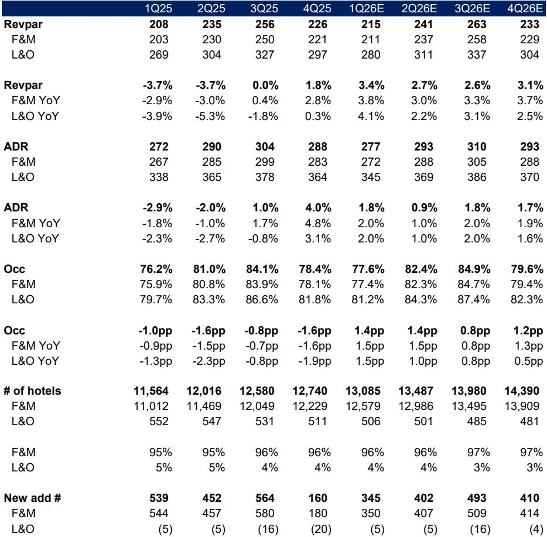
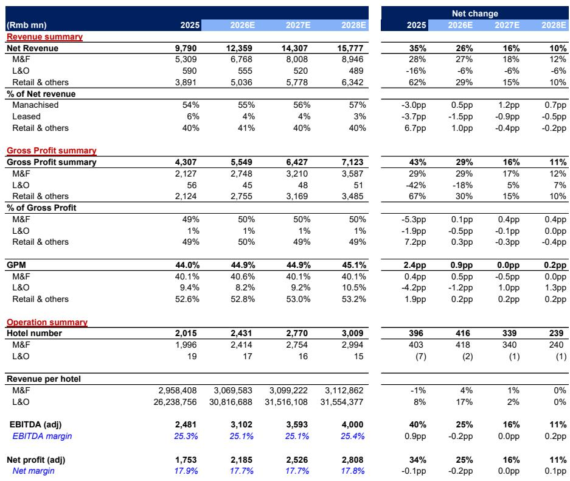
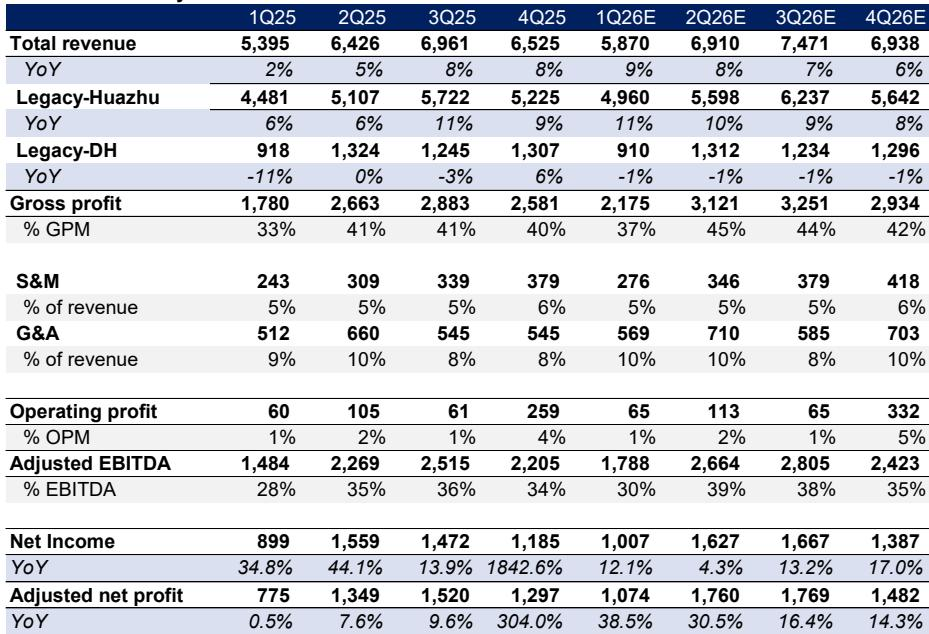

# China's Hotel Industry Has Entered a Structural Upcycle, and the Window for Entry Is Now

The conventional narrative surrounding China's consumer economy in 2026 is one of caution, defined by cautious spending and persistent price sensitivity. Yet beneath this surface-level pessimism, one sector is quietly breaking ranks. The Chinese hotel industry, long dismissed as a cyclical laggard trapped in post-pandemic oversupply, has begun to demonstrate a resilience that sets it apart from virtually every other discretionary consumer category. Since the fourth quarter of 2025, hotel RevPAR performance has been not merely stable, but robust, with first-quarter 2026 data from STR showing a 4.3% year-on-year increase. This is not a temporary reprieve. It is the opening chapter of a structural upcycle.

The thesis is straightforward but powerful: the oversupply that plagued the industry between 2023 and 2025 is now demonstrably fading, demand is recovering across all sub-segments, and the largest players are consolidating their positions through asset-light strategies and brand upgrades. The result is a sector that offers investors something increasingly rare in China's consumer landscape—visible, double-digit earnings growth with manageable downside risk. The question is not whether the recovery is real, but whether investors are willing to look past near-term noise to capture it.

Two names anchor this opportunity: H World and Atour Lifestyle. Both are rated as buys by a global investment bank initiating coverage, and both trade at valuations that seem disconnected from their underlying growth trajectories. H World, with its 10,000-plus hotel footprint and a strategic shift toward franchising, offers scale and stability. Atour, with barely 2,000 hotels and a unique dual-engine model combining hospitality with a fast-growing retail business, offers expansion alpha. Together, they represent two distinct ways to play the same structural shift.

## The Supply-Demand Rebalancing Has Begun, and It Changes Everything

The single most important driver of this upcycle is not demand recovery, though that is supportive. It is the structural deceleration of supply growth. After years of aggressive new openings that created an environment of irrational price competition, the industry is now experiencing a visible slowdown. First-quarter 2026 data from STR shows supply growth of just 2.3%, trailing demand growth of 3.6%. This gap, however modest it may appear, is the foundation upon which the entire bull case rests.

Why is supply slowing? Three forces are converging. First, the pipeline of properties accumulated during the Covid-19 pandemic has largely been absorbed. Second, the ongoing downturn in commercial real estate has constrained the availability of new assets suitable for hotel conversion or development. Third, and most critically, the economics of new hotel openings have deteriorated to the point where franchisee incentives have collapsed. Independent operators, in particular, have suffered from weak RevPAR and aggressive price wars that have eroded profitability. The result is a systemic tightening of supply that benefits the entire industry, but especially the branded chains that can offer consistent quality and operational efficiency.

This is not a temporary cyclical pause. It reflects a deeper structural shift in how the industry operates. Approximately 30% of new hotel supply now comes from the rebranding of existing properties rather than new construction. Independent hotels and smaller brands, facing severe profitability challenges, are increasingly seeking stability by converting to established chains. This migration provides industry leaders with a unique opportunity to accelerate expansion through consolidation, not speculation. The days of building hotels for the sake of growth are over. The era of building brands for the sake of profitability has begun.

## Demand Is Recovering Across All Sub-Segments, but the Composition Matters

The demand side of the equation is equally constructive, though it requires careful parsing. Business travel, which was in a prolonged budget-downgrade cycle through 2025, has now stabilized. The downgrades are largely complete, and corporate travel budgets are being maintained rather than cut further. Leisure travel, meanwhile, continues to demonstrate remarkable resilience, driven by a structural shift in consumer spending from goods to experiences. This is not a post-pandemic catch-up effect; it is a lasting change in consumer behavior that has been further supported by favorable holiday policies in 2026.

Inbound tourism is an additional tailwind that many investors underestimate. Foreign tourist arrivals to China reached 82 million in 2025, and the trend is accelerating, driven by expanded visa-free policies and positive social media exposure. Arrivals from Hong Kong and Macau have already exceeded 2019 levels and continue to grow. This is not a marginal factor. Inbound travel directly supports higher ADR, particularly in major Cities and tourist destinations, and it provides a buffer against any weakness in domestic demand.

The critical insight, however, is not simply that demand is recovering. It is that the composition of demand is shifting in a way that benefits established chains over independent operators. Consumers are increasingly prioritizing service consistency and quality standards, which independent hotels struggle to maintain. This flight to quality is accelerating the consolidation that supply-side dynamics have already set in motion. The result is a self-reinforcing cycle: as independent hotels exit or convert, the pricing power of branded chains increases, which in turn attracts more franchisees and more customers.

## Near-Term Volatility Is a Distraction, Not a Threat

No investment thesis is without its skeptics, and in the case of China hotels, the skeptics have focused on near-term RevPAR fluctuations. The first quarter of 2026 saw some volatility, driven by geopolitical tensions and elevated fuel costs that impacted air travel during the Labor Day holiday. Some investors have interpreted this as a sign that the recovery is fragile.

This interpretation is almost certainly wrong. The structural drivers of the upcycle—slowing supply, accelerating consolidation, and shifting consumer preferences—are unchanged by a few weeks of higher airfares. If anything, the recent volatility has created an attractive entry point. The market is pricing in uncertainty that the underlying data does not support. First-quarter RevPAR was up 4.3% year-on-year, and while full-year guidance is for 2% growth, the first quarter typically sets the tone for the year. The low base in the second and third quarters of 2025 provides additional tailwind.

The more important point is that the hotel industry is demonstrating a resilience that other consumer categories cannot match. While retailers and restaurants remain mired in margin-dilutive price competition, hotel operators have reached a critical consensus: aggressive discounting during off-peak seasons fails to meaningfully stimulate demand and only erodes profitability. This shift in strategy has led industry leaders to prioritize price over occupancy, ensuring more sustainable operating margins. The data confirms this: ADR has been positive since the fourth quarter of 2025, a stark contrast to the deflationary pressures seen elsewhere in consumer spending.

## The Report Raises a Critical Question It Does Not Fully Answer

For all its analytical rigor, the initiating report leaves one question unresolved: how sustainable is the retail-driven growth at Atour? The company's dual-engine model—combining hotels with a fast-growing retail business—is undeniably impressive. First-quarter 2026 retail sales surged 45% year-on-year, significantly outpacing conservative full-year guidance of 25-30%. But the retail business operates in a highly competitive landscape, and its long-term margin profile is less certain than the hotel business.

The report acknowledges this risk but does not fully explore the implications. If Atour's retail business faces competitive pressures or a slowdown in consumer spending on lifestyle products, the company's high-teens revenue and profit growth targets could prove optimistic. Conversely, if the retail business continues to outperform, the current valuation—15 times forward P/E for a company delivering 18% adjusted net profit growth—will look absurdly cheap. The market is clearly pricing in skepticism about the retail segment's sustainability. The question is whether that skepticism is warranted or whether it represents an opportunity for investors who are willing to do the work.

## A Decision Framework for Investors

For investors evaluating this opportunity, three questions should guide the analysis.

First, what is your time horizon? The structural upcycle thesis is a multi-year story, not a quarterly trade. The supply-demand rebalancing that began in late 2025 will take time to fully play out. Investors who are looking for immediate confirmation of the thesis may be disappointed by periodic volatility. Those who can look through the noise to 2027 and 2028 will be rewarded.

Second, which exposure suits your risk tolerance? H World offers scale, diversification, and a proven asset-light model. Its 17% adjusted net profit CAGR target from 2026 to 2028 is achievable and backed by a visible pipeline of conversions and upgrades. Atour offers higher growth potential but with more execution risk, particularly around its retail business. The choice between them is a choice between certainty and optionality.

Third, what is your view on valuation? Both stocks trade at multiples that appear undemanding given their growth trajectories, but the market is clearly assigning a discount for uncertainty. H World trades at 18 times forward P/E; Atour at 15 times. For companies with double-digit earnings growth visibility, these multiples are attractive. But they also imply that the market does not fully believe the thesis. If the recovery plays out as expected, multiple expansion will compound the earnings growth. If the recovery falters, the downside is partially protected by the asset-light models and strong balance sheets.

## The Full Picture Requires More Than This Summary

This article has laid out the core argument for why China's hotel industry is entering a structural upcycle and why the current moment represents an attractive entry point. But the full report contains data, charts, and proprietary tracking that cannot be fully captured in a summary format. The STR data on occupancy and ADR trends, the detailed breakdown of supply growth by player, and the proprietary retail sales tracker for Atour all provide context that is essential for making a fully informed investment decision.

The report also contains a detailed risk section that every investor should read carefully. Macroeconomic headwinds, intensifying competition, franchisee management challenges, and geopolitical risks are all real. The thesis is compelling, but it is not without vulnerabilities.

For serious investors who want to understand this opportunity at the depth it deserves, the original report—including the charts and data that underpin the analysis—is essential reading.

Join the community to read the full report and review the original charts.

*This article is for learning and discussion only and does not constitute investment advice.*

Personal reading notes and learning share only. Not investment advice.

