# China Staples: Pet Food Monthly: Apr 2026: April accelerated vs Q1; China Pet Foods led; Gambol back for growth

In this monthly pet food tracker, we monitor: 1) domestic demand for pet food; 2) ASP trajectory and competitive dynamics within product/channel mix shifts; and 3) overseas demand and our monthly cost tracker. Note that we also updated the data in 1Q26 and 1Q25 following the rebase of data in 2025 Jan - Apr from our data vendor.

Overview:

1) In terms of GMV in Apr, Tmall/Taobao/JD/Douyin combined recorded 18% yoy growth, and came in stronger vs 1Q26 which was 9% yoy. Our covered local brands showed strong performance. Our covered domestic brands accelerated to +36% yoy vs +22% yoy in 1Q26. Global brands returned to growth with 20% yoy vs 4% decline in 1Q26 where Royal Canin outperformed on both Tmall/Douyin channel at 78% overall yoy. China Pet Foods led local brands at +64% yoy, thanks to Wanpy/Toptrees/Zeal at 67%/68%/38%, and we continue to see stronger customer acquisition for Toptrees as shown in Exhibit 14 and Exhibit 15; Gambol returned to growth at 12% yoy, with Myfoodie at 8% albeit Fregate came in negative at 1%. For Petpal, Meatyway grew 33% in Apr, accelerated vs 13% growth in 1Q26.   
2) On product discounts and Douyin ROI, we saw greater non-livestreaming sales mix (Exhibit 19) with shift towards merchants & E-shelf in Apr (Exhibit 18). The premiumization trend continues, as we saw top brands such as Rosy Fresh and Toptrees leading fan attraction on a yoy basis in Apr (Exhibit 15).   
3) Overseas demand and cost tracker: US total dog and cat food imports declined at 5% yoy in Mar vs 3% yoy growth in Feb. On costs, Apr saw higher raw material costs, with higher starch/PET/chicken/corn prices at 7%/47%/5%/6% yoy growth, resulting in our pet food cost index up by 6-8% for April. And we note RMB appreciation is likely to lead to FX losses among pet OEMs as well.

# Within our Pet Foods coverage, we are Neutral on China Pet Foods/Gambol.

While we acknowledge China Pet Food's rising domestic momentum and strong global supply chain to drive wallet share gains, we expect pressures on profitability in domestic market with heightened competition and overseas market with tariff sharing, FX losses and raw material headwinds. While Gambol maintains a leading position in China, we are Neutral rated on the stock on valuation and fierce competition in the premium-priced cat food segment. We maintain a Sell rating on Petpal, given pressures on domestic and overseas profitability and weaker bargaining power.

# Valerie Zhou

+852-2978-0820 | valerie.zhou@gs.com
GS (Asia) L.L.C.

# Leaf Liu

+852-3966-4169 | leaf.liu@gs.com
GS (Asia) L.L.C.

# Christina Liu

+852-2978-6983 | christina.liu@gs.com
GS (Asia) L.L.C.

Table of Contents 

<table><tr><td>Domestic online tracker</td><td>3</td></tr><tr><td>Overseas import demand</td><td>12</td></tr><tr><td>GS proprietary cost index</td><td>12</td></tr><tr><td>Disclosure Appendix</td><td>15</td></tr></table>

# Relevant reads:

China Consumer Staples: Pet food: 4Q25/1Q26 wrap: Results miss across the board; domestic competition to continue; d/g China Pet Foods to Neutral, Petpal to Sell

China Pet Foods (002891.SZ): First Take: 4Q25/1Q26 miss; fuels domestic growth but margin lower; 1Q26 overseas order rebound; Buy

Gambol Pet Group Co. (301498.SZ): Earnings Revision: 4Q25/1Q26 NP weak; In investment cycle to prioritize market share gain; Likely easier selling cost from 2H26; Neutral

Petpal Pet Nutrition Technology (300673.SZ): First take: FY25/1Q26: 4Q25 NI miss on weaker sales, fx loss; 1Q26 soft with margin pressure

Petpal Pet Nutrition Technology (300673.SZ): Post Holiday Consumer Tour: Gradual recovery in OEM/domestic orders while margins still under pressure; New Zealand factory to ramp up

Monthly Momentum of Pet Food Sector   
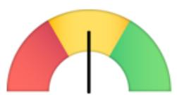  
Leading domestic brands performance indicator

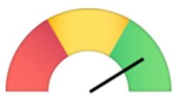  
ASP trend indicator

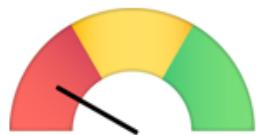  
Douyin ROI

  
Overseas demand

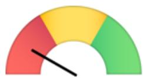  
Cost index   
Methodology: Red/Yellow/Green represents negative/neutral/positive for each indicator.

# Domestic online tracker

# Growth profile - Platform growth and Company growth

Exhibit 1: Category growth on Tmall, Taobao 

<table><tr><td></td><td>Apr-26</td><td>1Q26</td><td>4Q25</td><td>3Q25</td><td>2Q25</td><td>1Q25</td><td>2025</td></tr><tr><td>Category</td><td></td><td></td><td></td><td></td><td></td><td></td><td></td></tr><tr><td>Cat treats</td><td>7.9%</td><td>0.3%</td><td>-16.4%</td><td>-15.7%</td><td>-12.5%</td><td>-15.4%</td><td>-15.0%</td></tr><tr><td>Dog treats</td><td>-1.3%</td><td>-2.6%</td><td>-12.8%</td><td>-10.2%</td><td>-8.9%</td><td>-10.8%</td><td>-10.7%</td></tr><tr><td>Cat staple food</td><td>20.0%</td><td>0.6%</td><td>-9.4%</td><td>-3.0%</td><td>-4.2%</td><td>0.0%</td><td>-4.5%</td></tr><tr><td>Dog staple food</td><td>10.5%</td><td>-1.2%</td><td>-11.2%</td><td>-9.8%</td><td>-8.4%</td><td>-9.3%</td><td>-9.7%</td></tr><tr><td>Total</td><td>14.4%</td><td>-0.1%</td><td>-11.0%</td><td>-7.3%</td><td>-6.7%</td><td>-5.5%</td><td>-7.8%</td></tr></table>

Source: Moojing Market Intelligence, Data compiled by GS Global Investment Research

# Exhibit 2: Apr contributed around 8% of total annual GMV in 2025

Tmall/Taobao GMV distribution by month over 2020-2025

<table><tr><td rowspan="2" colspan="2"></td><td colspan="13">GMV contribution</td></tr><tr><td>Jan</td><td>Feb</td><td>Mar</td><td>Apr</td><td>May</td><td>Jun</td><td>Jul</td><td>Aug</td><td>Sep</td><td>Oct</td><td>Nov</td><td>Dec</td><td></td></tr><tr><td rowspan="6">Pet food</td><td>2020</td><td>5%</td><td>6%</td><td>11%</td><td>6%</td><td>7%</td><td>10%</td><td>6%</td><td>8%</td><td>8%</td><td>8%</td><td>15%</td><td>9%</td><td></td></tr><tr><td>2021</td><td>8%</td><td>5%</td><td>7%</td><td>7%</td><td>7%</td><td>10%</td><td>7%</td><td>8%</td><td>8%</td><td>8%</td><td>16%</td><td>9%</td><td></td></tr><tr><td>2022</td><td>8%</td><td>6%</td><td>7%</td><td>7%</td><td>7%</td><td>12%</td><td>6%</td><td>7%</td><td>8%</td><td>8%</td><td>16%</td><td>9%</td><td></td></tr><tr><td>2023</td><td>6%</td><td>7%</td><td>8%</td><td>7%</td><td>6%</td><td>13%</td><td>7%</td><td>8%</td><td>8%</td><td>7%</td><td>16%</td><td>7%</td><td></td></tr><tr><td>2024</td><td>9%</td><td>6%</td><td>9%</td><td>8%</td><td>11%</td><td>6%</td><td>7%</td><td>7%</td><td>8%</td><td>11%</td><td>10%</td><td>8%</td><td></td></tr><tr><td>2025</td><td>9%</td><td>7%</td><td>10%</td><td>8%</td><td>10%</td><td>9%</td><td>6%</td><td>8%</td><td>7%</td><td>11%</td><td>9%</td><td>7%</td><td></td></tr></table>

Green shades denote positive divergence from median, with darker shades indicating higher difference from median.

Exhibit 3: China Pet Foods led in yoy growth in Apr-26; Gambol returned to growth and Petpal strengthened in April vs 1Q26 

<table><tr><td rowspan="2">Company brand GMV yoy growth</td><td colspan="4">Apr-26</td><td colspan="4">1Q26</td><td colspan="4">4Q25</td><td colspan="4">3Q25</td><td colspan="4">2Q25</td><td colspan="4">1Q25</td><td colspan="4">2025</td></tr><tr><td>Tmall/Taobao</td><td>JD</td><td>Douyin</td><td>Total</td><td>Tmall/Taobao</td><td>JD</td><td>Douyin</td><td>Total</td><td>Tmall/Taobao</td><td>JD</td><td>Douyin</td><td>Total</td><td>Tmall/Taobao</td><td>JD</td><td>Douyin</td><td>Total</td><td>Tmall/Taobao</td><td>JD</td><td>Douyin</td><td>Total</td><td>Tmall/Taobao</td><td>JD</td><td>Douyin</td><td>Total</td><td>Tmall/Taobao</td><td>JD</td><td>Douyin</td><td>Total</td></tr><tr><td>Total Pet Foods</td><td>14%</td><td>-3%</td><td>33%</td><td>18%</td><td>0%</td><td>-27%</td><td>45%</td><td>9%</td><td>-11%</td><td>9%</td><td>53%</td><td>8%</td><td>-7%</td><td>6%</td><td>n.a.</td><td>n.a.</td><td>-7%</td><td>32%</td><td>n.a.</td><td>n.a.</td><td>-5%</td><td>-35%</td><td>n.a.</td><td>n.a.</td><td>7%</td><td>14%</td><td>n.a.</td><td>n.a.</td></tr><tr><td>Local brands - covered</td><td></td><td></td><td></td><td></td><td></td><td></td><td></td><td></td><td></td><td></td><td></td><td></td><td></td><td></td><td></td><td></td><td></td><td></td><td></td><td></td><td></td><td></td><td></td><td></td><td></td><td></td><td></td><td></td></tr><tr><td>Gambol</td><td>4%</td><td>48%</td><td>6%</td><td>12%</td><td>10%</td><td>-41%</td><td>3%</td><td>-1%</td><td>18%</td><td>16%</td><td>16%</td><td>17%</td><td>17%</td><td>16%</td><td>48%</td><td>27%</td><td>24%</td><td>-25%</td><td>73%</td><td>22%</td><td>19%</td><td>-26%</td><td>95%</td><td>23%</td><td>20%</td><td>-6%</td><td>49%</td><td>21%</td></tr><tr><td>Myfoodie</td><td>7%</td><td>35%</td><td>-5%</td><td>8%</td><td>3%</td><td>-60%</td><td>-10%</td><td>-14%</td><td>10%</td><td>5%</td><td>-2%</td><td>5%</td><td>-4%</td><td>1%</td><td>16%</td><td>3%</td><td>11%</td><td>-36%</td><td>44%</td><td>4%</td><td>1%</td><td>-30%</td><td>60%</td><td>5%</td><td>5%</td><td>-16%</td><td>24%</td><td>4%</td></tr><tr><td>Balance Nutrition</td><td>217%</td><td>-87%</td><td>174%</td><td>173%</td><td>132%</td><td>-57%</td><td>286%</td><td>187%</td><td>134%</td><td>-36%</td><td>564%</td><td>226%</td><td>125%</td><td>-17%</td><td>n.a.</td><td>n.a.</td><td>82%</td><td>-4%</td><td>n.a.</td><td>n.a.</td><td>67%</td><td>-44%</td><td>n.a.</td><td>n.a.</td><td>109%</td><td>-26%</td><td>n.a.</td><td>n.a.</td></tr><tr><td>Fregiate</td><td>-21%</td><td>121%</td><td>-7%</td><td>-1%</td><td>10%</td><td>51%</td><td>-12%</td><td>6%</td><td>22%</td><td>73%</td><td>16%</td><td>26%</td><td>94%</td><td>116%</td><td>87%</td><td>94%</td><td>65%</td><td>56%</td><td>108%</td><td>75%</td><td>90%</td><td>10%</td><td>218%</td><td>103%</td><td>51%</td><td>64%</td><td>74%</td><td>59%</td></tr><tr><td>China Pet Food</td><td>69%</td><td>150%</td><td>19%</td><td>64%</td><td>36%</td><td>67%</td><td>86%</td><td>54%</td><td>17%</td><td>72%</td><td>99%</td><td>45%</td><td>7%</td><td>19%</td><td>77%</td><td>25%</td><td>0%</td><td>27%</td><td>81%</td><td>21%</td><td>-7%</td><td>-35%</td><td>58%</td><td>-4%</td><td>5%</td><td>23%</td><td>82%</td><td>24%</td></tr><tr><td>Warpy</td><td>55%</td><td>92%</td><td>71%</td><td>67%</td><td>24%</td><td>5%</td><td>163%</td><td>44%</td><td>0%</td><td>11%</td><td>167%</td><td>28%</td><td>-7%</td><td>3%</td><td>148%</td><td>14%</td><td>-6%</td><td>11%</td><td>127%</td><td>13%</td><td>-14%</td><td>-44%</td><td>88%</td><td>-15%</td><td>-7%</td><td>-5%</td><td>140%</td><td>11%</td></tr><tr><td>Zeal</td><td>58%</td><td>15%</td><td>26%</td><td>38%</td><td>-13%</td><td>60%</td><td>35%</td><td>8%</td><td>-31%</td><td>58%</td><td>61%</td><td>0%</td><td>-28%</td><td>20%</td><td>43%</td><td>0%</td><td>-37%</td><td>138%</td><td>52%</td><td>4%</td><td>-8%</td><td>-62%</td><td>95%</td><td>1%</td><td>-27%</td><td>34%</td><td>59%</td><td>1%</td></tr><tr><td>Toplines</td><td>94%</td><td>340%</td><td>-19%</td><td>68%</td><td>93%</td><td>168%</td><td>48%</td><td>93%</td><td>59%</td><td>191%</td><td>69%</td><td>82%</td><td>53%</td><td>46%</td><td>50%</td><td>50%</td><td>24%</td><td>38%</td><td>66%</td><td>38%</td><td>11%</td><td>7%</td><td>28%</td><td>15%</td><td>40%</td><td>80%</td><td>57%</td><td>52%</td></tr><tr><td>Petpal</td><td></td><td></td><td></td><td></td><td></td><td></td><td></td><td></td><td></td><td></td><td></td><td></td><td></td><td></td><td></td><td></td><td></td><td></td><td></td><td></td><td></td><td></td><td></td><td></td><td></td><td></td><td></td><td></td></tr><tr><td>Meatway</td><td>23%</td><td>93%</td><td>17%</td><td>33%</td><td>15%</td><td>15%</td><td>5%</td><td>13%</td><td>-6%</td><td>32%</td><td>10%</td><td>2%</td><td>7%</td><td>16%</td><td>58%</td><td>21%</td><td>32%</td><td>-40%</td><td>19%</td><td>11%</td><td>54%</td><td>-48%</td><td>61%</td><td>20%</td><td>15%</td><td>-17%</td><td>34%</td><td>11%</td></tr><tr><td>Covered - simple avg.</td><td>32%</td><td>97%</td><td>14%</td><td>36%</td><td>20%</td><td>14%</td><td>31%</td><td>22%</td><td>10%</td><td>40%</td><td>42%</td><td>21%</td><td>10%</td><td>17%</td><td>61%</td><td>24%</td><td>19%</td><td>-13%</td><td>57%</td><td>18%</td><td>22%</td><td>-36%</td><td>72%</td><td>13%</td><td>13%</td><td>0%</td><td>55%</td><td>19%</td></tr><tr><td>Nourse</td><td>64%</td><td>143%</td><td>356%</td><td>207%</td><td>9%</td><td>-3%</td><td>300%</td><td>112%</td><td>-23%</td><td>-11%</td><td>300%</td><td>65%</td><td>-11%</td><td>-18%</td><td>160%</td><td>39%</td><td>-30%</td><td>-32%</td><td>116%</td><td>0%</td><td>-5%</td><td>-43%</td><td>5%</td><td>-8%</td><td>-19%</td><td>-27%</td><td>143%</td><td>23%</td></tr><tr><td>Yanuan</td><td>8%</td><td>7%</td><td></td><td>-13%</td><td>-11%</td><td>-40%</td><td></td><td>-32%</td><td>-14%</td><td>51%</td><td></td><td>-7%</td><td>-28%</td><td>4%</td><td></td><td>-28%</td><td>-22%</td><td>-31%</td><td></td><td>-30%</td><td>-6%</td><td>-39%</td><td></td><td>-17%</td><td>-17%</td><td>-8%</td><td></td><td>-20%</td></tr><tr><td>Keres</td><td>-9%</td><td>-42%</td><td>13%</td><td>-15%</td><td>-14%</td><td>-53%</td><td>13%</td><td>-21%</td><td>-29%</td><td>24%</td><td>28%</td><td>-12%</td><td>-21%</td><td>2%</td><td>-32%</td><td>-17%</td><td>-10%</td><td>-46%</td><td>-19%</td><td>-23%</td><td>-20%</td><td>-37%</td><td>1%</td><td>-24%</td><td>-20%</td><td>-18%</td><td>-7%</td><td>-19%</td></tr><tr><td>Pure &amp; natural</td><td>32%</td><td>-89%</td><td>55%</td><td>0%</td><td>1%</td><td>-88%</td><td>47%</td><td>-10%</td><td>-19%</td><td>-11%</td><td>51%</td><td>-5%</td><td>-18%</td><td>-15%</td><td>95%</td><td>1%</td><td>-27%</td><td>-18%</td><td>36%</td><td>-16%</td><td>-3%</td><td>-48%</td><td>27%</td><td>-15%</td><td>-18%</td><td>-22%</td><td>51%</td><td>-10%</td></tr><tr><td>Honest bite</td><td>19%</td><td>-8%</td><td>-33%</td><td>-5%</td><td>0%</td><td>-38%</td><td>9%</td><td>-3%</td><td>8%</td><td>59%</td><td>16%</td><td>18%</td><td>32%</td><td>80%</td><td>45%</td><td>42%</td><td>24%</td><td>86%</td><td>103%</td><td>50%</td><td>76%</td><td>125%</td><td>62%</td><td>78%</td><td>30%</td><td>81%</td><td>52%</td><td>42%</td></tr><tr><td>Roay Fresh</td><td>66%</td><td>141%</td><td>46%</td><td>72%</td><td>18%</td><td>-276%</td><td>38%</td><td>53%</td><td>77%</td><td>82%</td><td>39%</td><td>69%</td><td>15%</td><td>83%</td><td>55%</td><td>31%</td><td>9%</td><td>22%</td><td>116%</td><td>25%</td><td>23%</td><td>-2%</td><td>167%</td><td>33%</td><td>31%</td><td>47%</td><td>75%</td><td>41%</td></tr><tr><td>Other local - simple avg.</td><td>30%</td><td>25%</td><td>87%</td><td>41%</td><td>0%</td><td>9%</td><td>81%</td><td>16%</td><td>0%</td><td>32%</td><td>87%</td><td>21%</td><td>-5%</td><td>23%</td><td>65%</td><td>12%</td><td>-9%</td><td>-3%</td><td>70%</td><td>1%</td><td>11%</td><td>-7%</td><td>52%</td><td>8%</td><td>-2%</td><td>9%</td><td>63%</td><td>10%</td></tr><tr><td>Global brands</td><td></td><td></td><td></td><td></td><td></td><td></td><td></td><td></td><td></td><td></td><td></td><td></td><td></td><td></td><td></td><td></td><td></td><td></td><td></td><td></td><td></td><td></td><td></td><td></td><td></td><td></td><td></td><td></td></tr><tr><td>Royal Canin</td><td>75%</td><td>85%</td><td>81%</td><td>78%</td><td>34%</td><td>-18%</td><td>68%</td><td>22%</td><td>4%</td><td>36%</td><td>38%</td><td>17%</td><td>8%</td><td>9%</td><td>89%</td><td>11%</td><td>7%</td><td>-17%</td><td>186%</td><td>3%</td><td>21%</td><td>-18%</td><td>315%</td><td>11%</td><td>9%</td><td>3%</td><td>113%</td><td>11%</td></tr><tr><td>Instinct</td><td>1%</td><td>-99%</td><td>-27%</td><td>-40%</td><td>-6%</td><td>-82%</td><td>-97%</td><td>-32%</td><td>-37%</td><td>-29%</td><td>-92%</td><td>-38%</td><td>-28%</td><td>-14%</td><td>-24%</td><td>-24%</td><td>9%</td><td>-26%</td><td>86%</td><td>-2%</td><td>-1%</td><td>-7%</td><td>271%</td><td>2%</td><td>-16%</td><td>-21%</td><td>-8%</td><td>-17%</td></tr><tr><td>Orijlan</td><td>35%</td><td>21%</td><td>79%</td><td>35%</td><td>6%</td><td>-60%</td><td>175%</td><td>-2%</td><td>-5%</td><td>51%</td><td>61%</td><td>18%</td><td>-7%</td><td>-11%</td><td>-20%</td><td>-9%</td><td>-5%</td><td>-25%</td><td>82%</td><td>-6%</td><td>-21%</td><td>-15%</td><td>-5%</td><td>8%</td><td>0%</td><td>1%</td><td>33%</td><td>4%</td></tr><tr><td>Acania</td><td>37%</td><td>-98%</td><td>123%</td><td>7%</td><td>-1%</td><td>-60%</td><td>152%</td><td>-5%</td><td>-11%</td><td>65%</td><td>35%</td><td>11%</td><td>-12%</td><td>32%</td><td>-39%</td><td>-8%</td><td>5%</td><td>49%</td><td>37%</td><td>17%</td><td>36%</td><td>20%</td><td>4%</td><td>30%</td><td>2%</td><td>46%</td><td>10%</td><td>12%</td></tr><tr><td>Global brands - simple avg.</td><td>37%</td><td>-23%</td><td>64%</td><td>20%</td><td>8%</td><td>-55%</td><td>75%</td><td>-4%</td><td>-12%</td><td>31%</td><td>10%</td><td>2%</td><td>-10%</td><td>4%</td><td>2%</td><td>-8%</td><td>4%</td><td>-5%</td><td>98%</td><td>-3%</td><td>19%</td><td>-5%</td><td>146%</td><td>13%</td><td>-1%</td><td>7%</td><td>37%</td><td>2%</td></tr></table>

Source: Moojing Market Intelligence, Chanmama, Data compiled by GS Global Investment Research

Exhibit 4: Douyin channel mix increased in April vs 1Q26 for most brands 

<table><tr><td rowspan="2">Each channel GMV % of total GMV</td><td colspan="2">Apr-26</td><td colspan="2">1Q26</td><td colspan="2">4Q25</td><td colspan="2">3Q25</td><td colspan="2">2Q25</td><td colspan="2">1Q25</td><td colspan="2">2025</td><td colspan="2">2024</td></tr><tr><td>Tmall/Taobao</td><td>Douyin</td><td>Tmall/Taobao</td><td>Douyin</td><td>Tmall/Taobao</td><td>Douyin</td><td>Tmall/Taobao</td><td>Douyin</td><td>Tmall/Taobao</td><td>Douyin</td><td>Tmall/Taobao</td><td>Douyin</td><td>Tmall/Taobao</td><td>Douyin</td><td>Tmall/Taobao</td><td>Douyin</td></tr><tr><td colspan="17">Local brands</td></tr><tr><td>Gambol</td><td>57%</td><td>43%</td><td>59%</td><td>41%</td><td>64%</td><td>36%</td><td>55%</td><td>45%</td><td>62%</td><td>38%</td><td>61%</td><td>39%</td><td>60%</td><td>40%</td><td>66%</td><td>34%</td></tr><tr><td>Myfoodie</td><td>59%</td><td>41%</td><td>61%</td><td>39%</td><td>61%</td><td>39%</td><td>56%</td><td>44%</td><td>62%</td><td>38%</td><td>61%</td><td>39%</td><td>59%</td><td>41%</td><td>65%</td><td>35%</td></tr><tr><td>Balance Nutrition</td><td>35%</td><td>65%</td><td>39%</td><td>61%</td><td>43%</td><td>57%</td><td>42%</td><td>58%</td><td>35%</td><td>65%</td><td>52%</td><td>48%</td><td>42%</td><td>58%</td><td>65%</td><td>35%</td></tr><tr><td>Fregate</td><td>62%</td><td>38%</td><td>65%</td><td>35%</td><td>69%</td><td>31%</td><td>53%</td><td>47%</td><td>62%</td><td>38%</td><td>62%</td><td>38%</td><td>62%</td><td>38%</td><td>67%</td><td>33%</td></tr><tr><td>China Pet Food</td><td>60%</td><td>40%</td><td>63%</td><td>37%</td><td>63%</td><td>37%</td><td>61%</td><td>39%</td><td>66%</td><td>34%</td><td>72%</td><td>28%</td><td>64%</td><td>36%</td><td>77%</td><td>23%</td></tr><tr><td>Wanpy</td><td>59%</td><td>41%</td><td>64%</td><td>36%</td><td>60%</td><td>40%</td><td>66%</td><td>34%</td><td>72%</td><td>28%</td><td>81%</td><td>19%</td><td>67%</td><td>33%</td><td>86%</td><td>14%</td></tr><tr><td>Zeal</td><td>49%</td><td>51%</td><td>53%</td><td>47%</td><td>64%</td><td>36%</td><td>47%</td><td>53%</td><td>57%</td><td>43%</td><td>65%</td><td>35%</td><td>54%</td><td>46%</td><td>74%</td><td>26%</td></tr><tr><td>Toptrees</td><td>64%</td><td>36%</td><td>66%</td><td>34%</td><td>66%</td><td>34%</td><td>60%</td><td>40%</td><td>63%</td><td>37%</td><td>60%</td><td>40%</td><td>63%</td><td>37%</td><td>68%</td><td>32%</td></tr><tr><td colspan="17">Petpal</td></tr><tr><td>Meatyway</td><td>71%</td><td>29%</td><td>78%</td><td>24%</td><td>81%</td><td>19%</td><td>62%</td><td>38%</td><td>79%</td><td>21%</td><td>76%</td><td>24%</td><td>75%</td><td>25%</td><td>80%</td><td>20%</td></tr><tr><td>Nourse</td><td>29%</td><td>71%</td><td>29%</td><td>71%</td><td>29%</td><td>71%</td><td>39%</td><td>61%</td><td>51%</td><td>49%</td><td>66%</td><td>34%</td><td>41%</td><td>59%</td><td>70%</td><td>30%</td></tr><tr><td>Keres</td><td>87%</td><td>13%</td><td>88%</td><td>12%</td><td>86%</td><td>14%</td><td>90%</td><td>10%</td><td>92%</td><td>8%</td><td>92%</td><td>8%</td><td>89%</td><td>11%</td><td>92%</td><td>8%</td></tr><tr><td>Pure &amp; natural</td><td>67%</td><td>33%</td><td>67%</td><td>33%</td><td>64%</td><td>36%</td><td>60%</td><td>40%</td><td>71%</td><td>29%</td><td>78%</td><td>22%</td><td>67%</td><td>33%</td><td>80%</td><td>20%</td></tr><tr><td>Honest bite</td><td>66%</td><td>34%</td><td>69%</td><td>31%</td><td>62%</td><td>38%</td><td>61%</td><td>39%</td><td>64%</td><td>36%</td><td>72%</td><td>28%</td><td>64%</td><td>36%</td><td>70%</td><td>30%</td></tr><tr><td colspan="17">Global brands</td></tr><tr><td>Royal Canin</td><td>86%</td><td>14%</td><td>90%</td><td>10%</td><td>91%</td><td>9%</td><td>90%</td><td>10%</td><td>90%</td><td>10%</td><td>92%</td><td>8%</td><td>91%</td><td>9%</td><td>96%</td><td>4%</td></tr><tr><td>Instinct</td><td>100%</td><td>0%</td><td>100%</td><td>0%</td><td>99%</td><td>1%</td><td>94%</td><td>6%</td><td>94%</td><td>6%</td><td>92%</td><td>8%</td><td>94%</td><td>6%</td><td>95%</td><td>5%</td></tr><tr><td>Orijen</td><td>86%</td><td>14%</td><td>86%</td><td>14%</td><td>75%</td><td>25%</td><td>84%</td><td>16%</td><td>86%</td><td>14%</td><td>95%</td><td>5%</td><td>84%</td><td>16%</td><td>88%</td><td>12%</td></tr><tr><td>Acana</td><td>81%</td><td>19%</td><td>86%</td><td>14%</td><td>80%</td><td>20%</td><td>88%</td><td>12%</td><td>87%</td><td>13%</td><td>95%</td><td>5%</td><td>86%</td><td>14%</td><td>88%</td><td>12%</td></tr><tr><td>Local brands covered avg</td><td>63%</td><td>37%</td><td>66%</td><td>34%</td><td>59%</td><td>41%</td><td>59%</td><td>41%</td><td>69%</td><td>31%</td><td>70%</td><td>30%</td><td>66%</td><td>34%</td><td>74%</td><td>26%</td></tr><tr><td>Other local brands avg</td><td>70%</td><td>30%</td><td>70%</td><td>30%</td><td>62%</td><td>38%</td><td>62%</td><td>38%</td><td>70%</td><td>30%</td><td>78%</td><td>22%</td><td>65%</td><td>35%</td><td>79%</td><td>21%</td></tr><tr><td>Global brands avg</td><td>88%</td><td>12%</td><td>90%</td><td>10%</td><td>89%</td><td>11%</td><td>89%</td><td>11%</td><td>89%</td><td>11%</td><td>93%</td><td>7%</td><td>89%</td><td>11%</td><td>92%</td><td>8%</td></tr></table>

Total GMV refers to the sum of Tmall, Taobao and Douyin GMV.   
Source: Moojing Market Intelligence, Chanmama, Data compiled by GS Global Investment Research

Exhibit 5: Market share declined in Apr vs. 1Q26 for Gambol & Petpal; Royal Canin led with 0.6ppt market share gain vs 1Q26 

<table><tr><td rowspan="2">Market share by channel</td><td>Apr-26</td><td>1Q26</td><td>4Q25</td><td>3Q25</td><td>2Q25</td><td>1Q25</td><td>2025</td><td colspan="2">2024</td></tr><tr><td>Tmall/Taobao</td><td>Tmall/Taobao</td><td>Tmall/Taobao</td><td>Tmall/Taobao</td><td>Tmall/Taobao</td><td>Tmall/Taobao</td><td>Tmall/Taobao</td><td>Tmall/Taobao</td><td>Douyin</td></tr><tr><td colspan="10">Local brands - covered</td></tr><tr><td>Gambol</td><td>8.0%</td><td>9.0%</td><td>11.0%</td><td>8.2%</td><td>8.5%</td><td>7.8%</td><td>8.4%</td><td>7.1%</td><td>11.4%</td></tr><tr><td>Myfoodie</td><td>5.4%</td><td>5.7%</td><td>6.5%</td><td>5.6%</td><td>6.0%</td><td>5.6%</td><td>5.5%</td><td>5.3%</td><td>8.6%</td></tr><tr><td>Balance Nutrition</td><td>0.7%</td><td>0.7%</td><td>0.7%</td><td>0.5%</td><td>0.3%</td><td>0.3%</td><td>0.5%</td><td>n.a.</td><td>n.a.</td></tr><tr><td>Fregate</td><td>1.9%</td><td>2.6%</td><td>4.5%</td><td>2.5%</td><td>2.5%</td><td>2.3%</td><td>2.8%</td><td>1.8%</td><td>2.7%</td></tr><tr><td>China Pet Food</td><td>2.5%</td><td>2.5%</td><td>2.9%</td><td>2.3%</td><td>2.2%</td><td>1.7%</td><td>2.2%</td><td>2.1%</td><td>1.9%</td></tr><tr><td>Wanpy</td><td>1.3%</td><td>1.3%</td><td>1.2%</td><td>1.1%</td><td>1.0%</td><td>1.0%</td><td>1.0%</td><td>1.1%</td><td>0.6%</td></tr><tr><td>Zeal</td><td>0.3%</td><td>0.3%</td><td>0.3%</td><td>0.2%</td><td>0.2%</td><td>0.3%</td><td>0.2%</td><td>0.3%</td><td>0.4%</td></tr><tr><td>Toptrees</td><td>1.0%</td><td>0.9%</td><td>1.5%</td><td>0.9%</td><td>0.9%</td><td>0.4%</td><td>0.9%</td><td>0.7%</td><td>1.0%</td></tr><tr><td colspan="10">Petpal</td></tr><tr><td>Meatyway</td><td>0.5%</td><td>0.6%</td><td>0.8%</td><td>0.5%</td><td>0.7%</td><td>0.5%</td><td>0.6%</td><td>0.5%</td><td>0.4%</td></tr><tr><td colspan="10">Other local brands</td></tr><tr><td>Nourse</td><td>2.5%</td><td>2.2%</td><td>1.6%</td><td>1.8%</td><td>1.9%</td><td>2.3%</td><td>1.7%</td><td>2.1%</td><td>2.8%</td></tr><tr><td>Yanxuan</td><td>2.5%</td><td>2.6%</td><td>3.0%</td><td>2.3%</td><td>2.7%</td><td>3.0%</td><td>2.5%</td><td>2.7%</td><td>1.9%</td></tr><tr><td>Keres</td><td>1.4%</td><td>1.5%</td><td>1.4%</td><td>1.6%</td><td>1.7%</td><td>1.9%</td><td>1.5%</td><td>1.9%</td><td>0.5%</td></tr><tr><td>Pure &amp; natural</td><td>1.8%</td><td>1.7%</td><td>1.8%</td><td>1.3%</td><td>1.6%</td><td>1.7%</td><td>1.5%</td><td>1.8%</td><td>1.4%</td></tr><tr><td>Honest bite</td><td>2.2%</td><td>2.3%</td><td>2.1%</td><td>2.1%</td><td>2.6%</td><td>2.2%</td><td>2.2%</td><td>1.7%</td><td>2.2%</td></tr><tr><td colspan="10">Global brands</td></tr><tr><td>Royal Canin</td><td>11.4%</td><td>10.8%</td><td>8.6%</td><td>8.9%</td><td>8.1%</td><td>7.7%</td><td>7.8%</td><td>7.2%</td><td>1.0%</td></tr><tr><td>Instinct</td><td>2.0%</td><td>2.2%</td><td>2.0%</td><td>1.5%</td><td>2.6%</td><td>2.4%</td><td>2.0%</td><td>2.3%</td><td>0.4%</td></tr><tr><td>Orijen</td><td>2.7%</td><td>3.1%</td><td>2.8%</td><td>2.3%</td><td>3.0%</td><td>3.0%</td><td>2.6%</td><td>2.5%</td><td>1.0%</td></tr><tr><td>Acana</td><td>2.7%</td><td>2.6%</td><td>2.4%</td><td>2.1%</td><td>2.5%</td><td>2.5%</td><td>2.2%</td><td>2.2%</td><td>0.9%</td></tr></table>

Total GMV refers to the sum of Tmall, Taobao and Douyin GMV. Douyin overall GMV is not available since Mar 2025.   
Source: Moojing Market Intelligence, Chanmama, Data compiled by GS Global Investment Research

# Market share by category - in Tmall/Taobao Company summary table

Exhibit 6: Gambol market share gain trajectory 

<table><tr><td rowspan="2">Gambol: Market share (Tmall + Taobao)</td><td colspan="5"></td></tr><tr><td>2023</td><td>2024</td><td>2025</td><td>2026TD</td><td>Δ: 26TD vs 25</td></tr><tr><td>Cat treats</td><td>5.2%</td><td>6.3%</td><td>7.9%</td><td>8.4%</td><td>0.6%</td></tr><tr><td>Dog treats</td><td>12.4%</td><td>11.6%</td><td>10.8%</td><td>9.7%</td><td>-1.1%</td></tr><tr><td>Extruded dog staple food</td><td>7.0%</td><td>6.6%</td><td>8.0%</td><td>6.0%</td><td>-2.0%</td></tr><tr><td>Extruded cat staple food</td><td>3.8%</td><td>5.2%</td><td>6.9%</td><td>7.2%</td><td>0.3%</td></tr><tr><td>Baked/Air-dried dog staple food</td><td>2.1%</td><td>2.7%</td><td>2.4%</td><td>1.0%</td><td>-1.4%</td></tr><tr><td>Baked/Air-dried cat staple food</td><td>3.2%</td><td>16.6%</td><td>19.4%</td><td>14.0%</td><td>-5.5%</td></tr><tr><td>Baked food % sales</td><td>2.0%</td><td>11.3%</td><td>13.4%</td><td>11.7%</td><td>-1.7%</td></tr><tr><td>Fregate % company sales</td><td>11.8%</td><td>25.9%</td><td>30.2%</td><td>25.3%</td><td>-4.9%</td></tr></table>

26TD represents 2026 Jan-Apr.

Source: Moojing Market Intelligence, Data compiled by GS Global Investment Research

Exhibit 7: China Pet Foods market share gain trajectory 

<table><tr><td rowspan="2">China Pet: Market share (Tmall + Taobao)</td><td colspan="5"></td></tr><tr><td>2023</td><td>2024</td><td>2025</td><td>2026TD</td><td>Δ: 26TD vs 25</td></tr><tr><td>Cat treats</td><td>4.4%</td><td>4.3%</td><td>4.3%</td><td>4.9%</td><td>0.6%</td></tr><tr><td>Dog treats</td><td>7.2%</td><td>6.2%</td><td>4.9%</td><td>5.8%</td><td>0.9%</td></tr><tr><td>Extruded dog staple food</td><td>0.4%</td><td>0.4%</td><td>0.3%</td><td>0.4%</td><td>0.1%</td></tr><tr><td>Extruded cat staple food</td><td>0.8%</td><td>0.7%</td><td>0.9%</td><td>1.0%</td><td>0.2%</td></tr><tr><td>Baked/Air-dried dog staple food</td><td>0.9%</td><td>2.9%</td><td>3.9%</td><td>4.3%</td><td>0.4%</td></tr><tr><td>Baked/Air-dried cat staple food</td><td>3.3%</td><td>5.0%</td><td>6.8%</td><td>4.0%</td><td>-2.8%</td></tr><tr><td>Baked food % sales</td><td>5.1%</td><td>13.1%</td><td>18.2%</td><td>15.9%</td><td>-2.3%</td></tr></table>

26TD represents 2026 Jan-Apr.

Source: Moojing Market Intelligence, Data compiled by GS Global Investment Research

# Cat food by category

Exhibit 8: Category market share - baked/air-dried cat staple food 

<table><tr><td colspan="6">Baked/Air-dried cat staple food</td><td></td></tr><tr><td>Category</td><td></td><td>2023</td><td>2024</td><td>2025</td><td>2026TD</td><td></td></tr><tr><td>Mix out of total food</td><td></td><td>2.8%</td><td>4.6%</td><td>6.5%</td><td>6.0%</td><td></td></tr><tr><td>Yoy</td><td></td><td></td><td>48%</td><td>30%</td><td>17%</td><td></td></tr><tr><td>Company</td><td>Brand</td><td>2023</td><td>2024</td><td>2025</td><td>2026TD</td><td>Δ: 26TD vs 25</td></tr><tr><td>Jichong</td><td>Rosy Fresh</td><td>31.9%</td><td>26.1%</td><td>29.1%</td><td>30.2%</td><td>-1.1%</td></tr><tr><td>Gambol</td><td>Fregate</td><td>2.1%</td><td>13.6%</td><td>17.2%</td><td>12.3%</td><td>-4.9%</td></tr><tr><td>Ziwi</td><td>Ziwi</td><td>8.0%</td><td>5.3%</td><td>3.7%</td><td>3.6%</td><td>0.0%</td></tr><tr><td>China Pet</td><td>Toptrees</td><td>3.3%</td><td>5.0%</td><td>6.8%</td><td>4.0%</td><td>-2.8%</td></tr><tr><td>Hangzhou Gaoyejia</td><td>Gaoyejia</td><td>4.9%</td><td>4.2%</td><td>2.6%</td><td>2.5%</td><td>-0.2%</td></tr><tr><td>Shanghai Jianmo Biotech</td><td>Honest bite</td><td>2.1%</td><td>3.6%</td><td>5.1%</td><td>7.4%</td><td>2.4%</td></tr><tr><td>Gambol</td><td>Myfoodie</td><td>1.1%</td><td>3.0%</td><td>2.3%</td><td>1.7%</td><td>-0.6%</td></tr><tr><td>Fish4dogs</td><td>Fish4dogs</td><td>3.4%</td><td>3.4%</td><td>1.7%</td><td>1.2%</td><td>-0.4%</td></tr><tr><td>Jia Pets</td><td>Legendsandy</td><td>3.4%</td><td>2.3%</td><td>2.3%</td><td>2.8%</td><td>0.6%</td></tr><tr><td>Zhejiang Jichong</td><td>Jiangxiaoao</td><td>2.2%</td><td>1.8%</td><td>1.3%</td><td>1.1%</td><td>-0.2%</td></tr><tr><td>Bio Biscuit</td><td>Oven-baked</td><td>1.3%</td><td>0.9%</td><td>0.1%</td><td>0.2%</td><td>0.1%</td></tr><tr><td>Netease</td><td>Yanxuan</td><td>1.1%</td><td>1.4%</td><td>0.9%</td><td>1.5%</td><td>0.6%</td></tr><tr><td>Shanghai Enova</td><td>Pure&amp;natural</td><td>0.4%</td><td>0.7%</td><td>0.5%</td><td>0.2%</td><td>-0.3%</td></tr></table>

Star icon represents brands of companies covered by the GIR China Consumer team. Green/light orange background colors represent domestic/overseas brands. 26TD represents 2026 Jan-Apr.

Source: Moojing Market Intelligence, Data compiled by GS Global Investment Research

Exhibit 9: Category market share - extruded cat staple food 

<table><tr><td colspan="6">Extruded cat staple food</td><td></td></tr><tr><td>Category mix</td><td></td><td>2023</td><td>2024</td><td>2025</td><td>2026TD</td><td></td></tr><tr><td>Mix out of total food</td><td></td><td>46%</td><td>44%</td><td>43%</td><td>44%</td><td></td></tr><tr><td>Yoy</td><td></td><td>0%</td><td>-13%</td><td>-10%</td><td>2%</td><td></td></tr><tr><td>Company</td><td>Brand</td><td>2023</td><td>2024</td><td>2025</td><td>2026TD</td><td>Δ: 26TD vs 25</td></tr><tr><td>Mars</td><td>Royal Canin</td><td>8.3%</td><td>10.9%</td><td>12.9%</td><td>17.1%</td><td>4.2%</td></tr><tr><td>Agrolimen</td><td>Instinct</td><td>4.5%</td><td>4.9%</td><td>4.7%</td><td>4.5%</td><td>-0.2%</td></tr><tr><td>Mars</td><td>Orijen</td><td>4.4%</td><td>4.2%</td><td>5.0%</td><td>5.4%</td><td>0.4%</td></tr><tr><td>Gambol</td><td>Myfoodie</td><td>3.3%</td><td>4.3%</td><td>5.3%</td><td>5.5%</td><td>0.3%</td></tr><tr><td>Netease</td><td>Yanxuan</td><td>4.5%</td><td>3.6%</td><td>3.3%</td><td>2.7%</td><td>-0.5%</td></tr><tr><td>H&amp;H</td><td>Solid Gold</td><td>3.0%</td><td>2.9%</td><td>2.4%</td><td>1.5%</td><td>-0.9%</td></tr><tr><td>Mars</td><td>Acana</td><td>3.6%</td><td>3.2%</td><td>3.6%</td><td>3.8%</td><td>0.2%</td></tr><tr><td>Nestle</td><td>Pro plan</td><td>2.1%</td><td>2.7%</td><td>2.4%</td><td>2.6%</td><td>0.1%</td></tr><tr><td>Jia Pets</td><td>Legendsandy</td><td>2.7%</td><td>4.0%</td><td>3.6%</td><td>3.6%</td><td>0.0%</td></tr><tr><td>Shanghai Jianmo Biotech</td><td>Honest bite</td><td>2.9%</td><td>2.3%</td><td>2.7%</td><td>2.3%</td><td>-0.5%</td></tr><tr><td>Zhejiang Jichong</td><td>Jiangxiaao</td><td>2.3%</td><td>1.7%</td><td>1.4%</td><td>0.8%</td><td>-0.6%</td></tr><tr><td>Keres</td><td>Keres</td><td>2.0%</td><td>1.6%</td><td>1.4%</td><td>1.2%</td><td>-0.1%</td></tr><tr><td>Shanghai Enova</td><td>Pure&amp;natural</td><td>1.2%</td><td>1.1%</td><td>0.9%</td><td>0.8%</td><td>-0.2%</td></tr><tr><td>Gambol</td><td>Fregate</td><td>0.5%</td><td>0.9%</td><td>1.7%</td><td>1.7%</td><td>0.0%</td></tr><tr><td>China Pet</td><td>Wanpy</td><td>0.8%</td><td>0.7%</td><td>0.9%</td><td>1.0%</td><td>0.2%</td></tr></table>

Star icon represents brands of companies covered by the GIR China consumer team. Green/light orange background colors represent domestic/overseas brands. 26TD represents 2026 Jan-Apr.   
Source: Moojing Market Intelligence, Data compiled by GS Global Investment Research

Exhibit 10: Category market share trend - cat treats 

<table><tr><td>Cat treats</td><td></td><td></td><td></td><td></td><td></td><td></td></tr><tr><td>Category</td><td></td><td>2023</td><td>2024</td><td>2025</td><td>2026TD</td><td></td></tr><tr><td>Mix out of total food</td><td></td><td>16%</td><td>16%</td><td>15%</td><td>15%</td><td></td></tr><tr><td>Yoy</td><td></td><td>-6%</td><td>-9%</td><td>-10%</td><td>2%</td><td></td></tr><tr><td>Company</td><td>Brand</td><td>2023</td><td>2024</td><td>2025</td><td>2026TD</td><td>Δ: 26TD vs 25</td></tr><tr><td>Gambol</td><td>Myfoodie</td><td>5.0%</td><td>5.9%</td><td>7.2%</td><td>7.7%</td><td>0.5%</td></tr><tr><td>Netease</td><td>Yanxuan</td><td>3.2%</td><td>3.7%</td><td>3.5%</td><td>3.8%</td><td>0.3%</td></tr><tr><td>Mars</td><td>Sheba</td><td>3.8%</td><td>3.3%</td><td>3.1%</td><td>3.1%</td><td>0.0%</td></tr><tr><td>Yiwu Disi</td><td>Guazhoumu</td><td>3.7%</td><td>2.8%</td><td>2.0%</td><td>1.4%</td><td>-0.6%</td></tr><tr><td>China Pet</td><td>Wanpy</td><td>3.6%</td><td>3.1%</td><td>3.1%</td><td>3.4%</td><td>0.3%</td></tr><tr><td>Ranova</td><td>Ranova</td><td>2.5%</td><td>2.4%</td><td>1.7%</td><td>1.9%</td><td>0.2%</td></tr><tr><td>Tianjin Chongciyuan</td><td>Alfie&amp;buddy</td><td>2.0%</td><td>1.8%</td><td>1.7%</td><td>1.5%</td><td>-0.1%</td></tr><tr><td>Inaba</td><td>Inaba</td><td>2.2%</td><td>1.8%</td><td>1.7%</td><td>1.5%</td><td>-0.2%</td></tr><tr><td>Nestle</td><td>Fancy Feast</td><td>2.6%</td><td>1.8%</td><td>1.7%</td><td>1.4%</td><td>-0.4%</td></tr><tr><td>Zhejiang Jichong</td><td>Jiangxiaoao</td><td>1.4%</td><td>1.2%</td><td>1.0%</td><td>0.7%</td><td>-0.3%</td></tr><tr><td>Mars</td><td>Royal Canin</td><td>1.2%</td><td>1.3%</td><td>1.0%</td><td>0.8%</td><td>-0.3%</td></tr><tr><td>Keres</td><td>Keres</td><td>1.4%</td><td>1.2%</td><td>1.1%</td><td>0.9%</td><td>-0.2%</td></tr><tr><td>China Pet</td><td>Toptrees</td><td>0.8%</td><td>1.3%</td><td>1.2%</td><td>1.5%</td><td>0.3%</td></tr><tr><td>Jia Pets</td><td>Legendsandy</td><td>0.4%</td><td>1.6%</td><td>2.3%</td><td>2.9%</td><td>0.6%</td></tr><tr><td>Ziwi</td><td>Ziwi</td><td>0.5%</td><td>0.7%</td><td>0.5%</td><td>0.5%</td><td>0.0%</td></tr><tr><td>Gambol</td><td>Fregate</td><td>0.2%</td><td>0.4%</td><td>0.7%</td><td>0.7%</td><td>0.0%</td></tr><tr><td>Nestle</td><td>Whiskas</td><td>0.6%</td><td>0.4%</td><td>0.3%</td><td>0.3%</td><td>0.0%</td></tr></table>

Star icon represents brands of companies covered by the GIR China consumer team. Green/light orange background colors represent domestic/overseas brands. 26TD represents 2026 Jan-Apr.   
Source: Moojing Market Intelligence, Data compiled by GS Global Investment Research

# Dog food by category

Exhibit 11: Category market share - baked/air-dried dog staple food 

<table><tr><td colspan="6">Baked/Air-dried dog staple food</td><td></td></tr><tr><td>Category</td><td></td><td>2023</td><td>2024</td><td>2025</td><td>2026TD</td><td></td></tr><tr><td>Mix out of total food</td><td></td><td>1.1%</td><td>1.4%</td><td>1.8%</td><td>2.1%</td><td></td></tr><tr><td>Yoy</td><td></td><td></td><td>13%</td><td>20%</td><td>36%</td><td></td></tr><tr><td>Company</td><td>Brand</td><td>2023</td><td>2024</td><td>2025</td><td>2026TD</td><td>Δ: 26TD vs 25</td></tr><tr><td>Jichong</td><td>Rosy Fresh</td><td>36.4%</td><td>32.9%</td><td>38.0%</td><td>47.0%</td><td>9.0%</td></tr><tr><td>Ziwi</td><td>Ziwi</td><td>15.4%</td><td>12.1%</td><td>9.4%</td><td>7.8%</td><td>-1.7%</td></tr><tr><td>Bio Biscuit</td><td>Oven-baked</td><td>7.2%</td><td>4.0%</td><td>1.8%</td><td>1.7%</td><td>-0.1%</td></tr><tr><td>Stella &amp; Chewy</td><td>Stella &amp; Chewy</td><td>6.9%</td><td>6.7%</td><td>4.6%</td><td>4.1%</td><td>-0.5%</td></tr><tr><td>Shanghai Enova</td><td>Pure&amp;natural</td><td>1.9%</td><td>3.8%</td><td>3.0%</td><td>1.5%</td><td>-1.5%</td></tr><tr><td>Fish4dogs</td><td>Fish4dogs</td><td>4.1%</td><td>3.9%</td><td>2.6%</td><td>1.7%</td><td>-0.9%</td></tr><tr><td>Gambol</td><td>Myfoodie</td><td>2.1%</td><td>2.7%</td><td>2.4%</td><td>1.0%</td><td>-1.4%</td></tr><tr><td>China Pet</td><td>Toptrees</td><td>0.9%</td><td>2.9%</td><td>3.9%</td><td>4.3%</td><td>0.4%</td></tr><tr><td>Zhejiang Jichong</td><td>Wangbaba</td><td>1.4%</td><td>2.0%</td><td>1.2%</td><td>0.6%</td><td>-0.6%</td></tr><tr><td>Dalian Youchong</td><td>Oneness</td><td>1.3%</td><td>1.2%</td><td>1.2%</td><td>1.2%</td><td>0.0%</td></tr><tr><td>Dogedaddy</td><td>Dogedaddy</td><td>1.1%</td><td>1.3%</td><td>2.3%</td><td>1.7%</td><td>-0.6%</td></tr><tr><td>Petpal</td><td>Meatyway</td><td></td><td>2.6%</td><td>2.4%</td><td>2.4%</td><td>0.0%</td></tr><tr><td>Netease</td><td>Yanxuan</td><td>0.3%</td><td>0.3%</td><td>0.1%</td><td>0.2%</td><td>0.1%</td></tr><tr><td>Mars</td><td>Acana</td><td>0.2%</td><td>0.2%</td><td>0.7%</td><td>1.1%</td><td>0.4%</td></tr></table>

Star icon represents brands of companies covered by the GIR China consumer team. Green/light orange background colors represent domestic/overseas brands. 26TD represents 2026 Jan-Apr.   
Source: Moojing Market Intelligence, Data compiled by GS Global Investment Research

Exhibit 12: Category market share trend - extruded dog staple food 

<table><tr><td colspan="6">Extruded dog staple food</td><td></td></tr><tr><td>Category mix</td><td></td><td>2023</td><td>2024</td><td>2025</td><td>2026TD</td><td></td></tr><tr><td>Mix out of total food</td><td></td><td>23%</td><td>22%</td><td>20%</td><td>20%</td><td></td></tr><tr><td>Yoy</td><td></td><td>-8%</td><td>-13%</td><td>-13%</td><td>-3%</td><td></td></tr><tr><td>Company</td><td>Brand</td><td>2023</td><td>2024</td><td>2025</td><td>2026TD</td><td>Δ: 26TD vs 25</td></tr><tr><td>Mars</td><td>Royal Canin</td><td>6.7%</td><td>8.0%</td><td>8.9%</td><td>12.0%</td><td>3.1%</td></tr><tr><td>Gambol</td><td>Myfoodie</td><td>7.0%</td><td>6.6%</td><td>8.0%</td><td>6.0%</td><td>-2.0%</td></tr><tr><td>Shanghai Enova</td><td>Pure&amp;natural</td><td>5.7%</td><td>5.5%</td><td>5.5%</td><td>6.6%</td><td>1.1%</td></tr><tr><td>Bridge</td><td>Bile</td><td>4.4%</td><td>4.0%</td><td>3.1%</td><td>2.6%</td><td>-0.5%</td></tr><tr><td>Jia Pets</td><td>Crazy Doggy</td><td>3.4%</td><td>3.5%</td><td>3.3%</td><td>2.7%</td><td>-0.6%</td></tr><tr><td>Mars</td><td>Acana</td><td>3.5%</td><td>3.5%</td><td>4.2%</td><td>4.2%</td><td>0.0%</td></tr><tr><td>Mars</td><td>Orijen</td><td>3.0%</td><td>2.9%</td><td>2.9%</td><td>2.8%</td><td>-0.1%</td></tr><tr><td>Keres</td><td>Keres</td><td>2.8%</td><td>2.2%</td><td>2.3%</td><td>2.1%</td><td>-0.1%</td></tr><tr><td>Nestle</td><td>Pro plan</td><td>1.7%</td><td>1.7%</td><td>1.5%</td><td>1.5%</td><td>0.0%</td></tr><tr><td>Netease</td><td>Yanxuan</td><td>1.3%</td><td>1.8%</td><td>1.8%</td><td>1.3%</td><td>-0.4%</td></tr><tr><td>Shanghai Jianmo Biotech</td><td>Honest bite</td><td>0.8%</td><td>1.3%</td><td>1.9%</td><td>2.2%</td><td>0.3%</td></tr><tr><td>Bridge</td><td>Natural Bridge</td><td>1.3%</td><td>1.0%</td><td>0.8%</td><td>0.7%</td><td>-0.1%</td></tr><tr><td>Agrolimen</td><td>Instinct</td><td>0.5%</td><td>0.5%</td><td>0.6%</td><td>0.6%</td><td>0.0%</td></tr><tr><td>China Pet</td><td>Wanpy</td><td>0.4%</td><td>0.4%</td><td>0.3%</td><td>0.4%</td><td>0.1%</td></tr></table>

Star icon represents brands of companies covered by the GIR China consumer team. Green/light orange background colors represent domestic/overseas brands. 26TD represents 2026 Jan-Apr.   
Source: Moojing Market Intelligence, Data compiled by GS Global Investment Research

Exhibit 13: Category market share trend - dog treats 

<table><tr><td>Dog treats</td><td></td><td></td><td></td><td></td><td></td><td></td></tr><tr><td>Category</td><td></td><td>2023</td><td>2024</td><td>2025</td><td>2026TD</td><td></td></tr><tr><td>Mix out of total food</td><td></td><td>6%</td><td>6%</td><td>6%</td><td>6%</td><td></td></tr><tr><td>Yoy</td><td></td><td>-3%</td><td>-9%</td><td>-11%</td><td>-2%</td><td></td></tr><tr><td>Company</td><td>Brand</td><td>2023</td><td>2024</td><td>2025</td><td>2026TD</td><td>Δ: 26TD vs 25</td></tr><tr><td>Gambol</td><td>Myfoodie</td><td>12.4%</td><td>11.6%</td><td>10.8%</td><td>9.7%</td><td>-1.1%</td></tr><tr><td>China Pet</td><td>Wanpy</td><td>4.1%</td><td>3.1%</td><td>2.7%</td><td>3.1%</td><td>0.4%</td></tr><tr><td>China Pet</td><td>Zeal</td><td>3.1%</td><td>3.0%</td><td>2.2%</td><td>2.7%</td><td>0.5%</td></tr><tr><td>Petpal</td><td>Meatyway</td><td>6.6%</td><td>7.9%</td><td>9.5%</td><td>8.6%</td><td>-0.8%</td></tr><tr><td>Jia Pets</td><td>Crazy Doggy</td><td>6.1%</td><td>7.2%</td><td>7.2%</td><td>6.3%</td><td>-0.9%</td></tr><tr><td>Matchwell Nanjing</td><td>Matchwell</td><td>3.1%</td><td>3.0%</td><td>2.1%</td><td>2.2%</td><td>0.1%</td></tr><tr><td>Yiwu Disi</td><td>Guazhoumu</td><td>1.3%</td><td>0.9%</td><td>0.6%</td><td>0.5%</td><td>-0.1%</td></tr><tr><td>Keres</td><td>Keres</td><td>1.3%</td><td>1.1%</td><td>0.8%</td><td>0.6%</td><td>-0.2%</td></tr><tr><td>Nanjing Hipidog</td><td>Hipidog</td><td>2.2%</td><td>2.5%</td><td>2.9%</td><td>3.4%</td><td>0.6%</td></tr><tr><td>Hayashi Manufacturing</td><td>Doggy man</td><td>1.7%</td><td>1.3%</td><td>1.0%</td><td>1.0%</td><td>0.1%</td></tr><tr><td>Nestle</td><td>Pedigree</td><td>1.5%</td><td>1.0%</td><td>0.6%</td><td>0.7%</td><td>0.0%</td></tr></table>

Star icon represents brands of companies covered by the GIR China consumer team. Green/light orange background colors represent domestic/overseas brands. 26TD represents 2026 Jan-Apr.   
Source: Moojing Market Intelligence, Data compiled by GS Global Investment Research

# Douyin ROI - consumer base, traffic, investment

Exhibit 14: Rosy Fresh led pace in fan additions in Apr, Toptrees deaccelerated since Oct 25   
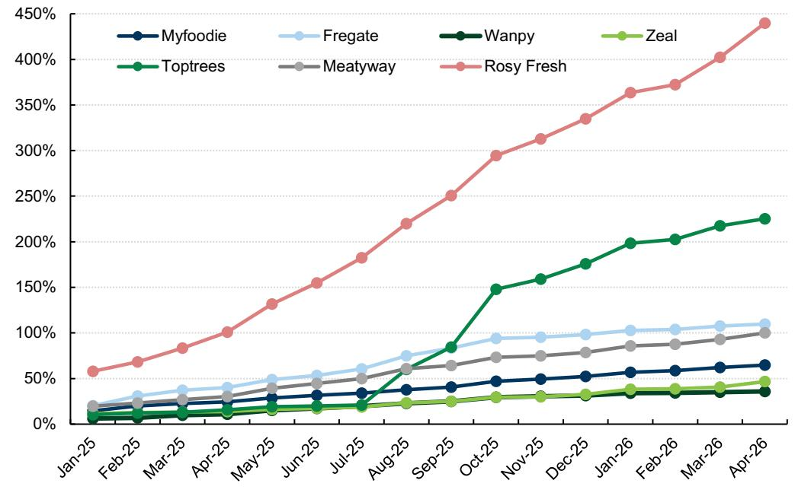

line

| Month   | Myfoodie | Fregate | Wanpy | Zeal | Toptrees | Meatyway | Rosy Fresh |
|---------|----------|---------|-------|------|----------|----------|------------|
| Jan-25  | 10%      | 15%     | 5%    | 5%   | 10%      | 15%      | 55%        |
| Feb-25  | 15%      | 25%     | 10%   | 10%  | 15%      | 20%      | 65%        |
| Mar-25  | 20%      | 30%     | 15%   | 15%  | 20%      | 25%      | 80%        |
| Apr-25  | 25%      | 35%     | 20%   | 20%  | 25%      | 30%      | 100%       |
| May-25  | 30%      | 40%     | 25%   | 25%  | 30%      | 35%      | 130%       |
| Jun-25  | 35%      | 45%     | 30%   | 30%  | 35%      | 40%      | 150%       |
| Jul-25  | 40%      | 50%     | 35%   | 35%  | 40%      | 45%      | 180%       |
| Aug-25  | 45%      | 60%     | 40%   | 40%  | 80%      | 50%      | 220%       |
| Sep-25  | 50%      | 70%     | 45%   | 45%  | 90%      | 60%      | 250%       |
| Oct-25  | 55%      | 90%     | 50%   | 50%  | 145%     | 70%      | 290%       |
| Nov-25  | 60%      | 95%     | 55%   | 55%  | 160%     | 75%      | 310%       |
| Dec-25  | 65%      | 100%    | 60%   | 60%  | 175%     | 80%      | 330%       |
| Jan-26  | 70%      | 105%    | 65%   | 65%  | 200%     | 85%      | 360%       |
| Feb-26  | 75%      | 110%    | 70%   | 70%  | 210%     | 90%      | 370%       |
| Mar-26  | 80%      | 115%    | 75%   | 75%  | 220%     | 95%      | 400%       |
| Apr-26  | 85%      | 120%    | 80%   | 80%  | 230%     | 100%     | 440%       |

Growth rate is calculated based on Sep 2024 number.

Source: Chanmama

Exhibit 15: Toptrees and Rosy Fresh led Douyin flagship account fan adds 

<table><tr><td></td><td>2025-04</td><td>Jan-25</td><td>Feb-25</td><td>Mar-25</td><td>Apr-25</td><td>May-25</td><td>Jun-25</td><td>Jul-25</td><td>Aug-25</td><td>Sep-25</td><td>Oct-25</td><td>Nov-25</td><td>Dec-25</td><td>Jan-26</td><td>Feb-26</td><td>Mar-26</td><td>Apr-26</td><td>Last month change</td><td colspan="2">% Change vs. Apr 25</td><td>%</td></tr><tr><td>Myfoodie</td><td>981</td><td>903</td><td>944</td><td>965</td><td>981</td><td>1015</td><td>1036</td><td>1056</td><td>1086</td><td>1108</td><td>1159</td><td>1177</td><td>1200</td><td>1235</td><td>1250</td><td>1278</td><td>1298</td><td>20</td><td>1.6%</td><td>317</td><td>32%</td></tr><tr><td>Fregate</td><td>644</td><td>553</td><td>602</td><td>631</td><td>644</td><td>685</td><td>705</td><td>739</td><td>805</td><td>844</td><td>892</td><td>899</td><td>912</td><td>933</td><td>938</td><td>955</td><td>965</td><td>10</td><td>1.0%</td><td>321</td><td>50%</td></tr><tr><td>Wanpy</td><td>272</td><td>260</td><td>262</td><td>269</td><td>272</td><td>282</td><td>287</td><td>293</td><td>301</td><td>306</td><td>317</td><td>320</td><td>322</td><td>328</td><td>329</td><td>331</td><td>333</td><td>2</td><td>0.6%</td><td>61</td><td>22%</td></tr><tr><td>Zeal</td><td>205</td><td>201</td><td>203</td><td>204</td><td>205</td><td>209</td><td>211</td><td>214</td><td>222</td><td>225</td><td>233</td><td>234</td><td>239</td><td>249</td><td>250</td><td>253</td><td>264</td><td>11</td><td>4.3%</td><td>59</td><td>29%</td></tr><tr><td>Toptrees</td><td>133</td><td>127</td><td>129</td><td>130</td><td>133</td><td>137</td><td>138</td><td>139</td><td>184</td><td>212</td><td>285</td><td>298</td><td>317</td><td>343</td><td>348</td><td>365</td><td>374</td><td>9</td><td>2.5%</td><td>241</td><td>181%</td></tr><tr><td>Meatyway</td><td>73</td><td>67</td><td>69</td><td>71</td><td>73</td><td>78</td><td>81</td><td>84</td><td>90</td><td>92</td><td>97</td><td>98</td><td>100</td><td>104</td><td>105</td><td>108</td><td>112</td><td>4</td><td>3.7%</td><td>39</td><td>53%</td></tr><tr><td>Rosy Fresh</td><td>253</td><td>199</td><td>212</td><td>231</td><td>253</td><td>292</td><td>321</td><td>356</td><td>403</td><td>442</td><td>497</td><td>520</td><td>548</td><td>584</td><td>595</td><td>633</td><td>680</td><td>47</td><td>7.4%</td><td>427</td><td>169%</td></tr><tr><td>Royal Canin</td><td>1295</td><td>1233</td><td>1251</td><td>1282</td><td>1295</td><td>1327</td><td>1341</td><td>1386</td><td>1427</td><td>1503</td><td>1543</td><td>1570</td><td>1586</td><td>1658</td><td>1676</td><td>1732</td><td>1816</td><td>84</td><td>4.8%</td><td>521</td><td>40%</td></tr><tr><td>Orijen</td><td>123</td><td>121</td><td>122</td><td>122</td><td>123</td><td>131</td><td>132</td><td>133</td><td>137</td><td>148</td><td>165</td><td>167</td><td>171</td><td>174</td><td>175</td><td>177</td><td>180</td><td>3</td><td>1.7%</td><td>57</td><td>46%</td></tr><tr><td>Acana</td><td>116</td><td>116</td><td>116</td><td>116</td><td>116</td><td>140</td><td>140</td><td>139</td><td>143</td><td>145</td><td>157</td><td>158</td><td>160</td><td>165</td><td>166</td><td>169</td><td>170</td><td>1</td><td>0.6%</td><td>54</td><td>47%</td></tr><tr><td>Pro Plan</td><td>137</td><td>127</td><td>132</td><td>136</td><td>137</td><td>142</td><td>144</td><td>148</td><td>155</td><td>161</td><td>176</td><td>181</td><td>200</td><td>213</td><td>218</td><td>230</td><td>236</td><td>6</td><td>2.6%</td><td>99</td><td>72%</td></tr></table>

Data as of end of Mar 2026. Blue represents domestic brands. Orange represents global brands.   
Source: Chanmama

Exhibit 16: Sales per fan trending down for most selected brands vs. 1Q26; Fregate has strongest purchase freq. 

<table><tr><td rowspan="2">Brands</td><td rowspan="2">Company</td><td colspan="7">Sales/fan (Rmb)</td><td colspan="7">Purchase Frequency</td></tr><tr><td>Apr-26</td><td>1Q26</td><td>4Q25</td><td>3Q25</td><td>2Q25</td><td>1Q25</td><td>2025</td><td>Apr-26</td><td>1Q26</td><td>4Q25</td><td>3Q25</td><td>2Q25</td><td>1Q25</td><td>2025</td></tr><tr><td colspan="16">Domestic</td></tr><tr><td>Myfoodie</td><td>Gambol</td><td>182</td><td>215</td><td>304</td><td>215</td><td>277</td><td>272</td><td>267</td><td>2.4</td><td>2.9</td><td>4.1</td><td>2.9</td><td>3.7</td><td>3.8</td><td>3.6</td></tr><tr><td>Fregate</td><td>Gambol</td><td>175</td><td>197</td><td>382</td><td>376</td><td>366</td><td>361</td><td>371</td><td>5.8</td><td>6.6</td><td>8.4</td><td>9.2</td><td>4.9</td><td>4.9</td><td>6.8</td></tr><tr><td>Wanpy</td><td>China Pet Food</td><td>232</td><td>258</td><td>349</td><td>177</td><td>167</td><td>92</td><td>196</td><td>3.1</td><td>3.4</td><td>4.7</td><td>2.4</td><td>1.4</td><td>1.2</td><td>2.4</td></tr><tr><td>Zeal</td><td>China Pet Food</td><td>160</td><td>172</td><td>249</td><td>194</td><td>185</td><td>163</td><td>198</td><td>2.1</td><td>3.3</td><td>3.3</td><td>3.3</td><td>2.5</td><td>2.8</td><td>3.0</td></tr><tr><td>Toptrees</td><td>China Pet Food</td><td>255</td><td>280</td><td>603</td><td>644</td><td>911</td><td>477</td><td>659</td><td>3.4</td><td>3.7</td><td>8.0</td><td>8.6</td><td>9.6</td><td>7.1</td><td>8.3</td></tr><tr><td>Meatyway</td><td>Petpal</td><td>263</td><td>286</td><td>363</td><td>562</td><td>498</td><td>484</td><td>477</td><td>3.5</td><td>3.8</td><td>4.8</td><td>7.5</td><td>6.6</td><td>9.1</td><td>7.0</td></tr><tr><td>Nourse</td><td>Chongxing Pet</td><td>501</td><td>519</td><td>435</td><td>261</td><td>191</td><td>120</td><td>252</td><td>3.3</td><td>3.5</td><td>2.9</td><td>2.4</td><td>0.9</td><td>1.5</td><td>1.9</td></tr><tr><td>Keres</td><td>Keres</td><td>68</td><td>94</td><td>147</td><td>84</td><td>89</td><td>105</td><td>106</td><td>0.9</td><td>1.2</td><td>2.0</td><td>1.1</td><td>1.2</td><td>1.3</td><td>1.4</td></tr><tr><td>Pure &amp; natural</td><td>Enova</td><td>164</td><td>197</td><td>338</td><td>273</td><td>340</td><td>309</td><td>315</td><td>0.7</td><td>0.8</td><td>1.4</td><td>1.0</td><td>1.6</td><td>1.3</td><td>1.3</td></tr><tr><td>Honest bite</td><td>Jianmo Biotechnology</td><td>163</td><td>178</td><td>268</td><td>279</td><td>463</td><td>281</td><td>323</td><td>5.4</td><td>5.9</td><td>4.8</td><td>6.7</td><td>8.7</td><td>7.7</td><td>7.0</td></tr><tr><td colspan="16">Global</td></tr><tr><td>Royal Canin</td><td>Mars</td><td>117</td><td>106</td><td>110</td><td>103</td><td>132</td><td>100</td><td>111</td><td>0.8</td><td>0.8</td><td>0.7</td><td>0.7</td><td>0.9</td><td>0.6</td><td>0.7</td></tr><tr><td>Orijen</td><td>Mars</td><td>300</td><td>853</td><td>933</td><td>382</td><td>614</td><td>170</td><td>525</td><td>0.5</td><td>0.6</td><td>1.7</td><td>0.7</td><td>1.0</td><td>0.7</td><td>1.0</td></tr><tr><td>Acana</td><td>Mars</td><td>180</td><td>596</td><td>642</td><td>237</td><td>449</td><td>171</td><td>375</td><td>0.7</td><td>0.9</td><td>2.0</td><td>0.8</td><td>1.1</td><td>0.7</td><td>1.1</td></tr></table>

Sales per fan and purchase frequency is annualized (times 12 for monthly numbers). Based on mid-period fans count. Since Mar 2025, ticket size is estimated based on the mid-point of pricing ranges and may have deviation from actual ticket size due to Douyin disclosure changes.   
Source: Chanmama

Exhibit 17: We noted weaker performance in In-house/KOL GMV in Apr.....   
Douyin scorecard tracker 

<table><tr><td rowspan="2">Brands</td><td rowspan="2">Company</td><td>GMV (Rmb mn)</td><td colspan="5">GMV yoy</td><td colspan="6">Inhouse livestreaming GMV yoy</td><td colspan="5">KOL GMV yoy</td></tr><tr><td>Apr-26</td><td>Apr-26</td><td>1Q26</td><td>4Q25</td><td>3Q25</td><td>2Q25</td><td>Apr-26</td><td>Jan+Feb-26</td><td>1Q26</td><td>4Q25</td><td>3Q25</td><td>2Q25</td><td>Apr-26</td><td>1Q26</td><td>4Q25</td><td>3Q25</td><td>2Q25</td></tr><tr><td colspan="19">Local brands (Covered)</td></tr><tr><td>Myfoodie</td><td>Gambol</td><td>54</td><td>-5%</td><td>-10%</td><td>-2%</td><td>16%</td><td>44%</td><td>4%</td><td>19%</td><td>15%</td><td>26%</td><td>6%</td><td>49%</td><td>-16%</td><td>-7%</td><td>22%</td><td>65%</td><td>21%</td></tr><tr><td>Fregate</td><td>Gambol</td><td>17</td><td>-7%</td><td>-12%</td><td>16%</td><td>87%</td><td>108%</td><td>-15%</td><td>1%</td><td>6%</td><td>48%</td><td>80%</td><td>101%</td><td>-2%</td><td>-23%</td><td>0%</td><td>65%</td><td>1%</td></tr><tr><td>Wanpy</td><td>China Pet Food</td><td>10</td><td>71%</td><td>163%</td><td>167%</td><td>148%</td><td>127%</td><td>35%</td><td>202%</td><td>174%</td><td>147%</td><td>122%</td><td>107%</td><td>106%</td><td>404%</td><td>692%</td><td>219%</td><td>109%</td></tr><tr><td>Toptrees</td><td>China Pet Food</td><td>7</td><td>-19%</td><td>48%</td><td>69%</td><td>50%</td><td>66%</td><td>34%</td><td>35%</td><td>29%</td><td>82%</td><td>67%</td><td>82%</td><td>44%</td><td>77%</td><td>83%</td><td>26%</td><td>8%</td></tr><tr><td>Zeal</td><td>China Pet Food</td><td>3</td><td>26%</td><td>35%</td><td>61%</td><td>43%</td><td>52%</td><td>-33%</td><td>84%</td><td>56%</td><td>109%</td><td>92%</td><td>155%</td><td>-51%</td><td>22%</td><td>19%</td><td>4%</td><td>-16%</td></tr><tr><td>Meatyway</td><td>Petpal</td><td>3</td><td>17%</td><td>5%</td><td>10%</td><td>58%</td><td>19%</td><td>20%</td><td>-1%</td><td>5%</td><td>-11%</td><td>80%</td><td>60%</td><td>36%</td><td>20%</td><td>6%</td><td>45%</td><td>-27%</td></tr><tr><td colspan="19">Other Local brands</td></tr><tr><td>Nourse</td><td>Chongxing Pet</td><td>105</td><td>356%</td><td>300%</td><td>300%</td><td>160%</td><td>116%</td><td>382%</td><td>282%</td><td>224%</td><td>333%</td><td>168%</td><td>79%</td><td>-1%</td><td>272%</td><td>432%</td><td>181%</td><td>580%</td></tr><tr><td>Keres</td><td>Keres</td><td>3</td><td>13%</td><td>13%</td><td>28%</td><td>-32%</td><td>-19%</td><td>21%</td><td>57%</td><td>41%</td><td>14%</td><td>-47%</td><td>-34%</td><td>-30%</td><td>-57%</td><td>234%</td><td>-74%</td><td>-82%</td></tr><tr><td>Pure &amp; natural</td><td>Enova</td><td>12</td><td>55%</td><td>47%</td><td>51%</td><td>95%</td><td>36%</td><td>70%</td><td>95%</td><td>89%</td><td>206%</td><td>117%</td><td>60%</td><td>-44%</td><td>-13%</td><td>-29%</td><td>175%</td><td>29%</td></tr><tr><td>Honest bite</td><td>Jianmo Biotechnology</td><td>14</td><td>-33%</td><td>9%</td><td>16%</td><td>45%</td><td>103%</td><td>-18%</td><td>24%</td><td>23%</td><td>40%</td><td>67%</td><td>106%</td><td>-55%</td><td>27%</td><td>125%</td><td>100%</td><td>164%</td></tr><tr><td>Rosy Fresh</td><td>Jichong</td><td>20</td><td>46%</td><td>38%</td><td>39%</td><td>55%</td><td>116%</td><td>33%</td><td>32%</td><td>31%</td><td>22%</td><td>66%</td><td>159%</td><td>131%</td><td>121%</td><td>85%</td><td>-1%</td><td>-4%</td></tr><tr><td colspan="19">Global brands</td></tr><tr><td>Royal Canin</td><td>Mars</td><td>22</td><td>81%</td><td>68%</td><td>38%</td><td>89%</td><td>186%</td><td>89%</td><td>17%</td><td>36%</td><td>14%</td><td>33%</td><td>89%</td><td>68%</td><td>623%</td><td>390%</td><td>1330%</td><td>1310%</td></tr><tr><td>Orijen</td><td>Mars</td><td>6</td><td>79%</td><td>175%</td><td>61%</td><td>-20%</td><td>82%</td><td>16%</td><td>83%</td><td>60%</td><td>19%</td><td>-26%</td><td>103%</td><td>486%</td><td>522%</td><td>263%</td><td>-9%</td><td>37%</td></tr><tr><td>Acana</td><td>Mars</td><td>5</td><td>123%</td><td>152%</td><td>35%</td><td>-39%</td><td>37%</td><td>92%</td><td>111%</td><td>97%</td><td>-5%</td><td>-25%</td><td>66%</td><td>373%</td><td>443%</td><td>182%</td><td>-46%</td><td>4%</td></tr></table>

Source: Chanmama, Data compiled by GS Global Investment Research

Exhibit 18: ..... with shift towards merchants & E-shelf   
Douyin mix breakdown 

<table><tr><td rowspan="2">Brands</td><td rowspan="2">Company</td><td colspan="5">In-house GMV Mix</td><td colspan="5">KOL GMV Mix</td><td colspan="5">Merchant &amp; E-shelf Mix</td></tr><tr><td>Apr-26</td><td>1Q26</td><td>4Q25</td><td>3Q25</td><td>2Q25</td><td>Apr-26</td><td>1Q26</td><td>4Q25</td><td>3Q25</td><td>2Q25</td><td>Apr-26</td><td>1Q26</td><td>4Q25</td><td>3Q25</td><td>2Q25</td></tr><tr><td colspan="17">Local brands (Covered)</td></tr><tr><td>Myfoodie</td><td>Gambol</td><td>34%</td><td>36%</td><td>36%</td><td>28%</td><td>36%</td><td>26%</td><td>26%</td><td>24%</td><td>36%</td><td>33%</td><td>40%</td><td>39%</td><td>40%</td><td>36%</td><td>31%</td></tr><tr><td>Fregate</td><td>Gambol</td><td>39%</td><td>42%</td><td>46%</td><td>34%</td><td>41%</td><td>14%</td><td>18%</td><td>18%</td><td>22%</td><td>16%</td><td>48%</td><td>40%</td><td>37%</td><td>44%</td><td>43%</td></tr><tr><td>Wanpy</td><td>China Pet Food</td><td>28%</td><td>36%</td><td>36%</td><td>37%</td><td>40%</td><td>32%</td><td>32%</td><td>30%</td><td>27%</td><td>23%</td><td>40%</td><td>32%</td><td>34%</td><td>36%</td><td>37%</td></tr><tr><td>Toptrees</td><td>China Pet Food</td><td>47%</td><td>44%</td><td>44%</td><td>49%</td><td>50%</td><td>29%</td><td>31%</td><td>23%</td><td>25%</td><td>24%</td><td>25%</td><td>25%</td><td>32%</td><td>26%</td><td>27%</td></tr><tr><td>Zeal</td><td>China Pet Food</td><td>36%</td><td>48%</td><td>50%</td><td>46%</td><td>47%</td><td>19%</td><td>20%</td><td>23%</td><td>25%</td><td>24%</td><td>44%</td><td>32%</td><td>27%</td><td>28%</td><td>29%</td></tr><tr><td>Meatyway</td><td>Petpal</td><td>20%</td><td>17%</td><td>15%</td><td>19%</td><td>19%</td><td>47%</td><td>57%</td><td>47%</td><td>51%</td><td>44%</td><td>32%</td><td>26%</td><td>37%</td><td>30%</td><td>37%</td></tr><tr><td colspan="17">Other Local brands</td></tr><tr><td>Nourse</td><td>Chongxing Pet</td><td>55%</td><td>60%</td><td>70%</td><td>72%</td><td>65%</td><td>5%</td><td>7%</td><td>6%</td><td>6%</td><td>11%</td><td>40%</td><td>33%</td><td>24%</td><td>22%</td><td>24%</td></tr><tr><td>Keres</td><td>Keres</td><td>58%</td><td>56%</td><td>58%</td><td>50%</td><td>51%</td><td>5%</td><td>9%</td><td>11%</td><td>7%</td><td>5%</td><td>37%</td><td>35%</td><td>31%</td><td>43%</td><td>44%</td></tr><tr><td>Pure &amp; natural</td><td>Enova</td><td>54%</td><td>64%</td><td>69%</td><td>55%</td><td>59%</td><td>10%</td><td>10%</td><td>7%</td><td>22%</td><td>17%</td><td>36%</td><td>26%</td><td>24%</td><td>24%</td><td>24%</td></tr><tr><td>Honest bite</td><td>Jianmo Biotechnology</td><td>60%</td><td>63%</td><td>69%</td><td>51%</td><td>63%</td><td>15%</td><td>18%</td><td>17%</td><td>30%</td><td>21%</td><td>25%</td><td>19%</td><td>14%</td><td>19%</td><td>16%</td></tr><tr><td>Rosy Fresh</td><td>Jichong</td><td>51%</td><td>53%</td><td>50%</td><td>49%</td><td>54%</td><td>18%</td><td>23%</td><td>21%</td><td>18%</td><td>16%</td><td>31%</td><td>24%</td><td>29%</td><td>33%</td><td>30%</td></tr><tr><td colspan="17">Global brands</td></tr><tr><td>Royal Canin</td><td>Mars</td><td>44%</td><td>45%</td><td>49%</td><td>43%</td><td>50%</td><td>13%</td><td>19%</td><td>14%</td><td>20%</td><td>17%</td><td>43%</td><td>36%</td><td>37%</td><td>37%</td><td>33%</td></tr><tr><td>Orijen</td><td>Mars</td><td>41%</td><td>39%</td><td>37%</td><td>40%</td><td>50%</td><td>20%</td><td>26%</td><td>34%</td><td>34%</td><td>26%</td><td>39%</td><td>35%</td><td>29%</td><td>26%</td><td>25%</td></tr><tr><td>Acana</td><td>Mars</td><td>52%</td><td>45%</td><td>35%</td><td>47%</td><td>50%</td><td>16%</td><td>28%</td><td>45%</td><td>31%</td><td>28%</td><td>32%</td><td>27%</td><td>20%</td><td>22%</td><td>22%</td></tr></table>

Source: Chanmama, Data compiled by GS Global Investment Research

Exhibit 19: Non-livestreaming sales mix increased in April vs 1Q26   
Douyin non-livestreaming mix breakdown 

<table><tr><td rowspan="2">Brands</td><td rowspan="2">Company</td><td colspan="7">Sales - mix of non-livestreaming sales (video and e-shelf)</td></tr><tr><td>Apr-26</td><td>1Q26</td><td>4Q25</td><td>3Q25</td><td>2Q25</td><td>1Q25</td><td>2025</td></tr><tr><td colspan="9">Domestic</td></tr><tr><td>Myfoodie</td><td>Gambol</td><td>59%</td><td>57%</td><td>51%</td><td>51%</td><td>47%</td><td>52%</td><td>50%</td></tr><tr><td>Fregate</td><td>Gambol</td><td>47%</td><td>39%</td><td>36%</td><td>38%</td><td>36%</td><td>36%</td><td>36%</td></tr><tr><td>Wanpy</td><td>China Pet Food</td><td>48%</td><td>48%</td><td>45%</td><td>42%</td><td>40%</td><td>51%</td><td>43%</td></tr><tr><td>Toptrees</td><td>China Pet Food</td><td>51%</td><td>41%</td><td>34%</td><td>36%</td><td>30%</td><td>38%</td><td>35%</td></tr><tr><td>Zeal</td><td>China Pet Food</td><td>48%</td><td>52%</td><td>48%</td><td>35%</td><td>35%</td><td>36%</td><td>41%</td></tr><tr><td>Meatyway</td><td>Petpal</td><td>55%</td><td>49%</td><td>51%</td><td>46%</td><td>42%</td><td>37%</td><td>48%</td></tr><tr><td colspan="9">Global</td></tr><tr><td>Royal Canin</td><td>Mars</td><td>42%</td><td>38%</td><td>40%</td><td>37%</td><td>33%</td><td>39%</td><td>37%</td></tr><tr><td>Acana</td><td>Mars</td><td>32%</td><td>28%</td><td>21%</td><td>22%</td><td>26%</td><td>32%</td><td>22%</td></tr><tr><td>Orijen</td><td>Mars</td><td>39%</td><td>36%</td><td>31%</td><td>27%</td><td>27%</td><td>30%</td><td>29%</td></tr><tr><td>Pro Plan</td><td>Nestle</td><td>25%</td><td>23%</td><td>24%</td><td>36%</td><td>39%</td><td>33%</td><td>31%</td></tr></table>

Source: Chanmama, Data compiled by GS Global Investment Research

# Overseas import demand

Exhibit 20: 2026 US import trends largely similar to 2025; Thailand/China's share down   
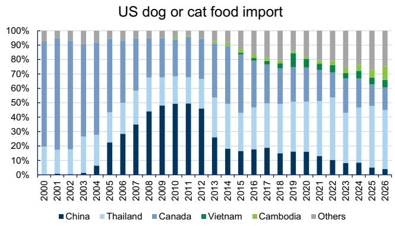

bar_stacked

| Year | China | Thailand | Canada | Vietnam | Cambodia | Others |
|------|-------|----------|--------|---------|----------|--------|
| 2000 | 0%    | 20%      | 30%    | 0%      | 0%       | 0%     |
| 2001 | 0%    | 18%      | 35%    | 0%      | 0%       | 0%     |
| 2002 | 0%    | 17%      | 34%    | 0%      | 0%       | 0%     |
| 2003 | 0%    | 16%      | 33%    | 0%      | 0%       | 0%     |
| 2004 | 5%    | 15%      | 32%    | 0%      | 0%       | 0%     |
| 2005 | 20%   | 14%      | 31%    | 0%      | 0%       | 0%     |
| 2006 | 28%   | 13%      | 30%    | 0%      | 0%       | 0%     |
| 2007 | 35%   | 12%      | 29%    | 0%      | 0%       | 0%     |
| 2008 | 42%   | 11%      | 28%    | 0%      | 0%       | 0%     |
| 2009 | 48%   | 10%      | 27%    | 0%      | 0%       | 0%     |
| 2010 | 49%   | 9%       | 26%    | 0%      | 0%       | 0%     |
| 2011 | 48%   | 8%       | 25%    | 0%      | 0%       | 0%     |
| 2012 | 45%   | 7%       | 24%    | 0%      | 0%       | 0%     |
| 2013 | 25%   | 6%       | 23%    | 0%      | 0%       | 0%     |
| 2014 | 18%   | 5%       | 22%    | 0%      | 0%       | 0%     |
| 2015 | 16%   | 4%       | 21%    | 5%      | 0%       | 5%     |
| 2016 | 17%   | 3%       | 20%    | 5%      | 5%       | 5%     |
| 2017 | 18%   | 2%       | 19%    | 5%      | 5%       | 5%     |
| 2018 | 16%   | 1%       | 18%    | 5%      | 5%       | 5%     |
| 2019 | 15%   | 1        | 17%    | 5%      | 5%       | 5%     |
| 2020 | 14%   | 1        | 16%    | 5%      | 5%       | 5%     |
| 2021 | 13%   | 1        | 15%    | 5%      | 5%       | 5%     |
| 2022 | 11%   | 1        | 14%    | 5%      | 5%       | 5%     |
| 2023 | 9%    | 1        | 13%    | 5%      | 5%       | 5%     |
| 2024 | 8%    | 1        | 12%    | 5%      | 5%       | 5%     |
| 2025 | 6%    | 1        | 11%    | 5%      | 5%       | 5%     |
| 2026 | 4%    | 1        | 10%    | 5%      | 5%       | 5%     |
The chart displays the percentage of U.S. dog or cat food imports by country over time from approximately year '0' to '26'. The data is already in English. There are no labels for the data series. The values are estimated based on the provided code.

CIF imported value; 2026 refers to Jan-Mar   
Source: Dataweb US, Data compiled by GS Global Investment Research

# GS proprietary cost index

Exhibit 22: Cost index - pet food   
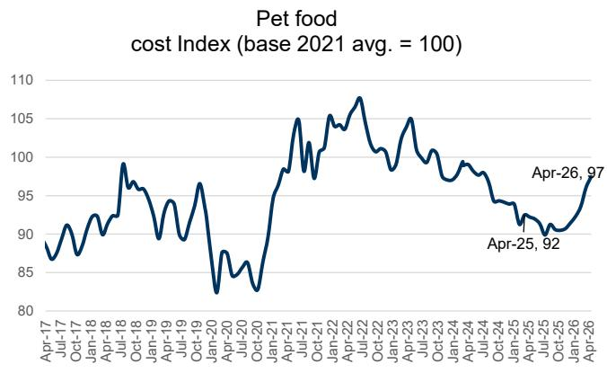

line

| Date     | Pet food cost index |
| -------- | ------------------- |
| Apr-25   | 92                  |
| Apr-26   | 97                  |

Source: Wind, Bloomberg, GS Global Investment Research

Exhibit 21: Total US dog or cat food imports/imports via China were down 5%/27% yoy in Mar vs +3%/-46% in Feb   
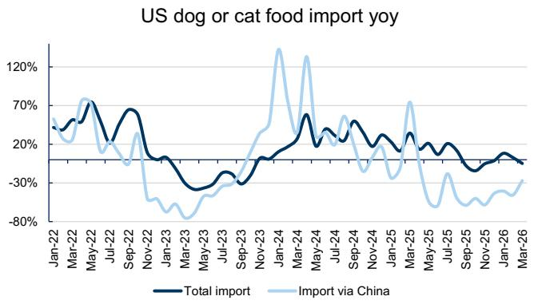

line

| Month    | Total import | Import via China |
| -------- | ------------ | ---------------- |
| Jan-22   | ~50%         | ~60%             |
| Mar-22   | ~70%         | ~70%             |
| May-22   | ~60%         | ~80%             |
| Jul-22   | ~70%         | ~20%             |
| Sep-22   | ~60%         | ~-30%            |
| Nov-22   | ~-10%        | ~-70%            |
| Jan-23   | ~-20%        | ~-80%            |
| Mar-23   | ~-30%        | ~-60%            |
| May-23   | ~-30%        | ~-70%            |
| Jul-23   | ~-30%        | ~-60%            |
| Sep-23   | ~-30%        | ~-50%            |
| Nov-23   | ~-30%        | ~-40%            |
| Jan-24   | ~-20%        | ~120%            |
| Mar-24   | ~+10%        | ~110%            |
| May-24   | ~+10%        | ~+10%            |
| Jul-24   | ~+10%        | ~+10%            |
| Sep-24   | ~+10%        | ~+10%            |
| Nov-24   | ~+10%        | ~+10%            |
| Jan-25   | ~+10%        | ~+10%            |
| Mar-25   | ~+10%        | ~+10%            |
| May-25   | ~+10%        | ~+10%            |
| Jul-25   | ~+10%        | ~+10%            |
| Sep-25   | ~+10%        | ~+10%            |
| Nov-25   | ~+10%        | ~+10%            |
| Jan-26   | ~+10%        | ~+10%            |
| Mar-26   | ~+10%        | ~+10%            |

Source: Dataweb US, Data compiled by GS Global Investment Research

Exhibit 23: Raw materials contribution to unit COGS - pet food 

<table><tr><td>Pet</td><td>China Pet Foods</td><td>Petpal</td><td colspan="2">Spot price Gambol vs. 2025 avg.</td></tr><tr><td>Materials as a % of COGS</td><td>72%</td><td>72%</td><td>82%</td><td></td></tr><tr><td>Rawhide as % of COGS</td><td>4%</td><td>22%</td><td>3%</td><td>0%</td></tr><tr><td>Chicken (Global)</td><td>8%</td><td>14%</td><td>0%</td><td>-2%</td></tr><tr><td>Chicken</td><td>12%</td><td>14%</td><td>14%</td><td>5%</td></tr><tr><td>Duck</td><td>9%</td><td>na</td><td>4%</td><td>-5%</td></tr><tr><td>Starch</td><td>na</td><td>3%</td><td>0%</td><td>7%</td></tr><tr><td>Corn</td><td>2%</td><td>na</td><td>2%</td><td>6%</td></tr><tr><td>Oil</td><td>2%</td><td>1%</td><td>0%</td><td>2%</td></tr><tr><td>PET</td><td>5%</td><td>5%</td><td>6%</td><td>47%</td></tr><tr><td>Others</td><td>21%</td><td>7%</td><td>52%</td><td>0%</td></tr><tr><td>2026E raw materials contribution to unit COGS</td><td>2.2%</td><td>2.9%</td><td>3.3%</td><td></td></tr><tr><td>YoY changes in GPM</td><td>-1.6%</td><td>-2.0%</td><td>-2.3%</td><td></td></tr><tr><td>GS estimate GPM change 2026</td><td>-0.2%</td><td>1.7%</td><td>-2.4%</td><td></td></tr></table>

GPM is using overseas segment GPM.   
Source: Company data, GS Global Investment Research, NBS, Bloomberg, Wind

Exhibit 24: Domestic GPM vs chicken price correlation is at 0.78   
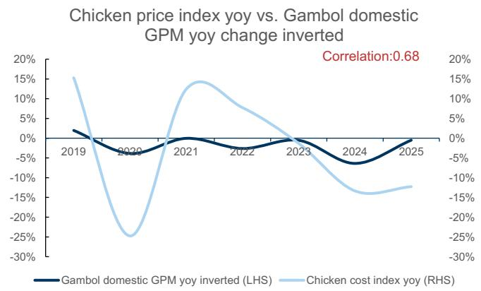

line

| Year | Gambol domestic GPM yoy inverted (LHS) | Chicken cost index yoy (RHS) |
|------|----------------------------------------|------------------------------|
| 2019 | ~2%                                    | ~15%                         |
| 2020 | ~-5%                                   | ~-25%                        |
| 2021 | ~0%                                    | ~15%                         |
| 2022 | ~-5%                                   | ~5%                          |
| 2023 | ~0%                                    | ~-10%                        |
| 2024 | ~-10%                                  | ~-15%                        |
| 2025 | ~0%                                    | ~-10%                        |

Source: Wind, Company data, GS Global Investment Research

Exhibit 25: Chicken price increased slightly in 2Q26   
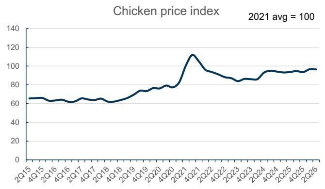

line

| Quarter | Chicken Price Index |
| ------- | ------------------- |
| 2Q15    | 65                  |
| 4Q15    | 65                  |
| 2Q16    | 65                  |
| 4Q16    | 65                  |
| 2Q17    | 65                  |
| 4Q17    | 65                  |
| 2Q18    | 65                  |
| 4Q18    | 65                  |
| 2Q19    | 70                  |
| 4Q19    | 75                  |
| 2Q20    | 75                  |
| 4Q20    | 80                  |
| 2Q21    | 110                 |
| 4Q21    | 115                 |
| 2Q22    | 95                  |
| 4Q22    | 90                  |
| 2Q23    | 85                  |
| 4Q23    | 85                  |
| 2Q24    | 90                  |
| 4Q24    | 95                  |
| 2Q25    | 95                  |
| 4Q25    | 95                  |
| 2Q26    | 95                  |

2Q26 refers to April 2026   
Source: Wind, Data compiled by GS Global Investment Research

Exhibit 26: USD/CNY trending down in Apr 26   
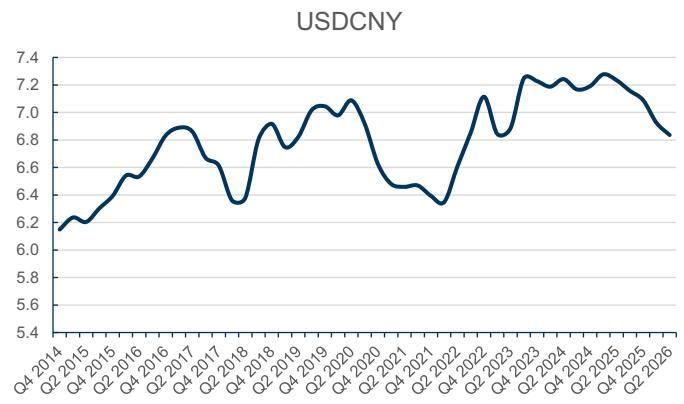

line

| Quarter    | Value |
| ---------- | ----- |
| Q4 2014    | 6.2   |
| Q1 2015    | 6.3   |
| Q2 2015    | 6.4   |
| Q3 2015    | 6.5   |
| Q4 2015    | 6.6   |
| Q1 2016    | 6.7   |
| Q2 2016    | 6.8   |
| Q3 2016    | 6.9   |
| Q4 2016    | 7.0   |
| Q1 2017    | 6.9   |
| Q2 2017    | 6.8   |
| Q3 2017    | 6.7   |
| Q4 2017    | 6.6   |
| Q1 2018    | 6.5   |
| Q2 2018    | 6.4   |
| Q3 2018    | 6.3   |
| Q4 2018    | 6.4   |
| Q1 2019    | 6.5   |
| Q2 2019    | 6.6   |
| Q3 2019    | 6.7   |
| Q4 2019    | 6.8   |
| Q1 2020    | 6.9   |
| Q2 2020    | 7.0   |
| Q3 2020    | 7.1   |
| Q4 2020    | 7.0   |
| Q1 2021    | 6.9   |
| Q2 2021    | 6.8   |
| Q3 2021    | 6.7   |
| Q4 2021    | 6.6   |
| Q1 2022    | 6.5   |
| Q2 2022    | 6.4   |
| Q3 2022    | 6.3   |
| Q4 2022    | 6.4   |
| Q1 2023    | 6.5   |
| Q2 2023    | 6.6   |
| Q3 2023    | 6.7   |
| Q4 2023    | 6.8   |
| Q1 2024    | 6.9   |
| Q2 2024    | 7.0   |
| Q3 2024    | 7.1   |
| Q4 2024    | 7.0   |
| Q1 2025    | 6.9   |
| Q2 2025    | 6.8   |
| Q3 2025    | 6.7   |
| Q4 2025    | 6.6   |
| Q1 2026    | 6.5   |
| Q2 2026    | 6.4   |

2Q26 as of May 8, 2026   
Source: Datastream

Exhibit 27: Cost of pet food trended higher in Apr, with higher chicken/PET/starch prices
Cost index vs. GPM & sales growth - pet food 

<table><tr><td>Pet</td><td>1Q21</td><td>2Q21</td><td>3Q21</td><td>4Q21</td><td>1Q22</td><td>2Q22</td><td>3Q22</td><td>4Q22</td><td>1Q23</td><td>2Q23</td><td>3Q23</td><td>4Q23</td><td>1Q24</td><td>2Q24</td><td>3Q24</td><td>4Q24</td><td>1Q25</td><td>2Q25</td><td>3Q25</td><td>4Q25</td><td>1Q26</td><td>2Q26</td><td>Recent MOM</td></tr><tr><td colspan="24">Cost index yoy</td></tr><tr><td>China Pet Foods</td><td>12%</td><td>14%</td><td>13%</td><td>14%</td><td>4%</td><td>8%</td><td>7%</td><td>3%</td><td>2%</td><td>-3%</td><td>-3%</td><td>-4%</td><td>-4%</td><td>-5%</td><td>-4%</td><td>-2%</td><td>-6%</td><td>-5%</td><td>-5%</td><td>-4%</td><td>2%</td><td>8%</td><td>2.1%</td></tr><tr><td>Petpal</td><td>16%</td><td>27%</td><td>21%</td><td>27%</td><td>15%</td><td>3%</td><td>2%</td><td>-7%</td><td>-6%</td><td>-6%</td><td>0%</td><td>0%</td><td>0%</td><td>-1%</td><td>-3%</td><td>-3%</td><td>-6%</td><td>-7%</td><td>-7%</td><td>-2%</td><td>2%</td><td>7%</td><td>1.8%</td></tr><tr><td>Gambol</td><td>9%</td><td>12%</td><td>13%</td><td>14%</td><td>5%</td><td>6%</td><td>5%</td><td>0%</td><td>1%</td><td>-4%</td><td>-5%</td><td>-6%</td><td>-6%</td><td>-6%</td><td>-5%</td><td>-3%</td><td>-6%</td><td>-5%</td><td>-5%</td><td>-3%</td><td>2%</td><td>6%</td><td>2.2%</td></tr><tr><td colspan="24">GPM yoy change</td></tr><tr><td>China Pet Foods</td><td></td><td>-1%</td><td></td><td>-6%</td><td></td><td>-4%</td><td></td><td>2%</td><td></td><td>7%</td><td></td><td>8%</td><td></td><td>-22%</td><td></td><td>-28%</td><td></td><td></td><td></td><td></td><td></td><td></td><td></td></tr><tr><td>Petpal</td><td></td><td>3%</td><td></td><td>-6%</td><td></td><td>0%</td><td></td><td>-3%</td><td></td><td>-9%</td><td></td><td>4%</td><td></td><td>12%</td><td></td><td>11%</td><td></td><td></td><td></td><td></td><td></td><td></td><td></td></tr><tr><td rowspan="6">Sales growth yoy 1Q21 2Q21 3Q21 4Q21 1Q22 2Q22 3Q22 4Q22 1Q23 2Q23 3Q23 4Q23 1Q24 2Q24 3Q24 4Q24 1Q25 2Q25 3Q25 4Q25 1Q26 2Q26 China Pet Foods 50% 13% 19% 42% 42% 14% 13%-7%-11%-27%-17%-28%-7%-7%-7%-7%-7%-7%-7%-7%-7%-7%-7%-7%-7%-7%-7%-7%-7%-7%-7%-7%-7%-7%-7%-7%-7%-7%-7%-7%-7%-7%-7%-7%-7%-7%-7%-7%-7%-7%-7%-7%-7%-7%-7%-7%-7%-7%-7%-7%-7%-7%-</td><td rowspan="6"></td><td rowspan="6"></td><td rowspan="6"></td><td rowspan="6"></td><td rowspan="6"></td><td rowspan="6"></td><td rowspan="6"></td><td rowspan="6"></td><td rowspan="6"></td><td rowspan="6"></td><td rowspan="6"></td><td rowspan="6"></td><td rowspan="6"></td><td rowspan="6"></td><td rowspan="6"></td><td rowspan="6"></td><td rowspan="6"></td><td rowspan="6"></td><td rowspan="6"></td><td rowspan="6"></td><td rowspan="6"></td><td rowspan="6"></td><td rowspan="5"></td></tr><tr></tr><tr></tr><tr></tr><tr></tr><tr><td></td></tr></table>

Both China Pet Foods and Petpal show overseas segment cost index and overseas segment GPM YoY change. 2Q26 data is from GSe. PET data updated in Apr 2026.   
Source: Company data, GS Global Investment Research

# Price Target Risks and Methodology - China Pet Foods

Valuation methodology: We are Neutral rated on China Pet Foods. Our 12m TP of Rmb36 is based on SOTP: 1) the domestic business valued at a 30X 2027E P/E discounted back to 2026 at a 7.9% COE, and 2) the overseas business at 20x P/E on 2026E earnings.

Key downside risks: 1) Faster/Slower-than-expected domestic revenue growth; 2) Food

safety issues; 3) Forex fluctuations; 4) Freight and raw material costs.

# Price Target Risks & Methodology - Gambol Pet Group

Valuation methodology: We are Neutral rated on Gambol Pet. Our 12m TP of Rmb66 is based on SOTP, with 1) the domestic business valued at a 33X 2027E P/E discounted back to 2026 at a 7.0% COE, and 2) the overseas business at 10X P/E on 2026E earnings.

Key risks: 1) More/less favorable exchange rates, freight and input prices impacting overseas business; 2) More/less intense competition in the online channel; 3) Better-/worse-than-expected execution of domestic brand building and channel expansion.

# Price Target Risks and Methodology - Petpal Pet Nutrition Technology

Valuation methodology: We are Sell rated on Petpal. Our 12m TP of Rmb12.7 is based on SOTP: 1) the domestic business valued at a 26X 2027E P/E discounted back to 2026 at a 6.9% COE, and 2) the overseas business at 16X P/E on 2026E earnings.

Key risks: 1) Less intense competition in the overseas business; 2) Risks of order changes/receivables collection from large clients; 3) Better-than-expected execution of domestic brand building and channel expansion; 4) Lower tariffs on pet food exports from China to the US: Reduction on tariffs could improve the bottom-line and margins of the business.

# Disclosure Appendix

# Reg AC

We, Valerie Zhou, Leaf Liu and Christina Liu, hereby certify that all of the views expressed in this report accurately reflect our personal views about the subject company or companies and its or their securities. We also certify that no part of our compensation was, is or will be, directly or indirectly, related to the specific recommendations or views expressed in this report.

Unless otherwise stated, the individuals listed on the cover page of this report are analysts in GS' Global Investment Research division.

Contributing Authors: Valerie Zhou GS (Asia) L.L.C., Leaf Liu GS (Asia) L.L.C., Christina Liu GS (Asia) L.L.C..

Unless otherwise stated, the individuals listed in the Contributing Authors disclosure of this report are analysts in GS' Global Investment Research division.

# GS Factor Profile

The GS Factor Profile provides investment context for a stock by comparing key attributes to the market (i.e. our universe of rated stocks) and its sector peers. The four key attributes depicted are: Growth, Financial Returns, Multiple (e.g. valuation) and Integrated (a composite of Growth, Financial Returns and Multiple). Growth, Financial Returns and Multiple are calculated by using normalized ranks for specific metrics for each stock. The normalized ranks for the metrics are then averaged and converted into percentiles for the relevant attribute. The precise calculation of each metric may vary depending on the fiscal year, industry and region, but the standard approach is as follows:

Growth is based on a stock's forward-looking sales growth, EBITDA growth and EPS growth (for financial stocks, only EPS and sales growth), with a higher percentile indicating a higher growth company. Financial Returns is based on a stock's forward-looking ROE, ROCE and CROCI (for financial stocks, only ROE), with a higher percentile indicating a company with higher financial returns. Multiple is based on a stock's forward-looking P/E, P/B, price/dividend (P/D), EV/EBITDA, EV/FCF and EV/Debt Adjusted Cash Flow (DACF) (for financial stocks, only P/E, P/B and P/D), with a higher percentile indicating a stock trading at a higher multiple. The Integrated percentile is calculated as the average of the Growth percentile, Financial Returns percentile and (100% - Multiple percentile).

Financial Returns and Multiple use the GS analyst forecasts at the fiscal year-end at least three quarters in the future. Growth uses inputs for the fiscal year at least seven quarters in the future compared with the year at least three quarters in the future (on a per-share basis for all metrics).

For a more detailed description of how we calculate the GS Factor Profile, please contact your GS representative.

# M&A Rank

Across our global coverage, we examine stocks using an M&A framework, considering both qualitative factors and quantitative factors (which may vary across sectors and regions) to incorporate the potential that certain companies could be acquired. We then assign a M&A rank as a means of scoring companies under our rated coverage from 1 to 3, with 1 representing high (30%-50%) probability of the company becoming an acquisition target, 2 representing medium (15%-30%) probability and 3 representing low (0%-15%) probability. For companies ranked 1 or 2, in line with our standard departmental guidelines we incorporate an M&A component into our target price. M&A rank of 3 is considered immaterial and therefore does not factor into our price target, and may or may not be discussed in research.

# Quantum

Quantum is GS' proprietary database providing access to detailed financial statement histories, forecasts and ratios. It can be used for in-depth analysis of a single company, or to make comparisons between companies in different sectors and markets.

# Disclosures

The rating(s) for China Pet Foods, Gambol Pet Group Co. and Petpal Pet Nutrition Technology is/are relative to the other companies in its/their coverage universe: Angel Yeast, Anjoy Foods Group (A), Anjoy Foods Group (H), Bloomage Biotechnology Corp., Botanee Biotech, Chacha Food Co., China Pet Foods, Gambol Pet Group Co., Giant Biogene Holding, Henan Shuanghui Ltd., Ligao Foods, Mao Geping Cosmetics Co., Petpal Pet Nutrition Technology, Proya Cosmetics, Qianweiyangchu, Sanquan Foods, Shanghai Forest Cabin Cosmetics, Shanghai Jahwa United, Three Squirrels, WH Group, Want Want China, Weilong Delicious Global Holdings, Yankershop Food

# Company-specific regulatory disclosures

The following disclosures relate to relationships between The GS Group, Inc. (with its affiliates, “GS”) and companies covered by GS Global Investment Research and referred to in this research.

GS expects to receive or intends to seek compensation for investment banking services in the next 3 months: Gambol Pet Group Co. (Rmb50.62)

GS had an investment banking services client relationship during the past 12 months with: Gambol Pet Group Co. (Rmb50.62)

There are no company-specific disclosures for: China Pet Foods (Rmb32.89) and Petpal Pet Nutrition Technology (Rmb16.11)

# Distribution of ratings/investment banking relationships

GS Investment Research global Equity coverage universe

<table><tr><td rowspan="2"></td><td colspan="3">Rating Distribution</td><td colspan="3">Investment Banking Relationships</td></tr><tr><td>Buy</td><td>Hold</td><td>Sell</td><td>Buy</td><td>Hold</td><td>Sell</td></tr><tr><td>Global</td><td>50%</td><td>34%</td><td>16%</td><td>65%</td><td>60%</td><td>45%</td></tr></table>

As of April 1, 2026, GS Global Investment Research had investment ratings on 3,074 equity securities. GS assigns stocks as Buys and Sells on various regional Investment Lists; stocks not so assigned are deemed Neutral. Such assignments equate to Buy, Hold and Sell for the purposes of the above disclosure required by the FINRA Rules. See ‘Ratings, Coverage universe and related definitions’ below. The Investment Banking Relationships chart reflects the percentage of subject companies within each rating category for whom GS has provided investment banking services within the previous twelve months.

# Price target and rating history chart(s)

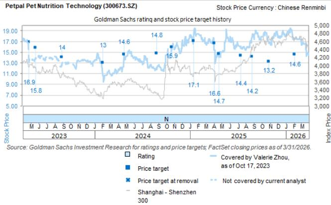

line

| Date       | Stock Price | Rating | Price Target | Price Target at Removal | Not Covered by Current Analyst | Shanghai - Shenzhen |
|------------|-------------|--------|--------------|--------------------------|-------------------------------|----------------------|
| Mar 2023   | 16.9        | 15.8   | 16.9         | —                        | —                             | —                    |
| Jun 2023   | 15.8        | —      | 15.8         | —                        | —                             | —                    |
| Sep 2023   | 14          | —      | 14           | —                        | —                             | —                    |
| Dec 2023   | 13          | —      | 13           | —                        | —                             | —                    |
| Mar 2024   | 14.6        | —      | 14.6         | —                        | —                             | —                    |
| Jun 2024   | 14.8        | —      | 14.8         | —                        | —                             | —                    |
| Sep 2024   | 15.9        | —      | 15.9         | —                        | —                             | —                    |
| Dec 2024   | 17.1        | —      | 17.1         | —                        | —                             | —                    |
| Mar 2025   | 16.6        | —      | 16.6         | —                        | —                             | —                    |
| Jun 2025   | 14.7        | —      | 14.7         | —                        | —                             | —                    |
| Sep 2025   | 14.4        | —      | 14.4         | —                        | —                             | —                    |
| Dec 2025   | 14.2        | —      | 14.2         | —                        | —                             | —                    |
| Mar 2026   | 13.2        | —      | 13.2         | —                        | —                             | —                    |
| Jun 2026   | 14.6        | —      | 14.6         | —                        | —                             | —                    |
Source: GS Investment Research for ratings and price targets; FactSet closing prices as of 3/31/2026.

The price targets shown should be considered in the context of all prior published GS, which may or may not have included price targets, as well as developments relating to the company, its industry and financial markets.

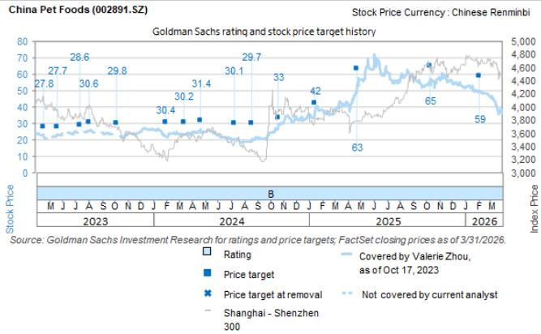

line

| Date       | Stock Price | Rating | Price Target | Price Target at Removal | Not Covered by Current Analyst |
|------------|-------------|--------|--------------|--------------------------|-------------------------------|
| 2023 M     | 27.8        | 27.8   | 27.7         | —                        | —                             |
| 2023 J     | 28.6        | —      | —            | —                        | —                             |
| 2023 A     | 30.6        | —      | —            | —                        | —                             |
| 2023 S     | 29.8        | —      | —            | —                        | —                             |
| 2023 O     | —           | —      | —            | —                        | —                             |
| 2023 N     | —           | —      | —            | —                        | —                             |
| 2023 D     | —           | —      | —            | —                        | —                             |
| 2024 J     | 30.4        | —      | —            | —                        | —                             |
| 2024 F     | 30.2        | —      | —            | —                        | —                             |
| 2024 M     | 31.4        | —      | —            | —                        | —                             |
| 2024 A     | 30.1        | —      | —            | —                        | —                             |
| 2024 M     | 29.7        | —      | —            | —                        | —                             |
| 2024 J     | 33          | —      | —            | —                        | —                             |
| 2024 A     | 42          | —      | —            | —                        | —                             |
| 2024 S     | 63          | —      | —            | —                        | —                             |
| 2024 O     | —           | —      | —            | —                        | —                             |
| 2024 N     | 65          | —      | —            | —                        | —                             |
| 2024 D     | —           | —      | —            | —                        | —                             |
| 2025 J     | 59          | —      | —            | —                        | —                             |
| 2025 F     | —           | —      | —            | —                        | —                             |
| 2025 M     | —           | —      | —            | —                        | —                             |
| 2025 A     | —           | —      | —            | —                        | —                             |
| 2025 M     | —           | —      | —            | —                        | —                             |
| 2025 J     | —           | —      | —            | —                        | —                             |
| 2025 A     | —           | —      | —            | —                        | —                             |
| 2025 S     | —           | —      | —            | —                        | —                             |
| 2025 O     | —           | —      | —            | —                        | —                             |
| 2025 N     | —           | —      | —            | —                        | —                             |
| 2025 D     | —           | —      | —            | —                        | —                             |
| 2026 J     | —           | —      | —            | —                        | —                             |
| 2026 F     | —           | —      | —            | —                        | —                             |
| 2026 M     | 59          | —      | —            | —                        | —                             |
| 2026 M     | 59          | —      | —            | —                        | —                             |
| 2026 N     | 59          | —      | —            | —                        | —                             |
| 2026 D     | 59          | —      | —            | —                        | —                             |
| 2026 M     | 59          | —      | —            | —                        | —                             |
| 2026 N     | 59          | —      | —            | —                        | —                             |
| 2026 D     | 59          | —      | —            | —                        | —                             |
| 1    1      | 59          | -      | -            | -                        | -                             |
| 1    1      (Covered by Valerie Zhou, as of Oct 17, 2023) - Shanghai - Shenzhen 300 - Not covered by current analyst - Shenzhen - Shenzhen<lcel><lcel><lcel><lcel><lcel><lcel><nl>

The price targets shown should be considered in the context of all prior published GS, which may or may not have included price targets, as well as developments relating to the company, its industry and financial markets.

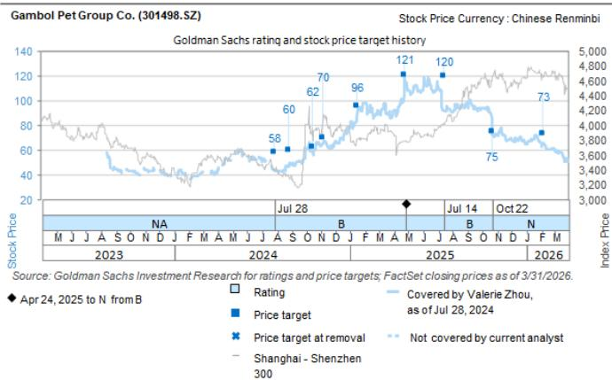  
The price targets shown should be considered in the context of all prior published GS, which may or may not have included price targets, as well as developments relating to the company, its industry and financial markets.

# Target price history table(s)

Gambol Pet Group Co. (301498.SZ) 

<table><tr><td>Date of report</td><td>Target price (Rmb)</td><td>Closing price (Rmb)</td></tr><tr><td>22-Apr-26</td><td>66.00</td><td>58.13</td></tr><tr><td>06-Feb-26</td><td>73.00</td><td>65.79</td></tr><tr><td>22-Oct-25</td><td>75.00</td><td>85.59</td></tr><tr><td>14-Jul-25</td><td>120.00</td><td>92.10</td></tr><tr><td>25-Apr-25</td><td>121.00</td><td>113.69</td></tr><tr><td>16-Jan-25</td><td>96.00</td><td>87.60</td></tr><tr><td>06-Nov-24</td><td>70.00</td><td>65.18</td></tr><tr><td>14-Oct-24</td><td>62.00</td><td>58.60</td></tr><tr><td>26-Aug-24</td><td>60.00</td><td>48.00</td></tr><tr><td>28-Jul-24</td><td>58.00</td><td>44.00</td></tr></table>

Petpal Pet Nutrition Technology (300673.SZ) 

<table><tr><td>Date of report</td><td>Target price (Rmb)</td><td>Closing price (Rmb)</td></tr><tr><td>28-Apr-26</td><td>12.70</td><td>15.67</td></tr><tr><td>06-Feb-26</td><td>14.60</td><td>17.51</td></tr><tr><td>29-Oct-25</td><td>13.20</td><td>16.93</td></tr><tr><td>26-Aug-25</td><td>14.20</td><td>17.80</td></tr><tr><td>14-Jul-25</td><td>14.40</td><td>16.08</td></tr><tr><td>21-Apr-25</td><td>14.70</td><td>14.23</td></tr><tr><td>04-Apr-25</td><td>16.60</td><td>15.42</td></tr><tr><td>16-Jan-25</td><td>17.10</td><td>18.29</td></tr><tr><td>23-Oct-24</td><td>15.90</td><td>15.42</td></tr><tr><td>27-Aug-24</td><td>14.80</td><td>11.75</td></tr><tr><td>24-Apr-24</td><td>14.60</td><td>14.54</td></tr><tr><td>02-Feb-24</td><td>13.00</td><td>10.56</td></tr><tr><td>30-Aug-23</td><td>14.00</td><td>12.55</td></tr><tr><td>22-May-23</td><td>15.80</td><td>13.89</td></tr></table>

China Pet Foods (002891.SZ) 

<table><tr><td>Date of report</td><td>Target price (Rmb)</td><td>Closing price (Rmb)</td></tr><tr><td>28-Apr-26</td><td>36.00</td><td>34.44</td></tr><tr><td>16-Apr-26</td><td>57.00</td><td>42.00</td></tr><tr><td>06-Feb-26</td><td>59.00</td><td>49.41</td></tr><tr><td>13-Oct-25</td><td>65.00</td><td>56.68</td></tr><tr><td>25-Apr-25</td><td>63.00</td><td>54.20</td></tr><tr><td>16-Jan-25</td><td>42.00</td><td>36.32</td></tr><tr><td>22-Oct-24</td><td>33.00</td><td>29.76</td></tr><tr><td>20-Aug-24</td><td>29.70</td><td>19.49</td></tr><tr><td>10-Jul-24</td><td>30.10</td><td>20.31</td></tr><tr><td>23-Apr-24</td><td>31.40</td><td>24.27</td></tr><tr><td>14-Mar-24</td><td>30.20</td><td>22.99</td></tr><tr><td>31-Jan-24</td><td>30.40</td><td>22.25</td></tr><tr><td>08-Oct-23</td><td>29.80</td><td>-</td></tr><tr><td>04-Aug-23</td><td>30.60</td><td>25.54</td></tr><tr><td>14-Jul-23</td><td>28.60</td><td>24.40</td></tr><tr><td>22-May-23</td><td>27.70</td><td>22.99</td></tr></table>

Price targets shown in table(s) are unadjusted for corporate actions.

# Regulatory disclosures

# Disclosures required by United States laws and regulations

See company-specific regulatory disclosures above for any of the following disclosures required as to companies referred to in this report: manager or co-manager in a pending transaction; 1% or other ownership; compensation for certain services; types of client relationships; managed/co-managed public offerings in prior periods; directorships; for equity securities, market making and/or specialist role. GS trades or may trade as a principal in debt securities (or in related derivatives) of issuers discussed in this report.

The following are additional required disclosures: Ownership and material conflicts of interest: GS policy prohibits its analysts, professionals reporting to analysts and members of their households from owning securities of any company in the analyst's area of coverage. Analyst compensation: Analysts are paid in part based on the profitability of GS, which includes investment banking revenues. Analyst as officer or director: GS policy generally prohibits its analysts, persons reporting to analysts or members of their households from serving as an officer, director or advisor of any company in the analyst's area of coverage. Non-U.S. Analysts: Non-U.S. analysts may not be associated persons of GS & Co. LLC and therefore may not be subject to FINRA Rule 2241 or FINRA Rule 2242 restrictions on communications with a subject company, public appearances and trading in securities covered by the analysts.

Distribution of ratings: See the distribution of ratings disclosure above. Price chart: See the price chart, with changes of ratings and price targets in prior periods, above, or, if electronic format or if with respect to multiple companies which are the subject of this report, on the GS website at https://www.gs.com/research/hedge.html.

# Additional disclosures required under the laws and regulations of jurisdictions other than the United States

The following disclosures are those required by the jurisdiction indicated, except to the extent already made above pursuant to United States laws and regulations. Australia: GS Australia Pty Ltd and its affiliates are not authorised deposit-taking institutions (as that term is defined in the Banking Act 1959 (Cth)) in Australia and do not provide banking services, nor carry on a banking business, in Australia. This research, and any access to it, is intended only for “wholesale clients” within the meaning of the Australian Corporations Act, unless otherwise agreed by GS. In producing research reports, members of Global Investment Research of GS Australia may attend site visits and other meetings hosted by the companies and other entities which are the subject of its research reports. In some instances the costs of such site visits or meetings may be met in part or in whole by the issuers concerned if GS Australia considers it is appropriate and reasonable in the specific circumstances relating to the site visit or meeting. To the extent that the contents of this document contains any financial product advice, it is general advice only and has been prepared by GS without taking into account a client’s objectives, financial situation or needs. A client should, before acting on any such advice, consider the appropriateness of the advice having regard to the client’s own objectives, financial situation and needs. A copy of certain GS Australia and New Zealand disclosure of interests and a copy of GS’ Australian Sell-Side Research Independence Policy Statement are available at: https://www.goldmansachs.com/disclosures/australia-new-zealand/index.html. Brazil: Disclosure information in relation to CVM Resolution n. 20 is available at https://www.gs.com/worldwide/brazil/area/gir/index.html. Where applicable, the Brazil-registered analyst primarily responsible for the content of this research report, as defined in Article 20 of CVM Resolution n. 20, is the first author named at the beginning of this report, unless indicated otherwise at the end of the text. Canada: This information is being provided to you for information purposes only and is not, and under no circumstances should be construed as, an advertisement, offering or solicitation by GS & Co. LLC for purchasers of securities in Canada to trade in any Canadian security. GS & Co. LLC is not registered as a dealer in any jurisdiction in Canada under applicable Canadian securities laws and generally is not permitted to trade in Canadian securities and may be prohibited from selling certain securities and products in certain jurisdictions in Canada. If you wish to trade in any Canadian securities or other products in Canada please contact GS Canada Inc., an affiliate of The GS Group Inc., or another registered Canadian dealer. Hong Kong: Further information on the securities of covered companies referred to in this research may be obtained on request from GS (Asia) L.L.C. India: Further information on the subject company or companies referred to in this research may be obtained from GS (India) Securities Private Limited, Research Analyst - SEBI Registration Number INH000001493, 10th Floor, Ascent-Worli, Sudam Kalu Ahire Marg, Worli, Mumbai-400 025, India, Corporate Identity Number U74140MH2006FTC160634, Phone +91 22 6616 9000, Fax +91 22 6616 9001. GS may beneficially own 1% or more of the securities (as such term is defined in clause 2 (h) the Indian Securities Contracts (Regulation) Act, 1956) of the subject company or companies referred to in this research report. Investment in securities market are subject to market risks. Read all the related documents carefully before investing. Registration granted by SEBI and certification from NISM in no way guarantee performance of the intermediary or provide any assurance of returns to investors. GS (India) Securities Private Limited compliance officer and investor grievance contact details can be found at: https://www.goldmansachs.com/worldwide/india/documents/Grievance-Redressal-and-Escalation-Matrix.pdf, and a copy of the annual audit compliance report can be found at this link: https://publishing.gs.com/content/site/india-annual-compliance-report.html. Japan: See below. Korea: This research, and any access to it, is intended only for “professional investors” within the meaning of the Financial Services and Capital Markets Act, unless otherwise agreed by GS. Further information on the subject company or companies referred to in this research may be obtained from GS (Asia) L.L.C., Seoul Branch. New Zealand: GS New Zealand Limited and its affiliates are neither “registered banks” nor “deposit takers” (as defined in the Reserve Bank of New Zealand Act 1989) in New Zealand. This research, and any access to it, is intended for “wholesale clients” (as defined in the Financial Advisers Act 2008) unless otherwise agreed by GS. A copy of certain GS Australia and New Zealand disclosure of interests is available at: https://www.goldmansachs.com/disclosures/australia-new-zealand/index.html. Russia: Research reports distributed in the Russian Federation are not advertising as defined in the Russian legislation, but are information and analysis not having product promotion as their main purpose and do not provide appraisal within the meaning of the Russian legislation on appraisal activity. Research reports do not constitute a personalized investment recommendation as defined in Russian laws and regulations, are not addressed to a specific client, and are prepared without analyzing the financial circumstances, investment profiles or risk profiles of clients. GS assumes no responsibility for any investment decisions that may be taken by a client or any other person based on this research report. Singapore: GS (Singapore) Pte. (Company Number: 198602165W), which is regulated by the Monetary Authority of Singapore, accepts legal responsibility for this research, and should be contacted with respect to any matters arising from, or in connection with, this research. Taiwan: This material is for reference only and must not be reprinted without permission. Investors should carefully consider their own investment risk. Investment results are the responsibility of the individual investor. United Kingdom: Persons who would be categorized as retail clients in the United Kingdom, as such term is defined in the rules of the Financial Conduct Authority, should read this research in conjunction with prior GS on the covered companies referred to herein and should refer to the risk warnings that have been sent to them by GS International. A copy of these risks warnings, and a glossary of certain financial terms used in this report, are available from GS International on request.

European Union and United Kingdom: Disclosure information in relation to Article 6 (2) of the European Commission Delegated Regulation (EU) (2016/958) supplementing Regulation (EU) No 596/2014 of the European Parliament and of the Council (including as that Delegated Regulation is implemented into United Kingdom domestic law and regulation following the United Kingdom's departure from the European Union and the European Economic Area) with regard to regulatory technical standards for the technical arrangements for objective presentation of investment recommendations or other information recommending or suggesting an investment strategy and for disclosure of particular interests or indications of conflicts of interest is available at https://www.gs.com/disclosures/europeanpolicy.html which states the European Policy for Managing Conflicts of Interest in Connection with Investment Research.

Japan: GS Japan Co., Ltd. is a Financial Instrument Dealer registered with the Kanto Financial Bureau under registration number Kinsho 69, and a member of Japan Securities Dealers Association, Financial Futures Association of Japan Type II Financial Instruments Firms Association, and Investment Management Association of Japan. Sales and purchase of equities are subject to commission pre-determined with clients plus consumption tax. See company-specific disclosures as to any applicable disclosures required by Japanese stock exchanges, the Japanese Securities Dealers Association or the Japanese Securities Finance Company.

# Ratings, coverage universe and related definitions

Buy (B), Neutral (N), Sell (S) Analysts recommend stocks as Buys or Sells for inclusion on various regional Investment Lists. Being assigned a Buy or Sell on an Investment List is determined by a stock's total return potential relative to its coverage universe. Any stock not assigned as a Buy or a Sell on an Investment List with an active rating (i.e., a stock that is not Rating Suspended, Not Rated, Early-Stage Biotech, Coverage Suspended or Not Covered), is deemed Neutral. Each region manages Regional Conviction Lists, which are selected from Buy rated stocks on the respective region's Investment Lists and represent investment recommendations focused on the size of the total return potential and/or the likelihood of the realization of the return across their respective areas of coverage. The addition or removal of stocks from such Conviction Lists are managed by the Investment Review Committee or other designated committee in each respective region and do not represent a change in the analysts' investment rating for such stocks.

Total return potential represents the upside or downside differential between the current share price and the price target, including all paid or anticipated dividends, expected during the time horizon associated with the price target. Price targets are required for all covered stocks. The total return potential, price target and associated time horizon are stated in each report adding or reiterating an Investment List membership.

Coverage Universe: A list of all stocks in each coverage universe is available by primary analyst, stock and coverage universe at https://www.gs.com/research/hedge.html.

Not Rated (NR). The investment rating, target price and earnings estimates (where relevant) are removed pursuant to GS policy when GS is acting in an advisory capacity in a merger or in a strategic transaction involving this company, when there are legal, regulatory or policy constraints due to GS' involvement in a transaction, and in certain other circumstances. Early-Stage Biotech (ES). An investment rating and a target price are not assigned pursuant to GS policy when this company has neither a drug, treatment or medical device that has passed a Phase II clinical trial nor a license to distribute a post-Phase II drug, treatment or medical device. Rating Suspended (RS). GS has suspended the investment rating and price target for this stock, because there is not a sufficient fundamental basis for determining an investment rating or target price. The previous investment rating and target price, if any, are no longer in effect for this stock and should not be relied upon. Coverage Suspended (CS). GS has suspended coverage of this company. Not Covered (NC). GS does not cover this company.

# Global product; distributing entities

GS Global Investment Research produces and distributes research products for clients of GS on a global basis. Analysts based in GS offices around the world produce research on industries and companies, and research on macroeconomics, currencies, commodities and portfolio strategy. This research is disseminated in Australia by GS Australia Pty Ltd (ABN 21 006 797 897); in Brazil by GS do Brasil Corretora de Títulos e Valores Mobiliários S.A.; Public Communication Channel GS Brazil: 0800 727 5764 and / or contatogoldmanbrasil@gs.com. Available Weekdays (except holidays), from 9am to 6pm. Canal de Comunicação com o Público GS Brasil: 0800 727 5764 e/ou contatogoldmanbrasil@gs.com. Horário de funcionamento: segunda-feira à sexta-feira (exceto feriados), das 9h às 18h; in Canada by GS & Co. LLC; in Hong Kong by GS (Asia) L.L.C.; in India by GS (India) Securities Private Ltd.; in Japan by GS Japan Co., Ltd.; in the Republic of Korea by GS (Asia) L.L.C., Seoul Branch; in New Zealand by GS New Zealand Limited; in Russia by OOO GS; in Singapore by GS (Singapore) Pte. (Company Number: 198602165W); and in the United States of America by GS & Co. LLC. GS International has approved this research in connection with its distribution in the United Kingdom.

GS International (“GSI”), authorised by the Prudential Regulation Authority (“PRA”) and regulated by the Financial Conduct Authority (“FCA”) and the PRA, has approved this research in connection with its distribution in the United Kingdom.

European Economic Area: GS Bank Europe SE (“GSBE”) is a credit institution incorporated in Germany and, within the Single Supervisory Mechanism, subject to direct prudential supervision by the European Central Bank and in other respects supervised by German Federal Financial Supervisory Authority (Bundesanstalt für Finanzdienstleistungsaufsicht, BaFin) and Deutsche Bundesbank and disseminates research within the European Economic Area.

# General disclosures

This research is for our clients only. Other than disclosures relating to GS, this research is based on current public information that we consider reliable, but we do not represent it is accurate or complete, and it should not be relied on as such. The information, opinions, estimates and forecasts contained herein are as of the date hereof and are subject to change without prior notification. We seek to update our research as appropriate, but various regulations may prevent us from doing so. Other than certain industry reports published on a periodic basis, the large majority of reports are published at irregular intervals as appropriate in the analyst's judgment.

GS conducts a global full-service, integrated investment banking, investment management, and brokerage business. We have investment banking and other business relationships with a sUBStantial percentage of the companies covered by Global Investment Research. GS & Co. LLC, the United States broker dealer, is a member of SIPC (https://www.sipc.org).

Our salespeople, traders, and other professionals may provide oral or written market commentary or trading strategies to our clients and principal trading desks that reflect opinions that are contrary to the opinions expressed in this research. Our asset management area, principal trading desks and investing businesses may make investment decisions that are inconsistent with the recommendations or views expressed in this research.

The analysts named in this report may have from time to time discussed with our clients, including GS salespersons and traders, or may discuss in this report, trading strategies that reference catalysts or events that may have a near-term impact on the market price of the equity securities discussed in this report, which impact may be directionally counter to the analyst's published price target expectations for such stocks. Any such trading strategies are distinct from and do not affect the analyst's fundamental equity rating for such stocks, which rating reflects a stock's return potential relative to its coverage universe as described herein.

We and our affiliates, officers, directors, and employees will from time to time have long or short positions in, act as principal in, and buy or sell, the securities or derivatives, if any, referred to in this research, unless otherwise prohibited by regulation or GS policy.

The views attributed to third party presenters at GS arranged conferences, including individuals from other parts of GS, do not necessarily reflect those of Global Investment Research and are not an official view of GS.

Any third party referenced herein, including any salespeople, traders and other professionals or members of their household, may have positions in the products mentioned that are inconsistent with the views expressed by analysts named in this report.

This research is not an offer to sell or the solicitation of an offer to buy any security in any jurisdiction where such an offer or solicitation would be illegal. It does not constitute a personal recommendation or take into account the particular investment objectives, financial situations, or needs of individual clients. Clients should consider whether any advice or recommendation in this research is suitable for their particular circumstances and, if appropriate, seek professional advice, including tax advice. The price and value of investments referred to in this research and the income from them may fluctuate. Past performance is not a guide to future performance, future returns are not guaranteed, and a loss of original capital may occur. Fluctuations in exchange rates could have adverse effects on the value or price of, or income derived from, certain investments.

Certain transactions, including those involving futures, options, and other derivatives, give rise to sUBStantial risk and are not suitable for all investors. Investors should review current options and futures disclosure documents which are available from GS sales representatives or at https://www.theocc.com/about/publications/character-risks.jsp and https://www.goldmansachs.com/disclosures/cftc\_fcm\_disclosures. Transaction costs may be significant in option strategies calling for multiple purchase and sales of options such as spreads. Supporting documentation will be supplied upon request.

Differing Levels of Service provided by Global Investment Research: The level and types of services provided to you by GS Global Investment Research may vary as compared to that provided to internal and other external clients of GS, depending on various factors including your individual preferences as to the frequency and manner of receiving communication, your risk profile and investment focus and perspective (e.g., marketwide, sector specific, long term, short term), the size and scope of your overall client relationship with GS, and legal and regulatory constraints. As an example, certain clients may request to receive notifications when research on specific securities is published, and certain clients may request that specific data underlying analysts' fundamental analysis available on our internal client websites be delivered to them electronically through data feeds or otherwise. No change to an analyst's fundamental research views (e.g., ratings, price targets, or material changes to earnings estimates for equity securities), will be communicated to any client prior to inclusion of such information in a research report broadly disseminated through electronic publication to our internal client websites or through other means, as necessary, to all clients who are entitled to receive such reports.

All research reports are disseminated and available to all clients simultaneously through electronic publication to our internal client websites. Not all research content is redistributed to our clients or available to third-party aggregators, nor is GS responsible for the redistribution of our research by third party aggregators. For research, models or other data related to one or more securities, markets or asset classes (including related services) that may be available to you, please contact your GS representative or go to https://research.gs.com.

Disclosure information is also available at https://www.gs.com/research/hedge.html or from Research Compliance, 200 West Street, New York, NY 10282.

# © 2026 GS.

You are permitted to store, display, analyze, modify, reformat, and print the information made available to you via this service only for your own use. You may not resell or reverse engineer this information to calculate or develop any index for disclosure and/or marketing or create any other derivative works or commercial product(s), data or offering(s) without the express written consent of GS. You are not permitted to publish, transmit, or otherwise reproduce this information, in whole or in part, in any format to any third party without the express written consent of GS. This foregoing restriction includes, without limitation, using, extracting, downloading or retrieving this information, in whole or in part, to train or finetune a machine learning or artificial intelligence system, or to provide or reproduce this information, in whole or in part, as a prompt or input to any such system.