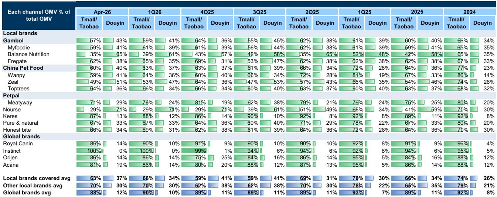
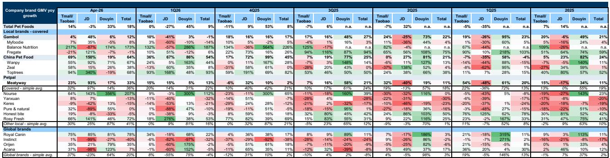
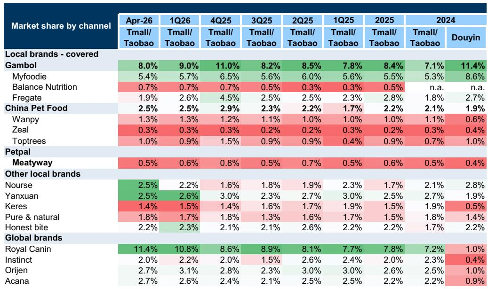

# China Pet Food Demand Is Accelerating, But the Profitability Story Is Fracturing Across Domestic and Overseas Markets

The April 2026 pet food data tells a story that is simultaneously encouraging and unsettling. Aggregate online GMV across Tmall, Taobao, JD, and Douyin grew 18% year-over-year in April, a sharp acceleration from the 9% growth recorded in the first quarter. This is not a seasonal blip. April historically contributes roughly 8% of annual pet food GMV, consistent with prior years, meaning the acceleration reflects genuine demand momentum rather than calendar distortion. Yet beneath this top-line strength, the competitive dynamics reveal a market where growth is becoming more expensive to capture, where cost pressures are building from multiple directions, and where the gap between revenue expansion and margin preservation is widening for nearly every player.

The critical insight for investors is this: the pet food sector has entered a phase where top-line acceleration and bottom-line compression are occurring simultaneously. The companies that win will not be those that simply grow fastest, but those that can manage the three-way squeeze of rising raw material costs, intensifying domestic competition, and overseas tariff and currency headwinds. The April data provides the clearest evidence yet that this bifurcation is underway.

## China Pet Foods and Gambol Returned to Growth in April, But the Composition of That Growth Raises Questions About Sustainability

The most striking finding in the April data is the rebound of China Pet Foods and Gambol. China Pet Foods led all covered local brands with 64% year-over-year GMV growth in April, driven by strong performance across its three core brands: Wanpy at 67%, Toptrees at 68%, and Zeal at 38%. Gambol returned to positive territory with 12% growth, a meaningful reversal from the 1% decline in the first quarter, supported by Myfoodie at 8% and a strong JD channel performance where Gambol grew 48% year-over-year.

At first glance, these numbers look like a vindication of the domestic demand thesis. China Pet Foods has clearly invested heavily in customer acquisition, with Toptrees showing particular strength in attracting new buyers across platforms. The premiumization trend also continues to favor these players, with top brands like Toptrees and Rosy Fresh leading in fan attraction on a year-over-year basis.

But the composition of this growth warrants scrutiny. China Pet Foods' April acceleration came on the back of 54% growth in the first quarter, meaning the base effects are becoming more demanding. More importantly, the channel mix is shifting in ways that may compress margins. April saw a greater share of sales coming from non-livestreaming channels, with a shift toward merchant and E-shelf formats on Douyin. Livestreaming typically carries higher promotional costs but also generates higher conversion rates. The shift away from it may indicate that brands are trying to manage their selling expenses, but it also suggests that the easy gains from influencer-driven sales may be diminishing.

For Gambol, the return to growth is welcome, but the devil is in the details. Myfoodie grew only 8%, while Fregate, Gambol's premium sub-brand, came in negative at 1%. This suggests that Gambol's recovery is being led by its core mass-market brand rather than its premium offerings, which is where margins are typically higher. In the premium-priced cat food segment, competition remains fierce, and Gambol's ability to maintain pricing power is an open question.

The real test for both companies will come in the second half of 2026. If April's acceleration can be sustained through the typically slower summer months and into the peak season, it would signal genuine demand momentum. But if the growth fades as promotional intensity increases, the current quarter may prove to be a peak rather than a trend.

## The Cost Squeeze Is Becoming Structural, Not Cyclical, and It Will Reshape Competitive Dynamics

The April cost index provides the most concerning data point for pet food investors. Raw material costs rose across the board: starch up 7% year-over-year, PET up 47%, chicken up 5%, and corn up 6%. As a result, the proprietary pet food cost index increased by 6% to 8% in April. This is not a temporary spike. The cost pressures are being driven by structural factors: rising global grain prices, supply chain adjustments for petrochemical-derived packaging materials, and protein cost inflation that is likely to persist as global meat demand remains robust.

The implications are profound. For pet food companies, raw materials represent 50% to 70% of cost of goods sold. A 6% to 8% increase in the cost index translates directly into margin compression unless it can be passed through to consumers. But the domestic market is becoming more competitive, not less. The April data shows that brands are spending aggressively on customer acquisition, which limits pricing power. The result is a margin squeeze that will affect players differently depending on their cost structure, brand strength, and channel mix.

China Pet Foods, with its multi-brand portfolio spanning mass-market (Wanpy) to premium (Zeal, Toptrees), has some ability to mix-shift toward higher-margin products. But the company's first-quarter results already showed margin pressure, and the April cost data suggests that pressure will intensify. Gambol faces a similar challenge, particularly in the premium cat food segment where competition is most intense.

For Petpal, the situation is more acute. Meatyway grew 33% in April, accelerating from 13% in the first quarter, which is positive. But Petpal faces a triple threat: weaker bargaining power with retailers, exposure to overseas tariff risks, and a New Zealand factory ramp-up that is still in its early stages. The cost index increase will hit Petpal harder than its larger peers because it has less scale to absorb input cost volatility.

The key strategic question is whether the cost pass-through will happen through price increases or through product reformulation. Price increases are risky in a competitive market, but reformulation that reduces ingredient quality could damage brand equity over time. The companies that navigate this trade-off most skillfully will emerge stronger, but the April data suggests that the margin pain is far from over.

## Overseas Markets Are Adding Headwinds Just as Domestic Competition Intensifies

The overseas demand picture adds another layer of complexity. US total dog and cat food imports declined 5% year-over-year in March, a sharp reversal from the 3% growth in February. This is not yet a crisis, but it is a warning signal. The US market is the largest export destination for Chinese pet food OEMs, and a sustained decline in import demand would pressure volumes for companies like Petpal and the OEM operations of China Pet Foods.

Compounding the demand weakness is the currency headwind. The report notes that RMB appreciation is likely to lead to foreign exchange losses among pet food OEMs. For companies that invoice in US dollars but report in RMB, a stronger Chinese currency directly reduces reported revenue and profit margins. This is not a theoretical risk; Petpal's first-quarter results already reflected FX losses, and the April data suggests this trend will continue.

The tariff situation adds further uncertainty. While the report does not specify new tariff actions, the combination of slowing US import demand, RMB appreciation, and the ongoing tariff sharing between OEMs and their US customers creates a challenging environment for export-oriented players. The OEM model, which has been a reliable growth driver for Chinese pet food companies, is facing structural headwinds that may persist regardless of the domestic demand cycle.

The strategic implication is clear: companies that have diversified their revenue streams between domestic and overseas markets are better positioned than those that rely heavily on exports. China Pet Foods, with its strong domestic brand portfolio and global supply chain, has more levers to pull. Petpal, which is more exposed to OEM demand and has weaker domestic brand recognition, faces a more difficult path.

## What the Report Does Not Fully Answer: The Sustainability of Premiumization and the True Cost of Customer Acquisition

The April data provides compelling evidence of premiumization, with top brands like Rosy Fresh and Toptrees leading in fan attraction on a year-over-year basis. But the report leaves several critical questions unanswered.

First, is premiumization translating into pricing power, or is it simply shifting volume to higher-priced SKUs without improving unit margins? The data on ASP trends is not fully disaggregated by brand, making it difficult to assess whether the premium mix shift is actually improving profitability or merely masking underlying price erosion in mass-market segments.

Second, the customer acquisition data for Toptrees is impressive, but the cost of that acquisition is not disclosed. In a market where Douyin ROI is under pressure and promotional intensity is high, the marginal cost of acquiring a new customer may be rising faster than the lifetime value of that customer. Without cohort analysis or retention data, it is impossible to know whether the current acquisition spending is creating long-term value or simply buying short-term market share.

Third, the report does not address the offline channel. The data covers Tmall, Taobao, JD, and Douyin, which together represent the majority of online pet food sales. But offline channels, including pet specialty stores, supermarkets, and veterinary clinics, remain significant, particularly for premium and prescription diets. The competitive dynamics in offline channels may be very different from online, and the companies that succeed online may not have the same advantages offline.

These open questions are not weaknesses of the report; they are inherent limitations of monthly channel data. But they mean that investors should be cautious about extrapolating the April acceleration into a sustained trend without additional evidence on profitability, retention, and channel mix.

## A Decision Framework for Investors: Three Questions to Distinguish Winners from Losers

Given the complexity of the current environment, a simple growth-rate comparison is insufficient. Investors need a structured framework to evaluate pet food companies. Based on the April data and the broader competitive dynamics, three questions should guide investment decisions.

First, can the company pass through input cost increases without losing market share? This is the most important question in the current environment. Companies with strong brand equity, loyal customer bases, and diversified product portfolios have more pricing power. China Pet Foods, with its multi-brand strategy and strong Tmall presence, appears better positioned than Gambol, which is more concentrated in the competitive premium cat food segment. Petpal, with weaker brand recognition and higher OEM exposure, has the least pricing power.

Second, does the company have a credible path to margin recovery in the second half of 2026? The cost index is likely to remain elevated, but some of the headwinds may moderate. Tariff sharing arrangements may stabilize, RMB appreciation may slow, and raw material costs may peak. Companies that can manage their working capital, optimize their product mix, and reduce promotional spending without losing volume will see margin recovery. The report suggests that Gambol may have easier selling cost comparisons from the second half of 2026, which is a positive signal, but the competitive dynamics in premium cat food remain intense.

Third, how exposed is the company to overseas headwinds relative to its domestic growth potential? The overseas market is facing demand weakness, currency pressure, and tariff uncertainty. Companies that can grow domestic revenue faster than overseas revenue declines will outperform. China Pet Foods, with its strong domestic momentum, is in the best position. Petpal, with its heavy OEM exposure and weaker domestic brand, faces the most risk. Gambol sits in between, with a primarily domestic business but a more competitive market position.

The April data provides a snapshot, not a forecast. But it is a snapshot that reveals the underlying fault lines in the pet food industry. The companies that can answer these three questions affirmatively will be the long-term winners. Those that cannot will face persistent margin pressure regardless of top-line growth.

## The Full Report Contains the Data and Charts That Make These Trends Visible

The analysis above is based on the April 2026 pet food tracker, which includes detailed exhibits on channel mix, ASP trends, Douyin ROI, overseas demand, and the proprietary cost index. These charts are essential for understanding the nuances behind the headline growth numbers. The exhibit on customer acquisition by brand, for example, shows which companies are investing in future growth and which are relying on existing customer bases. The cost index chart provides the raw data behind the margin pressure thesis. The overseas demand chart shows the trajectory of US imports and the timing of the recent decline.

These are not abstract concepts; they are visible in the data. But the data is only useful if it is interpreted correctly, and the full report provides the context and methodology that make interpretation possible.

Join the community to read the full report and review the original charts.

*This article is for learning and discussion only and does not constitute investment advice.*

Personal reading notes and learning share only. Not investment advice.

