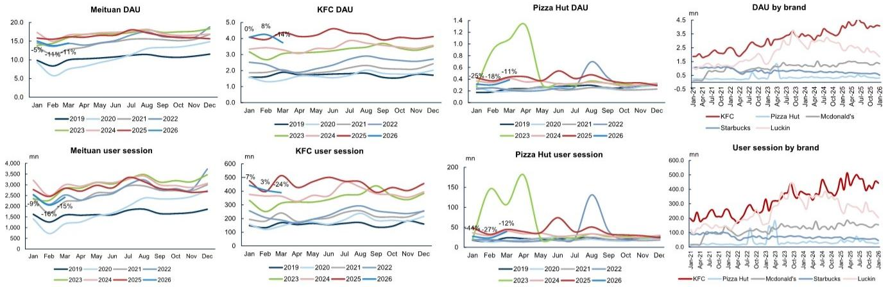
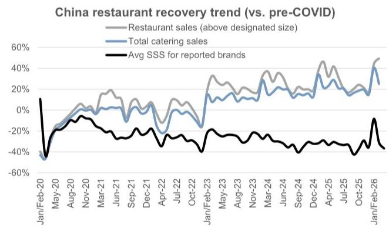
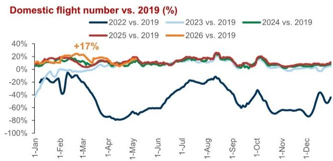
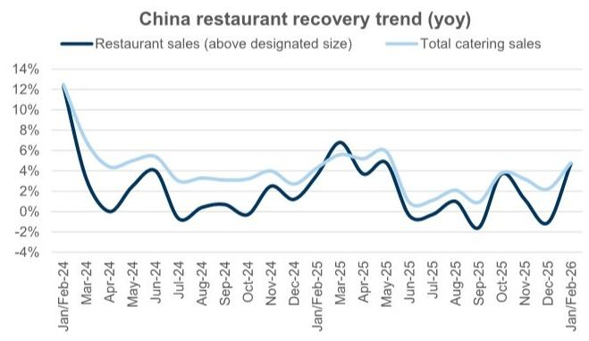
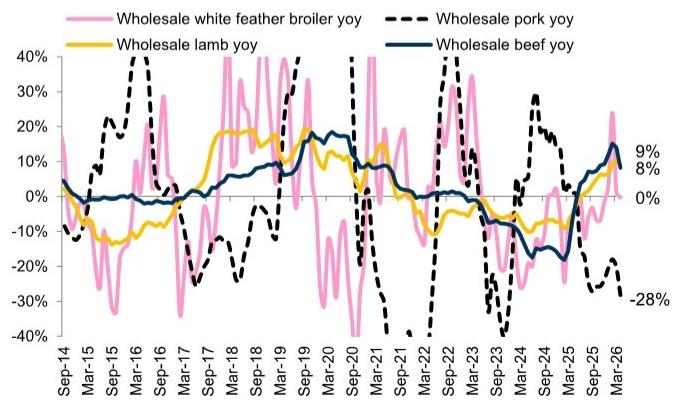
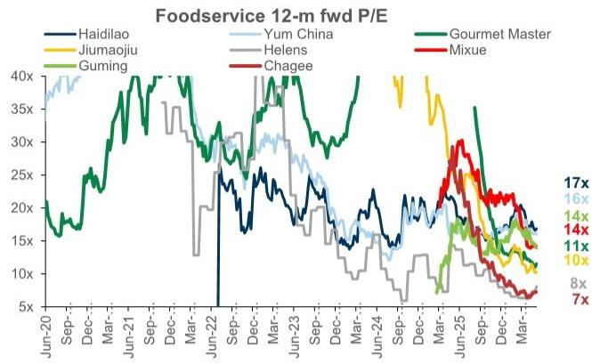
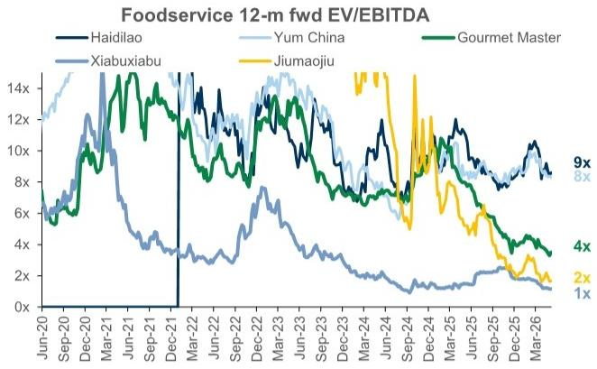

# China Restaurants: Monthly Tracker: Apr update: sequentially better performance supported by spring break, yet decelerated into Labor Day

# Apr SSSG performance was supported by incremental spring break and multiple restaurant companies saw sequential acceleration from relatively soft Mar. By

brand, YUMC mentioned that Apr SSSG was solid and improved from Mar; Tai Er SSSG further accelerated to DD% for both old and new store format stores; Haidilao table turn growth also recorded MSD%, though from a relatively low base. That said, freshly made drink names generally saw SSSG deceleration from 1Q, with high base impact kicking in. During Labor Day holiday, brands generally saw SSSG

deceleration, in line with the relatively soft travel/moderate demand during the holiday, partially attributed to the traffic distraction to spring break in April. At brand level, we also saw divergence — YUMC's performance has been on track with management's expectation, Tai Er delivered MSD-HSD% SSSG in ML China supported by new store format, while Haidilao's table turn was largely flat yoy. For freshly made drink players, SSSG was generally negative during the holiday impacted by weather headwind and last year's tough base when delivery sUBSidy was

aggressive; but the performance by brand saw divergence subject to brand momentum and product cycle/expansion opportunity, e.g. Guming's performance was in line with management's expectation, while Nayuki had \~30% SSSG decline during the holiday. Delivery sUBSidy continued seeing normalization and some freshly made drink brands noted yoy delivery mix decline in Labor Day holiday, while the pricing activity from brand side remained rational; leading restaurant brands also remained disciplined in pricing.

In this note, we provide updates on a variety of high-frequency indicators, including air traffic run rate, and commodity inflation. We also include competition environment updates, key company news and key reports published over the past month.

# Brand performance

1. Haidilao (6862.HK; Neutral): Haidilao's average table turn increase was at MSD% in Apr from last year's low base, accelerated from Mar and similar to Jan-Feb level. Based on our calculation, this implies 3.5x\~3.6x table turn (slightly lower than Mar), and \~80% recovery level compared to 2019, sequentially lower than 1Q. Haidilao opened 4 company stores and 3 franchised stores, while closed 3 company stores in Apr. In Labor Day holiday, Haidilao had >5x average daily table turn, largely stable compared to last year. ASP has been relatively stable yoy.

# Michelle Cheng

+852-2978-6631

michelle.cheng@gs.com

GS (Asia) L.L.C.

# Xinyu Ruan

+852-2978-7347 | xinyu.ruan@gs.com

GS (Asia) L.L.C.

# Molly Dai

+852-3966-4000 | molly.dai@gs.com

GS (Asia) L.L.C.

# Carol Chen

+852-2978-7999 | carol.chen@gs.com

GS (Asia) L.L.C.

# Keira Liu

+852-2978-0473 | keira.liu@gs.com

GS (Asia) L.L.C.

GS read: While Apr table turn growth accelerated, we note it is from a relatively low base (DD% table turn decline in Apr 2025). Labor Day performance was unexCiting, consistent with the moderate demand during the holiday.

2. Guming (1364.HK, Buy, on CL): Short-term performance could be impacted by weather, holiday period etc.; management commented that recent SSSG including Labor Day holiday performance has been in line with their expectation.

GS read: Guming's share price pulled back recently with concerns on SSSG decline with high base kicking in. While we expect SSSG to see decline in 2Q-3Q from tough base, we expect category expansion and successful new products to provide support to its outperformance. We factor flat SSSG in 2026; after a strong start in 1Q26 at DD growth, implied SSSG in 2Q/3Q26 could be HSD - 10% decline yoy.

3. Jiumaojiu (9922.HK, Buy): In April, Tai Er's SSSG in ML China continued to improve, maintaining +DD% growth and strengthening compared to March levels. Both new and old store formats achieved double-digit growth in April, with new models outperforming. During the Labor Day holiday, Tai Er's overall SSSG in ML China maintained +MSD-HSD% growth, despite rainy weather in South China impacting foot traffic. New model stores continued to outperform the overall average with +DD% growth, while old models maintained slight positive growth. For the Jiumaojiu and Song brands, SSSG trends remained stable vs previous quarters, continuing to face pressure as new store models are still being explored and optimized.

GS read: Tai Er's SSSG outperformed vs. overall market in Apr and Labor day, helped by upgraded fresh concept and diversified food offerings, despite weather headwinds in South China during Labor Day. Additional spring break also supported the stronger performance in Apr.

4. Nayuki (2150.HK; Sell): Apr average per store sales declined by 11% yoy (volume/ticket size down by 5%/6% respectively), expanded from slight decline in Mar; SSSG decline is at similar magnitude. During Labor Day holiday, SSSG declined by \~30% yoy from a high base when delivery sUBSidy notably boosted sales.

GS read: The SSSG performance sequentially weakened from 1Q. While we acknowledge the high base last Labor Day holiday, Nayuki underperformed vs. other freshly made drink brands.

5. Gourmet Master (2723.TW; Neutral): ML China sales decline remained significant at 48% in Apr, with store count at 290-300 which is similar to 1Q level (implies >30% yoy decline) and transition to franchised stores; yet management noted per store sales for company-owned stores continued seeing yoy increase and they expect profitability to see meaningful improvement this year with store network optimization. In US market, average per store sales in Apr increased by 7% vs. 1Q level, and store count reached 91 with a new store opened in California.

GS read: The sales decline in Apr in ML China was tracking weaker than GSe (low 40% yoy decline), and we expect to see OPM improvement this year. In US market, the performance continues to be on track.

Exhibit 1: Haidilao/Tai Er Apr SSSG accelerated; FMD players generally saw deceleration 

<table><tr><td></td><td>Jan 25</td><td>Feb 25</td><td>Mar 25</td><td>Apr 25</td><td>May 25</td><td>Jun 25</td><td>Jul 25</td><td>Aug 25</td><td>Sep 25</td><td>25-Oct</td><td>25-Nov</td><td>25-Dec</td><td>26-Jan</td><td>26-Feb</td><td>26-Mar</td><td>26-Apr</td><td>CNY 2023</td><td>Labor Day 2023</td><td>National Day 2023</td><td>CNY 2024</td><td>Labor Day 2024</td><td>National Day 2024</td><td>CNY 2025</td><td>Labor Day 2025</td><td>National Day 2025</td><td>CNY 2026</td><td>Labor Day 2026</td></tr><tr><td colspan="28">SSSG</td></tr><tr><td>Haidiao (avg. tableturn)</td><td>0%</td><td>-8%</td><td>-9%</td><td>-13%</td><td>-6%</td><td>-7%</td><td>0%</td><td>1%</td><td>-2%</td><td>2%</td><td>-1%</td><td>-1%</td><td>-5%</td><td>13%</td><td>1%</td><td>5%</td><td>-10%</td><td>40%</td><td>25%</td><td>40%</td><td>20%</td><td>0%</td><td>-5%</td><td>-10%</td><td>0%</td><td>5%</td><td>0%</td></tr><tr><td>Tai Er</td><td></td><td></td><td></td><td></td><td></td><td></td><td></td><td></td><td></td><td></td><td>LSD% decl</td><td>HSD%</td><td>MSD%</td><td>DD%</td><td>LDD%</td><td>DD%</td><td></td><td></td><td></td><td></td><td></td><td></td><td></td><td></td><td>low teens decline</td><td>HSD%</td><td>M-HSD%</td></tr><tr><td>Nayuki</td><td>-8%</td><td>-13%</td><td>-7%</td><td>3%</td><td>14%</td><td>13%</td><td>22%</td><td>8%</td><td>0%</td><td>-1%</td><td>10%</td><td>0%</td><td></td><td></td><td>-3%</td><td>-11%</td><td>-10%</td><td>30%</td><td>-14%</td><td>-20%</td><td>-20%</td><td>-23%</td><td></td><td>20%</td><td></td><td></td><td>-30%</td></tr><tr><td>Nayuki (average sales per store)</td><td></td><td></td><td></td><td></td><td>20%</td><td>20%</td><td>29%</td><td>15%</td><td>5%</td><td>3%</td><td>13%</td><td>3%</td><td></td><td></td><td>-1%</td><td>-11%</td><td></td><td></td><td></td><td></td><td></td><td></td><td></td><td></td><td></td><td></td><td></td></tr><tr><td>Guming</td><td>+LSD%</td><td></td><td></td><td>Acceleration</td><td>DD</td><td>DD</td><td>&gt;20% (GMV)</td><td></td><td>~20% (GMV)</td><td>No slower vs. Sep</td><td>Slightly slower vs. Oct</td><td>DD%</td><td>SD%</td><td>&gt;20%</td><td>HSD%</td><td></td><td></td><td></td><td></td><td></td><td></td><td></td><td></td><td></td><td></td><td>DD%</td><td></td></tr><tr><td>ChaPanda</td><td></td><td></td><td></td><td></td><td></td><td></td><td></td><td></td><td></td><td>SD%</td><td>DD%</td><td>~25%</td><td>SD%</td><td>DD%</td><td>SD%</td><td>SD%</td><td></td><td></td><td></td><td></td><td></td><td></td><td></td><td></td><td></td><td>DD%</td><td>decline</td></tr><tr><td>Auntea Jenny</td><td></td><td></td><td></td><td></td><td></td><td></td><td></td><td></td><td></td><td></td><td></td><td></td><td></td><td>close to 20%</td><td></td><td>Slower than 1Q26</td><td></td><td></td><td></td><td></td><td></td><td></td><td></td><td></td><td></td><td></td><td>Slower than Apr-26</td></tr><tr><td colspan="28">SSS vs. 2021</td></tr><tr><td>Haidiao (avg. tableturn)</td><td>27%</td><td>18%</td><td>23%</td><td>17%</td><td>27%</td><td>52%</td><td>34%</td><td>52%</td><td>17%</td><td>15%</td><td>32%</td><td>26%</td><td>21%</td><td>33%</td><td>24%</td><td>23%</td><td>-16%</td><td>5%</td><td>5%</td><td>18%</td><td>26%</td><td>5%</td><td>12%</td><td>14%</td><td>5%</td><td>17%</td><td>14%</td></tr><tr><td>Nayuki</td><td>-50%</td><td>-54%</td><td>-48%</td><td>-47%</td><td>-41%</td><td>-40%</td><td>-41%</td><td>-28%</td><td>-43%</td><td>-47%</td><td>-38%</td><td>-52%</td><td></td><td></td><td>-49%</td><td>-53%</td><td>-30%</td><td>-20%</td><td>-31%</td><td>-44%</td><td>-36%</td><td>-47%</td><td></td><td>-23%</td><td></td><td></td><td>-46%</td></tr><tr><td>Gourmet Master</td><td>-33%</td><td>-27%</td><td>-22%</td><td>-23%</td><td>-28%</td><td>-31%</td><td>-35%</td><td>-34%</td><td>-32%</td><td>-33%</td><td></td><td></td><td></td><td></td><td></td><td></td><td></td><td></td><td></td><td></td><td></td><td></td><td></td><td></td><td></td><td></td><td></td></tr><tr><td>average</td><td>-18%</td><td>-21%</td><td>-15%</td><td>-18%</td><td>-14%</td><td>-6%</td><td>-14%</td><td>-4%</td><td>-19%</td><td>-22%</td><td>-3%</td><td>-13%</td><td></td><td></td><td>-12%</td><td>-15%</td><td></td><td></td><td></td><td></td><td></td><td></td><td></td><td></td><td></td><td></td><td></td></tr><tr><td>SSS as % of 2021</td><td>82%</td><td>79%</td><td>85%</td><td>82%</td><td>86%</td><td>94%</td><td>86%</td><td>96%</td><td>81%</td><td>78%</td><td>97%</td><td>87%</td><td></td><td></td><td>88%</td><td>85%</td><td></td><td></td><td></td><td></td><td></td><td></td><td></td><td></td><td></td><td></td><td></td></tr><tr><td colspan="28">SSS vs. 2019</td></tr><tr><td>Haidiao (avg. tableturn)</td><td>-12%</td><td>-12%</td><td>-14%</td><td>-24%</td><td>-15%</td><td>-19%</td><td>-20%</td><td>-19%</td><td>-29%</td><td>-15%</td><td>-17%</td><td>-17%</td><td>-16%</td><td>0%</td><td>-13%</td><td>-20%</td><td>-37%</td><td>-24%</td><td>-10%</td><td>-12%</td><td>-8%</td><td>-10%</td><td>-16%</td><td>-18%</td><td>-10%</td><td>-12%</td><td>-18%</td></tr><tr><td>Gourmet Master</td><td>-34%</td><td>-29%</td><td>-26%</td><td>-29%</td><td>-35%</td><td>-38%</td><td>-42%</td><td>-39%</td><td>-39%</td><td>-39%</td><td></td><td></td><td></td><td></td><td></td><td></td><td></td><td></td><td></td><td></td><td></td><td></td><td></td><td></td><td></td><td></td><td></td></tr><tr><td>average</td><td>-23%</td><td>-20%</td><td>-20%</td><td>-26%</td><td>-25%</td><td>-29%</td><td>-31%</td><td>-29%</td><td>-34%</td><td>-27%</td><td>-17%</td><td>-17%</td><td>-16%</td><td>0%</td><td>-13%</td><td>-20%</td><td></td><td></td><td></td><td></td><td></td><td></td><td></td><td></td><td></td><td></td><td></td></tr><tr><td>SSS as % of pre-COVID</td><td>77%</td><td>80%</td><td>80%</td><td>74%</td><td>75%</td><td>71%</td><td>69%</td><td>71%</td><td>66%</td><td>73%</td><td>83%</td><td>83%</td><td>84%</td><td>100%</td><td>87%</td><td>80%</td><td></td><td></td><td></td><td></td><td></td><td></td><td></td><td></td><td></td><td></td><td></td></tr></table>

Source: Company data

Exhibit 2: Quarterly SSSG tracker 

<table><tr><td colspan="10">SSSG yoy trend</td><td colspan="10">vs. 2019</td></tr><tr><td>SSSG yoy</td><td>1Q24</td><td>2Q24</td><td>3Q24</td><td>4Q24</td><td>1Q25</td><td>2Q25</td><td>3Q25</td><td>4Q25</td><td>1Q26</td><td></td><td>1Q24</td><td>2Q24</td><td>3Q24</td><td>4Q24</td><td>1Q25</td><td>2Q25</td><td>3Q25</td><td>4Q25</td><td>1Q26</td></tr><tr><td>KFC China</td><td>-2.0%</td><td>-3.0%</td><td>-2.0%</td><td>-1.0%</td><td>0.0%</td><td>1.0%</td><td>2.0%</td><td>3.0%</td><td>1.0%</td><td></td><td>-10%</td><td>-12%</td><td>-12%</td><td>-16%</td><td>-10%</td><td>-11%</td><td>-10%</td><td>-14%</td><td>-9%</td></tr><tr><td>Pizza Hut China</td><td>-5.0%</td><td>-8.0%</td><td>-6.0%</td><td>-2.0%</td><td>0.0%</td><td>2.0%</td><td>1.0%</td><td>1.0%</td><td>-1.0%</td><td></td><td>-8%</td><td>-14%</td><td>-14%</td><td>-16%</td><td>-8%</td><td>-12%</td><td>-13%</td><td>-16%</td><td>-9%</td></tr><tr><td>YUM China</td><td>-3.0%</td><td>-4.0%</td><td>-3.0%</td><td>-1.0%</td><td>0.0%</td><td>1.0%</td><td>1.0%</td><td>3.0%</td><td>0.0%</td><td></td><td>-10%</td><td>-13%</td><td>-12%</td><td>-16%</td><td>-10%</td><td>-12%</td><td>-11%</td><td>-13%</td><td>-10%</td></tr><tr><td>Starbucks China</td><td>-11.0%</td><td>-14.0%</td><td>-14.0%</td><td>-6.0%</td><td>0.0%</td><td>2.0%</td><td>2.0%</td><td>7.0%</td><td>0.5%</td><td></td><td>-33%</td><td>-32%</td><td>-32%</td><td>-34%</td><td>-33%</td><td>-31%</td><td>-30%</td><td>-29%</td><td>-32%</td></tr><tr><td>Gourmet Master China</td><td>-15.7%</td><td>-16.7%</td><td>-15.2%</td><td>-9.7%</td><td>-9.7%</td><td>-4.0%</td><td>-7.7%</td><td>-10.0%</td><td></td><td></td><td>-26%</td><td>-31%</td><td>-35%</td><td>-28%</td><td>-33%</td><td>-34%</td><td>-40%</td><td>-36%</td><td>-33%</td></tr><tr><td>Xiabuxiabu</td><td>-19.0%</td><td></td><td>-27.6%</td><td></td><td>-15.6%</td><td></td><td></td><td>-3.6%</td><td></td><td></td><td></td><td>-55%</td><td></td><td>-54%</td><td></td><td>-62%</td><td></td><td></td><td></td></tr><tr><td>Coucou</td><td>-43.0%</td><td></td><td>-21.0%</td><td></td><td>-14.0%</td><td></td><td></td><td>-14.4%</td><td></td><td></td><td></td><td>-57%</td><td></td><td>-61%</td><td></td><td>-63%</td><td></td><td></td><td></td></tr><tr><td>Haidilao</td><td>14.5%</td><td></td><td>-4.6%</td><td></td><td>14.5%</td><td></td><td></td><td>-3.0%</td><td>2.7%</td><td></td><td></td><td>-16%</td><td></td><td>-22%</td><td></td><td>-4%</td><td></td><td>-24%</td><td></td></tr><tr><td>Jiu Mao Jiu</td><td>-4.1%</td><td>-12.6%</td><td>-10.3%</td><td>-18.5%</td><td>-18.6%</td><td>-18.5%</td><td>-14.8%</td><td>-16.4%</td><td>-11.3%</td><td></td><td>-26%</td><td>-29%</td><td>-26%</td><td>-38%</td><td>-40%</td><td>-43%</td><td>-37%</td><td>-48%</td><td>-47%</td></tr><tr><td>Tai Er</td><td>-13.9%</td><td>-18.1%</td><td>-18.3%</td><td>-24.6%</td><td>-21.2%</td><td>-13.7%</td><td>-9.3%</td><td>-3.0%</td><td>6.9%</td><td></td><td>-24%</td><td>-33%</td><td>-32%</td><td>-41%</td><td>-40%</td><td>-42%</td><td>-38%</td><td>-43%</td><td>-36%</td></tr><tr><td>Song</td><td>-34.8%</td><td>-36.6%</td><td>-32.5%</td><td>-26.9%</td><td>-24.2%</td><td>-14.3%</td><td>-19.1%</td><td>-19.0%</td><td>-19.9%</td><td></td><td></td><td></td><td></td><td></td><td></td><td></td><td></td><td></td><td></td></tr><tr><td>Helens</td><td>-29.7%</td><td></td><td>-12.9%</td><td></td><td>-17.9%</td><td></td><td></td><td>-18.9%</td><td></td><td></td><td></td><td>-48%</td><td></td><td>-43%</td><td></td><td>-58%</td><td></td><td>-54%</td><td></td></tr><tr><td>Nayuki</td><td>-28.5%</td><td></td><td>-21.3%</td><td></td><td>-9.3%</td><td>10.0%</td><td>10.0%</td><td>3.0%</td><td>LSD%</td><td></td><td></td><td>-47%</td><td></td><td>-44%</td><td></td><td></td><td></td><td></td><td></td></tr><tr><td>Juawei</td><td>-13.7%</td><td>-11.0%</td><td>-5.5%</td><td>-21.5%</td><td>1.7%</td><td>-10.1%</td><td>0.3%</td><td>18.4%</td><td>-1.2%</td><td></td><td>-22%</td><td>-29%</td><td>-27%</td><td>-41%</td><td>-21%</td><td>-36%</td><td>-27%</td><td>-30%</td><td>-22%</td></tr><tr><td>Guming</td><td></td><td>-1.2%</td><td></td><td></td><td>HSD</td><td>DD</td><td>&gt;20% (GMV)</td><td>DD</td><td>DD</td><td></td><td></td><td></td><td></td><td></td><td></td><td></td><td></td><td></td><td></td></tr><tr><td>Luckin</td><td>-20.3%</td><td>-20.9%</td><td>-13.1%</td><td>-3.4%</td><td>8.1%</td><td>13.4%</td><td>14.4%</td><td>1.2%</td><td>0.1%</td><td></td><td>127%</td><td>116%</td><td>119%</td><td>88%</td><td>145%</td><td>145%</td><td>151%</td><td>90%</td><td>145%</td></tr><tr><td>Chagee</td><td>46.0%</td><td>38.0%</td><td>0.4%</td><td>-19.3%</td><td>-19.1%</td><td>-23.1%</td><td>-27.9%</td><td>-25.5%</td><td></td><td></td><td></td><td></td><td></td><td></td><td></td><td></td><td></td><td></td><td></td></tr><tr><td>Tims China - self-operated store</td><td>-11.7%</td><td>-13.8%</td><td>-20.7%</td><td>-12.3%</td><td>-6.5%</td><td>-3.6%</td><td>3.3%</td><td>-1.4%</td><td></td><td></td><td></td><td></td><td></td><td></td><td></td><td></td><td></td><td></td><td></td></tr><tr><td>Tims China - system-wide store</td><td>-13.6%</td><td>-14.6%</td><td>-21.7%</td><td>-13.3%</td><td>-7.8%</td><td>-4.8%</td><td>1.3%</td><td>-2.4%</td><td></td><td></td><td></td><td></td><td></td><td></td><td></td><td></td><td></td><td></td><td></td></tr><tr><td>Domino&#x27;s Pizza China</td><td>3.6%</td><td></td><td>1.6%</td><td></td><td>-1.0%</td><td></td><td></td><td>-1.9%</td><td></td><td></td><td></td><td></td><td></td><td></td><td></td><td></td><td></td><td></td><td></td></tr><tr><td>Saizeriya Shanghai (existing store sales)</td><td>-1.8%</td><td>-6.6%</td><td>-10.5%</td><td>-6.3%</td><td>-14.8%</td><td>-19.7%</td><td>-16.2%</td><td>-11.0%</td><td>-9.1%</td><td></td><td>14%</td><td>20%</td><td>11%</td><td>5%</td><td>-3%</td><td>-3%</td><td>-7%</td><td>-6%</td><td>-12%</td></tr><tr><td>Saizeriya Guangzhou (existing store sales)</td><td>-0.9%</td><td>-7.1%</td><td>-12.1%</td><td>-9.6%</td><td>-15.9%</td><td>-18.2%</td><td>-11.2%</td><td>4.0%</td><td>-1.8%</td><td></td><td>38%</td><td>28%</td><td>18%</td><td>7%</td><td>16%</td><td>5%</td><td>5%</td><td>12%</td><td>14%</td></tr><tr><td>Saizeriya Beijing (existing store sales)</td><td>8.2%</td><td>-2.9%</td><td>-7.2%</td><td>0.4%</td><td>-11.5%</td><td>-18.7%</td><td>-15.4%</td><td>-11.3%</td><td>-14.5%</td><td></td><td>29%</td><td>36%</td><td>25%</td><td>25%</td><td>14%</td><td>11%</td><td>6%</td><td>11%</td><td>-3%</td></tr><tr><td>Saizeriya China average (existing store sales)</td><td>1.8%</td><td>-5.5%</td><td>-9.9%</td><td>-5.2%</td><td>-14.1%</td><td>-18.9%</td><td>-14.3%</td><td>-6.1%</td><td>-8.5%</td><td></td><td>29%</td><td>61%</td><td>19%</td><td>16%</td><td>11%</td><td>31%</td><td>2%</td><td>9%</td><td>1%</td></tr></table>

Chagee SSSG before 2025 is based on China and overseas combined.   
Source: Company data compiled by GS Global Investment Research

Exhibit 3: Store opening monthly tracker 

<table><tr><td>Gross opening</td><td>Jan-26</td><td>Feb-26</td><td>Mar-26</td><td>Apr-26</td><td>3M/4M26</td><td>Company guidance (2026)</td><td>3M/4M26 avg unit yoy</td></tr><tr><td>KFC</td><td>254</td><td>217</td><td>78</td><td>n.a.</td><td>549</td><td>&gt;1,900 net store addition with store count</td><td>9%</td></tr><tr><td>KCOFFEE</td><td>240</td><td>76</td><td>55</td><td>n.a.</td><td>371</td><td rowspan="2">reaching 20k and 40%-50% franchise mix of new stores for both KFC and PH</td><td>157%</td></tr><tr><td>PH</td><td>126</td><td>84</td><td>38</td><td>n.a.</td><td>248</td><td>14%</td></tr><tr><td>Tai Er</td><td>0</td><td>0</td><td>0</td><td>0</td><td>0</td><td></td><td>-23%</td></tr><tr><td>Jiumaojiu</td><td>0</td><td>0</td><td>0</td><td>2</td><td>2</td><td rowspan="2">Renovation of TaiEr to be largely completed in 1H26; Song continues to be optimized in 2026.</td><td>-10%</td></tr><tr><td>Song</td><td>0</td><td>0</td><td>0</td><td>0</td><td>0</td><td>-25%</td></tr><tr><td>Shan Wai Mian</td><td>0</td><td>0</td><td>0</td><td>0</td><td>0</td><td></td><td>-14%</td></tr><tr><td>Haidilao</td><td>2</td><td>2</td><td>-4</td><td>4</td><td>4</td><td>+MSD% gross store opening</td><td>-1%</td></tr><tr><td>Self-operated</td><td>4</td><td>3</td><td>4</td><td>4</td><td>15</td><td></td><td></td></tr><tr><td>Closure</td><td>-2</td><td>-7</td><td>-10</td><td>-3</td><td>-22</td><td></td><td></td></tr><tr><td>Franchise (newly opened)</td><td></td><td>6</td><td>2</td><td>3</td><td>11</td><td></td><td></td></tr><tr><td>Yanqing BBQ</td><td>0</td><td>0</td><td>0</td><td>0</td><td>0</td><td></td><td>102%</td></tr><tr><td>Guming</td><td>214</td><td>155</td><td>106</td><td></td><td>475</td><td>Store addition in 2026E similar to 2025</td><td>40%</td></tr><tr><td>Mixue China</td><td>450</td><td>532</td><td>384</td><td></td><td>1366</td><td></td><td>20%</td></tr><tr><td>Lucky Cup</td><td>303</td><td>143</td><td>66</td><td></td><td>512</td><td></td><td>147%</td></tr><tr><td>Nayuki</td><td>n.a.</td><td>n.a.</td><td>n.a.</td><td></td><td></td><td></td><td></td></tr><tr><td>Self-operated (net increase)</td><td></td><td></td><td></td><td>1287</td><td>-18</td><td></td><td>-4%</td></tr><tr><td>Franchise</td><td></td><td></td><td></td><td></td><td></td><td></td><td></td></tr></table>

Haidilao brands store opening based on company data; Jiumaojiu store opening based on brand official account; others based on Zhaimen.   
Source: Zhaimen, Company data

Exhibit 4: DAU/user session of major delivery/food service brand APP   
  
As of Mar 2026.   
Source: QuestMobile

Exhibit 5: Apr growth recovery level for Haidilao/Nayuki sequentially lowered, yet we also note brands including YUMC/Tai Er noting better performance vs. Mar   

line

| Date       | Restaurant sales (above designated size) | Total catering sales | Avg SSS for reported brands |
|------------|------------------------------------------|---------------------|------------------------------|
| Jan/Feb-20 | -40%                                     | -40%                | -40%                         |
| May-20     | -20%                                     | -20%                | -20%                         |
| Aug-20     | 0%                                       | 0%                  | 0%                           |
| Nov-20     | 20%                                      | 20%                 | 20%                          |
| Mar-21     | 30%                                      | 30%                 | 30%                          |
| Jun-21     | 20%                                      | 20%                 | 20%                          |
| Sep-21     | 10%                                      | 10%                 | 10%                          |
| Dec-21     | 0%                                       | 0%                  | 0%                           |
| Apr-22     | -20%                                     | -20%                | -20%                         |
| Jul-22     | -30%                                     | -30%                | -30%                         |
| Oct-22     | -40%                                     | -40%                | -40%                         |
| Jan/Feb-23 | 30%                                      | 30%                 | 30%                          |
| May-23     | 20%                                      | 20%                 | 20%                          |
| Aug-23     | 30%                                      | 30%                 | 30%                          |
| Nov-23     | 40%                                      | 40%                 | 40%                          |
| Mar-24     | 30%                                      | 30%                 | 30%                          |
| Jun-24     | 20%                                      | 20%                 | 20%                          |
| Sep-24     | 10%                                      | 10%                 | 10%                          |
| Dec-24     | 40%                                      | 40%                 | 40%                          |
| Apr-25     | 30%                                      | 30%                 | 30%                          |
| Jul-25     | 20%                                      | 20%                 | 20%                          |
| Oct-25     | 10%                                      | 10%                 | 10%                          |
| Jan/Feb-26 | 50%                                      | 50%                 | -50%                         |

Source: NBS, Company data

Exhibit 7: Latest domestic flight capacity exceeded the FY19 level by +17%, sequentially increased with holiday impact, yet airlines holiday performance missed   

line

| Date   | 2022 vs. 2019 | 2023 vs. 2019 | 2024 vs. 2019 | 2025 vs. 2019 | 2026 vs. 2019 |
|--------|---------------|---------------|---------------|---------------|---------------|
| 1-Jan  | -40%          | -40%          | -40%          | -40%          | -40%          |
| 1-Feb  | -60%          | -20%          | -20%          | -20%          | -20%          |
| 1-Mar  | -80%          | 0%            | 0%            | 0%            | 0%            |
| 1-Apr  | -80%          | 0%            | 0%            | 0%            | 0%            |
| 1-May  | -60%          | 0%            | 0%            | 0%            | 0%            |
| 1-Jun  | -40%          | 0%            | 0%            | 0%            | 0%            |
| 1-Jul  | -20%          | 0%            | 0%            | 0%            | 0%            |
| 1-Aug  | -40%          | 0%            | 0%            | 0%            | 0%            |
| 1-Sep  | -60%          | 0%            | 0%            | 0%            | 0%            |
| 1-Oct  | -80%          | 0%            | 0%            | 0%            | 0%            |
| 1-Nov  | -60%          | 0%            | 0%            | 0%            | 0%            |
| 1-Dec  | -40%          | 0%            | 0%            | 0%            | 0%            |

Note: Latest data as of May 05,2026. Data referring to 7-day average.  
2023-2025 data adjusted to compare against Chunyun (Spring festival travel rush) dates on like-for-like basis.   
Source: Flight Master

Exhibit 6: Above sized restaurant sales grew slower vs total catering sales in Mar   

line

China restaurant recovery trend (yoy)
| Date | Restaurant sales (above designated size) (%) | Total catering sales (%) |
|---|---|---|
| Jan/Feb-24 | 12.5 | 13.0 |
| Mar-24 | -0.5 | 5.0 |
| Apr-24 | 0.0 | 4.5 |
| May-24 | 3.5 | 5.5 |
| Jun-24 | 4.0 | 5.0 |
| Jul-24 | -1.0 | 3.0 |
| Aug-24 | 0.5 | 3.5 |
| Sep-24 | -0.5 | 3.0 |
| Oct-24 | 1.0 | 3.5 |
| Nov-24 | 2.0 | 4.0 |
| Dec-24 | 1.5 | 3.5 |
| Jan/Feb-25 | 7.0 | 6.0 |
| Mar-25 | 6.0 | 5.5 |
| Apr-25 | 4.0 | 6.0 |
| May-25 | 5.0 | 6.5 |
| Jun-25 | -1.0 | 1.0 |
| Jul-25 | -0.5 | 1.5 |
| Aug-25 | 1.0 | 2.0 |
| Sep-25 | -2.0 | 1.0 |
| Oct-25 | 3.5 | 4.0 |
| Nov-25 | 1.0 | 3.0 |
| Dec-25 | -1.5 | 2.5 |
| Jan/Feb-26 | 4.5 | 5.0 |

Source: NBS

Exhibit 8: Commodity prices sequentially corrected in Apr   

line

| Date    | Wholesale white feather broiler yoy | Wholesale pork yoy | Wholesale lamb yoy | Wholesale beef yoy |
|---------|------------------------------------|--------------------|--------------------|--------------------|
| Mar-26  | 9%                                 | -28%               | 8%                 | 0%                 |

Source: Wind, CEIC

# Competitive environment

In freshly made drink, we have seen delivery sUBSidy normalization; and during Labor Day holiday some brands noted yoy decline in delivery mix given last year's aggressive sUBSidy. Pricing from brands remains largely disciplined, though we note Cotti introduced low price coupon in private domain. For restaurants, leading players continued being disciplined in pricing, e.g. KFC started to charge for additional dipping sauce, and Haidilao ASP was stable yoy.

Exhibit 9: FMD and QSR promotion tracker 

<table><tr><td rowspan="2"></td><td colspan="5">Coffee</td><td colspan="4">Tea</td><td colspan="4">QSR</td></tr><tr><td>Luckin</td><td>Cotti</td><td>KCOFFEE</td><td>Mc Café</td><td>Lucky Cup</td><td>Mixue</td><td>Good me</td><td>Hey Tea</td><td>KFC</td><td>Pizza Hut</td><td>Mcdonald&#x27;s</td><td>Tastien</td><td>DPC</td></tr><tr><td>Major pricing activities</td><td>- Price hike from Jan 2025 in some Cities</td><td>- No longer offer Rmb9.9 for all products since Feb 2026</td><td>- Lowest price with membership card increased to Rmb6 from Rmb5; membership card monthly fee from Rmb8.8 to Rmb9.9 from Mar 2025</td><td></td><td>- Increased delivery channel price by Rmb3 on Feb 28, 2026</td><td></td><td></td><td></td><td>- Announced price hike by ~2% on average on Dec 2024- Increased delivery price by avg Rmb0.8 in Jan 2026</td><td>- Launched 2025 new menu with more value-for-money price points- In 2026, launched Rmb1 product coupon on APP for every Tuesday</td><td>- Price hike by Rmb0.5-1 for select SKUs on Dec 2025</td><td></td><td></td></tr><tr><td>4/6/2026</td><td>-One 9.9 coffee coupon each week, 6 SKUs available including 1 milk tea and 2 fruit tea SKUs</td><td>-9.9 for selective SKUs- Launched upgrade to large cup for free (Mar 23-Apr 30) campaign for select SKUs-Cotti Monday, offering Rmb5.9, free coffee coupon etc.</td><td>Coffee from Rmb9.9, with membership card from Rmb6.9</td><td>No meaningful change (Rmb9.9 for selective Americano/Latte SKUs with membership card)</td><td>No meaningful change</td><td>No meaningful change</td><td>No meaningful change</td><td>No meaningful change</td><td>- Discounted price offered for family bucket at Rmb59.9</td><td>- Rmb49.9/8 SKU set offered for delivery channel</td><td>No meaningful change</td><td>No meaningful change</td><td>- Pizza buy one get one free offered during Mar 27-Apr 12</td></tr><tr><td>4/13/2026</td><td>-One 9.9 coffee coupon each week, 11 SKUs available including 1 milk tea and 4 fruit tea SKUs</td><td>-9.9 for selective SKUs- Offer Rmb3.9 coupon for select SKUs in private domain- Launched upgrade to large cup for free (Mar 23-Apr 30) campaign for select SKUs-Cotti Monday, offering Rmb5.9, free coffee coupon etc.</td><td>Coffee from Rmb9.9, with membership card from Rmb6.9</td><td>No meaningful change (Rmb9.9 for selective Americano/Latte SKUs with membership card)</td><td>No meaningful change</td><td>No meaningful change</td><td>Offer 2mn Rmb2.9 coupons for coffee SKUs in morning session</td><td>No meaningful change</td><td>- Buy one get one free offered for Spicy Chicken Burger</td><td>- Rmb49.9/8 SKU set offered</td><td>- Discounted price for select SKUs (e.g. McSpicy burger at Rmb11.9)</td><td>No meaningful change</td><td>No meaningful change</td></tr><tr><td>4/20/2026</td><td>-One 9.9 coffee coupon each week, 8 SKUs available including 1 milk tea and 3 fruit tea SKUs</td><td>-9.9 for selective SKUs- Offer Rmb3.9 coupon for select SKUs in private domain- Launched upgrade to large cup for free (Mar 23-Apr 30) campaign for select SKUs-Cotti Monday, offering Rmb5.9, free coffee coupon etc.</td><td>Coffee from Rmb9.9, with membership card from Rmb6.9</td><td>No meaningful change (Rmb9.9 for selective Americano/Latte SKUs with membership card)</td><td>No meaningful change</td><td>No meaningful change</td><td>No meaningful change</td><td>No meaningful change</td><td>- Buy one get one free offered for Spicy Chicken Burger</td><td>- Rmb79/6 SKU set offered</td><td>No meaningful change</td><td>No meaningful change</td><td>No meaningful change</td></tr><tr><td>4/27/2026</td><td>-One 9.9 coffee coupon each week, 8 SKUs available including 1 milk tea and 3 fruit tea SKUs</td><td>-9.9 for selective SKUs- Offer Rmb3.9 coupon for select SKUs in private domain- Launched upgrade to large cup for free (Mar 23-Apr 30) campaign for select SKUs-Cotti Monday, offering Rmb5.9, free coffee coupon etc.</td><td>Coffee from Rmb9.9, with membership card from Rmb6.9</td><td>No meaningful change (Rmb9.9 for selective Americano/Latte SKUs with membership card)</td><td>No meaningful change</td><td>No meaningful change</td><td>No meaningful change</td><td>No meaningful change</td><td>- Discounted price offered for select SKUs during Labor Day holiday (Rmb39.9/5 SKU set, ice cream buy one get one free)</td><td>- Offer Rmb169/10 SKU set during Labor Day holiday, and free coupon for new product for those spend Rmb160/200 in dine-in channel</td><td>- Discounted price for select SKUs (e.g. Grilled Chicken Burger at Rmb12.9)</td><td>No meaningful change</td><td>No meaningful change</td></tr><tr><td>5/4/2026</td><td>-One 9.9 coffee coupon each week, 8 SKUs available including 1 milk tea and 1 fruit tea SKUs</td><td>-9.9 for selective SKUs- Offer Rmb3.9 coupon for select SKUs in private domain-Cotti Monday, offering Rmb5.9, free coffee coupon etc.</td><td>Coffee from Rmb9.9, with membership card from Rmb6.9</td><td>No meaningful change (Rmb9.9 for selective Americano/Latte SKUs with membership card)</td><td>No meaningful change</td><td>No meaningful change</td><td>No meaningful change</td><td>No meaningful change</td><td>- Discounted price offered for select SKUs during Labor Day holiday (Rmb39.9/5 SKU set, ice cream buy one get one free)</td><td>- Offer Rmb169/10 SKU set during Labor Day holiday, and free coupon for new product for those spend Rmb160/200 in dine-in channel</td><td>Free Grilled Chicken Burger campaign for 3 hours on May 9</td><td>No meaningful change</td><td>No meaningful change</td></tr></table>

Red/green highlights sequentially larger/smaller discount. Based on the promotion change from brands.   
Source: Company data, Data compiled by GS Global Investment Research

# Key announcements and reports

# Company news

Domino's China: On April 13, it launched three new "Energy Bowls" (Tender Chicken, Wagyu Beef, and Salmon Grain Bowls) pricing at Rmb35/38/40.

Lucky cup: On Apr 19, Lucky cup announced Tony Leung as a Brand Ambassador and Dilraba Dilmurat as a Global Ambassador.

Luckin Coffee: 1) The brand entered RTD market in late April with its debut of bottled coffee (including Coconut Latte) priced at Rmb6-7. It is reported that the company has completed recruitment of provincial distributors and will focus on convenience stores and supermarkets. 2) Announced Wang, Yibo as spokesperson for its RTD coffee on Apr 28.

Guming: According to several franchisees, Guming is preparing to enter into Nanjing 2H26, with an initial plan to open 3-5 stores in prime locations led by major franchisees.

Molly Tea: Launch 2 coffee products (Apple flavor latte and Thail milk tea coffee) on Apr 16 at Rmb 20/21. It is reported that sales of its coffee products surpassed 210k cups within 8 hrs of launch.

Auntea Jenny: On Apr 19, the company announced pre-IPO shareholders extended lock-up period by six months or three months.

Chagee: Successfully debut in Seoul on April 30, opening three stores that immediately drew crowds and order backlogs of c.600 cups. The hype remained strong through early May.

Nowwa coffee: Announced Yang, yang as global brand ambassador on Apr 26.

Starbucks: In 1Q26 (or 2QFY26), Starbucks China comparable store sales increased $0.5\%$ , primarily driven by a $2.1\%$ increase in comparable transactions, partially offset by a $1.6\%$ decline in average ticket. Store count reached 7,991, implying 20 store closures in 1Q26. Starbucks China team plans to expand the footprint from over 1,000 county-level Cities to more than 1,500 in the next three years. Yet, beginning in Q3, the company will cease to report retail operations of Starbucks China.

# GS reports:

China Consumer Connections: Pulse Check: Labor Day holiday wrap-up: a moderate holiday demand; experience consumption the bright spot

Guming Holdings Ltd. (1364.HK): Post Holiday Consumer Tour: Recent SSSG trends on track, dine-in improvement among focus areas; Buy (on CL)

Yum China Holdings (YUMC): NDR Takeaways: Competition environment and macro improving, further penetrate white space; Buy

Yum China Holdings (YUMC): Earnings Review: Expecting sequential improvement; new initiatives progress ahead of schedule; Buy (on CL)

Yum China Holdings (YUMC): First Take: 1Q26 in-line; PH SSSG lower but OPM better from both PH and G&A control; Buy (on CL)

Juewei Food (603517.SS): Still in transition with share loss and margin pressure persist; Sell

Jiumaojiu (9922.HK): NDR takeaways: Tai Er SSSG and margin improvement continue, April acceleration partially led by spring break; Buy

# Sector valuations

Exhibit 10: 12-m P/Es of key restaurant players   
  
Data as of May 7, 2026. Helens, Chagee data based on Datastream.   
Source: Company data, Datastream, GS Global Investment Research

Exhibit 11: 12-m EV/EBITDA of key restaurant players   
  
Data as of May 7, 2026. Xiabuxiabu data based on Datastream.   
Source: Company data, Datastream, GS Global Investment Research

Exhibit 12: TP methodology and risks 

<table><tr><td>Company</td><td>Ticker</td><td>Rating</td><td>Pricing currency</td><td>Closing Price</td><td>Target Price</td><td>TP methodology</td><td>Key risks</td></tr><tr><td>Restaurants</td><td></td><td></td><td></td><td>5/7/2026</td><td></td><td></td><td></td></tr><tr><td>Mixue group</td><td>2097.HK</td><td>Buy</td><td>HKD</td><td>290.00</td><td>450.00</td><td>24X 2026E P/E</td><td>1) store network management; 2) competition, 3) food cost inflation/operating costs, 4) food safety, 5) overseas expansion.</td></tr><tr><td>Yum China</td><td>YUMC</td><td>Buy*</td><td>USD</td><td>48.11</td><td>58.00</td><td>SOTP: 11x 2026E EV/EBITDA for KFC China and 7x for Pizza Hut China</td><td>1) weaker-than-expected SSSG; 2) higher-than-expected commodity costs; 3) stronger-than-expected competition; and 4) lower-than-expected execution efficiency.</td></tr><tr><td>Guming</td><td>1364.HK</td><td>Buy*</td><td>HKD</td><td>24.84</td><td>36.00</td><td>23X 2026E P/E</td><td>1) Unable to manage the large store network; 2) Lower-than-expected store expansion; 3) Underperformed store productivity; 4) Intensified competition, fashion risk and price war; 5) Increase in store level cost; 6) Larger-than-expected sUBSidies to franchisees; 7) Lower scale economy with geographical expansion; and 8) Food safety issues.</td></tr><tr><td>Haidilao</td><td>6862.HK</td><td>Neutral</td><td>HKD</td><td>14.61</td><td>14.30</td><td>10x 2026E EV/EBITDA</td><td>1) better-/weaker-than-expected table turn recovery; 2) faster-/slower-than-expected expansion; 3) faster/slower new businesses of other restaurant brands/FC model; 4) stronger-than-expected cost saving/unfavorable cost inflation; 5) food safety issues.</td></tr><tr><td>Gourmet Master</td><td>2723.TW</td><td>Neutral</td><td>TWD</td><td>66.30</td><td>80.00</td><td>5x 2026E EV/EBITDA</td><td>1) more-/Less-intensive competition in Mainland China and Taiwan; 2) faster-/Slower-than-expected store expansion; 3) food safety issue;4) FX volatility.</td></tr><tr><td>Jiumaojiu</td><td>9922.HK</td><td>Buy</td><td>HKD</td><td>1.77</td><td>3.10</td><td>7x 2026E EV/EBITDA</td><td>1) Weaker-than-expected demand and SSSG recovery; 2) Failure to roll out new store format with sustainable performance; 3) Competition and pricing risks; 4) Margin risks; 5) Risk of being removed from stock connect; 6) Food safety.</td></tr><tr><td>Nayuki</td><td>2150.HK</td><td>Sell</td><td>HKD</td><td>0.76</td><td>1.32</td><td>5x 2025E EV/EBITDA</td><td>1) better than expected SSS recovery; 2) better efficiency gain from cost saving and automation initiatives; 3) stronger performance of PRO store</td></tr></table>

TPs are on a 12-month basis. \* = on Asia-Pacific Conviction List.   
Source: GS Global Investment Research, Datastream

Exhibit 13: China foodservice industry comp table 

<table><tr><td rowspan="2">Ticker</td><td rowspan="2">Company</td><td rowspan="2">Mkt cap US$mn</td><td rowspan="2">3m Avg daily turnover (US$mn)</td><td rowspan="2">Price_Ccy</td><td rowspan="2">Rating</td><td rowspan="2">12m TP</td><td rowspan="2">Price 5/8/2026</td><td rowspan="2">Implied upside</td><td colspan="3">TP implied PE</td><td colspan="3">PE</td><td colspan="3">EV/EBITDA</td><td colspan="3">EPS growth</td><td colspan="3">Revenue growth</td><td>ROE</td><td>FCF yield 2026E</td><td>NPM 2026E</td><td>Net gearing 2026E</td></tr><tr><td>2026E</td><td>2027E</td><td>2028E</td><td>2026E</td><td>2027E</td><td>2028E</td><td>2026E</td><td>2027E</td><td>2028E</td><td>2026E</td><td>2027E</td><td>2028E</td><td>2026E</td><td>2027E</td><td>2028E</td><td>2026E</td><td>2026E</td><td>2026E</td><td>2026E</td></tr><tr><td colspan="28">Restaurant/ Food retailer</td></tr><tr><td>YUMC</td><td>Yum China Holdings</td><td>16,177</td><td>85</td><td>USD</td><td>Buy*</td><td>58.00</td><td>46.90</td><td>24%</td><td>20x</td><td>18x</td><td>16x</td><td>16x</td><td>14x</td><td>13x</td><td>9x</td><td>8x</td><td>7x</td><td>14%</td><td>14%</td><td>13%</td><td>6%</td><td>6%</td><td>7%</td><td>19%</td><td>6%</td><td>8%</td><td>-28%</td></tr><tr><td>1216.TW</td><td>Uni-President</td><td>13,307</td><td>27</td><td>TWD</td><td>Neutral</td><td>69.00</td><td>73.20</td><td>-6%</td><td>19x</td><td>17x</td><td>16x</td><td>20x</td><td>18x</td><td>17x</td><td>8x</td><td>7x</td><td>7x</td><td>7%</td><td>9%</td><td>6%</td><td>4%</td><td>4%</td><td>4%</td><td>15%</td><td>8%</td><td>3%</td><td>15%</td></tr><tr><td>6862.HK</td><td>Haidilao International</td><td>10,488</td><td>41</td><td>HKD</td><td>Neutral</td><td>14.30</td><td>14.73</td><td>-3%</td><td>16x</td><td>15x</td><td>14x</td><td>16x</td><td>15x</td><td>14x</td><td>9x</td><td>8x</td><td>8x</td><td>4%</td><td>9%</td><td>5%</td><td>8%</td><td>6%</td><td>6%</td><td>42%</td><td>5%</td><td>9%</td><td>-80%</td></tr><tr><td>2912.TW</td><td>President Chain Store</td><td>7,685</td><td>20</td><td>TWD</td><td>Sell</td><td>200.00</td><td>232.00</td><td>-14%</td><td>18x</td><td>17x</td><td>16x</td><td>21x</td><td>20x</td><td>18x</td><td>7x</td><td>7x</td><td>6x</td><td>4%</td><td>6%</td><td>7%</td><td>6%</td><td>6%</td><td>5%</td><td>27%</td><td>7%</td><td>3%</td><td>-43%</td></tr><tr><td>603517.SS</td><td>Juewei</td><td>1,102</td><td>9</td><td>CNY</td><td>Sell</td><td>7.00</td><td>12.09</td><td>-42%</td><td>15x</td><td>12x</td><td>10x</td><td>26x</td><td>20x</td><td>17x</td><td>9x</td><td>7x</td><td>6x</td><td>n.a.</td><td>29%</td><td>16%</td><td>-7%</td><td>8%</td><td>6%</td><td>5%</td><td>6%</td><td>6%</td><td>-15%</td></tr><tr><td>2723.TW</td><td>Gourmet Master</td><td>383</td><td>1</td><td>TWD</td><td>Neutral</td><td>80.00</td><td>66.80</td><td>20%</td><td>15x</td><td>13x</td><td>11x</td><td>12x</td><td>11x</td><td>9x</td><td>3x</td><td>3x</td><td>3x</td><td>n.a.</td><td>14%</td><td>13%</td><td>-7%</td><td>4%</td><td>8%</td><td>9%</td><td>5%</td><td>6%</td><td>-33%</td></tr><tr><td>9922.HK</td><td>Jiumaojiu International</td><td>319</td><td>1</td><td>HKD</td><td>Buy</td><td>3.10</td><td>1.74</td><td>78%</td><td>19x</td><td>14x</td><td>13x</td><td>11x</td><td>8x</td><td>7x</td><td>2x</td><td>2x</td><td>2x</td><td>235%</td><td>40%</td><td>10%</td><td>-5%</td><td>-1%</td><td>5%</td><td>6%</td><td>15%</td><td>4%</td><td>-28%</td></tr><tr><td>Average</td><td></td><td></td><td></td><td></td><td></td><td></td><td></td><td>8%</td><td>17x</td><td>15x</td><td>14x</td><td>17x</td><td>15x</td><td>14x</td><td>7x</td><td>6x</td><td>5x</td><td>53%</td><td>17%</td><td>10%</td><td>1%</td><td>5%</td><td>6%</td><td>17%</td><td>7%</td><td>6%</td><td>-30%</td></tr><tr><td>Median</td><td></td><td></td><td></td><td></td><td></td><td></td><td></td><td></td><td>18x</td><td>15x</td><td>14x</td><td>16x</td><td>15x</td><td>14x</td><td>8x</td><td>7x</td><td>6x</td><td>7%</td><td>14%</td><td>10%</td><td>4%</td><td>6%</td><td>6%</td><td>15%</td><td>6%</td><td>6%</td><td>-28%</td></tr><tr><td colspan="28">Freshly-Made Drinks</td></tr><tr><td>2097.HK</td><td>Mixue Group</td><td>13,816</td><td>18</td><td>HKD</td><td>Buy</td><td>450.00</td><td>287.60</td><td>56%</td><td>23x</td><td>20x</td><td>17x</td><td>15x</td><td>13x</td><td>11x</td><td>8x</td><td>7x</td><td>5x</td><td>7%</td><td>16%</td><td>15%</td><td>12%</td><td>14%</td><td>14%</td><td>23%</td><td>6%</td><td>17%</td><td>-82%</td></tr><tr><td>LKNCY.PK</td><td>Luckin coffee</td><td>9,336</td><td>52</td><td>USD</td><td>NC</td><td>n.a.</td><td>32.49</td><td>n.a.</td><td>n.a.</td><td>n.a.</td><td>n.a.</td><td>16x</td><td>12x</td><td>10x</td><td>9x</td><td>7x</td><td>5x</td><td>15%</td><td>31%</td><td>21%</td><td>24%</td><td>15%</td><td>10%</td><td>22%</td><td>4%</td><td>8%</td><td>n.a.</td></tr><tr><td>1364.HK</td><td>Guming</td><td>7,619</td><td>18</td><td>HKD</td><td>Buy*</td><td>36.00</td><td>25.08</td><td>44%</td><td>22x</td><td>18x</td><td>15x</td><td>15x</td><td>12x</td><td>11x</td><td>10x</td><td>8x</td><td>6x</td><td>20%</td><td>21%</td><td>18%</td><td>29%</td><td>20%</td><td>17%</td><td>50%</td><td>7%</td><td>21%</td><td>-106%</td></tr><tr><td>CHA.O</td><td>Chagee holdings</td><td>1,999</td><td>5</td><td>USD</td><td>NC</td><td>n.a.</td><td>10.48</td><td>n.a.</td><td>n.a.</td><td>n.a.</td><td>n.a.</td><td>7x</td><td>7x</td><td>6x</td><td>2x</td><td>2x</td><td>0x</td><td>-6%</td><td>8%</td><td>5%</td><td>7%</td><td>16%</td><td>2%</td><td>21%</td><td>n.a.</td><td>13%</td><td>n.a.</td></tr><tr><td>2555.HK</td><td>ChaPanda</td><td>1,130</td><td>3</td><td>HKD</td><td>NC</td><td>n.a.</td><td>5.99</td><td>n.a.</td><td>n.a.</td><td>n.a.</td><td>n.a.</td><td>9x</td><td>7x</td><td>6x</td><td>3x</td><td>3x</td><td>n.a.</td><td>8%</td><td>15%</td><td>16%</td><td>11%</td><td>12%</td><td>13%</td><td>21%</td><td>n.a.</td><td>15%</td><td>n.a.</td></tr><tr><td>Average</td><td></td><td></td><td></td><td></td><td></td><td></td><td></td><td>58%</td><td>22x</td><td>19x</td><td>16x</td><td>12x</td><td>10x</td><td>9x</td><td>7x</td><td>4x</td><td>4x</td><td>9%</td><td>18%</td><td>15%</td><td>17%</td><td>13%</td><td>11%</td><td>23%</td><td>4%</td><td>12%</td><td>-83%</td></tr><tr><td>Median</td><td></td><td></td><td></td><td></td><td></td><td></td><td></td><td></td><td>22x</td><td>19x</td><td>16x</td><td>15x</td><td>12x</td><td>10x</td><td>8x</td><td>5x</td><td>5x</td><td>8%</td><td>16%</td><td>16%</td><td>12%</td><td>15%</td><td>13%</td><td>22%</td><td>5%</td><td>14%</td><td>-82%</td></tr><tr><td colspan="28">Comp for valuation</td></tr><tr><td>SBUX</td><td>Starbucks Corp.</td><td>119,956</td><td>759</td><td>USD</td><td>Neutral</td><td>110.00</td><td>104.93</td><td>5%</td><td>44x</td><td>35x</td><td>n.a.</td><td>42x</td><td>33x</td><td>n.a.</td><td>24x</td><td>21x</td><td>n.a.</td><td>16%</td><td>26%</td><td>n.a.</td><td>2%</td><td>3%</td><td>n.a.</td><td>n.a.</td><td>3%</td><td>8%</td><td>-115%</td></tr><tr><td>CMG</td><td>Chipotle Mexican Grill Inc.</td><td>42,297</td><td>563</td><td>USD</td><td>Buy</td><td>44.00</td><td>32.49</td><td>35%</td><td>39x</td><td>32x</td><td>26x</td><td>29x</td><td>23x</td><td>20x</td><td>20x</td><td>17x</td><td>14x</td><td>-3%</td><td>22%</td><td>20%</td><td>9%</td><td>12%</td><td>11%</td><td>52%</td><td>3%</td><td>11%</td><td>-9%</td></tr><tr><td>DRI</td><td>Darden Restaurants Inc.</td><td>22,723</td><td>269</td><td>USD</td><td>Buy</td><td>230.00</td><td>196.23</td><td>17%</td><td>21x</td><td>19x</td><td>n.a.</td><td>18x</td><td>16x</td><td>n.a.</td><td>13x</td><td>12x</td><td>n.a.</td><td>8%</td><td>9%</td><td>n.a.</td><td>6%</td><td>5%</td><td>n.a.</td><td>55%</td><td>5%</td><td>9%</td><td>93%</td></tr><tr><td>TXRH</td><td>Texas Roadhouse Inc.</td><td>11,728</td><td>188</td><td>USD</td><td>Neutral</td><td>190.00</td><td>177.38</td><td>7%</td><td>29x</td><td>24x</td><td>n.a.</td><td>27x</td><td>22x</td><td>n.a.</td><td>17x</td><td>14x</td><td>n.a.</td><td>7%</td><td>22%</td><td>n.a.</td><td>12%</td><td>9%</td><td>n.a.</td><td>28%</td><td>3%</td><td>7%</td><td>-9%</td></tr><tr><td>SHAK</td><td>Shake Shack Inc.</td><td>3,108</td><td>141</td><td>USD</td><td>Buy</td><td>110.00</td><td>70.14</td><td>57%</td><td>91x</td><td>64x</td><td>49x</td><td>58x</td><td>41x</td><td>31x</td><td>15x</td><td>12x</td><td>10x</td><td>-8%</td><td>42%</td><td>31%</td><td>15%</td><td>17%</td><td>16%</td><td>9%</td><td>-1%</td><td>3%</td><td>-10%</td></tr><tr><td>JUBI.BO</td><td>Jubilant Foodworks</td><td>3,305</td><td>n.a.</td><td>INR</td><td>Neutral</td><td>480.00</td><td>473.30</td><td>1%</td><td>75x</td><td>61x</td><td>n.a.</td><td>74x</td><td>60x</td><td>n.a.</td><td>17x</td><td>15x</td><td>n.a.</td><td>22%</td><td>22%</td><td>n.a.</td><td>12%</td><td>11%</td><td>n.a.</td><td>17%</td><td>1%</td><td>4%</td><td>21%</td></tr><tr><td>JFC.PS</td><td>Jollibee Foods Corp.</td><td>3,051</td><td>4</td><td>USD</td><td>CS</td><td>n.a.</td><td>2.72</td><td>n.a.</td><td>n.a.</td><td>n.a.</td><td>n.a.</td><td>15x</td><td>13x</td><td>11x</td><td>7x</td><td>6x</td><td>5x</td><td>6%</td><td>17%</td><td>24%</td><td>5%</td><td>9%</td><td>8%</td><td>15%</td><td>10%</td><td>4%</td><td>61%</td></tr><tr><td>CAKE</td><td>Cheesecake Factory Inc.</td><td>2,987</td><td>82</td><td>USD</td><td>Neutral</td><td>68.00</td><td>61.65</td><td>10%</td><td>17x</td><td>15x</td><td>13x</td><td>15x</td><td>13x</td><td>12x</td><td>13x</td><td>12x</td><td>11x</td><td>8%</td><td>13%</td><td>14%</td><td>5%</td><td>6%</td><td>8%</td><td>38%</td><td>7%</td><td>5%</td><td>32%</td></tr><tr><td>DMP.AX</td><td>Domino&#x27;s Pizza Enterprises</td><td>1,102</td><td>6</td><td>AUD</td><td>Sell</td><td>19.00</td><td>16.08</td><td>18%</td><td>15x</td><td>14x</td><td>14x</td><td>13x</td><td>12x</td><td>12x</td><td>8x</td><td>7x</td><td>7x</td><td>2%</td><td>2%</td><td>3%</td><td>-3%</td><td>2%</td><td>4%</td><td>17%</td><td>10%</td><td>6%</td><td>63%</td></tr><tr><td>ALSEA.MX</td><td>Alsea</td><td>2,517</td><td>5</td><td>MXN</td><td>Sell</td><td>65.90</td><td>53.52</td><td>23%</td><td>15x</td><td>12x</td><td>11x</td><td>12x</td><td>10x</td><td>9x</td><td>4x</td><td>3x</td><td>3x</td><td>72%</td><td>17%</td><td>16%</td><td>4%</td><td>7%</td><td>7%</td><td>36%</td><td>30%</td><td>4%</td><td>99%</td></tr><tr><td>ARCO</td><td>Arcos Dorados Holdings Inc.</td><td>1,900</td><td>11</td><td>USD</td><td>Buy</td><td>9.25</td><td>9.02</td><td>3%</td><td>14x</td><td>11x</td><td>10x</td><td>14x</td><td>11x</td><td>9x</td><td>7x</td><td>6x</td><td>5x</td><td>-35%</td><td>25%</td><td>18%</td><td>14%</td><td>13%</td><td>12%</td><td>17%</td><td>3%</td><td>3%</td><td>90%</td></tr><tr><td>9658.HK</td><td>Super Hi</td><td>880</td><td>1</td><td>HKD</td><td>NC</td><td>n.a.</td><td>10.60</td><td>n.a.</td><td>n.a.</td><td>n.a.</td><td>n.a.</td><td>19x</td><td>14x</td><td>15x</td><td>6x</td><td>n.a.</td><td>n.a.</td><td>1%</td><td>36%</td><td>-5%</td><td>11%</td><td>11%</td><td>7%</td><td>10%</td><td>n.a.</td><td>5%</td><td>n.a.</td></tr><tr><td>1405.HK</td><td>DPC Dash</td><td>806</td><td>2</td><td>HKD</td><td>NC</td><td>n.a.</td><td>48.00</td><td>n.a.</td><td>n.a.</td><td>n.a.</td><td>n.a.</td><td>n.a.</td><td>18x</td><td>14x</td><td>6x</td><td>5x</td><td>5x</td><td>36%</td><td>47%</td><td>31%</td><td>24%</td><td>21%</td><td>18%</td><td>8%</td><td>n.a.</td><td>3%</td><td>n.a.</td></tr><tr><td>BLMN</td><td>Bloomin&#x27; Brands Inc.</td><td>696</td><td>19</td><td>USD</td><td>Neutral</td><td>8.50</td><td>8.12</td><td>5%</td><td>10x</td><td>8x</td><td>7x</td><td>9x</td><td>8x</td><td>7x</td><td>9x</td><td>8x</td><td>7x</td><td>-26%</td><td>16%</td><td>21%</td><td>1%</td><td>3%</td><td>3%</td><td>20%</td><td>11%</td><td>2%</td><td>146%</td></tr><tr><td>0341.HK</td><td>Cafe de Coral</td><td>298</td><td>1</td><td>HKD</td><td>NC</td><td>n.a.</td><td>4.03</td><td>n.a.</td><td>n.a.</td><td>n.a.</td><td>n.a.</td><td>21x</td><td>18x</td><td>n.a.</td><td>n.a.</td><td>n.a.</td><td>n.a.</td><td>-21%</td><td>18%</td><td>n.a.</td><td>-1%</td><td>2%</td><td>n.a.</td><td>n.a.</td><td>n.a.</td><td>1%</td><td>-30%</td></tr><tr><td>9869.HK</td><td>Helens</td><td>178</td><td>0</td><td>HKD</td><td>CS</td><td>n.a.</td><td>1.10</td><td>n.a.</td><td>n.a.</td><td>n.a.</td><td>n.a.</td><td>9x</td><td>7x</td><td>n.a.</td><td>7x</td><td>n.a.</td><td>n.a.</td><td>44%</td><td>27%</td><td>n.a.</td><td>16%</td><td>n.a.</td><td>n.a.</td><td>19%</td><td>n.a.</td><td>n.a.</td><td>n.a.</td></tr><tr><td>Average</td><td></td><td></td><td></td><td></td><td></td><td></td><td></td><td>17%</td><td>33x</td><td>27x</td><td>18x</td><td>25x</td><td>20x</td><td>14x</td><td>12x</td><td>11x</td><td>7x</td><td>8%</td><td>23%</td><td>17%</td><td>8%</td><td>9%</td><td>9%</td><td>24%</td><td>7%</td><td>5%</td><td>33%</td></tr><tr><td>Median</td><td></td><td></td><td></td><td></td><td></td><td></td><td></td><td></td><td>21x</td><td>19x</td><td>13x</td><td>18x</td><td>15x</td><td>12x</td><td>9x</td><td>12x</td><td>7x</td><td>6%</td><td>22%</td><td>19%</td><td>7%</td><td>9%</td><td>8%</td><td>18%</td><td>4%</td><td>4%</td><td>32%</td></tr><tr><td colspan="28">Global QSR brand owners</td></tr><tr><td>MCD</td><td>McDonald&#x27;s Corp.</td><td>196,748</td><td>1,077</td><td>USD</td><td>Buy*</td><td>370.00</td><td>275.75</td><td>34%</td><td>29x</td><td>26x</td><td>24x</td><td>22x</td><td>20x</td><td>18x</td><td>16x</td><td>15x</td><td>14x</td><td>5%</td><td>9%</td><td>10%</td><td>6%</td><td>5%</td><td>6%</td><td>n.a.</td><td>4%</td><td>32%</td><td>n.a.</td></tr><tr><td>YUM</td><td>Yum! Brands Inc.</td><td>42,394</td><td>274</td><td>USD</td><td>Buy</td><td>190.00</td><td>151.95</td><td>25%</td><td>28x</td><td>25x</td><td>22x</td><td>22x</td><td>20x</td><td>18x</td><td>17x</td><td>15x</td><td>14x</td><td>12%</td><td>13%</td><td>12%</td><td>12%</td><td>6%</td><td>6%</td><td>n.a.</td><td>5%</td><td>20%</td><td>-157%</td></tr><tr><td>QSR</td><td>Restaurant Brands Intl Inc.</td><td>36,587</td><td>274</td><td>USD</td><td>Buy</td><td>88.00</td><td>79.71</td><td>10%</td><td>22x</td><td>20x</td><td>18x</td><td>20x</td><td>18x</td><td>16x</td><td>13x</td><td>12x</td><td>11x</td><td>10%</td><td>11%</td><td>10%</td><td>4%</td><td>2%</td><td>0%</td><td>26%</td><td>7%</td><td>14%</td><td>218%</td></tr><tr><td>DPZ</td><td>Domino&#x27;s Pizza Inc.</td><td>10,938</td><td>388</td><td>USD</td><td>Buy</td><td>430.00</td><td>323.48</td><td>33%</td><td>22x</td><td>20x</td><td>19x</td><td>17x</td><td>15x</td><td>14x</td><td>14x</td><td>13x</td><td>13x</td><td>9%</td><td>10%</td><td>8%</td><td>6%</td><td>3%</td><td>5%</td><td>n.a.</td><td>5%</td><td>12%</td><td>-121%</td></tr><tr><td>WEN</td><td>The Wendy&#x27;s Co.</td><td>1,394</td><td>67</td><td>USD</td><td>Sell</td><td>7.00</td><td>7.30</td><td>-4%</td><td>12x</td><td>10x</td><td>8x</td><td>12x</td><td>10x</td><td>9x</td><td>11x</td><td>10x</td><td>9x</td><td>-33%</td><td>21%</td><td>17%</td><td>3%</td><td>0%</td><td>3%</td><td>81%</td><td>15%</td><td>6%</td><td>n.a.</td></tr><tr><td>JACK</td><td>Jack in the Box Inc.</td><td>265</td><td>11</td><td>USD</td><td>Sell</td><td>17.00</td><td>13.79</td><td>23%</td><td>5x</td><td>4x</td><td>n.a.</td><td>4x</td><td>3x</td><td>n.a.</td><td>11x</td><td>10x</td><td>n.a.</td><td>-13%</td><td>13%</td><td>n.a.</td><td>-17%</td><td>2%</td><td>n.a.</td><td>n.a.</td><td>26%</td><td>6%</td><td>-156%</td></tr><tr><td>Average</td><td></td><td></td><td></td><td></td><td></td><td></td><td></td><td>20%</td><td>20x</td><td>18x</td><td>18x</td><td>16x</td><td>14x</td><td>15x</td><td>14x</td><td>13x</td><td>12x</td><td>-2%</td><td>13%</td><td>11%</td><td>2%</td><td>3%</td><td>4%</td><td>54%</td><td>10%</td><td>15%</td><td>-54%</td></tr><tr><td>Median</td><td></td><td></td><td></td><td></td><td></td><td></td><td></td><td></td><td>22x</td><td>20x</td><td>19x</td><td>18x</td><td>17x</td><td>16x</td><td>14x</td><td>13x</td><td>13x</td><td>7%</td><td>12%</td><td>10%</td><td>5%</td><td>2%</td><td>5%</td><td>54%</td><td>6%</td><td>13%</td><td>-139%</td></tr></table>

Note Green highlighted cells: China consumer team coverage & refer to Fiscal Year

Non highlighted cells: non China consumer team coverage & refer to Calendar Year

I/B/E/S estimates for Not Covered (NC) or Coverage Suspended (CS) companies; all others are GSe

TPs are based on a 12-month period. \*on CL

Source: Bloomberg, GS Global Investment Research

# Disclosure Appendix

# Reg AC

I, Michelle Cheng, hereby certify that all of the views expressed in this report accurately reflect my personal views about the subject company or companies and its or their securities. I also certify that no part of my compensation was, is or will be, directly or indirectly, related to the specific recommendations or views expressed in this report.

Unless otherwise stated, the individuals listed on the cover page of this report are analysts in GS' Global Investment Research division.

Contributing Authors: Michelle Cheng GS (Asia) L.L.C., Xinyu Ruan GS (Asia) L.L.C., Molly Dai GS (Asia) L.L.C., Carol Chen GS (Asia) L.L.C., Keira Liu GS (Asia) L.L.C..

Unless otherwise stated, the individuals listed in the Contributing Authors disclosure of this report are analysts in GS' Global Investment Research division.

# GS Factor Profile

The GS Factor Profile provides investment context for a stock by comparing key attributes to the market (i.e. our universe of rated stocks) and its sector peers. The four key attributes depicted are: Growth, Financial Returns, Multiple (e.g. valuation) and Integrated (a composite of Growth, Financial Returns and Multiple). Growth, Financial Returns and Multiple are calculated by using normalized ranks for specific metrics for each stock. The normalized ranks for the metrics are then averaged and converted into percentiles for the relevant attribute. The precise calculation of each metric may vary depending on the fiscal year, industry and region, but the standard approach is as follows:

Growth is based on a stock's forward-looking sales growth, EBITDA growth and EPS growth (for financial stocks, only EPS and sales growth), with a higher percentile indicating a higher growth company. Financial Returns is based on a stock's forward-looking ROE, ROCE and CROCI (for financial stocks, only ROE), with a higher percentile indicating a company with higher financial returns. Multiple is based on a stock's forward-looking P/E, P/B, price/dividend (P/D), EV/EBITDA, EV/FCF and EV/Debt Adjusted Cash Flow (DACF) (for financial stocks, only P/E, P/B and P/D), with a higher percentile indicating a stock trading at a higher multiple. The Integrated percentile is calculated as the average of the Growth percentile, Financial Returns percentile and (100% - Multiple percentile).

Financial Returns and Multiple use the GS analyst forecasts at the fiscal year-end at least three quarters in the future. Growth uses inputs for the fiscal year at least seven quarters in the future compared with the year at least three quarters in the future (on a per-share basis for all metrics).

For a more detailed description of how we calculate the GS Factor Profile, please contact your GS representative.

# M&A Rank

Across our global coverage, we examine stocks using an M&A framework, considering both qualitative factors and quantitative factors (which may vary across sectors and regions) to incorporate the potential that certain companies could be acquired. We then assign a M&A rank as a means of scoring companies under our rated coverage from 1 to 3, with 1 representing high (30%-50%) probability of the company becoming an acquisition target, 2 representing medium (15%-30%) probability and 3 representing low (0%-15%) probability. For companies ranked 1 or 2, in line with our standard departmental guidelines we incorporate an M&A component into our target price. M&A rank of 3 is considered immaterial and therefore does not factor into our price target, and may or may not be discussed in research.

# Quantum

Quantum is GS' proprietary database providing access to detailed financial statement histories, forecasts and ratios. It can be used for in-depth analysis of a single company, or to make comparisons between companies in different sectors and markets.

# Disclosures

The rating(s) for Gourmet Master Co., Guming Holdings Ltd., Haidilao International Holding, Jiumaojiu, Mixue Group, Nayuki, Yum China Holdings (ADR) and Yum China Holdings (H) is/are relative to the other companies in its/their coverage universe: Anta Sports Products, Bloks Group Ltd., Bosideng International Holdings, Chow Tai Fook Jewellery Group, Chow Tai Seng Jewellery, Eclat Textile Co., Feng Tay Enterprises, Gourmet Master Co., Guming Holdings Ltd., Haidilao International Holding, Huali Industrial Group, Jiumaojiu, Juewei Food, Laopu Gold, Li Ning Co., Luk Fook Holdings, Makalot Industrial Co, Miniso (ADR), Miniso (H), Mixue Group, Nayuki, Pop Mart, Pou Sheng International Holdings, President Chain Store, Shanghai M&G, Shenzhou International Group, Stella International Holdings, Topsports Intl Holdings, Uni-President Enterprises, Xtep International Holdings, Yue Yuen Industrial, Yum China Holdings (ADR), Yum China Holdings (H)

# Company-specific regulatory disclosures

Compendium report: please see disclosures at https://www.gs.com/research/hedge.html. Disclosures applicable to the companies included in this compendium can be found in the latest relevant published research

# Distribution of ratings/investment banking relationships

GS Investment Research global Equity coverage universe

<table><tr><td rowspan="2"></td><td colspan="3">Rating Distribution</td></tr><tr><td>Buy</td><td>Hold</td><td>Sell</td></tr><tr><td>Global</td><td>50%</td><td>34%</td><td>16%</td></tr></table>

<table><tr><td colspan="3">Investment Banking Relationships</td></tr><tr><td>Buy</td><td>Hold</td><td>Sell</td></tr><tr><td>65%</td><td>60%</td><td>45%</td></tr></table>

As of April 1, 2026, GS Global Investment Research had investment ratings on 3,074 equity securities. GS assigns stocks as Buys and Sells on various regional Investment Lists; stocks not so assigned are deemed Neutral. Such assignments equate to Buy, Hold and Sell for the purposes of the above disclosure required by the FINRA Rules. See ‘Ratings, Coverage universe and related definitions’ below. The Investment Banking Relationships chart reflects the percentage of subject companies within each rating category for whom GS has provided investment banking services within the previous twelve months.

# Price target and rating history chart(s)

Compendium report: please see disclosures at https://www.gs.com/research/hedge.html. Disclosures applicable to the companies included in this compendium can be found in the latest relevant published research

Target price history table(s)   
Haidilao International Holding (6862.HK) 

<table><tr><td>Date of report</td><td>Target price (HK$)</td><td>Closing price (HK$)</td></tr><tr><td>25-Mar-26</td><td>14.30</td><td>14.22</td></tr><tr><td>26-Aug-25</td><td>14.70</td><td>14.47</td></tr><tr><td>14-Jul-25</td><td>15.30</td><td>14.12</td></tr><tr><td>26-Mar-25</td><td>17.90</td><td>17.62</td></tr><tr><td>25-Oct-24</td><td>15.60</td><td>15.50</td></tr><tr><td>28-Aug-24</td><td>13.70</td><td>12.34</td></tr><tr><td>29-Jul-24</td><td>15.00</td><td>12.62</td></tr><tr><td>27-Jun-24</td><td>15.70</td><td>14.10</td></tr><tr><td>27-Mar-24</td><td>15.80</td><td>16.86</td></tr><tr><td>14-Nov-23</td><td>16.00</td><td>16.74</td></tr><tr><td>30-Aug-23</td><td>18.50</td><td>21.55</td></tr><tr><td>18-Jul-23</td><td>16.10</td><td>18.46</td></tr></table>

Gourmet Master Co. (2723.TW) 

<table><tr><td>Date of report</td><td>Target price (NT$)</td><td>Closing price (NT$)</td></tr><tr><td>12-Nov-25</td><td>80.00</td><td>67.30</td></tr><tr><td>21-Aug-25</td><td>90.00</td><td>80.20</td></tr><tr><td>13-May-25</td><td>104.00</td><td>91.50</td></tr><tr><td>14-Mar-25</td><td>105.00</td><td>95.70</td></tr><tr><td>12-Nov-24</td><td>102.00</td><td>89.50</td></tr><tr><td>01-Sep-24</td><td>92.00</td><td>82.70</td></tr><tr><td>23-May-24</td><td>102.00</td><td>90.00</td></tr><tr><td>10-Apr-24</td><td>107.00</td><td>90.20</td></tr><tr><td>10-Nov-23</td><td>115.00</td><td>101.00</td></tr><tr><td>18-Jul-23</td><td>135.00</td><td>124.50</td></tr></table>

Yum China Holdings (ADR) (YUMC) 

<table><tr><td>Date of report</td><td>Target price ($)</td><td>Closing price ($)</td></tr><tr><td>29-Apr-26</td><td>58.00</td><td>48.69</td></tr><tr><td>31-Mar-26</td><td>57.70</td><td>48.78</td></tr><tr><td>04-Feb-26</td><td>58.50</td><td>53.14</td></tr><tr><td>21-Jan-26</td><td>57.50</td><td>48.75</td></tr><tr><td>04-Nov-25</td><td>56.00</td><td>44.82</td></tr><tr><td>14-Oct-25</td><td>53.00</td><td>43.07</td></tr><tr><td>30-Apr-25</td><td>57.00</td><td>43.31</td></tr><tr><td>03-Jan-25</td><td>58.00</td><td>44.61</td></tr><tr><td>04-Nov-24</td><td>59.00</td><td>48.30</td></tr><tr><td>02-Oct-24</td><td>56.00</td><td>51.01</td></tr><tr><td>06-Aug-24</td><td>49.00</td><td>33.37</td></tr><tr><td>27-Jun-24</td><td>52.00</td><td>31.32</td></tr><tr><td>15-Apr-24</td><td>57.00</td><td>37.73</td></tr><tr><td>01-Nov-23</td><td>61.00</td><td>44.56</td></tr><tr><td>03-Oct-23</td><td>71.00</td><td>54.30</td></tr><tr><td>18-Jul-23</td><td>74.00</td><td>58.44</td></tr></table>

Yum China Holdings (H) (9987.HK) 

<table><tr><td>Date of report</td><td>Target price (HK$)</td><td>Closing price (HK$)</td></tr><tr><td>29-Apr-26</td><td>452.00</td><td>379.20</td></tr><tr><td>31-Mar-26</td><td>450.00</td><td>385.40</td></tr><tr><td>04-Feb-26</td><td>456.00</td><td>392.40</td></tr><tr><td>21-Jan-26</td><td>448.00</td><td>375.80</td></tr><tr><td>04-Nov-25</td><td>436.00</td><td>352.00</td></tr><tr><td>14-Oct-25</td><td>413.00</td><td>331.80</td></tr><tr><td>30-Apr-25</td><td>447.00</td><td>362.60</td></tr><tr><td>03-Jan-25</td><td>452.00</td><td>354.00</td></tr><tr><td>04-Nov-24</td><td>460.00</td><td>360.60</td></tr><tr><td>02-Oct-24</td><td>437.00</td><td>393.20</td></tr><tr><td>06-Aug-24</td><td>383.00</td><td>252.80</td></tr><tr><td>27-Jun-24</td><td>406.00</td><td>241.80</td></tr><tr><td>15-Apr-24</td><td>445.00</td><td>295.00</td></tr><tr><td>01-Nov-23</td><td>476.00</td><td>356.20</td></tr><tr><td>03-Oct-23</td><td>555.00</td><td>430.60</td></tr><tr><td>18-Jul-23</td><td>579.00</td><td>468.60</td></tr></table>

Mixue Group (2097.HK) 

<table><tr><td>Date of report</td><td>Target price (HK$)</td><td>Closing price (HK$)</td></tr><tr><td>24-Mar-26</td><td>450.00</td><td>341.80</td></tr><tr><td>24-Feb-26</td><td>493.00</td><td>372.60</td></tr><tr><td>28-Aug-25</td><td>579.00</td><td>435.00</td></tr><tr><td>27-Aug-25</td><td>570.00</td><td>460.40</td></tr><tr><td>05-Aug-25</td><td>599.00</td><td>472.40</td></tr><tr><td>01-Jun-25</td><td>597.00</td><td>543.50</td></tr><tr><td>07-Apr-25</td><td>484.00</td><td>351.40</td></tr></table>

Jiumaojiu (9922.HK) 

<table><tr><td>Date of report</td><td>Target price (HK$)</td><td>Closing price (HK$)</td></tr><tr><td>30-Mar-26</td><td>3.10</td><td>1.69</td></tr><tr><td>11-Jan-26</td><td>3.20</td><td>1.87</td></tr><tr><td>16-Oct-25</td><td>3.50</td><td>2.09</td></tr><tr><td>25-Aug-25</td><td>3.60</td><td>2.70</td></tr><tr><td>21-Jul-25</td><td>3.80</td><td>2.88</td></tr><tr><td>14-Apr-25</td><td>3.20</td><td>2.62</td></tr><tr><td>31-Mar-25</td><td>3.30</td><td>2.88</td></tr><tr><td>20-Jan-25</td><td>3.20</td><td>2.74</td></tr><tr><td>21-Oct-24</td><td>4.00</td><td>3.22</td></tr><tr><td>26-Aug-24</td><td>3.70</td><td>2.49</td></tr><tr><td>22-Jul-24</td><td>3.80</td><td>3.06</td></tr><tr><td>11-Jun-24</td><td>6.20</td><td>4.87</td></tr><tr><td>22-Apr-24</td><td>7.20</td><td>4.57</td></tr><tr><td>25-Mar-24</td><td>7.50</td><td>5.60</td></tr><tr><td>31-Jan-24</td><td>7.70</td><td>4.60</td></tr><tr><td>14-Nov-23</td><td>15.00</td><td>8.60</td></tr><tr><td>23-Aug-23</td><td>17.60</td><td>12.50</td></tr><tr><td>18-Jul-23</td><td>18.00</td><td>13.26</td></tr></table>

Nayuki (2150.HK) 

<table><tr><td>Date of report</td><td>Target price (HK$)</td><td>Closing price (HK$)</td></tr><tr><td>28-Aug-25</td><td>1.32</td><td>1.56</td></tr><tr><td>28-Mar-25</td><td>1.16</td><td>1.17</td></tr></table>

Guming Holdings Ltd. (1364.HK) 

<table><tr><td>Date of report</td><td>Target price (HK$)</td><td>Closing price (HK$)</td></tr><tr><td>26-Mar-26</td><td>36.00</td><td>25.42</td></tr><tr><td>24-Feb-26</td><td>34.00</td><td>29.80</td></tr></table>

Nayuki (2150.HK) 

<table><tr><td>Date of report</td><td>Target price (HK$)</td><td>Closing price (HK$)</td></tr><tr><td>25-Oct-24</td><td>1.17</td><td>1.43</td></tr><tr><td>02-Sep-24</td><td>1.20</td><td>1.39</td></tr><tr><td>28-Mar-24</td><td>2.59</td><td>2.66</td></tr><tr><td>31-Jan-24</td><td>2.91</td><td>2.52</td></tr><tr><td>14-Nov-23</td><td>3.92</td><td>3.98</td></tr><tr><td>01-Sep-23</td><td>4.60</td><td>4.81</td></tr><tr><td>18-Jul-23</td><td>5.30</td><td>5.44</td></tr></table>

Guming Holdings Ltd. (1364.HK) 

<table><tr><td>Date of report</td><td>Target price (HK$)</td><td>Closing price (HK$)</td></tr><tr><td>27-Aug-25</td><td>32.00</td><td>22.60</td></tr><tr><td>05-Aug-25</td><td>30.00</td><td>24.18</td></tr><tr><td>01-Jun-25</td><td>29.20</td><td>26.35</td></tr><tr><td>31-Mar-25</td><td>21.00</td><td>16.58</td></tr><tr><td>23-Mar-25</td><td>20.90</td><td>16.00</td></tr></table>

Price targets shown in table(s) are unadjusted for corporate actions.

# Regulatory disclosures

# Disclosures required by United States laws and regulations

See company-specific regulatory disclosures above for any of the following disclosures required as to companies referred to in this report: manager or co-manager in a pending transaction; $1\%$ or other ownership; compensation for certain services; types of client relationships; managed/co-managed public offerings in prior periods; directorships; for equity securities, market making and/or specialist role. GS trades or may trade as a principal in debt securities (or in related derivatives) of issuers discussed in this report.

The following are additional required disclosures: Ownership and material conflicts of interest: GS policy prohibits its analysts, professionals reporting to analysts and members of their households from owning securities of any company in the analyst's area of coverage. Analyst compensation: Analysts are paid in part based on the profitability of GS, which includes investment banking revenues. Analyst as officer or director: GS policy generally prohibits its analysts, persons reporting to analysts or members of their households from serving as an officer, director or advisor of any company in the analyst's area of coverage. Non-U.S. Analysts: Non-U.S. analysts may not be associated persons of GS & Co. LLC and therefore may not be subject to FINRA Rule 2241 or FINRA Rule 2242 restrictions on communications with a subject company, public appearances and trading in securities covered by the analysts.

Distribution of ratings: See the distribution of ratings disclosure above. Price chart: See the price chart, with changes of ratings and price targets in prior periods, above, or, if electronic format or if with respect to multiple companies which are the subject of this report, on the GS website at https://www.gs.com/research/hedge.html.

# Additional disclosures required under the laws and regulations of jurisdictions other than the United States

The following disclosures are those required by the jurisdiction indicated, except to the extent already made above pursuant to United States laws and regulations. Australia: GS Australia Pty Ltd and its affiliates are not authorised deposit-taking institutions (as that term is defined in the Banking Act 1959 (Cth)) in Australia and do not provide banking services, nor carry on a banking business, in Australia. This research, and any access to it, is intended only for “wholesale clients” within the meaning of the Australian Corporations Act, unless otherwise agreed by GS. In producing research reports, members of Global Investment Research of GS Australia may attend site visits and other meetings hosted by the companies and other entities which are the subject of its research reports. In some instances the costs of such site visits or meetings may be met in part or in whole by the issuers concerned if GS Australia considers it is appropriate and reasonable in the specific circumstances relating to the site visit or meeting. To the extent that the contents of this document contains any financial product advice, it is general advice only and has been prepared by GS without taking into account a client’s objectives, financial situation or needs. A client should, before acting on any such advice, consider the appropriateness of the advice having regard to the client’s own objectives, financial situation and needs. A copy of certain GS Australia and New Zealand disclosure of interests and a copy of GS’ Australian Sell-Side Research Independence Policy Statement are available at: https://www.goldmansachs.com/disclosures/australia-new-zealand/index.html. Brazil: Disclosure information in relation to CVM Resolution n. 20 is available at https://www.gs.com/worldwide/brazil/area/gir/index.html. Where applicable, the Brazil-registered analyst primarily responsible for the content of this research report, as defined in Article 20 of CVM Resolution n. 20, is the first author named at the beginning of this report, unless indicated otherwise at the end of the text. Canada: This information is being provided to you for information purposes only and is not, and under no circumstances should be construed as, an advertisement, offering or solicitation by GS & Co. LLC for purchasers of securities in Canada to trade in any Canadian security. GS & Co. LLC is not registered as a dealer in any jurisdiction in Canada under applicable Canadian securities laws and generally is not permitted to trade in Canadian securities and may be prohibited from selling certain securities and products in certain jurisdictions in Canada. If you wish to trade in any Canadian securities or other products in Canada please contact GS Canada Inc., an affiliate of The GS Group Inc., or another registered Canadian dealer. Hong Kong: Further information on the securities of covered companies referred to in this research may be obtained on request from GS (Asia) L.L.C. India: Further information on the subject company or companies referred to in this research may be obtained from GS (India) Securities Private Limited, Research Analyst – SEBI Registration Number INH000001493, 10th Floor, Ascent-Worli, Sudam Kalu Ahire Marg, Worli, Mumbai-400 025, India, Corporate Identity Number U74140MH2006FTC160634, Phone +91 22 6616 9000, Fax +91 22 6616 9001. GS may beneficially own 1% or more of the securities (as such term is defined in clause 2 (h) the Indian Securities Contracts (Regulation) Act, 1956) of the subject company or companies referred to in this research report. Investment in securities market are subject to market risks. Read all the related documents carefully before investing. Registration granted by SEBI and certification from NISM in no way guarantee performance of the intermediary or provide any assurance of returns to investors. GS (India) Securities Private Limited compliance officer and investor grievance contact details can be found at: https://www.goldmansachs.com/worldwide/india/documents/Grievance-Redressal-and-Escalation-Matrix.pdf, and a copy of the annual audit compliance report can be found at this link: https://publishing.gs.com/content/site/india-annual-compliance-report.html. Japan: See below. Korea: This research, and any access to it, is intended only for “professional investors” within the meaning of the Financial Services and Capital Markets Act, unless otherwise agreed by GS. Further information on the subject company or companies referred to in this research may be obtained from GS (Asia) L.L.C., Seoul Branch. New Zealand: GS New Zealand Limited and its affiliates are neither “registered banks” nor “deposit takers” (as defined in the Reserve Bank of New Zealand Act 1989) in New Zealand. This research, and any access to it, is intended for “wholesale clients” (as defined in the Financial Advisers Act 2008) unless otherwise agreed by GS. A copy of certain GS Australia and New Zealand disclosure of interests is available at: https://www.goldmansachs.com/disclosures/australia-new-zealand/index.html. Russia: Research reports distributed in the Russian Federation are not advertising as defined in the Russian legislation, but are information and analysis not having product promotion as their main purpose and do not provide appraisal within the meaning of the Russian legislation on appraisal activity. Research reports do not constitute a personalized investment recommendation as defined in Russian laws and regulations, are not addressed to a specific client, and are prepared without analyzing the financial circumstances, investment profiles or risk profiles of clients. GS assumes no responsibility for any investment decisions that may be taken by a client or any other person based on this research report. Singapore: GS (Singapore) Pte. (Company Number: 198602165W), which is regulated by the Monetary Authority of Singapore, accepts legal responsibility for this research, and should be contacted with respect to any matters arising from, or in connection with, this research. Taiwan: This material is for reference only and must not be reprinted without permission. Investors should carefully consider their own investment risk. Investment results are the

responsibility of the individual investor. United Kingdom: Persons who would be categorized as retail clients in the United Kingdom, as such term is defined in the rules of the Financial Conduct Authority, should read this research in conjunction with prior GS on the covered companies referred to herein and should refer to the risk warnings that have been sent to them by GS International. A copy of these risks warnings, and a glossary of certain financial terms used in this report, are available from GS International on request.

European Union and United Kingdom: Disclosure information in relation to Article 6 (2) of the European Commission Delegated Regulation (EU) (2016/958) supplementing Regulation (EU) No 596/2014 of the European Parliament and of the Council (including as that Delegated Regulation is implemented into United Kingdom domestic law and regulation following the United Kingdom's departure from the European Union and the European Economic Area) with regard to regulatory technical standards for the technical arrangements for objective presentation of investment recommendations or other information recommending or suggesting an investment strategy and for disclosure of particular interests or indications of conflicts of interest is available at https://www.gs.com/disclosures/europeanpolicy.html which states the European Policy for Managing Conflicts of Interest in Connection with Investment Research.

Japan: GS Japan Co., Ltd. is a Financial Instrument Dealer registered with the Kanto Financial Bureau under registration number Kinsho 69, and a member of Japan Securities Dealers Association, Financial Futures Association of Japan Type II Financial Instruments Firms Association, and Investment Management Association of Japan. Sales and purchase of equities are subject to commission pre-determined with clients plus consumption tax. See company-specific disclosures as to any applicable disclosures required by Japanese stock exchanges, the Japanese Securities Dealers Association or the Japanese Securities Finance Company.

# Ratings, coverage universe and related definitions

Buy (B), Neutral (N), Sell (S) Analysts recommend stocks as Buys or Sells for inclusion on various regional Investment Lists. Being assigned a Buy or Sell on an Investment List is determined by a stock's total return potential relative to its coverage universe. Any stock not assigned as a Buy or a Sell on an Investment List with an active rating (i.e., a stock that is not Rating Suspended, Not Rated, Early-Stage Biotech, Coverage Suspended or Not Covered), is deemed Neutral. Each region manages Regional Conviction Lists, which are selected from Buy rated stocks on the respective region's Investment Lists and represent investment recommendations focused on the size of the total return potential and/or the likelihood of the realization of the return across their respective areas of coverage. The addition or removal of stocks from such Conviction Lists are managed by the Investment Review Committee or other designated committee in each respective region and do not represent a change in the analysts' investment rating for such stocks.

Total return potential represents the upside or downside differential between the current share price and the price target, including all paid or anticipated dividends, expected during the time horizon associated with the price target. Price targets are required for all covered stocks. The total return potential, price target and associated time horizon are stated in each report adding or reiterating an Investment List membership.

Coverage Universe: A list of all stocks in each coverage universe is available by primary analyst, stock and coverage universe at https://www.gs.com/research/hedge.html.

Not Rated (NR). The investment rating, target price and earnings estimates (where relevant) are removed pursuant to GS policy when GS is acting in an advisory capacity in a merger or in a strategic transaction involving this company, when there are legal, regulatory or policy constraints due to GS' involvement in a transaction, and in certain other circumstances. Early-Stage Biotech (ES). An investment rating and a target price are not assigned pursuant to GS policy when this company has neither a drug, treatment or medical device that has passed a Phase II clinical trial nor a license to distribute a post-Phase II drug, treatment or medical device. Rating Suspended (RS). GS has suspended the investment rating and price target for this stock, because there is not a sufficient fundamental basis for determining an investment rating or target price. The previous investment rating and target price, if any, are no longer in effect for this stock and should not be relied upon. Coverage Suspended (CS). GS has suspended coverage of this company. Not Covered (NC). GS does not cover this company.

# Global product; distributing entities

GS Global Investment Research produces and distributes research products for clients of GS on a global basis. Analysts based in GS offices around the world produce research on industries and companies, and research on macroeconomics, currencies, commodities and portfolio strategy. This research is disseminated in Australia by GS Australia Pty Ltd (ABN 21 006 797 897); in Brazil by GS do Brasil Corretora de Títulos e Valores Mobiliários S.A.; Public Communication Channel GS Brazil: 0800 727 5764 and / or contatogoldmanbrasil@gs.com. Available Weekdays (except holidays), from 9am to 6pm. Canal de Comunicação com o Público GS Brasil: 0800 727 5764 e/ou contatogoldmanbrasil@gs.com. Horário de funcionamento: segunda-feira à sexta-feira (exceto feriados), das 9h às 18h; in Canada by GS & Co. LLC; in Hong Kong by GS (Asia) L.L.C.; in India by GS (India) Securities Private Ltd.; in Japan by GS Japan Co., Ltd.; in the Republic of Korea by GS (Asia) L.L.C., Seoul Branch; in New Zealand by GS New Zealand Limited; in Russia by OOO GS; in Singapore by GS (Singapore) Pte. (Company Number: 198602165W); and in the United States of America by GS & Co. LLC. GS International has approved this research in connection with its distribution in the United Kingdom.

GS International (“GSI”), authorised by the Prudential Regulation Authority (“PRA”) and regulated by the Financial Conduct Authority (“FCA”) and the PRA, has approved this research in connection with its distribution in the United Kingdom.

European Economic Area: GS Bank Europe SE (“GSBE”) is a credit institution incorporated in Germany and, within the Single Supervisory Mechanism, subject to direct prudential supervision by the European Central Bank and in other respects supervised by German Federal Financial Supervisory Authority (Bundesanstalt für Finanzdienstleistungsaufsicht, BaFin) and Deutsche Bundesbank and disseminates research within the European Economic Area.

# General disclosures

This research is for our clients only. Other than disclosures relating to GS, this research is based on current public information that we consider reliable, but we do not represent it is accurate or complete, and it should not be relied on as such. The information, opinions, estimates and forecasts contained herein are as of the date hereof and are subject to change without prior notification. We seek to update our research as appropriate, but various regulations may prevent us from doing so. Other than certain industry reports published on a periodic basis, the large majority of reports are published at irregular intervals as appropriate in the analyst's judgment.

GS conducts a global full-service, integrated investment banking, investment management, and brokerage business. We have investment banking and other business relationships with a sUBStantial percentage of the companies covered by Global Investment Research. GS & Co. LLC, the United States broker dealer, is a member of SIPC (https://www.sipc.org).

Our salespeople, traders, and other professionals may provide oral or written market commentary or trading strategies to our clients and principal trading desks that reflect opinions that are contrary to the opinions expressed in this research. Our asset management area, principal trading desks and investing businesses may make investment decisions that are inconsistent with the recommendations or views expressed in this research.

The analysts named in this report may have from time to time discussed with our clients, including GS salespersons and traders, or may discuss in this report, trading strategies that reference catalysts or events that may have a near-term impact on the market price of the equity securities discussed in this report, which impact may be directionally counter to the analyst's published price target expectations for such stocks. Any such trading strategies are distinct from and do not affect the analyst's fundamental equity rating for such stocks, which rating reflects a stock's return potential relative to its coverage universe as described herein.

We and our affiliates, officers, directors, and employees will from time to time have long or short positions in, act as principal in, and buy or sell, the securities or derivatives, if any, referred to in this research, unless otherwise prohibited by regulation or GS policy.

The views attributed to third party presenters at GS arranged conferences, including individuals from other parts of GS, do not necessarily reflect those of Global Investment Research and are not an official view of GS.

Any third party referenced herein, including any salespeople, traders and other professionals or members of their household, may have positions in the products mentioned that are inconsistent with the views expressed by analysts named in this report.

This research is not an offer to sell or the solicitation of an offer to buy any security in any jurisdiction where such an offer or solicitation would be illegal. It does not constitute a personal recommendation or take into account the particular investment objectives, financial situations, or needs of individual clients. Clients should consider whether any advice or recommendation in this research is suitable for their particular circumstances and, if appropriate, seek professional advice, including tax advice. The price and value of investments referred to in this research and the income from them may fluctuate. Past performance is not a guide to future performance, future returns are not guaranteed, and a loss of original capital may occur. Fluctuations in exchange rates could have adverse effects on the value or price of, or income derived from, certain investments.

Certain transactions, including those involving futures, options, and other derivatives, give rise to sUBStantial risk and are not suitable for all investors. Investors should review current options and futures disclosure documents which are available from GS sales representatives or at https://www.theocc.com/about/publications/character-risks.jsp and https://www.goldmansachs.com/disclosures/cftc\_fcm\_disclosures. Transaction costs may be significant in option strategies calling for multiple purchase and sales of options such as spreads. Supporting documentation will be supplied upon request.

Differing Levels of Service provided by Global Investment Research: The level and types of services provided to you by GS Global Investment Research may vary as compared to that provided to internal and other external clients of GS, depending on various factors including your individual preferences as to the frequency and manner of receiving communication, your risk profile and investment focus and perspective (e.g., marketwide, sector specific, long term, short term), the size and scope of your overall client relationship with GS, and legal and regulatory constraints. As an example, certain clients may request to receive notifications when research on specific securities is published, and certain clients may request that specific data underlying analysts' fundamental analysis available on our internal client websites be delivered to them electronically through data feeds or otherwise. No change to an analyst's fundamental research views (e.g., ratings, price targets, or material changes to earnings estimates for equity securities), will be communicated to any client prior to inclusion of such information in a research report broadly disseminated through electronic publication to our internal client websites or through other means, as necessary, to all clients who are entitled to receive such reports.

All research reports are disseminated and available to all clients simultaneously through electronic publication to our internal client websites. Not all research content is redistributed to our clients or available to third-party aggregators, nor is GS responsible for the redistribution of our research by third party aggregators. For research, models or other data related to one or more securities, markets or asset classes (including related services) that may be available to you, please contact your GS representative or go to https://research.gs.com.

Disclosure information is also available at https://www.gs.com/research/hedge.html or from Research Compliance, 200 West Street, New York, NY 10282.

# © 2026 GS.

You are permitted to store, display, analyze, modify, reformat, and print the information made available to you via this service only for your own use. You may not resell or reverse engineer this information to calculate or develop any index for disclosure and/or marketing or create any other derivative works or commercial product(s), data or offering(s) without the express written consent of GS. You are not permitted to publish, transmit, or otherwise reproduce this information, in whole or in part, in any format to any third party without the express written consent of GS. This foregoing restriction includes, without limitation, using, extracting, downloading or retrieving this information, in whole or in part, to train or finetune a machine learning or artificial intelligence system, or to provide or reproduce this information, in whole or in part, as a prompt or input to any such system.