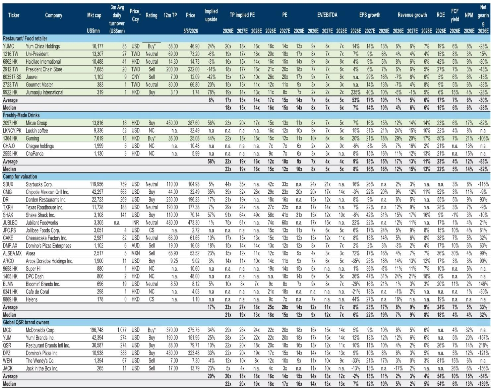
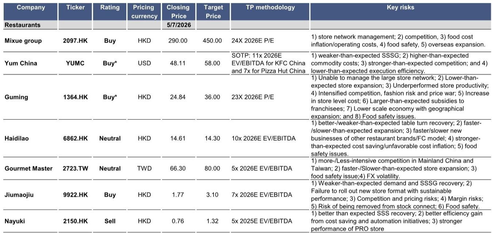
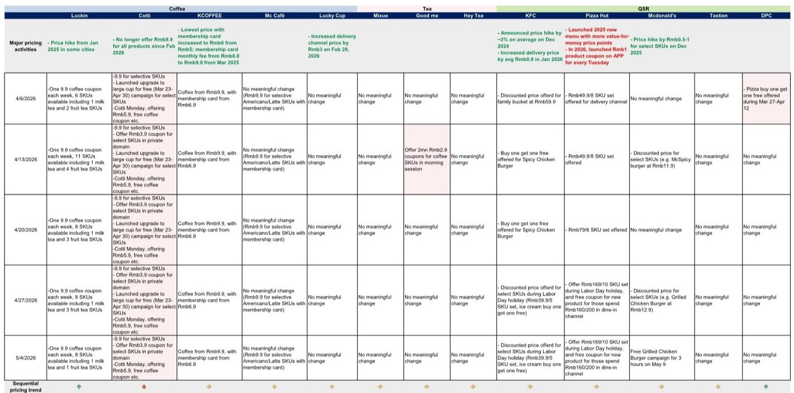

# China's Restaurant Recovery Is Real but Narrow: The Spring Break Tailwind Obscured Structural Divergence

The April data for China's restaurant sector tells a story that at first glance appears encouraging. Same-store sales growth (SSSG) improved sequentially for several major chains, supported by the spring break holiday. Haidilao's table turn growth accelerated to mid-single-digit percentages. Tai Er delivered double-digit SSSG in Mainland China for both its old and new store formats. Yum China described its April performance as solid and an improvement from March. For an observer tracking the sector through aggregate headlines, this looks like a recovery gaining momentum.

But the Labor Day holiday that followed punctured that narrative. Across the board, brands reported deceleration in SSSG during the Labor Day period, with freshly made drink players seeing generally negative readings. This was not a simple seasonal blip. The pattern reveals a deeper structural reality: the recovery in China's restaurant sector is real but narrow, and the spring break tailwind temporarily masked a more concerning divergence between brands that have genuine product and format momentum and those that are merely riding base effects.

The critical insight from this month's data is that the sector is no longer moving as a single cycle. We are entering a phase where brand-specific execution, store format innovation, and category positioning will determine winners and losers far more than the macro backdrop. The aggregate recovery narrative is a distraction. The real question for investors is which brands have built the operational and strategic moats to sustain performance when the easy comps fade.

## The Spring Break Bounce Was Real, but It Masked a Weakening Trend into Labor Day

April's sequential improvement was genuine. For Haidilao, table turn growth accelerated from March levels and matched the January-February average. Tai Er's SSSG strengthened versus March, with both old and new store formats contributing. These are not trivial movements in a sector that has been under pressure.

Yet the Labor Day holiday revealed a different picture. Haidilao's average daily table turn during the holiday was over 5x, but this was largely flat year-on-year. For a brand that had been showing acceleration, this stall matters. Tai Er's SSSG during Labor Day, while still positive at mid-to-high single digits, was notably slower than the double-digit growth seen in April. The freshly made drink players fared worse: Nayuki reported a roughly 30% SSSG decline during the holiday, while other brands in the category generally saw negative readings.

The report attributes this deceleration partly to weather headwinds and traffic distraction from the earlier spring break. But this explanation is insufficient. If demand were genuinely strengthening, a single holiday period should not reverse the trajectory. The more likely interpretation is that April's strength was a pull-forward effect. Consumers shifted their dining and travel spending from Labor Day to spring break, leaving the later holiday with a demand deficit.

This pattern has second-order implications for how investors should read future data. When a holiday-induced spike is followed by a sUBSequent holiday slump, it suggests that underlying consumer demand is not expanding. It is being redistributed across time. For restaurant chains, this means that same-store sales growth driven by calendar effects is not sustainable. The real test is whether a brand can generate growth during ordinary, non-holiday periods. The data on that question remains inconclusive, and that uncertainty should give investors pause.

## The Freshly Made Drink Category Is Entering a Base-Effect Trap That Few Brands Will Escape Cleanly

The most striking divergence in the April data is between the full-service restaurant chains and the freshly made drink (FMD) players. While Haidilao and Tai Er showed acceleration, FMD brands generally saw SSSG deceleration from the first quarter. The report notes that high base impact is kicking in for this category, and the Labor Day data confirms the trend: Nayuki's 30% decline is the most dramatic example, but even Guming, which management described as performing in line with expectations, is facing a period of implied SSSG decline of high-single-digit to 10% in the second and third quarters of 2026.

This is a classic base-effect trap. The FMD category benefited from aggressive delivery sUBSidies and promotional activity in the prior year, which artificially inflated same-store sales. As those sUBSidies normalize, the reported SSSG is reverting to a lower baseline that reflects genuine consumer demand. The report explicitly states that "delivery sUBSidy continued seeing normalization and some freshly made drink brands noted yoy delivery mix decline in Labor Day holiday."

The danger for investors is mistaking a temporary sUBSidy-driven boost for sustainable demand. The FMD category is now entering a period where the year-on-year comparisons become progressively more difficult. Even if underlying demand is stable, the reported numbers will look weak. The brands that will outperform are those that can offset the base effect through genuine product cycle momentum or new store format innovation. Guming's management is betting on category expansion and new products to provide support, but the report's implied SSSG trajectory suggests a challenging two to three quarters ahead.

This creates a strategic question that the report does not fully answer: at what point does the base effect wash out, and how much of the current deceleration is structural versus mechanical? The answer determines whether current valuations for FMD names are opportunities or value traps. Investors need to differentiate between brands that have genuine product and format advantages and those that were simply beneficiaries of a sUBSidy cycle that is now ending.

## Store Format Innovation Is Becoming the Single Most Important Performance Differentiator

Among the brands that outperformed in April and Labor Day, a common thread emerges: store format innovation. Tai Er's new store format consistently outperformed its old format, delivering double-digit SSSG during both periods while the old format managed only slight positive growth. Haidilao's performance, while improving, still shows a table turn recovery level of roughly 80% compared to 2019, suggesting that its existing format has not fully recaptured pre-pandemic demand. The divergence between brands with new formats and those without is becoming stark.

This is not merely a cosmetic change. Store format innovation in China's restaurant sector now encompasses menu diversification, service model changes, and store design upgrades. Tai Er's upgraded fresh concept and diversified food offerings are cited as key drivers of its outperformance. The new format is not just a different look; it is a different value proposition that resonates with consumers who are becoming more discerning in their dining choices.

The strategic implication is that the sector is moving from a phase where store count growth was the primary driver of revenue to a phase where same-store productivity is the battleground. Brands that cannot innovate their store format will see their existing stores stagnate, while those that can will capture a disproportionate share of consumer spending. This is particularly important in a macro environment where overall dining frequency may be flat or declining. The report's data shows that even during a strong holiday period like Labor Day, Haidilao's table turn was largely flat year-on-year. In a zero-sum demand environment, the winner is the brand that gives consumers a reason to choose it over alternatives.

The open question that the report leaves for investors is whether the new format advantage is sustainable or whether it will be quickly copied by competitors. If Tai Er's new format is truly differentiated and difficult to replicate, it represents a durable competitive advantage. If it is a temporary novelty, the outperformance will fade as competitors launch their own format upgrades. The data does not yet provide a clear answer, and this uncertainty is precisely where the most important analytical work lies.

## The Labor Day Data Raises More Questions Than It Answers About Consumer Health

The Labor Day performance across the sector was, in the report's words, "unexCiting" and "consistent with moderate demand." But this characterization may understate the concern. For a sector that had been showing sequential improvement through April, a flat-to-negative holiday performance is a warning signal. It suggests that the improvement was not driven by a fundamental recovery in consumer willingness to spend, but by temporary factors that have now faded.

The report notes that during Labor Day, "brands generally saw SSSG deceleration, in line with the relatively soft travel/moderate demand during the holiday." This is a critical admission. If travel and dining demand were moderate during a major holiday period, what does that imply for ordinary periods? The spring break pull-forward effect can explain some of the weakness, but it cannot explain all of it. The underlying consumer behavior appears to be one of caution, with spending concentrated in specific periods and categories rather than broad-based.

This has direct implications for portfolio construction in the restaurant sector. Brands that rely on holiday-driven traffic spikes are vulnerable to a demand environment where consumers are increasingly selective about when and where they spend. Brands that can generate consistent traffic during ordinary periods, through loyalty programs, value positioning, or product innovation, are better positioned. The report's data on delivery mix decline and sUBSidy normalization further reinforces this point: the artificial demand boosters are being removed, and the sector is being forced to compete on genuine consumer appeal.

The unanswered question is whether this caution is temporary or structural. If it is temporary, the current weakness represents a buying opportunity for the strongest brands. If it is structural, the sector faces a prolonged period of margin compression and store rationalization. The report provides data but not a definitive answer, and that ambiguity is where the most valuable analytical insight can be generated.

## A Decision Framework for Navigating the Divergence

For investors seeking to act on this data, the key is to move beyond aggregate SSSG comparisons and develop a framework that separates temporary effects from durable advantages. Based on the patterns in the April and Labor Day data, three factors should determine how to evaluate a restaurant brand's trajectory.

First, assess the source of SSSG improvement. Was it driven by calendar effects, base effects, or genuine operational improvement? Haidilao's April acceleration came from a low base, and its Labor Day performance was flat. That is a warning. Tai Er's improvement, by contrast, was driven by a new store format that generated double-digit growth even during a weaker holiday period. That is a signal of genuine momentum.

Second, evaluate the sustainability of the brand's category position. The FMD category is facing a high base and sUBSidy normalization that will pressure SSSG for at least two to three quarters. Brands in this category need to demonstrate that they can maintain or grow transaction volume even as average ticket size normalizes. Guming's management is betting on category expansion and new products, but the data does not yet confirm this strategy is working at scale.

Third, monitor the store format innovation cycle. The report's data strongly suggests that brands with new, differentiated store formats are outperforming those without. The question is whether this advantage is sustainable or whether it will be competed away. Investors should track the pace of format adoption across the sector and the extent to which new formats are driving genuine incremental demand versus cannibalizing existing stores.

This framework leads to a clear but uncomfortable conclusion: the sector is not going to recover uniformly. The winners will be those brands that can demonstrate genuine operational and strategic advantages, not those that simply benefit from favorable calendar or base effects. The losers will be those that mistake temporary tailwinds for sustainable demand.

## What the Report Does Not Yet Answer

As thorough as the April tracking data is, it leaves several critical questions unresolved. The most important is the trajectory of consumer demand outside of holiday periods. The report provides detailed SSSG data for April and Labor Day, but it does not provide a clear picture of how brands performed during the ordinary weeks between these events. If April's improvement was concentrated in the spring break period, and Labor Day was weak, what does the underlying trend look like?

A second unresolved question is the extent to which store format innovation is a sustainable competitive advantage. Tai Er's new format is outperforming today, but how quickly will competitors replicate it? If format innovation becomes table stakes rather than a differentiator, the current outperformance may fade.

Third, the report does not fully address the impact of delivery sUBSidy normalization on the FMD category's profitability. SSSG decline is one thing, but if it is accompanied by margin compression due to the removal of sUBSidies, the earnings impact could be significantly worse than the revenue numbers suggest.

These open questions are not weaknesses of the report. They are invitations for deeper analysis. The data provides the raw material, but the interpretation requires a strategic lens that goes beyond what any single monthly tracker can provide.

Join the community to read the full report and review the original charts.

*This article is for learning and discussion only and does not constitute investment advice.*

Personal reading notes and learning share only. Not investment advice.

