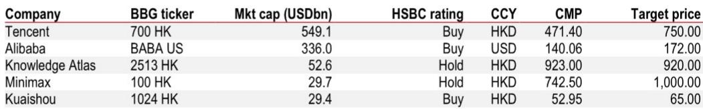

# China's AI Race Is No Longer About Model Architecture — The Real Battle Is in Post-Training, Data, and Monetization

The dominant narrative around Chinese large language models has long centered on which company can build the most advanced base model. That framing is becoming obsolete. According to a DeepSeek product manager speaking at a recent investor event, the competitive frontier has shifted decisively away from pre-training architecture and toward post-training strategy, data quality, talent depth, and the ability to monetize through ecosystems rather than raw token sales. The implication is stark: companies that treat AI as a model-building contest will lose to those that treat it as a full-stack product and services challenge.

China's AI landscape is not a monolithic catch-up story. It is a fragmented, multi-layered competition where hyperscalers and independent labs face fundamentally different strategic choices. The US still leads in agentic capability by 8-12 months and in multimodal ability by roughly six months, but the gap in video generation is negligible. The more important insight is that chip supply constraints, while real, are not the binding constraint on China's AI progress — data quality and talent availability matter more. The expert estimates domestic chips can cover 40-45% of inference demand by end-2026, and up to 50% with breakthroughs in 7nm-class production. But for training, domestic chips remain largely experimental.

This is not a story about technological parity or inferiority. It is a story about strategic differentiation under constraints. The companies that will win in China's AI market are those that can turn constrained compute into a competitive advantage by excelling where the US cannot easily follow: deep integration with massive consumer ecosystems, cost-efficient inference at scale, and service-led monetization models that decouple revenue from token consumption.

## The Coding and Agentic Capability Race Favors Companies with Ecosystem Depth, Not Just Model Quality

The expert ranks Zhipu, Kimi, and DeepSeek as the leading domestic players in coding capability, driven by four factors: post-training strategy, data quality, talent that understands both LLMs and programming languages, and chip resources. Notice what is not on that list: base model architecture. Pre-training has become commoditized enough that differentiation comes from what happens after the model is built — how it is fine-tuned, what data it is trained on for specific tasks, and how it is integrated into real workflows.

For agentic capability, the rankings shift. Alibaba's Qwen, Kimi, and DeepSeek lead, but the expert explicitly notes that Tencent and Alibaba benefit from their vast ecosystems — user bases, high-quality proprietary data, and ready-made products for integration. Independent labs differentiate through base-model iteration and architecture. This is a critical distinction: hyperscalers can afford to have slightly weaker models because their distribution and data moats compensate. Independent labs must win on technical merit alone, which is a harder path.

The US lead in agentic capability — 8-12 months — is not primarily about chips. It is about mature tool suites, skills, and deployment-ready agent products within established ecosystems. China has budget-friendly "agent-ready" models but lacks the productized agent layers that make agents actually useful for enterprises. This gap will not close through model improvements alone. It requires building the infrastructure, standards, and integration patterns that turn a model into a deployable agent.

## Chip Constraints Are Real but Not Decisive — The Binding Bottleneck Is Data and Talent

The expert's estimate that domestic chips cover under 40% of current inference demand, with improvement to 40-45% by end-2026, is sobering but not catastrophic. The more important finding is that chip shortages are not the decisive factor for China's lag versus the US. The US advantage in data quality and talent availability matters more.

This reframes the entire debate about US export controls. If the binding constraint were chips, then relaxing controls would rapidly close the gap. But if the constraint is data and talent, then chip access alone will not solve the problem. Chinese companies face structural disadvantages in both areas: high-quality English-language training data is harder to access, and the pool of researchers who combine deep LLM expertise with domain-specific knowledge is smaller.

The expert's view that manufacturing capacity constraints and continued dependence on the CUDA software ecosystem are key bottlenecks for domestic chip adoption is worth emphasizing. Even if Chinese chipmakers can produce competitive hardware, the software stack — CUDA's libraries, tools, and optimization patterns — represents years of accumulated engineering that cannot be replicated quickly. Domestic chips will improve, but the software ecosystem gap will persist longer than the hardware gap.

## Monetization Is Shifting from Token Sales to Service-Led Models — DeepSeek's Price Cuts Are a Tactical Land Grab

The expert's observation about monetization strategies reveals a fundamental divergence between US and Chinese approaches. US players rely on closed ecosystems with high-priced sUBScriptions, especially SaaS-like B2B products. Chinese internet platforms monetize indirectly through traffic and ecosystem cross-selling — cloud, e-commerce, super-app entry points. Independent labs combine consumer memberships with B2B API and private deployment fees for licensing, fine-tuning, and maintenance.

DeepSeek's price cuts are not a sign of desperation. They are a tactical move to gain market share in a market where token prices are expected to trend lower over the long run. The expert expects monetization to shift toward service-led use cases and tailored workflow solutions, priced based on value delivered rather than raw token consumption. This is a fundamentally different business model from the US approach. It is also harder to execute because it requires deep vertical expertise and the ability to deliver measurable outcomes, not just compute.

The strategic implication for investors is clear: companies that can build service-led monetization models around their AI capabilities will outperform those that rely on token volume. This favors hyperscalers with existing enterprise relationships and independent labs that can develop deep vertical expertise. Pure-play model providers without ecosystem or service layers face a challenging path to profitability.

## What the Report Does Not Fully Answer: The Sustainability of Independent Labs and the Timing of Agentic Productization

The expert's analysis leaves several critical questions unresolved. First, can independent labs like DeepSeek and Zhipu sustain their competitive position without the ecosystem advantages of Tencent or Alibaba? The expert notes that independent labs differentiate through base-model iteration and architecture, but this is a costly strategy that requires continuous access to compute, talent, and data. As token prices fall and hyperscalers integrate AI more deeply into their ecosystems, independent labs may find their margin for differentiation shrinking.

Second, when will China's agentic capability gap with the US begin to close? The expert estimates an 8-12 month lag, but this gap is driven by productized agent layers, not model quality. Closing it requires building deployment infrastructure, standards, and integration patterns — which are harder to accelerate than model training. The report does not provide a timeline for when Chinese companies might achieve parity in agentic productization.

Third, how will the chip supply constraint evolve if US export controls tighten further? The expert's estimate of 40-45% domestic chip coverage for inference by end-2026 assumes current trends continue. A significant escalation in export controls could disrupt this trajectory, especially for training capacity. The report does not model this scenario.

Fourth, what is the actual market size for service-led AI monetization in China? The expert expects monetization to shift toward value-based pricing, but the addressable market for tailored workflow solutions remains unclear. If enterprise willingness to pay for AI services is lower than expected, the shift from token sales may not generate sufficient revenue to sustain current investment levels.

## A Decision Framework for Evaluating Chinese AI Companies

Investors should evaluate Chinese AI companies across four dimensions, weighted by business model:

**Ecosystem depth (40% weight for hyperscalers, 10% for independent labs):** Does the company have proprietary data, a large user base, and existing products that can integrate AI capabilities? Tencent and Alibaba score highly here. Independent labs must compensate through technical excellence.

**Post-training and data quality (30% weight for all):** How sophisticated is the company's post-training strategy? Does it have access to high-quality, domain-specific data? The expert's ranking of coding and agentic capability provides a useful starting point for assessment.

**Monetization model maturity (20% weight for all):** Is the company building service-led revenue streams or relying on token sales? Companies with existing enterprise relationships and vertical expertise have an advantage.

**Chip and compute resilience (10% weight for all):** How dependent is the company on advanced chips for training? Does it have a plan to shift inference to domestic chips? This factor matters more for training-intensive independent labs than for hyperscalers with diversified compute needs.

This framework suggests that hyperscalers with deep ecosystems and service-led monetization models are the safest bets. Independent labs with strong technical differentiation but limited ecosystem access face higher risk, though they offer higher potential upside if they can develop vertical expertise and service layers before the market consolidates.

Join the community to read the full report and review the original charts.

*This article is for learning and discussion only and does not constitute investment advice.*

Personal reading notes and learning share only. Not investment advice.

